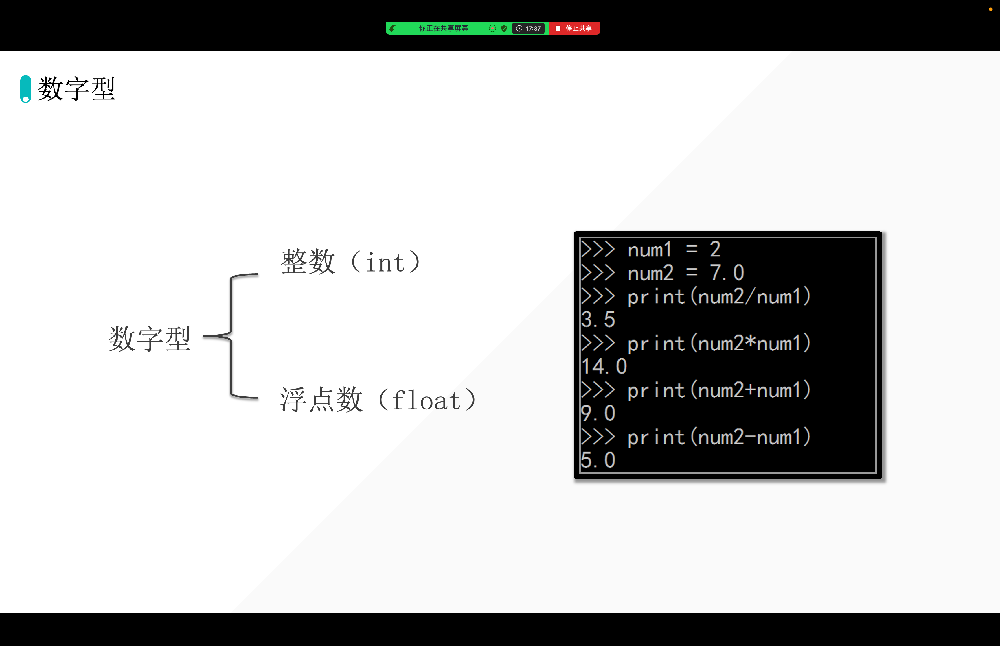
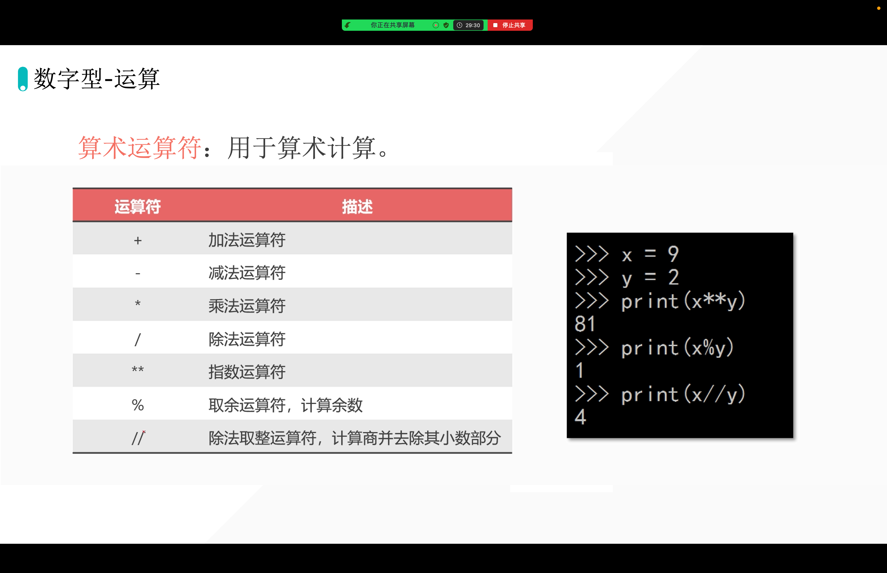
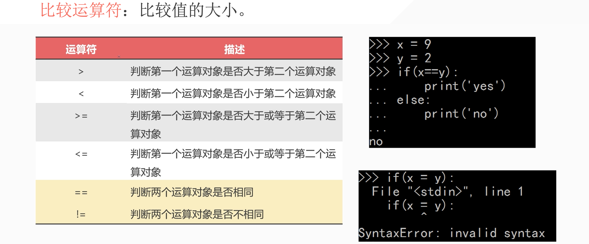
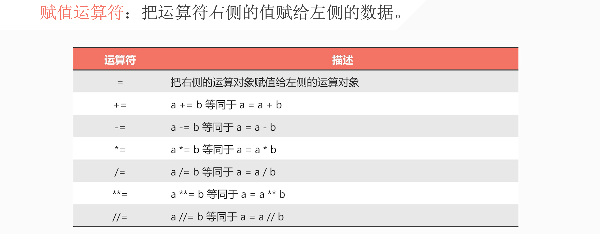
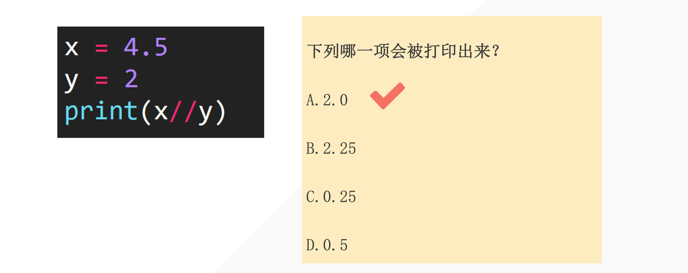

## 1. 数字型



```python
In [1]: 1 + 1
Out[1]: 2

In [2]: 1 + 1.0
Out[2]: 2.0

In [3]: 3 - 1
Out[3]: 2

In [4]: 3 - 1.0
Out[4]: 2.0

In [5]: 4.1 * 2
Out[5]: 8.2

In [6]: 4 * 2
Out[6]: 8

In [7]: 9 / 3
Out[7]: 3.0
```

::: tip 总结

1. 如果，其中有一个数据类型是小数的话，最后的结果就是浮点数「优先级最高」
2. 除法涉及精度问题，所以最后是浮点数。

:::

## 2. 运算符



## 小试牛刀

- 任意两位数整数
- 拆分出，它的个位与十位
- Q1: 个位和十位分别输出
- Q2: 个位和十位之和
- Q3: 
    - 12 21 
    - 53 35 
    - 99 99 
    - 98 89

```python
def _split(num):
    if len(num) != 2:
        print("no")
        return 0
    else:
        # num = str(num)
        a, b = num[0], num[1]

        return a, b


if __name__ == "__main__":
    a = int(input())
    w1 = _split(a)
    print(w1)
    print(w1[0])
    print(w1[1])
```

```python
a = 25
sw = a // 10
gw = a % 10

print(gw*10+sw)
```

## 3. 比较运算符



```python
a = 10
b = 26
print(a > b)

a = 11
b = 11
print(a == b)  # True

a = 10
b = 100
print(a < b)  # True
print(a <= b)  # True

a = 10
b = 100
print(a != b)
```

## 4. 赋值运算符



## 5. 练习



```python
a = 1
a = a + 10
print(a)

a = 1
a += 10
print(a)
```


::: details 公众号：AI悦创【二维码】


:::

::: info AI悦创·编程一对一

AI悦创·推出辅导班啦，包括「Python 语言辅导班、C++ 辅导班、java 辅导班、算法/数据结构辅导班、少儿编程、pygame 游戏开发、Web、Linux」，全部都是一对一教学：一对一辅导 + 一对一答疑 + 布置作业 + 项目实践等。当然，还有线下线上摄影课程、Photoshop、Premiere 一对一教学、QQ、微信在线，随时响应！微信：Jiabcdefh

C++ 信息奥赛题解，长期更新！长期招收一对一中小学信息奥赛集训，莆田、厦门地区有机会线下上门，其他地区线上。微信：Jiabcdefh

方法一：[QQ](http://wpa.qq.com/msgrd?v=3&uin=1432803776&site=qq&menu=yes)

方法二：微信：Jiabcdefh

:::


