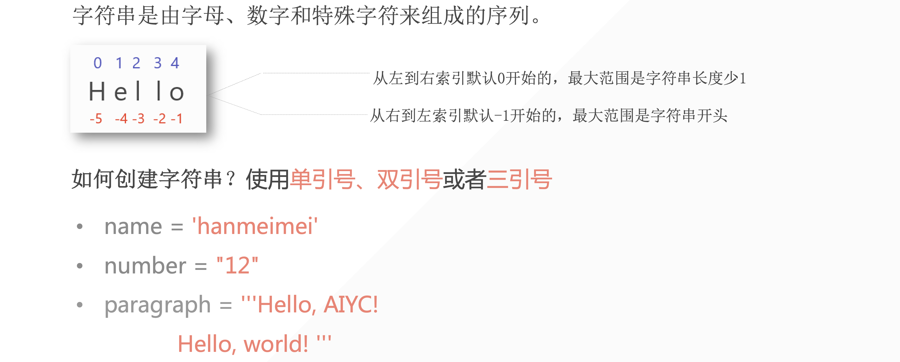
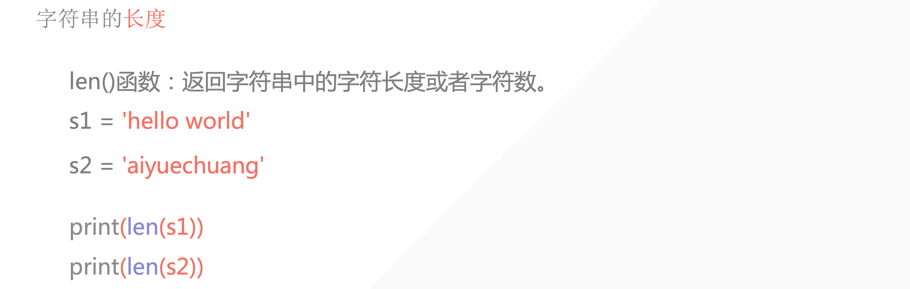
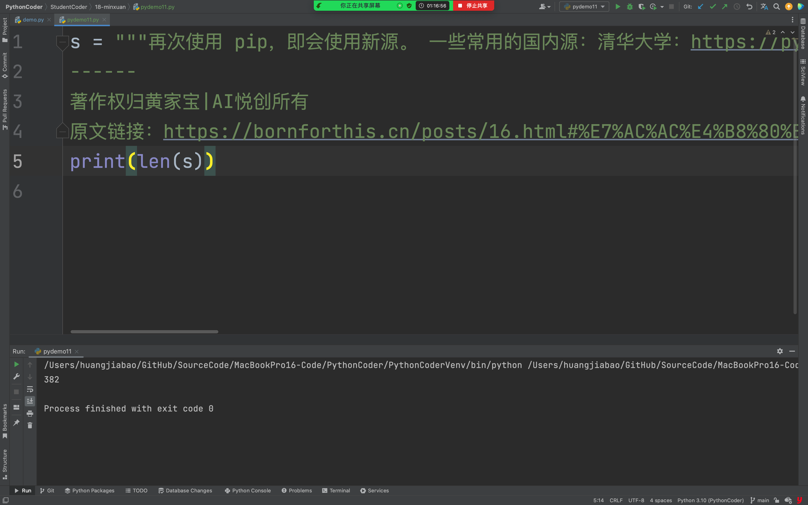
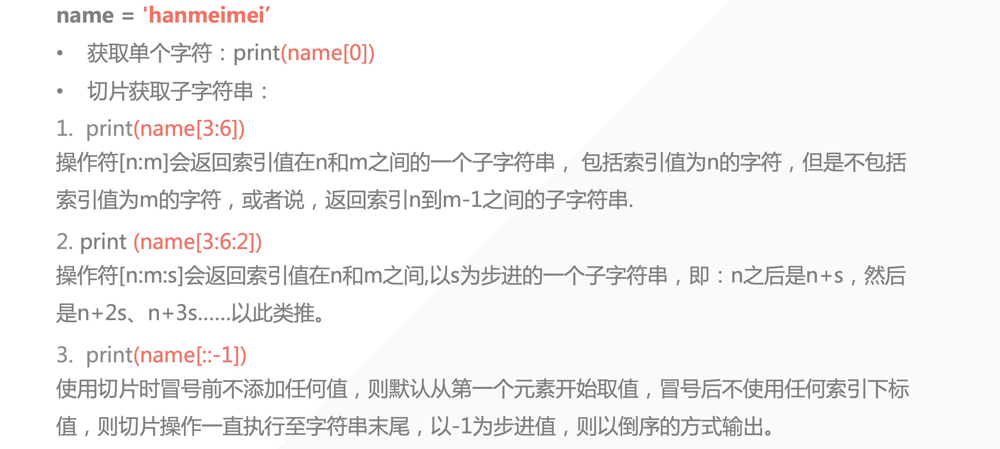
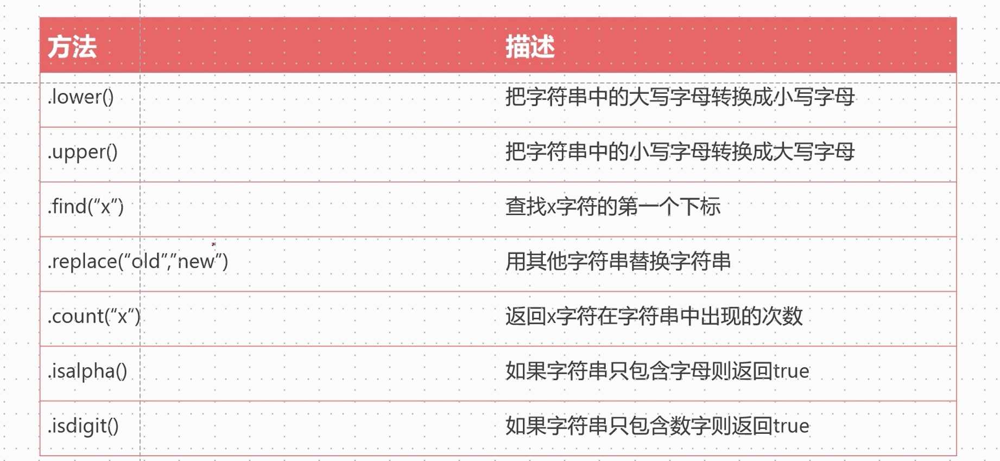
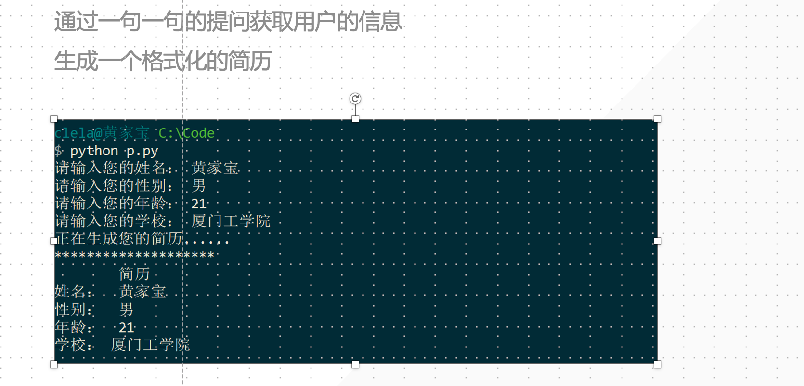

## 1. 字符串的定义



1. 单双引号混用
2. 三个单引号或者三个双引号都是字符串

```python
s = """再次使用 pip，即会使用新源。 一些常用的国内源：清华大学：https://pypi.tuna.tsinghua.edu.cn/simpleopen in new window阿里云：https://mirrors.aliyun.com/pypi/simpleopen in new window中国科学技术大学 https://pypi.mirrors.ustc.edu.cn/simpleopen in new window豆瓣：http://pypi.douban.com/simpleopen in new window# 第二种方法
------
著作权归黄家宝|AI悦创所有
原文链接：https://bornforthis.cn/posts/16.html#%E7%AC%AC%E4%B8%80%E7%A7%8D%E6%96%B9%E6%B3%95"""
print(s)
```

## 2. 获取字符串长度





## 字符串的数据提取









```python
def sun_fun(a, b, c):
    if c == '+':
        return a + b
    elif c == '-':
        return a - b
    elif c == "*":
        return a * b
    elif c == "/":
        return a / b


def loop():
    while True:
        target = input(">>")
        if target.lower() == "q":
            break
        targets = target.split(",")
        a, b = map(int, targets[:2])
        c = targets[2]
        print(a, b, c)
        print(sun_fun(a, b, c))


if __name__ == '__main__':
    loop()
```

---


::: details 公众号：AI悦创【二维码】


:::

::: info AI悦创·编程一对一

AI悦创·推出辅导班啦，包括「Python 语言辅导班、C++ 辅导班、java 辅导班、算法/数据结构辅导班、少儿编程、pygame 游戏开发、Web、Linux」，全部都是一对一教学：一对一辅导 + 一对一答疑 + 布置作业 + 项目实践等。当然，还有线下线上摄影课程、Photoshop、Premiere 一对一教学、QQ、微信在线，随时响应！微信：Jiabcdefh

C++ 信息奥赛题解，长期更新！长期招收一对一中小学信息奥赛集训，莆田、厦门地区有机会线下上门，其他地区线上。微信：Jiabcdefh

方法一：[QQ](http://wpa.qq.com/msgrd?v=3&uin=1432803776&site=qq&menu=yes)

方法二：微信：Jiabcdefh

:::


