回放云盘链接：[https://www.aliyundrive.com/s/7CVjni4oR8P](https://www.aliyundrive.com/s/7CVjni4oR8P)

```bash
66-明轩
https://www.aliyundrive.com/s/7CVjni4oR8P
点击链接保存，或者复制本段内容，打开「阿里云盘」APP ，无需下载极速在线查看，视频原画倍速播放。
```


你好，我是悦创。

目前接触的是：

- [ ] Python：基本上不会，用现成的代码
- [ ] Web：HTML、CSS、JavaScript 接触过一点
- [ ] Git：没怎么接触
- [ ] 易语言：Hook，用途不够广泛，当作脚本，当前电脑微信的文件 Hook 注入

- 软件工程

## Python 能做哪些东西

### Python 应用场景

- Python 基础「优先解决的 Python 基础」
- 爬虫：爬虫抓数据，数据时代，数据的重要性不言而喻，Python、Web、数据库
- GUI：tkinter、PyQt5
- 数据分析：Python 基础、大学知识：概率论、高数，数学知识
- Web 开发：Django、Flask：Python 基础、Web 基础
- 游戏开发：Pygame：Python 基础、直接用库开发，Python 快速开发游戏 demo
- 办公自动化
- 人工智能

### Web

- 个人博客开发：利用现成的开源，搭建一个自己的博客，涉及的点比较多，成本低，搭建一个属于自己的网站，记录所学的笔记。
- HTML、CSS、JS、Vue 真正的写网页了。

### Java、C++

平时感兴趣的技术

## Markdown

# 1. Markdown 文章编写
效果如下：
# 标题1
## 标题2
### 标题3
#### 标题4
##### 标题5
###### 标题6
Markdown 代码：

```markdown
# 标题1
## 标题2
### 标题3
#### 标题4
##### 标题5
###### 标题6
```

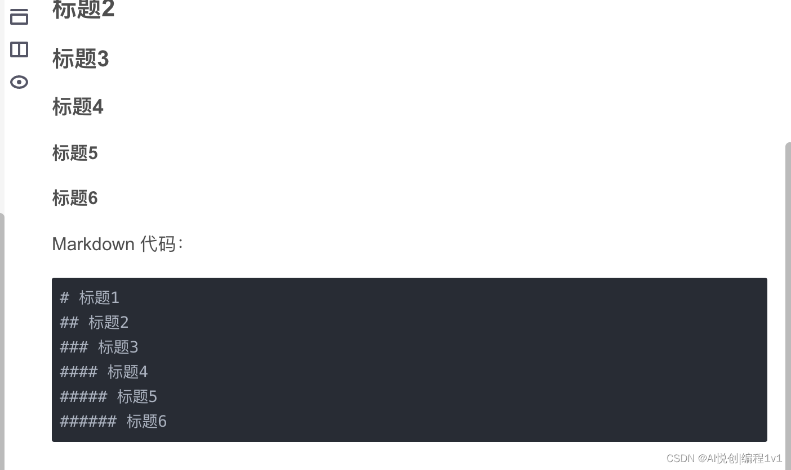
> 这是一段小注解

链接：[https://bornforthis.cn/](https://bornforthis.cn/)

```bash
[https://bornforthis.cn/](https://bornforthis.cn/)
```

## Variable

### 理解变量——生活中的例子

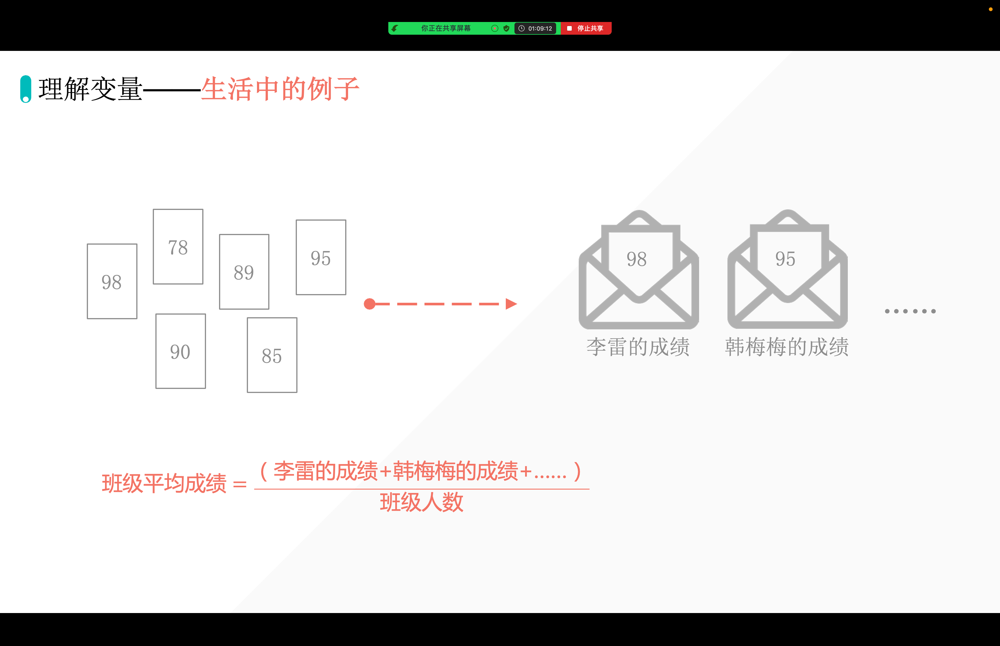

定义：变量，就是在计算机的内存当中，开辟空间。

特点：之前的数据会被覆盖；

### 如何创建变量——赋值语句

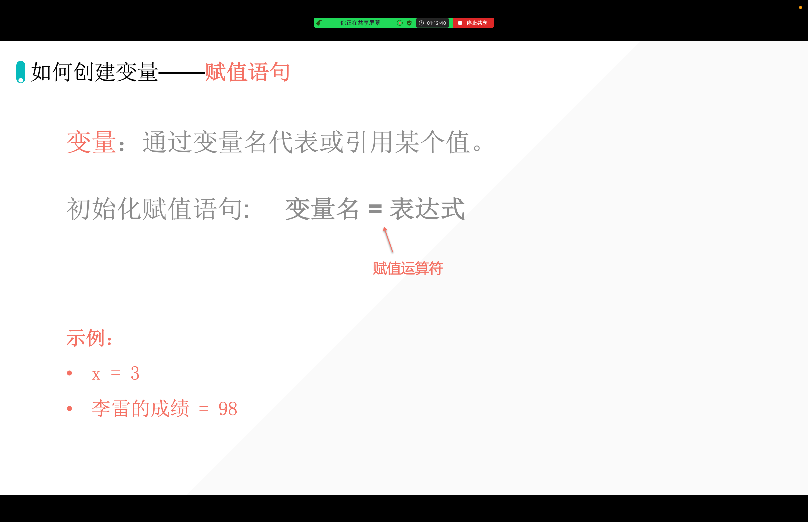

- 代码运行逻辑：从上到下，从右到左
- **最后一步才是赋值**

### 变量的赋值过程

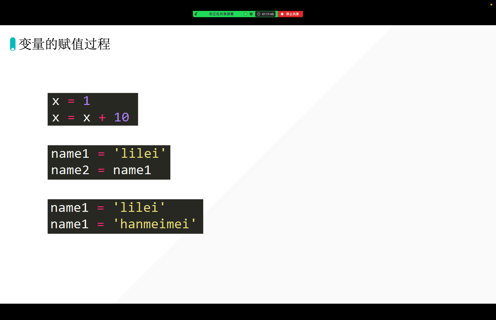

```python
x = 1
x = x + 4
print(x)
# print: 是打印输出
# 井号是 Python 的注释，我们人能看见，计算机看不见
```

```python
name1 = "lilei"
name2 = name1
print(name2)
```

```python
name1 = "lilei"
name1 = "lilei"
name1 = "lilei"
name1 = "lilei"
name1 = "lilei"
name1 = "lilei"
name1 = "lilei"
name1 = "lilei"
name1 = "lilei"
# 适当的加空格，使代码更加美观。Python PEP8 原则
# 快捷键：Control + Alt + L 代码美化、代码格式化
# 快速复制一行：Control + D
```

```python
name1 = "lilei"
name1 = "hanmeimei"
print(name1)
# 覆盖
```

### 多个变量同时赋值

```python
a = 1
b = 1
c = 1
print(a)
print(b)
print(c)
```

```python
a = 1
b = 1
c = 1
# print(a)
# print(b)
# print(c)
print(a, b, c) # 默认会以空格间隔
```

```python
a = 1
b = 1
c = 1
# print(a)
# print(b)
# print(c)
print(a, b, c, sep=" ")
print(a, b, c, sep="PPPPPPPss")
```

输出：

```python
1 1 1
1PPPPPPPss1PPPPPPPss1
```

```python
a = 1
b = 1
c = 1
# print(a)
# print(b)
# print(c)
print(a, b, c, sep=" ", end="\n\n\n")
print(a, b, c, sep="PPPPPPPss")
```

输出：

```python
1 1 1


1PPPPPPPss1PPPPPPPss1
```

## 小练习

- 创建变量 name、age、gender；
- 分别赋值：aiyc，18，m
- 并输出如下格式：
    - 格式1：aiyc 18 m
    - 格式2：aiyc～18～m¥

- 你的答案：

```python
name = 'aiyc'
age = 18
gender = 'm'

print(name, age, gender)

print(name, age, gender, sep='~', end='')
print("￥")
```

```python {1}
print(name, age, gender, sep='~', end='¥')
```

## 同时给多个变量赋值

```python
a = b = c = 1
print(a)
print(b)
print(c)

a, b, c = 1, 2, 3
print(a)
print(b)
print(c)
```

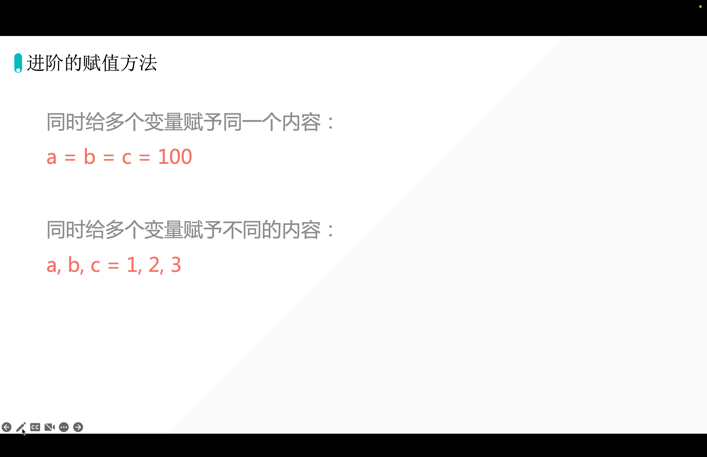

## 交换果汁

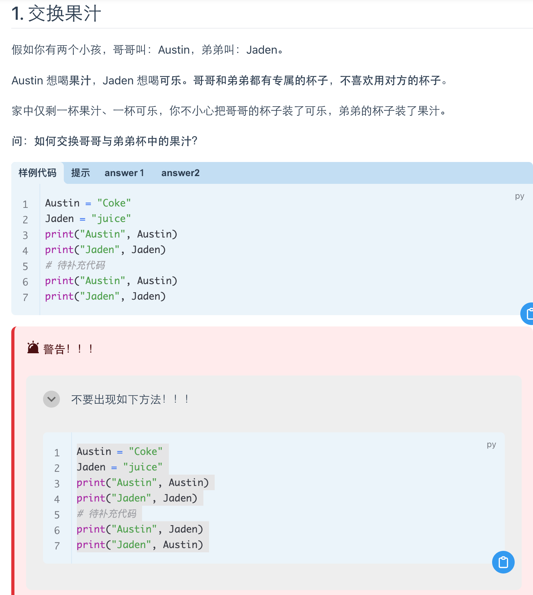

### 代码

::: code-tabs#python

@tab 错误🙅1

```python
Austin = "Coke"
Jaden = "juice"
print( "Austin",Austin)
print( "Jaden",Jaden)
#待补充代码

Austin ='juice'
Jaden = 'Coke'
print("Austin",Austin)
print("Jaden",Jaden)
```

@tab 错误🙅2

```python
Austin = "Coke"
Jaden = "juice"
print( "Austin",Austin)
print( "Jaden",Jaden)
#待补充代码
_temporary_cup_A = 'juice'
_temporary_cup_J = 'Coke'

Austin =_temporary_cup_A
Jaden =_temporary_cup_J
print("Austin",Austin)
print("Jaden",Jaden)
```

@tab AI代码

```python {3}
Austin = "Coke"
Jaden = "juice"
_temporary_cup = ''  # 有没有必要呢？

_temporary_cup = Austin
Austin = Jaden
Jaden = _temporary_cup


#待补充代码


print("Austin",Austin)
print("Jaden",Jaden)
```

@tab 方法

```python {3}
Austin = "Coke"
Jaden = "juice"
Austin,Jaden = Jaden,Austin
#待补充代码
print("Austin",Austin)
print("Jaden",Jaden)
```

:::

## 变量的命名规则

1. 大小写英文；「区分大小写」

```python
name = "aiyc"

Name = "mingxuan"
print(name)
```

2. 数字不能开头；

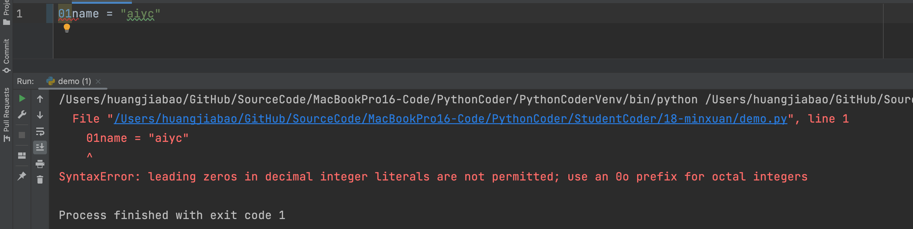

```python
n1a2me = "aiyc"
```

除了变量的开头不能放数字之外，其他位置都可以放数字。

3. 变量不能有空格；

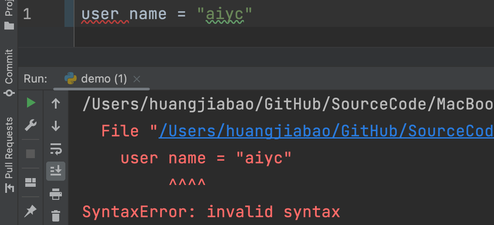

```python
user_name = "aiyc"
```

4. 系统关键词不能当作变量名；

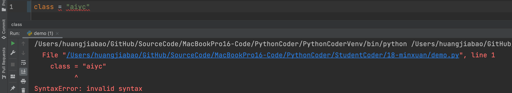

```python
Class = "aiyc"
# cl_ass = "aiyc"
# _class = "aiyc"
# class_ = "aiyc"
```

5. 查看系统关键词；

```python
help("keywords")
```

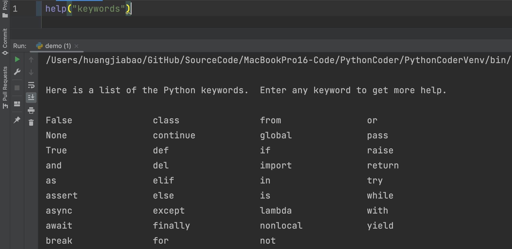

6. 不要使用 Python 的内置函数名做变量名；

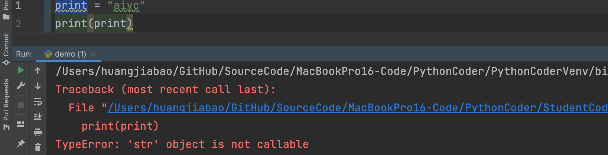

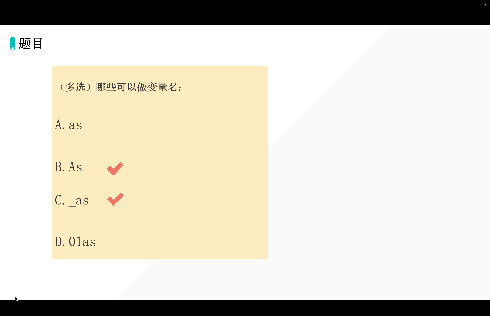


::: details 公众号：AI悦创【二维码】


:::

::: info AI悦创·编程一对一

AI悦创·推出辅导班啦，包括「Python 语言辅导班、C++ 辅导班、java 辅导班、算法/数据结构辅导班、少儿编程、pygame 游戏开发、Web、Linux」，全部都是一对一教学：一对一辅导 + 一对一答疑 + 布置作业 + 项目实践等。当然，还有线下线上摄影课程、Photoshop、Premiere 一对一教学、QQ、微信在线，随时响应！微信：Jiabcdefh

C++ 信息奥赛题解，长期更新！长期招收一对一中小学信息奥赛集训，莆田、厦门地区有机会线下上门，其他地区线上。微信：Jiabcdefh

方法一：[QQ](http://wpa.qq.com/msgrd?v=3&uin=1432803776&site=qq&menu=yes)

方法二：微信：Jiabcdefh

:::


