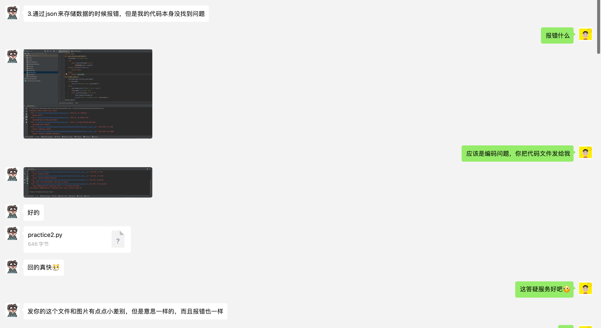

## 答疑记录

本页面为 AI悦创私教提供答疑。

## 题目

### Q3: 通过 json 来存储数据的时候报错，但是我的代码本身没找到问题

学员代码：

```python
import json


def get_stored_username():
    filename = 'username.json'
    try:
        with open(filename) as f:
            username = json.load(f)
    except FileNotFoundError:
        return None
    else:
        return username


def greet_user():
    username = get_stored_username()
    if username:
        print(f"Welcome back,{username}")
    else:
        username = input("What's your name")
        filename = 'username.json'
        with open(filename, 'w') as f:
            json.dump(username, f)
            print(f"We'll remember your {username}")


greet_user()
```

::: details 图片



:::

报错输出：

```python
C:\Users\jin\Desktop\coder\venv\Scripts\python.exe C:\Users\jin\Desktop\coder\practice.py 
Traceback (most recent call last):
  File "C:\Users\jin\Desktop\coder\practice.py", line 29, in <module>
    greet_user()
  File "C:\Users\jin\Desktop\coder\practice.py", line 18, in greet_user
    username = get_stored_username()
  File "C:\Users\jin\Desktop\coder\practice.py", line 8, in get_stored_username
    username = json.load(f)
  File "C:\Users\jin\AppData\Local\Programs\Python\Python39\lib\json\__init__.py", line 293, in load
    return loads(fp.read(),
  File "C:\Users\jin\AppData\Local\Programs\Python\Python39\lib\json\__init__.py", line 346, in loads
    return _default_decoder.decode(s)
  File "C:\Users\jin\AppData\Local\Programs\Python\Python39\lib\json\decoder.py", line 337, in decode
    obj, end = self.raw_decode(s, idx=_w(s, 0).end())
  File "C:\Users\jin\AppData\Local\Programs\Python\Python39\lib\json\decoder.py", line 355, in raw_decode
    raise JSONDecodeError("Expecting value", s, err.value) from None
json.decoder.JSONDecodeError: Expecting value: line 1 column 1 (char 0)
```

::: tip 回复

我这边运行正常，为能成功复现问题。尝试远程操作复现。

不能提前创建 `username.json` 这个文件，第一次运行程序的时候，他会判断文件是否存在「处理文件不存在的情况」，如果文件不存在，则进入获取用户输入的步骤。

如果文件存在，则直接读取文件内容，并输出。

:::

::: tip 提示

后面的可以点击更多阅读。

:::


::: details 公众号：AI悦创【二维码】


:::

::: info AI悦创·编程一对一

AI悦创·推出辅导班啦，包括「Python 语言辅导班、C++ 辅导班、java 辅导班、算法/数据结构辅导班、少儿编程、pygame 游戏开发、Web、Linux」，全部都是一对一教学：一对一辅导 + 一对一答疑 + 布置作业 + 项目实践等。当然，还有线下线上摄影课程、Photoshop、Premiere 一对一教学、QQ、微信在线，随时响应！微信：Jiabcdefh

C++ 信息奥赛题解，长期更新！长期招收一对一中小学信息奥赛集训，莆田、厦门地区有机会线下上门，其他地区线上。微信：Jiabcdefh

方法一：[QQ](http://wpa.qq.com/msgrd?v=3&uin=1432803776&site=qq&menu=yes)

方法二：微信：Jiabcdefh

:::


