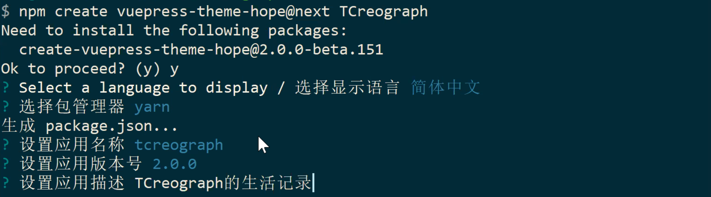
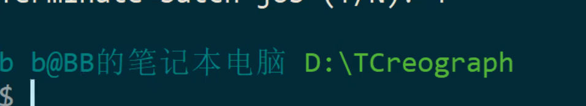
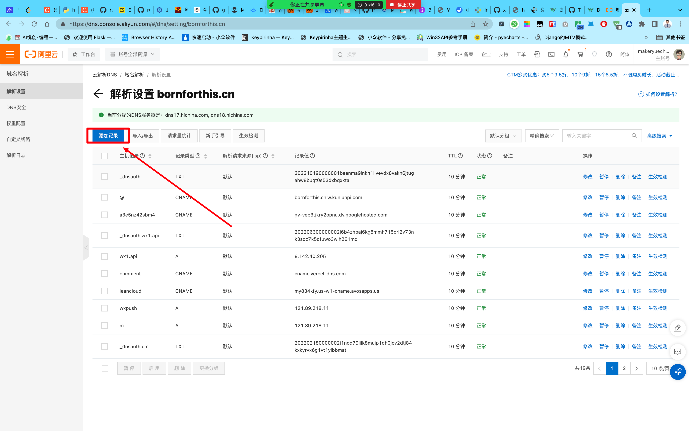
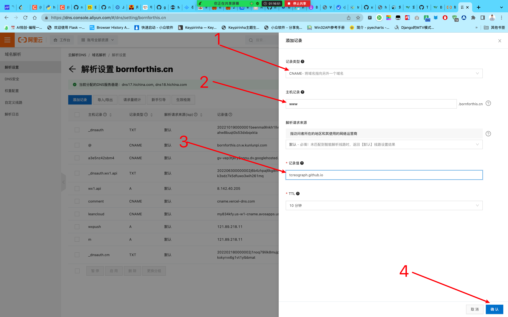
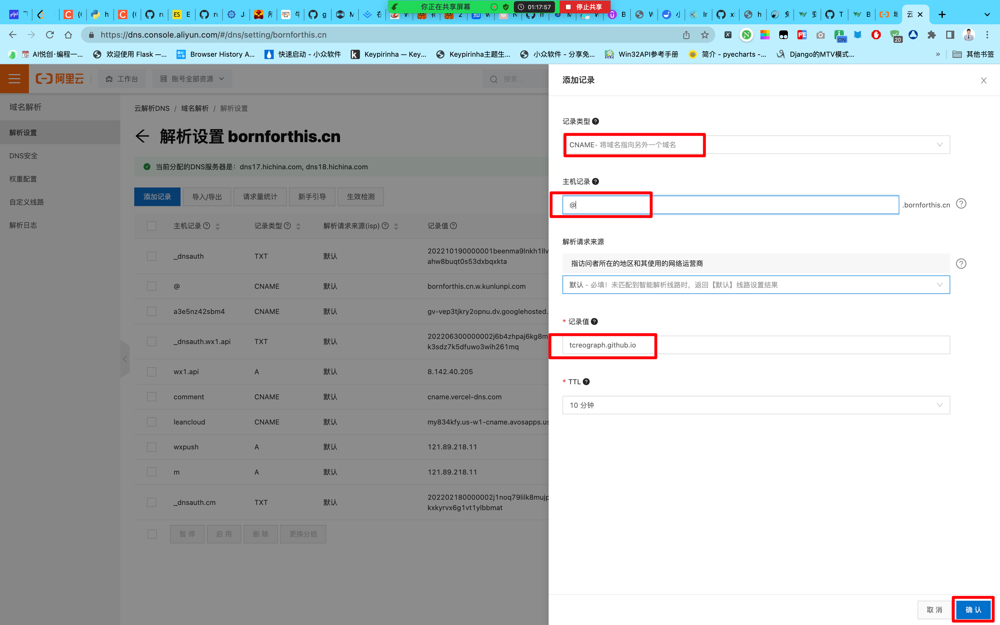
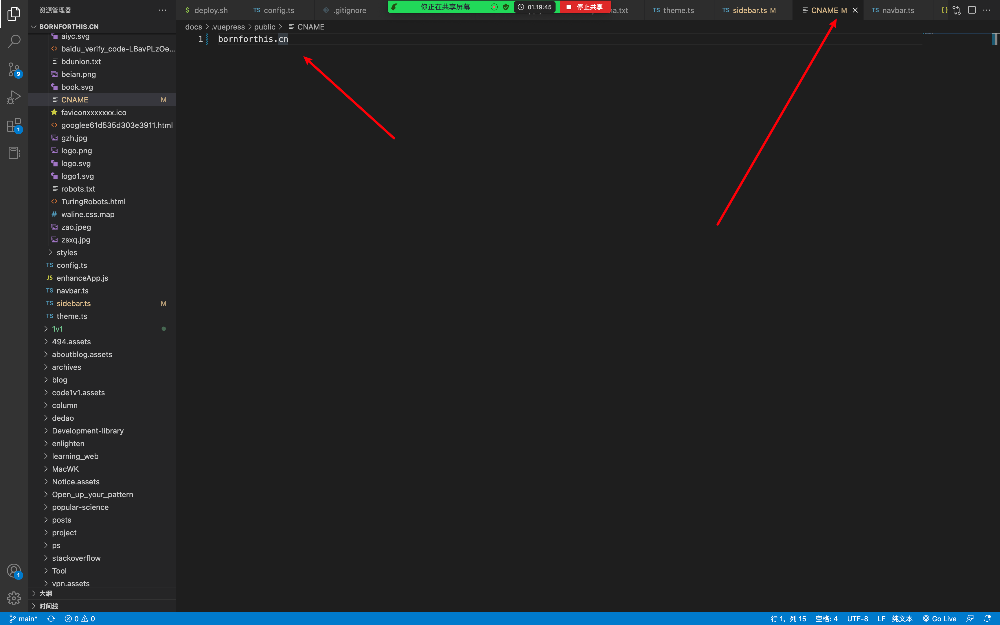
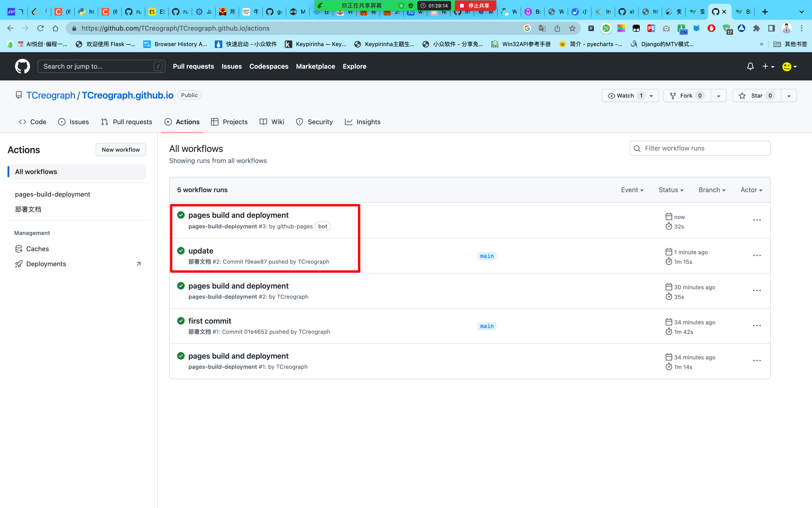
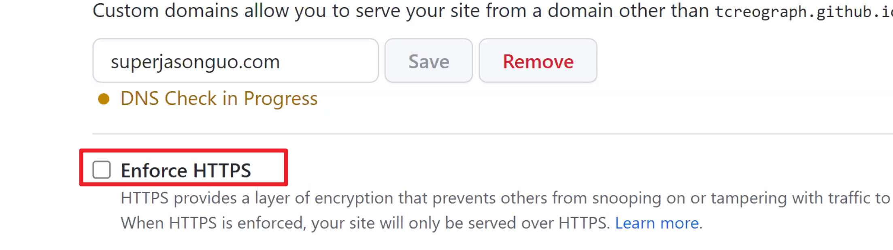

## 1. 网站初始化

### 1.1 选择网站路径

也就是，你想把你的网站安家落户在你电脑的哪里？——D盘

### 1.2 初始化网站命令

```shell
npm create vuepress-theme-hope@next my-docs
```



### 1.3 网站操作路径

`D:\TCreograph\TCreograph`

你以后，要操作你的网站，要运行你的网站，要首先进入到盖路径下，然后再启动**命令行**。



### 1.4 网站启动命令

::: tip 提示

要确保，你当前命令行的位置是：`D:\TCreograph\TCreograph`。

如果不是的话，按 1.3 的方法来操作，或者直接打开命令行，然后输入如下命令：

```shell
cd D:\TCreograph\TCreograph
```

:::

```shell
yarn run docs:dev
```

### 1.5 之后如果要查看网站是否部署完成

你可以访问此链接：[https://github.com/TCreograph/TCreograph.github.io/actions](https://github.com/TCreograph/TCreograph.github.io/actions)

网站链接：[https://tcreograph.github.io/](https://tcreograph.github.io/)

### 1.6 使用 VSCode 打开我们的网站文件夹

**我们所有设置网站都是用 VSCode，写文章用 typora。**


## 2. 如何更换域名

### 2.1 打开阿里云>>>域名>>>选择你的域名>>>解析

### 2.2 添加记录



添加两个记录，第一个记录如下：



第二个记录如下：



### 2.3 VSCode 中修改 CNAME

路径：`src/.vuepress/public/` 这个路径下的 CNAME




## 3. 部署网站

### 3.1 进入你的网站文件夹

路径：`D:\TCreograph\TCreograph`

在这个文件夹中，空白地方。

1. 鼠标右键
2. git bash here
3. 

## 指令汇总

- 程序「网站运行中」运行当中，要退出使用快捷键：Ctrl + C
- 网站启动命令：`yarn run docs:dev`
- 输入命令：

```shell
git pull
git add .
git commit -m "update"
git push
```





## 下节课画一个脑图，逻辑画出来


## 评价

- 嫌弃域名不好听，这个嘛，自己沟通啦～
- 理解能力目前来看，有点......超强鸭！nice
- 总体很顺利，天选之子呀～
- GO！GO！GO！

- 域名购买链接：[https://wanwang.aliyun.com/](https://wanwang.aliyun.com/)
    - com、cn、net、top

::: details 公众号：AI悦创【二维码】


:::

::: info AI悦创·编程一对一

AI悦创·推出辅导班啦，包括「Python 语言辅导班、C++ 辅导班、java 辅导班、算法/数据结构辅导班、少儿编程、pygame 游戏开发、Web、Linux」，全部都是一对一教学：一对一辅导 + 一对一答疑 + 布置作业 + 项目实践等。当然，还有线下线上摄影课程、Photoshop、Premiere 一对一教学、QQ、微信在线，随时响应！微信：Jiabcdefh

C++ 信息奥赛题解，长期更新！长期招收一对一中小学信息奥赛集训，莆田、厦门地区有机会线下上门，其他地区线上。微信：Jiabcdefh

方法一：[QQ](http://wpa.qq.com/msgrd?v=3&uin=1432803776&site=qq&menu=yes)

方法二：微信：Jiabcdefh

:::

