## 1. 逻辑画出来


## 2. 修改网站配置

### 2.1 src/.vuepress/config.ts

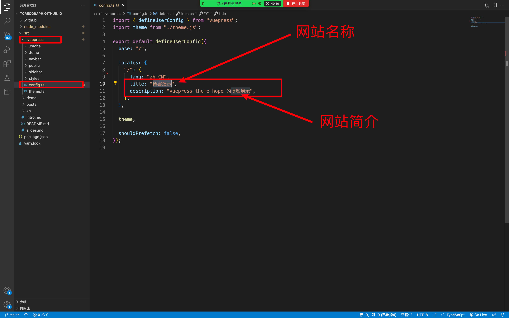

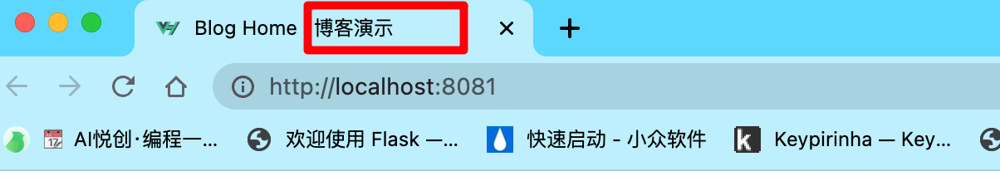

### 2.2 src/.vuepress/theme.ts

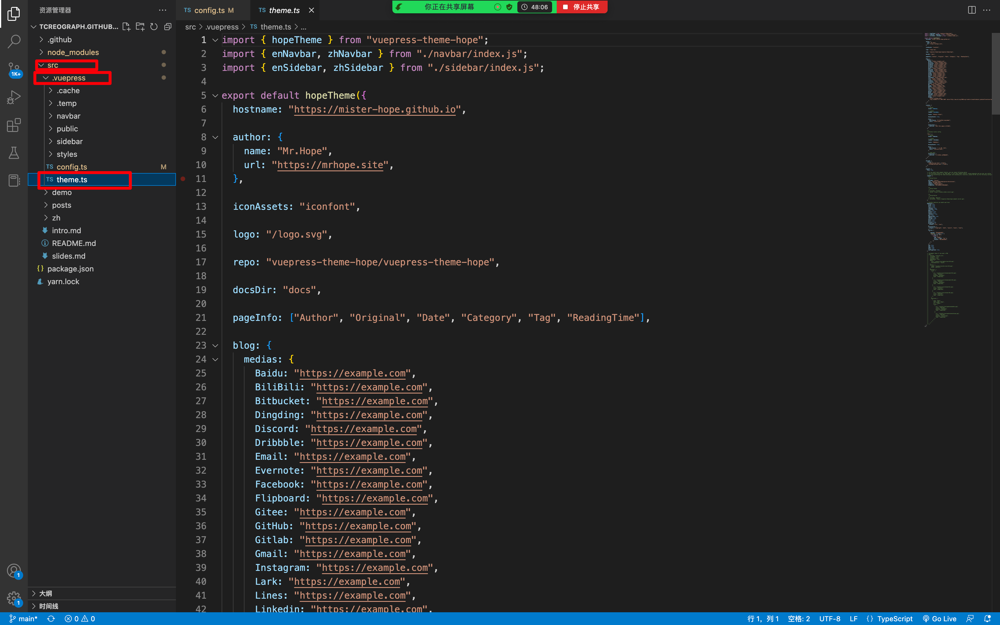

### 2.3 换 logo

路径：`src/.vuepress/public/`

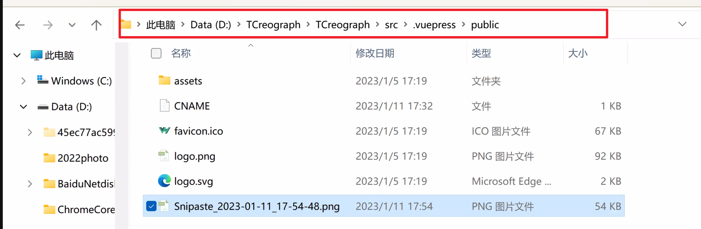

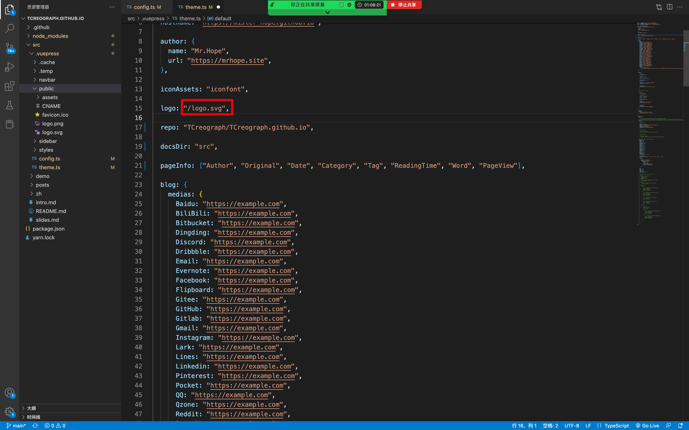

::: tip 提示

在 public 下的文件，开头添加 `/`。

:::

### 2.4 快捷部署

```sh
git pull
git add .
git commit -m "update"
git push
```

部署命令：

```sh
sh update.sh
```

访问链接，参考部署情况：[https://github.com/TCreograph/TCreograph.github.io/actions](https://github.com/TCreograph/TCreograph.github.io/actions)

### 2.5 修改主页名称

### 2.6 本地启动

1. 进到你的网站文件夹
2. 打开 git bash here
3. 输入： `yarn run docs:dev`
4. 退出运行：Ctrl + C

### 2.7 修改背景

1. 图片存放路径：`src/.vuepress/public/`
1. README.md 里面添加/修改：bgImage

### 2.8 优化主页

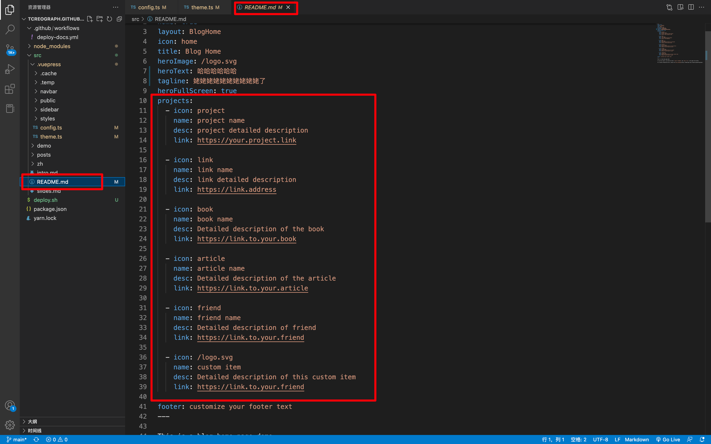

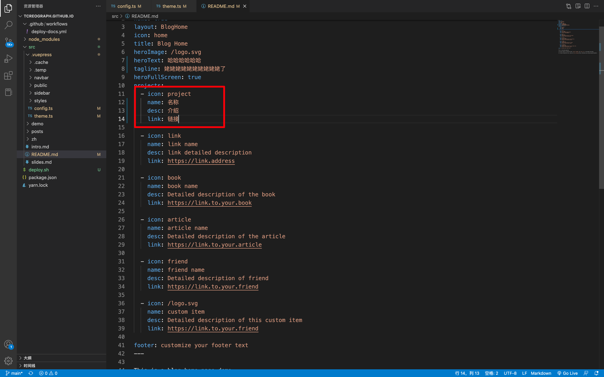

### 2.9 社交链接

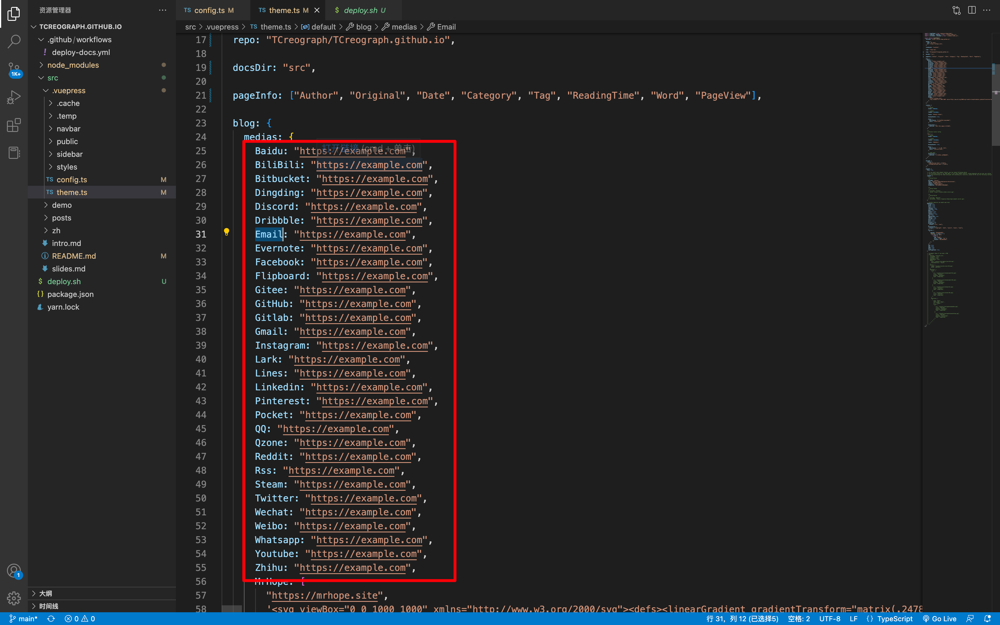

### 2.10 修改菜单栏、侧边栏

### 2.11 设置博客名称

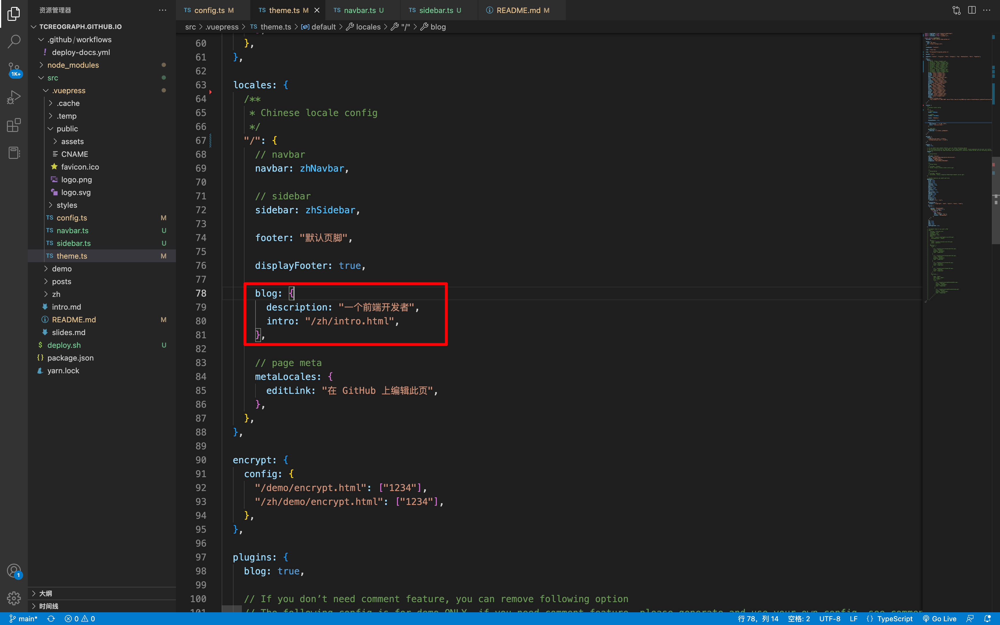

## 3. 设置搜索功能

```vue
yarn add -D vuepress-plugin-search-pro@next
```

之前安装错误，需要先卸载：

```shell
yarn remove -D vuepress-plugin-search-pro
```

安装正确的搜索功能插件：

```shell
yarn add -D @vuepress/plugin-search@next
```

在 `.vuepress/config.ts`：

```shell {3,6-16}
// .vuepress/config.ts
import { defineUserConfig } from "vuepress";
import { searchPlugin } from "@vuepress/plugin-search";

export default defineUserConfig({
  plugins: [
    searchPlugin({
      // ...

      locales: {
        "/": {
          placeholder: "搜索",
        },
      },
    }),
  ],
});
```

## 4. 菜单栏

图标链接：[https://theme-hope.vuejs.press/zh/guide/interface/icon.html#%E4%BD%BF%E7%94%A8-fontawesome](https://theme-hope.vuejs.press/zh/guide/interface/icon.html#%E4%BD%BF%E7%94%A8-fontawesome)

参考：[https://www.thomasxiao.com/](https://www.thomasxiao.com/)

```vue
import { navbar } from "vuepress-theme-hope";

export const zhNavbar = navbar([
    "/",
    {
        text: "关于我",
        icon: "at",
        link: "https://bornforthis.cn"
    },
    {
        text: "关于我",
        icon: "at",
        children: [
            {
                text: "关于我",
                icon: "at",
                link: "https://bornforthis.cn"
            },
        ]
    }
]);
```


## 5. 文章部分

### 5.1 文章删除

删除主题自带的文章。

### 5.2 创建自己要写的文章文件夹

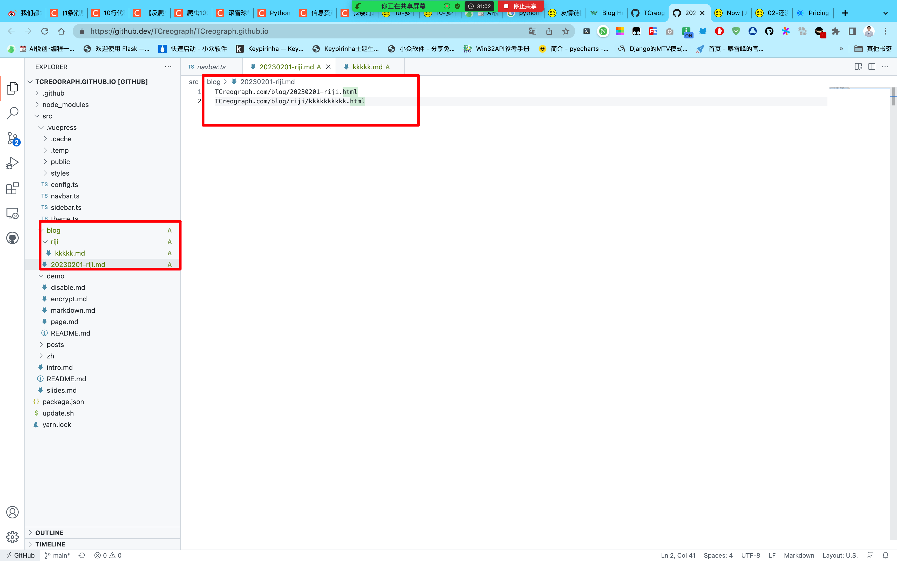

### 5.3 文章头部

```markdown
title: 03-网站基本信息配置「Jason」
date: 2023-01-11 17:10:20
author: AndersonHJB
isOriginal: true
category:
    - Python
tag:
    - Python
icon: vuejs2
sticky: false
star: false
article: true
timeline: true
image: false
navbar: true
sidebarIcon: true
headerDepth: 5
comment: true
lastUpdated: true
editLink: false
backToTop: true
toc: true
```

日期生成网站：[https://bornforthis.cn/python/#/](https://bornforthis.cn/python/#/)


## 6. 侧边栏


## 7. 评论

1. 评论数据库：[https://console.leancloud.app/login](https://console.leancloud.app/login)
2. 评论升级：[https://vercel.com/dashboard](https://vercel.com/dashboard)

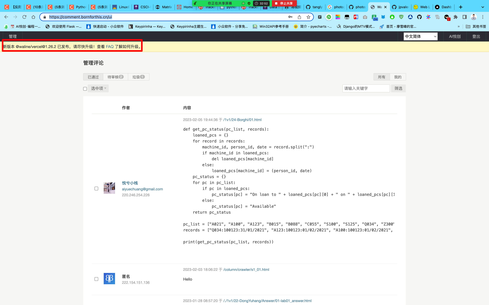


## 6. 网站升级

我会不定期升级，使用如下即可同步我对你网站的升级：

```shell
git pull
yarn install
```


## DNS

```shell
dns31.hichina.com
dns32.hichina.com
```


## 课后任务

1. 寻找背景图片
2. logo 设计个更好看的
3. 主页名称修改


## 评价


::: details 公众号：AI悦创【二维码】


:::

::: info AI悦创·编程一对一

AI悦创·推出辅导班啦，包括「Python 语言辅导班、C++ 辅导班、java 辅导班、算法/数据结构辅导班、少儿编程、pygame 游戏开发、Web、Linux」，全部都是一对一教学：一对一辅导 + 一对一答疑 + 布置作业 + 项目实践等。当然，还有线下线上摄影课程、Photoshop、Premiere 一对一教学、QQ、微信在线，随时响应！微信：Jiabcdefh

C++ 信息奥赛题解，长期更新！长期招收一对一中小学信息奥赛集训，莆田、厦门地区有机会线下上门，其他地区线上。微信：Jiabcdefh

方法一：[QQ](http://wpa.qq.com/msgrd?v=3&uin=1432803776&site=qq&menu=yes)

方法二：微信：Jiabcdefh

:::

