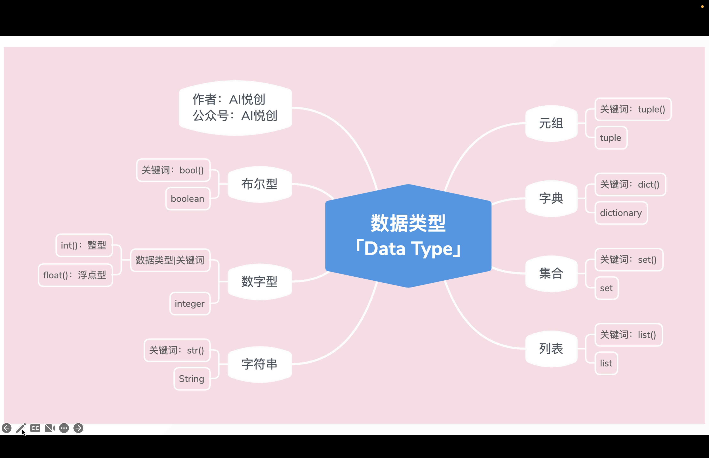
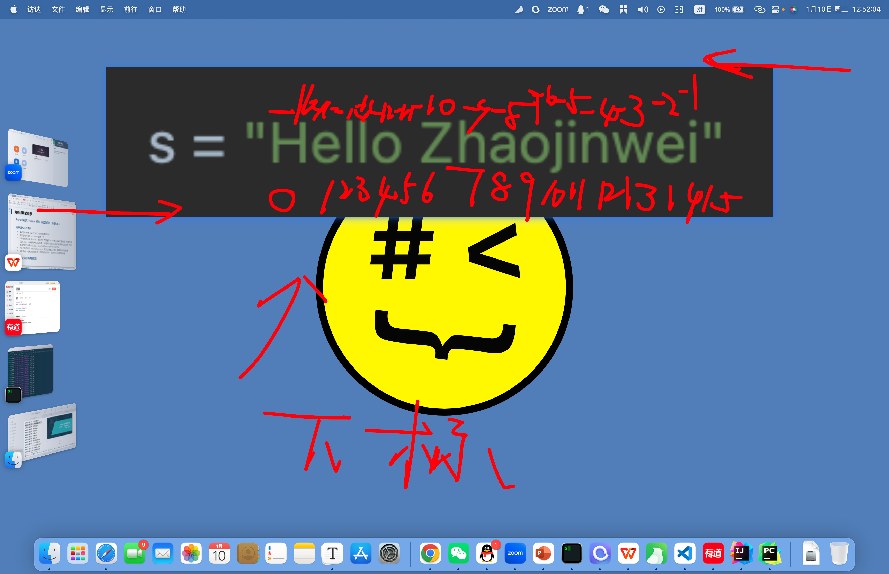
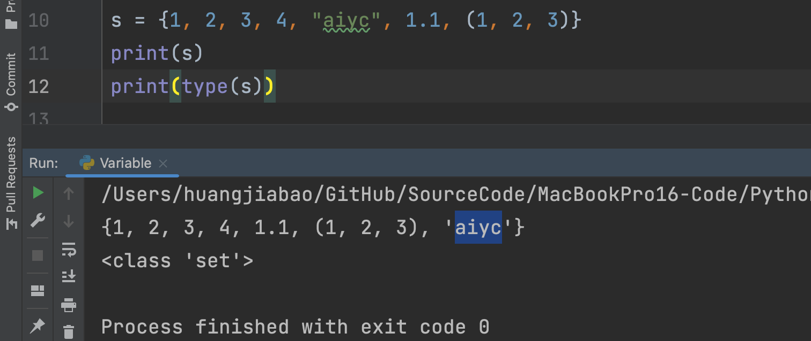
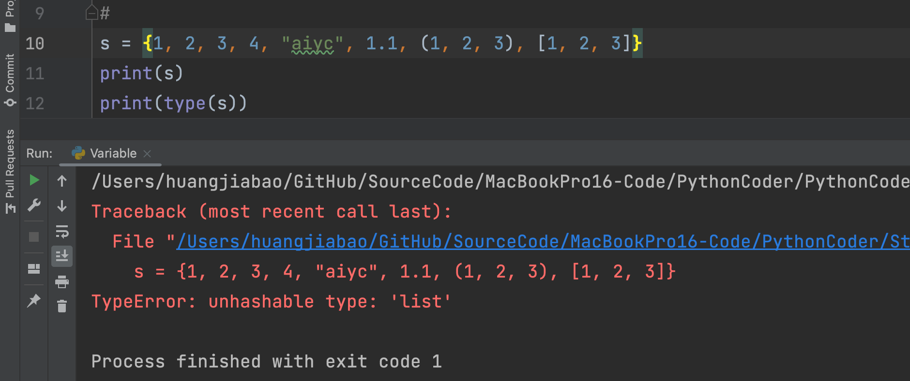
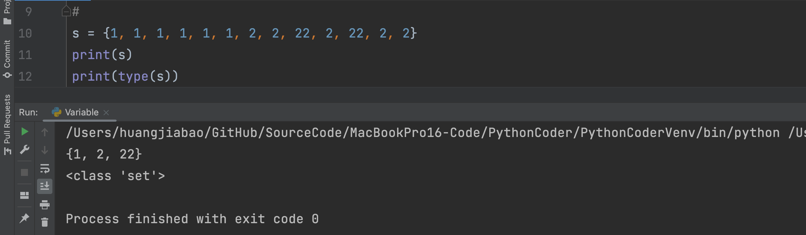
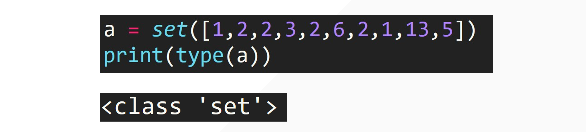
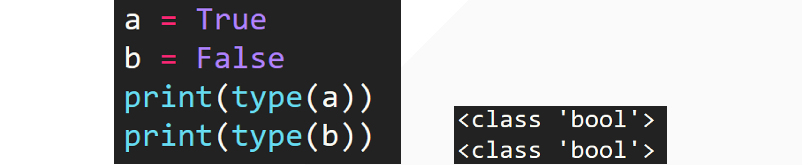

## 1. 多种数据类型



## 2. 数字型「int、float」

```python
num = 1
print(type(num))

t = type(num)
print(t)
```

输出：

```python
<class 'int'>
<class 'int'>
```

```python
num = 1.111
print(type(num))

t = type(num)
print(t)
```

输出：

```python
<class 'float'>
<class 'float'>
```

## 3. 字符串「str」

::: tabs

@tab 代码示例

```python
s = "Hello Zhaojinwei"
print(type(s))

print(s)
```

输出：

```python
<class 'str'>
Hello Zhaojinwei
```

@tab 字符串三大特性

1. 有序性：从左到右 0 开始，从右到左 -1 开始



2. 不可变性：在程序**运行**的过程当中，字符串被创建出来之后，不能被改变。

3. 任意数据类型：你键盘可以输入的任何内容，都可以是字符串的内容。

:::

## 4. 列表「list」

::: tabs 

@tab 代码示例

```python
lst = [1, 2, 3, 4, 1.1, "aiyc"]
print(lst)
```

输出：

```python
[1, 2, 3, 4, 1.1, 'aiyc']
```

@tab 三大特性

1. 有序性
2. 任意数据类型
3. 可变性「在**运行**过程当中，可以添加、删除、修改」

:::

## 5. 元组「tuple」

::: tabs

@tab 代码示例

```python
tup = (1, "aiyc", 1.1, "look")
print(tup)
print(type(tup))
```

输出：

```python
(1, 'aiyc', 1.1, 'look')
<class 'tuple'>
```

@tab 三大特性

1. 有序性
2. 不可变性
3. 任意数据类型

:::

## 6. 字典「dict」

::: tabs

@tab 代码示例

```python
d = {"name": "zhaojinwei", "age": 19, "gender": "F", 19: "number", (1, 2, 3): "tup", True: "Bool"}
print(d)
print(type(d))

d = {
    "name": "zhaojinwei",
    "age": 19, "gender": "F",
    19: "number"
}
```

@tab 特点

1. 无序性「最新版的 Python 3.6+，字典变成有序性，咱们基本上用不到字典的有序情况。——你就理解成无序即可」
2. `{key1: value1, key2: value2, key3: value3, key4: value3}` ——字典是由一系列的 key 和 value 组成。
3. 字典可变
4. key：不可变性。
    1. Q1: 列表可以做字典的 key 吗？——不可以❌因为它可变，所以不确定。
    2. Q2: 元组可不可以做 key？——可以✅
    3. Q2: 数字、布尔型✅
    4. 集合也不能做 key。❌
    5. 字典做字典的 key ❌
5. Value：任意数据类型

:::

## 7. 集合「set」

代码运行中，可以为集合添加数据。

::: tabs

@tab 无序性



@tab 确定性



每一个值都要是确定的。

@tab 互异性



@tab 强制转换

```python
s = set([1, 1, 1, 1, 1, 1, 2, 2, 22, 2, 22, 2, 2])
print(s)
print(type(s))
```

输出：

```python
{1, 2, 22}
<class 'set'>
```



:::

## 8. 布尔型「bool」



::: details 公众号：AI悦创【二维码】


:::

::: info AI悦创·编程一对一

AI悦创·推出辅导班啦，包括「Python 语言辅导班、C++ 辅导班、java 辅导班、算法/数据结构辅导班、少儿编程、pygame 游戏开发、Web、Linux」，全部都是一对一教学：一对一辅导 + 一对一答疑 + 布置作业 + 项目实践等。当然，还有线下线上摄影课程、Photoshop、Premiere 一对一教学、QQ、微信在线，随时响应！微信：Jiabcdefh

C++ 信息奥赛题解，长期更新！长期招收一对一中小学信息奥赛集训，莆田、厦门地区有机会线下上门，其他地区线上。微信：Jiabcdefh

方法一：[QQ](http://wpa.qq.com/msgrd?v=3&uin=1432803776&site=qq&menu=yes)

方法二：微信：Jiabcdefh

:::


