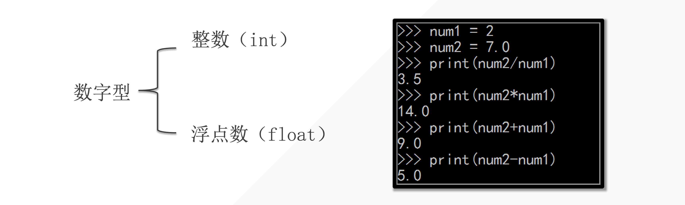
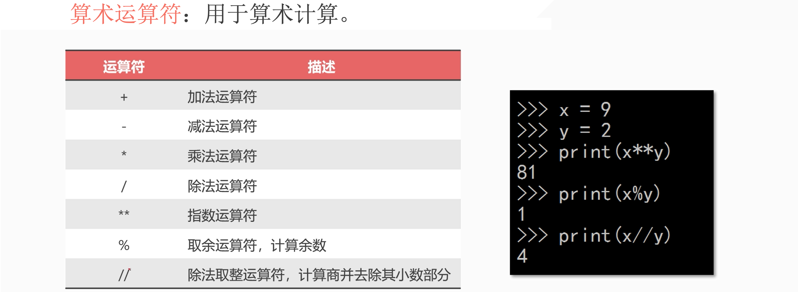
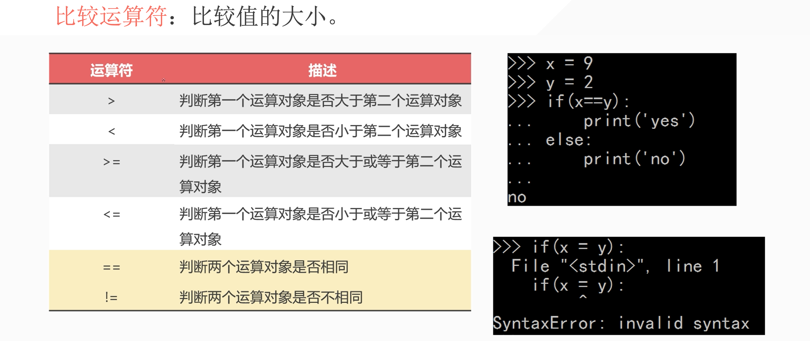
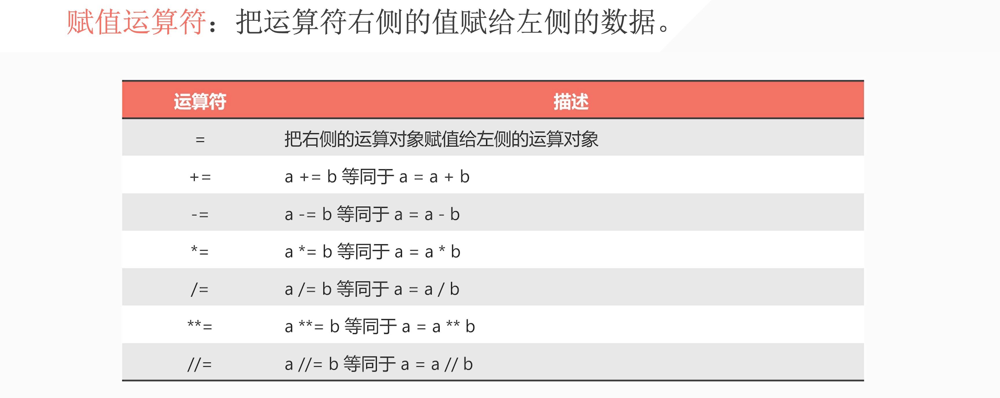
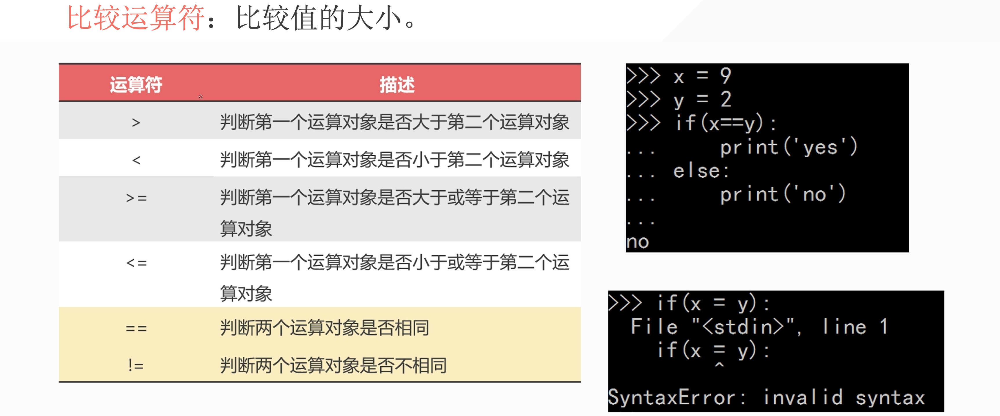

## 1. 分类



```python
In [1]: 1 + 1
Out[1]: 2

In [2]: 1 + 1.0
Out[2]: 2.0

In [3]: 3 - 1
Out[3]: 2

In [4]: 3.0 - 1
Out[4]: 2.0

In [5]: 2 * 3.0
Out[5]: 6.0

In [6]: 2 * 3
Out[6]: 6

In [7]: 9 / 3
Out[7]: 3.0
```

1. 如果其中出现浮点数类型，那么最后的结果就是浮点数。——优先级最高
2. 除法涉及精度问题，所以肯定是浮点数。

```python
pip3 install ipython
ipython
```

## 2. 运算符



## 3. 小试牛刀

1. 一百以内的两位数整数 65
2. Q1:分别提取出个位、十位并输出
3. Q2:65 to 56、89 to 98、21 to 12
4. Q3:在三位数的情况下，完成 Q1、Q2

## 4. 比较运算符



## 5. 赋值运算符



## 6. 比较运算符



```python
a = 1
b = 2
print(a > b)
print(1 > 3)
```

输出：

```python
False
False
```


::: details 公众号：AI悦创【二维码】


:::

::: info AI悦创·编程一对一

AI悦创·推出辅导班啦，包括「Python 语言辅导班、C++ 辅导班、java 辅导班、算法/数据结构辅导班、少儿编程、pygame 游戏开发、Web、Linux」，全部都是一对一教学：一对一辅导 + 一对一答疑 + 布置作业 + 项目实践等。当然，还有线下线上摄影课程、Photoshop、Premiere 一对一教学、QQ、微信在线，随时响应！微信：Jiabcdefh

C++ 信息奥赛题解，长期更新！长期招收一对一中小学信息奥赛集训，莆田、厦门地区有机会线下上门，其他地区线上。微信：Jiabcdefh

方法一：[QQ](http://wpa.qq.com/msgrd?v=3&uin=1432803776&site=qq&menu=yes)

方法二：微信：Jiabcdefh

:::


