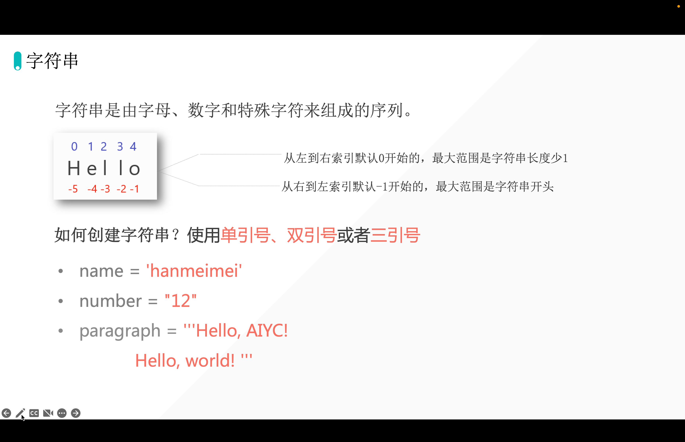
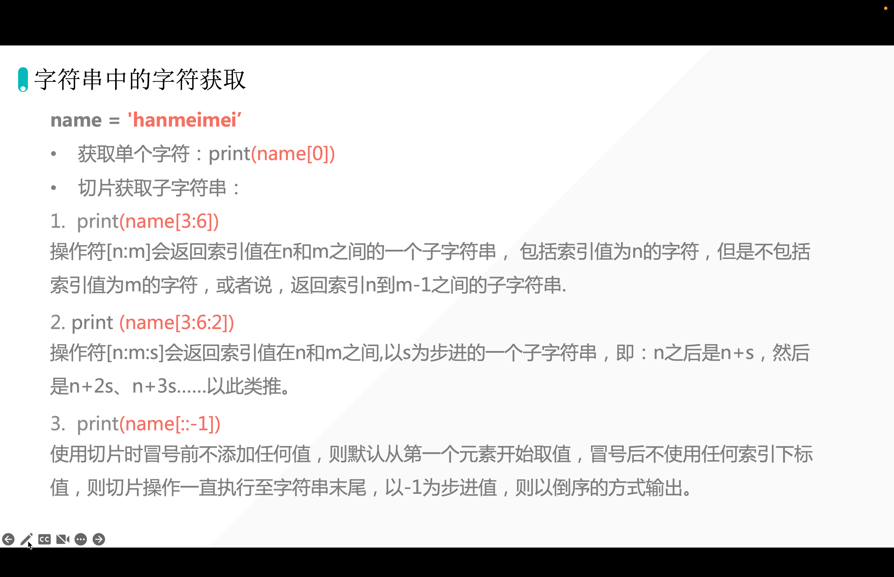

## 1. 字符串定义



## 2. 探究单双三引号的作用以及区分

```python
s = 'I'm zhaojinwei'
```

::: caution 报错

  File "/Users/huangjiabao/GitHub/SourceCode/MacBookPro16-Code/PythonCoder/StudentCoder/21-zhaojinyin/lesson01/Variable.py", line 1
    s = 'I'm zhaojinwei'
                       ^
SyntaxError: unterminated string literal (detected at line 1)

:::

```python
s = "I'm zhaojinwei"
print(s)
```

输出：

```python
I'm zhaojinwei
```

::: tip 结论

单双引号混用

:::

```python
s = """你好，我是悦创。

博客文章的模型有一个 excerpt 字段，这个字段用于存储文章的摘要。目前为止，还只能在 django admin 后台手动为文章输入摘要。每次手动输入摘要比较麻烦，对有些文章来说，只要摘取正文的前 N 个字符作为摘要，以便提供文章预览就可以了。因此我们来实现如果文章没有输入摘要，则自动摘取正文的前 N 个字符作为摘要，这有两种实现方法。

#1. 覆写 save 方法
第一种方法是通过覆写模型的 save 方法，从''正'''''文"字"段摘取前 N 个字符保存到摘要字段。在 创作后台开启，请开始你的表演 中我们提到过 save 方法中执行的是保存模型实例数据到数据库的逻辑，因此通过覆写 save 方法，在保存数据库前做一些事情，比如填充某个缺失字段的值。

回顾一下博客文章模型代码：

欢迎关注我公众号：AI悦创，有更多更好玩的等你发现！"""
print(s)
```

输出：

```python
你好，我是悦创。

博客文章的模型有一个 excerpt 字段，这个字段用于存储文章的摘要。目前为止，还只能在 django admin 后台手动为文章输入摘要。每次手动输入摘要比较麻烦，对有些文章来说，只要摘取正文的前 N 个字符作为摘要，以便提供文章预览就可以了。因此我们来实现如果文章没有输入摘要，则自动摘取正文的前 N 个字符作为摘要，这有两种实现方法。

#1. 覆写 save 方法
第一种方法是通过覆写模型的 save 方法，从''正'''''文"字"段摘取前 N 个字符保存到摘要字段。在 创作后台开启，请开始你的表演 中我们提到过 save 方法中执行的是保存模型实例数据到数据库的逻辑，因此通过覆写 save 方法，在保存数据库前做一些事情，比如填充某个缺失字段的值。

回顾一下博客文章模型代码：

欢迎关注我公众号：AI悦创，有更多更好玩的等你发现！

```

::: tip 结论

单双三引号混用，三个单引号、三个双引号，多行输出、原样输出。

:::

## 3. len() 检测字符串的长度

```python
s = """你好，我是悦创。

博客文章的模型有一个 excerpt 字段，这个字段用于存储文章的摘要。目前为止，还只能在 django admin 后台手动为文章输入摘要。每次手动输入摘要比较麻烦，对有些文章来说，只要摘取正文的前 N 个字符作为摘要，以便提供文章预览就可以了。因此我们来实现如果文章没有输入摘要，则自动摘取正文的前 N 个字符作为摘要，这有两种实现方法。

#1. 覆写 save 方法
第一种方法是通过覆写模型的 save 方法，从''正'''''文"字"段摘取前 N 个字符保存到摘要字段。在 创作后台开启，请开始你的表演 中我们提到过 save 方法中执行的是保存模型实例数据到数据库的逻辑，因此通过覆写 save 方法，在保存数据库前做一些事情，比如填充某个缺失字段的值。

回顾一下博客文章模型代码：

欢迎关注我公众号：AI悦创，有更多更好玩的等你发现！"""
print(len(s))
```

```python
387
```

## 4. 字符串的字符获取

### 4.1 提取单个字符

```python
s = "aiyuechuang"
select = s[0]
print(select)

# ooutput
a
```

### 4.2 提取多个字符

```python
s = "zhaojingwei"
select = s[0:4]
print(select)

# ooutput
zhao
```

### 4.3 提取不连续的多个字符

```python
s = "zhaojingwei"
select = s[::2]
print(select)

# output
zajnwi
```



## 5. 字符串内置函数

### 5.1capitalize() 字符串开头大写

```python
s = "zhaojingwei"
new_s = s.capitalize()
print(new_s)

# --- output ---
Zhaojingwei
```

```python
s = "zhao jing wei"
new_s = s.capitalize()
print(new_s)

# --- output ---
Zhaojingwei
```

### 5.2 title()

```python
s = "zhao jing wei"
new_s = s.title()
print(new_s)

# --- output ---
Zhao Jing Wei
```

### 5.3 upper()

```python
s = "zhao jing wei"
new_s = s.upper()
print(new_s)

# --- output ---
ZHAO JING WEI
```

```python
s = "zhao jing wei"
new_s = s.upper()
print(new_s)
print(s)

# --- output ---
ZHAO JING WEI
zhao jing wei
```

### 5.4 lower()

```python
s = "zhao jing wei"
new_s = s.upper().lower()
print(new_s)

s1 = "ZHAO JING WEI"
new_new_s = s1.lower()
print(new_new_s)

# --- output ---
zhao jing wei
zhao jing wei
```

### 5.5 find() 寻找元素下标「第一次出现的下标」找不到会返回 -1

```python
s = "zhao jingz wei"
new_s = s.find("z")
print(new_s)

# --- output ---
0
```

那如果寻找的是不存在的呢？

```python
s = "zhao jingz wei"
new_s = s.find("p")
print(new_s)

# --- output ---
-1
```

```python
s = "zhao jingza wei"
new_s = s.find("za")  # 也可以寻找一个 word ，但是会返回 word 的第一个字母位置「下标」
print(new_s)

# --- output ---
9
```

### 5.6 index() 寻找元素下标「第一次出现的下标」找不到会报错

```python
s = "zhao jingza wei"
new_s = s.index("z")
print(new_s)

# --- output ---
0
```

```python
s = "zhao jingza wei"
new_s = s.index("za")  # 也可以寻找一个 word ，但是会返回 word 的第一个字母
print(new_s)

# --- output ---
9
```

```python
s = "zhao jingza wei"
new_s = s.index("0")
print(new_s)

# --- output ---
Traceback (most recent call last):
  File "/Users/huangjiabao/GitHub/SourceCode/MacBookPro16-Code/PythonCoder/StudentCoder/31-trj/01-demo.py", line 2, in <module>
    new_s = s.index("0")
ValueError: substring not found
```

### 5.7 strip() 默认去掉前后空格

```python
s = "  zhao jingza wei    "
print(s)
new_s = s.strip()  # 默认去掉前后空格
print(new_s)

# --- output ---
  zhao jingza wei    
zhao jingza wei
```

```python
s = "----  zhao jingza wei   ---"
print(s)
new_s = s.strip("-")  # 默认去掉前后空格
print(new_s)

# --- output ---
----  zhao jingza wei   ---
  zhao jingza wei   
```

```python
s = "-- --  zhao jingza wei   -- -"
print(s)
new_s = s.strip("-")  # 默认去掉前后空格
print(new_s)

# --- output ---
-- --  zhao jingza wei   -- -
 --  zhao jingza wei   -- 
```

### 5.8 count() 字符计数

```python
s = "-- --  zhao jingza wei   -- -"
new_s = s.count("z")
print(new_s)

# --- output ---
2
```

计算单词出现的数量：

```python
s = "-- --  zhao jingzazh wei   -- -"
new_s = s.count("zh")
print(new_s)

# --- output ---
2
```

如果，计算的字符不存在呢？

```python
s = "-- --  zhao jingzazh wei   -- -"
new_s = s.count("0")
print(new_s)

# --- output ---
0
```

### 5.9 startswith() 判断开始是不是特定字符

```python
s = "zhao jingzazh wei"
new_s = s.startswith("z")
print(new_s)

# --- output ---
True
```

也可以判断字符串：

```python
s = "zhao jingzazh wei"
new_s = s.startswith("zhao")
print(new_s)

# --- output ---
True
```

### 5.10 endswith()

```python
s = "zhao jingzazh wei"
new_s = s.endswith("zhao")
print(new_s)

# --- output ---
False
```

```python
s = "zhao jingzazh wei"
new_s = s.endswith("i")
print(new_s)

# --- output ---
True
```

```python
s = "zhao jingzazh wei"
new_s = s.endswith("ei")
print(new_s)

# --- output ---
True
```

### 5.11 rfind()

```python
s = "zhao jingzazh wei"
new_s = s.rfind("z")  # right find
print(new_s)

# --- output ---
11
```

### 5.12 rstrip() or lstrip()

```python
s = "----zhao jingzazh wei----"
new_s = s.lstrip("-")
print(new_s)

# --- output ---
zhao jingzazh wei----
```

```python
s = "----zhao jingzazh wei----"
new_s = s.rstrip("-")
print(new_s)

# --- output ---
----zhao jingzazh wei
```

### 5.13 isdigit() 判断字符串是不是纯数字

```python
s = "zhaojingzazhwei"
new_s = s.isdigit()
print(new_s)

# --- output ---
False
```

```python
s = "1111111"
new_s = s.isdigit()
print(new_s)

# --- output ---
True
```

### 5.14 isalpha() 判断字符串是不是纯字母

```python
s = "zhaojingwei"
new_s = s.isalpha()
print(new_s)

# --- output ---
True
```


::: details 公众号：AI悦创【二维码】


:::

::: info AI悦创·编程一对一

AI悦创·推出辅导班啦，包括「Python 语言辅导班、C++ 辅导班、java 辅导班、算法/数据结构辅导班、少儿编程、pygame 游戏开发、Web、Linux」，全部都是一对一教学：一对一辅导 + 一对一答疑 + 布置作业 + 项目实践等。当然，还有线下线上摄影课程、Photoshop、Premiere 一对一教学、QQ、微信在线，随时响应！微信：Jiabcdefh

C++ 信息奥赛题解，长期更新！长期招收一对一中小学信息奥赛集训，莆田、厦门地区有机会线下上门，其他地区线上。微信：Jiabcdefh

方法一：[QQ](http://wpa.qq.com/msgrd?v=3&uin=1432803776&site=qq&menu=yes)

方法二：微信：Jiabcdefh

:::


