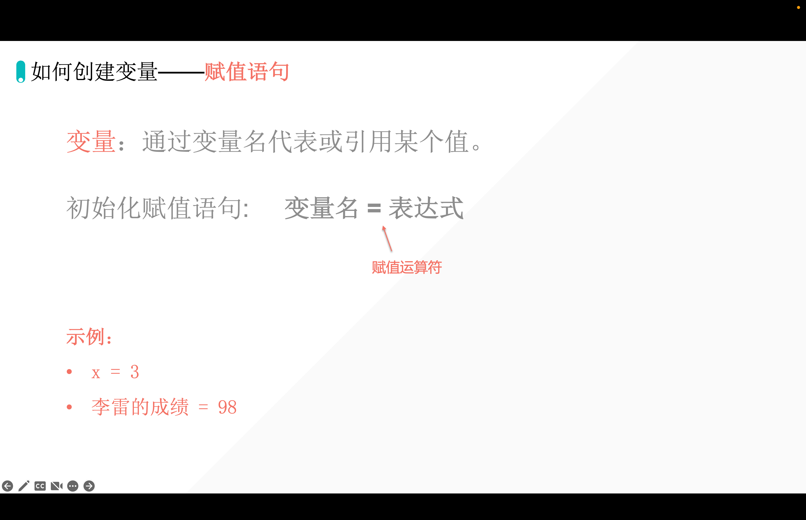
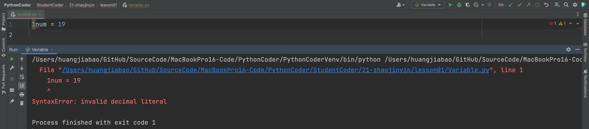
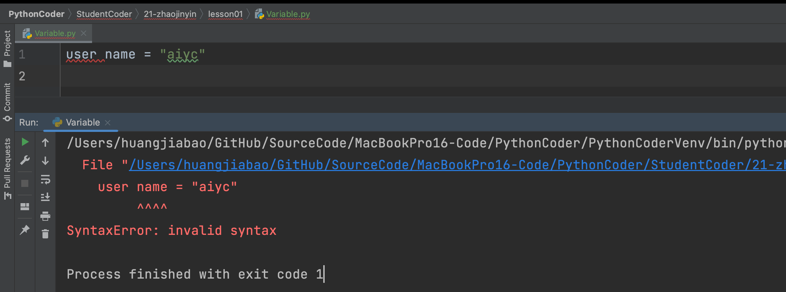
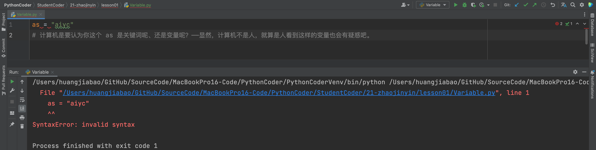
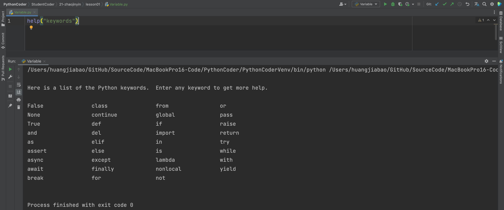
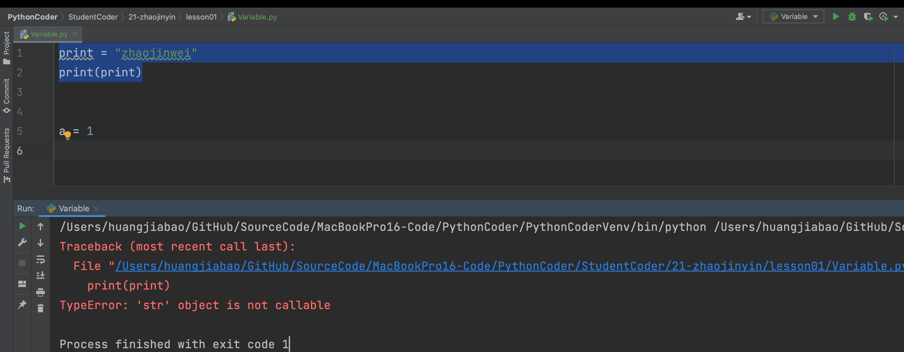

## 1. 理解变量

- 变量就是在计算机的内存当中开辟空间。——例如信封一样。
- 变量会被覆盖。

## 2. 代码的运行逻辑

- 从上到下
- 从右到左
- 最后一步，才是赋值



## 3. 实操

### 3.1 Code1

```python
x = 1
x = x + 10
# 井号是注释，注释就是人看得见，计算机看不见。代码注解，说明。
# print: 打印、输出
print(x)
```

输出：

```python
11
```

### 3.2 Code2

```python
name1 = "lilei"
name2 = name1
print(name2)
```

输出：

```python
lilei
```

### 3.3 Code3

```python
name1 = "hanmeimei"
name1 = "AI悦创"
print(name1)
```

输出：

```python
AI悦创
```

## 4. 进阶的赋值方法

::: tabs

@tab code1

```python
a = 1
b = 1
c = 1
print(a)
print(b)
print(c)
```

输出：

```python
1
1
1
```

@tab 多个变量同时输出

```python {7}
a = 1
b = 1
c = 1
# print(a)
# print(b)
# print(c)
print(a, b, c)  # 并列输出，默认以空格间隔
```

输出：

```python
1 1 1
```

@tab 修改 print() 默认空格

```python {7-8}
a = 1
b = 1
c = 1
# print(a)
# print(b)
# print(c)
print(a, b, c, sep=" ")  # 并列输出，默认以空格间隔
print(a, b, c, sep=";;;")
```

输出：

```python
1 1 1
1;;;1;;;1
```

@tab 修改默认换行

```python {7-10}
a = 1
b = 1
c = 1
# print(a)
# print(b)
# print(c)
# print(a, b, c, sep=" ", end="\n")  # 并列输出，默认以空格间隔 \n: new line 新建一行
print(a, b, c, sep=" ", end="\n\n\n\n")  # 并列输出，默认以空格间隔 \n: new line 新建一行
print(a, b, c, sep=";;;", end="--------")
print(a, b, c, sep=";;;")
```

:::

::: tabs

@tab 多个变量同时赋值

```python
a = b = c = 1
print(a, b, c)
```

输出：

```python
1 1 1
```

@tab 同时给多个变量赋予不同的值

```python
a, b, c = 1, 2, 3
print(a, b, c)
```

输出：

```python
1 2 3
```

:::

## 5. 练习一下

<!-- @include: ../../column/py/basequestion/special_variabl.md{29-122} -->

```python
Austin = "Coke"
Jaden = "juice"
print("Austin", Austin)  # 输出 print(a, b, c) Austin Coke
print("Jaden", Jaden)  # 输出 Jaden juice
empty_cup = Austin
Austin = Jaden
Jaden = empty_cup
print("Austin", Austin)  # 输出 Austin juice
print("Jaden", Jaden)  # 输出 Jaden Coke
```

## 6. 变量的命名规则

我们取名字都是有规则的，中国：姓 + 名。国外：名 + 姓；

所以，在编程当中，我们的变量命名也是有规则和要求的。

### 6.1 变量是区分大小写的

```python
n = "aiyc"
N = "zhaojinwei"
print(n)
```

输出：

```python
aiyc
```

### 6.2 不能使用数字开头



那，为什么不能使用数字开头呢？——数字开头，计算机会认为是数字。认为它是数字，但是数字后面又跟着一个「或几个」字母，把计算机搞懵了，分不清。

::: tip 但是

除了变量的开头不能使用数字外，其他地方你想用就用！

```python
n11111u2222m2112121212121 = 19
print(n11111u2222m2112121212121)
```

输出：

```python
19
```

:::

### 6.2 不能空格间隔



```python
username = "aiyc"
user_name = "aiyc"
```

使用下划线来连接。

::: tip 提示

只有下划线！！！

:::

### 6.3 系统关键词不能做变量名

```python
as = "aiyc"
# 计算机是要认为你这个 as 是关键词呢、还是变量呢？——显然，计算机不是人，就算是人看到这样的变量也会有疑惑吧。
```



::: info 如何查看关键词

```python
help("keywords")
```



:::

**我非要用“关键词”做变量名怎么办？**

```python
As = "aiyc"
aS = "aiyc"
AS = "aiyc"
```

### 6.4 不要使用内置函数名做变量名

```python
print = "zhaojinwei"
print(print)
```




## 快捷键

- `Command + /`：注释


::: details 公众号：AI悦创【二维码】


:::

::: info AI悦创·编程一对一

AI悦创·推出辅导班啦，包括「Python 语言辅导班、C++ 辅导班、java 辅导班、算法/数据结构辅导班、少儿编程、pygame 游戏开发、Web、Linux」，全部都是一对一教学：一对一辅导 + 一对一答疑 + 布置作业 + 项目实践等。当然，还有线下线上摄影课程、Photoshop、Premiere 一对一教学、QQ、微信在线，随时响应！微信：Jiabcdefh

C++ 信息奥赛题解，长期更新！长期招收一对一中小学信息奥赛集训，莆田、厦门地区有机会线下上门，其他地区线上。微信：Jiabcdefh

方法一：[QQ](http://wpa.qq.com/msgrd?v=3&uin=1432803776&site=qq&menu=yes)

方法二：微信：Jiabcdefh

:::


