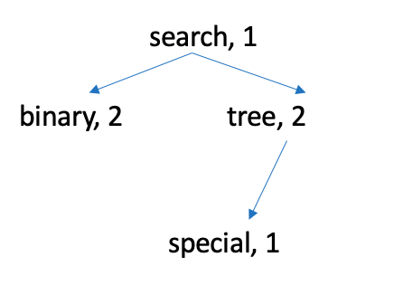

- [CISC235_W23_A2.pdf](/1v1/20-Frank/CISC235_W23_A2.pdf)

## Assignment 2

February 14, 2023

## General Instructions

> 一般的用法说明

Write your own program(s) using Python. Once you complete your assignment, place all Python files in a zip file and name it according to the same method, i.e., “235-1234-Assn2.zip”. Unzip this file should get all your Python file(s). 

> 使用Python编写自己的程序。完成作业后，将所有Python文件放在一个zip文件中，并按照相同的方法命名，即“235-1234-Assn2.zip”。解压缩这个文件应该会得到所有的Python文件。

Then upload 235-1234-Assn2.zip into Assignment 2’s entry on onQ. You may upload several times if you wish. However, onQ keeps only the last uploaded file. The newly uploaded file will overwrite the old file. Please check your files after uploading. We will check the latest submission you made following the required naming.

> 然后上传235-1234-Assn2.zip到onQ上Assignment 2的条目中。如果你愿意，你可以上传几次。但是，onQ只保留最后上传的文件。新上传的文件将覆盖旧文件。上传后请检查文件。我们将检查您在要求命名后提交的最新文件。

You must ensure your code is executable and document your code to help TA mark your solution. We suggest you follow PEP81 style to improve the readability of your code.

> 您必须确保您的代码是可执行的，并记录您的代码以提供帮助 TA 标记你的解决方案。我们建议你遵循 PEP81 风格提高代码的可读性。

All data structures involved must be implemented by yourself, except for the built-in data types, i.e., List in Python.

> 所涉及的所有数据结构都必须由您自己实现，除了内置数据类型，即 Python 中的 List。

An “I uploaded the wrong file” excuse will result in a mark of zero.

> 一个“我上传了错误的文件”的借口会导致零分。

## 1. Binary Search Tree (55 points)

Binary search tree (BST) is a special type of binary tree that satisfies the binary search property, i.e., the key in each node must be greater than any key stored in the left sub-tree, and less than any key stored in the right sub-tree.

> 二叉搜索树(Binary search tree, BST)是一种特殊的二叉树搜索属性，即每个节点中的键必须大于存储的任何键在左子树中，小于任何存储在右子树中的键。

Your task is to implement a BST class, satisfying the following requirements (you can create more methods/attributes if needed):

> 您的任务是实现一个BST类，满足以下要求(如果需要，你可以创建更多的方法/属性):

1) (5 points) Must have an insert (self, value) function that inserts a new node with a given value into the BST. You may assume that the values to be stored in the tree are integers.

> 1)(5点)必须有一个insert (self, value)函数插入一个 new 将给定值的节点放入 BST中。您可以假定值为被存储在树中的都是整数。

2) (10 points) Must have a get total height(self) function that computes the sum of the heights of all nodes in the tree. Your get total height function should run in O(n) time in the worst case, where n refers to the total number of nodes in the tree.

> (10点)必须有一个获取总高度(self)函数，计算树中所有节点的高度之和。在最坏的情况下，get总高度函数应该在O(n)时间内运行，其中n指的是树中的节点总数。

3) (15 points) Must have a delete(self, value) function that could be used to delete one node from the BST by its value, recursively.

> 3)(15分)必须有一个可以使用的删除(self, value)功能递归地从BST中删除一个节点。

4) (20 points) Write a save(self) and a restore(self, input string) function for your BST class. These two functions can transfer a BST into a string and reconstruct it back to the same tree.

> 4)(20分)为你的BST类写一个save(self)和restore(self, input string)函数。这两个函数可以将BST转换为
> 字符串并将其重建回同一棵树。

5) (5 points) Write test code in the main function, covering all functions mentioned above.

> 5)(5分)在主功能中编写测试代码，覆盖所有功能上面提到的。

## 2. AVLTreeMap: A Modified AVL Tree (45 points)

> AVLTreeMap:修改后的AVL树(45点)

AVL Tree is one type of BST that ensures its balance during insertion/deletion. Your task is to implement a special AVL tree in a class named AVLTreeMap. This AVLTreeMap should have a load from file(self, file path) function. This function aims to read content from a file and save word-frequency information for all words appearing in the file in the AVLTreeMap.

> AVL树是一种BST，它保证了插入/删除过程中的平衡。你的任务是在一个名为AVLTreeMap的类中实现一个特殊的AVL树。这个AVLTreeMap应该有一个从文件(self, file path)加载函数。这函数的目的是从文件中读取内容并保存词频信息对于AVLTreeMap文件中出现的所有单词。

Specifically, load from file function takes a file path as input, reads lines from the file, and extracts word tokens appearing in lines following their appearance order in the file. Next, it inserts extracted tokens one by one into an empty AVLTreeMap (you should empty the current AVLTreeMap each time before adding content from the file). Each AVLTreeMap node contains five attributes: leftchild, rightchild, word, frequency, and height.

> 具体来说，load from file函数以文件路径作为输入，从文件中读取行，并按照它们在文件中的出现顺序提取行中出现的单词标记。接下来，它将提取的令牌逐个插入到空AVLTreeMap中(在从文件中添加内容之前，您应该每次清空当前的AVLTreeMap)。每个AVLTreeMap节点包含五个属性:leftchild、rightchild、word、frequency和height。

For instance, if a given document contains a sentence ”Binary search tree is a special binary tree.”. load from file function will first get a list of meaningful words, ”binary”, ”search”, ”tree”, ”special”, ”binary”, ”tree” using the following supporting functions (you need to modify the code and add them to your AVLTreeMap class, e.g., adding self):

> 例如，如果给定的文档包含一句话“二叉搜索树是。一棵特殊的二叉树。”Load from file函数将首先获得一个有意义的列表
> 单词，“二进制”，“搜索”，“树”，“特殊”，“二进制”，“树”使用以下支持函数(您需要修改代码并将它们添加到您的 AVLTreeMap 类，例如，添加自我):

```python
import re
import string
from nltk.corpus import stopwords
stop_words = set(stopwords.words('english'))
def parse_file(file):
    with open(file, 'r') as input:
        content = input.readlines()
    preprocessed = []
    for line in content:
        line = line.strip().lower()
        #remove punctuation
        line = line.translate(str.maketrans('', '', string.punctuation))
        #remove stop words that care no specific meaning
        line = remove_stopwords(line)
        #remove numbers
        line = re.sub('\d+','', line)
        #remove extra white space
        line = re.sub(' +', ' ', line)
        if line:
            preprocessed.extend(line.split(" "))
    print(" ".join(preprocessed))
    return preprocessed
def remove_stopwords(text):
    return " ".join([word for word in str(text).split() if word not in stop_words])
```

Then we scan the list from the first word and insert them one by one, the first node inserted would contain “binary” as the word, 1 as the frequency. When we see the second ”binary” in the list, since the node having word = ”binary” already exists, we will just update the frequency attribute of the root node to be 2. The final AVLTreeMap can be presented in Figure 1. Word ”binary” and ”tree” has a frequency = 2 because they appear twice in the input file.

> 然后我们从第一个单词开始扫描列表，并将它们一个接一个地插入，第一个插入的节点将包含“二进制”作为单词，1作为频率。当
> 我们看到列表中的第二个“binary”，因为节点有 `word = " binary "` 已经存在，我们只需将根节点的frequency属性更新为
> 是2。最终的AVLTreeMap如图1所示。“二进制”和“tree”的频率为2，因为它们在输入文件中出现了两次。



You should implement other supporting functions to ensure the accuracy of attribute values in each node in the AVLTreeMap. In the main function, test your AVLTreeMap.

> 为了保证AVLTreeMap中每个节点的属性值的准确性，需要实现其他支持函数。在main函数中，测试你的AVLTreeMap。

40 points for the implementation of required AVLTreeMap class and 5 points for the testing code in the main function. Your test file should be packed together with your python code in the zipped submission.

> 实现所需的AVLTreeMap类需要40分，main函数中的测试代码需要5分。您的测试文件应该与压缩提交中的python代码打包在一起。

::: details 公众号：AI悦创【二维码】


:::

::: info AI悦创·编程一对一

AI悦创·推出辅导班啦，包括「Python 语言辅导班、C++ 辅导班、java 辅导班、算法/数据结构辅导班、少儿编程、pygame 游戏开发、Web、Linux」，全部都是一对一教学：一对一辅导 + 一对一答疑 + 布置作业 + 项目实践等。当然，还有线下线上摄影课程、Photoshop、Premiere 一对一教学、QQ、微信在线，随时响应！微信：Jiabcdefh

C++ 信息奥赛题解，长期更新！长期招收一对一中小学信息奥赛集训，莆田、厦门地区有机会线下上门，其他地区线上。微信：Jiabcdefh

方法一：[QQ](http://wpa.qq.com/msgrd?v=3&uin=1432803776&site=qq&menu=yes)

方法二：微信：Jiabcdefh

:::


