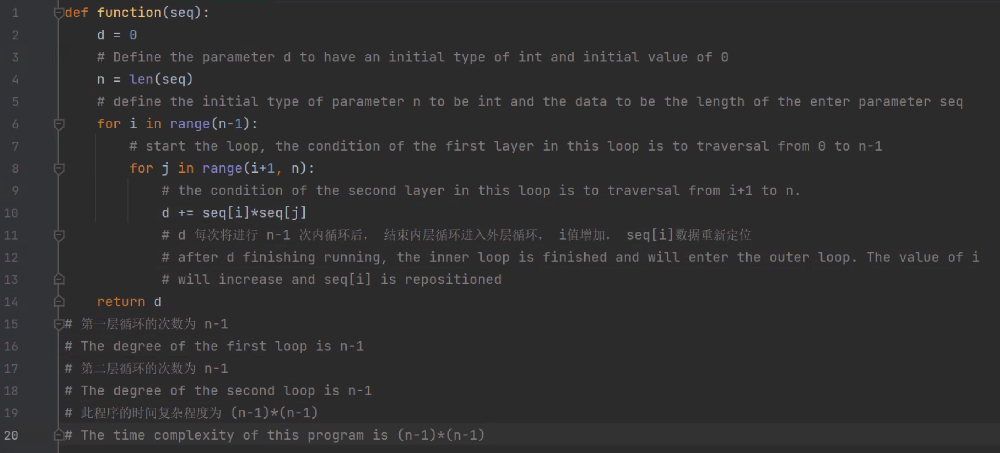

对应题目：[https://bornforthis.cn/1v1/20-Frank/](https://bornforthis.cn/1v1/20-Frank/)

::: tabs

@tab 算法复杂度分析

1. 计算操作次数

```python
def function(seq):
    d = 0 # 定义参数d的初始类型为int ，初始数据为0
    n = len(seq) # 定义参数 n 的初始类型为 int，数据为 传入参数seq的长度
    for i in range(n - 1): #进行循环，第一层循环条件为 0 到 n - 1 的遍历
        for j in range(i+1, n): # 第二层循环条件为 i+1 到 n 的遍历
            d += seq[i] * seq[j] 
			# 嵌套循环条件下可确定 i，j用来定位数据，
			# d每次将进行 n-1 次内层循环后， 结束内层循环进入外层循环，i值增加，seq[i]数据重新定位
    return d
```



- 第一层 for 循环执行 n-1 次。

- 第二层 for 循环执行 n 次。

- for 循环内部执行的计算是： `d+= seq[i]*seq[j]` 该行代码为常数计算。

因此该代码的操作次数为：`(n - 1) * n`

2. 大 O 证明

- $T(n) = n^4-10n^2+50$   

- 当 n 增大时，$n^4$ 项将开始占据主导地位，其他项可以忽略。

- 当 n = 1000 时。 $n^4$ 项 远大于 $n^2$ 项，因此在大部分情况下，可省略 $n^2$ 项对表达式的值的影响。

@tab 线性查找 LinearSearch.py

```python
# -*- coding: utf-8 -*-
# @Time    : 2023/1/27 19:06
# @Author  : AI悦创
# @FileName: hw01.py
# @Software: PyCharm
# @Blog    ：https://bornforthis.cn/
def list_linear_search(target, source):
    res_list = []

    def LinearSearch(target, source):
        # 函数一遇到 return 就结束
        length = len(target)
        for i in range(length):
            if (target[i] == source):
                return i
        return -1

    for i in source:
        res = LinearSearch(source, i)
        if res != -1:
            res_list.append(res)
        else:
            return res_list
            # res_list.append(-1)
    return res_list


# search([1,3], [1,5,6]) 表示在 source 列表中搜素 1，搜索 2
# 这个例子 如果我是输入[1,4], [1, 5, 6]
# 1能找到，但是4找不到 那我直接返回找不到么
arr = [1, 4]
x = [1, 5, 6]
result = list_linear_search(x, arr)
if result:
    print("元素在数组中的索引为", result)
else:
    print("元素不在数组中")
```

@tab 二分查找 binarySearch.py

```python
# -*- coding: utf-8 -*-
# @Time    : 2023/1/27 20:55
# @Author  : AI悦创
# @FileName: binarySearch.py.py
# @Software: PyCharm
# @Blog    ：https://bornforthis.cn/
def list_binary_search(arr, data):
    res_list = []

    def binary_search(arr, left, right, data):
        # 当右指针在左指针的右边时，继续查找
        if right >= left:
            mid = int(left + (right - left) / 2)
            # 元素整好的中间位置，如果元素定位成功则直接返回 mid 为元素的索引
            if arr[mid] == data:
                return mid
            # 元素小于中间位置的元素，只需要再比较左边的元素
            elif arr[mid] > data:
                return binary_search(arr, left, mid - 1, data)
            # 元素大于中间位置的元素，只需要再比较右边的元素
            else:
                return binary_search(arr, mid + 1, right, data)
        else:
            # 不存在
            return -1

    # 对 data 中的每个元素进行二分查找
    # 如果每个元素都能在 arr 中找到，则返回一个包含每个元素索引的列表
    # 如果有一个元素在 arr 中找不到，则返回元素查找失败
    for i in data:
        res = binary_search(arr, 0, len(arr) - 1, i)
        if res != -1:
            res_list.append(res)
        else:
            return res_list
    return res_list


# 测试数组
arr = [2, 3, 4, 10, 40]
x = [3, 10]

# 函数调用
result = list_binary_search(arr, x)

if result:
    print("元素在数组中的索引为", result)
else:
    print("元素不在数组中")
```

@tab BinaryAndLinear.py

```python
import random
import time
from random import choice

# 列表源生成，使用random.seed()生成随机数添加进列表
def list_source(n):
    # make a list of n random integers
    a_list = []
    random.seed(12345)
    for i in range(n):
        a_list.append(random.randint(0, n))
    return a_list

# 列表目标生成， 百分之 50 的 数值从列表源中随机抽取，
# 另百分之 50 的数值使用random.seed()生成随机数并判定是否在列表源中，
def list_target(k, arr):
    b_list = []
    k_half = round(k / 2)
    random.seed(12345)
    for i in range(k):
        if len(b_list) < k_half:
            b_list.append(choice(arr))
        elif len(b_list) >= k_half:
            num = random.randint(0, 12345)
            if num not in arr:
                b_list.append(num)
    return b_list

# 二分查找
def list_binary_search(arr, data):
    res_list = []
    def binary_search (arr, left, right, data): 
  
        #当右指针在左指针的右边时，继续查找
        if right >= left: 
            mid = int(left + (right - left)/2)
  
        # 元素整好的中间位置,如果元素定位成功则直接返回mid为元素的索引
            if arr[mid] == data: 
                return mid 
          
        # 元素小于中间位置的元素，只需要再比较左边的元素
            elif arr[mid] > data: 
                return binary_search(arr, left, mid-1, data) 
  
        # 元素大于中间位置的元素，只需要再比较右边的元素
            else: 
                return binary_search(arr, mid+1, right, data) 
  
        else: 
        # 不存在
            return -1

    # 对data中的每个元素进行二分查找
    #如果每个元素都能在arr中找到，则返回一个包含每个元素索引的列表
    #如果有一个元素在arr中找不到，则返回元素查找失败
    for i in data:
        res = binary_search(arr, 0, len(arr)-1, i)
        if res != -1:
            res_list.append(res)
        else :
            res_list.append(-1)
    return res_list     


# 线性搜索

def list_linear_search(ls, data):
    res_list = []
    def LinearSearch(ls, data):
        length = len(ls)
        for i in range(length):
            if (ls[i] == data):
                return i
        return -1
    for i in data:
        res = LinearSearch(ls, i)
        if res != -1:
            res_list.append(res)
        else:
            res_list.append(-1)
    return res_list

## 首先编写快速排序代码对列表进行排序。

##快速排序代码来自于 https://www.geeksforgeeks.org/python-program-for-quicksort/

def partition(array, low, high):

	# choose the rightmost element as pivot
	pivot = array[high]

	# pointer for greater element
	i = low - 1

	# traverse through all elements
	# compare each element with pivot
	for j in range(low, high):
		if array[j] <= pivot:

			# If element smaller than pivot is found
			# swap it with the greater element pointed by i
			i = i + 1

			# Swapping element at i with element at j
			(array[i], array[j]) = (array[j], array[i])

	# Swap the pivot element with the greater element specified by i
	(array[i + 1], array[high]) = (array[high], array[i + 1])

	# Return the position from where partition is done
	return i + 1

# function to perform quicksort


def quickSort(array, low, high):
	if low < high:

		# Find pivot element such that
		# element smaller than pivot are on the left
		# element greater than pivot are on the right
		pi = partition(array, low, high)

		# Recursive call on the left of pivot
		quickSort(array, low, pi - 1)

		# Recursive call on the right of pivot
		quickSort(array, pi + 1, high)


# 二分查找和线性搜索的比较


n = 1000
k = 100
print("n = ",n, "k = ",k,"时，进行时间记录")
# 生成列表源
arr = list_source(n)
print("列表源:")
print(list_source(n))

# 生成列表目标
brr = list_target(k, arr)
print("排序前列表目标:")
print(brr)

# 记录二分查找的时间
# 引入time模块
print("二分查找开始")
start = time.time()
quickSort(brr, 0, len(brr) - 1)
print("排序后的列表目标:")
print(brr)
# 进行二分查找
res = list_binary_search(brr, arr)
print("二分查找结果",res)
end = time.time()
print("二分查找的时间:", end - start)


print("线性查找开始")
start = time.time()
quickSort(brr, 0, len(brr) - 1)
print("排序后的列表目标:")
print(brr)
# 进行线性查找
res_linear = list_linear_search(brr, arr)
print("线性查找结果",res_linear)
end = time.time()
print("线性查找的时间:", end - start)


'''
n =  100 k =  45 时，进行时间记录
列表源:
[53, 93, 1, 38, 47, 24, 34, 72, 55, 20, 47, 15, 55, 33, 71, 80, 22, 78, 70, 23, 45, 94, 93, 11, 67, 94, 52, 74, 64, 21, 18, 26, 92, 9, 24, 43, 41, 3, 58, 43, 3, 65, 88, 95, 53, 0, 0, 84, 20, 98, 74, 22, 36, 12, 83, 53, 13, 87, 73, 23, 94, 48, 29, 67, 76, 90, 42, 5, 29, 15, 63, 27, 94, 96, 71, 85, 23, 32, 75, 55, 66, 16, 5, 21, 38, 1, 19, 29, 44, 69, 43, 20, 49, 41, 1, 6, 7, 91, 56, 10]
排序前列表目标:
[12, 41, 93, 58, 84, 67, 24, 94, 53, 45, 84, 80, 53, 9, 27, 66, 93, 75, 63, 11, 0, 1, 12007, 1495, 8700, 12048, 6752, 9585, 8256, 2729, 2427, 3370, 11779, 1275, 3112, 5596, 5276, 385, 7517, 5562, 440, 8367, 11316, 12198, 6807]
二分查找开始
排序后的列表目标:
[0, 1, 9, 11, 12, 24, 27, 41, 45, 53, 53, 58, 63, 66, 67, 75, 80, 84, 84, 93, 93, 94, 385, 440, 1275, 1495, 2427, 2729, 3112, 3370, 5276, 5562, 5596, 6752, 6807, 7517, 8256, 8367, 8700, 9585, 11316, 11779, 12007, 12048, 12198]
二分查找结果 [10, 19, 1, -1, -1, 5, -1, -1, -1, -1, -1, -1, -1, -1, -1, 16, -1, -1, -1, -1, 8, 21, 19, 3, 14, 21, -1, -1, -1, -1, -1, -1, -1, 2, 5, -1, 7, -1, 11, -1, -1, -1, -1, -1, 10, 0, 0, 17, -1, -1, -1, -1, -1, 4, -1, 10, -1, -1, -1, -1, 21, -1, -1, 14, -1, -1, -1, -1, -1, -1, 12, 6, 21, -1, -1, -1, -1, -1, 15, -1, 13, -1, -1, -1, -1, 1, -1, -1, -1, -1, -1, -1, -1, 7, 1, -1, -1, -1, -1, -1]
二分查找的时间: 0.0006499290466308594
线性查找开始
排序后的列表目标:
[0, 1, 9, 11, 12, 24, 27, 41, 45, 53, 53, 58, 63, 66, 67, 75, 80, 84, 84, 93, 93, 94, 385, 440, 1275, 1495, 2427, 2729, 3112, 3370, 5276, 5562, 5596, 6752, 6807, 7517, 8256, 8367, 8700, 9585, 11316, 11779, 12007, 12048, 12198]
线性查找结果 [9, 19, 1, -1, -1, 5, -1, -1, -1, -1, -1, -1, -1, -1, -1, 16, -1, -1, -1, -1, 8, 21, 19, 3, 14, 21, -1, -1, -1, -1, -1, -1, -1, 2, 5, -1, 7, -1, 11, -1, -1, -1, -1, -1, 9, 0, 0, 17, -1, -1, -1, -1, -1, 4, -1, 9, -1, -1, -1, -1, 21, -1, -1, 14, -1, -1, -1, -1, -1, -1, 12, 6, 21, -1, -1, -1, -1, -1, 15, -1, 13, -1, -1, -1, -1, 1, -1, -1, -1, -1, -1, -1, -1, 7, 1, -1, -1, -1, -1, -1]
线性查找的时间: 0.0007121562957763672


n =  100 k =  46 时，进行时间记录
列表源:
[53, 93, 1, 38, 47, 24, 34, 72, 55, 20, 47, 15, 55, 33, 71, 80, 22, 78, 70, 23, 45, 94, 93, 11, 67, 94, 52, 74, 64, 21, 18, 26, 92, 9, 24, 43, 41, 3, 58, 43, 3, 65, 88, 95, 53, 0, 0, 84, 20, 98, 74, 22, 36, 12, 83, 53, 13, 87, 73, 23, 94, 48, 29, 67, 76, 90, 42, 5, 29, 15, 63, 27, 94, 96, 71, 85, 23, 32, 75, 55, 66, 16, 5, 21, 38, 1, 19, 29, 44, 69, 43, 20, 49, 41, 1, 6, 7, 91, 56, 10]
排序前列表目标:
[12, 41, 93, 58, 84, 67, 24, 94, 53, 45, 84, 80, 53, 9, 27, 66, 93, 75, 63, 11, 0, 1, 41, 1495, 8700, 12048, 6752, 9585, 8256, 2729, 2427, 3370, 11779, 1275, 3112, 5596, 5276, 385, 7517, 5562, 440, 8367, 11316, 12198, 6807]
二分查找开始
排序后的列表目标:
[0, 1, 9, 11, 12, 24, 27, 41, 41, 45, 53, 53, 58, 63, 66, 67, 75, 80, 84, 84, 93, 93, 94, 385, 440, 1275, 1495, 2427, 2729, 3112, 3370, 5276, 5562, 5596, 6752, 6807, 7517, 8256, 8367, 8700, 9585, 11316, 11779, 12048, 12198]
二分查找结果 [10, 20, 1, -1, -1, 5, -1, -1, -1, -1, -1, -1, -1, -1, -1, 17, -1, -1, -1, -1, 9, 22, 20, 3, 15, 22, -1, -1, -1, -1, -1, -1, -1, 2, 5, -1, 7, -1, 12, -1, -1, -1, -1, -1, 10, 0, 0, 19, -1, -1, -1, -1, -1, 4, -1, 10, -1, -1, -1, -1, 22, -1, -1, 15, -1, -1, -1, -1, -1, -1, 13, 6, 22, -1, -1, -1, -1, -1, 16, -1, 14, -1, -1, -1, -1, 1, -1, -1, -1, -1, -1, -1, -1, 7, 1, -1, -1, -1, -1, -1]
二分查找的时间: 0.000640869140625
线性查找开始
排序后的列表目标:
[0, 1, 9, 11, 12, 24, 27, 41, 41, 45, 53, 53, 58, 63, 66, 67, 75, 80, 84, 84, 93, 93, 94, 385, 440, 1275, 1495, 2427, 2729, 3112, 3370, 5276, 5562, 5596, 6752, 6807, 7517, 8256, 8367, 8700, 9585, 11316, 11779, 12048, 12198]
线性查找结果 [10, 20, 1, -1, -1, 5, -1, -1, -1, -1, -1, -1, -1, -1, -1, 17, -1, -1, -1, -1, 9, 22, 20, 3, 15, 22, -1, -1, -1, -1, -1, -1, -1, 2, 5, -1, 7, -1, 12, -1, -1, -1, -1, -1, 10, 0, 0, 18, -1, -1, -1, -1, -1, 4, -1, 10, -1, -1, -1, -1, 22, -1, -1, 15, -1, -1, -1, -1, -1, -1, 13, 6, 22, -1, -1, -1, -1, -1, 16, -1, 14, -1, -1, -1, -1, 1, -1, -1, -1, -1, -1, -1, -1, 7, 1, -1, -1, -1, -1, -1]
线性查找的时间: 0.0006861686706542969

n =  100 k =  50 时，进行时间记录
列表源:
[53, 93, 1, 38, 47, 24, 34, 72, 55, 20, 47, 15, 55, 33, 71, 80, 22, 78, 70, 23, 45, 94, 93, 11, 67, 94, 52, 74, 64, 21, 18, 26, 92, 9, 24, 43, 41, 3, 58, 43, 3, 65, 88, 95, 53, 0, 0, 84, 20, 98, 74, 22, 36, 12, 83, 53, 13, 87, 73, 23, 94, 48, 29, 67, 76, 90, 42, 5, 29, 15, 63, 27, 94, 96, 71, 85, 23, 32, 75, 55, 66, 16, 5, 21, 38, 1, 19, 29, 44, 69, 43, 20, 49, 41, 1, 6, 7, 91, 56, 10]
排序前列表目标:
[12, 41, 93, 58, 84, 67, 24, 94, 53, 45, 84, 80, 53, 9, 27, 66, 93, 75, 63, 11, 0, 1, 41, 15, 5, 12048, 6752, 9585, 8256, 2729, 2427, 3370, 11779, 1275, 3112, 5596, 5276, 385, 7517, 5562, 440, 8367, 11316, 12198, 6807, 109, 10877, 2683, 9504]
二分查找开始
排序后的列表目标:
[0, 1, 5, 9, 11, 12, 15, 24, 27, 41, 41, 45, 53, 53, 58, 63, 66, 67, 75, 80, 84, 84, 93, 93, 94, 109, 385, 440, 1275, 2427, 2683, 2729, 3112, 3370, 5276, 5562, 5596, 6752, 6807, 7517, 8256, 8367, 9504, 9585, 10877, 11316, 11779, 12048, 12198]
二分查找结果 [12, 22, 1, -1, -1, 7, -1, -1, -1, -1, -1, 6, -1, -1, -1, 19, -1, -1, -1, -1, 11, 24, 22, 4, 17, 24, -1, -1, -1, -1, -1, -1, -1, 3, 7, -1, 9, -1, 14, -1, -1, -1, -1, -1, 12, 0, 0, 20, -1, -1, -1, -1, -1, 5, -1, 12, -1, -1, -1, -1, 24, -1, -1, 17, -1, -1, -1, 2, -1, 6, 15, 8, 24, -1, -1, -1, -1, -1, 18, -1, 16, -1, 2, -1, -1, 1, -1, -1, -1, -1, -1, -1, -1, 9, 1, -1, -1, -1, -1, -1]
二分查找的时间: 0.0006291866302490234
线性查找开始
排序后的列表目标:
[0, 1, 5, 9, 11, 12, 15, 24, 27, 41, 41, 45, 53, 53, 58, 63, 66, 67, 75, 80, 84, 84, 93, 93, 94, 109, 385, 440, 1275, 2427, 2683, 2729, 3112, 3370, 5276, 5562, 5596, 6752, 6807, 7517, 8256, 8367, 9504, 9585, 10877, 11316, 11779, 12048, 12198]
线性查找结果 [12, 22, 1, -1, -1, 7, -1, -1, -1, -1, -1, 6, -1, -1, -1, 19, -1, -1, -1, -1, 11, 24, 22, 4, 17, 24, -1, -1, -1, -1, -1, -1, -1, 3, 7, -1, 9, -1, 14, -1, -1, -1, -1, -1, 12, 0, 0, 20, -1, -1, -1, -1, -1, 5, -1, 12, -1, -1, -1, -1, 24, -1, -1, 17, -1, -1, -1, 2, -1, 6, 15, 8, 24, -1, -1, -1, -1, -1, 18, -1, 16, -1, 2, -1, -1, 1, -1, -1, -1, -1, -1, -1, -1, 9, 1, -1, -1, -1, -1, -1]
线性查找的时间: 0.0007071495056152344


TODO:
经过测试 当 n - 100 时， k值大于45时, 二分查找的时间会小于线性查找的时间
当 n = 1000 时， k值大于等于 22 时，二分查找的时间稳定小于线性查找的时间
当 n = 10000 时， k值大于等于 34 时， 二分查找的时间稳定小于线性查找的时间

'''
```

@tab quickSort.py

```python
## 首先编写快速排序代码对列表进行排序。

##快速排序代码来自于 https://www.geeksforgeeks.org/python-program-for-quicksort/

def partition(array, low, high):

	# choose the rightmost element as pivot
	pivot = array[high]

	# pointer for greater element
	i = low - 1

	# traverse through all elements
	# compare each element with pivot
	for j in range(low, high):
		if array[j] <= pivot:

			# If element smaller than pivot is found
			# swap it with the greater element pointed by i
			i = i + 1

			# Swapping element at i with element at j
			(array[i], array[j]) = (array[j], array[i])

	# Swap the pivot element with the greater element specified by i
	(array[i + 1], array[high]) = (array[high], array[i + 1])

	# Return the position from where partition is done
	return i + 1

# function to perform quicksort


def quickSort(array, low, high):
	if low < high:

		# Find pivot element such that
		# element smaller than pivot are on the left
		# element greater than pivot are on the right
		pi = partition(array, low, high)

		# Recursive call on the left of pivot
		quickSort(array, low, pi - 1)

		# Recursive call on the right of pivot
		quickSort(array, pi + 1, high)


data = [1, 7, 4, 1, 10, 9, -2]
print("Unsorted Array")
print(data)

size = len(data)

quickSort(data, 0, size - 1)

print('Sorted Array in Ascending Order:')
print(data)
```

@tab stackRobot.py

```python
def stackRobot(a_list):
    final_list = []
    length = len(a_list)
    for i in range(length):
        if (a_list[i] == "A"):
            #当输入的列表中存在有“A”字符串时，向该列表中添加前两项数值的总和
            before_one = final_list[-1]
            before_two = final_list[-2]
            final_list.append(before_one+before_two)
            continue    
        if(a_list[i] == "T"):
            # 当输入的列表中存在有“T”字符串时，向该列表中添加前一项数值的三倍
            tmp = final_list[-1]
            final_list.append(tmp*3)
            continue
        if(a_list[i] == "D"):
            final_list.pop()
            continue
        else:
            final_list.append(int(a_list[i]))
    return final_list

str= input("你好我是Leveraging Stack,请输入一个列表:")
str = str[1:-1]
a_list = str.split(',')
print(a_list)
result =stackRobot(a_list)
print(result)
```

:::

## Update

::: tabs

@tab LinearSearch.py

```python
def list_linear_search(ls, data):
    res_list = []
    def LinearSearch(ls, data):
        length = len(ls)
        for i in range(length):
            if (ls[i] == data):
                return i
        return -1
    for i in data:
        res = LinearSearch(ls, i)
        if res != -1:
            res_list.append(res)
        else:
            return []
    return res_list


# arr = [ 1,5,6 ] 
# x =[1,4]
arr = [ 2, 3, 4, 10, 40 ] 
x =[1, 10]
result = list_linear_search(arr, x)
if result :
    print ("元素在数组中的索引为" ,result )
else:
    print ("存在有元素不在数组中")
```

@tab binarySearch.py

```python
def list_binary_search(arr, data):
    res_list = []
    def binary_search (arr, left, right, data): 
  
        #当右指针在左指针的右边时，继续查找
        if right >= left: 
            mid = int(left + (right - left)/2)
  
        # 元素整好的中间位置,如果元素定位成功则直接返回mid为元素的索引
            if arr[mid] == data: 
                return mid 
          
        # 元素小于中间位置的元素，只需要再比较左边的元素
            elif arr[mid] > data: 
                return binary_search(arr, left, mid-1, data) 
  
        # 元素大于中间位置的元素，只需要再比较右边的元素
            else: 
                return binary_search(arr, mid+1, right, data) 
  
        else: 
        # 不存在
            return -1

    # 对data中的每个元素进行二分查找
    #如果每个元素都能在arr中找到，则返回一个包含每个元素索引的列表
    #如果有一个元素在arr中找不到，则返回元素查找失败
    for i in data:
        res = binary_search(arr, 0, len(arr)-1, i)
        if res != -1:
            res_list.append(res)
        else:
            return []
    return res_list        


# 测试数组
arr = [ 1,5,6 ] 
x =[1,4]
  
# 函数调用
result = list_binary_search(arr, x)
  
if result : 
    print ("元素在数组中的索引为" ,result )
else: 
    print ("存在有元素不在数组中")
```

@tab BinaryAndLinear.py

```python
import random
import time
from random import choice

# 列表源生成，使用random.seed()生成随机数添加进列表
def list_source(n):
    # make a list of n random integers
    a_list = []
    random.seed(12345)
    for i in range(n):
        a_list.append(random.randint(0, n))
    return a_list

# 列表目标生成， 百分之 50 的 数值从列表源中随机抽取，
# 另百分之 50 的数值使用random.seed()生成随机数并判定是否在列表源中，
def list_target(k, arr):
    b_list = []
    k_half = round(k / 2)
    random.seed(12345)
    for i in range(k):
        if len(b_list) < k_half:
            b_list.append(choice(arr))
        elif len(b_list) >= k_half:
            num = random.randint(0, 12345)
            if num not in arr:
                b_list.append(num)
    return b_list

# 二分查找
def list_binary_search(arr, data):
    res_list = []
    def binary_search (arr, left, right, data): 
  
        #当右指针在左指针的右边时，继续查找
        if right >= left: 
            mid = int(left + (right - left)/2)
  
        # 元素整好的中间位置,如果元素定位成功则直接返回mid为元素的索引
            if arr[mid] == data: 
                return mid 
          
        # 元素小于中间位置的元素，只需要再比较左边的元素
            elif arr[mid] > data: 
                return binary_search(arr, left, mid-1, data) 
  
        # 元素大于中间位置的元素，只需要再比较右边的元素
            else: 
                return binary_search(arr, mid+1, right, data) 
  
        else: 
        # 不存在
            return -1

    # 对data中的每个元素进行二分查找
    #如果每个元素都能在arr中找到，则返回一个包含每个元素索引的列表
    #如果有一个元素在arr中找不到，则返回元素查找失败
    for i in data:
        res = binary_search(arr, 0, len(arr)-1, i)
        if res != -1:
            res_list.append(res)
        else :
            res_list.append(-1)
    return res_list     


# 线性搜索

def list_linear_search(ls, data):
    res_list = []
    def LinearSearch(ls, data):
        length = len(ls)
        for i in range(length):
            if (ls[i] == data):
                return i
        return -1
    for i in data:
        res = LinearSearch(ls, i)
        if res != -1:
            res_list.append(res)
        else:
            res_list.append(-1)
    return res_list

## 首先编写快速排序代码对列表进行排序。

##快速排序代码来自于 https://www.geeksforgeeks.org/python-program-for-quicksort/

def partition(array, low, high):

	# choose the rightmost element as pivot
	pivot = array[high]

	# pointer for greater element
	i = low - 1

	# traverse through all elements
	# compare each element with pivot
	for j in range(low, high):
		if array[j] <= pivot:

			# If element smaller than pivot is found
			# swap it with the greater element pointed by i
			i = i + 1

			# Swapping element at i with element at j
			(array[i], array[j]) = (array[j], array[i])

	# Swap the pivot element with the greater element specified by i
	(array[i + 1], array[high]) = (array[high], array[i + 1])

	# Return the position from where partition is done
	return i + 1

# function to perform quicksort


def quickSort(array, low, high):
	if low < high:

		# Find pivot element such that
		# element smaller than pivot are on the left
		# element greater than pivot are on the right
		pi = partition(array, low, high)

		# Recursive call on the left of pivot
		quickSort(array, low, pi - 1)

		# Recursive call on the right of pivot
		quickSort(array, pi + 1, high)


# 二分查找和线性搜索的比较


n = 1000
k = 100
print("n = ",n, "k = ",k,"时，进行时间记录")
# 生成列表源
arr = list_source(n)
print("列表源:")
print(list_source(n))

# 生成列表目标
brr = list_target(k, arr)
print("排序前列表目标:")
print(brr)

# 记录二分查找的时间
# 引入time模块
print("二分查找开始")
start = time.time()
quickSort(brr, 0, len(brr) - 1)
print("排序后的列表目标:")
print(brr)
# 进行二分查找
res = list_binary_search(brr, arr)
print("二分查找结果",res)
end = time.time()
print("二分查找的时间:", end - start)


print("线性查找开始")
start = time.time()
quickSort(brr, 0, len(brr) - 1)
print("排序后的列表目标:")
print(brr)
# 进行线性查找
res_linear = list_linear_search(brr, arr)
print("线性查找结果",res_linear)
end = time.time()
print("线性查找的时间:", end - start)


'''
n =  100 k =  45 时，进行时间记录
列表源:
[53, 93, 1, 38, 47, 24, 34, 72, 55, 20, 47, 15, 55, 33, 71, 80, 22, 78, 70, 23, 45, 94, 93, 11, 67, 94, 52, 74, 64, 21, 18, 26, 92, 9, 24, 43, 41, 3, 58, 43, 3, 65, 88, 95, 53, 0, 0, 84, 20, 98, 74, 22, 36, 12, 83, 53, 13, 87, 73, 23, 94, 48, 29, 67, 76, 90, 42, 5, 29, 15, 63, 27, 94, 96, 71, 85, 23, 32, 75, 55, 66, 16, 5, 21, 38, 1, 19, 29, 44, 69, 43, 20, 49, 41, 1, 6, 7, 91, 56, 10]
排序前列表目标:
[12, 41, 93, 58, 84, 67, 24, 94, 53, 45, 84, 80, 53, 9, 27, 66, 93, 75, 63, 11, 0, 1, 12007, 1495, 8700, 12048, 6752, 9585, 8256, 2729, 2427, 3370, 11779, 1275, 3112, 5596, 5276, 385, 7517, 5562, 440, 8367, 11316, 12198, 6807]
二分查找开始
排序后的列表目标:
[0, 1, 9, 11, 12, 24, 27, 41, 45, 53, 53, 58, 63, 66, 67, 75, 80, 84, 84, 93, 93, 94, 385, 440, 1275, 1495, 2427, 2729, 3112, 3370, 5276, 5562, 5596, 6752, 6807, 7517, 8256, 8367, 8700, 9585, 11316, 11779, 12007, 12048, 12198]
二分查找结果 [10, 19, 1, -1, -1, 5, -1, -1, -1, -1, -1, -1, -1, -1, -1, 16, -1, -1, -1, -1, 8, 21, 19, 3, 14, 21, -1, -1, -1, -1, -1, -1, -1, 2, 5, -1, 7, -1, 11, -1, -1, -1, -1, -1, 10, 0, 0, 17, -1, -1, -1, -1, -1, 4, -1, 10, -1, -1, -1, -1, 21, -1, -1, 14, -1, -1, -1, -1, -1, -1, 12, 6, 21, -1, -1, -1, -1, -1, 15, -1, 13, -1, -1, -1, -1, 1, -1, -1, -1, -1, -1, -1, -1, 7, 1, -1, -1, -1, -1, -1]
二分查找的时间: 0.0006499290466308594
线性查找开始
排序后的列表目标:
[0, 1, 9, 11, 12, 24, 27, 41, 45, 53, 53, 58, 63, 66, 67, 75, 80, 84, 84, 93, 93, 94, 385, 440, 1275, 1495, 2427, 2729, 3112, 3370, 5276, 5562, 5596, 6752, 6807, 7517, 8256, 8367, 8700, 9585, 11316, 11779, 12007, 12048, 12198]
线性查找结果 [9, 19, 1, -1, -1, 5, -1, -1, -1, -1, -1, -1, -1, -1, -1, 16, -1, -1, -1, -1, 8, 21, 19, 3, 14, 21, -1, -1, -1, -1, -1, -1, -1, 2, 5, -1, 7, -1, 11, -1, -1, -1, -1, -1, 9, 0, 0, 17, -1, -1, -1, -1, -1, 4, -1, 9, -1, -1, -1, -1, 21, -1, -1, 14, -1, -1, -1, -1, -1, -1, 12, 6, 21, -1, -1, -1, -1, -1, 15, -1, 13, -1, -1, -1, -1, 1, -1, -1, -1, -1, -1, -1, -1, 7, 1, -1, -1, -1, -1, -1]
线性查找的时间: 0.0007121562957763672


n =  100 k =  46 时，进行时间记录
列表源:
[53, 93, 1, 38, 47, 24, 34, 72, 55, 20, 47, 15, 55, 33, 71, 80, 22, 78, 70, 23, 45, 94, 93, 11, 67, 94, 52, 74, 64, 21, 18, 26, 92, 9, 24, 43, 41, 3, 58, 43, 3, 65, 88, 95, 53, 0, 0, 84, 20, 98, 74, 22, 36, 12, 83, 53, 13, 87, 73, 23, 94, 48, 29, 67, 76, 90, 42, 5, 29, 15, 63, 27, 94, 96, 71, 85, 23, 32, 75, 55, 66, 16, 5, 21, 38, 1, 19, 29, 44, 69, 43, 20, 49, 41, 1, 6, 7, 91, 56, 10]
排序前列表目标:
[12, 41, 93, 58, 84, 67, 24, 94, 53, 45, 84, 80, 53, 9, 27, 66, 93, 75, 63, 11, 0, 1, 41, 1495, 8700, 12048, 6752, 9585, 8256, 2729, 2427, 3370, 11779, 1275, 3112, 5596, 5276, 385, 7517, 5562, 440, 8367, 11316, 12198, 6807]
二分查找开始
排序后的列表目标:
[0, 1, 9, 11, 12, 24, 27, 41, 41, 45, 53, 53, 58, 63, 66, 67, 75, 80, 84, 84, 93, 93, 94, 385, 440, 1275, 1495, 2427, 2729, 3112, 3370, 5276, 5562, 5596, 6752, 6807, 7517, 8256, 8367, 8700, 9585, 11316, 11779, 12048, 12198]
二分查找结果 [10, 20, 1, -1, -1, 5, -1, -1, -1, -1, -1, -1, -1, -1, -1, 17, -1, -1, -1, -1, 9, 22, 20, 3, 15, 22, -1, -1, -1, -1, -1, -1, -1, 2, 5, -1, 7, -1, 12, -1, -1, -1, -1, -1, 10, 0, 0, 19, -1, -1, -1, -1, -1, 4, -1, 10, -1, -1, -1, -1, 22, -1, -1, 15, -1, -1, -1, -1, -1, -1, 13, 6, 22, -1, -1, -1, -1, -1, 16, -1, 14, -1, -1, -1, -1, 1, -1, -1, -1, -1, -1, -1, -1, 7, 1, -1, -1, -1, -1, -1]
二分查找的时间: 0.000640869140625
线性查找开始
排序后的列表目标:
[0, 1, 9, 11, 12, 24, 27, 41, 41, 45, 53, 53, 58, 63, 66, 67, 75, 80, 84, 84, 93, 93, 94, 385, 440, 1275, 1495, 2427, 2729, 3112, 3370, 5276, 5562, 5596, 6752, 6807, 7517, 8256, 8367, 8700, 9585, 11316, 11779, 12048, 12198]
线性查找结果 [10, 20, 1, -1, -1, 5, -1, -1, -1, -1, -1, -1, -1, -1, -1, 17, -1, -1, -1, -1, 9, 22, 20, 3, 15, 22, -1, -1, -1, -1, -1, -1, -1, 2, 5, -1, 7, -1, 12, -1, -1, -1, -1, -1, 10, 0, 0, 18, -1, -1, -1, -1, -1, 4, -1, 10, -1, -1, -1, -1, 22, -1, -1, 15, -1, -1, -1, -1, -1, -1, 13, 6, 22, -1, -1, -1, -1, -1, 16, -1, 14, -1, -1, -1, -1, 1, -1, -1, -1, -1, -1, -1, -1, 7, 1, -1, -1, -1, -1, -1]
线性查找的时间: 0.0006861686706542969

n =  100 k =  50 时，进行时间记录
列表源:
[53, 93, 1, 38, 47, 24, 34, 72, 55, 20, 47, 15, 55, 33, 71, 80, 22, 78, 70, 23, 45, 94, 93, 11, 67, 94, 52, 74, 64, 21, 18, 26, 92, 9, 24, 43, 41, 3, 58, 43, 3, 65, 88, 95, 53, 0, 0, 84, 20, 98, 74, 22, 36, 12, 83, 53, 13, 87, 73, 23, 94, 48, 29, 67, 76, 90, 42, 5, 29, 15, 63, 27, 94, 96, 71, 85, 23, 32, 75, 55, 66, 16, 5, 21, 38, 1, 19, 29, 44, 69, 43, 20, 49, 41, 1, 6, 7, 91, 56, 10]
排序前列表目标:
[12, 41, 93, 58, 84, 67, 24, 94, 53, 45, 84, 80, 53, 9, 27, 66, 93, 75, 63, 11, 0, 1, 41, 15, 5, 12048, 6752, 9585, 8256, 2729, 2427, 3370, 11779, 1275, 3112, 5596, 5276, 385, 7517, 5562, 440, 8367, 11316, 12198, 6807, 109, 10877, 2683, 9504]
二分查找开始
排序后的列表目标:
[0, 1, 5, 9, 11, 12, 15, 24, 27, 41, 41, 45, 53, 53, 58, 63, 66, 67, 75, 80, 84, 84, 93, 93, 94, 109, 385, 440, 1275, 2427, 2683, 2729, 3112, 3370, 5276, 5562, 5596, 6752, 6807, 7517, 8256, 8367, 9504, 9585, 10877, 11316, 11779, 12048, 12198]
二分查找结果 [12, 22, 1, -1, -1, 7, -1, -1, -1, -1, -1, 6, -1, -1, -1, 19, -1, -1, -1, -1, 11, 24, 22, 4, 17, 24, -1, -1, -1, -1, -1, -1, -1, 3, 7, -1, 9, -1, 14, -1, -1, -1, -1, -1, 12, 0, 0, 20, -1, -1, -1, -1, -1, 5, -1, 12, -1, -1, -1, -1, 24, -1, -1, 17, -1, -1, -1, 2, -1, 6, 15, 8, 24, -1, -1, -1, -1, -1, 18, -1, 16, -1, 2, -1, -1, 1, -1, -1, -1, -1, -1, -1, -1, 9, 1, -1, -1, -1, -1, -1]
二分查找的时间: 0.0006291866302490234
线性查找开始
排序后的列表目标:
[0, 1, 5, 9, 11, 12, 15, 24, 27, 41, 41, 45, 53, 53, 58, 63, 66, 67, 75, 80, 84, 84, 93, 93, 94, 109, 385, 440, 1275, 2427, 2683, 2729, 3112, 3370, 5276, 5562, 5596, 6752, 6807, 7517, 8256, 8367, 9504, 9585, 10877, 11316, 11779, 12048, 12198]
线性查找结果 [12, 22, 1, -1, -1, 7, -1, -1, -1, -1, -1, 6, -1, -1, -1, 19, -1, -1, -1, -1, 11, 24, 22, 4, 17, 24, -1, -1, -1, -1, -1, -1, -1, 3, 7, -1, 9, -1, 14, -1, -1, -1, -1, -1, 12, 0, 0, 20, -1, -1, -1, -1, -1, 5, -1, 12, -1, -1, -1, -1, 24, -1, -1, 17, -1, -1, -1, 2, -1, 6, 15, 8, 24, -1, -1, -1, -1, -1, 18, -1, 16, -1, 2, -1, -1, 1, -1, -1, -1, -1, -1, -1, -1, 9, 1, -1, -1, -1, -1, -1]
线性查找的时间: 0.0007071495056152344


TODO:
经过测试 当 n - 100 时， k值大于45时, 二分查找的时间会小于线性查找的时间
当 n = 1000 时， k值大于等于 22 时，二分查找的时间稳定小于线性查找的时间
当 n = 10000 时， k值大于等于 34 时， 二分查找的时间稳定小于线性查找的时间

'''
```

@tab quickSort.py

```python
## 首先编写快速排序代码对列表进行排序。

##快速排序代码来自于 https://www.geeksforgeeks.org/python-program-for-quicksort/

def partition(array, low, high):

	# choose the rightmost element as pivot
	pivot = array[high]

	# pointer for greater element
	i = low - 1

	# traverse through all elements
	# compare each element with pivot
	for j in range(low, high):
		if array[j] <= pivot:

			# If element smaller than pivot is found
			# swap it with the greater element pointed by i
			i = i + 1

			# Swapping element at i with element at j
			(array[i], array[j]) = (array[j], array[i])

	# Swap the pivot element with the greater element specified by i
	(array[i + 1], array[high]) = (array[high], array[i + 1])

	# Return the position from where partition is done
	return i + 1

# function to perform quicksort


def quickSort(array, low, high):
	if low < high:

		# Find pivot element such that
		# element smaller than pivot are on the left
		# element greater than pivot are on the right
		pi = partition(array, low, high)

		# Recursive call on the left of pivot
		quickSort(array, low, pi - 1)

		# Recursive call on the right of pivot
		quickSort(array, pi + 1, high)


data = [1, 7, 4, 1, 10, 9, -2]
print("Unsorted Array")
print(data)

size = len(data)

quickSort(data, 0, size - 1)

print('Sorted Array in Ascending Order:')
print(data)
```

@tab stackRobot.py

```python
def stackRobot(a_list):
    final_list = []
    length = len(a_list)
    for i in range(length):
        if (a_list[i] == "A"):
            #当输入的列表中存在有“A”字符串时，向该列表中添加前两项数值的总和
            before_one = final_list[-1]
            before_two = final_list[-2]
            final_list.append(before_one+before_two)
            continue    
        if(a_list[i] == "T"):
            # 当输入的列表中存在有“T”字符串时，向该列表中添加前一项数值的三倍
            tmp = final_list[-1]
            final_list.append(tmp*3)
            continue
        if(a_list[i] == "D"):
            final_list.pop()
            continue
        else:
            final_list.append(int(a_list[i]))
    return final_list

str= input("你好我是Leveraging Stack,请输入一个列表:")
str = str[1:-1]
a_list = str.split(',')
print(a_list)
result =stackRobot(a_list)
print(result)
```

:::


::: details 公众号：AI悦创【二维码】


:::

::: info AI悦创·编程一对一

AI悦创·推出辅导班啦，包括「Python 语言辅导班、C++ 辅导班、java 辅导班、算法/数据结构辅导班、少儿编程、pygame 游戏开发、Web、Linux」，全部都是一对一教学：一对一辅导 + 一对一答疑 + 布置作业 + 项目实践等。当然，还有线下线上摄影课程、Photoshop、Premiere 一对一教学、QQ、微信在线，随时响应！微信：Jiabcdefh

C++ 信息奥赛题解，长期更新！长期招收一对一中小学信息奥赛集训，莆田、厦门地区有机会线下上门，其他地区线上。微信：Jiabcdefh

方法一：[QQ](http://wpa.qq.com/msgrd?v=3&uin=1432803776&site=qq&menu=yes)

方法二：微信：Jiabcdefh

:::


