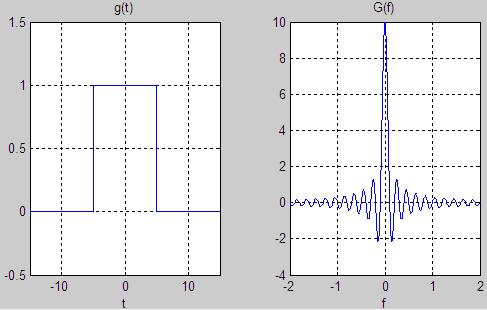
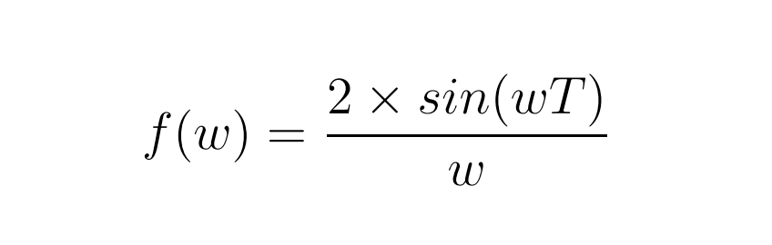
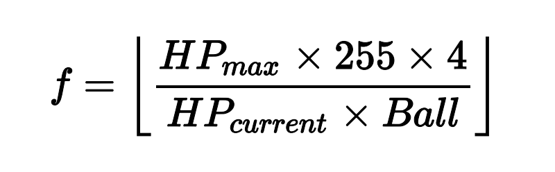
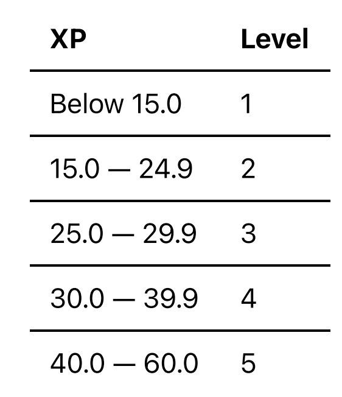

## NYU Tandon School of Engineering 

> 纽约大学坦顿工程学院

CS-UY 1114 Spring 2023 

> CS-UY 1114 2023年春季

Due: 1159pm, Thursday, February 16th, 2023 

> 截止时间:2023年2月16日星期四晚上11 ~ 59分

Submission instructions 

> 提交说明

1. You should submit your homework on Gradescope.

> 你应该在 Gradescope 上提交作业

2. For this assignment you should turn in 6 separate .py files named according to the following pattern: hw2_q1.py, hw2_q2.py, etc. 

> 对于这个任务，你应该提交6个独立的.py文件，按照以下模式命名:Hw2_q1.py, hw2_q2.py等。

3. Each Python file you submit should contain a header comment block as follows:

> 你提交的每个Python文件都应该包含一个头注释块，如下所示:

```python
"""
Author: [Your name here]
Assignment / Part: HW2 - Q1 (etc.)
Date due: 2023-02-16, 11:59pm
I pledge that I have completed this assignment without
collaborating with anyone else, in conformance with the
NYU School of Engineering Policies and Procedures on
Academic Misconduct.
"""
```

```python
”“”
作者:[你的名字在这里]
作业/部分:HW2 - Q1(等)
截止日期:2023-02-16，晚上11:59
我保证我已经完成了这项作业
与任何人合作，符合
纽约大学工程学院的政策和程序
学术不端行为而大出风头。
”“”
```

No late submissions will be accepted. 

> 逾期提交的资料恕不受理。

REMINDER: Do not use any Python structures that we have not learned in class.

> 提醒:不要使用任何我们在课堂上没有学过的Python结构

For this specific assignment, you may use everything we have learned up to, and including, variables, types, mathematical and boolean expressions, user IO (i.e. print() and input()), number systems, and the math / random modules, and selection statements (i.e. if, elif, else). Please reach out to us if you're at all unsure about any instruction or whether a Python structure is or is not allowed. 

> 对于这个特定的赋值，你可以使用我们学过的所有东西，包括变量、类型、数学和布尔表达式、用户IO(即print()和input())、数字系统、数学/随机模块和选择语句(即if、elif、else)。如果您不确定任何指令或Python结构是否被允许，请与我们联系。

Do not use, for example, for- and while-loops, user-defined functions (except for main() if your instructor has covered it during lecture), string methods, file i/o, exception handling, dictionaries, lists, tuples, and/or object-oriented programming. 

> 例如，不要使用for循环和while循环、用户定义函数(main()除外，如果你的导师在课堂上讲过的话)、字符串方法、文件i/o、异常处理、字典、列表、元组和/或面向对象编程。

Failure to abide by any of these instructions will make your submission subject to point deductions. 

> 如不遵守上述任何一项规定，您的投稿将被扣分。

## Problems

1. Harmonic Analysis (**hw2_q1.py**) 

> 谐波分析(**hw2_q1.py**)

2. Oh No! The Pokémon Broke Free! (**hw2_q2.py**) 

> 噢,不!Pokémon挣脱了!(**hw2_q2.py **)

3. Collective Timetables (**hw2_q3.py**) 

> 集体课程表(**hw2_q3.py**)

4. It's Super Effective! (**hw2_q4.py**) 

> 超级有效!(**hw2_q4.py**)

5. Are You Experienced? (**hw2_q5.py**) 

> 你有经验吗?(**hw2_q5.py**)

6. Oh, Oh, Telephone Line, Give Me Some Time (**hw2_q6.py**)

> 哦，哦，电话线，给我一点时间(**hw2_q6.py**)

## Question 1: Harmonic Analysis

> 问题1:谐波分析

For engineers working at music platform companies such as Apple Music and Spotify, one of their most crucial jobs is turning the natural sound waves of an artist's music into data (that is, actual ones and zeroes) that they can stream straight into your phone with the best quality possible. 

> 对于在 Apple music 和 Spotify 等音乐平台公司工作的工程师来说，他们最重要的工作之一是将艺术家音乐的自然声波转化为数据(即实际的1和0)，以便以尽可能高的质量直接输入你的手机。

The problem with natural sound waves is that it is pretty much impossible to replicate all of their nuanced peaks and valleys exactly using programmatic methods. Oftentimes, what ends up happening is that engineers convert complex waveforms into much simpler ones: 

> 自然声波的问题在于，使用编程方法几乎不可能精确地复制它们所有细微的波峰和波谷。通常情况下，工程师会把复杂的波形转换成更简单的波形:



Figure 1: A "natural" waveform, such as the one on the right, can be simplified into a very simple pulse, or square, wave which, as you can imagine, is a lot easier to model using data.

> 图1:“自然”波形，如右图所示，可以简化为非常简单的脉冲或方波，可以想象，使用数据建模要容易得多。

This process is known as a reverse Fourier Transform, and it may be one of the most important developments in modern mathematics, as far as applicability goes. Anyway, the solution to the Fourier Transform in figure one is actually relatively simple: 

> 这个过程被称为傅里叶反变换，就适用性而言，它可能是现代数学中最重要的发展之一。不管怎样，图一中的傅里叶变换的解实际上是相对简单的



Figure 2: A Fourier Transform solution, where F(w) is the referred to as the amplitude spectrum (i.e. how "loud" the square wave will be), w is referred to as the real frequency variable (which you can think of as the frequency of the natural sound wave), and Trepresents the duration of the soundwave. This is not strictly true but we're simplifying a lot here to make the problem easier. 

> 图2:傅里叶变换解，其中F(w)被称为振幅谱(即方波将有多“响亮”)，w被称为真实频率变量(可以认为是自然声波的频率)，并表示声波的持续时间。这并不是严格意义上的，但我们在这里简化了很多，使问题更简单。

Write a program that will:

> 编写一个程序，将:

1. Ask the user to input a value for the frequency (*w* in figure 1). 

> 要求用户输入频率的值(图1中的*w*)。

2. Ask the user to input a value for the duration of the sound wave (*T* in figure 1). 

> 要求用户输入声波持续时间的值(图1中的T)。

3. Calculate the value of the amplitude spectrum (*F(w)* in figure 1). 

> 计算振幅谱的值(图1中的*F(w)*)。

4.  Display the result rounded to the third decimal place.

> 显示结果四舍五入到小数点后第三位。

For example, your execution could look as follows:

> 例如，你的执行可以如下所示:

```python
Enter a value for the frequency, w: 4.2
Enter a value for the duration of the sound wave, T: 20
The amplitude spectrum of this Fourier transform is: 0.349
```

```python
输入频率值w: 4.2
输入声波持续时间的值T: 20
这个傅里叶变换的振幅谱是0.349
```


## Question 2: Oh No! The Pokémon Broke Free!

> 问题2:哦，不!Pokémon挣脱了!

In the video game series Pokémon™, the probability of catching a Pokémon with a regular PokéBall is determined by using the following formula: 

> 在视频游戏系列Pokémon™中，用常规PokéBall捕获Pokémon的概率由以下公式确定:



Figure 3: Where HPmax represents the maximum amount of health points the Pokémon could have, HPcurrent represents the amount of health points the Pokémon currently has, and Ball represents a randomly-generated value between 0 and 255. Notice that the result of this division is always rounded down (because of those ⌊ ⌋ braces)

> 图3:其中HPmax表示Pokémon可能拥有的最大生命值，HPcurrent表示Pokémon当前拥有的生命值，Ball表示0到255之间的随机生成值。注意，这种除法的结果总是四舍五入(因为那些⌊⌋大括号)。

After calculating *f* using the formula in figure 3, generate one final pseudo-random number between 0 and 255. If *f* is greater than or equal to that pseudo-random number, then you have caught the Pokémon. Otherwise, it will break free. 

> 使用图3中的公式计算*f*后，生成一个介于0到255之间的最终伪随机数。如果*f*大于或等于这个伪随机数，那么您已经捕获了Pokémon。否则，它就会挣脱。

Write a program that will ask the user to enter the value of HPmax. From there, your program must generate the following pseudo-random values: 

> 编写一个程序，要求用户输入HPmax的值。从那里，你的程序必须生成以下伪随机值:

1. The Pokémon's current health, which can be any value between and including 1 and HPmax. 

> Pokémon的当前运行状况，可以是1和HPmax之间的任意值。

2. The PokéBall's Ball value which, again, is a value between and including 0 and 255. 

> PokéBall的Ball值，同样是一个介于0和255之间的值。

Based on these inputs and the calculations from above, your program will print **"You've caught the Pokémon!"** if the Pokémon was caught, or **"Oh no! The Pokémon broke free!"** if it broke free. 

> 基于这些输入和上面的计算，您的程序将打印**“您捕获了Pokémon!”**如果Pokémon被抓，或者**“哦不!Pokémon挣脱了!如果它挣脱了。

In other words, two possible executions of this program are the following:

> 换句话说，这个程序的两种可能的执行如下:

```python
Enter the max health of this Pokémon: 140
Oh no! The Pokémon broke free!
```

```python
Enter the max health of this Pokémon: 120
You've caught the Pokémon!
```

```python
输入此Pokémon: 140的最大生命值
哦，不!Pokémon挣脱了!
输入此Pokémon: 120的最大生命值
你已经赶上了Pokémon!
```


Your program need not interact with the player the same way as above, but it must print the messages specified above depending on the user input. Keep in mind that, since this program uses random behaviour, it may take a while for you to get a specific outcome.

> 你的程序不需要像上面那样与播放器交互，但它必须根据用户输入打印上面指定的消息。请记住，由于这个程序使用随机行为，可能需要一段时间才能得到特定的结果

Note that this is a simplified version of how the catch rate is actually calculated in generation I Pokémon games. We'll revisit this problem once you have enough know-how to calculate it exactly as the game does. 

> 请注意，这是第一代Pokémon游戏中如何计算捕捉率的简化版本。一旦你有足够的知识来计算它，我们将重新讨论这个问题，就像游戏一样。

## Question 3: Collective Timetables 

> 问题3:集体时间表

Suppose Semi and Daniel, two of our indefatigable CAs, each worked for a certain amount of time, and we wanted to calculate the total time both of them worked.

> 假设我们两个不知疲倦的ca, Semi和Daniel，各自工作了一定的时间，我们想要计算他们两人工作的总时间。

Write a program that reads a number of days, hours, and minutes minutes each of them worked, and prints the total time both of them worked together as days, hours, and minutes.

> 编写一个程序，读取它们各自工作的天数、小时数和分钟数，并将它们一起工作的总时间打印为日、小时和分钟。

For example, an execution could look like this:

> 例如，执行可以是这样的:

```python
Please enter the number of days Semi has worked: 4
Please enter the number of hours Semi has worked: 5 
Please enter the number of minutes Semi has worked: 31
Please enter the number of days Daniel has worked: 6
Please enter the number of hours Daniel has worked: 0
Please enter the number of minutes Daniel has worked: 15
The total time both of them worked together is: 10 days, 5 hours and 46 minutes
```

```python
请输入Semi工作的天数:4天
请输入Semi工作的小时数:5
请输入Semi工作的分钟数:31
请输入丹尼尔工作的天数:6天
请输入丹尼尔工作的小时数:0
请输入丹尼尔工作的分钟数:15分钟
两人在一起工作的总时间是:10天5小时46分钟
```

## Question 4: It's Super Effective! 

> 问题4:超级有效!

Coming back to the Pokemon™ game series, when you battle other Pokémon, there is always a chance that any Pokemon will land a critical hit when attacking. This basically means that, based on your Pokemon's stats, your attack might roughly double in damage. The "might" here is actually based on probability: 

> 回到宝可梦™游戏系列，当你与其他Pokémon战斗时，总有机会任何宝可梦在攻击时产生暴击。这基本上意味着，根据你的口袋妖怪的数据，你的攻击伤害可能会翻倍。这里的“可能”实际上是基于概率的:

::: info

Whether a move scores a critical hit is determined by comparing a 1-byte random number (0 to 255) against a 1-byte threshold value (also 0 to 255); if the random number is less than the threshold, the Pokémon scores a critical hit. 

> 移动是否获得暴击是通过将1字节随机数(0到255)与1字节阈值(也是0到255)进行比较来确定的;如果随机数小于阈值，则Pokémon进行暴击。

:::

— Critical hit, Bulbapedia.

> -致命一击，布尔巴迪亚。

Basically, we'll have two values: 

> 基本上，我们有两个值:

- A random value, **R** from 0 to 255. 

> 一个随机值，R从0到255。

- A threshold value, **T** from 0 to 255. If this value is higher than **R**, the Pokemon lands a critical hit; we can 

calculate this value as follows:

> 一个阈值，T从0到255。如果这个值高于R, Pokemon就会获得暴击;我们可以计算这个值如下:

```python
T = (Pokemon_Speed / 2)
```

Figure 2: Threshold formula, where **Pokemon_Speed** is equal to the Pokemon's speed stat. 

> 图2:阈值公式，其中**Pokemon_Speed**等于Pokemon的速度属性。

If it is determined that the Pokemon has landed a critical hit, the damage multiplier (that is, the number by which the Pokemon's attack will be multiplied by) will be equal to:

> 如果确定宝可梦获得了暴击，那么伤害乘数(即宝可梦攻击的乘数)将等于:

```python
M = (2L + 6) / (L + 6)
```

Figure 3: Multiplier formula, where **L** is equal to the Pokemon's level. 

> 图3:乘数公式，其中L等于Pokemon的等级。

With this knowledge in hand, write a program that will ask the user for the Pokemon's level and speed stat (both integer values), and print out the move's damage multiplier. You'll want think about what would happen if the Pokemon doesn't land a critical hit as well. You may assume that the Pokemon's level and speed stat will always be positive integers.

> 掌握这些知识后，编写一个程序，向用户询问Pokemon的等级和速度属性(都是整数值)，并打印出移动的伤害倍增器。你需要思考的是，如果Pokemon没有打出暴击会发生什么。你可能会认为Pokemon的等级和速度属性总是正整数。

See some possible executions below:

> 下面是一些可能的执行:

- Critical Hit:

> 重击:

```python
What is this Pokémon's level? 90
What is this Pokémon's speed? 150
The Pokémon's move will be 1.94x stronger!
```

```python
Pokémon的级别是多少?90
这个Pokémon的速度是多少?150
Pokémon的移动将是1.94倍强!
```

- No Critical Hit:

> 没有暴击:

```python
What is this Pokémon's level? 40
What is this Pokémon's speed? 100
The Pokémon's move will be 1x stronger!
```

```python
Pokémon的级别是多少?40
这个Pokémon的速度是多少?One hundred.
Pokémon的行动将会强大1倍!
```

NOTE: When testing this program, you may want to keep in mind that procedures that involve randomness may need to be tested several times in order to observe different behavior. Try changing your test values towards such that they are more likely to land a critical hit. 

> 注意:在测试此程序时，您可能需要记住，涉及随机性的程序可能需要测试几次，以便观察不同的行为。试着改变你的测试值，这样他们更有可能获得暴击。

## Question 5: Are You Experienced? 

> 问题5:你有经验吗?

Let's say that we are developing a video-game where the user's level is determined by their current experience points (XP). For this problem, the user will enter their current XP as input and the program will output their current level. 



Figure 1: Player levels with their respective XP range equivalents. Note that experience points can be any number between and including 0.0 and 60.0. 

> 图1:玩家等级和各自的经验值范围请注意，经验值可以是0.0到60.0之间的任何数字。

Your program should function exactly as follows:

> 你的程序应该像下面这样运行:

```python
Enter this user's current XP: 44.2
Level 5 Player (XP: 44.2)
```

```python
Enter this user's current XP: 83.1719
ERROR: Please enter a valid XP value.
```

```python
Enter this user's current XP: 7
Level 1 Player (XP: 7.0)
```

```python
Enter this user's current XP: 26.4
Level 3 Player (XP: 26.4)
```

## Question 6: Oh, Oh, Telephone Line, Give Me Some Time

> 问题6:哦，哦，电话线，给我一点时间

Note: As a reminder, you cannot use lists, tuples, or any container object in this homework assignment. 

> 注意:作为一个提醒，你不能使用列表，元组，或任何容器对象在这个家庭作业。

Write a program that computes the cost of a long-distance call. The cost of the call is determined according to the following rate schedule: 

> 编写一个计算长途电话费用的程序。通话费用是根据以下费率表确定的:

- Any call started between 5Ï30 A.M. and 9Ï00 P.M. (inclusive on both ends), Monday through Thursday, is 

    billed at a rate of $0.55 per minute.

> 星期一到星期四，任何在5Ï30上午到9Ï00下午(包括两端)之间开始的电话都是
>
> 收费为每分钟0.55美元。

- Any call starting before 5Ï30 A.M. or after 9Ï00 P.M., Monday through Thursday, is charged at a rate of $0.35 per minute. 

> 周一至周四，任何在5Ï30上午或9Ï00下午之前开始的电话都将按每分钟0.35美元的费率收费。

- Any call started on a Friday, Saturday, or Sunday is charged at a rate of $0.10 per minute.

> 任何在周五、周六或周日开始的通话都按每分钟0.10美元的费率收费。

The input will consist of: 

> 输入将包括:

- The day of the week 

> 星期几

- The time the call started 

> 电话开始的时间

- The length of the call in minutes 

> 通话时长以分钟为单位

The output will be the cost of the call. 

> 输出将是调用的代价。

A few things to keep in mind: 

> 有几件事要记住:

The time must be input as a 4-digit number, representing the time in military, or 24-hour, time. For example, the time 1Ï30 P.M. corresponds to the input 1330. 

> 时间必须输入为4位数字，表示军事时间或24小时时间。例如，时间1Ï30 P.M.对应于输入1330。

The day of the week must be read as one of the following three character strings:

> 星期几必须读取为以下三个字符串之一:

- "Mon"

- "Tue"

- "Wed"

- "Thr"

- "Fri"

- "Sat"

- "Sun"

The number of minutes will be input as a positive integer. 

> 分钟数将作为正整数输入。

You can assume the user will always enter valid inputs. For example, an execution could look like this:

> 您可以假设用户总是输入有效的输入。例如，执行可以是这样的:

```python
Enter the day the call started at: Thr
Enter the time the call started at (hhmm): 500
Enter the duration of the call (in minutes): 22
This call will cost $7.7
```

```python
输入通话开始的日期:Thr
输入呼叫开始的时间(嗯):500
输入通话时长(单位:分钟):22
这个电话将花费7.7美元
```


::: details 公众号：AI悦创【二维码】


:::

::: info AI悦创·编程一对一

AI悦创·推出辅导班啦，包括「Python 语言辅导班、C++ 辅导班、java 辅导班、算法/数据结构辅导班、少儿编程、pygame 游戏开发、Web、Linux」，全部都是一对一教学：一对一辅导 + 一对一答疑 + 布置作业 + 项目实践等。当然，还有线下线上摄影课程、Photoshop、Premiere 一对一教学、QQ、微信在线，随时响应！微信：Jiabcdefh

C++ 信息奥赛题解，长期更新！长期招收一对一中小学信息奥赛集训，莆田、厦门地区有机会线下上门，其他地区线上。微信：Jiabcdefh

方法一：[QQ](http://wpa.qq.com/msgrd?v=3&uin=1432803776&site=qq&menu=yes)

方法二：微信：Jiabcdefh

:::


