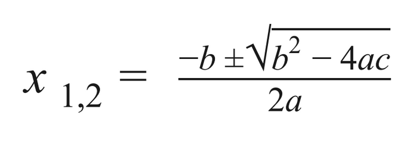
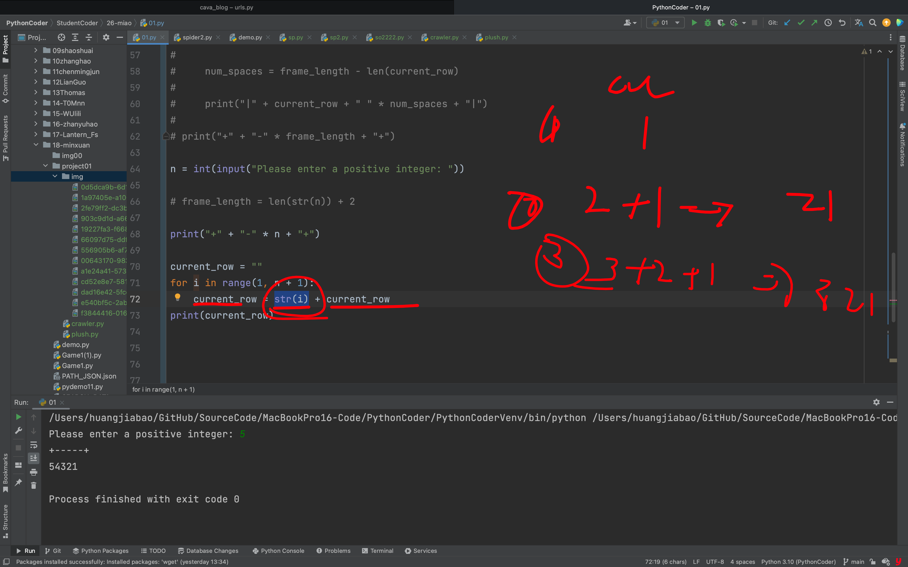
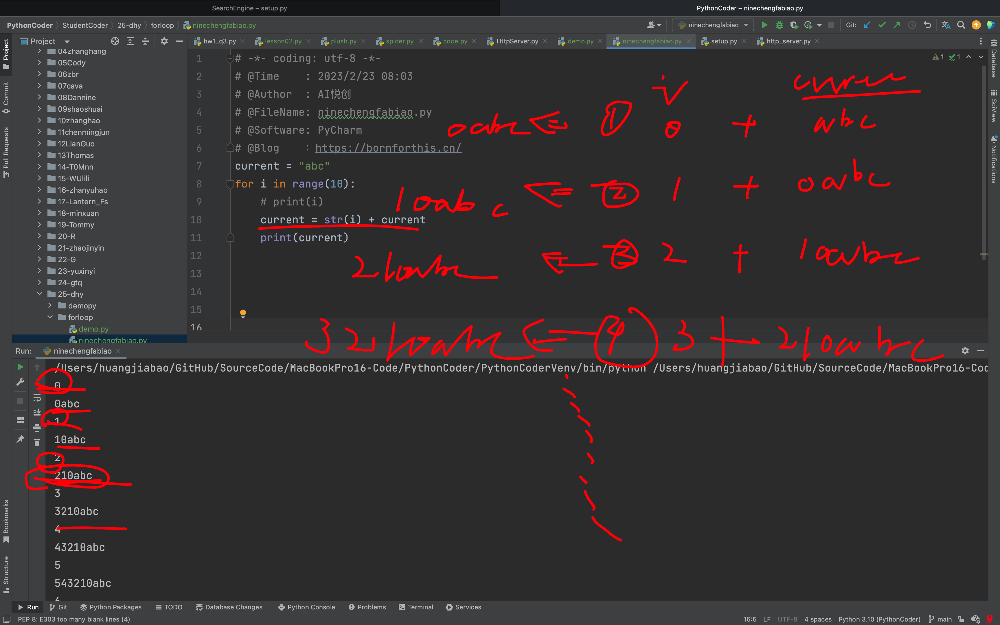

## NYU Tandon School of Engineering 

> 纽约大学坦顿工程学院

Due: 1159pm, Thursday, February 23rd, 2023 

> 截止日期:2023年2月23日星期四晚上11 ~ 59分

Submission instructions 

> 提交说明

1.  You should submit your homework on Gradescope. 

> 你应该在Gradescope上提交作业。

2. For this assignment you should turn in 5 separate .py files named according to the following pattern:

    hw3_q1.py, hw3_q2.py, etc. 

> 对于这个任务，你应该提交5个独立的.py文件，按照以下模式命名:
> Hw3_q1.py, hw3_q2.py等。

3. Each Python file you submit should contain a header comment block as follows:

> 你提交的每个Python文件都应该包含一个头注释块，如下所示:

```python
"""
Author: [Your name here]
Assignment / Part: HW3 - Q1 (etc.)
Date due: 2023-02-23, 11:59pm
I pledge that I have completed this assignment without
collaborating with anyone else, in conformance with the
NYU School of Engineering Policies and Procedures on
Academic Misconduct.
"""
```

No late submissions will be accepted. 

> 逾期提交的资料恕不受理。

**REMINDER**: Do not use any Python structures that we have not learned in class. 

> 提醒:不要使用任何我们在课堂上没有学过的Python结构。

For this specific assignment, you may use everything we have learned up to, and including, variables, types, mathematical and boolean expressions, user IO (i.e. print() and input()), number systems, and the math / random modules, selection statements (i.e. if, elif, else), and for- and while-loops. Please reach out to us if you're at all unsure about any instruction or whether a Python structure is or is not allowed. 

> 对于这个特定的赋值，你可以使用我们学到的所有东西，包括变量、类型、数学和布尔表达式、用户IO(即print()和input())、数字系统和数学/随机模块、选择语句(即if、elif、else)以及For -和while-循环。如果您不确定任何指令或Python结构是否被允许，请与我们联系。

Do not use, for example, user-defined functions (except for main() if your instructor has covered it during lecture), string methods, file i/o, exception handling, dictionaries, lists, tuples, and/or object-oriented programming. 

> 例如，不要使用用户定义的函数(main()除外，如果你的导师在课堂上讲过)、字符串方法、文件i/o、异常处理、字典、列表、元组和/或面向对象编程。

Failure to abide by any of these instructions will make your submission subject to point deductions. 

> 如不遵守上述任何一项规定，您的投稿将被扣分。

**Problems** 

1. Why, This Car Could Be Systematic, Programmatic, Quadratic! (**hw3_q1.py**) 

2. (Odd and Even) Baby Steps (**hw3_q2.py**) 

3. Box Tattooed On Her Arm (**hw3_q3.py**) 

4. Mod Culture (**hw3_q4.py**) 

5. 2ne1 (**hw3_q5.py**) 

> 的问题
>
> 1. 为什么，这辆车可以是系统的，程序化的，二次元的!(**hw3_q1.py**)
>
> 2. (奇数和偶数)婴儿步(**hw3_q2.py**)
>
> 3.她手臂上纹了盒子(**hw3_q3.py**)
>
> 4. Mod文化(**hw3_q4.py**)
>
> 5. 2 ne1 (**hw3_q5.py**)

## Question 1: Why, This Car Could Be Systematic, Programmatic, Quadratic!

> 问题1:为什么，这辆车可以是系统的，程序化的，二次元的!

Write a program that asks the user to input three floating-point numbers: a, b, and c (just this once, only these three single-letter variables will be permitted). These are the parameters of the quadratic equation. Classify the equation as one of the following:

> 编写一个程序，要求用户输入三个浮点数:a、b和c(只有这一次，只允许这三个单字母变量)。这些是二次方程的参数。将方程归为下列形式之一:

- Infinite number of solutions: For example, `a = 0`, `b = 0`, `c = 0` has an infinite number of solutions. 

- No solution: For example, `a = 0`, `b = 0`, `c = 4` has no solution. 

- No real solution: For example, `a = 1`, `b = 0`, `c = 4` has no real solutions. 

- One real solution: In cases there is a solutions, please print the solutions. 

- Two real solutions: In cases there are two real solutions, please print the solutions. 

- 无限个解:例如，a = 0, b = 0, c = 0有无限个解。

- 无解:例如，a = 0, b = 0, c = 4无解。
- 无实解:例如，a = 1, b = 0, c = 4没有实解。
- 一个真正的解决方案:如果有解决方案，请打印解决方案。两种实际解决方案:如果有两种实际解决方案，请打印解决方案。

Hint: `If a ≠ 0` and there are real solutions to the equation, you can get these solutions using the following formula: 

> 提示:如果a≠0，且方程存在实数解，你可以用下面的公式得到这些解:




Figure 4: The quadratic formula. 

> 图4:二次公式。

The number of solutions depends on whether the discriminant (b2 - 4ac) is positive, zero, or negative. 

> 解的数量取决于判别式(b2 - 4ac)是正的、零的还是负的。

For example, an execution could look like:

> 例如，执行可以是这样的:

```python
Please enter value of a: 1
Please enter value of b: 4
Please enter value of c: 4
This equation has 1 solution: x = -2.0
```

```python
请输入a的值:1
请输入b的值:4
请输入c: 4的值
这个方程只有一个解:x = -2.0
```

"What is this? A math class?" Yeah, we've heard it a million times before. 

> “这是什么?”数学课?”是啊，我们已经听过无数次了。


## Problem 2: (Odd and Even) Baby Steps

> 问题2:(奇数和偶数)婴儿阶段

Write a program that reads a positive integer (say, n), and prints the first n odd numbers (don't use n as a variable name). Write two versions in the file, one using a for-loop, and one using a while-loop. For example, one execution could look like this:

> 编写一个程序，读取一个正整数(比如n)，并输出前n个奇数(不要使用n作为变量名)。在文件中编写两个版本，一个使用for循环，另一个使用while循环。例如，一次执行可能是这样的:

```python
Please enter a positive integer: 5
Executing while-loop...
1
3
5
7
9
```

```python
Executing for-loop...
1
3
5
7
9
```

Both of these implementations must be included in the same file. 

> 这两个实现必须包含在同一个文件中。


## Problem 3: Box Tattooed On Her Arm 

> 问题3:她手臂上的盒子纹身

Write a program that asks the user to input a positive integer, and print a triangle of numbers aligned to the left, where the first line contains the number 1. The second line contains the numbers 2, 1. The third line contains 3, 2, 1. And so on. Surrounding your triangle should be a "frame" composed of the plus `'+'`, minus `'-'`, and pipe `'|'`  characters. For example:

> 编写一个程序，要求用户输入一个正整数，并打印一个由数字向左对齐的三角形，其中第一行包含数字1。第二行包含数字2,1。第三行是3,2,1。等等。围绕你的三角形应该是一个“框架”，由“+”、“-”和管道“|”字符组成。例如:

```python
Please enter a positive integer: 5
+-----+
|1    |
|21   |
|321  |
|4321 |
|54321|
+-----+
```

```python
Please enter a positive integer: 7
+-------+
|1      |
|21     |
|321    |
|4321   |
|54321  |
|654321 |
|7654321|
+-------+
```

You may not use the end parameter of the print() function in this problem. Also, note that for input values higher than 9, it will start looking not-so-nice. That's perfectly okay; as long as your output looks good for numbers between 0 and 9, you're all set. 

> 在这个问题中，不能使用print()函数的结束参数。另外，请注意，对于大于9的输入值，它将开始看起来不太好。这完全没问题;只要输出看起来适合0到9之间的数字，就万事大吉了。





## Problem 4: Mod Culture 

> 问题4:Mod文化

Ask the user to input a positive integer, say, n, and print all the numbers from 1 to n that have more even digits than odd digits. For example, the number 134 has two odd digits (1 and 3) and one even digit (4), therefore it should not be printed. 

> 要求用户输入一个正整数，比如n，然后输出从1到n的所有偶数多于奇数的数字。例如，数字134有两个奇数(1和3)和一个偶数(4)，因此它不应该被打印。

Printing should occur all on one line, separated by spaces. For example, if n = 30, the program should print:

> 打印应全部在一行上进行，用空格分隔。例如，如果 n = 30，程序应该输出:

```python
2 4 6 8 20 22 24 26 28
```

You may not use string casting (i.e. convert integers to strings).

> 你不能使用字符串类型转换(即将整数转换为字符串)

Hint: The title of this problem. 

> 提示:这个问题的标题。


## Problem 5: 2ne1 

> 问题五

For this last problem, we will be programming a simple version of the card banking game twenty-one (or vingt- un in a superior language). According to Wikipedia: 

> 对于这最后一个问题，我们将编程一个简单版本的卡银行游戏21(或vingt- un在高级语言)。根据维基百科:

::: info 维基百科

The game has a **banker** (the person who deals the cards) and a variable number of punters (the people who receive cards from the banker). 

> 游戏中有一个**庄家**(发牌的人)和数量不定的下注者(从庄家那里收到牌的人)。

- The banker deals two cards, face down, to each punter.
- 庄家给每个下注的人发两张正面朝下的牌。 

- The punters, having picked up and examined both cards, announce whether they will stay with the cards they have or receive another card from the banker. 
- 下注者拿起并检查了两张卡，然后宣布他们是继续持有现有的卡，还是从银行家那里收到另一张卡。

- The aim is to score exactly twenty-one points or to come as close to twenty-one as possible, based on the card values dealt. 

- 游戏的目标是根据所发纸牌的价值，获得准确的21分或尽可能接近21分。

    - If a punter exceeds twenty-one, they lose. 
    - 如果下注者超过21，他们就输了。

    - Anyone who achieves twenty-one is also a win
    - 任何达到21的人也是一场胜利

:::

You will simulate this exact process as if the banker were a random number generator and the only two punters were you and the computer. Your program should: 

> 您将模拟这个精确的过程，假设银行家是一个随机数生成器，只有两个赌徒是您和计算机。你的程序应该:

1. Ask the user whether they want to play twenty-one. They may only enter the characters 'y' for "yes" and 'n' for "no". If the player chooses "no", then the game simply ends. Your program must continue asking the player for input until the user enters either 'y' or 'n'. 

> 询问用户是否想玩21。他们可能只输入字符“y”表示“是”，“n”表示“否”。如果玩家选择“否”，那么游戏就会结束。你的程序必须继续要求玩家输入，直到用户输入“y”或“n”。

2. If the player chooses to play, your program must "give them" two random cards of values [1, 11]. 

> 如果玩家选择玩，你的程序必须“给他们”两张随机值的牌[1,11]。

3.  The program must then show the player the value of these two cards. 

> 然后程序必须向玩家显示这两张牌的价值。

4. The program will then ask the player whether they want a third card or not to put their score closer to 21. 

> 然后，程序会询问玩家是否需要第三张牌，以使他们的分数接近21。

Again the program must continue asking the user for input until they enter 'y' for "yes" or 'n' for "no".

> 同样，程序必须继续要求用户输入，直到他们输入“y”表示“是”或“n”表示“否”。

- If the user entered 'y', generate another random card of value [1, 11]. The user's total score in this case will be the value of all three cards added together

> 如果用户输入“y”，生成另一张值为[1,11]的随机卡片。在这种情况下，用户的总分将是所有三张卡的值加在一起

- If the user entered 'n', the user's total score in this case will be the value of the first two cards added together

> 如果用户输入“n”，在这种情况下，用户的总分将是前两张牌的值加在一起

5. Generate the user's opponent's score by generating a random number in the range of [0, 100]. Your program should re-generate another random number until this number falls between 3 and 33. Of course we could simply generate number between 0 and 33 instead, but this adds a bit more entropy to the process. 

> 通过生成一个范围为[0,100]的随机数来生成用户对手的分数。你的程序应该重新生成另一个随机数，直到这个数字落在3和33之间。当然，我们可以简单地生成0到33之间的数字，但这会给这个过程增加更多的熵。

6. Print a message letting the user know who won. 

> 打印一条消息让用户知道谁赢了。

- The user automatically wins if they score a 21 and the computer doesn't.

> 如果用户得到21分，而计算机没有得到21分，则用户自动获胜。

- The computer automatically wins if they score a 21 and the user doesn't. 

> 如果他们得到21分，而用户没有得到21分，电脑就会自动获胜。

- The user also wins if their score is closer to (but not higher than) 21 than the computer's score. 

> 如果用户的分数比计算机的分数更接近(但不高于)21，用户也会获胜。

- The computer wins if their score is closer to (but not higher than) 21 than the user's score.

> 如果他们的分数比用户的分数更接近(但不高于)21，计算机就获胜。

- There is a draw/tie if both players scored the same score and/or if both of their scores are above 21. 

> 如果两名球员得分相同和/或他们的得分都在21分以上，则为平局。

Check out the following sample executions. Your wording doesn't need to be the same, but the program must interact with the user in the same basic way:

> 请看下面的示例执行。你的措辞不需要相同，但程序必须以相同的基本方式与用户交互:

```python
Would you like to play 'Twenty-One'? [y/n] n
Thank you for playing!
```

```python
Would you like to play 'Twenty-One'? [y/n] y
Your cards are worth 7 and 10.
Would you like another card? [y/n] n
Your score is 17!
Your opponent's score is 14!
You win! Your score was 17.
```

```python
Would you like to play 'Twenty-One'? [y/n] y
Your cards are worth 9 and 11.
Would you like another card? [y/n] yes
Would you like another card? [y/n] y
Your score is 26!
Your opponent's score is 22!
It's a draw!
```

```python
Would you like to play 'Twenty-One'? [y/n] y
Your cards are worth 4 and 6.
Would you like another card? [y/n] y
Your score is 15!
Your opponent's score is 8!
You win! Your score was 15.
```

```python
Would you like to play 'Twenty-One'? [y/n] y
Your cards are worth 5 and 11.
Would you like another card? [y/n] y
Your score is 23!
Your opponent's score is 9!
Your opponent wins! Their score was 9.
```


::: details 公众号：AI悦创【二维码】


:::

::: info AI悦创·编程一对一

AI悦创·推出辅导班啦，包括「Python 语言辅导班、C++ 辅导班、java 辅导班、算法/数据结构辅导班、少儿编程、pygame 游戏开发、Web、Linux」，全部都是一对一教学：一对一辅导 + 一对一答疑 + 布置作业 + 项目实践等。当然，还有线下线上摄影课程、Photoshop、Premiere 一对一教学、QQ、微信在线，随时响应！微信：Jiabcdefh

C++ 信息奥赛题解，长期更新！长期招收一对一中小学信息奥赛集训，莆田、厦门地区有机会线下上门，其他地区线上。微信：Jiabcdefh

方法一：[QQ](http://wpa.qq.com/msgrd?v=3&uin=1432803776&site=qq&menu=yes)

方法二：微信：Jiabcdefh

:::


