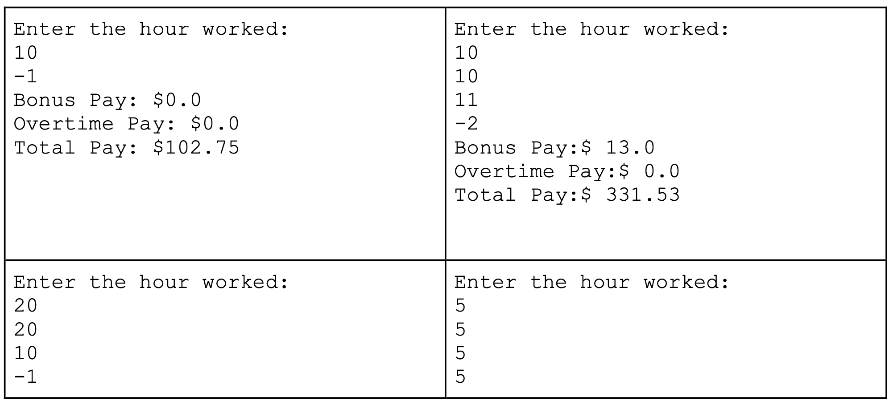
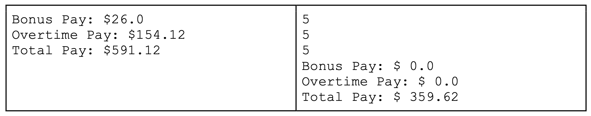

#### ANSWER KEY

#### Polytechnic Tutoring Center

## Exam 1 Review - CS 1114, Spring 2022

> 考试1复习- CS 1114, 2022年春季

**Disclaimer: This mock exam is only for practice. It was made by tutors in the Polytechnic Tutoring Center and is not representative of the actual exam given by the CS Department.**

> 声明:本次模拟考试仅供练习。它是由理工学院辅导中心的导师制作的，不代表计算机科学系的实际考试。

## Question 1

1. Given these assignments: **a = 5, b = 2,** and **s = 1.5** write the type and value of the following expressions. Circle **ERROR** if the expression will result in a run time error.

> 给定这些赋值:a = 5, b = 2, s = 1.5，写出以下表达式的类型和值。如果表达式将导致运行时错误，则圈出ERROR。

| Statement:     | Type: | Value: | ERROR: |
| -------------- | ----- | ------ | ------ |
| `a / b`        |       |        |        |
| `b ** a`       |       |        |        |
| `float(a) / b` |       |        |        |
| `a % b`        |       |        |        |
| `s // a`       |       |        |        |
| `a => b`       |       |        |        |
| `a == b`       |       |        |        |
| `a // b`       |       |        |        |
| `a + b * a`    |       |        |        |

## Question 2

2. Conversion between binary, decimal and hexadecimal numbers:

> 二进制、十进制和十六进制数字之间的转换:

a. Convert the binary number **11101011** to decimal: \_\_\_\_\_\_\_\_\_\_\_\_\_\_\_\_\_\_\__

::: details 答案

```python
"""
1   1   1   0   1   0   1   1
7   6   5   4   3   2   1   0
1*(2**7) + 1*(2**6) + 1*(2**5) + 0 + 1*(2**3) + 0 + 1*(2**1) + 1

"""
print(1*(2**7) + 1*(2**6) + 1*(2**5) + 0 + 1*(2**3) + 0 + 1*(2**1) + 1)
```

:::

b. Convert the decimal number **151** to binary: \_\_\_\_\_\_\_\_\_\_\_\_\_\_\_\_\_\_\__

c. Convert the binary number **10011100** to hexadecimal:\_\_\_\_\_\_\_\_\_\_\_\_\_\_\_\_\_\_\__

::: details 答案

要将二进制数10011100转换为十六进制数，首先需要将二进制数从右侧开始每四个数字分成一组。如果没有足够的数字来组成一个完整的四个数字的组，需要在左边添加零。在这种情况下，我们有：

1001 1100

接下来，我们可以使用以下转换表将每个四个二进制数字组合转换为一个十六进制数字：

```tex
二进制数   十六进制数
0000      0
0001      1
0010      2
0011      3
0100      4
0101      5
0110      6
0111      7
1000      8
1001      9
1010      A
1011      B
1100      C
1101      D
1110      E
1111      F
```

将每个四个二进制数字组合转换为十六进制数字得到：

`1001 1100 = 9C`

因此，二进制数 10011100 等于十六进制数 9 C。

:::

d. Convert the hexadecimal number **5F** to binary:\_\_\_\_\_\_\_\_\_\_\_\_\_\_\_\_\_\_\__ (please show all 8 binary digits) 


::: details 答案

要将十六进制数 5F 转换为二进制数，可以将十六进制数中的每个数字转换为对应的四位二进制数。使用下面的转换表进行转换：

```tex
十六进制数   二进制数
0           0000
1           0001
2           0010
3           0011
4           0100
5           0101
6           0110
7           0111
8           1000
9           1001
A           1010
B           1011
C           1100
D           1101
E           1110
F           1111
```

因此，将十六进制数5F转换为二进制数为：

```tex
5 = 0101
F = 1111
```

将它们组合起来，得到：

`01011111`

这就是十六进制数 5F 对应的八位二进制数，其中前面的零是因为 5F 的二进制数在左侧有两个零。

:::

e. Convert the decimal number **90** to hexadecimal:\_\_\_\_\_\_\_\_\_\_\_\_\_\_\_\_\_\_\__ 

::: details 答案

要将十进制数 90 转换为十六进制数，可以将其除以 16 并将余数转换为对应的十六进制数字，重复这个过程直到商为 0。使用下面的转换表进行转换：

```tex
十进制数   十六进制数
0          0
1          1
2          2
3          3
4          4
5          5
6          6
7          7
8          8
9          9
10         A
11         B
12         C
13         D
14         E
15         F
```

以下是转换的步骤：

- 90 / 16 = 5 余 10，因此最低位为 A。
- 5 / 16 = 0 余 5，因此次低位为 5。
- 商为 0，所以转换完成。

因此，十进制数90转换为十六进制数为 5A。

:::


## Question 3

3. What is the output from the following code if the user enters 75?

> 如果用户输入75，下面代码的输出是什么?

```python
c = int(input("Enter a value: "))
if c > 100:
    print("A")
elif c > 50:
    if c % 5 == 0 and not (c % 10 == 0):
        print("B")
    elif c % 5 == 0:
        print("C")
    else:
        print("D")
if c > 20:
    print("E")
else:
    print("F")
```

## Question 4

4. What is the output from the following code ?

> 下面的代码输出什么?

```python
acc = 0
for i in range(5, 15, 5):
    var = i
    while var > 0:
        var //= 2
        acc += var
        print("i=", i, "var=", var)
    print("acc", acc)
```

## Question 5

Write a program that prompts for radius length. Your program should calculate and print the resulting circumference (float) and area (float) of a circle with that radius. You must also check that the given radius is **positive**. Otherwise, print an error message and do not carry out the calculations. Use pi = 3.14 for this question rather than importing the math module.

> 编写一个提示半径长度的程序。您的程序应该计算并打印具有该半径的圆的周长(浮动)和面积(浮动)。你还必须检查给定的半径是否为正。否则，打印错误信息，不进行计算。对于这个问题，使用 `pi = 3.14`，而不是导入数学模块。

```python
Sample Outputs 1:
Enter a radius: 3
Circumference: 18.84
Area: 28.26

Sample Outputs 2:
Enter a radius: -1
ERROR: Radius must be positive
```


## Question 6

Write a program that prompts a row number and print out the pattern in a zig-zag way. If the leading number of the row is odd, the row displays numbers in a decreasing sequence, starting from the leading number to 1. If the leading number of the row is even, the row displays numbers in an increasing sequence, starting from 1 to the leading number. Assume the input is always a valid positive integer.

> 编写一个程序，提示行号，并以之字形打印出模式。如果该行的前导为奇数，该行将按照从前导到1的递减顺序显示数字。如果该行的前导为偶数，则该行按照从1到前导的递增顺序显示数字。假设输入总是一个有效的正整数。

```python
Sample Output 1:
Enter # of row:  5
5 4 3 2 1 
1 2 3 4 
3 2 1 
1 2
1
```

```python
Sample Output 2:
Enter # of row: 4
4 3 2 1 
3 2 1 
1 2
1
```

::: details 答案

```python
row = int(input("Enter # of row: "))

for i in range(row, 0, -1):
    if i % 2 == 1:
        for j in range(i, 0, -1):
            print(j, end=" ")
    else:
        for j in range(1, i + 1):
            print(j, end=" ")
    print()
```

:::

## Question 7

Given a positive integer number, write a program to print the total number of times each digit. Write a program that prompts the user to enter a sequence of positive integers where each integer represents how many hours the employee worked in a day this week. When the user enters a negative integer, there are no more days to input. However, since there is a maximum of 7 days in a week, so at most you can take inputs for 7 times. The program should then print out (a) the employee's bonus pay for that week; (b) the employee's overtime pay for that week; and (c) the employee's total pay for that week.

> 给定一个正整数，写一个程序输出每个数字的总次数。编写一个程序，提示用户输入一个正整数序列，其中每个整数代表员工本周每天工作的小时数。当用户输入一个负整数时，没有更多的天数可以输入。但是，由于一周最多有7天，所以你最多可以输入7次。然后程序将打印出(a)该员工当周的奖金;(b)该雇员当周的加班费;(c)员工当周的总工资。

 The rules governing an employee's pay are as follows:

> 管理员工薪酬的规则如下:

a. Each employee has an hourly pay rate, which we will call payRate. An employee is paid payRate dollars for every hour worked. payRate is a variable defined for you in advance; you should not define it or read it in. 


> a.每个员工都有一个小时工资率，我们称之为payRate。员工每工作一小时支付payRate美元。payRate是预先为您定义的变量;你不应该定义它，也不应该读入它。

b. If an employee works more than 10 hours in a single day, they must be paid an additional *bonus* of $13 for each such day. 


> b.如果一名员工在一天内工作超过10小时，他们必须获得额外的奖金，每天13美元。

c. If an employee works a total of more than 40 hours in a single week, any hours over 40 will be paid at an *overtime* rate of one-and-a-half times their usual hourly wage. Hours under 40 will be paid at the usual rate. For example, if an employee has a normal rate of \$10 per hour and works 45 hours in a single week, they will be paid \$10 x 40 = \$400 for the first 40 hours, then an additional overtime of 1.5 x \$10 x 5 = \$75 for the remaining 5 hours, for a total pay of \$475.


**The output in your calculations should be rounded to 2 decimal places if the output is more than 2 decimal places.**

(In the following examples, payRate is 10.275.)

## Sample outputs:





::: details 公众号：AI悦创【二维码】


:::

::: info AI悦创·编程一对一

AI悦创·推出辅导班啦，包括「Python 语言辅导班、C++ 辅导班、java 辅导班、算法/数据结构辅导班、少儿编程、pygame 游戏开发、Web、Linux」，全部都是一对一教学：一对一辅导 + 一对一答疑 + 布置作业 + 项目实践等。当然，还有线下线上摄影课程、Photoshop、Premiere 一对一教学、QQ、微信在线，随时响应！微信：Jiabcdefh

C++ 信息奥赛题解，长期更新！长期招收一对一中小学信息奥赛集训，莆田、厦门地区有机会线下上门，其他地区线上。微信：Jiabcdefh

方法一：[QQ](http://wpa.qq.com/msgrd?v=3&uin=1432803776&site=qq&menu=yes)

方法二：微信：Jiabcdefh

:::


