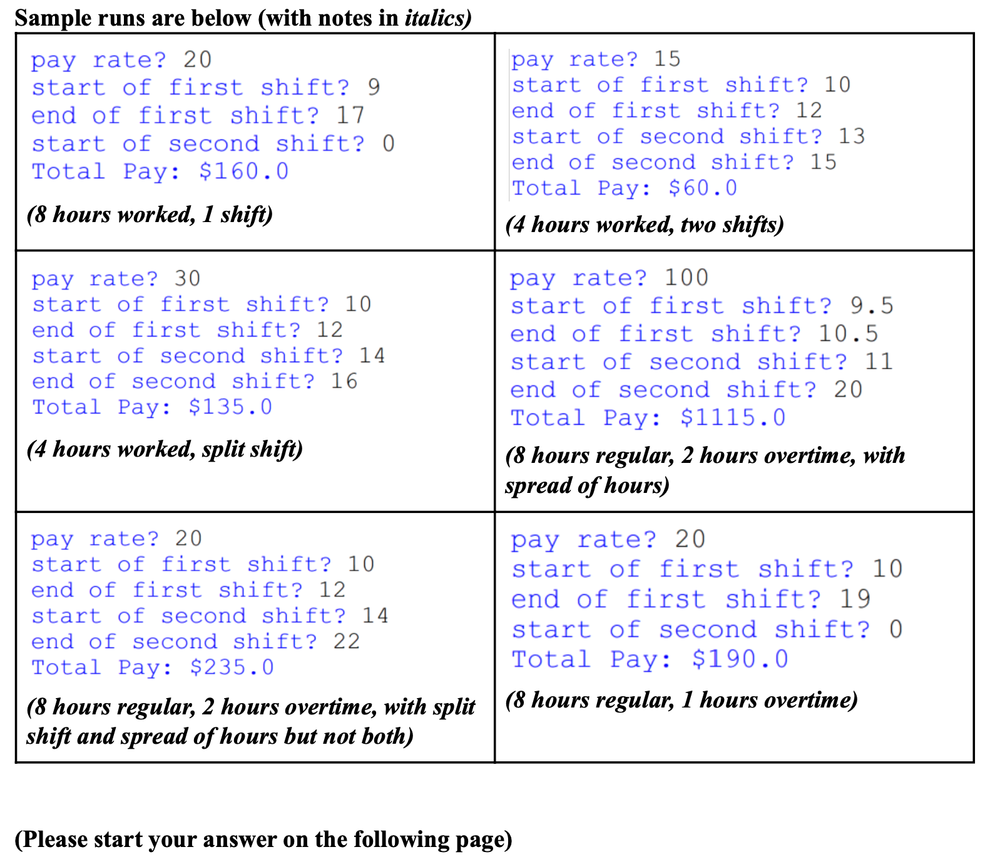

## Question 1

### 1. 题目描述：

设计一个程序，可以接收两个整数 a 和 b，计算出所有 a 到 b 之间的数字中，哪些数字可以表示为另一个数字的幂，输出这些数字以及它们所对应的基数。如果没有数字可以表示为另一个数字的幂，则不应打印任何内容。

### 2. 解题思路：

我们可以使用两个嵌套循环来枚举 a 到 b 之间的所有数字，并使用与之前相同的方法来检查它们是否可以通过某个基数的幂得到。如果找到一个数字可以表示为幂，则可以将其输出。

### 3. Python 实现

```python
a = int(input("请输入一个整数a: "))
b = int(input("请输入一个整数b: "))

numbers = []

for num in range(a, b+1):
    for base in range(2, int(num**0.5)+1):
        power = 2
        while base**power <= num:
            if base**power == num:
                numbers.append((num, base))
            power += 1

if numbers:
    print(f"a到b之间可以表示为另一个数字的幂的数字及其对应的基数为：")
    for num, base in numbers:
        print(f"{num}可以表示为{base}的幂")
else:
    print(f"a到b之间没有任何数字可以表示为另一个数字的幂。")
```


## Question 5

**5. (30 points), New York state has a number of odd rules about paying employees. First, anyone who works more than 8 hours a day is paid overtime (1.5x pay rate) for the time in excess of 8 hours. For example, if you work 9 hours, you get paid 9.5 times your pay rate. (NYS law is 40 hours per week but, for this problem, we’re focusing on** **one day** **for ease in this problem)**

> 纽约州在支付员工工资方面有许多奇怪的规定。首先，每天工作超过8小时的人将获得超过8小时的加班费(1.5倍工资率)。例如，如果你工作9小时，你的工资是你工资的9.5倍。(纽约的法律是每周40小时，但是，对于这个问题，我们集中在一天缓解这个问题)

**However, there are some additional rules that might impact your pay:**

> 然而，还有一些额外的规则可能会影响你的薪水:

- **Basic minimum wage** **is $15/hour in New York City.**

> 纽约市的基本最低工资是每小时15美元。

- **Spread of hours: Any employee whose workday ends more than 10 hours from their workday start time is paid one extra hour of basic minimum wage**

> **工作时间的分布:任何员工的工作日结束时间比上班时间超过10小时，将额外支付一小时的基本最低工资**

- **Split shift: Any employee whose work day is divided into two parts with more than 1 hour in between, is paid one extra hour at basic minimum wage**

> **分班制:任何工作时间被分成两部分且中间超过1小时的员工，都可以额外获得1小时的基本最低工资**

- **Either split shift or spread of hours rule may apply to any workday, but not both!**

> 分班或时间分配规则可以适用于任何工作日，但不能同时适用!

1. **For this task, you will write a program which asks the user for their pay rate, the start and end times of their first and second shifts (for ease, you can treat these like floats as a number of hours since midnight, i.e.** **1:15pm would be listed as 13.25, 3:30pm as 15.50, etc.). Apply the above rules and print the amount that the person will be paid for that day. You can assume that all inputs will be valid and logical numerical values for a day’s calculations. If the person didn’t work a second shift, they will enter 0 for the start of their second shift.**

> **对于这个任务，您将编写一个程序，询问用户的工资率，他们的第一和第二班的开始和结束时间(为了方便，您可以将这些视为自午夜以来的浮点数，即** **1:15pm将被列为13.25,3:30pm为15.50，等等)。应用上述规则，并打印出该员工当天将获得的报酬。您可以假设，对于一天的计算，所有输入都是有效的逻辑数值。如果这个人没有上第二班，他们将输入0作为第二班的开始。**

1. **Sample runs are below (with notes in italics)**

> 下面是示例运行(斜体标注)




::: details 公众号：AI悦创【二维码】


:::

::: info AI悦创·编程一对一

AI悦创·推出辅导班啦，包括「Python 语言辅导班、C++ 辅导班、java 辅导班、算法/数据结构辅导班、少儿编程、pygame 游戏开发、Web、Linux」，全部都是一对一教学：一对一辅导 + 一对一答疑 + 布置作业 + 项目实践等。当然，还有线下线上摄影课程、Photoshop、Premiere 一对一教学、QQ、微信在线，随时响应！微信：Jiabcdefh

C++ 信息奥赛题解，长期更新！长期招收一对一中小学信息奥赛集训，莆田、厦门地区有机会线下上门，其他地区线上。微信：Jiabcdefh

方法一：[QQ](http://wpa.qq.com/msgrd?v=3&uin=1432803776&site=qq&menu=yes)

方法二：微信：Jiabcdefh

:::


