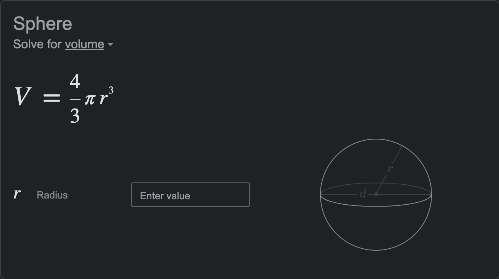
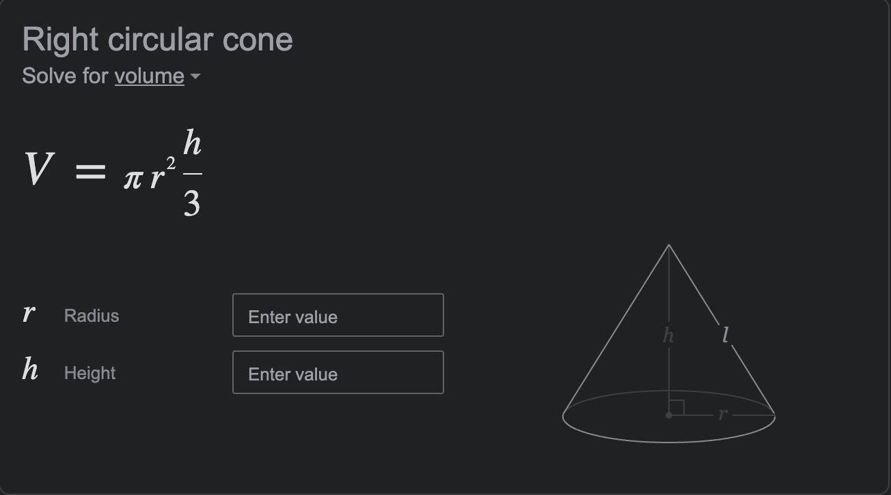

- [Lab1.pdf](/1v1/22-DongYuhang/Answer/Lab1.pdf)

## IO and Types

You must get checked out by your lab CA **prior to leaving early.** If you leave without being checked out, you will receive 0 credit for the lab.

> 你必须在离开之前由你的实验室CA **检查。** 如果你没有被退房就离开，你将得到0学分的实验室。

## Restrictions

> 限制

The Python structures that you use in this lab should be restricted to those you have learned in lecture so far. Please check with your course assistants in case you are unsure whether something is or is not allowed!

> 你在本实验中使用的 Python 结构应该仅限于你在课堂上所学到的。如果你不确定某些内容是允许的还是不允许的，请向你的课程助理查询!

**If you do not have Python running on your computer please go back to Lab 0 and set it up before moving on**

> 如果您的计算机上没有运行 Python，请返回实验室0并在继续之前设置它

*Answer Problem 1 on a piece of paper or on a text editor on your computer.*

> 在纸上或电脑上的文本编辑器上回答问题1。

## Problem 1: Variables

> 问题1:变量

### Part 1A: Variable Naming Conventions

> 第1A部分:变量命名约定

Which of the following follow the snakecase naming convention? Select all that apply.

> 下列哪一项符合蛇的命名规则?选择所有应用。

```python
1. firstVariable = 3
2. second_variable = "word"
3. Third_var = 4.0
4. var4 = False
5. fifth_Variable = 'b'
```

### Part 1B: Variable Types

> 第1B部分:变量类型

State the data type of each variable in Part 1A

> 在1A部分说明每个变量的数据类型

*Create a new python file for each of the following problems.*

> 为以下每个问题创建一个新的python文件。

**答案：**

```python
1. firstVariable = 3 # 数字型 int
2. second_variable = "word" # 字符串 str
3. Third_var = 4.0 # 浮点型 float
4. var4 = False # 布尔型 bool
5. fifth_Variable = 'b' # 字符串
```

## Problem 2: Baking Scones

> 问题2:烤饼

You have been wanting to bake scones and have found a recipe, but the recipe is in metric and you only have measuring cups. Let's convert the metric measures to customary measurements.

> 你一直想烤司康饼，并找到了一个食谱，但食谱是公制的，你只有量杯。让我们把公制单位转换成习惯单位。

The following are the metric measures for **10 scones**:

> 以下是10个司康饼的公制尺寸:

```python
75 g salted butter # 75克咸黄油
350 g flour # 350克面粉
150 ml milk  # 150毫升牛奶
```

Here are some conversion factors you can use:

> 这里有一些你可以使用的转换因子:

```python
75 grams butter = 1/3 cup of butter  # 75克黄油= 1/3杯黄油
150 gram flour = 1 cup flour  # 150克面粉= 1杯面粉
100 ml milk = 1/2 cup milk  # 100毫升牛奶= 1/2杯牛奶
```

Your program should take user input for the number of scones they want to make and print the quantity of each ingredient in customary measurements.

> 你的程序应该让用户输入他们想要制作的司康饼的数量，并打印每种成分的数量。

Your code should output the following (disregard small floating point differences):

> 你的代码应该输出如下(忽略小的浮点数差异):

```python
Enter the number of scone you want to make: 25  # 输入你想做的司康饼的数量:25
To make 25 scones use 0.8333333333333334 cups butter, 5.833333333333333 cups  # 制作25个司康饼需要0.8333333333333334杯黄油，5.8333333333333333333杯
flour, and 1.875 cups milk # 面粉，1.875杯牛奶
```

**答案：**

```python
# 10 个

# 75 / 10 = 7.5
# 350 / 10 = 35
# 150 / 10 = 15

# 75 grams butter = 1/3 cup of butter  # 75克黄油= 1/3杯黄油 75 * 3 = 225
# 150 gram flour = 1 cup flour  # 150克面粉= 1杯面粉
# 100 ml milk = 1/2 cup milk  # 100毫升牛奶= 1/2杯牛奶 100 * 2

# 7.5 / 225 = 0.03333333333333333
# 35 / 150 = 0.23333333333333334
# 15 / 200 = 0.075

number = int(input("Enter the number of scone you want to make:"))
grams_butter = 0.03333333333333333 * number
gram_flour = 0.23333333333333334 * number
milk = 0.075 * number
print(f"To make {number} scones use {grams_butter} cups butter, {gram_flour} cups flour, and {milk} cups milk")
```

## Problem 3: I Scream, You Scream, We All Scream for Ice Cream

> 问题3:我尖叫，你尖叫，我们都为冰淇淋尖叫

The weather is still dreadfully hot and I love ice cream so lets write a program that will:

> 天气仍然非常热，我喜欢冰淇淋，所以让我们写一个程序:

1. Take user input for number of ice cream scoops, radius of the ice cream cone, and height of the ice cream cone

> 假设用户输入冰淇淋勺的数量、冰淇淋筒的半径和冰淇淋筒的高度

2. Calculate and print the total volume of the ice cream cone. **Use 3.1416 as an approximation for PI**

> 计算并打印冰淇淋筒的总体积。使用3.1416作为PI的近似值

We will be assuming we have perfectly spherical ice cream scoops and a perfect ice cream cone!

> 假设我们有完美的球形冰淇淋勺和完美的冰淇淋蛋筒!

Look at the following image for reference on what we mean by a cone with multiple scoops.

> 看看下面的图片，看看我们说的多勺锥是什么意思。

::: center


:::

The formula for sphere volume is as follows and will be used for each ice cream scoop:

> 球体积公式如下，将用于每个冰淇淋勺:



The formula for cone volume is as follows and will be used for the ice cream cone:

> 蛋筒体积的公式如下，冰激凌蛋筒将使用这个公式:



Your code should output the following

> 您的代码应该输出以下内容

```python
Enter the number of ice cream scoops you want: 3
Enter the radius of ice cream cone: 3.5
Enter the height of ice cream cone: 8.9
Your 3 scoop ice cream cone has a total volume of 652.95538
```

```python
输入你想要的冰淇淋勺的数量:3
输入冰淇淋蛋筒的半径:3.5
输入冰淇淋蛋筒的高度:8.9
你的3勺冰淇淋甜筒的总体积是652.95538
```

::: tabs

@tab 答案

```python
PI = 3.1416
number = int(input("Enter the number of ice cream scoops you want:"))
r = float(input("Enter the radius of ice cream cone:"))
h = float(input("Enter the height of ice cream cone:"))
circle_v = (4 / 3) * PI * (r ** 3)
cone_v = PI * (r ** 2) * (h / 3)
total_v = number * (circle_v + cone_v)
print(f"Your {number} scoop ice cream cone has a total volume of {total_v}")
```

@tab 修正后的答案

```python
PI = 3.1416
number = int(input("Enter the number of ice cream scoops you want:"))
r = float(input("Enter the radius of ice cream cone:"))
h = float(input("Enter the height of ice cream cone:"))
circle_v = ((4 / 3) * number) * PI * (r ** 3)
cone_v = PI * (r ** 2) * (h / 3)
total_v = (circle_v + cone_v)
print(f"Your {number} scoop ice cream cone has a total volume of {total_v}")
```

:::

## Problem 4: Time in Seconds

> 问题4:时间以秒为单位

This program will ask the user for **four** inputs: a number of days, number of hours, number of minutes, and number of seconds. This may look something like:

> 这个程序将要求用户输入四个参数:天数、小时数、分钟数和秒数。这可能看起来像这样:

```python
How many days do you have?
How many hours do you have?
How many minutes do you have?
How many seconds do you have?
```

```python
你还有多少天?
你有多少小时?
你有多少分钟?
你还有多少秒?
```

You may assume that the user will always input a positive whole number. After getting the four inputs, the function should calculate how many seconds in total are in the given number of days, hours, minutes and seconds, and output the result. The final output of the program should be something like this:

> 您可以假设用户总是输入一个正整数。在得到四个输入后，函数应该计算给定的天、小时、分钟和秒数中总共有多少秒，并输出结果。程序的最终输出应该是这样的:

```python
How many days do you have? 3
How many hours do you have? 7
How many minutes do you have? 41
How many seconds do you have? 16
3 Days 7 Hours 41 Minutes and 16 Seconds results in a total of 286876 Seconds.
```

```python
你还有多少天?3.
你有多少小时?7
你有多少分钟?41
你还有多少秒?16
3天7小时41分16秒等于286876秒。
```

**答案：**

```python
days = int(input("How many days do you have?"))
hours = int(input("How many hours do you have?"))
minutes = int(input("How many minutes do you have?"))
seconds = int(input("How many seconds do you have?"))
total_s = (days * 24 * 60 * 60) + (hours * 60 * 60) + (minutes * 60) + seconds
print(f"{days} Days {hours} Hours {minutes} Minutes and {seconds} Seconds results in a total of {total_s} Seconds.")
```


::: details 公众号：AI悦创【二维码】


:::

::: info AI悦创·编程一对一

AI悦创·推出辅导班啦，包括「Python 语言辅导班、C++ 辅导班、java 辅导班、算法/数据结构辅导班、少儿编程、pygame 游戏开发、Web、Linux」，全部都是一对一教学：一对一辅导 + 一对一答疑 + 布置作业 + 项目实践等。当然，还有线下线上摄影课程、Photoshop、Premiere 一对一教学、QQ、微信在线，随时响应！微信：Jiabcdefh

C++ 信息奥赛题解，长期更新！长期招收一对一中小学信息奥赛集训，莆田、厦门地区有机会线下上门，其他地区线上。微信：Jiabcdefh

方法一：[QQ](http://wpa.qq.com/msgrd?v=3&uin=1432803776&site=qq&menu=yes)

方法二：微信：Jiabcdefh

:::


