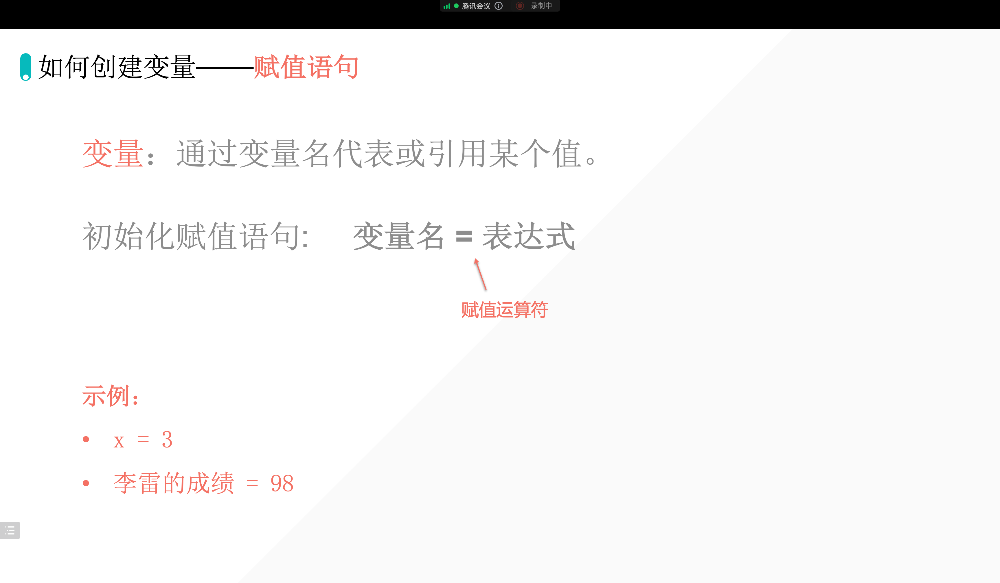

## 1. 理解变量

### 1.1 变量的含义

- 变量：
    - 变：变化
    - 量：大小
- 信封是不是在我们当前所处的空间，开辟了一个：信封✉️空间，这个空间可以存放东西「数据」。
- 冰箱：在我当前所处的空间，开辟一个空间，叫：冰箱。冰箱可以储存东西「数据」。
- <span style="color: Orange">**变量，就是在计算机的内存上，开辟空间。来存储数据。**</span>

### 1.2 变量的特点

相同的变量名「同一个信封」，数据会被覆盖。

## 2. 如何创建变量——赋值语句



### 2.1 代码的运行逻辑

::: center

#### 从上到下，从右到左

#### 最后一步才是赋值

:::

## 3. 变量的实操

```python
x = 1
x = x + 10
print(x)

name1 = "lilei"
name2 = name1
print(name2)

name1 = "小明"
name1 = "ai"
print(name1)
```

输出：

```python
11
lilei
ai
```

::: tip 注释

注释，就是在代码最前面加 `#`，这样我们人可以看见注释内容，计算机看不见。快捷键：ctrl + /

:::

```python
# x = 1
# x = x + 10
# print(x)

# name1 = "lilei"
# name2 = name1
# print(name2)

name1 = "小明"
name1 = "ai"
print(name1)
```

输出：

```python
ai
```


## Tips

::: tip 提示

有问题的时候，及时提问老师。

:::


::: details 公众号：AI悦创【二维码】


:::

::: info AI悦创·编程一对一

AI悦创·推出辅导班啦，包括「Python 语言辅导班、C++ 辅导班、java 辅导班、算法/数据结构辅导班、少儿编程、pygame 游戏开发、Web、Linux」，全部都是一对一教学：一对一辅导 + 一对一答疑 + 布置作业 + 项目实践等。当然，还有线下线上摄影课程、Photoshop、Premiere 一对一教学、QQ、微信在线，随时响应！微信：Jiabcdefh

C++ 信息奥赛题解，长期更新！长期招收一对一中小学信息奥赛集训，莆田、厦门地区有机会线下上门，其他地区线上。微信：Jiabcdefh

方法一：[QQ](http://wpa.qq.com/msgrd?v=3&uin=1432803776&site=qq&menu=yes)

方法二：微信：Jiabcdefh

:::


