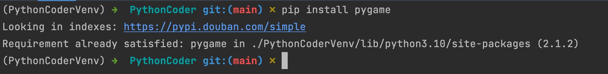
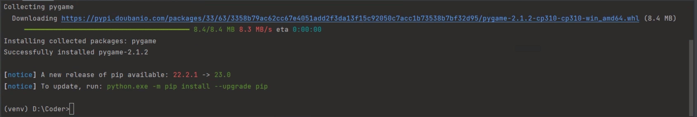
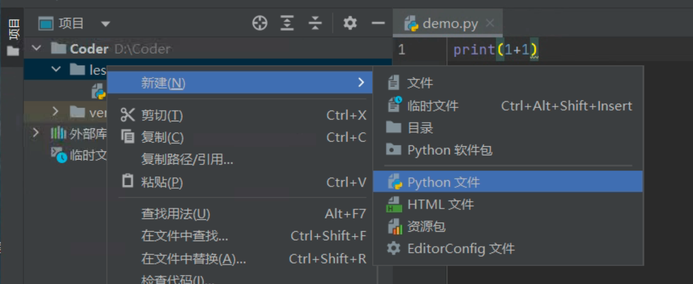
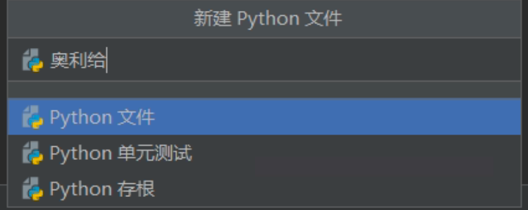

## 1. Pygame 安装

```python
pip install pygame
# pip install 库名称
```





## 2. 使用 Pygame

```python
import pygame
# import：导入（计算机）
# n. 进口，进口商品；输入，引进，重要性的意思
# 井号是注释，注释是计算机看不见，我们看的见
from pygame.examples import aliens
# from...import...: 从...导入......
# 从 pygame 中的 examples 导入 aliens
# start
pygame.examples.aliens.main()
# main: 主要的
```

## 3. 创建窗口

```python
import pygame
# 进入游戏时需要加载游戏——可以理解为：游戏的初始化
pygame.init()  # 调用初始化函数
screen_width = 600  # 窗口宽度
screen_height = 400  # 窗口高度

screen_size = (screen_width, screen_height)  # 存放在我们的元组中
```

## 4. 解决一闪而过

```python
# -*- coding: utf-8 -*-
# @Time    : 2023/2/1 10:14
# @Author  : AI悦创
# @FileName: Code01.py
# @Software: PyCharm
# @Blog    ：https://bornforthis.cn/
import sys

import pygame  # 导入 pygame 库

# 进入游戏时需要加载游戏——可理解为：游戏初始化
pygame.init()  # 调用初始化函数

screen_width = 600  # 窗口宽度
screen_height = 400  # 窗口高度
screen_size = (screen_width, screen_height)  # 存放在我们的元组中

screen = pygame.display.set_mode(screen_size)  # screen 接收了 pygame 建立的对象，对象之后会学到。

# ------第一步代码完成，程序运行会有黑色窗口闪过------
# 要想程序持续运行，需要使用到循环
while True:
    # 在循环中，每循环一次就判断要不要退出
    for event in pygame.event.get():
        # 使用 for 循环获取当前 pygame 窗体的事件
        if event.type == pygame.QUIT:
            # 如果获取到的事件类型是 QUIT「退出」
            sys.exit()  # 那么调用系统退出
    # 每次判断完毕后，就要更新窗口画面
    pygame.display.update()  # update 意为更新
# ------第二步完成，现在窗口不会闪退，可以使用鼠标关闭------
```


## 新建 Python 文件






::: details 公众号：AI悦创【二维码】


:::

::: info AI悦创·编程一对一

AI悦创·推出辅导班啦，包括「Python 语言辅导班、C++ 辅导班、java 辅导班、算法/数据结构辅导班、少儿编程、pygame 游戏开发、Web、Linux」，全部都是一对一教学：一对一辅导 + 一对一答疑 + 布置作业 + 项目实践等。当然，还有线下线上摄影课程、Photoshop、Premiere 一对一教学、QQ、微信在线，随时响应！微信：Jiabcdefh

C++ 信息奥赛题解，长期更新！长期招收一对一中小学信息奥赛集训，莆田、厦门地区有机会线下上门，其他地区线上。微信：Jiabcdefh

方法一：[QQ](http://wpa.qq.com/msgrd?v=3&uin=1432803776&site=qq&menu=yes)

方法二：微信：Jiabcdefh

:::


