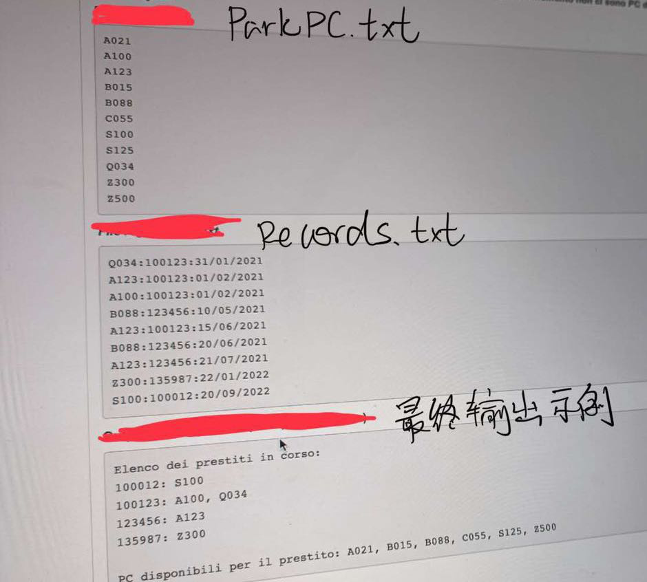

The technical department of a large company has a number of PCs to lend out to employees in case of need（for example, when their PC in service or they are waiting to buy a new one).

> 一家大公司的技术部门有许多个人电脑借给员工以备不时之需(例如，当他们的个人电脑在使用中或他们正在等待购买一台新的电脑时)。

The list of all the PCs used for this purpose is contained in a text file **parkPC.txt**, which has on each line the unique identification code of a PC(*4-character alphanumeric). The PCs are not listed in any specific order.

> 用于此目的的所有PC的列表包含在一个文本文件**parkPC.txt**中，其中每行都有PC的唯一标识码(*4个字符的字母数字)。这些pc没有按任何特定的顺序列出。

A second text file **records. txt** reports all PC loans and returns **sorted in chronological order**. specifically, each line of the following information:

> 第二个文本文件**记录。txt**报告所有PC贷款和回报**按时间顺序排序**。具体来说，每一行的信息如下:

machineID:personID:data

> machineID: personID:数据
>
> machine ID:person ID:data
>
> 机器ID:人员ID:数据

Where **machinelD is the** identification code of the PC, **personID** is the unique serial number of the employee (a 6-digit string) who borrowed or returned the PC, date is the date of the loan or return, in dd/mm/yyyyy format. Note that:

> 其中**machinelD为电脑的**识别码，**personID**为借用或归还电脑的员工的唯一序列号(6位字符串)，date为借用或归还电脑的日期，格式为dd/mm/yyyyy。注意:

- The file **does not distinguish in any way** between loans and returns, so if the same machinelD:personiD pair appears on two successive dates,it means that the first time the PC was loaned, the second time it was returned. If the *machinID:personiD pair* appears only once, it means that theI PC is currently on loan to the employee *personiD*

> 其中**machinelD为电脑的**识别码，**personID**为借用或归还电脑的员工的唯一序列号(6位字符串)，date为借用或归还电脑的日期，格式为dd/mm/yyyyy。注意:

- an employee can have multiple active loans at the same time (obviously, loans from different PCs)

> 一个员工可以同时拥有多个活动贷款(显然，来自不同pc的贷款)

- the same PC can be borrowed and returned multiple times, either by the same employee or by different employees;

> 同一台电脑可以被同一员工或不同员工多次借还;

- a PC can only be lent to one employee at a time (i.e., it cannot be borrowed if it has not been returned first)

> 一台个人电脑一次只能借给一名员工(也就是说，如果电脑没有归还，就不能借)

Let us write a Python program that, once it reads the information contained in the two input files, prints it out on the monitor.

> 让我们编写一个Python程序，一旦它读取了包含在两个输入文件中的信息，就会将其打印到监视器上。

1. **the list, sorted by increasing serial number**, of employees who have borrowed PCs that they have not yet returned. For each employee, we print the list of PC codes they currently have on loan, in alphabetical order.

> **这个名单，按序列号**递增排序，列出了那些借用了电脑却还没有归还的员工。对于每个员工，我们按字母顺序打印出他们目前借出的PC代码列表。

2. **The list sorted by increasing serial number** of PCs that are currently available for loan.In case all company PCs are on loan, the program should print the message "**There** **are currently no PCs available for loan."**

> **按当前可供借出的电脑序号**递增排序。如果所有公司的电脑都被借出，该程序应该打印信息“**有** **目前没有可供借出的电脑。”**



::: tabs

@tab Records.txt

```txt
Q034:100123:31/01/2021
A123:100123:01/02/2021
A100:100123:01/02/2021
B088:123456:10/05/2021
A123:100123:15/06/2021
B088:123456:20/06/2021
A123:123456:21/07/2021
Z300:135987:22/01/2022
S100:100012:20/09/2022
```

@tab ParkPC.txt

```txt
A021
A100
A123
B015
B088
C055
S100
S125
Q034
Z300
Z500
```

@tab demo.py

```python
def file_records(records):
    try:
        with open(records, mode='rt') as file:
            info_records = file.readlines()
            print(type(info_records))
            for i in range(len(info_records)):
                info_records[i] = info_records[i].strip()
                info_records[i] = info_records[i].split(':')
        # print(info_records)
    except IOError:
        print('Error!')
    return info_records


def file_pc(pc):
    try:
        with open(pc, mode='rt') as file:
            info_pc = file.readlines()
            for i in range(len(info_pc)):
                info_pc[i] = info_pc[i].strip()
        # print(info_pc)
    except IOError:
        print('Error!')
    return info_pc


def work_on_info_records(info_records):
    print("Elenco dei prestiti in corso:")
    all_records = {}
    for i in range(len(info_records)):
        machine_id = info_records[i][0]
        person_id = info_records[i][1]
        if not person_id in all_records:
            all_records[person_id] = {}
        if not machine_id in all_records[person_id]:
            all_records[person_id][machine_id] = 0
        all_records[person_id][machine_id] = all_records[person_id][machine_id] + 1
    results = {}
    for m in all_records:
        temp = []
        for n in all_records[m]:
            if all_records[m][n] % 2 == 1:
                temp.append(n)
        temp.sort()
        results[m] = temp
    print(results)
    result_key = sorted(results.keys())
    all_pc_out = []
    for r in result_key:
        print(r + ":" + ",".join(results[r]))
        for l in results[r]:
            all_pc_out.append(l)
    return all_pc_out


def main():
    records = file_records('Records.txt')
    results = work_on_info_records(records)
    pcs = file_pc('ParkPC.txt')
    final_re = []

    for r in pcs:
        # print(r)
        if r not in results:
            final_re.append(r)
    if len(final_re) != 0:
        print("PC disponibili per il prestito:" + ",".join(final_re))
    else:
        print("没有可借的电脑")


if __name__ == '__main__':
    main()
```

:::

+ Data types：数据类型
+ Numeric constants and variables数值常量和变量
+ Strings and their manipulation字符串和它们的操作
+ Input/Output of numbers and and strings数字和字符串的输入/输出
+ Arithmetic operators, powers, and mathematical functions算术运算符、幂和数学函数
+ Boolean variables and operators布尔变量和运算符
+ Control-flow structures (iterative and conditional) 控制流结构（迭代和条件）
+ Functions and calls函数和调用
+ Lists, Sets, and Dictionaries列表、集合和字典
+ Complex data structures (Dictionaries of sets and dictionaries of lists) 
复杂的数据结构（集合的字典和列表的字典）。
+ Text Files文本文件
+ Exceptions handling异常处理


::: details 公众号：AI悦创【二维码】


:::

::: info AI悦创·编程一对一

AI悦创·推出辅导班啦，包括「Python 语言辅导班、C++ 辅导班、java 辅导班、算法/数据结构辅导班、少儿编程、pygame 游戏开发、Web、Linux」，全部都是一对一教学：一对一辅导 + 一对一答疑 + 布置作业 + 项目实践等。当然，还有线下线上摄影课程、Photoshop、Premiere 一对一教学、QQ、微信在线，随时响应！微信：Jiabcdefh

C++ 信息奥赛题解，长期更新！长期招收一对一中小学信息奥赛集训，莆田、厦门地区有机会线下上门，其他地区线上。微信：Jiabcdefh

方法一：[QQ](http://wpa.qq.com/msgrd?v=3&uin=1432803776&site=qq&menu=yes)

方法二：微信：Jiabcdefh

:::

