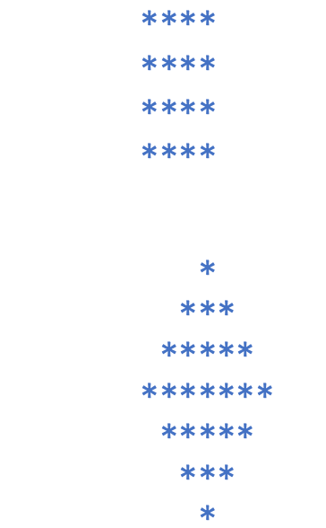
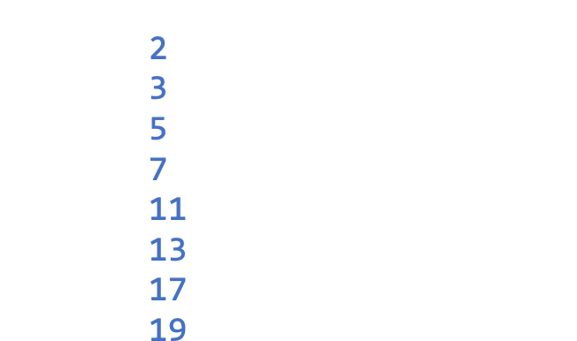
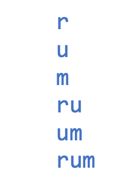

## Lab01

1. **01.3.9**  An alphanumeric code of 16 characters alternating strings “abcd” and “1234”.

> 01.3.9由“abcd”和“1234”交替组成的16个字符的字母数字代码。

::: tabs

@tab 方法一

```python
letters = "abcd"
numbers = "1234"

result = ""
for i in range(16):
    if i % 2 == 0:
        result += letters[i//2 % 4]
    else:
        result += numbers[i//2 % 4]

print(result)
```

在代码中，`i//2 % 4` 用于确定当前字符的位置。

- `i//2` 用于将 `i` 除以 2，得到一个整数结果。
- `% 4` 用于将结果对 4 取模。因为 "abcd" 和 "1234" 都只有 4 个字符，所以这样可以确保结果始终在 0 到 3 之间。

通过将 i 对 2 取整并对 4 取模，我们可以得到一个循环的索引，用于在 "abcd" 和 "1234" 之间交替取字符。因此，当 i 等于 0、2、4 等时，结果为 0，此时从 "abcd" 中选择字母；当 i 等于 1、3、5 等时，结果为 1，此时从 "1234" 中选择数字。

@tab 方法二

```python
letters = "abcd"
numbers = "1234"

result = ""
for i in range(4):
    result += letters[i] + numbers[i]

print(result + result)
```

这里使用了两个 for 循环：

- 第一个 for 循环（`for i in range(4)`）用于循环四次，并选择 "abcd" 和 "1234" 中的一个字符。
- 第二个 for 循环（`result += letters[i] + numbers[i]`）用于将字母和数字添加到结果字符串中。

最后，结果字符串加上自身，以生成 16 个字符的字母数字代码。

:::

2. **01.3.10**  A checkboard of size 5x5 where the white squares are indicated by a “0”, and the black squares by a “1”.

> **01.3.10**大小为5x5的方格，其中白色方格用“0”表示，黑色方格用“1”表示。

```python
# 可以使用以下代码实现 5x5 的棋盘，其中白色方块用 "0" 表示，黑色方块用 "1" 表示：
board = []
for i in range(5):
    row = []
    for j in range(5):
        if (i + j) % 2 == 0:
            row.append("0")
        else:
            row.append("1")
    board.append(row)

for row in board:
    print(" ".join(row))
    
# 输出
0 1 0 1 0
1 0 1 0 1
0 1 0 1 0
1 0 1 0 1
0 1 0 1 0
```

3. **01.3.11**  O line of 100 dashes (“-”).

> 01.3.11 O线的100虚线(“-”)。

```python
print("-" * 100)
```

4. **01.3.12**  A sequence of 100 zeros.

> 01.3.12 100个0的序列。

```python
print("0" * 100)
```

5. **01.3.13**  The fourth element of the Fibonacci sequence, where every element is the sum of the two preceding elements. The first two elements of the sequence are 0 and 1.

> 01.3.13斐波那契数列的第四个元素，其中每个元素都是前两个元素的和。序列的前两个元素是0和1。

```python
fib1 = 0
fib2 = 1
fib3 = fib1 + fib2
fib4 = fib2 + fib3

print(fib4)
```

6. **01.3.14**  The first four element of the Fibonacci sequence in a column.

> 01.3.14一列中斐波那契数列的前四个元素。

```python
fib1 = 0
fib2 = 1

print(fib1)
print(fib2)

for i in range(2, 4):
    fib3 = fib1 + fib2
    print(fib3)
    fib1 = fib2
    fib2 = fib3
```

7. **01.3.15**  A closing phrase for this laboratory session, inside a box of your choosing, including the computation of the percentage of exercises you completed.

> 01.3.15本次实验的结束语，在你选择的盒子里，包括
> 计算你完成的练习的百分比。

```python
total_exercises = 16
completed_exercises = 4
percentage_completed = (completed_exercises / total_exercises) * 100

print("+" + "-" * 38 + "+")
print("|" + " " * 38 + "|")
print("| Thank you for participating in this laboratory session! |")
print("| You have completed {:.0f}% of the exercises. |".format(percentage_completed))
print("|" + " " * 38 + "|")
print("+" + "-" * 38 + "+")


# 输出
+--------------------------------------+
|                                      |
| Thank you for participating in this laboratory session! |
| You have completed 25% of the exercises. |
|                                      |
+--------------------------------------+

```


## Lab04

**04.1.3 Shapes.** Write a program that takes as an input an integer number n and prints a square and a rhombus filled with asterisks (*), with each side long n asterisks. Example: using n=4, the program shows:

> 04.1.3形状。编写一个程序，以整数n作为输入，打印一个正方形和一个菱形，两边都有星号(*)，两边都有n个星号。示例:使用n=4，程序显示:



```python
n = 4

# Print square
for i in range(n):
    for j in range(n):
        print("*", end="")
    print()

print()

# Print rhombus
for i in range(-n + 1, n):
    for j in range(abs(i), n):
        print(" ", end="")
    for j in range(2 * abs(i) + 1):
        print("*", end="")
    print()
```

```python
def print_square_and_rhombus(n):
    # print square
    for i in range(n):
        for j in range(n):
            print("*", end="")
        print("")

    print("")  # add a blank line

    # print rhombus
    for i in range(-n+1, n):
        for j in range(-n+1, n):
            if abs(j) + abs(i) <= n-1:
                print("*", end="")
            else:
                print(" ", end="")
        print("")

n = 4
print_square_and_rhombus(n)
```

```python
n = int(input("Enter the side length of the rhombus: "))

for i in range(-n + 1, n):
    spaces = abs(i)
    asterisks = 2 * (n - spaces) - 1

    print(" " * spaces + "*" * asterisks)

```


**04.1.4 Words in reverse.** Write a program that reads a word and outputs:

> 04.1.4颠倒文字。编写一个程序，读取一个单词并输出:

1. The reversed word. If the user writes the string 'Hello', the program shall output 'olleH' [P4.9]

> 反过来说。如果用户写入字符串'Hello'，程序将输出'olleH' [P4.9]

2. The uppercase letters starting from the end. If the user writes the string 'HeLlO', the program shall output 'OLH'.

> 从末尾开始的大写字母。如果用户写入字符串'HeLlO'，程序将输出'OLH'。

```python
word = "Hello"

# I. Reversed word
reversed_word = word[::-1]
print("I. Reversed word:", reversed_word)

# II. Uppercase letters starting from the end
uppercase_letters = ""
for char in reversed_word:
    if char.isupper():
        uppercase_letters += char
print("II. Uppercase letters starting from the end:", uppercase_letters)
```

**04.1.5 Prime numbers.** Write a program that asks the user for an integer number and shows as an output a message showing whether the input number is prime.

> 04.1.5质数。编写一个程序，要求用户输入一个整数，并作为输出显示一条消息，显示输入的数字是否为素数。

```python
def is_prime(n):
    if n <= 1:
        return False
    for i in range(2, int(n**0.5) + 1):
        if n % i == 0:
            return False
    return True

number = int(input("Enter a number: "))

if is_prime(number):
    print("The number is prime.")
else:
    print("The number is not prime.")
```

该代码使用`is_prime`函数来检测输入数字是否是质数。在函数中，如果输入数字小于等于1，则函数返回false，表示该数字不是质数。否则，函数会遍历 2 到根号 n 的所有数字，并通过检查该数字是否能被n整除来检测是否是质数。如果找到一个数字能够被整除，则函数返回 false；否则，函数返回 true，表示该数字是质数。

**04.1.6 Prime numbers.** Write a program that asks the user for an integer number and shows all the prime numbers **lower or equal** to that number. Example: if the user inputs 20, the program shall output:

> 04.1.6质数。编写一个程序，要求用户输入一个整数，并显示所有小于或等于该整数的质数。例:如果用户输入20，程序输出:



```python
def is_prime(n):
    if n <= 1:
        return False
    for i in range(2, int(n**0.5) + 1):
        if n % i == 0:
            return False
    return True

def main():
    n = int(input("Enter a number: "))
    for i in range(2, n + 1):
        if is_prime(i):
            print(i)

if __name__ == "__main__":
    main()
```

上面代码的功能是求出输入的整数以内的所有素数。

它的实现方法如下：

- 首先，通过 `input` 函数从用户输入一个整数，并将其存储在 `n` 变量中。
- 然后，通过 `for` 循环从 2 到 `n` 遍历整数。
- 对于每一个整数，使用另一个 `for` 循环，从 2 到该整数的开方（使用 `math.sqrt` 函数计算）检查是否存在因子。
- 如果没有找到因子，则该整数是素数，通过 `print` 函数输出。

最后，循环结束，程序结束。

**04.1.7 Words and spaces.** Write a program reading a word and showing all its substring, sorted by increasing length. If the user inputs the string 'rum', the program shall output:



> 单词和空格。写一个程序读取一个单词并显示它的所有子字符串，按长度增加排序。如果用户输入字符串'rum'，程序将输出:

```python
def get_substrings(word):
    substrings = []
    for i in range(len(word)):
        for j in range(i+1, len(word)+1):
            substrings.append(word[i:j])
    return substrings

def main():
    word = input("Enter a word: ")
    substrings = get_substrings(word)
    substrings.sort(key=len)
    for substring in substrings:
        print(substring)

if __name__ == '__main__':
    main()
```

这段代码是一个用于输出单词的所有子字符串的 Python 程序。

首先，通过 `input()` 函数读入一个单词 word。然后，使用 for 循环遍历单词的长度，再使用另一个 for 循环从当前长度开始，遍历到单词的结尾。这样的组合方式将会产生所有的子字符串。

接下来，使用 `sorted()` 函数对所有子字符串进行排序，并使用 `len()` 函数作为排序关键字，以便按照长度从小到大排序。最后，使用 `print()` 函数将所有子字符串输出。

## Lab06

**06.1.1 Speech Count.** Write the function:

> 06.1.1语音计数。编写函数:

`def count_vowels(string)`

Returns the number of vowels in the string. Vowels are the letters a, e, i, o, and u; as well as their respective capitalized versions. 

> 返回字符串中元音字母的个数。元音是字母a, e, i, o和u;以及它们各自的大写版本。

```python
def count_vowels(string):
    vowels = 'aeiouAEIOU'
    count = 0
    for char in string:
        if char in vowels:
            count += 1
    return count

input_str = input("Enter a string: ")
vowel_count = count_vowels(input_str)
print("The number of vowels in the given string is:", vowel_count)
```

这段代码实现了一个函数 `count_vowels(string)`，该函数可以统计一个字符串中元音字母（a，e，i，o，u，以及它们的大写版本）的数量。

代码的实现思路如下：

1. 首先，函数定义了一个计数器变量 `count`，并将其初始值设为 0。
2. 接下来，通过循环遍历字符串的每一个字符。
3. 如果该字符为元音字母（a，e，i，o，u，A，E，I，O，U），则将 `count` 计数器加一。
4. 遍历完字符串中的所有字符后，函数返回 `count` 计数器的值，表示字符串中元音字母的数量。

**06.1.2 Word Count.** Write the function:

> 字数。编写函数:

```
def count_words(string)
```

Returns the number of words in the string. Words are sequences of characters separated by spaces (assume that between two consecutive words, there is exactly one space). For example, count_words("Mary had a little lamb") returns 5.

> 返回字符串中的字数。单词是由空格分隔的字符序列(假设两个连续的单词之间恰好有一个空格)。例如，count_words("Mary had a little lamb")返回5。

```python
def count_words(string):
    return len(string.split())
```

该函数实现了对字符串中单词数量的统计：

- 使用 split() 函数将字符串分割为单词列表
- 返回单词列表的长度，即为单词数量

How could the exercise be extended so that strings, where there are multiple spaces between words, are correctly treated? [P5.7]

> 如何扩展练习，使单词之间有多个空格的字符串得到正确处理?(P5.7)

```python
def count_words(string):
    string = ' '.join(string.split())
    return len(string.split())


a = count_words("Hello  aiyc")
print(a)
```

其中，`string.split()`将字符串按空格分割成列表，`' '.join(string.split())`将列表拼接成字符串，最后用`len(string.split())`计算单词数量。

**06.1.3 Geometric solids.** Write functions: 

> 几何固体。编写函数:

```python
def sphere_volume(r)
def sphere_surface(r)
def cylinder_volume(r, h)
def cylinder_surface(r, h)
def cone_volume(r, h)
def cone_surface(r, h)
```

To calculate the volume and surface area of a sphere of radius r, a cylinder with a circular base of radius r and height h and a cone with a circular base with radius r and height h. Then write a program that asks the user to enter the values r and h, then the program calls the six functions and display the output results.

> 要计算半径为r的球体、半径为r、高为h的圆柱体和半径为r、高为h的圆锥体的体积和表面积。然后编写一个程序，要求用户输入r和h的值，然后程序调用六个函数并显示输出结果。

```python
import math

def sphere_volume(r):
    return (4/3) * math.pi * (r**3)

def sphere_surface(r):
    return 4 * math.pi * (r**2)

def cylinder_volume(r, h):
    return math.pi * (r**2) * h

def cylinder_surface(r, h):
    return 2 * math.pi * r * h + 2 * math.pi * (r**2)

def cone_volume(r, h):
    return (1/3) * math.pi * (r**2) * h

def cone_surface(r, h):
    return math.pi * r * (r + math.sqrt(h**2 + r**2))

r = float(input("Enter the radius: "))
h = float(input("Enter the height: "))

print("Sphere volume: ", sphere_volume(r))
print("Sphere surface area: ", sphere_surface(r))
print("Cylinder volume: ", cylinder_volume(r, h))
print("Cylinder surface area: ", cylinder_surface(r, h))
print("Cone volume: ", cone_volume(r, h))
print("Cone surface area: ", cone_surface(r, h))
```

上面代码实现了六个函数，分别计算球体、圆柱体和圆锥体的体积和表面积。

首先，定义了函数`sphere_volume(r)`，它计算球体的体积，通过使用公式 `4/3 * π * r³` 计算，其中r为半径。

同样的，函数`sphere_surface(r)`计算球体的表面积，通过使用公式 `4 * π * r² `计算。

然后是函数`cylinder_volume(r, h)`，它计算圆柱体的体积，通过使用公式 `π * r² * h` 计算，其中r为底面半径，h为高。

同样，函数`cylinder_surface(r, h)`计算圆柱体的表面积，通过使用公式 `2 * π * r * h + 2 * π * r² `计算。

然后是函数`cone_volume(r, h)`，它计算圆锥体的体积，通过使用公式 `1/3 * π * r² * h` 计算，其中 r 为底面半径，h为高。

最后是函数`cone_surface(r, h)`，它计算圆锥体的表面积，通过使用公式 `π * r * (r + h) `计算。

最后，在程序中，用户被询问输入r和h的值，然后程序调用六个函数并显示输出结果。

**06.1.4 Bank Balance.** Write a function that calculates the balance of a bank account by crediting interest annually. The function receives as parameters: the number of years, the initial balance, and the annual interest rate.

> 06.1.4银行余额。编写一个函数，通过每年记入利息来计算银行帐户的余额。该函数接收的参数为:年数、初始余额和年利率。

```python
def bank_balance(years, balance, interest_rate):
    for year in range(years):
        interest = balance * interest_rate / 100
        balance = balance + interest
    return balance
```

上面的代码实现了一个计算银行账户余额的函数 `bank_balance`，该函数接收三个参数：`years


## Lab07

**07.1.3 Remove the minimum value.** Write a remove_min(v) function that removes the minimum value from a v list without using the min() function or the remove() method.

> 删除最小值。编写remove_min(v)函数，从v列表中删除最小值，而不使用min()函数或remove()方法。

```python
def remove_min(v):
    min_value = v[0]
    min_index = 0
    for i in range(1, len(v)):
        if v[i] < min_value:
            min_value = v[i]
            min_index = i
    v.pop(min_index)
    return v
```

这段代码实现了一个`remove_min`函数，该函数从列表`v`中删除最小值，而不使用`min()`函数或`remove()`方法。

首先，它声明了两个变量：`min_value`存储当前最小值，`min_index`存储当前最小值的索引。

然后，使用循环，枚举列表`v`中的所有元素。如果当前元素的值比当前最小值小，则将当前元素的值设为当前最小值，并将当前元素的索引设为当前最小值的索引。

最后，使用`pop()`方法删除列表`v`中的最小值，并返回更新后的列表。

**07.1.4 Local highs**. Read a sequence of integers ended by a blank line. Print the position of the local maxima (numbers greater than both the previous and the next value) if there are any, otherwise print the message 'There are no local maxima'. Extension: if there are several pairs of local maxima, identify the two closest local maxima and print their position.

> 07.1.4本地高位。读取以空行结束的整数序列。如果有局部极大值，则打印局部极大值的位置(大于前一个值和下一个值的数字)，否则打印消息'没有局部极大值'。扩展:如果有几对局部极大值，识别出最接近的两个局部极大值并打印它们的位置。

```python
def find_local_maxima(numbers):
    local_maxima = []
    for i, n in enumerate(numbers[1:-1]):
        if n > numbers[i] and n > numbers[i + 2]:
            local_maxima.append(i + 1)
    return local_maxima

def remove_min(numbers):
    min_index = numbers.index(min(numbers))
    numbers.pop(min_index)
    return numbers

def get_input():
    numbers = []
    while True:
        try:
            n = int(input("Enter a number (or press enter to finish): "))
            numbers.append(n)
        except ValueError:
            break
    return numbers

def main():
    numbers = get_input()
    local_maxima = find_local_maxima(numbers)
    if not local_maxima:
        print("There are no local maxima")
    else:
        print("Local maxima at positions:", local_maxima)
        if len(local_maxima) >= 2:
            numbers = remove_min(numbers)
            local_maxima = find_local_maxima(numbers)
            if local_maxima:
                print("The two closest local maxima are at positions:", local_maxima)
            else:
                print("There are no local maxima")

if __name__ == '__main__':
    main()
```

思路：

- 首先，使用 `get_input` 函数从用户处读入整数数列
- 然后，使用 `find_local_maxima` 函数找到数列中的所有局部极值
- 如果局部极值不存在，则输出 "There are no local maxima"
- 如果存在局部极值，则输出它们的位置
- 如果存在至少两个局部极值，则从数列中删除最小值，再次查找局部极值，并输出它们的位置
- 如果删除后不存在局部极值，则输出 "There are no local maxima"

**07.1.5 The same elements**. Write the same_set(a, b) function that checks if two lists contain the same elements, regardless of the order and ignoring the presence of duplicates. For example, the two lists 1 4 9 16 9 7 4 9 11 and 11 11 7 9 16 4 1 must be considered equal. The function must not modify the lists that have been passed as parameters.

> 相同的元素。编写same_set(a, b)函数，检查两个列表是否包含相同的元素，而不考虑顺序，并忽略重复项的存在。例如，这两个列表1 4 9 16 9 7 4 9 11和11 11 7 9 16 4 1必须被认为是相等的。该函数不能修改已作为参数传递的列表。

```python
def same_set(a, b):
    return sorted(set(a)) == sorted(set(b))
```

这段代码是实现一个 `same_set` 函数，用于检查两个列表是否包含相同的元素，不考虑元素的顺序和重复元素的存在。

首先，它将两个列表转换为集合（用 `set` 函数），这样可以忽略重复元素。然后，使用 Python 中内置的 `==` 运算符比较两个集合是否相等。如果相等，则返回 `True`，否则返回 `False`。

总的来说，这段代码的思路是：将两个列表转换为集合，然后比较它们是否相等。

**07.1.6 Ordered list.** Write a program that generates a sequence of 20 random integer values between 0 and 99, then displays the generated sequence, orders it, and displays it again, sorted. Use the sort() method.

> 有序列表。编写一个程序，生成一个由20个0到99之间的随机整数值组成的序列，然后显示生成的序列，对其排序，然后排序后再次显示。使用sort()方法。

```python
import random

def ordered_list():
  # Generate a list of 20 random integers between 0 and 99
  random_list = [random.randint(0, 99) for i in range(20)]
  
  # Display the generated sequence
  print("Generated sequence: ", random_list)
  
  # Order the list
  random_list.sort()
  
  # Display the ordered list
  print("Ordered sequence: ", random_list)

# Call the function
ordered_list()
```

```python
import random


def ordered_list():
    # Generate a list of 20 random integers between 0 and 99
    random_list = []
    for i in range(20):
        random_list.append(random.randint(0, 99))
    # Display the generated sequence
    print("Generated sequence: ", random_list)

    # Order the list
    random_list.sort()

    # Display the ordered list
    print("Ordered sequence: ", random_list)


# Call the function
ordered_list()

```


**07.1.7 Add up without the minimum**. Write the sum_without_smallest(v) function that calculates the sum of all the values of a list v, excluding the minimum value.

> 没有最小值的加起来。编写 sum_without_minimal (v) 函数，该函数计算列表 v 中所有值的和，不包括最小值。

```python
def sum_without_smallest(v):
    v.sort()
    v = v[1:]
    return sum(v)
```

这段代码实现了一个函数 `sum_without_smallest(v)`，它接受一个数字列表 `v` 作为参数，并计算列表中除了最小值以外的所有数字的总和。

代码的思路如下：

1. 先对列表进行排序，使用 `sort()` 方法。
2. 取列表中除了最小值以外的所有数字，使用切片 `v[1:]`。
3. 返回排除最小值后列表中所有数字的总和，使用 `sum()` 函数。

**07.2.1 Measurement noise.** Often the data collected during an experiment has to be processed to remove some of the measurement noise. A simple approach to this problem involves replacing, in a list of values, each value with the average between the same value and the two adjacent values (or of the only adjacent value if the value under consideration is at one of the two ends of the list). Write a program that does this, without creating a second list. [P6.36]

> 07.2.1测量噪声。通常，在实验过程中收集的数据必须经过处理以去除一些测量噪声。解决这个问题的一个简单方法是，在一个值列表中，将每个值替换为相同值与两个相邻值之间的平均值(如果考虑的值位于列表的两端之一，则替换为唯一相邻值之间的平均值)。编写一个这样做的程序，而不需要创建第二个列表。(P6.36)

```python
def measurement_noise(lst):
    for i in range(1, len(lst) - 1):
        lst[i] = (lst[i - 1] + lst[i] + lst[i + 1]) / 3
    return lst
```

这个程序实现了一种简单的数据处理方法，用于消除实验中收集的数据中的测量噪声。在数值列表中，每个值都被替换为相同值和两个相邻值的平均值（如果考虑的值位于两端的其中一端，则为仅相邻值的平均值）。程序在不创建第二个列表的情况下执行此操作。

这个程序的目的是对一个数字列表中的每个数字进行处理，使其成为该数字与其相邻两个数字的平均值（如果该数字是列表的两端，则为该数字与唯一相邻数字的平均值）。实现这个程序的关键是在于不创建第二个列表。

首先，我们可以创建一个列表并填充数字，然后遍历该列表并对其中的每个数字进行处理。每次遍历时，我们需要判断该数字是否在列表的两端，以决定它的相邻数字的数量。接下来，我们可以计算平均值，并将该值存储回该数字的位置。在这样处理列表中的所有数字后，程序即完成。

这个程序使用了以下知识点：

- 列表：数字列表的存储方法。
- 循环：遍历数字列表的方法。
- 判断：决定每个数字的相邻数字的数量的方法。
- 计算：计算平均值的方法。
- 存储：将计算的平均值存储回列表中的方法。


::: details 公众号：AI悦创【二维码】


:::

::: info AI悦创·编程一对一

AI悦创·推出辅导班啦，包括「Python 语言辅导班、C++ 辅导班、java 辅导班、算法/数据结构辅导班、少儿编程、pygame 游戏开发、Web、Linux」，全部都是一对一教学：一对一辅导 + 一对一答疑 + 布置作业 + 项目实践等。当然，还有线下线上摄影课程、Photoshop、Premiere 一对一教学、QQ、微信在线，随时响应！微信：Jiabcdefh

C++ 信息奥赛题解，长期更新！长期招收一对一中小学信息奥赛集训，莆田、厦门地区有机会线下上门，其他地区线上。微信：Jiabcdefh

方法一：[QQ](http://wpa.qq.com/msgrd?v=3&uin=1432803776&site=qq&menu=yes)

方法二：微信：Jiabcdefh

:::

