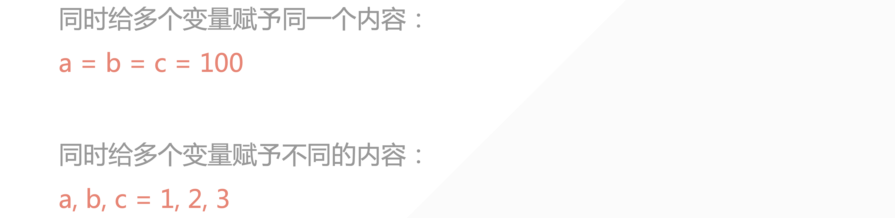
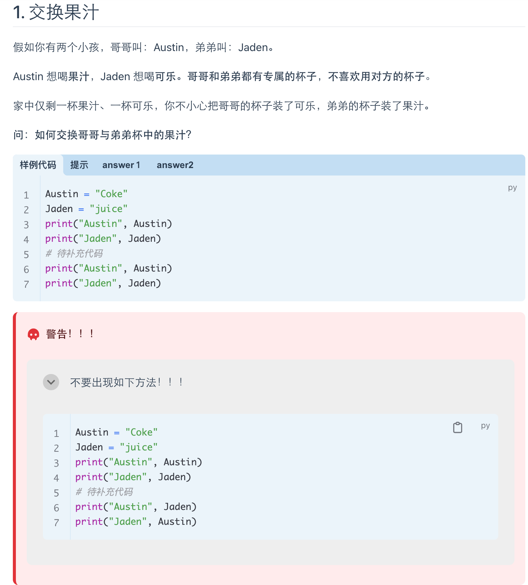
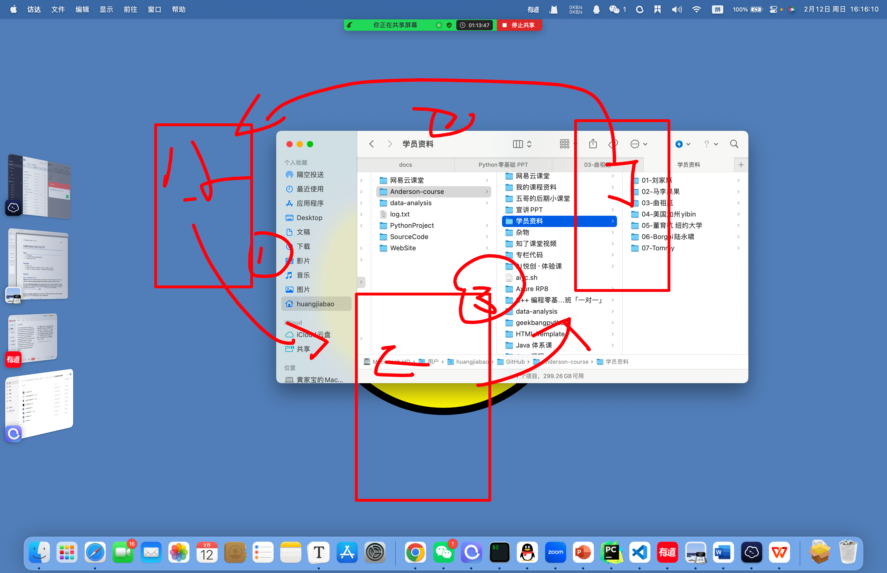

## 1. 变量的定义「Variable」

在计算机的内存当中，开辟空间。——用来存储数据。

**特点：** 变量的值会被覆盖

## 2. 代码的运行逻辑

1. 从上到下，从右到左
2. 赋值是最后一步执行的

## 3. 小试牛刀

```python
x = 1
x = x + 10
print(x)
# print:打印、输出
# 注释用 #，你看得见，计算机看不见，说明这行代码的含义
# 快捷键：command + /

name1 = 'lilei'
name2 = name1
print(name2)

name1 = "aiyc"
name1 = "cava"
print(name1)
```

## 4. sep=" " 修改默认间隔

```python
a = 1
b = 1
c = 1
print(a, b, c, sep="-")
print(a)
print(b)
print(c)

# ------output------
1-1-1
1
1
1
```

## 5. end="\n" 修改结尾

```python
a = 1
b = 1
c = 1
print(a, b, c, end="\n\n")
print(a, end="\t")
print(b)
print(c)
```

## 6. 多个变量赋予相同的值

```python
a = b = c = 1
print(a, b, c, end="\n\n")
print(a, end="\t")
print(b)
print(c)
```

## 7. 多个变量赋予不同值

```python
a, b, c = 1, 2, 3
print(a, b, c, end="\n\n")
print(a, end="\t")
print(b)
print(c)
```



## 8. 练习





[https://bornforthis.cn/column/py/basequestion/special_variabl.html](https://bornforthis.cn/column/py/basequestion/special_variabl.html)


## 9. 变量的命名规则

1. Python 区分大小写：

```python
n = 1
N = 100
print(n)
```

2. 不能使用空格间隔

```python
user_name = "Aiyc"
print(user_name)
username = "Aiyc"
print(username)
```

3. 数字不能开头

```python
user_name = "Aiyc"
print(user_name)
us1iii1 = "Aiyc"
```

4. 不能使用 Python 的内置函数

```python
print = "aiyc"
print(print)
```

```python
TypeError: 'str' object is not callable
```

5. 关键词不能做变量名

```python
help("keywords")
```

```python
False               class               from                or
None                continue            global              pass
True                def                 if                  raise
and                 del                 import              return
as                  elif                in                  try
assert              else                is                  while
async               except              lambda              with
await               finally             nonlocal            yield
break               for                 not                 
```


::: details 公众号：AI悦创【二维码】


:::

::: info AI悦创·编程一对一

AI悦创·推出辅导班啦，包括「Python 语言辅导班、C++ 辅导班、java 辅导班、算法/数据结构辅导班、少儿编程、pygame 游戏开发、Web、Linux」，全部都是一对一教学：一对一辅导 + 一对一答疑 + 布置作业 + 项目实践等。当然，还有线下线上摄影课程、Photoshop、Premiere 一对一教学、QQ、微信在线，随时响应！微信：Jiabcdefh

C++ 信息奥赛题解，长期更新！长期招收一对一中小学信息奥赛集训，莆田、厦门地区有机会线下上门，其他地区线上。微信：Jiabcdefh

方法一：[QQ](http://wpa.qq.com/msgrd?v=3&uin=1432803776&site=qq&menu=yes)

方法二：微信：Jiabcdefh

:::
