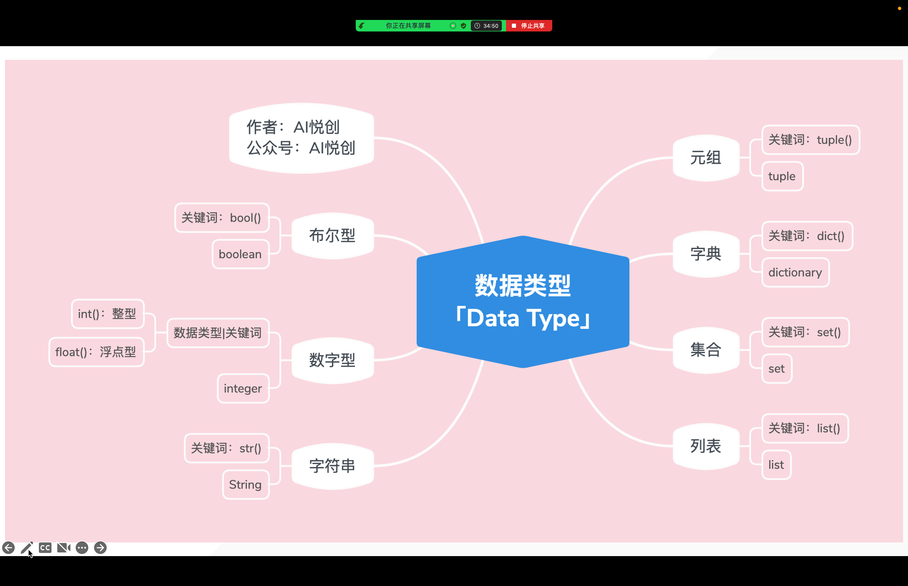
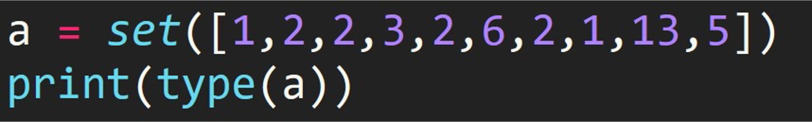
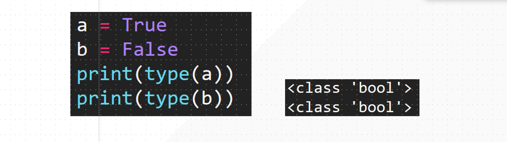

## 1. 数字型「int、float」

```python
a = 1
t = type(a)
print(t)

print(type(a))

# ------ output ------
<class 'int'>
<class 'int'>
```

```python
a = 1.1
t = type(a)
print(t)

print(type(a))

# ------ output ------
<class 'float'>
<class 'float'>
```

## 2. 字符串「str」

:::: tabs

@tab Code

```python
s = "aiyuechuang"
t = type(s)
print(t)

print(type(s))

# ------ output ------
<class 'str'>
<class 'str'>
```

@tab 三大特性

### 1. 不可变性

字符串被创建后，不能被修改！

::: warning

此不能被修改的特性，是指在你运行程序的时候，不是在你编写代码的时候，不可变。

:::

### 2. 有序性

从左到右 0 开始，从右到左 -1 开始。

### 3. 任意数据类型

你键盘上，可以输入的所有字符，都可以当作字符串的内容。

::::

## 3. 列表「list」

:::: tabs

@tab Code

```python
lst = [1, 2, 3, 4, "aiyc", 1.1]
t = type(lst)
print(t)

print(type(lst))

# ------ output ------
<class 'list'>
<class 'list'>
```

@tab 三大特性

### 1. 列表可变

可以添加数据、删除数据、修改数据

### 2. 有序性

从左到右 0 开始，从右到左 -1 开始。「下标」

### 3. 任意数据类型

是 Python 所有的类型，都可以放在我们的列表当中「当作列表的元素」。

::::

## 4. 元组「tuple」

:::: tabs

@tab Code

```python
tup = (1, 2, 3, "aiyc", [1, 2, 3, 4], 1.1)
t = type(tup)
print(t)

print(type(tup))

# ------ output ------
<class 'tuple'>
<class 'tuple'>
```

@tab 三大特性

### 1. 不可变性

元组被创建后，不能被修改！

::: warning

此不能被修改的特性，是指在你运行程序的时候，不是在你编写代码的时候，不可变。

:::

### 2. 有序性

从左到右 0 开始，从右到左 -1 开始。「下标」

### 3. 任意数据类型

是 Python 所有的类型，都可以放在我们的元组当中「当作元组的元素」。

::::

## 5. 字典「dict」

:::: tabs

@tab Code

```python
d = {1: "one", 2: "two"}
print(type(d))
```

@tab 特性

### 1. 定义

字典是由一系列的 key 和 value 组成的，`d = {key1: value1, key2: value2}`

### 2. key 的特点

字典的 key 要求是不可变的，可变的不能当作 key，列表、集合、字典不能当作字典的 key。

### 3. Value 的特点

任意数据类型。

### 4. 可变性

字典是可变的，可以添加、修改、删除数据。

### 5. 字典的“有序性”

字典在 Python 3.6+ 之后变成有序性，但是 3.6 之前不能保证有序性，该有序性指的是：**字典底层实现是有序性的，不是前面传统意义上的有序性。**

::: tip 提示

这个有序性，你现阶段用不到，你依然可以告诉自己：字典是无序的，这并不影响你的使用。

:::

::::

## 6. 集合「set」

:::: tabs

@tab Code

```python
s = {1, 2, 3, 4, (1, 2, 3), "aiyc", 1.1}
print(s)
print(type(s))
```

@tab 三大特性

### 1. 确定性

每一个值都是确定，列表可变，所以不确定，故：不支持，当作集合的 Value。

### 2. 无序性

### 3. 互异性

```python
s = {1, 1, 1, 1, 1, 1, 1, 1, 1, 2, 2, 2, 2}
print(s)
```



::::

## 7. 布尔型「bool」




::: details 公众号：AI悦创【二维码】


:::

::: info AI悦创·编程一对一

AI悦创·推出辅导班啦，包括「Python 语言辅导班、C++ 辅导班、java 辅导班、算法/数据结构辅导班、少儿编程、pygame 游戏开发、Web、Linux」，全部都是一对一教学：一对一辅导 + 一对一答疑 + 布置作业 + 项目实践等。当然，还有线下线上摄影课程、Photoshop、Premiere 一对一教学、QQ、微信在线，随时响应！微信：Jiabcdefh

C++ 信息奥赛题解，长期更新！长期招收一对一中小学信息奥赛集训，莆田、厦门地区有机会线下上门，其他地区线上。微信：Jiabcdefh

方法一：[QQ](http://wpa.qq.com/msgrd?v=3&uin=1432803776&site=qq&menu=yes)

方法二：微信：Jiabcdefh

:::
