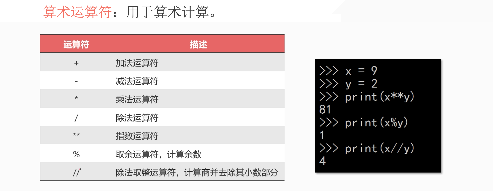

## 1. 数字型特点

::: tabs

@tab Code

```python
In [24]: 1 + 1
Out[24]: 2

In [25]: 1 + 1.0
Out[25]: 2.0

In [26]: 3 - 1.0
Out[26]: 2.0

In [27]: 3 - 2
Out[27]: 1

In [28]: 3 * 2
Out[28]: 6

In [29]: 3 * 2.1
Out[29]: 6.300000000000001

In [30]: 3 * 2.0
Out[30]: 6.0

In [31]: 9 / 3
Out[31]: 3.0
```

@tab 特点

### 特点1:

只要其中有一个是浮点数，最后的结果就是浮点数。「优先级最高」

### 特点2:

除法涉及精度问题，所以是最后是浮点型。

:::

## 2. 运算符



## 3. 练习

a = 25

Q1: 个位与十位相加

Q2: 25 变成 52、91 变成 19


::: details 公众号：AI悦创【二维码】


:::

::: info AI悦创·编程一对一

AI悦创·推出辅导班啦，包括「Python 语言辅导班、C++ 辅导班、java 辅导班、算法/数据结构辅导班、少儿编程、pygame 游戏开发、Web、Linux」，全部都是一对一教学：一对一辅导 + 一对一答疑 + 布置作业 + 项目实践等。当然，还有线下线上摄影课程、Photoshop、Premiere 一对一教学、QQ、微信在线，随时响应！微信：Jiabcdefh

C++ 信息奥赛题解，长期更新！长期招收一对一中小学信息奥赛集训，莆田、厦门地区有机会线下上门，其他地区线上。微信：Jiabcdefh

方法一：[QQ](http://wpa.qq.com/msgrd?v=3&uin=1432803776&site=qq&menu=yes)

方法二：微信：Jiabcdefh

:::
