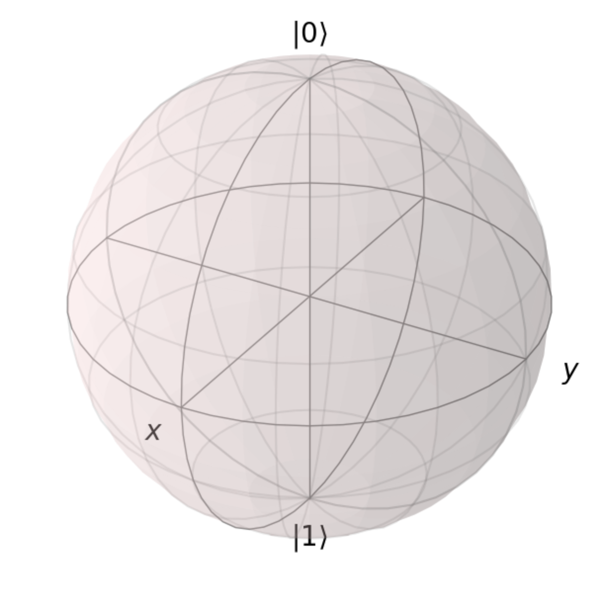

## 作业四：混态

```python
###### -- QUANTA -- #######
# Author: Y. Liu, W. Shi  #
# Data: 2022-09-17        #
###########################

from qutip import *
from scipy.linalg import *
from mpl_toolkits.mplot3d import Axes3D
import numpy as np
import matplotlib.pyplot as plt
```

## 第一步：混态的 Bloch 坐标

请在下面的代码框中，完善函数 `getCoordFromRho()` ，以及 `getRhoFromCoord()` 。

```python
def getCoordFromRho(Rho):
    coord = np.array([0.0000, 0.0000, 1.0000], dtype = float)
    #######################################
    #todo: complete this function.
    
    #######################################
    return coord

def getRhoFromCoord(coord):
    Rho = np.array([[1.0000 + 0.0000j, 0.0000 + 0.0000j], [0.0000 + 0.0000j, 0.0000 + 0.0000j]], dtype = complex)
    #######################################
    #todo: complete this function.
    
    #######################################
    return Rho
```

运行以下 block，检查函数实现正确性：

```python
#don't modify the code in this block
n_ck = 3
rho_ck = np.array([[[ 0.5000 + 0.0000j,   0.0000 + 0.0000j],
                    [ 0.0000 + 0.0000j,   0.5000 + 0.0000j]],
                   [[ 0.7500 + 0.0000j,   0.2500 - 0.2500j],
                    [ 0.2500 + 0.2500j,   0.2500 + 0.0000j]],
                   [[ 0.5000 + 0.0000j,   0.3535 + 0.3535j],
                    [ 0.3535 - 0.3535j,   0.5000 + 0.0000j]]], dtype = complex)
coord_ck = np.array([[ 0.0000,  0.0000,  0.0000],
                     [ 0.5000,  0.5000,  0.5000],
                     [ 0.7071, -0.7071,  0.0000]], dtype = float)

def checkCoord2Rho():
    print('Checking converting coordinate to state vector...')
    err = [np.sum(abs(getRhoFromCoord(coord_ck[c]) - rho_ck[c])) for c in range(n_ck)]
    if np.sum(err) < 0.01:
        print('Pass!')
    else:
        print('Wrong Answer err = %.3f! Please Correct the code.' % np.sum(err))

def checkRho2Coord():
    print('Checking converting state vector to coordinate...')
    err = [np.sum(abs(getCoordFromRho(rho_ck[c]) - coord_ck[c])) for c in range(n_ck)]
    if np.sum(err) < 0.01:
        print('Pass!')
    else:
        print('Wrong Answer err = %.3f! Please Correct the code.' % np.sum(err))
        
checkCoord2Rho()
checkRho2Coord()
```

## 第二步 混态的绘制

添加代码，将 `rho_to_add` 全部绘制到 Block 球上。

```python
Rho_to_add = np.array([[[ 0.5000 + 0.0000j,   0.0000 + 0.0000j],
                        [ 0.0000 + 0.0000j,   0.5000 + 0.0000j]],
                       [[ 0.7500 + 0.0000j,   0.2500 - 0.2500j],
                        [ 0.2500 + 0.2500j,   0.2500 + 0.0000j]],
                       [[ 0.5000 + 0.0000j,   0.3535 + 0.3535j],
                        [ 0.3535 - 0.3535j,   0.5000 + 0.0000j]]], dtype = complex)

fig = plt.figure(figsize=(6,6))
axes = Axes3D(fig, auto_add_to_figure=False)
fig.add_axes(axes)
sphere = Bloch(axes = axes)

######################
#todo:
#converting the 3 states in Rho_to_add into coordinates, and ploting them onto the Bloch sphere


######################
sphere.make_sphere()

#when using CMD to run this script, the Bloch sphere can be shown in an independent view by the following code.
#fig.show()
```




## 第三步 混态的幺正变换

```python
def evo_Mix(U, Rho):
    Rho = np.matrix(Rho)
    U = np.matrix(U)
    Rho_evo = np.matrix([[1.0000, 0.0000], [0.0000, 0.0000]], dtype = complex)
    #######################################
    #todo: complete this function.
    
    #######################################
    return Rho_evo
```

运行以下代码块检查函数正确性

```python
U_ck = np.array([[0.1245 + 0.4403j, -0.5523 + 0.6968j],
                 [0.2248 + 0.8603j,  0.2914 - 0.3528j]], dtype = complex)

Rho_ck = np.array([[ 0.5000 + 0.0000j,   0.3535 + 0.3535j],
                   [ 0.3535 - 0.3535j,   0.5000 + 0.0000j]], dtype = complex)

Rho_ans = np.array([[ 0.9015 + 0.0000j,   0.2884 + 0.0741j],
                    [ 0.2884 - 0.0741j,   0.0984 + 0.0000j]], dtype = complex)

Rho_out = evo_Mix(U_ck, Rho_ck)
err = np.sum(abs(Rho_out - Rho_ans))


if np.sum(err) < 0.01:
    print('Pass!')
else:
    print('Wrong Answer err = %.3f! Please Correct the code.' % np.sum(err))
```

## 第四步 混态的测量

```python
def getBasisState(O):
    psi_0 = np.matrix([[1.0000],[0.0000]], dtype = complex)
    psi_1 = np.matrix([[0.0000],[1.0000]], dtype = complex)
    #######################################
    #todo: no difference with the funciton in HW-3. Using that code directly.
    

    
    #######################################
    # order: eigenvalue(psi_0) > eivenvalue(psi_1)
    return [psi_0, psi_1]

def Meas_Mix(Rho, O):
    m_base = getBasisState(O)
    p0 = 0.5000
    p1 = 0.5000
    #######################################
    #todo: modify the following code to complete this function. The initial values are assigned manually
    
    #######################################
    return [p0, p1]
```

运行以下代码块检查函数正确性：

```python
H_ck = np.matrix([[0.0000 + 0.0000j,  1.0000 + 0.0000j],
                  [1.0000 + 0.0000j,  0.0000 + 0.0000j]], dtype = complex)
rho_ck = np.matrix([[ 0.9015 + 0.0000j,   0.2884 + 0.0741j],
                    [ 0.2884 - 0.0741j,   0.0984 + 0.0000j]], dtype = complex)


def checkProb():
    print("Check the obtained probabilities...")

    p = Meas_Mix(rho_ck, H_ck)

    err = abs(p[0] - 0.7883) + abs(p[1] - 0.2116)
    if err < 0.01:
        print('Pass!')
    else:
        print('Wrong Answer err = %.3f! Please Correct the code.' % err)
    return

checkProb()
```


::: details 公众号：AI悦创【二维码】


:::

::: info AI悦创·编程一对一

AI悦创·推出辅导班啦，包括「Python 语言辅导班、C++ 辅导班、java 辅导班、算法/数据结构辅导班、少儿编程、pygame 游戏开发、Web、Linux」，全部都是一对一教学：一对一辅导 + 一对一答疑 + 布置作业 + 项目实践等。当然，还有线下线上摄影课程、Photoshop、Premiere 一对一教学、QQ、微信在线，随时响应！微信：Jiabcdefh

C++ 信息奥赛题解，长期更新！长期招收一对一中小学信息奥赛集训，莆田、厦门地区有机会线下上门，其他地区线上。微信：Jiabcdefh

方法一：[QQ](http://wpa.qq.com/msgrd?v=3&uin=1432803776&site=qq&menu=yes)

方法二：微信：Jiabcdefh

:::


