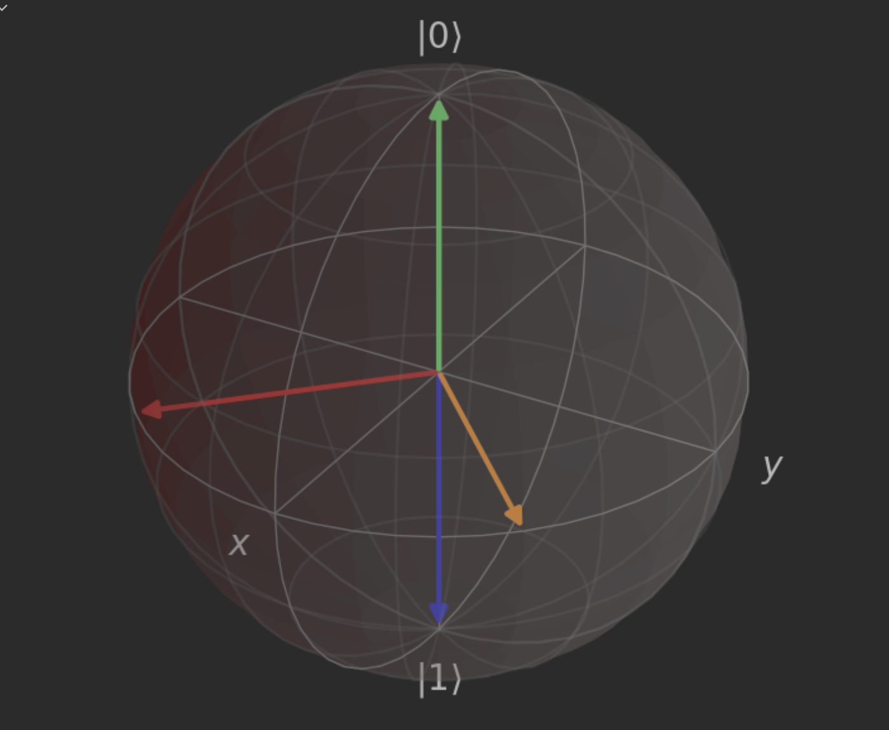

[Bloch-HW-1.ipynb](/1v1/27-111923/Bloch-HW-1.ipynb)


## 作业一：量子态的 Bloch 表示

```python
def getCoordFromPsi(psi):
    coord = np.array([0.0000, 0.0000, 1.0000], dtype=float)
    coord[0] = 2 * (np.real(np.conj(psi[0]) * psi[1])) # x
    coord[1] = 2 * (np.imag(np.conj(psi[0]) * psi[1])) # y
    coord[2] = 1 - 2 * (np.real(np.conj(psi[1]) * psi[1])) # z
    return coord

def getPsiFromCoord(coord):
    psi = np.array([0.0000 + 0.0000j, 1.0000 + 0.0000j], dtype=complex)
    psi[1] = np.cos(np.pi/2 - np.arccos(coord[2])) # a
    psi[0] = np.sin(np.pi/2 - np.arccos(coord[2])) * np.exp(1j * np.arctan2(coord[1], coord[0])) # b
    return psi
```

首先，我们需要给定 Bloch 球的半径 r=1，即 Bloch 球的范围为 $x^2 + y^2 + z^2 = 1$。因此，我们需要把量子态的矢量 $(x, y, z)$ 转化为 $(\theta, \phi)$。

为了实现从量子态到 Bloch 球坐标系的转换，我们首先需要得到一个函数 `getCoordFromPsi(psi)`，其中 psi 表示量子态。该函数的输入为一个复数数组 $\psi$，代表一个 $N$-量子比特系统的态矢量，该函数将返回一个由 3 个浮点数组成的向量，表示这个量子态在 Bloch 球上对应的坐标。

在函数 `getCoordFromPsi(psi)` 中，首先定义了一个 3 维浮点数向量 coord，然后返回该向量。这里的 coord 表示 Bloch 球上的一个点的坐标。

我们需要在 getCoordFromPsi(psi) 函数中实现从量子态到 Bloch 球坐标系的转换。具体来说，我们需要完成以下几个步骤：

- 计算量子态的 $\theta$ 和 $\phi$。这里的 $\theta$ 和 $\phi$ 分别是 Bloch 球上与点 $(x, y, z)$ 对应的极角和方位角。
- 计算 $(x, y, z)$。根据 Bloch 球的坐标系定义，我们可以通过 $(\theta, \phi)$ 得到 $(x, y, z)$，即 $(x, y, z) = (\sin\theta\cos\phi, \sin\theta\sin\phi, \cos\theta)$。

接下来，我们需要得到一个函数 getPsiFromCoord(coord)，该函数将 Bloch 球上的坐标转换为对应的量子态。该函数的输入为一个 3 个浮点数组成的向量 coord，表示 Bloch 球上的一个点的坐标，该函数将返回一个由 N 个复数组成的数组 psi，表示该 Bloch 球上的点对应的量子态。

在函数 `getPsiFromCoord(coord)` 中，首先定义了一个 N 维复数向量 psi，然后返回该向量。这里的 psi 表示 Bloch 球上的一个点对应的量子态。

我们需要在 `getPsiFromCoord(coord)` 函数中实现从 Bloch 球坐标系到量子态的转换。具体来说，我们需要完成以下几个步骤：

- 计算量子态的 $(\theta, \phi)$。这里的 $(\theta, \phi)$ 分别是 Bloch 球上与点 coord 对应的极角和方位角。
- 计算量子态的矢量。根据 Bloch 球的坐标系定义，我们可以通过 $(\theta, \phi)$ 得到 Bloch 球

"1j" 是 Python 中表示虚数单位的写法，即表示 $\sqrt{-1}$，与数学中的 $i$ 是等价的。在 Python 中，复数可以用实部和虚部表示，例如 $a + bi$ 可以写成 `(a + b * 1j)` 的形式。因此，在代码中，`(1 + 0j)` 表示的是复数 $1$。


## 第二步：Bloch 球的绘制

```python
# importing necessary libraries
from qutip import *
from mpl_toolkits.mplot3d import Axes3D
import matplotlib.pyplot as plt
import numpy as np

# define functions to convert state vector and coordinate
def getCoordFromPsi(psi):
    # convert the state vector to a coordinate on Bloch sphere
    coord = [2*np.real(psi[1]*np.conj(psi[0])), 2*np.imag(psi[1]*np.conj(psi[0])), np.real(np.abs(psi[0])**2 - np.abs(psi[1])**2)]
    return coord

def getPsiFromCoord(coord):
    # convert the coordinate on Bloch sphere to a state vector
    psi = [np.sqrt(1 - np.abs(coord[2])**2) * np.exp(1j*np.angle(coord[0]+1j*coord[1])/2), np.sqrt(1 - np.abs(coord[2])**2) * np.exp(-1j*np.angle(coord[0]+1j*coord[1])/2)]
    return psi

# define states to plot on Bloch sphere
psi_to_add = np.array([[ 1.0000 + 0.0000j,  0.0000 + 0.0000j],
                       [ 0.7071 + 0.0000j,  0.5000 + 0.5000j],
                       [ 0.0000 + 0.0000j,  0.0000 + 1.0000j],
                       [-0.7071 + 0.0000j, -0.5000 + 0.5000j],
                       [-1.0000 + 0.0000j, -0.0000 + 0.0000j]])

# create Bloch sphere and add states to it
fig = plt.figure(figsize=(6,6))
axes = Axes3D(fig, auto_add_to_figure=False)
fig.add_axes(axes)
sphere = Bloch(axes = axes)

# add states to Bloch sphere
for i in range(len(psi_to_add)):
    psi = psi_to_add[i]
    coord = getCoordFromPsi(psi)
    sphere.add_vectors(coord)

# finalize Bloch sphere and show
sphere.make_sphere()
plt.show()
```



这个代码运行结果会弹出一个窗口，其中有一个三维的 Bloch 球。我们可以看到五个量子态已经被成功地绘制到了 Bloch 球上。

在这个代码中，首先定义了一个包含五个量子态的矩阵 `psi_to_add`。然后定义了一个 `fig` 变量，并用 `Axes3D` 函数创建一个 3D 坐标系。接着，创建一个 `Bloch` 对象 `sphere`，传入 `axes` 参数，将其与坐标系关联。然后，用 `add_vectors` 函数把第一个量子态 `psi` 转换成对应的坐标，并将该坐标向量添加到 `sphere` 中，以在 Bloch 球上绘制量子态。

接下来，我们需要将 `psi_to_add` 中的其他四个量子态转换为对应的坐标，并将它们添加到 Bloch 球上。这里可以使用 `getCoordFromPsi` 函数将量子态转换为对应的坐标，并使用 `add_vectors` 函数将其添加到 `sphere` 中。最后，调用 `make_sphere` 函数生成 Bloch 球。

在命令行中运行这个脚本时，可以使用 `fig.show()` 函数以独立视图显示 Bloch 球。


::: details 公众号：AI悦创【二维码】


:::

::: info AI悦创·编程一对一

AI悦创·推出辅导班啦，包括「Python 语言辅导班、C++ 辅导班、java 辅导班、算法/数据结构辅导班、少儿编程、pygame 游戏开发、Web、Linux」，全部都是一对一教学：一对一辅导 + 一对一答疑 + 布置作业 + 项目实践等。当然，还有线下线上摄影课程、Photoshop、Premiere 一对一教学、QQ、微信在线，随时响应！微信：Jiabcdefh

C++ 信息奥赛题解，长期更新！长期招收一对一中小学信息奥赛集训，莆田、厦门地区有机会线下上门，其他地区线上。微信：Jiabcdefh

方法一：[QQ](http://wpa.qq.com/msgrd?v=3&uin=1432803776&site=qq&menu=yes)

方法二：微信：Jiabcdefh

:::


