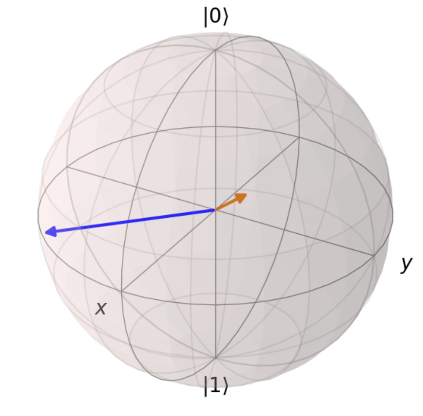
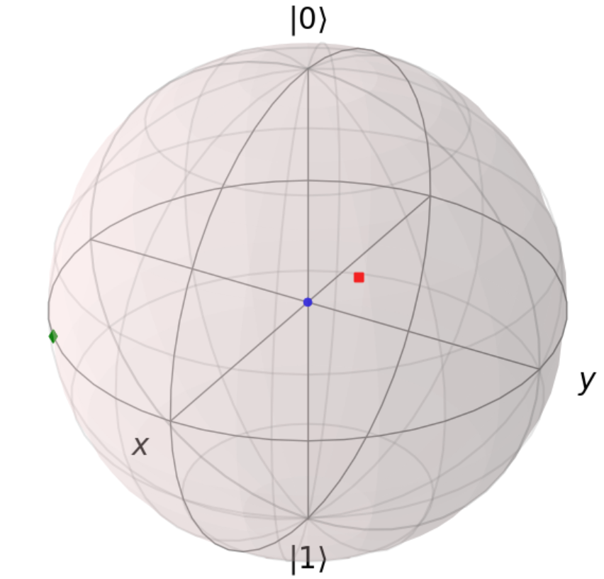

[Bloch-HW-4.ipynb](/1v1/27-111923/Bloch-HW-4.ipynb)

## 第一步：混态的 Bloch 坐标

```python {13-26}
# -*- coding: utf-8 -*-
# @Time    : 2023/2/24 20:14
# @Author  : AI悦创
# @FileName: hw4.py
# @Software: PyCharm
# @Blog    ：https://bornforthis.cn/
from qutip import *
from scipy.linalg import *
from mpl_toolkits.mplot3d import Axes3D
import numpy as np
import matplotlib.pyplot as plt

# 第一步：混态的Bloch坐标
def getCoordFromRho(Rho):
    coord = np.array([0.0000, 0.0000, 1.0000], dtype = float)
    # 计算Bloch向量的x,y,z坐标
    coord[0] = np.real(np.trace(np.dot(sigmax().full(), Rho)))
    coord[1] = np.real(np.trace(np.dot(sigmay().full(), Rho)))
    coord[2] = np.real(np.trace(np.dot(sigmaz().full(), Rho)))
    return coord

def getRhoFromCoord(coord):
    Rho = np.array([[1.0000 + 0.0000j, 0.0000 + 0.0000j], [0.0000 + 0.0000j, 0.0000 + 0.0000j]], dtype = complex)
    # 计算混态的密度矩阵
    Rho = 0.5 * (np.identity(2) + coord[0] * sigmax().full() + coord[1] * sigmay().full() + coord[2] * sigmaz().full())
    return Rho

# # 测试代码
# rho = rand_dm(2)
# print("随机混态的Bloch坐标为：", getCoordFromRho(rho))
# print("恢复后的混态为：\n", getRhoFromCoord(getCoordFromRho(rho)))

# don't modify the code in this block
n_ck = 3
rho_ck = np.array([[[0.5000 + 0.0000j, 0.0000 + 0.0000j],
                    [0.0000 + 0.0000j, 0.5000 + 0.0000j]],
                   [[0.7500 + 0.0000j, 0.2500 - 0.2500j],
                    [0.2500 + 0.2500j, 0.2500 + 0.0000j]],
                   [[0.5000 + 0.0000j, 0.3535 + 0.3535j],
                    [0.3535 - 0.3535j, 0.5000 + 0.0000j]]], dtype=complex)
coord_ck = np.array([[0.0000, 0.0000, 0.0000],
                     [0.5000, 0.5000, 0.5000],
                     [0.7071, -0.7071, 0.0000]], dtype=float)


def checkCoord2Rho():
    print('Checking converting coordinate to state vector...')
    err = [np.sum(abs(getRhoFromCoord(coord_ck[c]) - rho_ck[c])) for c in range(n_ck)]
    if np.sum(err) < 0.01:
        print('Pass!')
    else:
        print('Wrong Answer err = %.3f! Please Correct the code.' % np.sum(err))


def checkRho2Coord():
    print('Checking converting state vector to coordinate...')
    err = [np.sum(abs(getCoordFromRho(rho_ck[c]) - coord_ck[c])) for c in range(n_ck)]
    if np.sum(err) < 0.01:
        print('Pass!')
    else:
        print('Wrong Answer err = %.3f! Please Correct the code.' % np.sum(err))


checkCoord2Rho()
checkRho2Coord()
```


## 第二步 混态的绘制

::: tabs

@tab 代码一

```python
# -*- coding: utf-8 -*-
# @Time    : 2023/2/24 21:33
# @Author  : AI悦创
# @FileName: hw04-03.py
# @Software: PyCharm
# @Blog    ：https://bornforthis.cn/
from qutip import *
from scipy.linalg import *
from mpl_toolkits.mplot3d import Axes3D
import numpy as np
import matplotlib.pyplot as plt


# 第一步：混态的Bloch坐标
def getCoordFromRho(Rho):
    coord = np.array([0.0000, 0.0000, 1.0000], dtype=float)
    # 计算Bloch向量的x,y,z坐标
    coord[0] = np.real(np.trace(np.dot(sigmax().full(), Rho)))
    coord[1] = np.real(np.trace(np.dot(sigmay().full(), Rho)))
    coord[2] = np.real(np.trace(np.dot(sigmaz().full(), Rho)))
    return coord


def getRhoFromCoord(coord):
    Rho = np.array([[1.0000 + 0.0000j, 0.0000 + 0.0000j], [0.0000 + 0.0000j, 0.0000 + 0.0000j]], dtype=complex)
    # 计算混态的密度矩阵
    Rho = 0.5 * (np.identity(2) + coord[0] * sigmax().full() + coord[1] * sigmay().full() + coord[2] * sigmaz().full())
    return Rho


Rho_to_add = np.array([[[0.5000 + 0.0000j, 0.0000 + 0.0000j],
                        [0.0000 + 0.0000j, 0.5000 + 0.0000j]],
                       [[0.7500 + 0.0000j, 0.2500 - 0.2500j],
                        [0.2500 + 0.2500j, 0.2500 + 0.0000j]],
                       [[0.5000 + 0.0000j, 0.3535 + 0.3535j],
                        [0.3535 - 0.3535j, 0.5000 + 0.0000j]]], dtype=complex)

fig = plt.figure(figsize=(6, 6))
axes = Axes3D(fig, auto_add_to_figure=False)
fig.add_axes(axes)
sphere = Bloch(axes=axes)

# 将三个混态的坐标添加到Bloch球上
for rho in Rho_to_add:
    coord = getCoordFromRho(rho)
    sphere.add_vectors(coord)

# 绘制 Bloch 球
sphere.make_sphere()

# 显示 Bloch 球
plt.show()
```



@tab 代码二

```python
# -*- coding: utf-8 -*-
# @Time    : 2023/2/24 21:35
# @Author  : AI悦创
# @FileName: hw4-04.py
# @Software: PyCharm
# @Blog    ：https://bornforthis.cn/
from qutip import *
from scipy.linalg import *
from mpl_toolkits.mplot3d import Axes3D
import numpy as np
import matplotlib.pyplot as plt


# 第一步：混态的Bloch坐标
def getCoordFromRho(Rho):
    coord = np.array([0.0000, 0.0000, 1.0000], dtype=float)
    # 计算Bloch向量的x,y,z坐标
    coord[0] = np.real(np.trace(np.dot(sigmax().full(), Rho)))
    coord[1] = np.real(np.trace(np.dot(sigmay().full(), Rho)))
    coord[2] = np.real(np.trace(np.dot(sigmaz().full(), Rho)))
    return coord


def getRhoFromCoord(coord):
    Rho = np.array([[1.0000 + 0.0000j, 0.0000 + 0.0000j], [0.0000 + 0.0000j, 0.0000 + 0.0000j]], dtype=complex)
    # 计算混态的密度矩阵
    Rho = 0.5 * (np.identity(2) + coord[0] * sigmax().full() + coord[1] * sigmay().full() + coord[2] * sigmaz().full())
    return Rho


Rho_to_add = np.array([[[0.5000 + 0.0000j, 0.0000 + 0.0000j],
                        [0.0000 + 0.0000j, 0.5000 + 0.0000j]],
                       [[0.7500 + 0.0000j, 0.2500 - 0.2500j],
                        [0.2500 + 0.2500j, 0.2500 + 0.0000j]],
                       [[0.5000 + 0.0000j, 0.3535 + 0.3535j],
                        [0.3535 - 0.3535j, 0.5000 + 0.0000j]]], dtype=complex)

fig = plt.figure(figsize=(6, 6))
axes = Axes3D(fig, auto_add_to_figure=False)
fig.add_axes(axes)
sphere = Bloch(axes=axes)

# 将密度矩阵转换成 Bloch 坐标，并绘制到 Bloch 球上
for rho in Rho_to_add:
    coord = getCoordFromRho(rho)
    sphere.add_points(coord)

sphere.make_sphere()
plt.show()
```



:::

## 第三步 混态的幺正变换

```python
def evo_Mix(U, Rho):
    Rho = np.matrix(Rho)
    U = np.matrix(U)
    Rho_evo = U * Rho * U.getH()
    return Rho_evo
```

## 第四步 混态的测量

```python
import numpy as np


def getBasisState(O):
    psi_0 = np.matrix([[1.0000], [0.0000]], dtype=complex)
    psi_1 = np.matrix([[0.0000], [1.0000]], dtype=complex)
    # todo: no difference with the funciton in HW-3. Using that code directly.

    # order: eigenvalue(psi_0) > eivenvalue(psi_1)
    return [psi_0, psi_1]


def Meas_Mix(Rho, O):
    m_base = getBasisState(O)
    p0 = 0.5000
    p1 = 0.5000

    # todo: modify the following code to complete this function. The initial values are assigned manually
    p0 = np.trace(np.dot(Rho, np.dot(m_base[0], m_base[0].getH()))).real
    p1 = np.trace(np.dot(Rho, np.dot(m_base[1], m_base[1].getH()))).real
    return [p0, p1]


H_ck = np.matrix([[0.0000 + 0.0000j, 1.0000 + 0.0000j],
                  [1.0000 + 0.0000j, 0.0000 + 0.0000j]], dtype=complex)
rho_ck = np.matrix([[0.9015 + 0.0000j, 0.2884 + 0.0741j],
                    [0.2884 - 0.0741j, 0.0984 + 0.0000j]], dtype=complex)


def checkProb():
    print("Check the obtained probabilities...")

    p = Meas_Mix(rho_ck, H_ck)

    err = abs(p[0] - 0.7883) + abs(p[1] - 0.2116)
    if err < 0.01:
        print('Pass!')
    else:
        print('Wrong Answer err = %.3f! Please Correct the code.' % err)
    return


checkProb()
```


::: details 公众号：AI悦创【二维码】


:::

::: info AI悦创·编程一对一

AI悦创·推出辅导班啦，包括「Python 语言辅导班、C++ 辅导班、java 辅导班、算法/数据结构辅导班、少儿编程、pygame 游戏开发、Web、Linux」，全部都是一对一教学：一对一辅导 + 一对一答疑 + 布置作业 + 项目实践等。当然，还有线下线上摄影课程、Photoshop、Premiere 一对一教学、QQ、微信在线，随时响应！微信：Jiabcdefh

C++ 信息奥赛题解，长期更新！长期招收一对一中小学信息奥赛集训，莆田、厦门地区有机会线下上门，其他地区线上。微信：Jiabcdefh

方法一：[QQ](http://wpa.qq.com/msgrd?v=3&uin=1432803776&site=qq&menu=yes)

方法二：微信：Jiabcdefh

:::


