## 1. Hello, Grok!

### 1.1 Notes

> 笔记

Welcome to Grok Learning, and to the joys of computer programming! You will spend a lot of time here during this subject, so let's spend a few minutes settling in and familiarising ourselves with the Grok environment.

> 欢迎来到 Grok Learning，享受计算机编程的乐趣!在这门课程中，你们会花很多时间在这里，所以让我们花几分钟来适应和熟悉Grok环境。

If you like, you can take a 'tour' of the interface by pressing the **Instructions** button near the top left corner of the window — Grok will show you around.

> 如果你愿意，你可以通过按窗口左上角的**Instructions**按钮来“游览”界面——Grok会带你四处看看。

### 1.2 Ready?

> 准备好了吗?

When you are ready, continue to the next slide to begin the module.

> 当你准备好了，继续到下一张幻灯片开始这个模块。

(Press the right arrow button next to the title "Hello, Grok!" above, or press the right arrow key on your keyboard).

> (按上方标题“Hello, Grok!”旁边的右箭头键，或按键盘上的右箭头键)。

## 2. Hello, turtle! 🐢

For the first worksheet, we will introduce you in a slightly hand-wavy way to many of the programming concepts we will cover during the semester, before coming back to them in more depth later down the track. We'll do this by programming a robotic turtle, because why not!

> 对于第一张工作表，我们将以一种稍微简单的方式向您介绍本学期将涉及到的许多编程概念，然后在后面的轨道上更深入地回到它们。我们将通过编程一个机器龟来做到这一点，因为为什么不呢!

To control the turtle, we will be building programs which command the turtle to move in various ways. Importantly, the robotic turtle has slug-like tendencies in drawing a line wherever it walks. So, each turtle program will draw a picture or pattern. Here's an example of the turtle following a program:

> 为了控制海龟，我们将编写程序，命令海龟以各种方式移动。重要的是，这只机器龟在走路的时候会像鼻涕虫一样划出一条线。所以，每个海龟程序都会画一张图片或图案。下面是一个海龟执行程序的例子:

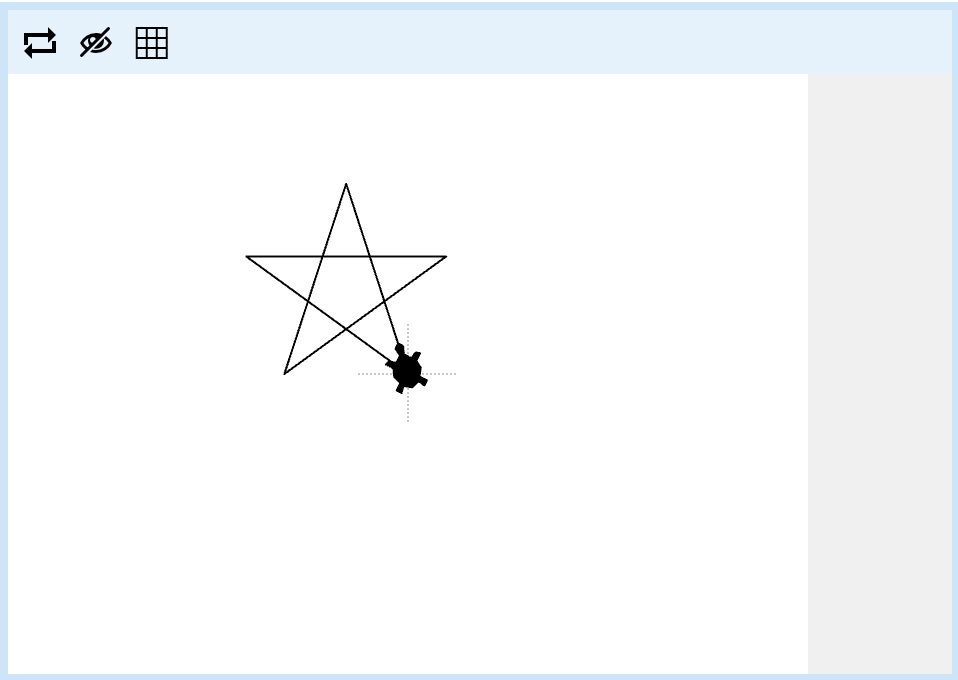

### 2.1 Turtle graphics

::: tip Turtle graphics

> 龟图

A robot turtle that walks around drawing shapes may seem like a simple toy example for learning programming. But it's not *just* a toy!

> 一个走来走去画着形状的机器乌龟似乎是学习编程的一个简单的玩具例子。但它不仅仅是一个玩具!

The same concept (drawing patterns and pictures by programming a line-drawing 'cursor', like our turtle) is used in real-world computer graphics.

> 同样的概念(通过编程绘制线条“光标”来绘制图案和图片，就像我们的海龟一样)也用于真实的计算机图形。

If you are interested, the [Turtle graphics page](https://en.wikipedia.org/wiki/Turtle_graphics) on Wikipedia has more information.

> 如果您感兴趣，维基百科上的[Turtle图形页面](https://en.wikipedia.org/wiki/Turtle_graphics)有更多信息。

:::

```python
import turtle

canvas = turtle.Screen()

pen = turtle.Turtle()
pen.color("red")
pen.pensize(5)

for i in range(5):
    pen.forward(200)
    pen.right(144)

canvas.exitonclick()
```

## 3. Hello, Blockly!

> 你好,块!

So how do we write these programs to move the turtle? With a **programming language**. This will let us make commands in a structured way so that the computer can execute them and make our turtle draw nice shapes!

> 那么我们如何编写这些程序来移动海龟呢?用编程语言。这将让我们以结构化的方式制作命令，这样计算机就可以执行它们，让我们的乌龟画出漂亮的形状!

The programming language we'll use in this subject is called **Python**, but in this worksheet, to make things easier for you we'll use a presentation called **Blockly** to represent the code you'll one day be writing. Blockly shows code as blocks which you can drag around and connect in different ways to make your turtle do different things. Here's an example of a blockly turtle program:

> 我们在这个主题中使用的编程语言叫做 Python，但是在这个工作表中，为了让事情变得更简单，我们将使用一个叫做 Blockly 的演示来表示你将来要写的代码。Blockly 将代码显示为块，您可以以不同的方式拖动和连接，使您的海龟做不同的事情。下面是一个 block - ly turtle程序的例子:

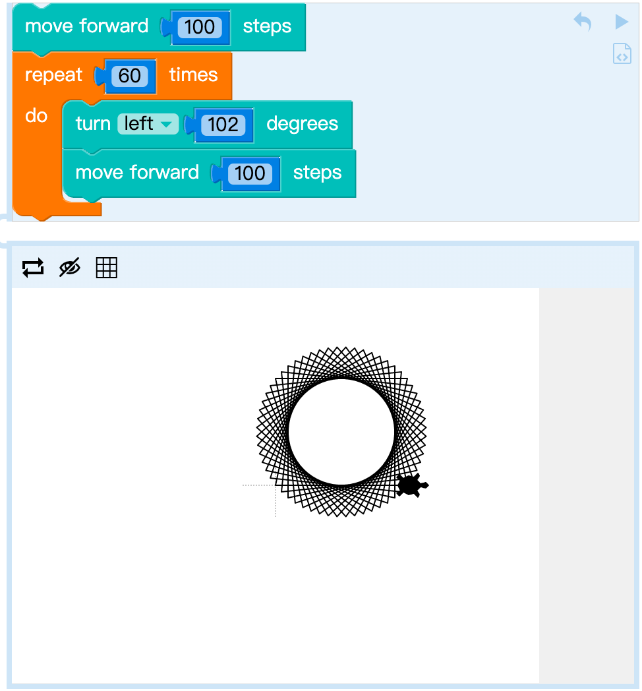

等价代码：

```python
from turtle import *


forward(100)
for count in range(60):
    left(102)
    forward(100)
```

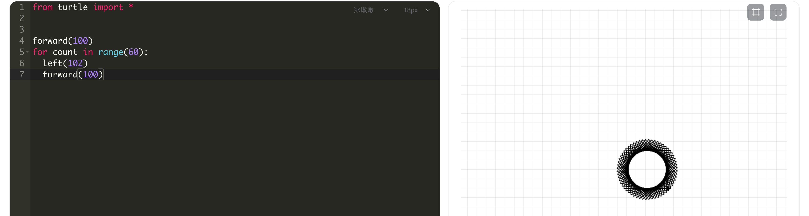

You can see the program in action if you click the play (▶) button in the top right corner of the program window directly above this text. Clicking the "Toggle blocks" button just below the play button will show you the Python code corresponding to the collection of blocks.

> 如果您点击该文本正上方的程序窗口右上角的播放(▶)按钮，就可以看到该程序的运行。点击 play 按钮下面的“Toggle blocks”按钮，将显示与该块集合对应的 Python 代码。

You might notice that every block of code translates to one line of code. You don't need to understand this code for now, but the important thing to know is that lines of code act as our units of instruction: one block converts to one line which makes the computer (or turtle) do one thing.

> 您可能注意到，每个代码块都转换为一行代码。你现在不需要理解这段代码，但重要的是要知道代码行作为我们的指令单位:一个块转换成一行，使计算机(或海龟)做一件事。

Before long, you'll be writing code like this, but for now, simply focus on the fact that the Python code controls the unsuspecting turtle.

> 不久之后，您将编写这样的代码，但是现在，只需关注Python代码控制不知情的海龟这一事实。

### 3.1 Worksheet Workflow

::: tip Worksheet Workflow

> 工作表的工作流程

Most slides in the worksheets will include in situ executable programs such as the above, which can be edited (e.g. try changing some of the numbers or order of the blocks in the program above, and run the example again to see what happens) and are intended for you to modify and play around with, to better understand the concepts discussed in the slide (without being directly assessable).

> 工作表中的大多数幻灯片将包括诸如上述的现场可执行程序，这些程序可以编辑(例如，尝试改变上面程序中块的一些数字或顺序，并再次运行示例，看看会发生什么)，并供您修改和摆弄，以更好地理解幻灯片中讨论的概念(而不是直接评估)。

:::

## 4. Modules and marks

> 模块和标记

Have a look at the navigation bar on the left of this window. You will see it contains diamonds () and circles ().

> 看看这个窗口左边的导航栏。你会看到它包含钻石()和圆圈()。

Each diamond represents a **problem** slide. Problems require you to answer a question or write some code. When you successfully complete a problem, the diamond for that problem will turn *green*, as follows: .

> 每个钻石代表一个问题幻灯片。问题需要你回答一个问题或写一些代码。当您成功完成一个问题时，该问题的菱形将变成绿色，如下所示:绿色菱形。

Your mark for each worksheet will be based on the number of green diamonds you have collected. Importantly, it doesn't matter how many attempts it takes to get the green diamond — sometimes you might get it first attempt (in which case, very well done), and in other instances it will take many, many attempts with lots of learnings along the way, but in either case, you get the same mark for the problem.

> 你的分数将基于你收集到的绿钻石的数量。重要的是，要尝试多少次才能得到绿钻石并不重要——有时你可能第一次尝试就得到绿钻石(在这种情况下，做得很好)，而在其他情况下，你需要很多很多次的尝试，在这个过程中学习很多东西，但在任何一种情况下，你得到的分数都是一样的。

Each circle in the navigation bar represents a **notes slide**. Notes slides are where we explain new programming concepts, with interactive elements and examples. You can't turn the circles green, and they don't affect your mark directly, but the problems generally rely on content from the preceding notes slides, so ensure you read them all carefully!

> 导航栏中的每个圆代表一个笔记幻灯片。讲义幻灯片是我们用交互元素和例子解释新的编程概念的地方。你不能把圆圈变成绿色，它们也不会直接影响你的分数，但这些问题通常依赖于前面笔记幻灯片的内容，所以你一定要仔细阅读它们!

Good luck collecting those green diamonds!

> 祝你能收集到那些绿钻石!

## 5. Your first green diamond

> 你的第一颗绿钻石

It's time to earn your first green diamond for this worksheet. This one will not be so tricky; it's just to get you familiar with Grok and the submission process. Simply follow these steps to complete the problem:

> 现在是时候为这个工作表赚取你的第一个绿钻石了。这个问题没那么棘手;只是为了让你熟悉格罗克和提交流程。简单地按照以下步骤来完成这个问题:

1. Drag and drop one of the 'Move forward 20 steps' blocks onto the empty workspace to the right of it. Anywhere in the white space will do.

> 将其中一个“向前移动20步”块拖放到它右边的空工作区中。空白区域的任何地方都可以。

2. Notice your instruction 'block' has just been translated into some Python code in the 'Code' tab below. In the next worksheet we'll be writing that code ourselves, but for now you can use the blocks to construct your program.

> 请注意，你的指令“block”刚刚在下面的“code”选项卡中被翻译成一些Python代码。在下一个工作表中，我们将自己编写代码，但现在你可以使用这些块来构造你的程序。

3. To run this program we've created and see what it does, hit the 'Run' button in the top right corner of the window.

> 要运行我们创建的程序并查看它的功能，请点击窗口右上角的“运行”按钮。

4. Watch the 'Animation' tab below the program. You should see the turtle start in the middle of the screen, facing right. It should move 20 'turtle steps' to the right (the direction it is facing). It should leave a short black line behind it.

> 观看程序下面的“动画”选项卡。你应该看到海龟从屏幕中间开始，面向右边。它应该向右(它面对的方向)移动20个“海龟步”。它应该在后面留下一条短黑线。

5. When you are ready, it's time to submit your program and get your first green diamond. Up near the 'Run' button, you will also see a 'Mark' button. Press this button now, and then press 'Submit' to check your answer.

> 当你准备好了，是时候提交你的程序并获得你的第一颗绿钻石了。在“运行”按钮附近，你还会看到一个“标记”按钮。现在按这个按钮，然后按“提交”来检查你的答案。

Note: if the 'Mark' button is not clickable, make sure you 'Run' your program first.

> 注意:如果“标记”按钮不可点击，请确保先“运行”您的程序。

Uh oh ... your program didn't pass the tests! Sorry, that was a cunning trick on our part. The program is not finished just yet: there's one more step to complete. You should have seen some feedback telling you where your answer needs work. Also, your diamond for this problem will now be orange.

> 哦…你的程序没有通过测试!对不起，这是我们的诡计。这个程序还没有完成，还有一个步骤要完成。你应该看到一些反馈，告诉你你的答案需要改进的地方。另外，这个问题的菱形现在是橙色的。

Luckily, in Grok **you can always submit as many times as you like**, until you pass all the tests and turn that diamond green! Here's the final step:

> 幸运的是，在Grok中，你可以随时提交你喜欢的次数，直到你通过所有测试并将钻石变成绿色!这是最后一步:

6. Change the number of steps the turtle walks inside the instruction block from 20 to 100.

> 将海龟在指令块内行走的步数从20改为100。

Now, submit again ('Run' then 'Mark' and 'Submit'), and you'll get the green diamond this time, promise!

> 现在，再次提交(“运行”，然后“标记”和“提交”)，这次你将获得绿色钻石，我保证!

            

## 6. Translation

> 翻译

Translation is an integral part of computer programming. To make a computer do something we want, we need to go through a number of steps involving stages of translation, and it's important to have an idea of how this works.

> 翻译是计算机编程不可分割的一部分。为了让计算机做我们想做的事情，我们需要经历一系列涉及翻译阶段的步骤，了解这是如何工作的很重要。

Let's use the example of drawing a triangle to illustrate this.

> 让我们用画一个三角形的例子来说明这一点。

### 6.1 Step 1: Translate from abstract thought to Pseudocode

> 步骤1:将抽象思想转化为伪代码

This means taking a goal we would like to achieve or task we would like to complete, thinking about it, and generating a structured set of steps which would need to be followed to achieve this. Computers aren't very good at taking vague instructions and knowing what to do, just like many of us would be overwhelmed if asked to make a green tea roll cake (yum!). Instead, computers need specific steps to follow, just like we would need a recipe to follow to make a cake.

> 这意味着设定一个我们想要实现的目标或我们想要完成的任务，思考它，并生成一组结构化的步骤，以实现这一目标。电脑不太擅长接受模糊的指令，也不知道该做什么，就像我们很多人如果被要求做一个绿茶卷蛋糕(真好吃!)相反，计算机需要遵循特定的步骤，就像我们需要遵循食谱来做蛋糕一样。

```
"I want to make the turtle draw a triangle"
“我想让乌龟画一个三角形”
```

So, how can a triangle be drawn? It's composed of three lines with a 120 degree turn between them. Let's write those steps in **pseudocode**.

> 那么，三角形怎么画呢?它由三条线组成，它们之间有120度的转弯。让我们用伪代码来编写这些步骤。

Pseudocode is simply our sequence of steps written in plain English but in a *structured* way. There is no "right" way to write pseudocode: it just needs to contain instructions in a structured way, one per line:

> 伪代码只是我们用简单的英语编写的步骤序列，但以结构化的方式编写。编写伪代码没有“正确”的方法:它只需要以结构化的方式包含指令，每行一个:

> ```
> START
> Move forward 20 steps
> Turn to the left by 120 degrees
> Move forward 20 steps
> Turn to the left by 120 degrees
> Move forward 20 steps
> END
> ```

Pseudocode is the general expression of a way to solve a problem, not specific to any particular programming language.

> 伪代码是解决问题方法的一般表达式，并不特定于任何特定的编程语言。

### 6.2 Step 2: Translate from Pseudocode to Code

> 步骤2:从伪代码转换为代码

Once we have our pseudocode, we can translate it fairly directly into a specific programming language so that we can feed it into a computer. There are many different choices of language but in this subject we'll use Python.

> 一旦我们有了伪代码，我们就可以相当直接地把它翻译成一种特定的编程语言，这样我们就可以把它输入计算机。有许多不同的语言选择，但在这个主题中，我们将使用Python。

In this worksheet, we're using Blockly which comes between pseudocode and Python code: it's a more friendly way for us to enter instructions which is then automatically converted to Python. This is a sequence of blockly blocks for the pseudocode we wrote above:

> 在这个工作表中，我们使用的是介于伪代码和Python代码之间的Blockly:它是我们输入指令的一种更友好的方式，然后自动转换为Python。这是我们上面写的伪代码的blockly块序列:

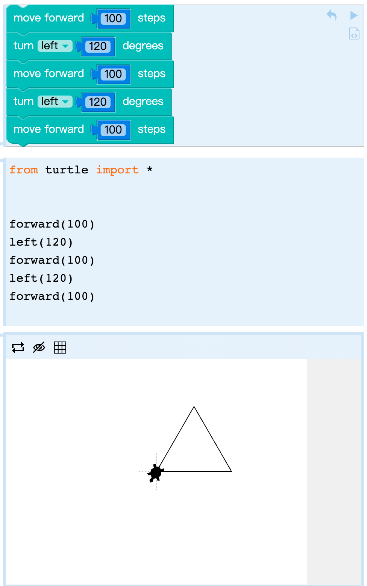

You will notice that each block is translated from one line of pseudocode, and is then translated into one line of Python code, which you can see with the "toggle blocks" button. (Note that one line of pseudocode may not always convert into one block or line of code. This depends on how specific you are with your pseudocode steps.)

> 您将注意到，每个块都是从一行伪代码转换而来，然后转换为一行Python代码，可以通过“toggle blocks”按钮看到。(请注意，一行伪代码可能并不总是转换成一个块或一行代码。这取决于伪代码步骤的具体程度。)

```python
forward(100)
left(120)
forward(100)
right(240)
forward(100)
```

### 6.3 Step 3: Translate from Python Code to Machine Language

> 步骤3:将Python代码翻译成机器语言

After you have written your program in Python, it can then be taken by your computer and translated (through a series of complicated processes which you don't need to worry about) into instructions which your computer's processor circuitry can execute. You can then hit "run" and the computer will complete the task and return the result to you.

> 在你用Python写完程序之后，你的计算机就可以把它转换成指令(通过一系列你不需要担心的复杂过程)，让计算机的处理器电路可以执行指令。然后你可以点击“运行”，计算机将完成任务并将结果返回给你。

There is a lot of complexity and clever innovation hidden away on your computer in how it translates code into a form it can "execute" directly. Feel free to give your computer a pat - *clever computer*!

> 在如何将代码转换成它可以直接“执行”的形式方面，您的计算机中隐藏着许多复杂性和巧妙的创新。给你的电脑一台灵巧的电脑吧!

## 7. The Way of the Program

> 程序的方式

Your first program (two slides back) was made from one code block, converting to one line of Python code. Generally, a one-line program can't do much (although we will actually see some very powerful one-liners later on; stay tuned!).

> 您的第一个程序(后面两张幻灯片)是由一个代码块生成的，转换为一行Python代码。一般来说，单行程序做不了太多事情(尽管稍后我们会看到一些非常强大的单行程序;请继续关注!)

Real programs are made of many lines, connected together. It is apt that we are using blocks to represent lines of code because we can think of each line like a 'building block': each doing something small, together achieving something more interesting.

> 真正的程序是由许多连接在一起的线组成的。我们使用块来表示代码行是很合适的，因为我们可以把每一行看作一个“构建块”:每一行都做一些小的事情，一起完成一些更有趣的事情。

When you **run** a program, it goes through the lines, one after another, and they all 'do their thing'. When all of the lines have done their thing, the entire program is finished.

> 当你运行一个程序时，它会一行一行地运行，它们都“做自己的事情”。当所有的行都完成了它们的任务时，整个程序就完成了。

Connecting blocks of code together in a 'sequence' like this is the most basic way to build a program: a list of steps that happen one after another.

> 像这样以“顺序”将代码块连接在一起是构建程序的最基本方法:一个接一个发生的步骤列表。

This is our first programming concept, and its name is **sequence**.

> 这是我们的第一个编程概念，它的名字叫序列。

### 7.1 Building blocks

> 构建块

::: tip Building blocks

It is especially useful to think of lines of code as blocks because when we build programs, it's as if we create a chain of building blocks, stacked on each other to build larger programs. The formal name for these 'building blocks' is **statements**: a Python program is a list of statements. The ones that take one line are called **simple statements**. As we will soon see, some statements can even span multiple lines.

> 将代码行视为块是特别有用的，因为当我们构建程序时，就好像我们创建了一个构建块链，相互堆叠以构建更大的程序。这些“构建块”的正式名称是语句:Python程序是一个语句列表。只有一行的语句称为简单语句。正如我们将很快看到的，一些语句甚至可以跨越多行。

:::

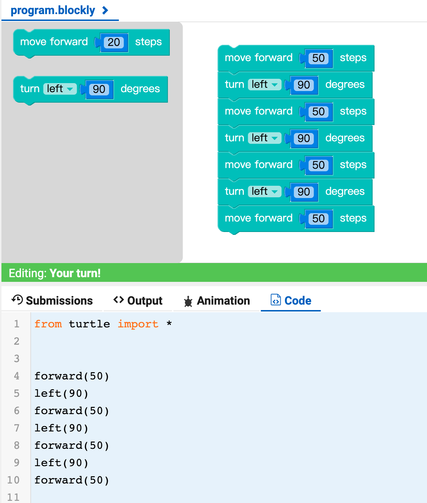

## 8. A sequence of blocks

> 块的序列

To see if you understand the idea of sequence, take a look at this simple program. Don't run it yet!

> 要了解您是否理解序列的思想，请看看这个简单的程序。先不要运行它!

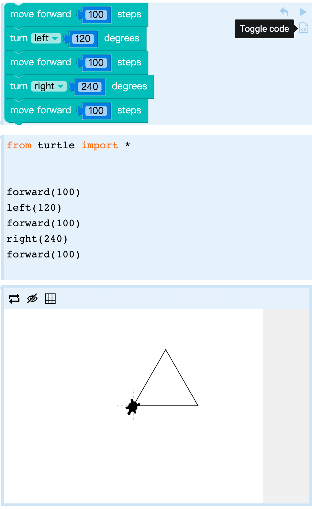

```python
from turtle import *


forward(100)
left(120)
forward(100)
right(240)
forward(100)
```

Before you run the program, try to follow the statements (blocks) yourself, and predict what shape the turtle will draw:

> 在运行程序之前，尝试自己遵循语句(块)，并预测海龟将绘制什么形状:

- Start at the top of the program, and work your way down, one statement at a time.

> 从程序的顶部开始，从上到下，一次一条语句。

- Imagine you are the turtle, following the instructions. Where will you go? With your finger, draw the shape of the line the turtle will draw.

> 想象你是那只乌龟，按照指令行事。你要去哪里?用你的手指，画出乌龟要画的线的形状。

When you are ready, 'run' the program by pressing the play (▶) button and see if you were right.

> 当你准备好了，通过按下播放(▶)按钮来“运行”程序，看看你是否正确。

If the turtle did something you didn't expect, try to watch it again: can you see it following the steps in each of the statements, one after another?

> 如果乌龟做了你没有预料到的事情，试着再看一遍:你能看到它一个接一个地执行每个语句中的步骤吗?

Finally, try changing the numbers in the program, or the order of the statements, and see if you can predict how the animation will change.

> 最后，试着改变程序中的数字，或者语句的顺序，看看你是否能预测动画将如何变化。

::: tabs

@tab Blocks

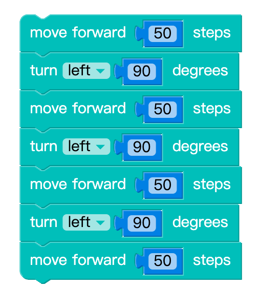

@tab Python

```python
from turtle import *


forward(50)
left(90)
forward(50)
left(90)
forward(50)
left(90)
forward(50)
```

:::

## 9. Your turn!

> 轮到你!

Now it's your turn to build a program!

> 现在轮到您构建程序了!

Here's an animation of a turtle robot following a hidden program:

> 这是一个乌龟机器人跟随一个隐藏程序的动画:

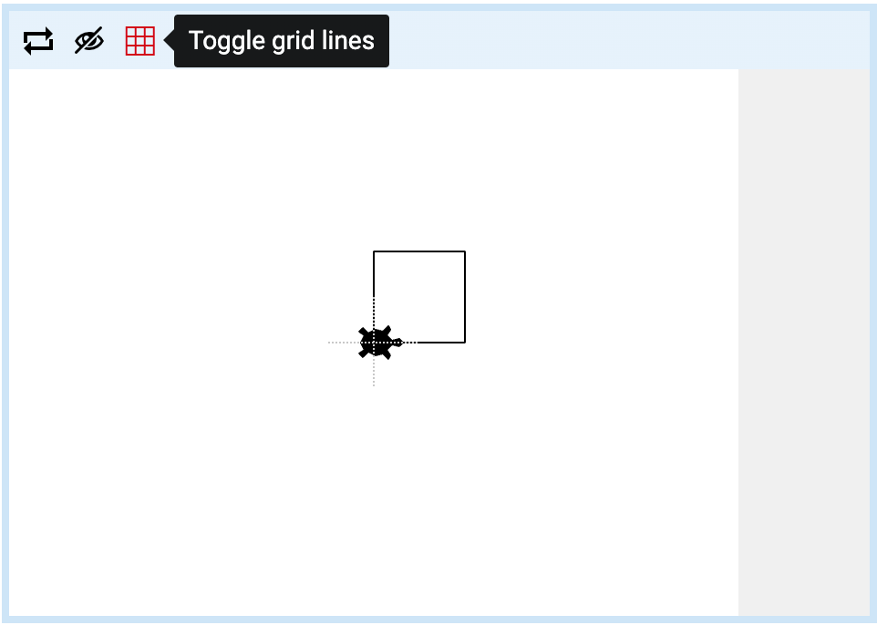


Your job is to make a turtle program which makes the turtle do the same thing.

> 你的工作是编写一个乌龟程序，让乌龟做同样的事情。

Build your program in the editor over on the right, like last time, using the code blocks available. Make sure to 'Mark' and 'Submit' it to get your green diamond when it is finished!

> 在右边的编辑器中构建程序，就像上次一样，使用可用的代码块。确保“标记”和“提交”它得到你的绿钻石，当它完成!

### 9.1 Hint

> 提示

You might need to turn on the 'grid' in the animation above, and do some experimenting (use the 'Run' button to test your own turtle program) to figure out how many steps the turtle is walking in the animation. Note that each square in the grid is 50 x 50 turtle steps. Good luck!

> 你可能需要打开上面动画中的“网格”，并做一些实验(使用“运行”按钮来测试你自己的乌龟程序)，以计算出乌龟在动画中走了多少步。注意，网格中的每个方格都是50 x 50个海龟步长。好运！

### 9.2 Code

::: tabs

@tab 积木块

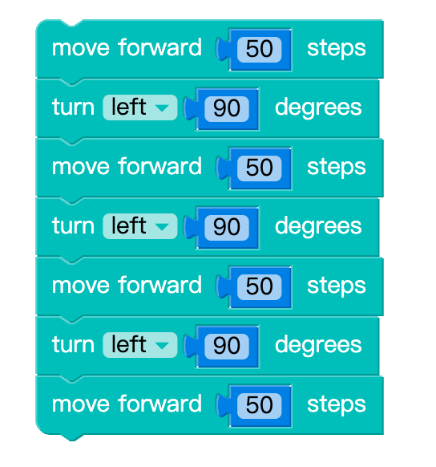

@tab Python

```python
from turtle import *


forward(50)
left(90)
forward(50)
left(90)
forward(50)
left(90)
forward(50)
```

:::

## 10. Thunderstruck

> 吓坏了的

Time to try another one! Here's another turtle program animation:

> 是时候尝试另一个了!这是另一个海龟程序动画:

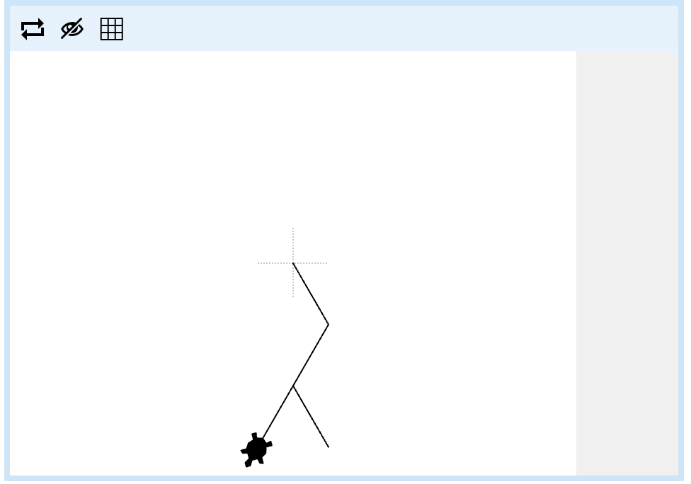

Try to build a program that makes your turtle draw the same "lightning-bolt" pattern - *zappy*!

> 试着构建一个程序，让你的乌龟画出同样的“闪电”图案——zappy!

### 10.1 Hint

The lines in the pattern are 50 turtle steps long and the angles are 60 degrees. Note that in the turn block, you can select between left and right by using the drop-down box.

> 图案中的线条有50个海龟步长，角度是60度。注意，在转弯块中，您可以使用下拉框在左和右之间进行选择。

### 10.2 Multiple Ways to Drive a Turtle

> 驾驶乌龟的多种方法

Once the deadline for this worksheet passes, you will have access to sample solutions to the problem via the Solutions tab at the top of the worksheet. Your code and the sample solutions should be logically equivalent, but as the problems get harder there will be a greater range of possible ways to solve the same problem. You can learn a lot from looking over the solutions in detail and analysing the approach used and also the coding style. There is usually not just one correct answer, but there are certainly more elegant/direct ways to solve the same problem.

> 一旦此工作表的截止日期过后，您将可以通过工作表顶部的“解决方案”选项卡访问问题的示例解决方案。您的代码和示例解决方案在逻辑上应该是等价的，但是随着问题变得越来越难，解决同一问题的可能方法的范围将会越来越大。通过详细查看解决方案，分析所使用的方法和编码风格，您可以学到很多东西。通常不会只有一个正确答案，但肯定有更优雅/直接的方法来解决同样的问题。

### 10.3 Code

::: tabs

@tab 积木块

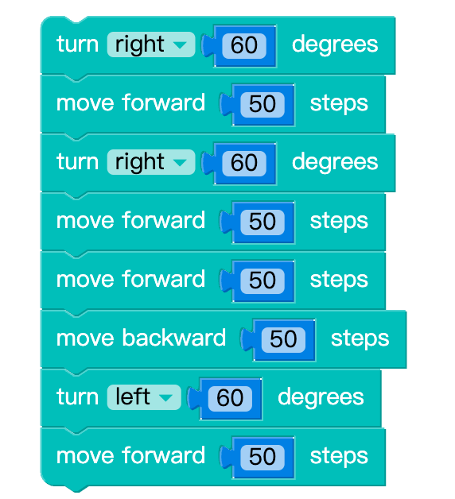

@tab Python

```python
from turtle import *


right(60)
forward(50)
right(60)
forward(50)
forward(50)
backward(50)
left(60)
forward(50)
```

:::

## 11. Don't repeat yourself

> 不要重复自己的话

The turtle programs you just built draw small, simple shapes and patterns. But things are starting to get long and repetitive. You can see that if the next task was to draw a hexagon or an [icosagon](https://en.wikipedia.org/wiki/Icosagon) instead of a square, our programs would start to get very long and tediously repetitive.

> 刚才构建的turtle程序可以绘制小而简单的形状和图案。但事情开始变得冗长和重复。您可以看到，如果下一个任务是画一个六边形或二十边形，而不是一个正方形，我们的程序将开始变得非常冗长和乏味的重复。

Sometimes the programs you write will be long, but they should *never* be tedious. If you find you are writing the same sequence of statements more than once in a program, it's time to rethink things.

> 有时你写的程序会很长，但不应该太冗长。如果您发现在一个程序中不止一次地编写了相同的语句序列，那么是时候重新考虑一下了。

Before we can rethink things, we'll need a new programming concept: **repetition**.

> 在重新思考之前，我们需要一个新的编程概念:重复。

In situations like these, we'd like a way to connect statements in something other than a straight line. It would be good if we could make a sequence of statements 'loop' back on itself, so that the same statements happen over and over again, until we are ready to move on.

> 在这种情况下，我们需要一种方法来连接语句，而不是一条直线。如果我们能让语句序列“循环”回它自己，那么同样的语句就会一遍又一遍地发生，直到我们准备好继续前进。

**Loops** are a tool available in programming languages for doing just that. We will see how to use them in Blockly on the next slide.

> 循环是编程语言中可用来完成这一任务的工具。我们将在下一张幻灯片中看到如何在Blockly中使用它们。

### 11.1 Control flow

> 控制流

**Repetition** (repeating a sequence of statements by making a 'loop') is a form of **control flow**: you are *controlling* the *flow* of your program.

> **重复**(通过“循环”来重复语句序列)是**控制流的一种形式:您正在**控制程序的**流。

**Sequence** (following one statement after another, in order) is another form of control flow. Actually, it's the simplest flow you can have.

> 序列**(按顺序在一条语句后面跟着另一条语句)是另一种形式的控制流。实际上，这是最简单的流程。

In a few slides we will meet another form of control flow: **branching**. After that, we will learn about one final form: **abstraction**.

> 在几张幻灯片中，我们将遇到另一种形式的控制流:**分支**。在此之后，我们将学习最后一种形式:**抽象。

::: tabs

@tab blockly

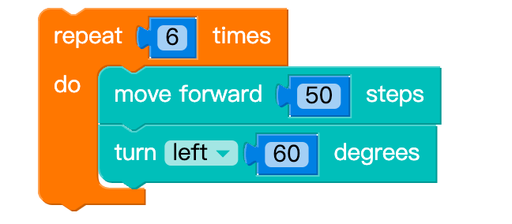

@tab Python

```python
from turtle import *


for count in range(6):
  forward(50)
  left(60)
```

:::

## 12. A bit loopy

> 有点疯狂

Here's a program which uses a **loop statement** (or just **loop**):

> 下面是一个使用循环语句(或者只是循环)的程序:

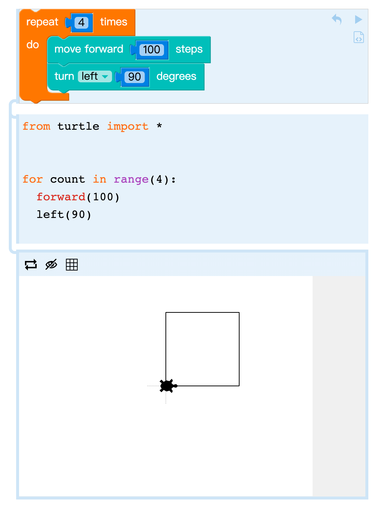


```python
from turtle import *


for count in range(4):
    forward(100)
    left(90)
```

This program draws a square similar to the one from a previous exercise. Press play to see the turtle do its thing. Can you guess how the program works?

> 这个程序绘制了一个类似于前面练习的正方形。按下播放键，看乌龟做它的事情。你能猜到这个程序是如何工作的吗?

This program is made up of one statement that is 3 blocks long. These three blocks are an example of a **compound statement**.

> 这个程序由一个3块长的语句组成。这三个块是复合语句的一个例子。

This repeat block is different from the blocks we have seen so far, because it contains a sequence of blocks *inside* itself. We say the blue blocks are *inside* the loop. This group of two "inside" blocks forms its own *block* of statements.

> 这个repeat块与我们迄今为止看到的块不同，因为它本身包含一个块序列。我们说蓝色的方块在循环内。这组由两个“内部”块组成的语句块。

Here's how the program flows:

> 下面是程序的流程:

The first block in this program is the loop: repeat 4 times so that's where the program starts. To follow this block, the turtle has to follow the sequence of blocks inside it (after do): move forward 100 steps and then turn left 90 degrees. When it gets to the end of that sequence, it has to repeat the sequence again until it has gone 'through the loop' like this 4 times.

> 这个程序的第一个块是循环:重复4次，这样程序就开始了。为了跟上这个方块，海龟必须按照里面方块的顺序前进(在do之后):向前走100步，然后向左转90度。当它到达序列的末尾时，它必须再次重复该序列，直到它像这样“通过循环”4次。

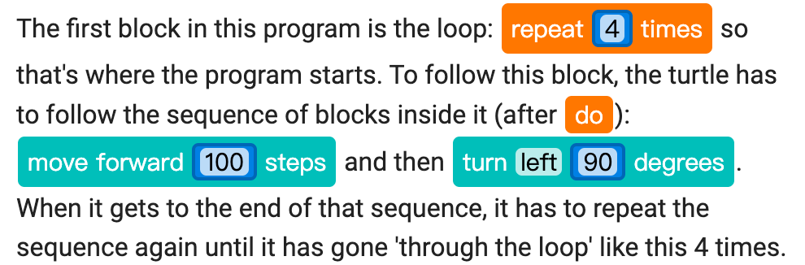

On the next slide, you'll have a chance to build a loop of your own.

> 在下一张幻灯片中，你将有机会建立一个自己的循环。

### 12.1 Code

::: tabs

@tab 积木块

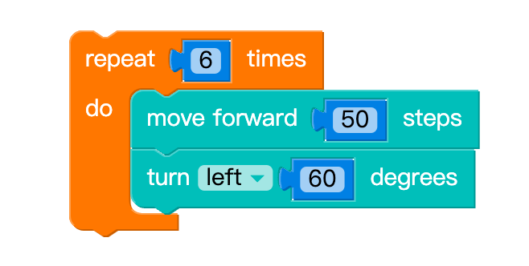

@tab Python

```python
from turtle import *


for count in range(6):
    forward(50)
    left(60)
```

:::

## 13. Your turn!

Now it's your turn to build a program using a loop. It will be very similar to the previous example, but this time, we want the turtle to draw a *hexagon*, like this:

> 现在轮到您使用循环构建程序了。它将非常类似于前面的例子，但这一次，我们想让海龟画一个六边形，像这样:

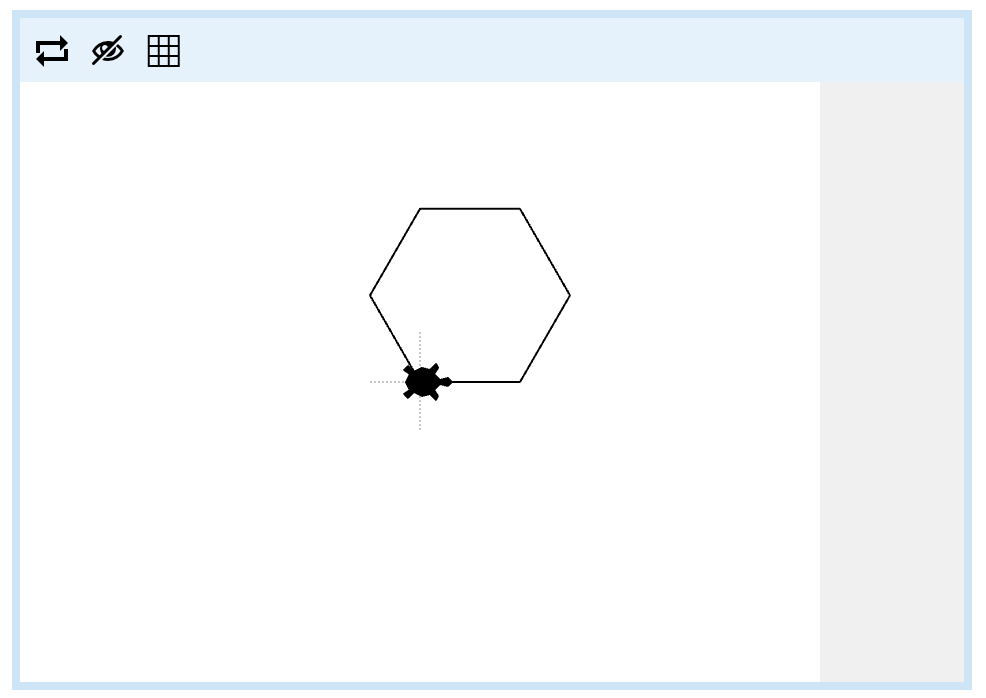

Build your program in the editor over on the right, like last time, and make sure to 'Mark' and 'Submit' it to get your green diamond when it is finished!

> 像上次一样，在右边的编辑器中构建你的程序，并确保在完成时“标记”和“提交”它，以获得你的绿钻石!

### 13.1 Hint

The edges of this hexagon are 50 turtle steps long, but you'll have to figure out what angle to turn by yourself. You could figure it out mathematically, or you could guess and experiment using the 'Run' button to test your own animation. Good luck!

> 这个六边形的边长是50个海龟步长，但你得自己算出转弯的角度。你可以用数学方法计算出来，也可以用“运行”按钮来测试你自己的动画。好运！

### 13.2 Blockly categories

> 块类别

The blockly editor for this problem contains two **categories** of code blocks. The blocks we use to control the turtle appear when you click on the "Turtle" tab, while the new loop block will be under the "Loops" tab. We will see a few new categories as we move through the worksheet: feel free to look at all the available blocks to find the one you want to use.

> 这个问题的块编辑器包含两类代码块。当你点击“turtle”选项卡时，我们用来控制海龟的块就会出现，而新的循环块将在“Loops”选项卡下。当我们浏览工作表时，我们将看到一些新的类别:请随意查看所有可用的块，以找到您想要使用的一个。

### 13.3 Code

::: tabs

@tab 积木块

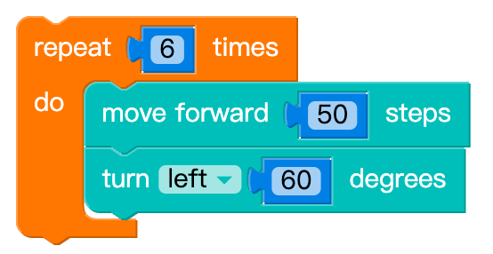

@tab Python

```python
from turtle import *


for count in range(6):
    forward(50)
    left(60)
```

:::

## 14. Loop-the-loop

> 翻车特技

A loop can be part of a sequence of blocks itself (it can even be "nested" with another loop, but we'll get to that).

> 循环本身可以是区块序列的一部分(它甚至可以与另一个循环“嵌套”，但我们会讲到)。

The following is an example of this:

> 下面是一个例子:

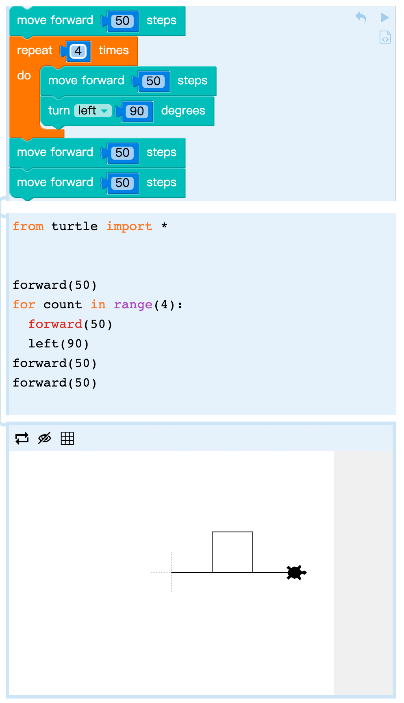

```python
from turtle import *


forward(50)
for count in range(4):
    forward(50)
    left(90)
forward(50)
forward(50)
```

Before you press play, read the following, and then try to follow the code to predict exactly what shape the turtle will trace.

> 在按下播放键之前，请阅读以下内容，然后尝试按照代码来准确预测海龟将跟踪的形状。

This program is made from four statements, or groups of blocks:

> 这个程序由四个语句或块组组成:

::: tabs

@tab 文本

1. a move forward 50 steps command

> 向前移动50步的命令

2. the loop, repeat 4 times, which contains two code blocks on the inside

> 循环重复4次，其中包含两个代码块

3. another move forward 50 steps command

> 再向前移动50步命令

4. another move forward 50 steps command

> 再向前移动50步命令

@tab 图片

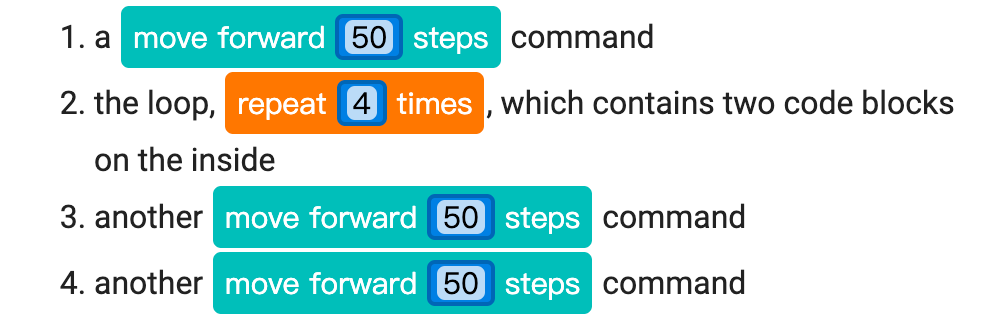

:::

The turtle will progress through the first block before it gets to the loop. It then repeats the two blocks inside the loop, four times. Then it goes back to run the two blocks after the loop, in sequence.

> 海龟将在进入循环之前通过第一个块。然后它重复循环中的两个块，共四次。然后，在循环之后，它返回按顺序运行两个块。

Can you predict what pattern the turtle will draw?

> 你能预测乌龟会画什么图案吗?

### 14.1 Code

::: tabs

@tab 积木块

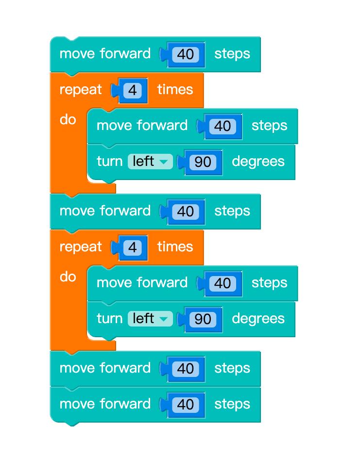

@tab Python

```python
from turtle import *


forward(40)
for count in range(4):
    forward(40)
    left(90)
forward(40)
for count2 in range(4):
    forward(40)
    left(90)
forward(40)
forward(40)
```

:::

## 15. Loop-the-loop-the-loop

Can you write a turtle program to execute a double loop-the-loop? It should look like this:

> 你能写一个 turtle 程序来执行双循环吗?它应该是这样的:

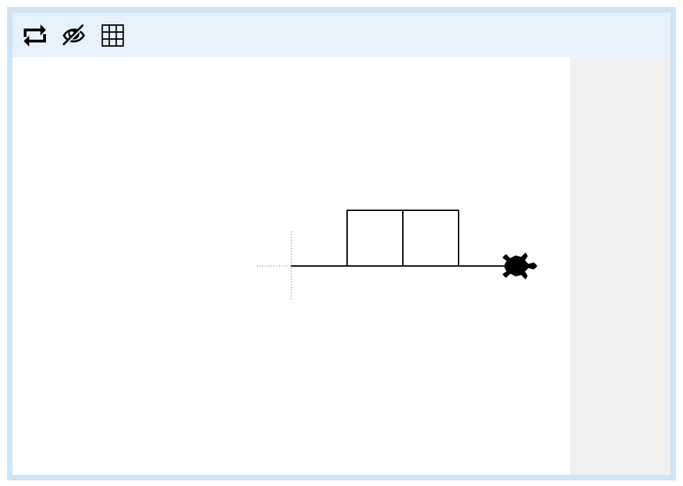

The edges of the loops, and the lines before and after both loops, are all 40 turtle steps long.

> 循环的边缘，以及循环前后的线条，都有40个海龟步长。

### 15.1 Hint

Try writing out pseudocode first before launching into the code, and work out which steps to "loop" over. There should be two separate loops.

> 在开始编写代码之前先尝试编写伪代码，并确定要“循环”哪些步骤。应该有两个独立的循环。

::: tabs

@tab 积木块

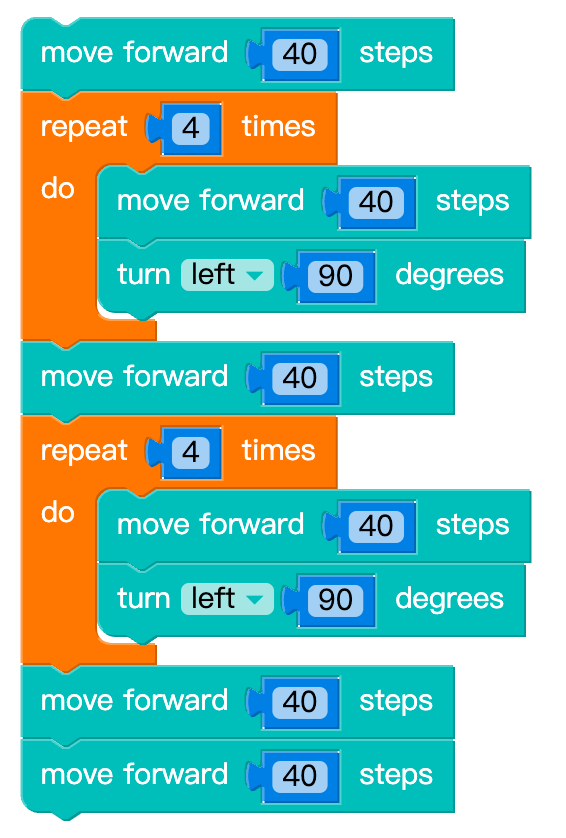

@tab Python

```python
from turtle import *


forward(40)
for count in range(4):
    forward(40)
    left(90)
forward(40)
for count2 in range(4):
    forward(40)
    left(90)
forward(40)
forward(40)
```

:::

## 16. All kinds of loops

> 各种循环

The previous slides introduced a basic type of loop, where the number of times around the loop (the number of '**iterations**', as a programmer would call them) was fixed. The loop repeated its inner statements the number of times you decided when you built the program.

> 前面的幻灯片介绍了一种基本的循环类型，其中循环的次数(程序员称之为“迭代”的次数)是固定的。循环重复内部语句的次数是您在构建程序时决定的次数。

This is one of the simplest types of loop to use in a program. It's called a `for` loop. You'll see the word `for` if you look at the Python code translation of the following Blocky program (by clicking the "Toggle blocks" button in the top right).

> 这是在程序中使用的最简单的循环类型之一。它叫做for循环。如果您查看以下Blocky程序的Python代码翻译(通过单击右上方的“Toggle blocks”按钮)，您将看到for这个词。

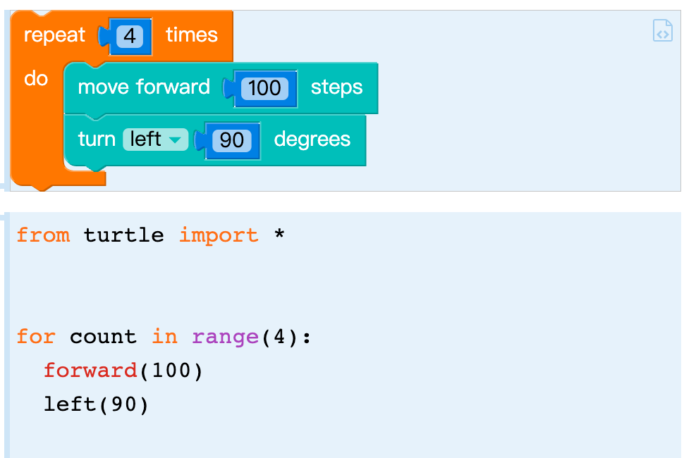

```python
from turtle import *


for count in range(4):
    forward(100)
    left(90)
```

These `for` loops are not the only type of loops! We will see some more loops in the future, including:

> 这些for循环并不是循环的唯一类型!我们将在未来看到更多的循环，包括:

- Loops that 'iterate' through a large body of data, such as the rows of a spreadsheet, where you don't know how many rows there are ahead of time. They would perform the same instructions on each row, one at a time. And if you give them more data, they will go through the loop more times.

> 在大量数据中“迭代”的循环，比如电子表格中的行，你事先不知道有多少行。它们会对每一行执行相同的指令，一次执行一条。如果你给他们更多的数据，他们就会经历更多的循环。

- Loops that go around and around until they achieve some kind of goal. Maybe nobody knows beforehand how many 'iterations' they will take to finish their job; they will just keep looping until the goal is completed.

> 循环循环，直到它们达到某种目标。也许没有人事先知道他们需要多少次“迭代”才能完成他们的工作;它们将继续循环，直到目标完成。

- And finally, there are **infinite loops**. As their name suggests, these loops iterate **forever** ...

> 最后，还有无限循环。顾名思义，这些循环永远迭代……

The only way to stop an infinite loop is to 'kill' the program (for example, while your programs are running on Grok, you can press the big red 'Stop' button to kill them).

> 停止无限循环的唯一方法是“杀死”程序(例如，当你的程序在Grok上运行时，你可以按下红色的“停止”按钮来杀死它们)。

### 16.1 Who would make an infinite loop?

> 谁会做一个无限循环?

Sometimes infinite loops are accidental. They might happen if you accidentally make a program that loops until an impossible condition is met ... i.e. never! So the loop will just keep looping forever.

> 有时无限循环是偶然的。如果你不小心编写了一个循环直到满足不可能条件的程序，就可能发生这种情况……即从来没有!所以循环会一直循环下去。

But sometimes infinite loops are useful, and created on purpose. For example, web servers and computer games are often built on top of an infinite loop that waits for something to happen, and responds accordingly, each time the loop goes around.

> 但有时无限循环是有用的，而且是有意为之。例如，网络服务器和电脑游戏通常建立在一个等待某事发生的无限循环之上，并在每次循环中做出相应的响应。

::: tabs

@tab 积木块

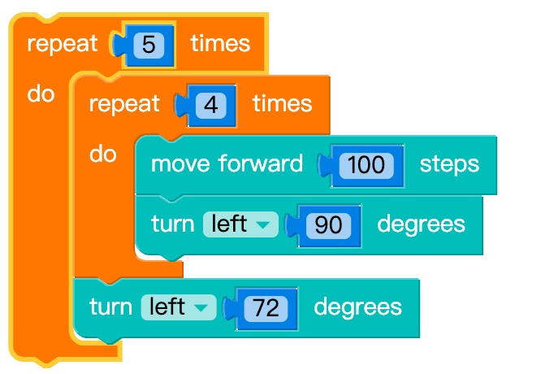

@tab Python

```python
from turtle import *


for count2 in range(5):
    for count in range(4):
        forward(100)
        left(90)
    left(72)
```

:::

## 17. Don't repeat yourself

> 不要重复自己的话

What did your solution to the loop-the-loop-the-loop problem look like? Did it use two repeat blocks in sequence with some other statements?

> 你是怎么解决这个一圈一圈一圈的问题的?它是否按顺序使用了两个重复块和其他语句?

If so, then you may have noticed that the two loops were very similar. This means your program still has some repetition.

> 如果是这样，那么您可能已经注意到这两个循环非常相似。这意味着你的程序仍然有一些重复。

Using two loops is better than using no loops: imagine writing out all of those turtle commands individually! But if you are ever using the same series of blocks twice, then there's probably a way to save some space and time somehow.

> 使用两个循环比不使用循环要好:想象一下分别写出所有这些turtle命令!但如果你曾经两次使用相同系列的块，那么可能有一种方法以某种方式节省一些空间和时间。

In this case, the repeat blocks were getting repetitive, so ... why not repeat the repeat blocks themselves? Let's see how on the next slide.

> 在这种情况下，重复块变得重复，所以……为什么不重复repeat块本身呢?让我们看看下一张幻灯片。

::: tabs

@tab 积木块

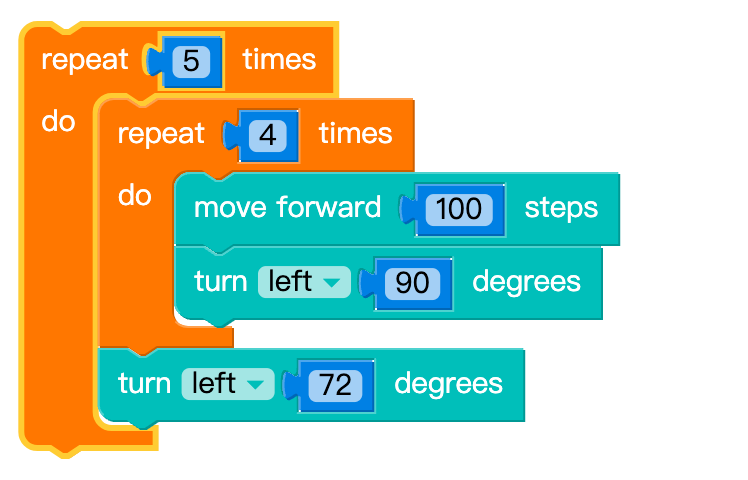

@tab Python

```python
from turtle import *


for count2 in range(5):
    for count in range(4):
        forward(100)
        left(90)
    left(72)
```

:::

## 18. Blocks inside blocks

> 块中的块

Have a look at this turtle program. It's similar to the loop-the-loop-the-loop code, but it draws triangles instead of squares:

> 看看这个海龟程序。它类似于loop-the-loop-the-loop代码，但它画的是三角形而不是正方形:

```python
from turtle import *

for count in range(3):
    forward(50)
    left(120)
forward(50)
for count2 in range(3):
    forward(50)
    left(120)
forward(50)
```

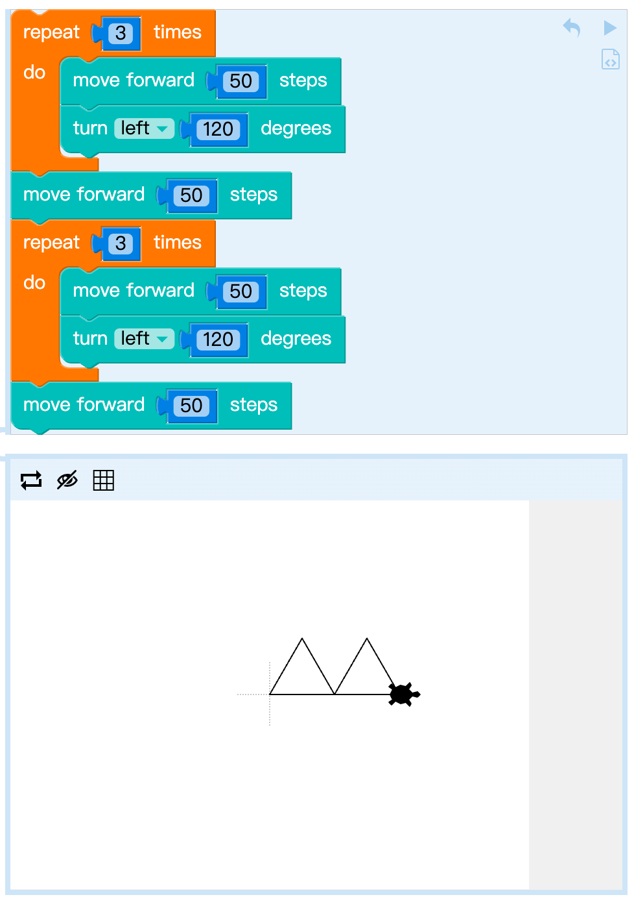

Notice that the first two statements are the same as the last two statements? Maybe we can just *repeat* those two blocks using another `for` loop, instead of having to write them out twice:

> 注意到前两个表述和后两个表述是一样的吗?也许我们可以使用另一个for循环来重复这两个块，而不必写出两次:

```python
from turtle import *

for count2 in range(2):
    for count in range(3):
        forward(50)
        left(120)
    forward(50)
```

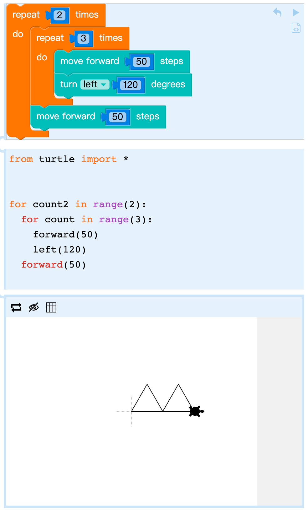

Notice that we can put a repeat block inside another repeat block without too much trouble. Blockly clearly displays which blocks are inside loops.

> 请注意，我们可以将一个重复块放在另一个重复块中，而不太麻烦。Blockly清楚地显示哪些块在循环中。

In this way, we can put compound statements (like loops) inside other compound statements. Putting these blocks inside other blocks is called **nesting** the statements. This program shows an example of a **nested loop**.

> 通过这种方式，我们可以将复合语句(如循环)放在其他复合语句中。将这些块放在其他块中称为嵌套语句。这个程序展示了一个嵌套循环的例子。

Press 'play' to verify that both programs achieve the same result. Then, read on for an explanation of what's happening here:

> 按“播放”键来验证两个程序实现相同的结果。然后，继续往下读，看看这里发生了什么:

- The shorter program is a one-statement program: that statement is a loop (starting with repeat 2 times) with two statements inside. The 2 means these statements will be run twice.

> 较短的程序是一个单语句程序:该语句是一个循环(从repeat 2次开始)，其中有两个语句。2意味着这些语句将运行两次。

- The first statement on the inside is another loop (starting with repeat 3 times). It has two statements inside, and it runs through them 3 times.

> 内部的第一个语句是另一个循环(从repeat 3次开始)。它里面有两个语句，它遍历了它们3次。

- Because of the outside loop, we will run through the inside loop twice. That means the statements on the inside will happen a total of 6 times!

> 由于外部循环，我们将运行两次内部循环。这意味着里面的语句总共会出现6次!

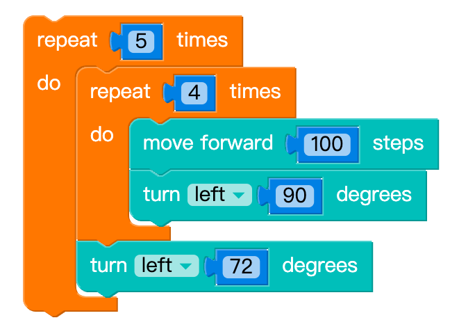

```python
from turtle import *

for count2 in range(5):
    for count in range(4):
        forward(100)
        left(90)
    left(72)
```

## 19. Flower power

> 花力量

For your final loop challenge, write a program that uses a **nested loop** to draw the following pattern:

> 对于你的最后一个循环挑战，写一个使用嵌套循环的程序来绘制以下模式:

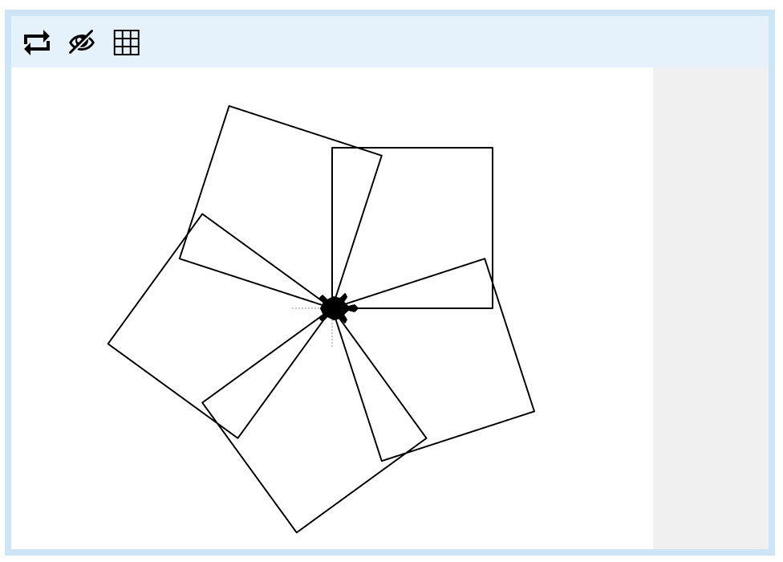

Good luck!

### 19.1 Hint:

The sides of each square flower petal are 100 turtle steps long. Between drawing each petal, the turtle turns 72 degrees.

> 每个方形花瓣的侧面有100个海龟步长。在画每一片花瓣之间，乌龟转了72度。

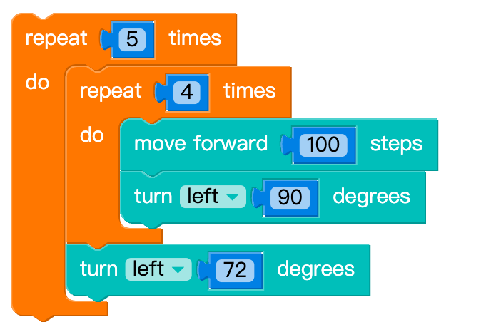

```python
from turtle import *

for count2 in range(5):
    for count in range(4):
        forward(100)
        left(90)
    left(72)
```


## 20. Dynamic programming

> 动态规划

Okay, so far we've learned to control our program so that it flows in straight lines (sequence) and loops (repetition). With these tools, we can make some pretty patterns without many statements. For example, try running the following program:

> 好的，到目前为止，我们已经学会了如何控制我们的程序，使它以直线(序列)和循环(重复)流动。使用这些工具，我们可以在没有太多语句的情况下创建一些漂亮的模式。例如，尝试运行以下程序:

```python
from turtle import *

for count in range(6):
    forward(100)
    left(45)
    forward(50)
    backward(50)
    right(90)
    forward(50)
    backward(50)
    left(45)
    backward(100)
    right(60)
```

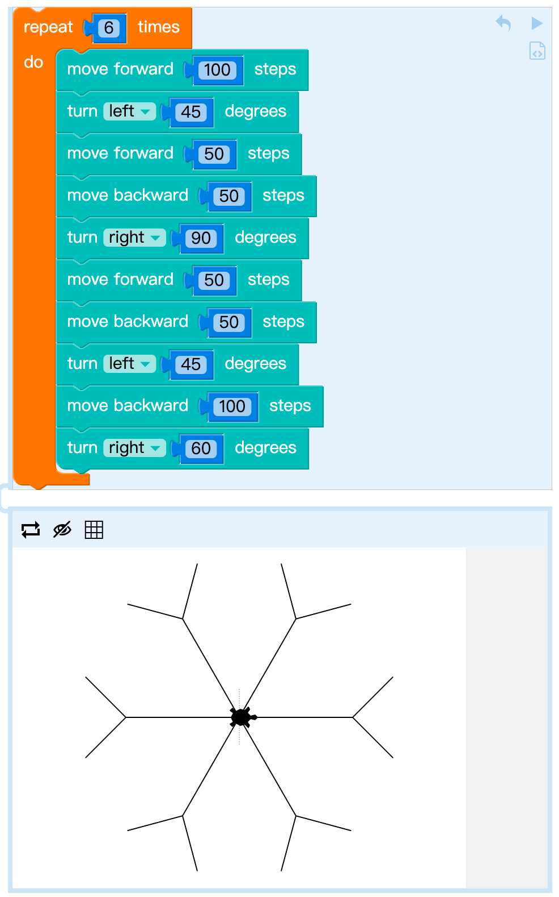

However, every program we have written so far is, in a way, boring. That's because they will always do the same thing every time we press play.

> 然而，到目前为止，我们写的每一个程序在某种程度上都很无聊。这是因为每次我们按下播放键，它们都会做同样的事情。

In order for a program to do something different each time it is run, we will need two things:

> 为了让程序在每次运行时都做一些不同的事情，我们需要两个东西:

Firstly, we will need a mechanism for our programs to run different blocks of code in different circumstances. This is a control flow concept called **branching**, where the code which is executed can change each time our program is run depending on certain conditions.

> 首先，我们需要一种机制，让我们的程序在不同的情况下运行不同的代码块。这是一个称为分支的控制流概念，其中所执行的代码可以在每次程序运行时根据特定条件进行更改。

Secondly, we need a way to write those conditions, so that we can make decisions about which blocks of code should be run in different circumstances. So, what should we base these decisions off? Perhaps the turtle should turn left if the time is before 12pm and right in the afternoon? That would be boring though: a more interesting way to make decisions is by **asking the user** for their input. What do they want our program to do? We will learn how to ask them in the next slide.

> 其次，我们需要一种方法来编写这些条件，这样我们就可以决定哪些代码块应该在不同的情况下运行。那么，我们应该根据什么来做这些决定呢?如果时间在中午12点之前，乌龟应该向左拐，而在下午向右拐?但这可能会很无聊:更有趣的决策方式是**询问用户**的输入。他们想让我们的程序做什么?下一张幻灯片我们将学习如何问他们。

## 21. User or programmer?

> 用户还是程序员?

A **user** is the person who uses the program which is written by the **programmer**. A user has no access to or knowledge of the program's code. In this case, you are the programmer and the user, because you are testing the programs you have constructed. Try giving one of your programs to a friend so that they can try it as a proper "user" and let you know if it works as they would expect it to!

> 用户是使用程序员编写的程序的人。用户无法访问或了解程序的代码。在这种情况下，您既是程序员又是用户，因为您正在测试您构建的程序。试着把你的一个程序给一个朋友，这样他们就可以作为一个合适的“用户”来尝试，并让你知道它是否像他们期望的那样工作!


::: details 公众号：AI悦创【二维码】


:::

::: info AI悦创·编程一对一

AI悦创·推出辅导班啦，包括「Python 语言辅导班、C++ 辅导班、java 辅导班、算法/数据结构辅导班、少儿编程、pygame 游戏开发、Web、Linux」，全部都是一对一教学：一对一辅导 + 一对一答疑 + 布置作业 + 项目实践等。当然，还有线下线上摄影课程、Photoshop、Premiere 一对一教学、QQ、微信在线，随时响应！微信：Jiabcdefh

C++ 信息奥赛题解，长期更新！长期招收一对一中小学信息奥赛集训，莆田、厦门地区有机会线下上门，其他地区线上。微信：Jiabcdefh

方法一：[QQ](http://wpa.qq.com/msgrd?v=3&uin=1432803776&site=qq&menu=yes)

方法二：微信：Jiabcdefh

:::


