## 1.  Your first green diamond「turtle」

It's time to earn your first green diamond for this worksheet. This one will not be so tricky; it's just to get you familiar with Grok and the submission process. Simply follow these steps to complete the problem:

1. Drag and drop one of the 'Move forward 20 steps' blocks onto the empty workspace to the right of it. Anywhere in the white space will do.

2. Notice your instruction 'block' has just been translated into some Python code in the 'Code' tab below. In the next worksheet we'll be writing that code ourselves, but for now you can use the blocks to construct your program.

3. To run this program we've created and see what it does, hit the 'Run' button in the top right corner of the window.

4. Watch the 'Animation' tab below the program. You should see the turtle start in the middle of the screen, facing right. It should move 20 'turtle steps' to the right (the direction it is facing). It should leave a short black line behind it.

5. When you are ready, it's time to submit your program and get your first green diamond. Up near the 'Run' button, you will also see a 'Mark' button. Press this button now, and then press 'Submit' to check your answer.

    Note: if the 'Mark' button is not clickable, make sure you 'Run' your program first.

Uh oh ... your program didn't pass the tests! Sorry, that was a cunning trick on our part. The program is not finished just yet: there's one more step to complete. You should have seen some feedback telling you where your answer needs work. Also, your diamond for this problem will now be orange.

Luckily, in Grok **you can always submit as many times as you like**, until you pass all the tests and turn that diamond green! Here's the final step:

1. Change the number of steps the turtle walks inside the instruction block from 20 to 100.

Now, submit again ('Run' then 'Mark' and 'Submit'), and you'll get the green diamond this time, promise!

### Solution 1

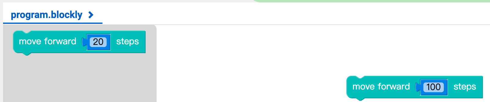

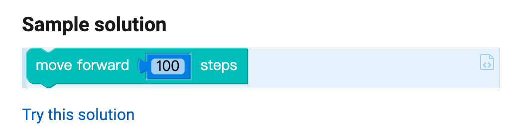

```python
from turtle import *


forward(100)
```

## 2. Your turn!「turtle」

Now it's your turn to build a program!

Here's an animation of a turtle robot following a hidden program:

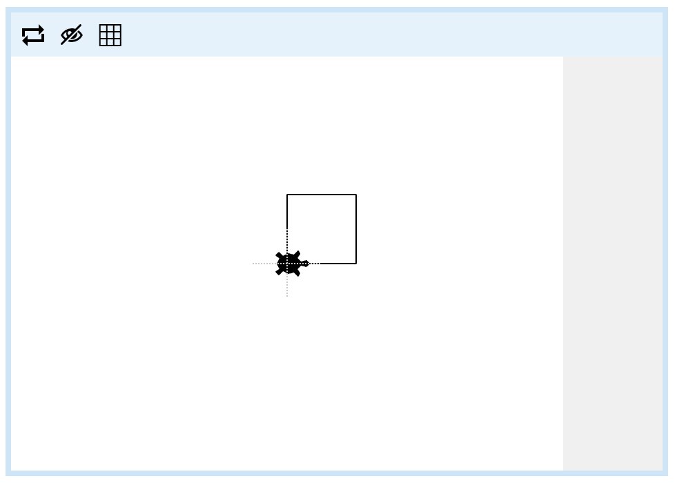

Your job is to make a turtle program which makes the turtle do the same thing.

Build your program in the editor over on the right, like last time, using the code blocks available. Make sure to 'Mark' and 'Submit' it to get your green diamond when it is finished!

### Hint

You might need to turn on the 'grid' in the animation above, and do some experimenting (use the 'Run' button to test your own turtle program) to figure out how many steps the turtle is walking in the animation. Note that each square in the grid is 50 x 50 turtle steps. Good luck!

### Solution 2

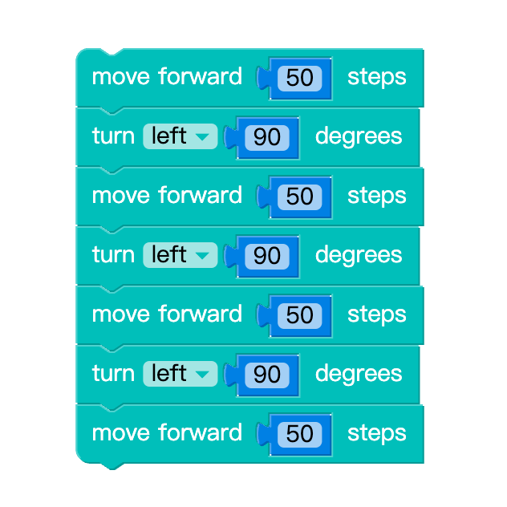

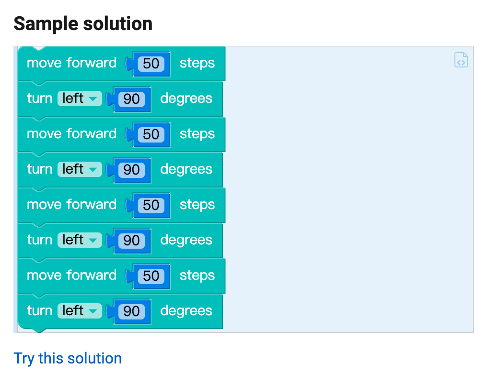

```python
from turtle import *


forward(50)
left(90)
forward(50)
left(90)
forward(50)
left(90)
forward(50)
left(90)
```

## 3. Thunderstruck「turtle」

Time to try another one! Here's another turtle program animation:

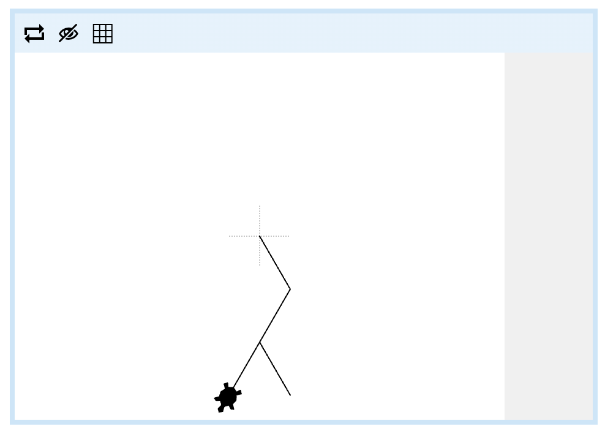

Try to build a program that makes your turtle draw the same "lightning-bolt" pattern - *zappy*!

### Hint

The lines in the pattern are 50 turtle steps long and the angles are 60 degrees. Note that in the turn block, you can select between left and right by using the drop-down box.

### Multiple Ways to Drive a Turtle

Once the deadline for this worksheet passes, you will have access to sample solutions to the problem via the Solutions tab at the top of the worksheet. Your code and the sample solutions should be logically equivalent, but as the problems get harder there will be a greater range of possible ways to solve the same problem. You can learn a lot from looking over the solutions in detail and analysing the approach used and also the coding style. There is usually not just one correct answer, but there are certainly more elegant/direct ways to solve the same problem.

### Solution 3

What's different about solution 2?

Is solution 3 shorter? Compared to the original animation, the turtle finishes at a different place, but this might not matter to us as long as it draws the right shape?

#### Sample solution #1

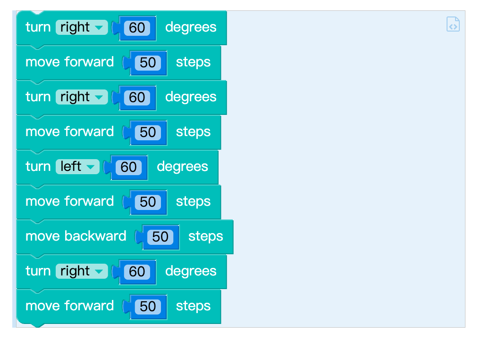

```python
from turtle import *


right(60)
forward(50)
right(60)
forward(50)
left(60)
forward(50)
backward(50)
right(60)
forward(50)
```

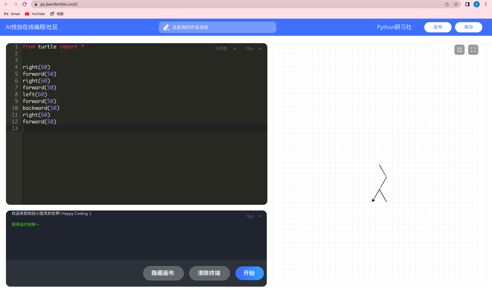

#### Sample solution #2

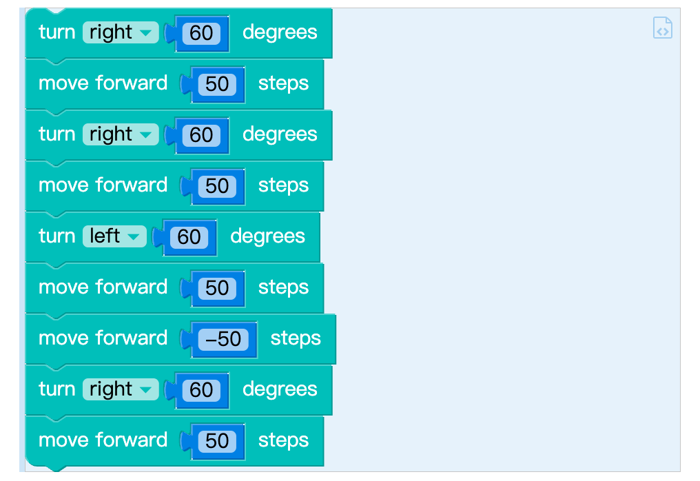

```python
from turtle import *


right(60)
forward(50)
right(60)
forward(50)
left(60)
forward(50)
forward(-50)
right(60)
forward(50)
```

#### Sample solution #3

```python
from turtle import *


right(60)
forward(50)
right(60)
forward(100)
backward(50)
left(60)
forward(50)
```

## 4. Your turn!「turtle」

Now it's your turn to build a program using a loop. It will be very similar to the previous example, but this time, we want the turtle to draw a *hexagon*, like this:

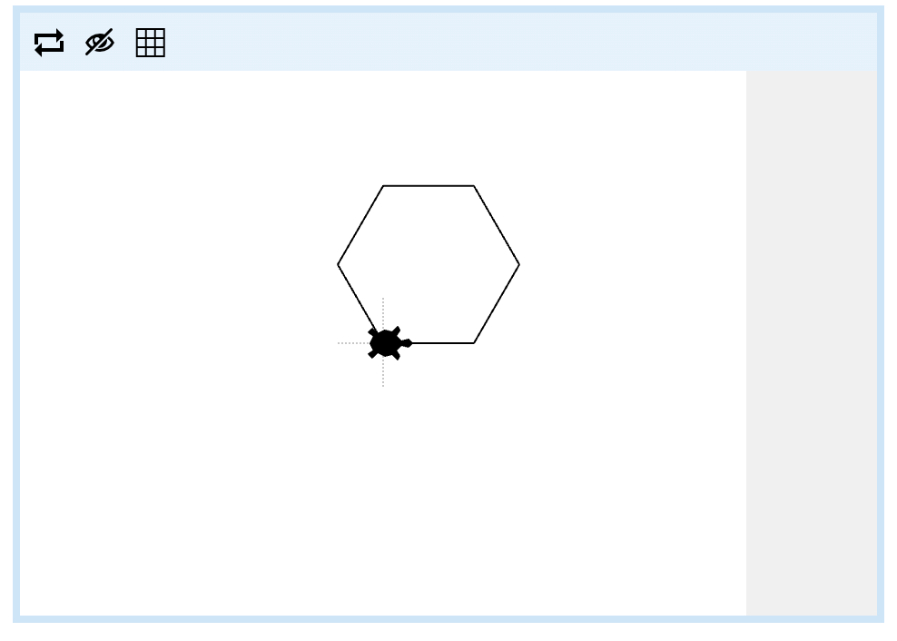

Build your program in the editor over on the right, like last time, and make sure to 'Mark' and 'Submit' it to get your green diamond when it is finished!

### Hint

The edges of this hexagon are 50 turtle steps long, but you'll have to figure out what angle to turn by yourself. You could figure it out mathematically, or you could guess and experiment using the 'Run' button to test your own animation. Good luck!

### Blockly categories

The blockly editor for this problem contains two **categories** of code blocks. The blocks we use to control the turtle appear when you click on the "Turtle" tab, while the new loop block will be under the "Loops" tab. We will see a few new categories as we move through the worksheet: feel free to look at all the available blocks to find the one you want to use.

### Solution 4

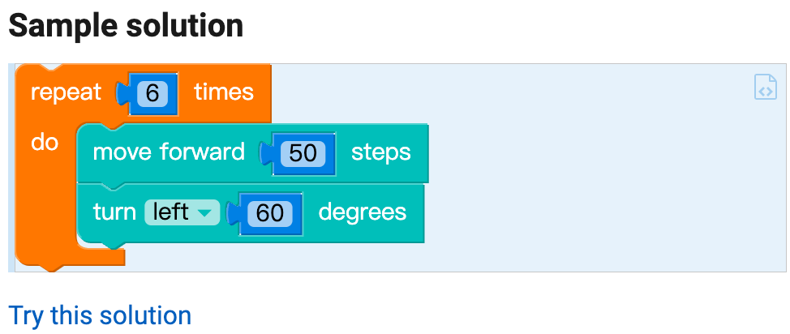


```python
from turtle import *


for count in range(6):
  forward(50)
  left(60)
```

## 5. Loop-the-loop-the-loop「turtle」

Can you write a turtle program to execute a double loop-the-loop? It should look like this:

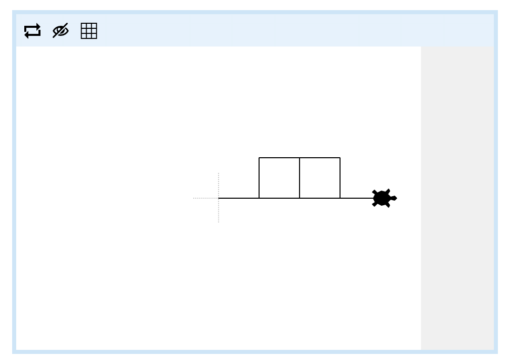

The edges of the loops, and the lines before and after both loops, are all 40 turtle steps long.

### Hint

Try writing out pseudocode first before launching into the code, and work out which steps to "loop" over. There should be two separate loops.

### Solution 5

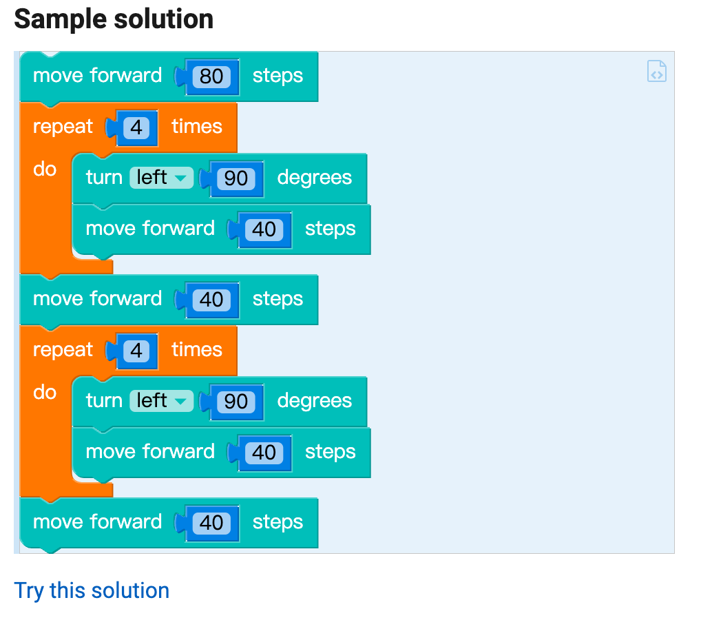

```python
from turtle import *


forward(80)
for count in range(4):
  left(90)
  forward(40)
forward(40)
for count2 in range(4):
  left(90)
  forward(40)
forward(40)
```

## 6.  Flower power「turtle」

For your final loop challenge, write a program that uses a **nested loop** to draw the following pattern:

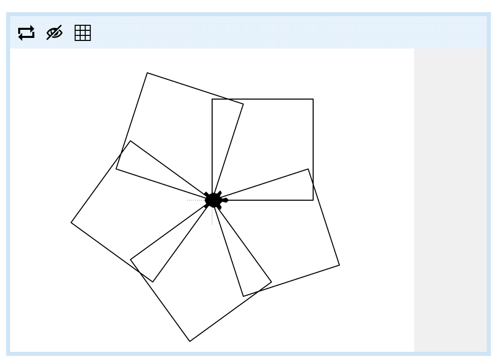

Good luck!

### Hint

The sides of each square flower petal are 100 turtle steps long. Between drawing each petal, the turtle turns 72 degrees.

### Solution 6

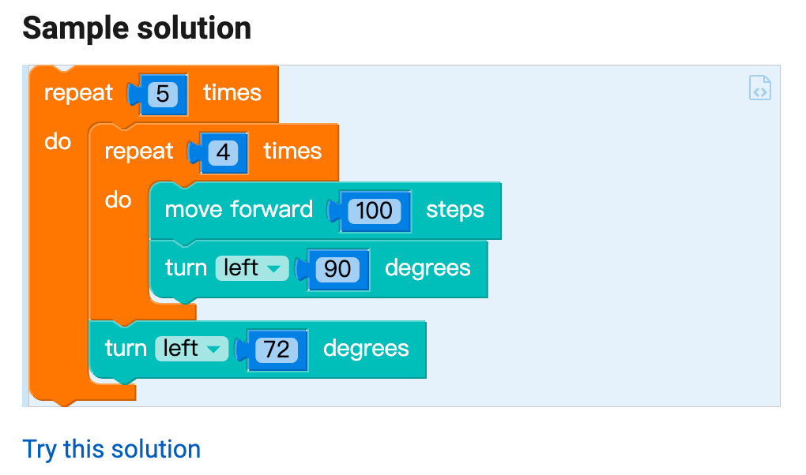

```python
from turtle import *


for count2 in range(5):
  for count in range(4):
    forward(100)
    left(90)
  left(72)
```

## 7. Pretty patterns「turtle」

Of course, now it's your turn to try working with a program that uses if blocks and user input.

Your program must ask the user for two things:

1. Whether they want to draw a pattern. It should do this by prompting them with Draw a pattern?
2. If they answer "yes" to the previous question, they should be asked how many squares they would like to draw. Do this with a How many squares? prompt.

Remember that the blue ask block asks for a (whole) number and the green ask block requests some text. You will find them in the "Input" tab of the blockly editor. The text block can be found in the "Strings" tab.

The code has been built for you, all you need to do is input the blocks into the organge control structures. Two of them will be ask blocks, and one of them will be a regular number block.

In the case of "yes" and `3` is input, the turtle should draw the following pattern. Note that if they do not answer "yes", (including misspellings or different casings like "Yes" or "ye") nothing should be drawn.

::: details

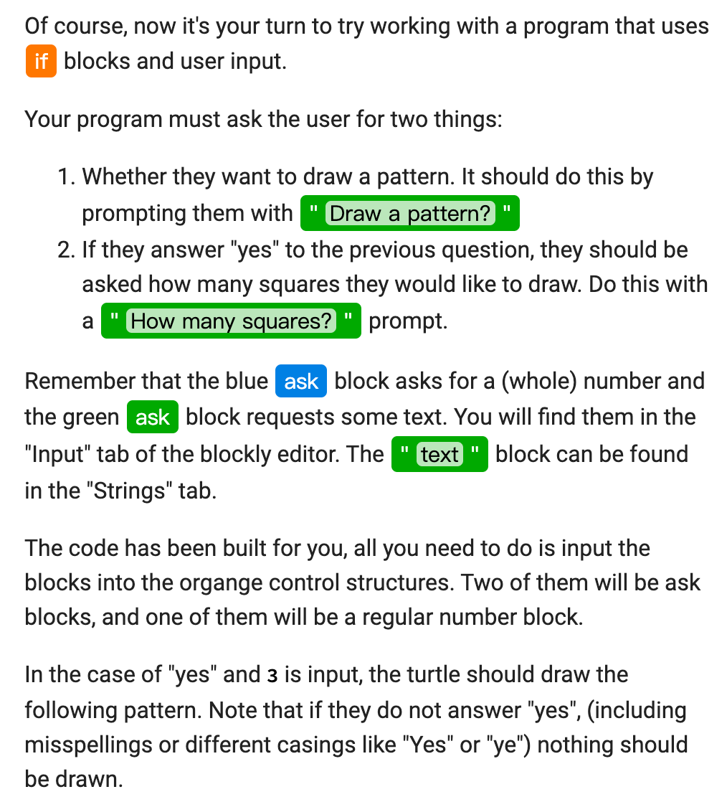

:::

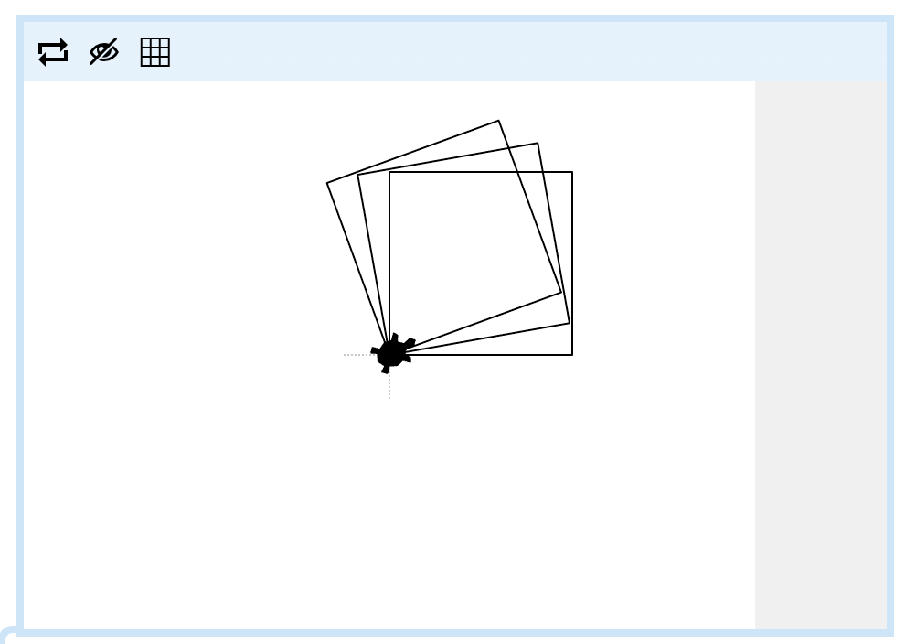


```python
Draw a pattern? yes
How many squares? 3
```

If the user enters a number other than `3`, that number of squares should be drawn. For example, the pattern will look complete after 36 squares: how beautiful! We've sped up the drawing speed here because it takes a while otherwise.

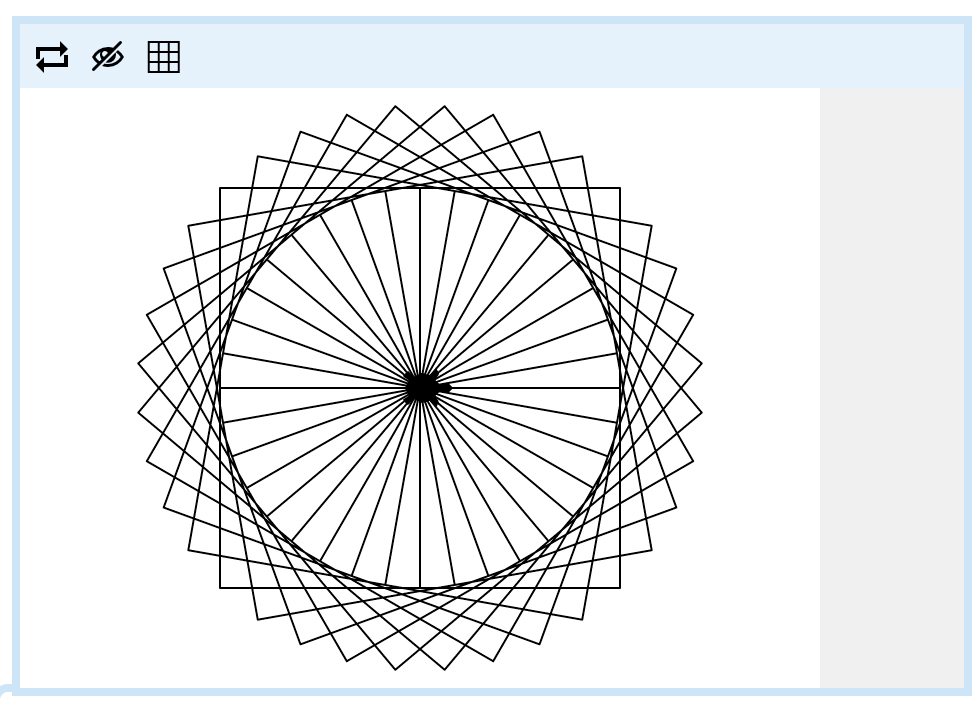

```python
Draw a pattern? yes
How many squares? 36
```

### Blank screen?

If you can't see any blocks or they're split up in any way, you can click the "reset" button in the top right of the blockly editor. This will return things to how they're supposed to be!

### Solution 7

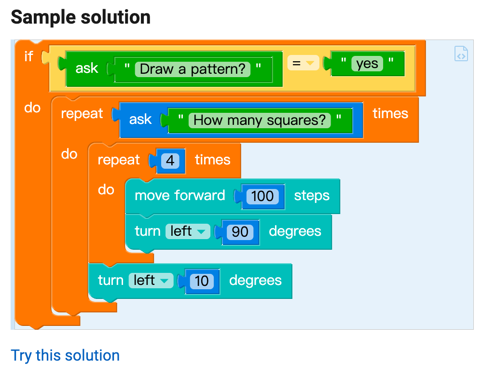

```python
from turtle import *


if input('Draw a pattern?' + ' ') == 'yes':
  for count2 in range(int(int(input('How many squares?' + ' ')))):
    for count in range(4):
      forward(100)
      left(90)
    left(10)
```

## 8. Choices, choices, choices「turtle」

For this problem, we are going to be drawing some shapes in different colours. The user will need to specify three things in this order:

1. Whether the line colour is red or blue. This will be asked with the prompt Enter red or blue: Valid answers are `red` and `blue`
2. What thickness the line should be. This is set with the "pen size" block. This will be asked with the prompt Enter pen size: Note that line thickness is a whole number.
3. Whether the turtle should draw a square or a triangle. This will be asked with the prompt Which shape? Valid answers are `square` and `triangle`.

Remember to make sure those prompts and expected inputs are exactly correct, including capitalisation. Grok is very pedantic about that.

The shapes should have line lengths of 100 turtle steps, with the turtle turning left to draw them. See the animation examples below.

You can assume that the user will only ever enter valid input: `red` or `blue` for the first question; a positive whole number between 1 and 10 for the second question; and `square` or `triangle` for the third question. In a more thorough implementation, you would need to do a little more checking to handle the situation that the user enters an **in**valid input, but for right now we can trust them.

Here are some examples. The first has inputs `blue`, `3` and `triangle`.

::: details

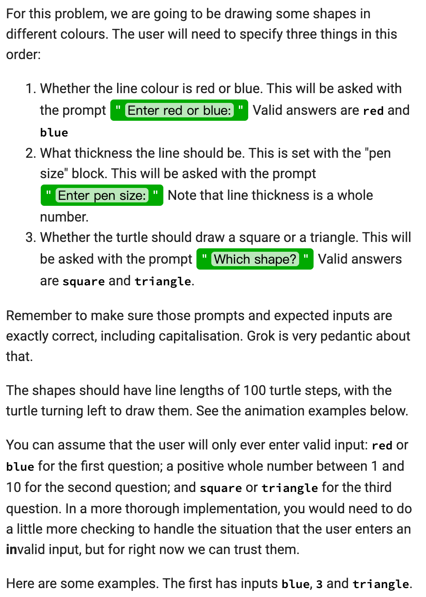

:::

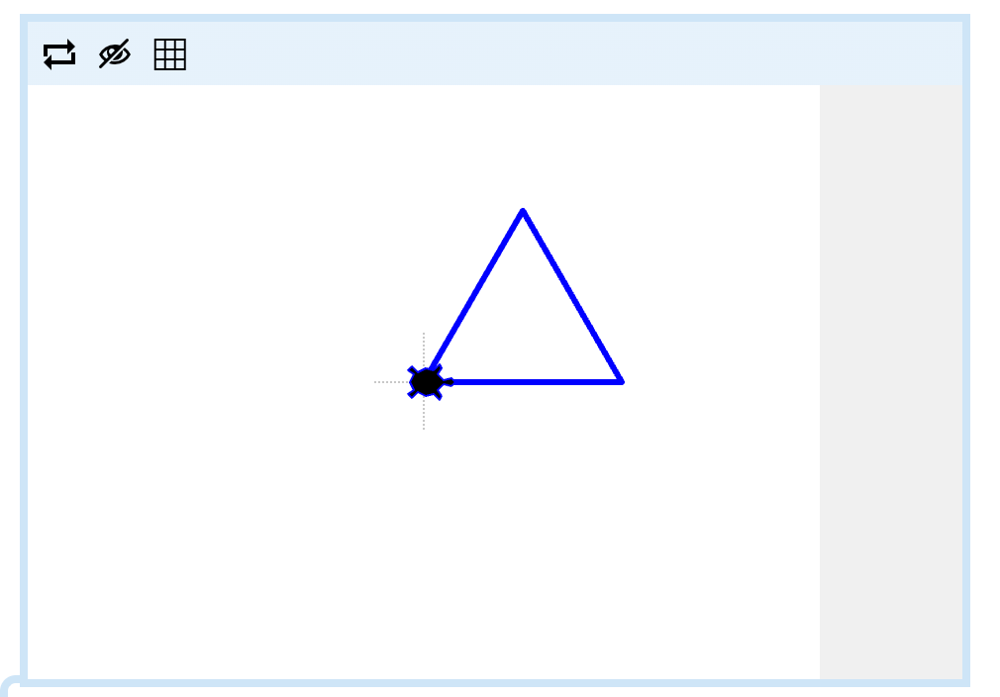

```python
Enter red or blue: blue
Enter pen size: 3
Which shape? triangle
```

The second example has inputs `red`, `7` and `square`.

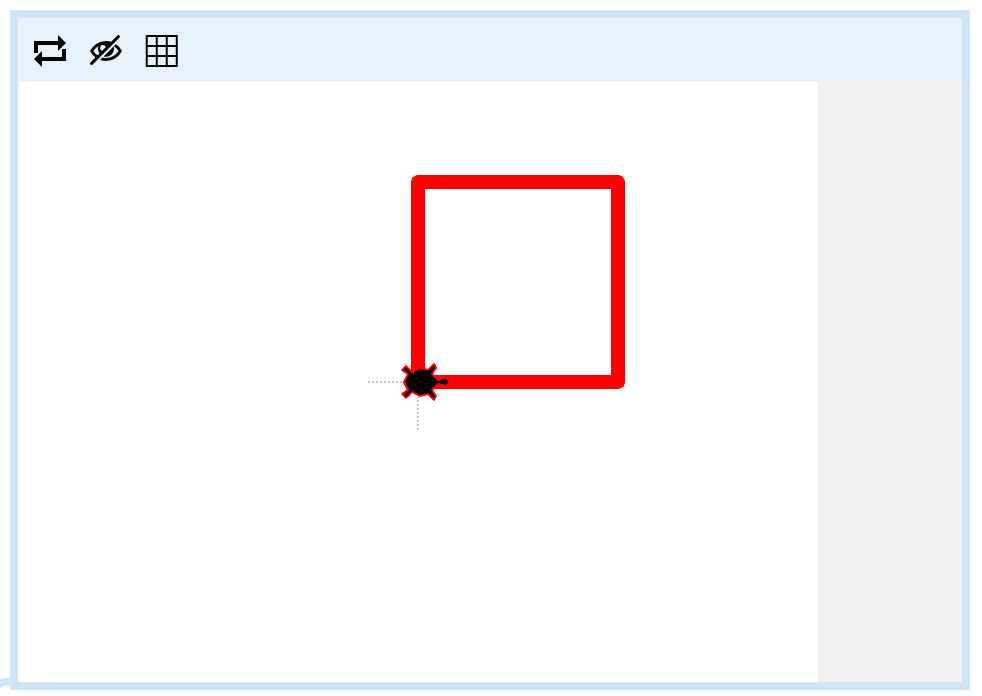

```python
Enter red or blue: red
Enter pen size: 7
Which shape? square
```

### Hint

If you're struggling to start, try setting up your editor with an if-else block, a set pen size to block, and then another if-else block.

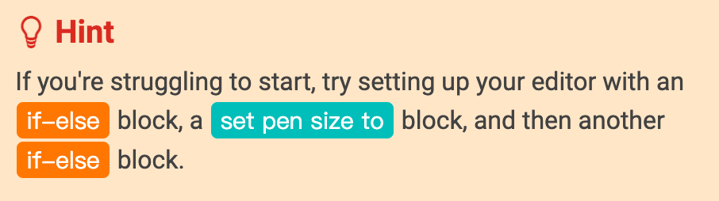

### Solution 8

#### Sample solution #1

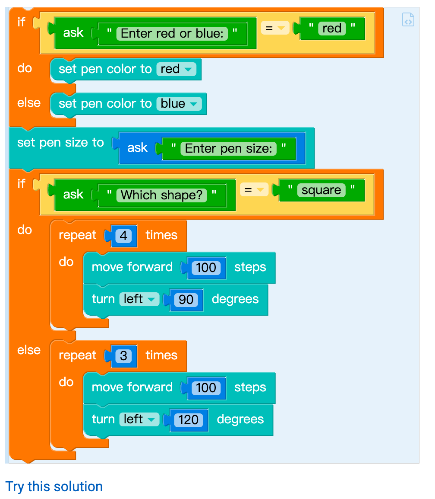

```python
from turtle import *


if input('Enter red or blue:' + ' ') == 'red':
  pencolor('red')
else:
  pencolor('blue')
pensize(int(input('Enter pen size:' + ' ')))
if input('Which shape?' + ' ') == 'square':
  for count in range(4):
    forward(100)
    left(90)
else:
  for count2 in range(3):
    forward(100)
    left(120)
```

#### Sample solution #2

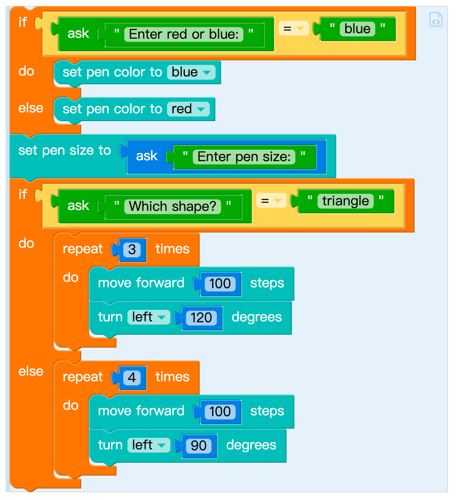

```python
from turtle import *


if input('Enter red or blue:' + ' ') == 'blue':
  pencolor('blue')
else:
  pencolor('red')
pensize(int(input('Enter pen size:' + ' ')))
if input('Which shape?' + ' ') == 'triangle':
  for count in range(3):
    forward(100)
    left(120)
else:
  for count2 in range(4):
    forward(100)
    left(90)
```

## 9. Your turn!「turtle」

Now it's your turn! Write a blockly program which defines a function "draw hexagon" which draws a hexagon with side lengths 50 turtle steps long.

Below is an example of running the block call draw hexagon. Note that you **must** use a function to get the green diamond, and the function **must** be called `draw hexagon`. You must **not** use any call blocks: all of your blocks should be in one def block. You'll get used to this prescriptivism as we work our way through the worksheets, and hopefully learn to appreciate that it is an important component of computing to follow specifications precisely (noting that in other fields, there are good reasons for a strong counter-culture to [prescriptivism](https://en.wikipedia.org/wiki/Linguistic_prescription)).

::: details

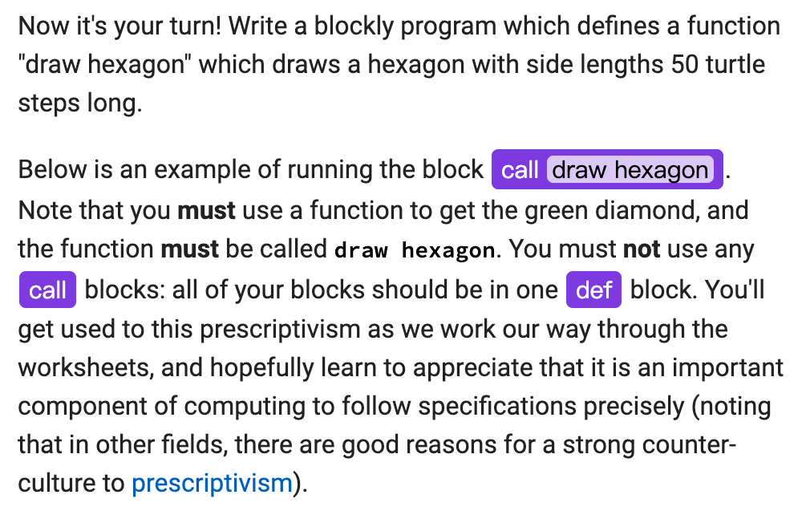

:::

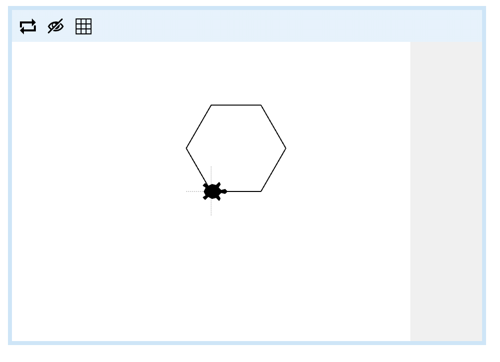

### Solution 9

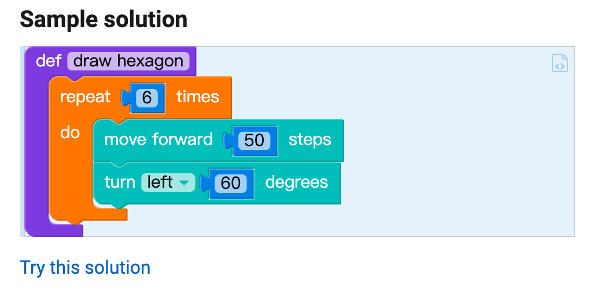

```python
from turtle import *


def draw_hexagon():
  for count in range(6):
    forward(50)
    left(60)
```


## 10. Adding arguments「turtle」

Let's write a new draw hexagon function, which takes one argument to set the side length. The function definition has been provided for you, just fill it in!

Note you can access the side length argument from the "Variables" tab in the editor, and that if you wish to test your function with a function call, you will need to provide a value for the argument via the "Numbers" tab.

Below is an example of running the block call draw hexagon with 75. Note that – as in the previous problem — we have asked you to write the function, meaning your submission should take the form of a function definition *only*, with no calls to the function — you are providing the capability for others to call the function as they please, not actually running it yourself (an important distinction we will learn more about as we progress in the subject!).

Note that we have included "Decisions" and "Logic" blocks in the Turtle "palette" for this problem in case you want to play around with some of the concepts we will discuss in the next few slides, but they aren't required for this problem.

::: details

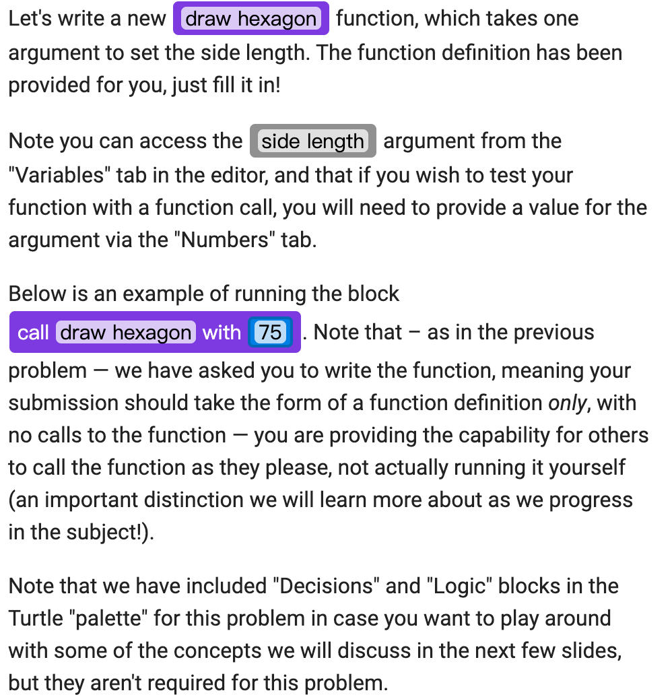

:::

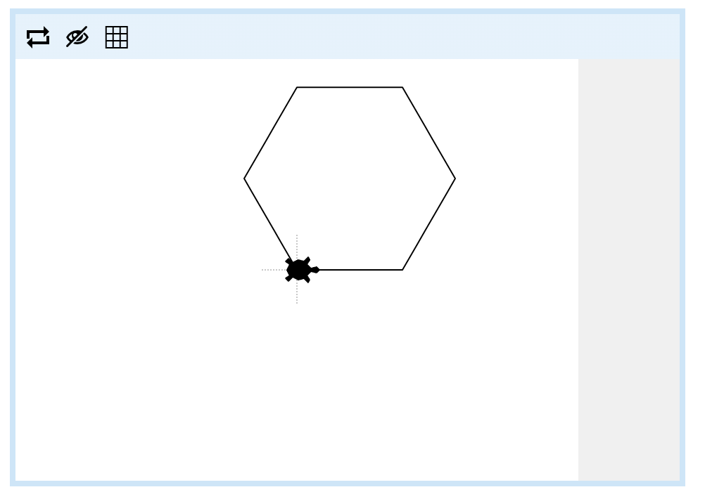

### Solution 10

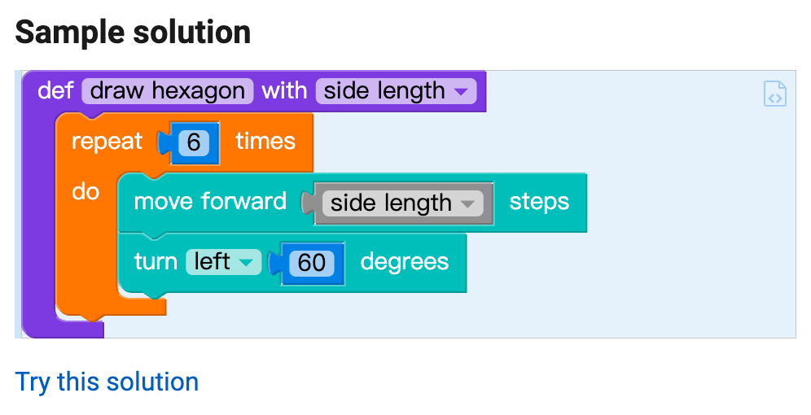

```python
from turtle import *


def draw_hexagon(side_length):
  for count in range(6):
    forward(side_length)
    left(60)
```

## 11. Hello World!「print」

Let's play around with `print()` for a moment and write our first Python program with code rather than blocks. To write code, just click in the editor and start typing!

For this first problem, let's imagine we're in Spain. Write a Python program that prints the following text:

```python
Hola World!
How are you?
```

### Hint

You have to get the program to print *exactly* the same text as shown above (spelling, casing and all) — you will get used to paying attention to minute details in the exercises in order to have your code accepted; coders are details people!

### Solution 11

#### Sample solution

```python
print("Hola World!")
print("How are you?")
```

## 12. Python as a calculator「print 计算」

The factorial of some number n is obtained by multiplying all the numbers between 1 and n. For example, the factorial of 7 is: $7×6×5×4×3×2×1=5040$.

Write a program that calculates and prints the factorial of 10.

### Solution 12

### Sample solution

```python
print(10 * 9 * 8 * 7 * 6 * 5 * 4 * 3 * 2 * 1)
```

## 13. Order of operations「print 计算」

Write a program that calculates and prints the results of the following two equations:

- $5×(8+20−18)/2$
- $5×(8+20)−18/2$

### Hint

Remember your program must print two lines of output, one for the result of each equation.

### Solution 13

#### Sample solution

```python
print(5 * (8 + 20 - 18) / 2)
print(5 * (8 + 20) - 18 / 2)
```

## 14. Musical notes「print 字符串」

In Western music, notes are named after the first seven letters of the alphabet: `A B C D E F G`. Imagine you have to write a very long piece of music and most notes are repeated. Having to type each letter many times in a row will be frustrating. For example, if a music piece has 10 `A`s followed by 10 `D`s followed by `CEABC` then it would look like: `AAAAAAAAAADDDDDDDDDDCEABC`. But as a Python programmer you can use the `*` and `+` operators to make life easy.

For the same example above, instead of typing 10 `A`s and 10 `D`s, you can do the following:

```python
print('A' * 10 + 'D' * 10 + 'CEABC')
```

For this exercise, write a program which prints a string of notes like the one above. Your string must start with `CEGCEG` followed by 36 `E` notes then finish with 24 `C` notes.

### Solution 14

#### Sample solution

```python
print('CEGCEG' + 36 * 'E' + 24 * 'C')
```


## 15.  Input exercise

Write a program that asks a user to enter their name, then prints a greeting for the user like this:

```python
Enter your name: Kim
Hello Kim
```

### Solution 15

#### Sample solution

```python
name = input('Enter your name: ')
print("Hello", name)
```

## 16. Floating point calculation「print float」

Write a single expression to calculate $5.345×10^5+2.14×10^2$, and print the result as a `float`.

The output of your program should look like this (but the number will be different!):

```python
9.0
```

### Solution 16

#### Sample solution

```python
print(5.345e5 + 2.14e2)
```

## 17. Type conversion exercise 1「类型转换」

Write a Python program that asks the user for two numbers `val1` and `val2` using the `input` function, and prints their difference as a `float`.

```python
Enter val1: 6
Enter val2: 3
3.0
```

Note that the inputs can also be of type `float`, or a mix of types `float` and `int`, `e.g.`:

```python
Enter val1: 4.0
Enter val2: 3
1.0
```

Note also that the difference may be negative if the first is smaller than the second:

```python
Enter val1: 2.5
Enter val2: 4.0
-1.5
```

### Remember

The `input` function returns values of type `str` — you will need to convert the strings to a numeric type.

### Solution 17

#### Sample solution #1

```python
val1 = float(input("Enter val1: "))
val2 = float(input("Enter val2: "))
print(val1 - val2)
```

#### Sample solution #2

```python
val1 = input("Enter val1: ")
val2 = input("Enter val2: ")
print(float(val1) - float(val2))
```

## 18. Type conversion exercise 2「类型转换2」

Write a Python program that asks the user for one integer `volume` (a volume in millilitres), converts it to litres, and prints the result with `l` as the units (for "litre").

```python
Enter volume in ml: 3000
3.0l
```

### Solution 18

#### Sample solution #1

```python
volume_in_ml = input("Enter volume in ml: ")
volume_in_l = int(volume_in_ml) / 1000
volume_as_str = str(volume_in_l) + 'l'
print(volume_as_str)
```

#### Sample solution #2

```python
volume = input("Enter volume in ml: ")
print(str(int(volume) / 1000) + 'l')
```

## 19. Happy Birthday Mr Frodo「运算符//、%、str or ,」

It's been a long time since Frodo went out on his Big Adventure. He has lost track of time, and wonders whether it is his birthday yet. Luckily, he remembers exactly how many days have passed since he was born. To help Mr Frodo, write a Python program that asks the user for the number of days since they were born, and returns their age in years, and the number of days until their next birthday.

**Reminder:** make sure you spell **everything** properly in the output!

```python
How many days have you lived? 3000
You are 8 years young!
You have 285 days until you next get to boogie down.
```

### Leap Years

As cool as leap years are, for this exercise, you can assume that all years are made up of 365 days. Also assume that the input will always be a nice, discrete integer.

Did you know that the oldest cat in the world lived to 38 years and 3 days old. She was called [Creme Puff](https://en.wikipedia.org/wiki/Creme_Puff_(cat)) and had a diet of bacon and eggs, and coffee with cream, and was completely unperturbed by leap years. Oh my god, how Adorable!

### Solution 19

#### Sample solution

```python
days_lived = int(input("How many days have you lived? "))
years_old = days_lived//365
days_to_bday = 365 - days_lived % 365
message1 = "You are " + str(years_old) + " years young!"
message2 = "You have " + str(days_to_bday) + " days until you next get to boogie down."
print(message1)
print(message2)
```

## 20. Mr Frodo goes to the bank「//、/、str or ,」

Mr Frodo received lots of money for his Birthday. Mr Frodo decided to put it in the bank. Mr Frodo is clever. He knows that his interest will compound **monthly** at a rate of $4.5\%$ p.a. Write a program that asks Mr Frodo how much he is investing, and for how long (in days), and prints the amount of money he will have after this amount of time.

You should assume non-empty, integer inputs for both answers, and assume there are exactly 31 days in every month according to this bank.

Your program should behave as follows:

```python
How much money would you like to invest, Mr Frodo? 10
How many days would you like to invest this for? 10
After that time you will have: $10.0
```

```python
How much money would you like to invest, Mr Frodo? 10
How many days would you like to invest this for? 372
After that time you will have: $10.459398250405895
```

### Compound interest

The formula for compound interest is:

$$P_f = P_i×(1 + \frac{r}{12})^n$$

where $P_f$ is the final amount, $P_i$ is the initial amount, $r$ is the interest rate per annum, and $n$ is the number of accumulation periods (months for this problem) that have passed.

For example, if you invest `$100` for 1 year and one month (13 months) at a rate of $4\%$ per annum, the final amount would be:

$$100 × (1+0.04/12)^{13}≈104.42$$

### Solution 20

#### Sample solution

```python
RATE = 0.045
amount = int(input("How much money would you like to invest, Mr Frodo? "))
time = int(input("How many days would you like to invest this for? "))
final_amount = amount*(1+RATE/12)**(time//31)
print("After that time you will have: $"+str(final_amount))
```


## 21. Loose Change「if、input、float、比较运算符、%、+」

Because we don't use 1 cent coins anymore, when you use cash to buy things like groceries, the amount is rounded up or down to the nearest 5 cents. For example if you buy `$5.57` worth of carrots, it would get rounded down and you would pay `$5.55` in cash (saving 2 cents!). But `$5.58` worth of carrots would get rounded up and cost `$5.60`.

Life hack: Always go for the option which is rounded down!

Write a program that takes the cost of an item and tells you whether the cost stays the same/is rounded down (good, pay in cash), or was rounded up (bad, you should pay by card).

The output of your program should look like this:

```python
How much does it cost? 5.57
The price didn't change or was rounded down! Pay cash!
```

```python
How much does it cost? 5.58
The price was rounded up! Pay card.
```

```python
How much does it cost? 3.23
The price was rounded up! Pay card.
```

### Hint

Think about multiplying the price by 100.

### Did you know

This technique is called [Salami Slicing](https://en.wikipedia.org/wiki/Salami_slicing), and can be applied in many other circumstances.

### Solution 21

```python
cost = float(input("How much does it cost? "))
remainder = int(cost * 100 + 1.0e-10) % 5
if remainder < 3:
    print("The price didn't change or was rounded down! Pay cash!")
else:
    print("The price was rounded up! Pay card.")
```

## 22. Detecting Enemies「input、判断、运算符、+」

Now let's test our skills to help out our friend Jon Snow from *Game of Thrones*. He is having a dull moment and wants to use an app to check if people entering his camp are **enemies**! Write a simple program that asks the user to enter a name and determines whether they are enemies or not.

Fortunately for us, Jon Snow has two kinds of enemies: those who can't use phones, and those who will enter one of 0, 1 or 2, because in their language *name* means "dial a number after the prompt" (and they can't count past 2 ... although, somewhat suspiciously, they do have a zero in their number system). The enemies who can't use phones obviously won't enter anything, and should receive the following message: `A luddite! GO AWAY AT ONCE!`.

The enemies who think that names are single-digit numbers (specifically 0, 1 or 2) should receive: `HAHA! You may not pass!!`.

Everyone else receives: `Welcome to the camp, <name>, if that really is your name.` Where `<name>` should be replaced by the user's name.

Your program should behave as follows:

```python
Enter your name, soldier: 
A luddite! GO AWAY AT ONCE!
```

```python
Enter your name, soldier: 2
HAHA! You may not pass!!
```

```python
Enter your name, soldier: kim
Welcome to the camp, kim, if that really is your name.
```

### Solution 22

```python
val = input("Enter your name, soldier: ")
if val == '0' or val == '1' or val == '2':
    print("HAHA! You may not pass!!")
elif val == "":
    print("A luddite! GO AWAY AT ONCE!")
else:
    print("Welcome to the camp, " + val + ", if that really is your name.")
```

## 23. Science Classifier「str、if、+」

It's hard to keep up with the pace of progress of science at times, with new(ish) fields of science with cool-sounding names including [proteomics](https://en.wikipedia.org/wiki/Proteomics), [quantum biology](https://en.wikipedia.org/wiki/Quantum_biology) and computational neurolinguistics. Your job in this exercise is to write a simple scientific "classifier" which takes the name of a field of science as input, and prints out a (pithy) comment as follows:

- if it **ends** with *omics*, your code should print `Life science hippy!`
- if it **begins** with *comp* or *info*, your code should print `Computing ftw!`
- if it **ends** with *y*, your code should print `Au naturel!`
- failing all these, your code should print `Too new to keep up!`

Note that for an input which matches multiple of these conditions, the first-listed matching condition should apply (and only one message should be printed out). You may assume that the input will consist entirely of lower-case characters and spaces

Your program should work like this:

```python
Hit me: proteomics
Life science hippy!
```

```python
Hit me: quantum biology
Au naturel!
```

```python
Hit me: computational neurolinguistics
Computing ftw!
```

```python
Hit me: cliodynamics
Too new to keep up!
```

### Hint

You will later learn how to extract prefixes and suffixes from strings, but for our purposes here, the safest way to ensure that a substring match is at the start or end of the string is to pre-insert a special character which is uniquely associated with that position in the string (`e.g.` `^` at the start of the string and `$` at the end of the string, although in practice, any discrete characters which are not lower-case characters or spaces would work), and include that special character in the substring you are matching against the input string.

For example, if we wanted to test that `my_string` starts with `'at'`, we could use `in`, but this would match a substring in the middle of the string too, which is not what we want. Adding `^` to the front of the string allows us to specifically test `'^at'` which will only match at the start of the string.

```python
my_string = "catty"
print('at' in my_string)  # incorrect
my_string = '^' + my_string
print('^at' in my_string)  # correct
```

### Solution 22

```python
name = "^" + input("Hit me: ") + "$"

if "omics$" in name:
    print("Life science hippy!")
elif "^comp" in name or "^info" in name:
    print("Computing ftw!")
elif "y$" in name:
    print("Au naturel!")
else:
    print("Too new to keep up!")
```

## 24. Season's Greetings「if、比较运算符、input」

Write a program which asks the user for a month of the year, as a number between 1 and 12. Your program must then print one of the following messages depending on the season the specific month falls in:

- `It's summer. Have fun in the sun!` if the number is 1, 2 or 12.
- `It's autumn. Enjoy the beautiful sunsets!` if the number is between 3 and 5 (inclusive).
- `It's winter. Go skiing!` if the number is between 6 and 8 (inclusive).
- `It's spring. Check out the spring racing carnival!` if the number is between 9 and 11 (inclusive).
- Your program should print an error message `Invalid input. Please enter any number between 1 and 12.` if any other number is encountered.

For example:

```python
Enter the month (1-12): 2
It's summer. Have fun in the sun!
```

```python
Enter the month (1-12): 4
It's autumn. Enjoy the beautiful sunsets!
```

```python
Enter the month (1-12): 7
It's winter. Go skiing!
```

```python
Enter the month (1-12): 10
It's spring. Check out the spring racing carnival!
```

```python
Enter the month (1-12): 13
Invalid input. Please enter any number between 1 and 12.
```

### Solution 24

```python
month = int(input('Enter the month (1-12): '))
if (1 <= month <= 2) or month == 12:
    print("It's summer. Have fun in the sun!")
elif 3 <= month <= 5:
    print("It's autumn. Enjoy the beautiful sunsets!")
elif 6 <= month <= 8:
    print("It's winter. Go skiing!")
elif 9 <= month <= 11:
    print("It's spring. Check out the spring racing carnival!")
else:
    print("Invalid input. Please enter any number between 1 and 12.")
```

## 25. String Indexing「字符串索引」

Write a small program that asks the user to enter some text and then prints the third character *and* the third last character of the text they entered.

The output of your program should look like this (but the text may be different!):

```python
Enter some text: Hola, my name is John!
l
h
```

### Hint

Your program only needs to work on text with at least 3 characters in it. Don't worry if your program generates an error when a user enters as string with 2 characters or fewer.

### Solution 25

```python
text = input("Enter some text: ")
print(text[2])
print(text[-3])
```

## 26. String Slicing and Dicing「//、%、*、+、比较运算符」

For this problem you must write a program that can extract the cost of, for example, one chocolate bar when given a sentence like `How much did 25 chocolate bars cost? $63.75!` Your program must first read a sentence from input. It should then use slicing to get the number of items and the total cost, and convert those values from strings into numbers. Finally, your program must calculate and print the cost of a single item.

The output of your program should look like this:

```python
Question: How much did 25 chocolate bars cost? $63.75!
$2.55
```

Your program must still work if the sentence contains a different number, cost, or type of items:

```python
Question: How much did 10 cans of cola cost? $35.00!
$3.50
```

For this problem, you may assume that **the number of items is always 2 digits** (that is, it is between `10` and `99` ) and occurs after the phrase `'How much did '`. You may also assume that the **total cost is always between `10` and `99` dollars with cents (in the form of two digits)**, and appears at the end of a sentence (followed with an exclamation mark).

### Hint

You might want to convert the amout from dollars and cents into a whole number of cents, and use integer division (`//`) and modulus (`%`) to separate out the dollar and cent amounts.

### Solution 26

```python
text = input("Question: ")
total_cost = 100 * int(text[-6:-4]) + int(text[-3:-1])
number = int(text[13:15])
cost = total_cost // number
cents = cost % 100
if cents >= 10:
    print("$" + str(cost//100) + "." +  str(cents))
else:
    print("$" + str(cost//100) + ".0" +  str(cents))
```

## 27. Your Name, Backwards「input、print、字符串数据提取」

Have you ever wondered what your name is written backwards? Write a program that asks the user for their name and returns it written backwards. Compare with your classmates and see who would like to be called by their name written backwards. Apparently, there's a reason we write our names forwards!

The output of your program should look like this:

```python
What is your name? Alex
Well hello there, xelA
```

### Hint

Try calling your tutor by their backwards name.

### Solution 27

```python
name = input("What is your name? ")
print("Well hello there,", name[::-1])
```

## 28. A and an「input、print、if、and」

In English, the indefinite article has two forms: *a* (used when the first sound of the following word is a consonant) and *an* (used, roughly speaking, when the first sound of the following word is a vowel). As an oversimplification of how to make this distinction, let's assume that *an* should be used when the first letter of the word it precedes is one of *a*, *e*, *i*, *o* and *u*, and *a* should be used otherwise.

Write a program that asks the user to enter a phrase, and prints out that phrase preceded by `an` (with a space) if the phrase starts with a vowel, and `a` (with a space) for all other inputs **(including the empty string)**.

Your program should work like this:

```python
Enter a phrase: aardvark
an aardvark
```

```python
Enter a phrase: banana
a banana
```

```python
Enter a phrase: Australian
an Australian
```

Note that, based on our simple heuristic, the method will produce some outputs which are more dubious sounding, such as:

```python
Enter a phrase: honour
a honour
```

```python
Enter a phrase: unicorn
an unicorn
```

### Hint

One string method that you might find useful is `.lower()`, which returns a copy of the string that it is called from, converted to lower case, `e.g.`:

```python
print("Apologies to Chekov".lower())
```

### Solution 28

```python
phrase = input("Enter a phrase: ")
if phrase and phrase[0].lower() in 'aeiou':
    print("an", phrase)
else:
    print("a", phrase)
```

## 29. The Culprit「list、int、input、字符串切片、运算符」

James Bond has captured 7 of his arch nemeses. He knows that one of them is the culprit behind the most dastardly plan in the universe, but is not sure which one. However, he has a trick up his sleeve. He knows that Hugo (one of the 7) is not very clever and also that Hugo knows who did it. So he will present Hugo with a list of names with some confusing information next to them, and then quickly ask him who did it. Hugo is smart enough not to say exactly who did it, but he will instead always say the name of the preceding person in the list, which will be numbered from 1 to 7 (with a response of 1 indicating that it is person 2, and 7 indicating that the culprit is person 1).

Write a program that asks Hugo to give the number of the culprit, and returns the name of the person who did it along with the data associated with that individual (i.e. everything that comes after the name in the tuple). The list of possible culprits should be stored as a list of tuples, as below, where each tuple contains a name (a string) and a variable number of data points associated with that individual (each of which is a string). Assume the input is a positive integer. The data associated with the individual must be returned in the form of a tuple (possibly empty).

```python
[("Max Zorin", "Kills with guns", "Chip Tycoon"),
 ("Hugo Drax",),
 ("Jaws", "Bites people", "Mutant"),
 ("Nick Nack", "Really short"),
 ("Le Chiffre", "Good at poker", "Really evil"),
 ("Francisco Scaramanga", "Has a Golden Gun", "Probably will melt"),
 ("Mr Big", "Also the name of a rock band", "Dictator of San Monique")]
```

Your program should function as below:

```python
WHO DID IT HUGO!? 2
It was Jaws
Data: ('Bites people', 'Mutant')
```

```python
WHO DID IT HUGO!? 7
It was Max Zorin
Data: ('Kills with guns', 'Chip Tycoon')
```

Avoid the temptation of using an `if` statement with six `elif` statements to solve this problem! That would be very inflexible and repetitive code. Make use of the list indexing and slicing we have just learned about.

### Zero offset and nested lists

Remember that lists are indexed from 0. Also, you may find **nested** indexing useful here.

```python
my_list = [(4, 8)]
print(my_list[0][0])
print(my_list[0][1])
```

### Solution 29

```python
suspects = [("Max Zorin", "Kills with guns", "Chip Tycoon"),("Hugo Drax",), ("Jaws", "Bites people", "Mutant"), ("Nick Nack", "Really short"), ("Le Chiffre", "Good at poker", "Really evil"),("Francisco Scaramanga", "Has a Golden Gun", "Probably will melt"), ("Mr Big", "Also the name of a rock band", "Dictator of San Monique")]

ans = int(input("WHO DID IT HUGO!? "))
culprit = (ans%7)
print("It was",suspects[culprit][0])
print("Data:",suspects[culprit][1:])
```

## 30. Canner can「function、f-string、return」

Time to write our first basic function.

Write a function `canner_can` that takes a single argument `item` in the form of a string, and returns the string `'Can you can a [STRING] as a canner can can a can?'`, where `'[STRING]'` takes the value of `item`.

The following are example calls to the function (displaying the output with `print` in each case), to illustrate its functionality:

```python
>>> print(canner_can("can"))
Can you can a can as a canner can can a can?
>>> print(canner_can("apricot"))
Can you can a apricot as a canner can can a can?
>>> print(canner_can("juicy tomato"))
Can you can a juicy tomato as a canner can can a can?
```

### Interacting with Functions

Next to the **Run** button in the right window, you may have noticed a **Terminal** button. The terminal button executes your code, and then provides you with a terminal window that allows you to call any functions (or other items) defined in your code. This is handy for running your own test cases (as function calls), for debugging purposes, or just to double-check the correctness of your code before submission.

### Solution 30

```python
def canner_can(item):
    return "Can you can a " + item + " as a canner can can a can?"
```

## 31. Canner can v2「function、str、if、list、return」

Having got the basics down pat, let's beef things up a bit more, building on our first function. You might have noticed in our first example that we produced strings such as `"a apricot"` rather than `"an apricot"`. Let's fix this, based on the simple definition that the indefinite article should be `an` if it precedes a vowel, and `a` for all other inputs **(remember the empty string input!)**.

Write a function `canner_can2` that takes a single argument `item` in the form of a string, and returns the string `"Can you can an [STRING] as a canner can can a can?"` (where `[STRING]` takes the value of `item`) if `item` starts with a vowel, and `"Can you can a [STRING] as a canner can can a can?"` otherwise. Note that the set of vowels in English is `a`, `e`, `i`, `o` and `u`, and that your function should be able to deal with both upper and lower-case letters.

The following are example calls to the function (displaying the output with a `print` statement in each case), to illustrate its functionality:

```python
>>> print(canner_can2("can"))
Can you can a can as a canner can can a can?
```

```python
>>> print(canner_can2("apricot"))
Can you can an apricot as a canner can can a can?
```

```python
>>> print(canner_can2("AARGH"))
Can you can an AARGH as a canner can can a can?
```

```python
>>> print(canner_can2(""))
Can you can a  as a canner can can a can?
```

### Seems Familiar?

You may recall that there was an earlier problem relating to the *a/an* distinction. You are welcome to reuse that code as part of your solution to this problem. Also note the method is an oversimplification — `e.g.` *a unicorn*, *an heiress*, and for some speakers an historical event — but it will suffice for the purposes of this question.

### Solution 31

```python
def canner_can2(item):
    # use 'an' if `item` is non-empty string starting with vowel
    if item and item[0] in 'aeiouAEIOU':
        item = "an " + item

    # otherwise use 'a'
    else:
        item = "a " + item

    return "Can you can " + item + " as a canner can can a can?"
```

```python
def canner_can2(item):
    """" canner_can takes a string item (assumed to be an animal) and returns a string containing an important question about the animal """
    # write your code here
    word = item.lower()
    if word =='':
        return f'Can you can a {item} as a canner can can a can?'
    
    elif word[0] =='a' or word[0] =='e' or word[0]=='i' or word[0]=='o' or word[0]=='u':
        return f'Can you can an {item} as a canner can can a can?'
    
    else :
        return f'Can you can a {item} as a canner can can a can?'
```

```python
def canner_can2(item):
    """" canner_can takes a string item (assumed to be an animal) and returns a string containing an important question about the animal """
    # write your code here
    
    vowels =['a', 'e', 'i', 'o', 'u']
    if not item:
        result ='a'
    elif item[0] in vowels:
        result ='an'
    else:
        result = 'a'

    return f'Can you can {result} {item} as a canner can can a can?'
```


## 32. Goldilocks List「function、len、str、if、return」

Write a function `between_len` that takes three arguments:

1. a list `words`;
2. an integer `minlen`; and
3. an integer `maxlen`.

The function should return `True` if the length of `words` (as in, the length of the *list*, not the words in the list) is at least `minlen` and no more than `maxlen`, and `False` otherwise.

For the mathematically-inclined, if $l_{words}$ is the length of the list, we are truth-evaluating the expression minlen≤ $l_{words}$≤maxlen.

The following are example calls to the function (displaying the output with a `print()` statement in each case), to illustrate its functionality:

```python
>>> between_len(["python", "is", "boring"], 4, 7)
False
```

```python
>>> between_len(["python", "is", "amazing"], -1, 20)
True
```

```python
>>> between_len(["python", "is", "amazing"], minlen=3, maxlen=4)
True
```

### Returning Booleans

Since using a relational operator generates a Boolean value, an elegant way to return a Boolean is to return the condition directly. For example, if we wanted to test whether a number `n` is greater than `5`, this is an example of returning the value of that test directly (*très élégante!*).

```python
def isGreater(n):
    return n > 5
```

The following is functionally equivalent (i.e. it does exactly the same thing as the first), but with the extra unnecessary step of checking the result of the test, and explicitly returning the associate Boolean:

```python
def isGreater(n):
    if n > 5:
        return True
    else:
        return False
```

### Solution 32

```python
def between_len(words, minlen, maxlen):
    return minlen <= len(words) <= maxlen
```

```python
def between_len(list, minlen, maxlen):
    if minlen <= len(list) <= maxlen:
        return True
    else:
        return False
```

## 33. Word Counter「function、len、input、split」

Explore the methods for strings in the terminal using `dir("hello world")`. With these in mind, write a function `word_count(input_str)` that takes a string as input and returns the number of words in the string. Your function should work like this:

```python
>>> word_count("There are 44 cows on a hill")
7
>>> word_count("Quotes are handy things to have about, saving one from thinking for oneself which is always hard.")
17
>>> word_count("")
0
```

### Hint

```python
print("You're Beautiful".split())
```

### Solution 33

```python
def word_count(input_str):
    """Returns the number of words in the input string input_str"""
    return len(input_str.split())
```

## 34. Dodgy Brothers' Dozen「f-string」

It is a common practice in retail to offer discounts on the unit price for bulk purchases, and an expectation that when the prices for a given item are advertised on a per-item and bulk manner, the bulk price will be cheaper. Unscrupulous operators such as [the Dodgy Brothers](https://en.wikipedia.org/wiki/Australia_You're_Standing_In_It) can sometimes abuse this expectation, in marking up the bulk price for the unwary.

Write a function `dodgy_markup(price)` which takes a single (non-negative) float argument `price`, and uses a single f-string to return a string of the following form, where the unit-price is set to `price`, and the per-dozen price is set to `price` multiplied by 12, with a $10\%$ markup. Note that all prices must be presented in dollars and cents (i.e. to exactly two-decimal places). For example:

```python
>>> dodgy_markup(.20)
'$0.20 each, or a crazy, crazy $2.64 per dozen!'
>>> dodgy_markup(1)
'$1.00 each, or a crazy, crazy $13.20 per dozen!'
```

### Solution 34

```python
def dodgy_markup(price):
    return f"${price:.2f} each, or a crazy, crazy ${price*12*1.1:.2f} per dozen!"
```


```python
def dodgy_markup(cost):

    return f'${cost:.2f} each, or a crazy, crazy ${(cost*12*1.1):.2f} per dozen!'
```

## 35. Dodgy Brothers Price List「f-string」

The Dodgy Brothers sell a remarkable array of objects, all of dubious nature, and all at outlandish prices. To help them stay on top of their inventory, write a function to help them format item information more clearly. The function `dodgy_inventorise(item)` should take a single tuple argument `item` (containing an item volume, description and price, respectively). You will need to use an f-string to present the item as a fixed-width column according to the following specification:

- Volume is up to 6 characters and left-justified. You can assume that all volumes are integers under 100,000
- Name is up to 20 characters (with any additional characters ignored) and right-justified
- Price is up to 10 characters (in dollars and cents) and right-justified. You can assume that all prices are under $10,000,000

```python
>>> dodgy_inventorise((1, "rust bucket car", 150000))
'1          rust bucket car 150000.00'
>>> dodgy_inventorise((10000, "chunky, chunky, chunky custard", 4.5))
'10000 chunky, chunky, chun      4.50'
```

### Solution 35

```python
def dodgy_inventorise(item):
    return f"{item[0]:<6d}{item[1]:>20.20s}{item[2]:10.2f}"
```

```python
def dodgy_inventorise(item):
    volume, description, price = item
    formatted_volume = f"{volume:<6}"
    formatted_description = f"{description[:20]:>20}"
    formatted_price = f"{price:10.2f}"
    return f"{formatted_volume}{formatted_description}{formatted_price}"
```

## 36. Chess Problem v1

Write a function `check_move(column, row)` which returns a string describing a chess move to a given row and column on the chess board. Your program must check if the row and column entered are both valid. The column in a chess board is a letter ranging from **A to H** (inclusive, in upper case) and the row is a number between **1 and 8** (inclusive).

- `column` will be given to your function as a string and `row` will be given as an integer.
- `'A'` or `'E'` are valid columns but `'a'` or `'L'` are not (lower case, and out of range, respectively).
- Similarly, `2` and `8` are valid rows but `0` and `9` are not (both are out of range).

If both coordinates are valid, such as `'E'` and `2`, your function must return `'The piece is moved to E2.'`, otherwise it should return `'The position is not valid.'`.

Note that you can assume that the first argument (the column designator) is a single-character `str`, and the second argument (the row designator) is an `int`.

For example, `check_move` should work like this with valid arguments:

```python
>>> check_move('B', 4)
'The piece is moved to B4.'
```

and like this on invalid arguments:

```python
>>> check_move('b', 4)
'The position is not valid.'
>>> check_move('I', 4)
'The position is not valid.'
>>> check_move('F', 9)
'The position is not valid.'
```

### Hint

You could use an `f`-string to insert the column and row values into the return string for a valid move.

### Solution 36

```python
def check_move(column, row):
    if len(column) == 1 and 'A' <= column <= 'H' and 1 <= row <= 8:
        return f'The piece is moved to {column}{row}.'
    else:
        return 'The position is not valid.'
```

```python
def check_move(a, b):
    if str(a) in ['A','B','C','D','E','F','G','H'] and 1 <= int(b) <= 8:
        return f'The piece is moved to {a}{b}.'
    else:
        return 'The position is not valid.'
```

## 37. Chess Problem v2

Write a new version of your algebraic chess notation validation function `check_move()` which also allows lower-case letters for the column designators, but is otherwise identical to your first version (including outputting the column designators in upper case, irrespective of the case in the input). That is, columns such as `'a'` or `'f'` should now be accepted as well.

Note that you can once again assume that the first argument (the column designator) is a single-character `str`, and the second argument (the row designator) is an `int`.

Your function should behave like this:

```python
>>> check_move('B', 4)
'The piece is moved to B4.'
>>> check_move('b', 4)
'The piece is moved to B4.'
```

and like this on invalid arguments:

```python
>>> check_move('I', 4)
'The position is not valid.'
>>> check_move('F', 9)
'The position is not valid.'
```

### Note

When the move is successful, the returned message must specify the column as a capital letter even if a lower-case letter was entered. How can we convert a string to upper case?

### Solution 37

#### Sample solution #1

```python
def check_move(column, row):
    upper_column = column.upper()
    if len(column) == 1 and 'A' <= upper_column <= 'H' and 1 <= row <= 8:
        return f'The piece is moved to {upper_column}{row}.'
    else:
        return 'The position is not valid.'
```

#### Sample solution #2

```python
def check_move(column, row):
    upper_column = column.upper()
    if len(column) == 1 and upper_column in 'ABCDEFGH' and 1 <= row <= 8:
        return f'The piece is moved to {upper_column}{row}.'
    else:
        return 'The position is not valid.'
```

```python
def check_move(a, b):

    if str(a).lower() in ['a','b','c','d','e','f','g','h'] and 1 <= int(b) <= 8:
        return f'The piece is moved to {str(a).upper()}{b}.'
    else:
        return 'The position is not valid.'
```

## 38. Chess Problem v3

Let's extend `check_move()` again, to still allow column designators in upper or lower case, but now to provide feedback when there is an error in the input on whether the error is in the column or row designator:

- If the column value is out of range (regardless of whether the row value is in or out of range) return `'The column value is not in the range a-h or A-H!'`.
- If the column value is in range but the the *row* value is out of range, return `'The row value is not in the range 1 to 8!'`.
- If both column and row values are in range, return `'The piece is moved to <COLUMN><ROW>.'` as in the previous problems.

Note that you can still assume that the column designator is a single-character `str`, and the row designator is an `int`.

Your function should now work like this for invalid arguments:

```python
>>> check_move('B', 4)
'The piece is moved to B4.'
>>> check_move('b', 4)
'The piece is moved to B4.'
>>> check_move('I', 4)
'The column value is not in the range a-h or A-H!'
>>> check_move('F', 9)
'The row value is not in the range 1 to 8!'
>>> check_move('I', 9)
'The column value is not in the range a-h or A-H!'
```

### Solution 38

#### Sample solution #1

```python
def check_move(column, row):
    upper_column = column.upper()
    if len(column) != 1 or not 'A' <= upper_column <= 'H':
        return 'The column value is not in the range a-h or A-H!'
    elif not (1 <= row <= 8):
        return 'The row value is not in the range 1 to 8!'
    else:
        return f'The piece is moved to {upper_column}{row}.'
```

#### Sample solution #2

```python
def check_move(column, row):
    upper_column = column.upper()
    if len(column) != 1 or upper_column not in 'ABCDEFGH':
        return 'The column value is not in the range a-h or A-H!'
    if row < 1 or row > 8:
        return 'The row value is not in the range 1 to 8!'
    return f'The piece is moved to {upper_column}{row}.'
```

```python
def check_move(a, b):

    if str(a).lower() in ['a','b','c','d','e','f','g','h'] and 1 <= int(b) <= 8:
        return f'The piece is moved to {str(a).upper()}{b}.'
    elif str(a).lower() in ['a','b','c','d','e','f','g','h'] and int(b) not in (1, 8):
        return 'The row value is not in the range 1 to 8!'
    elif str(a).lower() not in ['a','b','c','d','e','f','g','h'] and 1 <= int(b) <= 8:
        return 'The column value is not in the range a-h or A-H!'
    elif str(a).lower() not in ['a','b','c','d','e','f','g','h'] and int(b) not in (1, 8):
        return 'The column value is not in the range a-h or A-H!'
```

## 39. Chess Problem v4

OK, final stop in chess land, extending `check_move()` again. Previously, your function took two separate arguments: a column and a row value. Now you will rewrite the function to accept the board position as a single `str` argument. In other words, the input to `check_move(position)` will now be a single position string such as `'B5'`, that encodes both the column and the row designator.

- When both the coordinates in `position` are valid, for example, `'c4'`, the function returns `'The piece is moved to C4.'`.
- If `position` has too many or too few characters, return `'The position is not valid.'`
- If the column designator is out of range (regardless of whether the row designator is valid or not) return `'The column value is not in the range a-h or A-H!'`.
- Otherwise, if the row designator is out of range, return `'The row value is not in the range 1 to 8!'`.

Note that, irrespective of the casing of the column value, your code should output the value in upper case. Also note that there is no guarantee that the input is made up of exactly two characters.

Your function should work like this:

```python
>>> check_move('B4')
'The piece is moved to B4.'
>>> check_move('b4')
'The piece is moved to B4.'
```

and like this with an invalid input:

```python
>>> check_move('I4')
'The column value is not in the range a-h or A-H!'
>>> check_move('F9')
'The row value is not in the range 1 to 8!'
>>> check_move('A')
'The position is not valid.'
```

### Solution 39

#### Sample solution #1

```python
def check_move(position):
    if len(position) != 2:
        return 'The position is not valid.'
    else:
        column = position[0]
        row = position[1]
        if not 'A' <= column.upper() <= 'H':
            return 'The column value is not in the range a-h or A-H!'
        elif not ('1' <= row <= '8'):
            return 'The row value is not in the range 1 to 8!'
        else:
            return f'The piece is moved to {column.upper()}{row}.'
```

#### Sample solution #2

```python
def check_move(position):
    if len(position) != 2:
        return 'The position is not valid.'
    col = position[0]
    row = position[1]
    if not (col.upper() in 'ABCDEFGH'):
        return 'The column value is not in the range a-h or A-H!'
    if row not in '12345678':
        return 'The row value is not in the range 1 to 8!'
    return f'The piece is moved to {col.upper()}{row}.'
```

```python
def check_move(position):

    if len(position) != 2:
        return 'The position is not valid.'
    
    column, row = position[0],position[1]
    
    
    if not (column.lower() >= 'a' and column.lower() <='h'):
        return 'The column value is not in the range a-h or A-H!'
    elif not (row >= '1' and row <= '8'):
        return 'The row value is not in the range 1 to 8!'
    else:
        return f'The piece is moved to {column.upper()}{row}.'
```

## 40. Card Security Code problem

The 3 digit [card security code](https://en.wikipedia.org/wiki/Card_security_code) (CSC) on a credit card helps to protect against credit card fraud. Write a simple function `check_csc(code)` that checks if a given code (entered as a string) is valid. For our purposes, the code is valid if it is exactly **three characters** long and all three characters are **digits between 0 and 9 (inclusive)**. If the CSC is valid, your function must return `True`. Otherwise it must return `False`.

Your function should work like this:

```python
>>> check_csc('023')
True
>>> check_csc('23')
False
>>> check_csc('Ab3')
False
>>> check_csc('')
False
```

### Solution 40

#### Sample solution

```python
def check_csc(code):
    return len(code) == 3 and code.isdigit()
```

```python
def check_csc(code):
    if len(code) != 3:
        return False
  
    if not code.isdigit():
        return False
    
    n = int(code[0])
    n1 = int(code[1])
    n2 = int(code[2])
    
    if 0 <= n <= 9 and 0 <= n1 <= 9 and 0 <= n2 <= 9:
        return True
```

## 41. while Loop

Write a program that takes values `num` and `N` as input and prints the first `N` lines of an exponential table for `num` starting from `1`, where both `N` and `num` are strictly positive integers. For example:

```python
Enter the number for 'num': 4
Enter the number for 'N': 10
1 ** 4 = 1
2 ** 4 = 16
3 ** 4 = 81
4 ** 4 = 256
5 ** 4 = 625
6 ** 4 = 1296
7 ** 4 = 2401
8 ** 4 = 4096
9 ** 4 = 6561
10 ** 4 = 10000
```

```python
Enter the number for 'num': 1
Enter the number for 'N': 1
1 ** 1 = 1
```

On an invalid input for either `num` or `N`, it should fail as follows:

```python
Enter the number for 'num': 'blarg!'
Enter the number for 'N': 1
Invalid input
```

```python
Enter the number for 'num': 4
Enter the number for 'N': 1.0
Invalid input
```

### Hint 1

Initialize a variable `count` to `1` and use this number to control the number of times the statements in the loop will be iterated. You might also want to use `.isdigit()`.

### Hint 2

Consider carefully the data types you are working with in this question, and how different data types behave differently. Avoid arbitrarily converting variables to different types, without being clear on what the conversion is doing.

### Solution 41

```python
num = input("Enter the number for 'num': ")
N = input("Enter the number for 'N': ")
valid_input = False
if num.isdigit() and N.isdigit():
    num = int(num)
    N = int(N)
    if num > 0 and N > 0:
        valid_input = True
        count = 1
        while count <= N:
            print(f"{count} ** {num} = {count**num}")
            count += 1
        
if not valid_input:
    print("Invalid input")
```

```python
num_input = input("Enter the number for 'num': ")
N_input = input("Enter the number for 'N': ")

if num_input.isdigit() and int(num_input) > 0 and N_input.isdigit() and int(N_input) > 0:
    num = int(num_input)
    N = int(N_input)

    for i in range(1, N + 1):
        print(f"{i} ** {num} = {i ** num}")
else:
    print("Invalid input")
```

::: details old

while Loop

Write a program that takes values `num` and `N` as input and prints the first `N` lines of an exponential table for `num` starting from `1`, where both `N` and `num` are strictly positive integers. For example:

> 编写一个程序，将值“num”和“N”作为输入，打印从“1”开始的“num”的指数表的前“N”行，其中“N”和“num”都是严格的正整数。例如:

```python
Enter the number for 'num': 4
Enter the number for 'N': 10
1 ** 4 = 1
2 ** 4 = 16
3 ** 4 = 81
4 ** 4 = 256
5 ** 4 = 625
6 ** 4 = 1296
7 ** 4 = 2401
8 ** 4 = 4096
9 ** 4 = 6561
10 ** 4 = 10000
```

```python
Enter the number for 'num': 1
Enter the number for 'N': 1
1 ** 1 = 1
```

On an invalid input for either `num` or `N`, it should fail as follows:

> 对于' num '或' N '的无效输入，它应该失败，如下所示:

```python
Enter the number for 'num': 'blarg!'
Enter the number for 'N': 1
Invalid input
```

```python
Enter the number for 'num': 4
Enter the number for 'N': 1.0
Invalid input
```

Hint 1

Initialize a variable `count` to `1` and use this number to control the number of times the statements in the loop will be iterated. You might also want to use `.isdigit()`.

> 初始化变量“count”为“1”，并使用这个数字来控制循环中的语句迭代的次数。你可能还想使用' .isdigit() '。

Hint 2

Consider carefully the data types you are working with in this question, and how different data types behave differently. Avoid arbitrarily converting variables to different types, without being clear on what the conversion is doing.

> 仔细考虑您在这个问题中使用的数据类型，以及不同数据类型的行为有何不同。避免在没有明确转换是做什么的情况下，任意地将变量转换为不同的类型。

@tab gtq

```python
n = input("Enter the number for 'num': " )
n1 = input("Enter the number for 'N': " )
   
n2 = 1
  
while n2 <= int(n1):
    if not n.isdigit() or not n1.isdigit():
        print('Invalid input')
    else:
        print(f'{n2} ** {n} = ' +str(int(n2)**int(n)))
   
    n2 += 1
```

:::

## 42. Word formation problem

In this problem you will write a program that prints a list of words that share the same suffix. First, your program must ask the user to enter all of the words **separated by a space**. Then your program must ask for the common suffix shared by every word. Form words by taking each word and adding the second string to it.

For example, if the initial words are `bake cake lake make rake take wake` and the suffix is `s`, then the first word will be `bakes` (`bake` + `s`), followed by `cakes`, `lakes`, `makes`, `rakes`, `takes`, and `wakes`.

Your program should generate all the words and print them one line at a time. Use the `.split()` method to turn the string of words into a list and then use a `for` loop to access each word. The output of your program should look like this:

```python
Enter the list of words: bake cake lake make rake take wake
Enter the common suffix: s
bakes
cakes
lakes
makes
rakes
takes
wakes
```

### Solution 42

```python
prefix = input('Enter the list of words: ').split()
suffix = input('Enter the common suffix: ')
for word in prefix:
    print(word + suffix)
```

```python
answer = input('Enter the list of words: ')
words = input('Enter the common suffix: ')
n = answer.split()
for s in n:
    print(s+str(words))
```

## 43. Gamertag Problem

A gamer's tag is a distinct username you use to identify yourself in an online gaming community. With the size of such communities growing, it is highly likely that a simple tag such as your name might already be taken. You could still choose to use your name as the tag albeit with slight modifications like inserting a hyphen (`-`) after each letter. For example, if your name is `Sandy`, the gamer's tag would be `S-a-n-d-y-`.

Write a function `make_gamertag(name)` which returns the gamer's tag when given the user's name as a string. Your function should work like this:

```python
>>> make_gamertag('Alex')
'A-l-e-x-'
```

### Hint 1

Try starting with the empty string, and adding one letter and one hyphen at a time.

### Hint 2

If your program seems to be only producing partial output, consider carefully where you're placing your `return` statement, and what the `return` statement does.

### Solution 43

```python
def make_gamertag(name):
    gamertag = ''
    for a in name:
        gamertag = gamertag + a + '-'
    return gamertag
```

```python
def make_gamertag(string):
    new_string = ""
    for char in string:
        new_string = new_string + char + "-"
    return new_string
    # print(new_string)
```

::: details old

Gamertag Problem

A gamer's tag is a distinct username you use to identify yourself in an online gaming community. With the size of such communities growing, it is highly likely that a simple tag such as your name might already be taken. You could still choose to use your name as the tag albeit with slight modifications like inserting a hyphen (`-`) after each letter. For example, if your name is `Sandy`, the gamer's tag would be `S-a-n-d-y-`.

Write a function `make_gamertag(name)` which returns the gamer's tag when given the user's name as a string. Your function should work like this:

```python
>>> make_gamertag('Alex')
'A-l-e-x-'
```

Hint 1

Try starting with the empty string, and adding one letter and one hyphen at a time.

Hint 2

If your program seems to be only producing partial output, consider carefully where you're placing your `return` statement, and what the `return` statement does.

Answer

```python
def make_gamertag(string):
    new_string = ""
    for char in string:
        new_string = new_string + char + "-"
    return new_string
    # print(new_string)
```

:::

## 44. For a While ...

Let's put this into action, in rewriting a `while` loop to a `for` loop, in the context of the provided function `allnum(strlist)`, which takes a list of strings `strlist`, and returns the list of strings which are made up exclusively of digits (in the same order the strings occurred in the original).

Note that the rewritten function should behave identically to the original, and the only changes you should make are to the `while` loop and associated variables, to rewrite it as a `for` loop. Note also that in the rewritten version of the code, you should iterate over the elements of `strlist` directly, *without indexing*. Submissions which don't conform with *both* of these will be rejected, so be sure to follow the requirements of the problem carefully!

```python
>>> allnum(["3", "-4", "5", "3.1416", "0xfff", "blerg!"])
```

```python
['3', '5']
```

### Solution 44

```python
def allnum(strlist):
    allnum_strlist = []
    for curr_str in strlist:
        if curr_str.isdigit():
            allnum_strlist.append(curr_str)
    return allnum_strlist
```

```python
def allnum(strlist):
    allnum_strlist = []
    for word in strlist:
        if word.isdigit():
            allnum_strlist.append(word)

    return allnum_strlist
```

## 45. While a For ...

OK, time now to rewrite a `for` loop as a `while` loop.

Mr Frodo is having second thoughts about the trip to Mordor. Being both a superstitious little chap and a [Dungeons and Dragons](https://en.wikipedia.org/wiki/Dungeons_%26_Dragons) fan, he carries a 20-sided die wherever he goes. He decides that he will roll the die a fixed number of times, and if his favourite number comes up, he will go to Mordor, and if not, he will return to the Shire. We will simulate the 20-sided die through the use of the `randint` function from the `random` library (a topic that we will cover properly in Worksheet 13; for now, just accept that `from random import randint` gives you access to the function, which returns a random integer between the values of the first and second arguments, inclusive).

Given the provided function `luck_tester(lucky_number, max_rolls, die_size)`, which takes as arguments: (1) a lucky number `lucky_number` (3 in Mr Frodo's case: [the number of trolls his uncle encountered in the Trollshaws](http://lotr.wikia.com/wiki/Tom,_Bert,_and_William)); (2) the maximum number of die rolls `max_rolls`; and (3) the die size `die_size` (in terms of the number of sides the die has; 20 in Mr Frodo's case); all can be assumed to be integers. The function should return a string, of value depending on whether the lucky number comes up in the provided number of rolls of the die or not; the precise strings are provided in the original code.

Note that rewritten function should behave identically to the original, and the only changes you should make are to the `for` loop and associated variables, to rewrite it as a `while` loop. Submissions which don't do this will be rejected, so be sure to follow the requirements of the problem carefully!

```python
>>> luck_tester(42, 10, 20)
'Back to the Shire!'
```

### Dummy Variables

You may have noticed the use of the underscore at the start of the variable name in the original `for` loop. This is a common way of indicating that the variable isn't actually referred to anywhere in the code, and is hence a "dummy" variable. There needs to be a variable there, as part of the syntax of the `for` construct, but we actually don't care about the value of the variable.

### Solution 45

```python
def luck_tester(lucky_number, max_rolls, die_size):
    from random import randint

    draws = 0
    while draws < max_rolls:
        if randint(1, die_size) == lucky_number:
            return 'Off to Mordor!'
        draws += 1
    return 'Back to the Shire!'
```

```python
# import the `randint` function
from random import randint

def luck_tester(lucky_number, max_rolls, die_size):
    i = 1
    while i <= max_rolls:
        # simulate the rolling of the die, and check whether it
        # is the provided lucky number
        if randint(1, die_size) == lucky_number:
       
            return 'Off to Mordor!'
            i += 1
        else:
            return 'Back to the Shire!'
```

## 46. Left Aligned Triangle

Write a program that uses iteration to print a left-aligned right-angled isosceles triangle with a height specified by the user's keyboard input (a non-negative integer). A **left-aligned** triangle is as follows:

```python
Enter height: 6
*
**
***
****
*****
******
```

### Solution 46

#### Sample solution #1

```python
height = int(input("Enter height: "))
count = 1
while count <= height:
    print('*' * count)
    count += 1
```

#### Sample solution #2

```python
height = int(input("Enter height: "))
for i in range(1, height + 1):
    print(i * '*')
```

```python
height = int(input('Enter height: '))
i = 0
for x in range(0, height):
    print('*' * (i+1))
    i += 1
```

## 47. Diamond

Write a program to print a diamond made up of left- and right-aligned right-angled isosceles triangles, all of positive integer height specified by the user's keyboard input (a positive integer), as follows:

```python
Enter triangle height: 6
************
*****  *****
****    ****
***      ***
**        **
*          *
**        **
***      ***
****    ****
*****  *****
************
```

### Hint 1

Try creating the top-half of the pattern first, before creating the bottom-half. Be careful of off-by-one errors.

### Hint 2

If you have trouble getting the correct shape, remember that spaces in Python are just strings, and you can work with them just like how you work with the asterisk character.

### Solution 47

#### Sample solution #1

```python
height = int(input("Enter triangle height: "))
count = height
while count > 1:
    print(count * '*' + 2 * (height - count) * ' ' + '*' * count)
    count -= 1
while count <= height:
    print(count * '*' + 2 * (height - count) * ' ' + '*' * count)
    count += 1
```

#### Sample solution #2

```python
def print_line(n_asterisk, half_width):
    print(f"{n_asterisk * '*':<{half_width}}{n_asterisk * '*':>{half_width}}")

height = int(input("Enter triangle height: "))
for i in range(height, 0, -1):
    print_line(i, height)
  
for i in range(2, height + 1):
    print_line(i, height)
```

```python
height = int(input("Enter triangle height: "))

for i in range(height, 0, -1):
    print('*' * i + ' ' * (2 * (height - i)) + '*' * i)
    
for i in range(2, height + 1):
    print('*' * i + ' ' * (2 * (height - i)) + '*' * i)
```

## 48. Credit Card Validation

Assume that the Internet connection at your retail store is temporarily down and you need to quickly validate a customer's credit card number before sending it off for debit authorization. For our purposes, a credit card number is valid if it has 16 digits and the sum of all digits is a multiple of 10, and invalid otherwise. Write a function `validate_card(cardnum)` which takes a string of digits `cardnum` as input (e.g. `'1111111111120133'`) and returns `True` if `cardnum` is a valid credit card number, and `False` otherwise.

You function should work like this:

```python
print(validate_card('1111111111111133'))
print(validate_card('1111111111111111'))
print(validate_card('1111111111'))
```

```python
True
False
False
```

You may assume that only digits (numbers, not letters) appear in the input argument.

### Hint

A general way to check whether a number is a multiple of n is to use the "modulo" operator (`%`). Recall how this operator returns the remainder when the first operand is divided by the second. For example:

```python
print(101 % 10)
print(12 % 7)
print(7 % 4)
```

What would the result be if the first number were a multiple of the second?

 ### Solution 48

#### Sample solution #1

```python
def validate_card(cardnum):
    total = 0
    for digit in cardnum:
        total = total + int(digit)
    if len(cardnum) != 16 or total % 10 != 0:
        return False
    else:
        return True
```

#### Sample solution #2

```python
def validate_card(cardnum):
    total = 0
    for digit in cardnum:
        total = total + int(digit)
    return len(cardnum) == 16 and total % 10 == 0
```

```python
def validate_card(string):
    str_length = len(string)
    if str_length == 16 and sum(list(map(int, list(string)))) % 10 == 0:
        return True
    return False
```

## 49. Cycling Lists

Write a function `cycle(input_list)` that performs an "in-place" cycling of the elements of a list, moving each element one position earlier in the list. Here "in place" means the operation should be performed by mutating the original list, and your function should not return anything. Note that you may assume that `input_list` is non-empty (i.e. contains at least one element).

For example:

```python
>>> my_list = [1, 2, 4, 5, 'd']
>>> cycle(my_list)
>>> my_list
[2, 4, 5, 'd', 1]
>>> cycle(my_list)
>>> my_list
[4, 5, 'd', 1, 2]
```

### Solution 49

### 待添加

```python
def cycle(input_list):
    if len(input_list) > 1:
        first_element = input_list.pop(0)
        input_list.append(first_element)
```

```python
def cycle(input_list):
    if len(input_list) > 1:
        n = input_list[0]
        del input_list[0]
        input_list.append(n)
```

## 50. ReCycling Lists

Now write a function `cycle(input_list)` that performs a [cycling](https://media.giphy.com/media/ftvphb1LgYP9SgoNGn/giphy.gif) of the elements of a list as before, but this time returns the result as a new object and does not mutate the input argument. For example:


```python
>>> a_list = [1, 2, 4, 5, 'd']
>>> cycle(a_list)
[2, 4, 5, 'd', 1]
>>> a_list
[1, 2, 4, 5, 'd']
>>> cycle([4, 5])
[5, 4]
```

### Hint

To create a new list object with the same values as another list you can use the `.copy()` method:

```python
list1 = [1, 4, "3"]
list2 = list1.copy()
print(id(list1),id(list2))
print(list2)
```

### Solution 50

### 待补充

```python
def cycle(input_list):
    s = input_list.copy()
    if len(s) > 1:
        n = s[0]
        del s[0]
        s.append(n)
    return s
```

## 51. for Loop with append

Use a `for` loop with a `break` statement and the `.append()` method to write a function `wordlist(text)` that takes a single argument `text` in the form of a string, and returns a list of all space-separated words in `text` made up of letters and numbers ("alphanumeric" characters) only, up until the first word which contains a non-alphanumeric character (and no words beyond that point). For example:

> 使用带有 break 语句的 for 循环和 `.append()` 方法编写一个函数 `wordlist(text)` ，该函数接受字符串形式的单个参数 text，并返回一个由字母和数字(“字母数字”字符)组成的“ text ”中所有以空格分隔的单词的列表，直到第一个包含非字母数字字符的单词(并且不包含超出该点的单词)。例如:

```python
>>> wordlist("How much wood could a ** chuck")
['How', 'much', 'wood', 'could', 'a']
>>> wordlist("- as much wood as a woodchuck could chuck!")
[]
>>> wordlist("I h8 being l8 m8!")
['I', 'h8', 'being', 'l8']
```

### Hint

A string method that you may find useful is `.isalnum()`, that returns `True` if the characters in the string it is applied to are all either letters or numbers, returning `False` if any characters are symbols:

```python
print("HELLO WORLD!".isalnum())
print("12<34".isalnum())
print("Cooool100".isalnum())
```


### 题目默认代码

```python
def wordlist(text):
    x = text.split()
    for word in x:
        if word.isalnum():
            print(x)

wordlist("How much wood could a ** chuck")
```

### Solution 51

### 待补充

::: code-tabs

@tab 1

```python
def wordlist(text):
    words = text.split()
    result = []

    for word in words:
        if all(char.isalnum() for char in word):
            result.append(word)
        else:
            break

    return result
```

@tab 2

```python
# 定义 wordlist 函数，接受一个字符串类型的参数 text
def wordlist(text):
    # 使用 split 方法将 text 分割成单词列表
    words = text.split()
    
    # 初始化一个空的结果列表
    result = []

    # 使用 for 循环遍历单词列表
    for word in words:
        # 使用 all 函数检查 word 中的每个字符是否都是字母或数字（即 "alphanumeric"）
        # 如果所有字符都是字母或数字，则 all 函数返回 True
        if all(char.isalnum() for char in word):
            # 将满足条件的单词添加到结果列表中
            result.append(word)
        else:
            # 如果遇到包含非字母或数字的单词，使用 break 语句终止循环
            break

    # 返回结果列表
    return result

# 测试用例
print(wordlist("How much wood could a ** chuck"))
print(wordlist("- as much wood as a woodchuck could chuck!"))
print(wordlist("I h8 being l8 m8!"))
```

:::

## 52. Sorted Words

Write a function `sorted_words(wordlist)` that takes a single list-of-words argument `wordlist`, and returns a sorted list of the words in `wordlist` where the letters are alphabetically sorted. An example of such a word is `door`, as there is no letter in the word that has a higher Unicode value than any letter that follows it, whereas `cat` is not, as `c` precedes `a` in the word (hint: the `sorted()` function may come in handy in testing whether the letters in a word are alphabetically sorted or not). For example:

> 编写一个sorted_words(wordlist)函数，该函数接受一个单词列表参数wordlist，并返回wordlist中按字母顺序排序的单词的排序列表。这样的单词的一个例子是door，因为单词中没有字母的Unicode值高于它后面的任何字母，而cat则不是，因为在单词中c位于a之前(提示:sorted()函数在测试单词中的字母是否按字母顺序排序时可能会派上用场)。例如:

```python
>>> sorted_words(["bet", "abacus", "act", "celebration", "door"])
['act', 'bet', 'door']
>>> sorted_words(['apples', 'bananas', 'spam'])
[]
>>> sorted_words(["aims", "Zip"])
['Zip', 'aims']
```

### Unicode Values and Case「Unicode值和大小写」

Recall that sorting is based on Unicode values, and that `"Z"` has a lower Unicode value than `"z"`. As such:

> 回想一下，排序是基于Unicode值的，并且' ' Z ' '的Unicode值比' ' Z ' '低。是这样的:

### 题目提供 Code

```python
def sorted_words(string_input):
    result = []
    result1 = []
    for word in string_input:
        if word == sorted(word):
            result.append(word)
        else:
            result1.append(word)
            
       
            
    return sorted(result)

print(sorted_words(["bet", "abacus", "act", "celebration", "door"]))
```

### Solution 52

### 待补充

```python
def sorted_words(wordlist):
    result = []
    for word in wordlist:
        if list(word) == sorted(word):
            result.append(word)
    return result

# Test cases
print(sorted_words(["bet", "abacus", "act", "celebration", "door"]))  # ['act', 'bet', 'door']
print(sorted_words(['apples', 'bananas', 'spam']))  # []
print(sorted_words(["aims", "Zip"]))  # ['Zip', 'aims']
```


## 53. Preceding Word Length

> 前字长度

Let's play around with the first paragraph of Moby Dick:

> 我们来看看《白鲸记》的第一段:

> Call me Ishmael. Some years ago - never mind how long precisely - having little or no money in my purse, and nothing particular to interest me on shore, I thought I would sail about a little and see the watery part of the world. It is a way I have of driving off the spleen and regulating the circulation. Whenever I find myself growing grim about the mouth; whenever it is a damp, drizzly November in my soul; whenever I find myself involuntarily pausing before coffin warehouses, and bringing up the rear of every funeral I meet; and especially whenever my hypos get such an upper hand of me, that it requires a strong moral principle to prevent me from deliberately stepping into the street, and methodically knocking people's hats off - then, I account it high time to get to sea as soon as I can. This is my substitute for pistol and ball. With a philosophical flourish Cato throws himself upon his sword; I quietly take to the ship. There is nothing surprising in this. If they but knew it, almost all men in their degree, some time or other, cherish very nearly the same feelings towards the ocean with me.
>
> ---
>
> 叫我以实玛利。几年前——不管具体到什么时候——我的钱包里只有很少的钱，或者没有钱，在岸上也没有什么特别的东西让我感兴趣，我想要航行一会儿，看看世界上有水的地方。这是我驱走脾，调节血液循环的一种方法。每当我发现自己的嘴越来越严峻;每当我的灵魂里是潮湿的、蒙蒙细雨的十一月;每当我发现自己不由自主地停在灵柩仓库前，在遇到的每一个葬礼上都走在后面;特别是当我的幻想占据了我的上风，我必须有强烈的道德原则来阻止我故意走到街上，有条不紊地把别人的帽子撞掉——那时，我就认为是时候尽快出海了。这是手枪和球的替代品。加图以一种哲学的华丽姿态扑向他的剑;我悄悄地上了船。这没什么好奇怪的。只要他们知道这一点，几乎所有的人在某种程度上，或在某个时候，对海洋都和我怀着几乎相同的感情。

Your job is to write the function `prevword_ave_len(word)` which takes a single argument `word` (a `str`) and returns the average length (in characters) of the word that precedes `word` in the text each time it appears. That is, for each occurrence of `word` in the text, you are to determine the (single) word which precedes it, and calculate the average length of all those preceding words. If one of the occurrences of `word` happens to be the first word occurring in the text, the length of the preceding word for that occurrence should be counted as zero. In the instance that `word` doesn't occur in the text, the function should return `-1`. Note that we define a "word" to simply be a string that is delimited by "whitespace" (i.e. punctuation following a word is included as part of the word). Additionally, the casing in the original text (and in `word`) should be preserved.

> 你的工作是编写' prevword_ave_len(word) '函数，它接受一个参数' word '(一个' str ')，并返回每次出现在文本中' word '前面的单词的平均长度(以字符为单位)。也就是说，对于文本中出现的每一个单词，你要确定它前面的(单个)单词，并计算所有这些前面单词的平均长度。如果' word '出现的其中一个单词恰好是文本中出现的第一个单词，则该单词出现的前一个单词的长度应被计算为零。在文本中没有出现' word '的情况下，函数应该返回' -1 '。请注意，我们将“单词”定义为一个简单的由“空白”分隔的字符串(即单词后面的标点符号是单词的一部分)。此外，原始文本(和' word ')中的大小写应该保留。

```python
>>> prevword_ave_len('soul;')
2.0
>>> prevword_ave_len('whale')
-1
>>> prevword_ave_len('and')
6.714285714285714
```

### Hint

You should store the text of the paragraph as a string, and use the `.split()` method to make a list of the words in the text.

### 待补充

### Solution 53

```python
# 输入文本作为字符串提供。
text = """Call me Ishmael. Some years ago - never mind how long precisely - having little or no money in my purse, and nothing particular to interest me on shore, I thought I would sail about a little and see the watery part of the world. It is a way I have of driving off the spleen and regulating the circulation. Whenever I find myself growing grim about the mouth; whenever it is a damp, drizzly November in my soul; whenever I find myself involuntarily pausing before coffin warehouses, and bringing up the rear of every funeral I meet; and especially whenever my hypos get such an upper hand of me, that it requires a strong moral principle to prevent me from deliberately stepping into the street, and methodically knocking people's hats off - then, I account it high time to get to sea as soon as I can. This is my substitute for pistol and ball. With a philosophical flourish Cato throws himself upon his sword; I quietly take to the ship. There is nothing surprising in this. If they but knew it, almost all men in their degree, some time or other, cherish very nearly the same feelings towards the ocean with me."""

def prevword_ave_len(word):
    # 将输入文本分割成单词列表。
    words = text.split()

    # 初始化一个空列表，用于存储在输入单词之前的单词的长度。
    prev_word_lengths = []

    # 使用 enumerate 函数遍历带索引的单词列表。
    for i, current_word in enumerate(words):
        # 检查当前单词是否等于输入单词。
        if current_word == word:
            # 如果找到输入单词且不是第一个单词，将前一个单词的长度添加到列表中。
            # 如果输入单词是第一个单词，将 0 添加到列表中。
            prev_word_lengths.append(len(words[i - 1]) if i > 0 else 0)

    # 如果前一个单词长度列表为空，说明在文本中没有找到输入单词。在这种情况下返回 -1。
    if not prev_word_lengths:
        return -1

    # 计算 prev_word_lengths 列表中单词的平均长度并返回。
    return sum(prev_word_lengths) / len(prev_word_lengths)

# 测试用例
print(prevword_ave_len('soul;'))  # 2.0
print(prevword_ave_len('whale'))  # -1
print(prevword_ave_len('and'))    # 6.714285714285714
```

## 54. Find the Middle Word(s)

> 找出中间的单词

Imagine that we have the following list of words:

> 假设我们有以下单词列表:

```python
['Mirror', 'Mirror', 'on', 'the', 'wall']
```

There are 5 words in this list, with the middle word being `'on'`. When the length of the list is an odd number, there is exactly one middle word. If the length is even, on the other hand, then there are two middle words. For example, in the case of:

> 这个列表中有5个单词，中间的单词是“on”。当列表长度为奇数时，中间恰好有一个单词。另一方面，如果长度相等，则中间有两个单词。例如，在以下情况:

```python
['Baa', 'baa', 'black', 'sheep', 'have', 'you', 'any', 'wool']
```

the two middle words are `'sheep'` and `'have'`.

> 中间的两个单词是“sheep”和“have”。

Your task is to write a function `middle_words(word_list)` that returns the middle word(s) from the non-empty list-of-strings `word_list`. If the length of `word_list` is an odd number, you should return a list containing the single middle word; and if the length of `word_list` is an even number, you should return a list containing the two middle words, in the same order as they occurred in the `word_list`. For example:

> 你的任务是写一个函数' middle_words(word_list) '，它从非空的字符串列表' word_list '中返回中间的单词。如果' word_list '的长度是一个奇数，你应该返回一个包含中间单个单词的列表;如果' word_list '的长度是偶数，则应该返回一个包含中间两个单词的列表，其顺序与' word_list '中的顺序相同。例如:

```python
>>> middle_words(['Mirror', 'Mirror', 'on', 'the', 'wall'])
["on"]
>>> middle_words(['Baa', 'baa', 'black', 'sheep', 'have', 'you', 'any', 'wool'])
["sheep", "have"]
```

### 待补充

### Solution 54

```python
def middle_words(word_list):
    n = len(word_list)  # 计算 word_list 的长度
    middle_index = n // 2  # 计算中间索引，使用整数除法

    # 如果 word_list 的长度是奇数
    if n % 2 == 1:
        return [word_list[middle_index]]  # 返回一个包含单个中间词的列表
    else:
        # 如果 word_list 的长度是偶数，返回一个包含两个中间词的列表
        return [word_list[middle_index - 1], word_list[middle_index]]

# 测试用例
print(middle_words(['Mirror', 'Mirror', 'on', 'the', 'wall']))
print(middle_words(['Baa', 'baa', 'black', 'sheep', 'have', 'you', 'any', 'wool']))
```

## 55. Longest Sentence

> 最长的句子

As you saw earlier, the `.split()` method will break a string into separate words, based on its default behavior of break up the string at each occurrence of whitespace.

> 正如您前面看到的，' .split() '方法将基于它的默认行为，即在每次出现空格时拆分字符串，将字符串拆分为单独的单词。

You can also use `.split()` to break the string on different characters. For example, you could break the string on full-stops using `.split('.')`. This gives you an easy (if somewhat naive) way of generating all the sentences in a string:

> 你也可以使用' .split() '在不同的字符上拆分字符串。例如，您可以使用'. split('.') '在停止时中断字符串。这给了你一个简单(如果有点幼稚)的方法来生成字符串中的所有句子:

 ```python
 my_string = 'Hello world. My name is Plargleflarp.'
 print(my_string.split('.'))
 ```

```python
['Hello world', ' My name is Plargleflarp', '']
```

Write a function `longest_sentence_length(text)` that takes a single string argument `text` and returns the **length** of the longest sentence in `text`, measured in words. For example:

> 编写一个函数' longest_sentence_length(text) '，该函数接受单个字符串参数' text '，并返回' text '中最长句子的**长度**，以单词为单位。例如:

```python
>>> text = 'Hello world. My name is Plargleflarp.'
>>> longest_sentence_length(text)
4
```

The tests for this exercise use the first paragraph from *Moby Dick* seen in the "Preceding Word Length" problem earlier in this worksheet. You may want to use that text to test your function here.

> 本练习的测试使用了在本工作表前面的“前面的单词长度”问题中看到的*白鲸记*的第一段。您可能希望使用该文本来测试这里的函数。

### `.split()` with spaces

Without any argument, `.split()` will split based on any whitespace, including spaces. However, if we pass a space character to `.split(' ')` to make it completely space-specific, it behaves slightly differently when there's a leading space. Be aware of this when coding your solution to this problem.

> 如果没有任何参数，' .split() '将基于任何空白(包括空格)进行分割。但是，如果我们将空格字符传递给'。Split(' ') '使它完全特定于空间，当有前导空格时，它的行为略有不同。在为这个问题编写解决方案时，请注意这一点。

```python
my_string = ' hello'
print(my_string.split())
print(my_string.split(' '))
```

```python
['hello']
['', 'hello']
```

We guarantee there will be no special whitespace characters in the test cases other than spaces.

### 待补充

### Solution 55

```python
def longest_sentence_length(text: str):
    targets = text.split(".")
    r = []
    for line in targets:
        r.append(len(line.strip().split()))
    return max(r)
```

```python
def longest_sentence_length(text):
    sentences = text.split('.')  # 使用 .split() 方法将文本按句子分割
    max_length = 0  # 初始化最长句子的单词数为 0

    for sentence in sentences:
        words = sentence.split()  # 使用 .split() 方法将句子按单词分割
        word_count = len(words)  # 计算句子中的单词数
        if word_count > max_length:
            max_length = word_count  # 更新最长句子的单词数

    return max_length

# 测试用例
text = 'Hello world. My name is Plargleflarp.'
print(longest_sentence_length(text))

# 使用 Moby Dick 第一段文本进行测试
moby_dick_text = "Call me Ishmael. Some years ago - never mind how long precisely - having little or no money in my purse, and nothing particular to interest me on shore, I thought I would sail about a little and see the watery part of the world. It is a way I have of driving off the spleen and regulating the circulation."
print(longest_sentence_length(moby_dick_text))
```


## 56. Longer, Higher Strings

> 更长的、更高的弦

Write a function `long_high_word(wordlist)` that takes a non-empty list of strings and returns the longest string in that list. If there are multiple strings that have the longest length, then return the string that is the "highest" among them according to Unicode sort order (i.e. the last element in the sort order). For example:

> 编写函数long_high_word(wordlist)，该函数接受一个非空字符串列表，并返回该列表中最长的字符串。如果有多个字符串具有最长的长度，则根据Unicode排序顺序(即排序顺序中的最后一个元素)返回其中“最高”的字符串。例如:

```python
>>> long_high_word(['a', 'cat', 'sat'])
'sat'
>>> long_high_word(['saturation', 'of', 'colour'])
'saturation'
>>> long_high_word(['abc', 'bc', 'c'])
'abc'
>>> long_high_word(['samIam'])
'samIam'
```

### 待补充

### Solution 56

```python
def long_high_word(wordlist):
    longest_word = wordlist[0]  # 初始化最长单词为列表中的第一个单词

    for word in wordlist:
        # 检查当前单词的长度是否大于已知最长单词的长度，或者它们的长度相同但当前单词在 Unicode 排序中更靠后
        if len(word) > len(longest_word) or (len(word) == len(longest_word) and word > longest_word):
            longest_word = word  # 更新最长单词

    return longest_word

# 测试用例
print(long_high_word(['a', 'cat', 'sat']))
print(long_high_word(['saturation', 'of', 'colour']))
print(long_high_word(['abc', 'bc', 'c']))
print(long_high_word(['samIam']))
```


## 57. Constant Commentary

> 恒定的评论

Below is the program for validating algebraic chess notation.

Comments have been added in an attempt to make the program more readable (initially, there were no comments).

```python
# Ask the user to input a position
position = input("Enter a position: ")

# Check the length of the position
if len(position) == 2:
    # If the length of the position is 2
    file = position[0] # get the first character
    rank = position[1] # get the second character
    # check whether the rank is in 1-8 and the file in a-h
    # (make sure to lower-case the file first incase it is
    # a capital letter)
    if rank in "12345678" and file.lower() in "abcdefgh":
        # this rank and file is okay!
        print("Okay!", file, rank) # print it to the user
    else:
        # this rank and file is not okay!
        print("Invalid file or rank") # print it to the user
else:
    # Else, the length is invalid
    print("Error! Invalid length.") # print it to the user
```

Select the one or more statememts from below that correctly describe the commenting of this program.

- [x] The large number of comments distracts from the understanding of the program; they actually make it *less* readable.
- [ ] The comments are helpful because they explain every step of the program in a high level of detail. Readers will appreciate the level of detail because it helps to understand the code.
- [ ] The comments do a good job of explaining 'why' the program is written this way. They make the overall approach to solving the problem clear.
- [x] The comments are unhelpful because they only explain the obvious: each comment contains information that could have been gained just by reading the code.

## 58. Speaks for Itself

Below is the program for analysing political speeches.

Comments have been added in an attempt to make the program more readable (initially, there were no comments).

```python
def analyse(speech):
    # first, we'll break the speech into a list of words
    # (including punctuation) and count these words
    raw_words = speech.split()
    print("Length of speech:", len(raw_words))

    # next, we'll remove punctuation from the raw words
    words = []
    for raw_word in raw_words:
        word = raw_word.lower().strip(',.!?"\'-;:')
        words.append(word)

    # and find the number of unique words (remove duplicates)
    set_words = set(words)
    print("Unique words:", len(set_words))

    # finally, we want to count the uses of each unique word
    word_counts = {}
    for word in set_words:
        word_counts[word] = 0
    for word in words:
        word_counts[word] = word_counts[word] + 1

    # now we can look inside this dictionary to see how
    # many times certain words were used in the speech
    print("How many mentions of 'America': ", word_counts["america"])
```

Select the one or more statememts from below that correctly describe the commenting of this program.

- [ ] The large number of comments distracts from the understanding of the program; they actually make it *less* readable.
- [x] The comments do a good job of explaining 'why' the program is written this way, rather than just repeating the information in the code itself.
- [ ] The comments are clear and helpful, but there could be more detail. Readers will appreciate extra detail on each individual line, for example, explaining the effect of the `split()` method to break the speech up into a list of words.
- [x] The parts of the program are grouped together into several, high-level 'steps', and the comments give a good overview of the meaning of each step. By reading the comments (and ignoring the code), we can get a good sense of how the program solves the problem.

## 59. Product Naming

Below is a short function written without comments.

```python
def product(a):
    tot = 1
    for i in a:
        if i:
            tot *= i
    return tot
```

Select the one or more statememts from below that correctly describe the readability of this program.

- [x] Because the function is so short, if the variable names were clearer, there might not be any need for comments to describe what's going on.
- [ ] Because the function is so short, it's easy enough to figure out what's going on even though the variable names are not clear and there are no comments.
- [x] The function name `product` could be made more specific. This would make its exact behaviour more clear in parts of the program where it is called.
- [ ] The short names `i`, `a`, `tot` are helpful because they make the function shorter and faster to write. They don't affect readability because they only appear inside the function.

## 60. Broken Promises

Promise you will not use one-letter variable or function names in your assignments (apart from conventions understood by all programmers, such as the names of loop variables in range-based `for` loops, or in mathematical contexts such as using `x` and `y` to store coordinates).

- [x] I promise I will not use one-letter variable or function names in my assignments (apart from conventions understood by all programmers, such as the names of loop variables in range-based `for` loops, or in mathematical contexts such as using `x` and `y` to store coordinates).
- [ ] No.

## 61. Function Investigation

Below are some attempts at writing a function to find the shortest string in a list of strings.

Unfortunately, three out of the four functions will not return the correct answer. The mistakes would be easy to spot if the progams were written with good variable names, because they all involve a clear error in programming logic. However, these functions have been written using poor choices of variable names (well, at least one of the four programs has some comments to help!).

Your task is to find the working function among them. Read these functions carefully (investigating the purpose and value of each variable) and select the working function.

::: code-tabs

@tab A

```python
def min_by_len(words):
    ln = len(words[0])
    w = words[0]
    for w2 in words:
        if len(w2) < ln:
            ln = len(w2)
            w = w2
    return ln
```

@tab B✅

```python
def min_by_len(words):
    ln = len(words[0])
    w = words[0]
    for w2 in words:
        if len(w2) < ln:
            ln = len(w2)
            w = w2
    return w
```

@tab C

```python
def min_by_len(words):
    ln = len(words[0])
    w = words[0]
    for w2 in words:
        if len(w2) < ln:
            w2 = w
            ln = len(w2)
    return w
```

@tab D

```python
def min_by_len(words):
    ln = len(words[0])
    w = words[0]
    for w2 in words:
        # if the new length is smaller
        if ln < len(w2):
            # hold onto this new w2
            w2 = w
            ln = len(w2)
    return w
```

:::

## 62. Capital City Testing

Write a function `is_capital(state, city)` that returns `True` if the named `city` is the capital of the named `state`, and `False` otherwise. Every city and state in the following table should be recognised.

> 编写一个函数 `is_capital(state, city)`，如果给定的 `city` 是给定的 `state` 的首府，则返回 `True`；否则返回 `False`。下表中的每个城市和州都应被识别。

| State                | Capital city |
| -------------------- | ------------ |
| New South Wales      | Sydney       |
| Queensland           | Brisbane     |
| South Australia      | Adelaide     |
| Tasmania             | Hobart       |
| Victoria「维多利亚」 | Melbourne    |
| Western Australia    | Perth        |

If a city or state is not in the table, the function must return `False`.

> 如果表格中没有某个城市或州，该函数必须返回 `False`。

Here are some examples of how your function should work:

> 以下是一些关于你的函数应该如何工作的示例：

```python
>>> is_capital('Victoria', 'Melbourne')
True
>>> is_capital('Queensland', 'Adelaide')
False
```

```python
CAPITALS = { 'Victoria': 'Melbourne', 'New South Wales': 'Sydney', 'Queensland': 'Brisbane', 'Tasmania': 'Hobart', 'South Australia': 'Adelaide', 'Western Australia': 'Perth' }
```

### 待补充

### Solution 62

```python
def is_capital(state, city):
    # 创建一个字典，存储州和对应的首府
    capitals = {
        'New South Wales': 'Sydney',
        'Queensland': 'Brisbane',
        'South Australia': 'Adelaide',
        'Tasmania': 'Hobart',
        'Victoria': 'Melbourne',
        'Western Australia': 'Perth',
    }
    
    # 使用 get() 方法查找指定州的首府，如果找到则返回首府名称，否则返回 None
    # 然后将返回的首府名称与给定的城市进行比较，如果相同则返回 True，否则返回 False
    return capitals.get(state) == city

# 测试用例
print(is_capital('Victoria', 'Melbourne'))
print(is_capital('Queensland', 'Adelaide'))
```

## 63. Duplicate Word

Write a function `repeat_word_count(text, n)` that takes a string `text` and a positive integer `n`, converts `text` into a list of words based on simple whitespace separation (with no removal of punctuation or changing of case), and returns a **sorted** list of words that occur `n` or more times in `text`. For example:

> 编写一个函数 `repeat_word_count(text, n)`，该函数接受一个字符串 `text` 和一个正整数 `n`，将 `text` 转换为基于简单空白分隔的单词列表（不删除标点符号或更改大小写），并返回在 `text` 中出现 `n` 次或更多次的**排序后**的单词列表。例如：

```python
>>> repeat_word_count("buffalo buffalo buffalo buffalo", 2)
['buffalo']
>>> repeat_word_count("one one was a racehorse two two was one too", 3)
['one']
>>> repeat_word_count("how much wood could a wood chuck chuck", 1)
['a', 'chuck', 'could', 'how', 'much', 'wood']
```

### 待补充

### Answer 63

```python
def repeat_word_count(text, n):
    # Split the text into a list of words
    words = text.split()
    
    # Create a dictionary to store the word counts
    word_counts = {}
    for word in words:
        if word in word_counts:
            word_counts[word] += 1
        else:
            word_counts[word] = 1
    
    # Create a list of words that occur n or more times
    repeat_words = [word for word, count in word_counts.items() if count >= n]
    
    # Sort the list of repeat words alphabetically
    repeat_words.sort()
    
    return repeat_words
```

题目要求我们编写一个函数 `repeat_word_count(text, n)`，该函数接受一个字符串 `text` 和一个正整数 `n`，并将 `text` 按照空格分割为单词列表，然后返回在 `text` 中出现 `n` 次或更多次的单词的 **按字母顺序排序后的** 列表。

例如，如果我们调用 `repeat_word_count("buffalo buffalo buffalo buffalo", 2)`，期望的输出是 `['buffalo']`。这是因为在输入文本中，单词 "buffalo" 出现了 4 次，大于或等于 `n` 的值 2，所以它应该被包括在输出列表中。

另外，输入文本中可能存在标点符号，函数不需要将其去除。而且，输入文本中的字母大小写也应该被保留，不需要进行任何更改。

因此，我们需要实现一个函数，该函数执行以下步骤：

1. 将输入字符串 `text` 按照空格分割为单词列表。
2. 统计每个单词在 `text` 中出现的次数，并将其保存到一个字典 `word_counts` 中。
3. 根据字典 `word_counts`，创建一个列表 `repeat_words`，该列表包含出现次数大于或等于 `n` 的单词。
4. 对列表 `repeat_words` 按照字母顺序排序。
5. 返回排序后的 `repeat_words` 列表。

总之，这个函数的主要目的是查找并返回在输入文本中出现次数大于或等于 `n` 的单词，并按字母顺序进行排序。

## 64. Mode List

Write a function `mode(numlist)` that takes a single argument `numlist` (a non-empty list of numbers), and returns the sorted list of numbers which appear with the highest frequency in `numlist` (i.e. the **mode**, except that we want to be able to deal with the possibility of there being multiple mode values, and hence use a list ... and sort the mode values while we are at it ... [obviously](http://gph.is/1PjR8AD)). For example:

> 编写一个函数 `mode(numlist)`，该函数接收一个参数 `numlist`（由数字组成的非空列表），并返回按照出现频率最高的数字排序的数字列表（即众数）。由于可能存在多个众数，因此返回的结果应该是按升序排列的数字列表，即使只有一个众数也要按照升序排序。例如：

```python
>>> mode([2, 0, 1, 0, 2])
[0, 2]
>>> mode([5, 1, 1, 5, 1])
[1]
>>> mode([4.0])
[4.0]
```

### 待补充

### Answer 64

```python
def mode(numlist):
    # Create a dictionary to store the count of each number
    counts = {}
    for num in numlist:
        if num in counts:
            counts[num] += 1
        else:
            counts[num] = 1
    
    # Find the maximum count
    max_count = max(counts.values())
    
    # Create a list of mode values
    mode_values = [num for num, count in counts.items() if count == max_count]
    
    # Sort the list of mode values
    mode_values.sort()
    
    return mode_values
```

题目要求我们编写一个函数 `mode(numlist)`，该函数接受一个非空数字列表 `numlist`，并返回在列表中出现频率最高的数字列表（众数）。由于可能存在多个众数，因此返回的结果应该是按照升序排序后的数字列表。

例如，如果我们调用 `mode([2, 0, 1, 0, 2])`，期望的输出是 `[0, 2]`。这是因为在输入列表中，数字 0 和 2 都出现了 2 次，是出现频率最高的数字，所以它们应该被包括在输出列表中，并按升序排序。

另外，如果输入列表中只有一个数字，则输出列表应该只包含该数字，而不需要进行任何排序操作。

因此，我们需要实现一个函数，该函数执行以下步骤：

1. 创建一个字典 `counts`，用于存储输入列表中每个数字出现的次数。
2. 统计每个数字在输入列表中出现的次数，并将其保存到字典 `counts` 中。
3. 找到字典 `counts` 中出现次数最多的数字的出现次数，即计算字典 `counts` 的最大值。
4. 根据字典 `counts`，创建一个列表 `mode_values`，该列表包含在输入列表中出现次数最多的数字。
5. 对列表 `mode_values` 按照升序排序。
6. 返回排序后的 `mode_values` 列表。

总之，这个函数的主要目的是查找并返回在输入列表中出现频率最高的数字，并按升序进行排序。

## 65. Top-5 Frequent Words

> 前5个常见单词

Write a function `top5_words(text)` that takes a single argument `text` (a non-empty string), tokenises `text` into words based on whitespace (once again, without any stripping of punctuation or case normalisation), and returns the top-5 words as a list of strings, in *descending* order of frequency. If there is a tie in frequency at any point, the words with the same frequency should be sub-sorted alphabetically (e.g. if `'turtle'` and `'grok'` both occur 5 times, `'grok'` should come first). If there are less than five distinct words in `text`, the function should return all words in descending order of frequency (with the same tie-breaking mechanism). 

> 编写一个函数`top5_words(text)`，它接受一个参数`text`（一个非空字符串），根据空格将`text`分词成单词（再次强调，不应该去掉任何标点符号或规范化大小写），并按频率*降序*返回前5个单词作为字符串列表。如果在任何时候出现频率相同的情况，则具有相同频率的单词应按字母顺序排序（例如，如果`'turtle'`和`'grok'`都出现了5次，则`'grok'`应该排在前面）。如果`text`中的不同单词少于五个，则该函数应按频率降序返回所有单词（使用相同的决定平局的机制）。

For example:

```python
>>> top5_words("one one was a racehorse two two was one too")
["one", "two", "was", "a", "racehorse"]
>>> top5_words("buffalo buffalo buffalo chicken buffalo")
["buffalo", "chicken"]
>>> top5_words("the quick brown fox jumped over the lazy dog")
["the", "brown", "dog", "fox", "jumped"]
```

### Sorting Tuples

Remember how ties are handled when sorting tuples? If there is a tie in the value of the first element, the second element is used to break the tie, etc. For example:

> 记得在排序元组时如何处理相等的情况吗？如果第一个元素的值相等，那么第二个元素将用来决定哪一个元素应该排在前面，以此类推。例如：

```python
print(sorted([(1, 4), (1, 2), (1, 1)]))
print(sorted([(1, 'b'), (1, 'a'), (0, 'z')]))
```

```python
[(1, 1), (1, 2), (1, 4)]
[(0, 'z'), (1, 'a'), (1, 'b')]
```

In this exercise you'll need to sort numbers in position 0 from highest to lowest and tiebreak strings in position 1 from lowest to highest. This is difficult to do without realising that you can convert the numbers to *negative* values, in which case both numbers and strings can be sorted lowest to highest:

> 在这个练习中，您需要将第0个位置上的数字从大到小进行排序，并将第1个位置上的字符串按照从小到大的顺序进行排序。如果没有意识到您可以将数字转换为*负数*，那么这将是一项困难的任务。如果这样做，数字和字符串都可以按照从小到大的顺序进行排序。

```python
my_list = [(-4, "hello"), (-1, "toy"), (-7, "marshmallow"), (-4, "alphabet")]
print(sorted(my_list))
```

```python
[(-7, 'marshmallow'), (-4, 'alphabet'), (-4, 'hello'), (-1, 'toy')]
```

```python
def top5_words(text):
    counts = {}
    for word in text:
        if word in counts:
            counts[word] += 1
        else:
            counts[word] = 1
```

### 待补充

### Solution 65

::: tabs

@tab 1

```python
def top5_words(text):
    # Tokenize the text based on whitespace
    words = text.split()

    # Count the frequency of each word
    word_freq = {}
    for word in words:
        if word in word_freq:
            word_freq[word] += 1
        else:
            word_freq[word] = 1

    # Sort the words by frequency (descending) and then alphabetically (ascending)
    sorted_words = sorted(word_freq.items(), key=lambda x: (-x[1], x[0]))

    # Return the top-5 words or all words if there are less than five distinct words
    return [word[0] for word in sorted_words[:5]]

# Test cases
print(top5_words("one one was a racehorse two two was one too"))
print(top5_words("buffalo buffalo buffalo chicken buffalo"))
print(top5_words("the quick brown fox jumped over the lazy dog"))
```

`lambda x: (-x[1], x[0])` 中 `-x[1], x[0]` 啥情况？

在这个例子中，`lambda x: (-x[1], x[0])`是一个匿名函数，用于指定`sorted()`函数的排序关键字。`x`是一个元组，其中`x[0]`是单词（字符串），`x[1]`是单词的频率（整数）。

`(-x[1], x[0])`构建了一个新的元组，它将用于比较和排序。通过使用负数`-x[1]`，我们可以让排序首先按频率降序排序。在频率相同的情况下，元组的第二个元素`x[0]`（即单词本身）将用于按字母顺序（升序）进行排序。

例如，如果有两个单词和它们的频率如下：

```python
("apple", 3)
("banana", 3)
```

通过使用`(-x[1], x[0])`，排序时将比较以下元组：

```python
(-3, "apple")
(-3, "banana")
```

因为`-3`相同，所以接下来会比较`"apple"`和`"banana"`。所以，在最终排序后，`"apple"`会在`"banana"`之前。

@tab 2

```python
```


:::

### 66. Mutual Friends

Write a function `mutual_friends(list1, list2)` that takes two lists of friends (with the guarantee of there being no repeat names in either list), and returns the number of friends in common based on sets. Your function should behave as follows:

```python
>>> mutual_friends(["Bob", "Joe"],["Esmerelda"])
0
>>> mutual_friends(["Bob", "Joe"],["Bob", "Joe"])
2
>>> mutual_friends(["Bob", "Joe"],["Bob", "Joe", "Keitha"])
2
```

 ### 待补充

### Solution 66

```python
def mutual_friends(list1, list2):
    set1 = set(list1)
    set2 = set(list2)
    return len(set1 & set2)
```


## 67. The function of None return

Write a function `mymax()` that takes a single argument `numlist` in the form of a list of numbers, and returns the highest number in `numlist` in the case that it is non-empty, and `None` otherwise. Note that you may use the built-in function `max()` in your code.

For example:

```python
>>> print(mymax([3, 4, 5.0, 7]))
7
>>> print(mymax([-1, 8, -3, 8]))
8
>>> print(mymax([]))
None
```

### 待补充

### Solution 67

```python
def mymax(numlist):
    if numlist:
        maxnum = numlist[0]
        for num in numlist:
            if num > maxnum:
                maxnum =num
        return maxnum
```


## 68. Multi-returning Functions

Let's write our first function that returns multiple values, using a tuple.

Write a function `maxby(intlist)` that takes a single argument `intlist` in the form of a `list` of integers, and returns a 2-`tuple` `(maxnum, bymargin)`, where `maxnum` is the maximum integer in the list and `bymargin` is the difference between `maxnum` and the next-highest value.

In the case of a tie for the maximum value, the difference over the next highest value should be 0. In the case that `intlist` is an empty list, both values should be set to `None`; in the case of a singleton list, `bymargin` should be set to `None`.

For example:

```python
>>> maxby([3, 4, 5, 7])
(7, 2)
>>> maxby([-1, 8, -3, 8])
(8, 0)
>>> maxby([1])
(1, None)
>>> maxby([])
(None, None)
```

### 待补充

### Solution 68

```python
def maxby(intlist):
    if not intlist:
        return None, None
    else:
        maxnum = intlist[0]
        for num in intlist:
            if num > maxnum:
                maxnum = num
        if len(intlist) == 1:
            return intlist[0], None
        else:
            intlist.sort()
            bymargin = maxnum - intlist[-2]
                
        return maxnum, bymargin
```

## 69. Timely return

Rewrite the provided code for the function `issorted(numlist)` that takes a single argument `numlist` in the form of a list of numbers, and returns `True` if `numlist` is in increasing sort-order (noting that ties between adjacent elements are allowed), and `False` otherwise.

In rewriting the code, you should introduce (at least) one more `return` statement, which aborts the function prematurely when a local violation of the sort-order requirement is detected (expect to fail the first hidden test if you don't!).

For example:

```python
>>> issorted([3, 4, 4, 5.0, 7])
True
>>> issorted([-1, 8, -3, 8])
False
>>> issorted([1])
True
>>> issorted([])
True
```

### 待补充

### Solution 69

```python
def issorted(numlist):
    sortbool = True
    for i in range(1, len(numlist)):
        if numlist[i] < numlist[i - 1]:
            sortbool = False
            return False

    return sortbool
```

## 70. Base-n Number Validation

> Base-n 数字验证

In a base n number system, all numbers are written using only the digits ${0,1,..,n−1}$. For example, in the decimal (= base 10) number system that you are used to using, all numbers are written using the digits $0,1,..,9$, whereas in the binary (= base 2) number system that your computer uses, all numbers are written using the digits 0 and 1 only.

> 在一个基数为$n$的数制中，所有的数字都是用数字$0, 1, ..., n-1$来表示的。例如，在你习惯使用的十进制（基数为10）数制中，所有的数字都是用数字$0, 1, ..., 9$来表示的，而在你的计算机使用的二进制（基数为2）数制中，所有的数字仅用数字$0$和$1$来表示。

Write a function `basenum(num, base)` that takes as arguments `num` (a non-negative integer) and `base` (a non-negative integer not greater than 10), and returns `True` if all digits of `num` are strictly less than `base` and `False` otherwise (using lazy evaluation). Once again, expect to be tripped up by the first hidden test if you do not use lazy evaluation.

> 编写一个函数 `basenum(num, base)`，它的参数为 `num` （一个非负整数）和 `base` （一个不大于10的非负整数），如果 `num` 的所有数字都严格小于 `base`，则返回 `True`，否则返回 `False`（使用惰性求值）。如果不使用惰性求值，则可能会在第一个隐藏测试中出错。

For example:

```python
>>> basenum(12345, 2)
False
>>> basenum(12345, 8)
True
>>> basenum(10110, 2)
True
>>> basenum(9, 5)
False
```

### Hint

If you're having trouble passing the tests, but you're sure that you've used lazy evaluation, make sure that you've implemented your code in an efficient way.

The tests time your code to see that it completes quickly - if your code is failing, then it may be that you are doing something redundant in your code, making your code run very slowly, despite having implemented lazy evaluation.

### 待补充

### Solution 70

```python
def basenum(num, base):
    # 将整数 'num' 转换为字符串 'num_str' 以遍历其数字
    # 例如，如果 num = 12345，num_str = '12345'
    num_str = str(num)

    # 遍历以字符串形式表示的数字
    for digit_str in num_str:
        # 将数字从字符串转换回整数
        # 例如，如果 digit_str = '4'，digit = 4
        digit = int(digit_str)

        # 检查数字是否大于或等于基数
        # 如果满足此条件，说明数字 'num' 包含一个在指定基数中不允许的数字，所以我们返回 False
        if digit >= base:
            return False

    # 如果循环完成且未找到任何无效数字，则说明数字 'num' 的所有数字都严格小于基数，所以我们返回 True
    return True

# 测试用例
print(basenum(12345, 2))  # False，因为 12345 包含不允许在基数 2（二进制）中的数字
print(basenum(12345, 8))  # True，因为 12345 仅包含小于 8 的数字，这些数字允许在基数 8（八进制）中
print(basenum(10110, 2))  # True，因为 10110 仅包含数字 0 和 1，这些数字允许在基数 2（二进制）中
print(basenum(9, 5))      # False，因为 9 不允许在基数 5 中，其中最大数字为 4
```

## 71. Top-5 Words with lambda

Armed with our new knowledge about `lambda` and `sorted()`'s `key` function, let's return to a previous problem, which should be considerably easier to solve now.

Write a function `top5_words(text)` that takes a single argument `text` (a non-empty string), tokenises `text` into words based on whitespace (without any stripping of punctuation or case normalisation), and returns the top-5 words as a list of strings, in descending order of frequency. If there is a tie in frequency at any point, the words with the same frequency should be sub-sorted alphabetically. If there are less than five distinct words in `text`, the function should return the words in descending order of frequency (with the same tie-breaking mechanism). For example:

```python
>>> top5_words("one one was a racehorse two two was one too")
["one", "two", "was", "a", "racehorse"]
>>> top5_words("buffalo buffalo buffalo chicken buffalo")
["buffalo", "chicken"]
>>> top5_words("the quick brown fox jumped over the lazy dog")
["the", "brown", "dog", "fox", "jumped"]
```

Your function must use the `sorted()` function or `.sort()` method with the `key` parameter and `lambda`. You may wish to copy your solution from Worksheet 11 ("Top-5 Frequent Words"), and adapt it to include `lambda` and `key`.

### 待补充

### Solution 71

```python
def top5_words(text):
    words = text.split() 

    word_freq = {}
    for word in words:
        if word in word_freq:
            word_freq[word] += 1
        else:
            word_freq[word] = 1
 
    sorted_words = sorted(word_freq.items(), key=lambda x: x[0])

    sorted_words = sorted(sorted_words, key=lambda x: x[1], reverse=True)


    return [word[0] for word in sorted_words[:5]]
```

## 72. Triangle Leg Lengths

Write a function `triangle_legs(hyp, angle)` that returns the lengths of the two sides of a right-angled triangle that are adjacent to the right angle (i.e. the "legs"), given the length of the hypotenuse (`hyp` — a positive number) and one of the two non-right angles of the triangle (`angle` — a positive number in degrees, less than 90). The function should return a 2-element tuple of floats, with the shortest leg first, e.g.

```python
>>> triangle_legs(1, 45)
(0.7071067811865475, 0.7071067811865476)
>>> triangle_legs(5, 53.13010235415599)
(2.999999999999999, 4.000000000000001)
```

As a refresher from high-school Maths, $Adj=Hyp×cos(α)$ and $Opp=Hyp×sin(α)$ where α is a non-right angle of a right-angled triangle, $Adj$ is the length of the leg adjacent to the angle $α$, $Opp$ is the length of the leg opposite to the angle $α$, and $Hyp$ is the length of the hypotenuse.

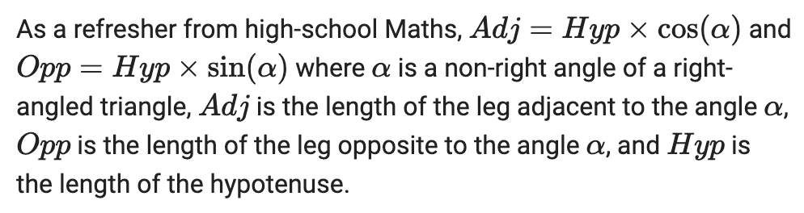

### Hint

The cos and sin functions can be found in the `math` library, as `cos()` and `sin()`, respectively. The argument to each must be in radians, for which the function `radians()` (which converts an angle in degrees to radians) may come in handy, e.g.:

```python
from math import cos, sin, radians
print(cos(0))
print(sin(radians(90)))
```

```python
1.0
1.0
```

### 待补充

### Solution 72

```python
def triangle_legs(hyp, angle):
    from math import cos, sin, radians
    lst = []
    adj = hyp * cos(radians(angle))
    opp = hyp * sin(radians(angle))
    lst.append(adj)
    lst.append(opp)
    lst.sort()
    return tuple(lst)
```

## 73. Donald Trump's Speech

In this question, we are going to do some analysis of Donald Trump's election speeches, and compare them to some of Barack Obama's speeches.

In `speeches.txt` (included in the tab to the right) there are two speeches: one by Obama (more [here](http://obamaspeeches.com/)), and another by Trump (from [here](http://www.kansascity.com/news/local/news-columns-blogs/the-buzz/article55604115.html)). Some linguists have claimed that Trump's language is simple. One interpretation of this is that he uses short words more frequently. We will write a function that takes a string and returns the top-5 most frequent **word lengths** in the string to find out whether this is the case.

For this problem you should write two functions. The first function `count_lengths()` should take a string `text`, and return a default dictionary containing the frequency counts of each word length. Your function should split `text` up into words based on whitespace using the `.split()` method, without removing punctuation or changing the case of any of the `"words"`.

The second function `top5_word_lengths()` should take a string `text`, and return the list of the (up to) five most-frequent word lengths. It should operate by first calling `count_lengths()` over `text` to generate a dictionary of word lengths, then sorting the word lengths in terms in descending order of frequency, and returning the top 5 (or less in the instance that there aren't 5). In the case of a tie in frequency, the word lengths should be sub-sorted in descending order of word length.

When you submit your code, we will sometimes test your functions in isolation, and sometimes test them separately, so make sure they are properly decoupled (e.g. you don't use global variables).

Your program should behave as follows:

```python
>>> count_lengths("one one was a racehorse two two was one too")
defaultdict(<class 'int'>, {3: 8, 1: 1, 9: 1})
>>> top5_word_lengths("one one was a racehorse two two was one too")
[3, 9, 1]
>>> top5_word_lengths("buffalo buffalo buffalo chicken buffalo")
[7]
>>> top5_word_lengths("the quick brown fox jumped over a lazy dog")
[3, 5, 4, 6, 1]
```

Try running your program on the speeches by copy-pasting them from `speeches.txt` as an argument to your function. Compare with your classmates. Is Trump's language simpler?

### Helper functions

Writing **helper functions** like `count_lengths()` is common practice when coding. It is often helpful to break problems down into multiple subproblems, and solve each independently. You should feel free to do this as much as you like in projects and in Grok. Normally we won't tell you to do it, and instead leave it to your discretion.

### 待补充

### Solution 73

```python
from collections import defaultdict

def count_lengths(text):
    # Your code here.
    text1 = text.split()
    text2 = []
    for word in text1:
        s = len(word)
        text2.append(s)
            
    d ={}
    for word in text2:
        if word in d:
            d[word] += 1
        else:
            d[word] = 1
            
    d = defaultdict(int, d)         
    return d


def top5_word_lengths(text):
    # Your code here.
    text1 = text.split()
    text2 = []
    for word in text1:
        s = len(word)
        text2.append(s)

    d = {}
    for word in text2:
        if word in d:
            d[word] += 1
        else:
            d[word] = 1

    d1 = sorted(d.items(), key=lambda x: x[0], reverse=True)
    
    d1 = sorted(d1, key=lambda x: x[1], reverse=True)

    return [word[0] for word in d1[:5]]
```

## 74. Visualising Factors

Write a program that asks the user for a positive integer `limit` and prints a table to visualize all factors of each integer ranging from 1 to `limit`. A factor $i$ of a number n is an integer which divides $n$ evenly (i.e. without remainder). For example, 4 and 5 are factors of 20, but 6 is not. Each row represents an integer between 1 and 20. The first row represents the number 1, the second row the number 2, and so forth. For a given position $i$ (starting from 1) in a row n, `'* '` indicates that $i$ is a factor of $n$, and `'- '` indicates that it is not.

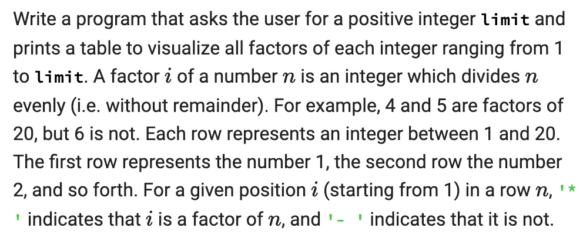

The output of your program should look like this:

```python
Maximum number to factorise: 20
* - - - - - - - - - - - - - - - - - - - 
* * - - - - - - - - - - - - - - - - - - 
* - * - - - - - - - - - - - - - - - - - 
* * - * - - - - - - - - - - - - - - - - 
* - - - * - - - - - - - - - - - - - - - 
* * * - - * - - - - - - - - - - - - - - 
* - - - - - * - - - - - - - - - - - - - 
* * - * - - - * - - - - - - - - - - - - 
* - * - - - - - * - - - - - - - - - - - 
* * - - * - - - - * - - - - - - - - - - 
* - - - - - - - - - * - - - - - - - - - 
* * * * - * - - - - - * - - - - - - - - 
* - - - - - - - - - - - * - - - - - - - 
* * - - - - * - - - - - - * - - - - - - 
* - * - * - - - - - - - - - * - - - - - 
* * - * - - - * - - - - - - - * - - - - 
* - - - - - - - - - - - - - - - * - - - 
* * * - - * - - * - - - - - - - - * - - 
* - - - - - - - - - - - - - - - - - * - 
* * - * * - - - - * - - - - - - - - - * 
```

### Hint

Use the modulus operator (`%`) to test factors! Remember that the modulus operator returns the **remainder after division**. Recall also that `m % n == 0` if and only if `n` is a factor of `m`, e.g.:

```python
print(20 % 5)
print(20 % 6)
print(20 % 7)
```

```python
0
2
6

```

### 待补充

### Solution 74

```python
pro = int(input('Maximum number to factorise: '))
for i in range(1, pro + 1):
    row = ''
    for j in range(1, pro + 1):
        if i % j == 0:
            row += '* '
        else:
            row += '- '
    print(row)
```

## 75. Matching Codons

In molecular biology, a codon refers to a substring of a DNA sequence made up of the nucleotides `A`, `T`, `C` and `G`. The nucleotide `A` always binds with `T`, and `T` always binds with `A`. `A` and `T` are referred to as "base pairs". Similarly, `C` and `G` are base pairs, that is, `C` always binds with `G`, and `G` always binds with `C`. Two codons are complementary if each of their respective nucleotides are base pairs.

Write a function `matching_codons(complements, pool1, pool2)` that takes three arguments: a dictionary `complements` and two lists `pool1` and `pool2`. The dictionary contains the base pairs, and the pools each contain a list of codon sequences. Your task is to find the complementary codon sequence in `pool2` for each codon sequence in `pool1`, and return all matching pairs in following format:

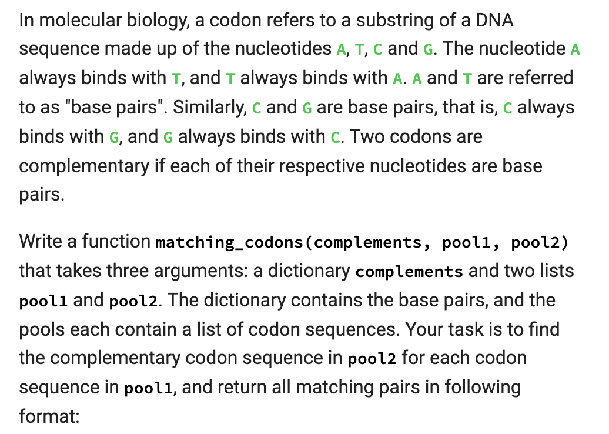

```python
>>> complements = {'A':'T', 'C':'G', 'T':'A', 'G':'C'}
>>> pool1 = ['AAG', 'TAC', 'CGG', 'GAT', 'TTG', 'GTG', 'CAT', 'GGC', 'ATT', 'TCT']
>>> pool2 = ['TAA', 'CTA', 'AAC', 'TTC', 'AGA', 'CCC', 'CCG', 'GTA']
>>> matching_codons(complements, pool1, pool2)
[('AAG', 'TTC'), ('GAT', 'CTA'), ('TTG', 'AAC'), ('CAT', 'GTA'), ('GGC', 'CCG'), ('ATT', 'TAA'), ('TCT', 'AGA')]
```

The return value is a list of 2-tuples of codons. The first item in each tuple is a codon from `pool1` and the second is the matching codon found in `pool2`. For example, the sequences `AAG` (`pool1[0]`) and `TTC` (`pool2[3]`) are complementary as the base pair of `A` is `T` and that of `G` is `C`. For `CCG`, on the other hand, the matching codon (`GGC`) does not occur in `pool2`, and it is thus not contained in the output of the function. The returned list should preserve the original order of `pool1`. Note that you may assume that there are no duplicate codons in `pool1` or `pool2`.

Make sure to use the base pair information given in the `complements` dictionary to identify the complementary codons, and not hard-code any assumptions about base pairs in your code (and expect some of the hidden tests to confirm that you are doing this!).

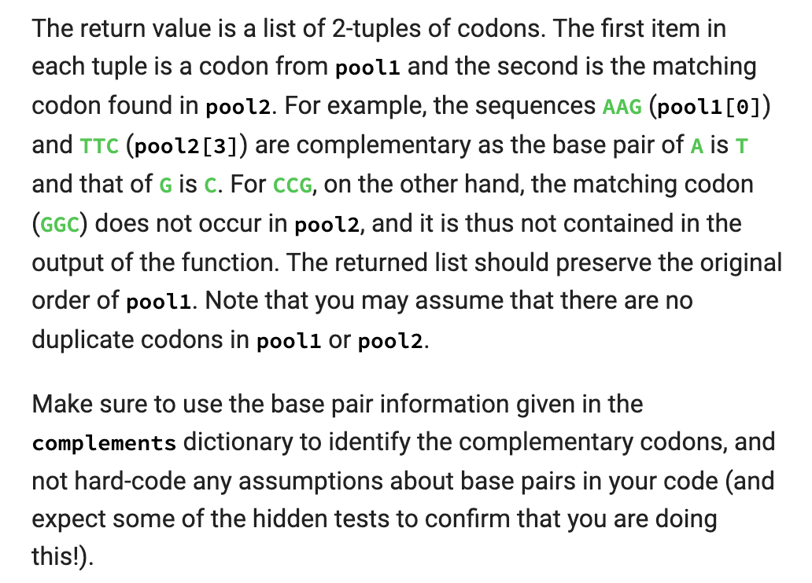


### 待补充

### Solution 75

```python
def matching_codons(complements, pool1, pool2):
    lst = []
    for word1 in pool1:
        complement = ''
        for alp in word1:
            complement += complements[alp]
        if complement in pool2:
            lst.append((word1, complement))
    return lst   
```

## 76. Image Grey Value

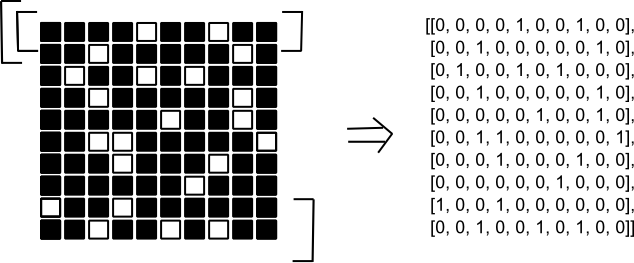

The above figure shows a digital picture represented as a nested list. Each element in the list stores the value of a single pixel. Each pixel is either black or white. A white pixel is represented by `1` and a black pixel by `0`.

Write a Python function `grey_value(image)` which takes an image `image` (represented as a list of lists like above) and returns its **grey value**. The grey value of a black and white picture is defined as the number of white pixels divided by the total number of pixels in the picture. Your function should return the grey value as a single floating-point number in the range `0.0` to `1.0`.

```python
>>> grey_value([[0, 1], [1, 0]])
0.5
>>> grey_value([[0, 1, 1, 0], [1, 0, 1, 1]])
0.625
```

### 待补充

### Solution 76

```python
def grey_value(image):
    lst = []
    for i in image:
        x = i.count(1)
        lst.append(x)
    num = len(image) * len(image[0])
    grey_value =  sum(lst) / num
    return grey_value
```

## 77. Forgetful Karaoke

::: tabs

@tab EN

**Life hack:** if you're really bad at karaoke and can't remember the words, you can just repeatedly sing one word. If it's the most common word in the song, you'll be right more often than you might think (and may get away with it!).

Write a function `approximate_song(filename)` that reads the lyrics of the song in the file of name `filename`, and returns the most common word in the song. In the event of a tie, your function should return the word that comes first alphabetically. Assume that words are whitespace-delimited, and use `.split()` with no stripping of punctuation or folding of case to extract the words from the text.

We have provided lyrics for three songs for you to test your function: `somebody.txt`, `barbrastreisand.txt`, and `fakesong.txt`. Note these are not the only files we will use to test your code. You can see the contents of these files by clicking on the tabs at the top-right of the page. Outputs should be as below:

```python
>>> approximate_song('somebody.txt')
'that'
>>> approximate_song('fakesong.txt')
'dum'
>>> approximate_song('barbrastreisand.txt')
'whooo-oo'
```

@tab ZH

人生技巧：如果你非常不擅长卡拉OK，并且记不住歌词，你可以只反复唱一个词。如果这是歌曲中最常见的词，你会比你想象中的更加准确（而且可能会逃脱惩罚）！

编写一个函数 approximate_song(filename)，它读取文件名为 filename 的歌曲歌词，并返回歌曲中出现最频繁的单词。如果存在并列，则函数应该返回字母表顺序较小的那个单词。假设单词以空格为分隔符，并使用.split()从文本中提取单词，不去除标点符号或改变大小写。

我们为您提供了三首歌曲的歌词，以测试您的函数： somebody.txt，barbrastreisand.txt和fakesong.txt。请注意，这不是我们用于测试代码的唯一文件。您可以通过单击页面右上方的标签查看这些文件的内容。输出应如下所示：

```python
>>> approximate_song('somebody.txt')
'that'
>>> approximate_song('fakesong.txt')
'dum'
>>> approximate_song('barbrastreisand.txt')
'whooo-oo'
```

:::

### Dictionaries

This is very similar to the Top-5 Frequent words problem in Worksheet 11. Feel free to reuse your solution!

::: code-tabs

@tab somebody.txt

```
Now and then I think of when we were together
Like when you said you felt so happy you could die
Told myself that you were right for me
But felt so lonely in your company
But that was love and it's an ache I still remember

You can get addicted to a certain kind of sadness
Like resignation to the end, always the end
So when we found that we could not make sense
Well you said that we would still be friends
But I'll admit that I was glad that it was over

But you didn't have to cut me off
Make out like it never happened and that we were nothing
And I don't even need your love
But you treat me like a stranger and that feels so rough
No you didn't have to stoop so low
Have your friends collect your records and then change your number
I guess that I don't need that though
Now you're just somebody that I used to know

Now you're just somebody that I used to know
Now you're just somebody that I used to know

Now and then I think of all the times you screwed me over
But had me believing it was always something that I'd done
But I don't wanna live that way
Reading into every word you say
You said that you could let it go
And I wouldn't catch you hung up on somebody that you used to know

But you didn't have to cut me off
Make out like it never happened and that we were nothing
And I don't even need your love
But you treat me like a stranger and that feels so rough
No you didn't have to stoop so low
Have your friends collect your records and then change your number
I guess that I don't need that though
Now you're just somebody that I used to know

Somebody
I used to know
Somebody
Now you're just somebody that I used to know
Somebody
I used to know
Somebody
Now you're just somebody that I used to know

I used to know
That I used to know
I used to know
Somebody
```

@tab fakesong.txt

```python
la la la
ho ho ho
dum dum 
di dum
```

@tab barbrastreisand.txt

```python
Barbra Streisand
Oo-oo who-oo-oo whooo-oo oo-oo
Oo-oo who-oo-oo whooo-oo oo-oo
Oo-oo who-oo-oo whooo-oo oo-oo
Barbra Streisand
Oo-oo who-oo-oo whooo-oo oo-oo
Oo-oo who-oo-oo whooo-oo oo-oo
Oo-oo who-oo-oo whooo-oo oo-oo
Oo-oo who-oo-oo whooo-oo
Barbra Streisand

Oo-oo who-oo-oo whooo-oo oo-oo
Oo-oo who-oo-oo whooo-oo oo-oo
Oo-oo who-oo-oo whooo-oo
Barbra Streisand
Oo-oo who-oo-oo whooo-oo oo-oo
Oo-oo who-oo-oo whooo-oo oo-oo
Oo-oo who-oo-oo whooo-oo oo-oo
Oo-oo who-oo-oo whooo-oo oo-oo
Oo-oo who-oo-oo whooo-oo oo-oo
Oo-oo who-oo-oo whooo-oo oo-oo
Oo-oo who-oo-oo whooo-oo oo-oo
Oo-oo who-oo-oo whooo-oo

Barbra Streisand
Oo-oo who-oo-oo whooo-oo oo-oo
Oo-oo who-oo-oo whooo-oo oo-oo
Oo-oo who-oo-oo whooo-oo oo-oo
Oo-oo who-oo-oo whooo-oo
Barbra Streisand
Oo-oo oo-oo oo-oo whooo-oo
Oo-oo who-oo-oo whooo-oo oo-oo
Oo-oo oo-oo oo-oo whooo-oo
Oo-oo who-oo-oo whooo-oo
Barbra Streisand
Oo-oo whooo-oo
Oo-oo whooo-oo oo-oo whooo-oo
Oo-oo whooo-oo
Barbra Streisand
Oo-oo who-oo-oo whooo-oo oo-oo
Oo-oo who-oo-oo whooo-oo oo-oo
Oo-oo who-oo-oo whooo-oo oo-oo
```

:::

### 待补充

### Solution 77

```python
# 定义一个名为 approximate_song 的函数，接收一个文件名作为参数
def approximate_song(filename):
    # 使用 'r' 模式打开文件并将其内容读取到 lyrics 变量中
    with open(filename, 'r') as file:
        lyrics = file.read()

    # 使用 split() 函数将歌词字符串拆分成单词列表
    words = lyrics.split()
    # 创建一个空字典用于存储单词及其出现次数
    word_count = {}

    # 遍历单词列表
    for word in words:
        # 如果单词已经在字典中，将其计数加 1
        if word in word_count:
            word_count[word] += 1
        # 如果单词不在字典中，将其添加到字典中并设置计数为 1
        else:
            word_count[word] = 1

    # 初始化最常见单词变量为 None，以及最大计数变量为 0
    most_common_word = None
    max_count = 0

    # 遍历字典中的每个单词及其计数
    for word, count in word_count.items():
        # 如果当前单词的计数大于最大计数
        if count > max_count:
            # 更新最常见单词为当前单词
            most_common_word = word
            # 更新最大计数为当前单词的计数
            max_count = count
        # 如果当前单词的计数等于最大计数
        elif count == max_count:
            # 如果当前单词在字母顺序上小于最常见单词
            if word < most_common_word:
                # 更新最常见单词为当前单词
                most_common_word = word

    # 返回最常见的单词
    return most_common_word
```

## 78. Concatenate Files

Write a function `concatenate_files(filename1, filename2, new_filename)` that concatenates the text from two source files such that the text from the file named by argument `filename2` follows the text from `filename1`. The concatenated text should be written to a new file with the name given by `new_filename`. Your function must not return anything.

We have provided sample input files named `part1.txt` and `part2.txt` containing a portion of the text from the novel *Alice in Wonderland* to test your function.

### Don't leave them open!

Remember to close your files!

::: code-tabs

@tab part1.txt

```python
Either the well was very deep, or she fell very slowly, for she had plenty of time as she went down to look about her and to wonder what was going to happen next.

```

@tab part2.txt

```python
First, she tried to look down and make out what she was coming to, but it was too dark to see anything; then she looked at the sides of the well, and noticed that they were filled with cupboards and book-shelves; here and there she saw maps and pictures hung upon pegs.

```

:::

### 待补充

### Solution 78

::: tabs

@tab 1

以下是一个满足要求的 `concatenate_files` 函数，我用详细的注释对每一步进行了解释：

```python
def concatenate_files(filename1, filename2, new_filename):
    # 打开 filename1 文件并将其内容读入到变量 file1_content 中
    with open(filename1, 'r') as file1:
        file1_content = file1.read()

    # 打开 filename2 文件并将其内容读入到变量 file2_content 中
    with open(filename2, 'r') as file2:
        file2_content = file2.read()

    # 将 file1_content 和 file2_content 连接起来，形成一个新的字符串 concatenated_content
    concatenated_content = file1_content + file2_content

    # 打开新的文件 new_filename 并将 concatenated_content 写入其中
    with open(new_filename, 'w') as new_file:
        new_file.write(concatenated_content)

# 测试函数，使用提供的样本输入文件 part1.txt 和 part2.txt
concatenate_files('part1.txt', 'part2.txt', 'alice_in_wonderland.txt')
```

该函数首先读取 `filename1` 和 `filename2` 文件中的内容，然后将它们连接成一个新的字符串。最后，将连接后的字符串写入到一个新文件 `new_filename` 中。在这个例子中，我们使用提供的样本输入文件 `part1.txt` 和 `part2.txt` 来测试函数，并将连接后的文本写入到一个名为 `alice_in_wonderland.txt` 的新文件中。

@tab 2

当然可以。下面是一个将读取和写入合并到一个函数中的示例：

```python
def concatenate_files(filename1, filename2, new_filename):
    # 打开 filename1 和 filename2 文件，并将它们的内容分别读入到 file1_content 和 file2_content 变量中
    # 然后将这两个变量的内容连接起来，形成一个新的字符串 concatenated_content
    with open(filename1, 'r') as file1, open(filename2, 'r') as file2:
        file1_content = file1.read()
        file2_content = file2.read()
        concatenated_content = file1_content + file2_content

    # 打开新的文件 new_filename 并将 concatenated_content 写入其中
    with open(new_filename, 'w') as new_file:
        new_file.write(concatenated_content)

# 测试函数，使用提供的样本输入文件 part1.txt 和 part2.txt
concatenate_files('part1.txt', 'part2.txt', 'alice_in_wonderland.txt')
```

在这个版本的函数中，我们同时打开 `filename1` 和 `filename2` 文件，并将它们的内容分别读入到 `file1_content` 和 `file2_content` 变量中。接着将这两个变量的内容连接成一个新的字符串 `concatenated_content`。最后，将连接后的字符串写入到一个新文件 `new_filename` 中。

@tab 3

当然可以。我们可以编写一个单独的函数来读取和写入文件。这样可以让代码更加简洁和模块化。以下是一个修改后的版本：

```python
def read_file_content(filename):
    """读取文件内容并返回"""
    with open(filename, 'r') as file:
        return file.read()

def write_content_to_file(content, filename):
    """将给定内容写入到指定文件中"""
    with open(filename, 'w') as file:
        file.write(content)

def concatenate_files(filename1, filename2, new_filename):
    # 使用 read_file_content 函数分别读取两个文件的内容
    file1_content = read_file_content(filename1)
    file2_content = read_file_content(filename2)

    # 将两个文件的内容连接起来，形成一个新的字符串
    concatenated_content = file1_content + file2_content

    # 使用 write_content_to_file 函数将连接后的内容写入到新文件中
    write_content_to_file(concatenated_content, new_filename)

# 测试函数，使用提供的样本输入文件 part1.txt 和 part2.txt
concatenate_files('part1.txt', 'part2.txt', 'alice_in_wonderland.txt')
```

在这个版本中，我们创建了两个额外的函数 `read_file_content` 和 `write_content_to_file`。`read_file_content` 函数负责读取给定文件名的文件内容并返回。`write_content_to_file` 函数负责将给定的内容写入到指定的文件中。这样，我们的 `concatenate_files` 函数就更加简洁和清晰了。

@tab 不拼接

```python
def concatenate_files(filename1, filename2, new_filename):
    f = open(new_filename, "w")
    f1 = open(filename1, "r")
    text1 = f1.read()
    f1.close()
    f2 = open(filename2, "r")
    text2 = f2.read()
    f2.close()
    f.write(text1)
    f.write(text2)
    f.close()
```

:::

## 79. Sorting CSV Records

Write a function `sort_records(csv_filename, new_filename)` that sorts the records of a CSV file and writes the results as a new CSV file. The first column of the CSV file will be the city name. The rest of the columns will be months of the year. The first row of the CSV file will take the form of the column headings, with all columns other than the first being months of the year. Here is an example file fragment:

> 编写一个函数 sort_records(csv_filename, new_filename)，对一个CSV文件的记录进行排序，并将结果写成一个新的CSV文件。CSV文件的第一列将是城市名称。其余的列将是一年中的几个月。CSV文件的第一行将采用列标题的形式，除第一列外的所有列都是当年的月份。下面是一个文件片段的例子：

::: code-tabs

@tab max_temp.csv

```
city/month,Jan,Feb,Mar,Apr
Melbourne,41.2,35.5,37.4,29.3
Brisbane,31.3,40.2,37.9,29
Darwin,34,34,33.2,34.5
```

:::

Note that your code will be tested over different CSV files, with different ranges of months in them. Irrespective of the exact months contained in the file, you may assume that the city name will always be in the first column, and the months in the remaining columns.

You must sort the data in alphabetical order according to the city name (stored in the first column). Your program should write the sorted records to a new file with the name given by the argument `new_filename`.

Here is an example of how `sort_records()` should work. 'program.py' is the program and below is its terminal output.

---

Note that the row for Melbourne has been sorted below the rows for Brisbane and Darwin because `Melbourne` comes after `Brisbane` and `Darwin`, based on alphabetical ordering.

::: code-tabs

@tab code

```python
sort_records('max_temp.csv', 'sorted.csv')
result = open('sorted.csv')
print(result.read())
result.close()
```

@tab output

```python
city/month,Jan,Feb,Mar,Apr
Brisbane,31.3,40.2,37.9,29
Darwin,34,34,33.2,34.5
Melbourne,41.2,35.5,37.4,29.3
```

:::

### Test File

So you can test your answer, we have provided a full year of data for many Australian cities in a file called `max_temp.csv`. The data was obtained from the [Bureau of Meteorology website](http://www.bom.gov.au/climate/averages/).


## 80. Hottest Month

Write a function `max_city_temp(csv_filename, city)` which analyses temperatures recorded in a CSV file, and returns the maximum temperature recorded for the named city.

Once again, the first column of the CSV file will be the city name, and the rest of the columns will be months of the year. The first row of the CSV file will provide the column headings. Here is an example file fragment:

::: code-tabs

@tab max_temp_small.csv

```python
city/month,Jan,Feb,Mar,Apr
Melbourne,41.2,35.5,37.4,29.3
Brisbane,31.3,40.2,37.9,29
Darwin,34,34,33.2,34.5
```

:::

Here is an example of how `max_city_temp()` should work:

```python
>>> max_city_temp('max_temp_small.csv', 'Brisbane')
40.2
```

### Test File

So you can test your code, we have provided a full year of data for many Australian cities in a file called `max_temp.csv`. The data was obtained from the [Bureau of Meteorology website](http://www.bom.gov.au/climate/averages/).

::: code-tabs

@tab max_temp.csv

```python
city/month,Jan,Feb,Mar,Apr,May,Jun,Jul,Aug,Sep,Oct,Nov,Dec
Melbourne,41.2,35.5,37.4,29.3,23.9,16.8,18.2,25.7,22.3,33.5,36.9,41.1
Brisbane,31.3,40.2,37.9,29,30,26.7,26.7,28.8,31.2,34.1,31.1,31.2
Darwin,34,34,33.2,34.5,34.8,33.9,32,34.3,36.1,35.4,37,35.5
Perth,41.9,41.5,42.4,36,26.9,24.5,23.8,24.3,27.6,30.7,39.8,44.2
Adelaide,42.1,38.1,39.7,33.5,26.3,16.5,21.4,30.4,30.2,34.9,37.1,42.2
Canberra,35.8,29.6,35.1,26.5,22.4,15.3,15.7,21.9,22.1,30.8,33.4,35
Hobart,35.5,34.1,30.7,26,20.9,15.1,17.5,21.7,20.9,24.2,30.1,33.4
Sydney,30.6,29,35.1,27.1,28.6,20.7,23.4,27.7,28.6,34.8,26.4,30.2
```

:::

### Solution 80

::: tabs

@tab 1

```python
import csv

def max_city_temp(csv_filename, city):
    max_temp = None
    with open(csv_filename, 'r') as csvfile:
        csvreader = csv.reader(csvfile)
        headers = next(csvreader)
        for row in csvreader:
            if row[0] == city:
                temp_row = list(map(float, row[1:])) # convert strings to float
                max_temp = max(temp_row)
                break
    return max_temp
```

@tab 2

```python
# 首先，我们需要导入 csv 模块，这个模块可以帮助我们读取和处理CSV文件
import csv

# 定义函数 max_city_temp，这个函数接收两个参数，一个是CSV文件的名字，另一个是城市的名字
def max_city_temp(csv_filename, city):
    # 初始化一个变量 max_temp，用来存储最大温度，初始值为 None
    max_temp = None
    
    # 使用 with open 函数打开 csv 文件，'r' 表示以只读模式打开文件
    with open(csv_filename, 'r') as csvfile:
        # 创建一个 csv.reader 对象，我们可以用这个对象来遍历CSV文件中的每一行
        csvreader = csv.reader(csvfile)
        
        # 使用 next() 函数跳过第一行（标题行）
        headers = next(csvreader)
        
        # 开始遍历 CSV 文件中的每一行
        for row in csvreader:
            # 如果该行的第一列（城市名）与输入的城市名匹配
            if row[0] == city:
                # 使用 map() 函数将剩下的列（温度）转化为浮点数列表
                temp_row = list(map(float, row[1:]))
                
                # 使用 max() 函数找出最大的温度，将其赋值给 max_temp
                max_temp = max(temp_row)
                
                # 找到城市后，就没有必要再继续遍历了，所以使用 break 语句跳出循环
                break
    
    # 返回最大温度
    return max_temp
```


:::

## 81.Hottest City

Write a function `hottest_city(csv_filename)` that analyses the temperatures recorded in a CSV file, and returns a 2-tuple made up of the maximum temperature in the whole dataset, along with a sorted list of the names of cities where that temperature was recorded.

The first column of the CSV file will contain the city name. The rest of the columns will be months of the year. The first row of the CSV files will provide column headings. Here is an example file (with an incomplete set of months):

> 编写一个函数 `hottest_city(csv_filename)`，它可以分析CSV文件中记录的温度，并返回一个由整个数据集中的最高温度以及记录该温度的城市名称的排序列表组成的2元组。CSV文件的第一列将包含城市名称。其余的列将是一年中的月份。CSV文件的第一行将提供列标题。以下是一个示例文件（月份集合不完整）：

::: code-tabs

@tab max_temp_tiny.csv

```python
city/month,Jan,Feb,Mar,Apr
Melbourne,41.2,35.5,37.4,29.3
Brisbane,31.3,40.2,37.9,29
Darwin,34,34,33.2,34.5
```

:::

Here is an example of how `hottest_city()` should work:

```python
>>> hottest_city('max_temp_tiny.csv')
(41.2, ['Melbourne'])
```

### Test File

So you can test your answer, we have provided a full year of data for many Australian cities in a file called `max_temp.csv`. The data was obtained from the [Bureau of Meteorology website](http://www.bom.gov.au/climate/averages/).

::: code-tabs

@tab max_temp_tiny.csv

```python
city/month,Jan,Feb,Mar,Apr
Melbourne,41.2,35.5,37.4,29.3
Brisbane,31.3,40.2,37.9,29
Darwin,34,34,33.2,34.5
```

@tab max_temp.csv

```python
city/month,Jan,Feb,Mar,Apr,May,Jun,Jul,Aug,Sep,Oct,Nov,Dec
Melbourne,41.2,35.5,37.4,29.3,23.9,16.8,18.2,25.7,22.3,33.5,36.9,41.1
Brisbane,31.3,40.2,37.9,29,30,26.7,26.7,28.8,31.2,34.1,31.1,31.2
Darwin,34,34,33.2,34.5,34.8,33.9,32,34.3,36.1,35.4,37,35.5
Perth,41.9,41.5,42.4,36,26.9,24.5,23.8,24.3,27.6,30.7,39.8,44.2
Adelaide,42.1,38.1,39.7,33.5,26.3,16.5,21.4,30.4,30.2,34.9,37.1,42.2
Canberra,35.8,29.6,35.1,26.5,22.4,15.3,15.7,21.9,22.1,30.8,33.4,35
Hobart,35.5,34.1,30.7,26,20.9,15.1,17.5,21.7,20.9,24.2,30.1,33.4
Sydney,30.6,29,35.1,27.1,28.6,20.7,23.4,27.7,28.6,34.8,26.4,30.2
```

:::

## 82. Disentangling list comprehensions

List comprehensions can be baffling verging on incomprehensible at first (joke!), so let's get some experience pulling a list comprehension apart into code that you are more familiar with. Given the following `mystery` function, write an equivalent function `aha(minval, maxval)` with the exact same functionality but which doesn't make use of list comprehensions.

```python
def mystery(minval, maxval):
    return [i**2 % 10 for i in range(minval, maxval + 1)]
```

For example:

```python
>>> aha(3, 7)
[9, 6, 5, 6, 9]
>>> aha(0, 10)
[0, 1, 4, 9, 6, 5, 6, 9, 4, 1, 0]
```

### Solution 82

```python
def aha(minval, maxval):
    output = []
    for i in range(minval, maxval + 1):
        output.append(i**2 % 10)
    return output
```


## 83. Hack the System

::: tabs

@tab EN

A very silly sysadmin has written down the password to a computer that has access to the top-secret military intelligence servers of the [G'Gugvuntts](https://en.wikipedia.org/wiki/List_of_races_and_species_in_The_Hitchhiker's_Guide_to_the_Galaxy). They half-heartedly tore the piece of paper into three pieces and threw it in the rubbish. You are part of the [Vl'hurg](https://en.wikipedia.org/wiki/List_of_races_and_species_in_The_Hitchhiker's_Guide_to_the_Galaxy) Secret Service, and have been charged with placing a worm on their computer which will surreptitiously encrypt their hard drive, so that only you will have access to their data.

An agent on the ground has been pretending to be a garbage truck driver and has found the middle piece of the paper with the password written on it, based on which you know that the password contains:

```
Horse20
```

From psycho-analysis of the sysadmin, we know that the first part of the password is generated from the concatenation of 2 of the following strings in some order:

```python
"Frenchy", "INTENSE", "ComputerScienceFTW", "HelloMrGumby"
```

We also know that the last two digits of the password will be the age of the sysadmin's cat. This is yet to be determined by the agent but they are certain that it's no more than [Creme Puff](https://en.wikipedia.org/wiki/Creme_Puff_(cat)), who was 38 (and at least `"00"`, of course, noting that whatever number it is, it must be rendered as two digits!).

For example, one possible password based on this intelligence is `"HelloMrGumbyComputerScienceFTWHorse2007"`. Yep, for all their faults, the sysadmin must be an accurate and patient typist!

Write a function `hack_it(start, middle, end)` which takes three arguments as input: (1) `start`, a list of at least two words from which the first part of the password is formed; (2) `middle`, a string containing the middle part of the password; and (3) `end`, an integer defining the maximum age for the sysadmin's cat. The function should return a list of all possible password strings, to use in a [brute-force password attack](https://en.wikipedia.org/wiki/Brute-force_attack).

Recall **default arguments**, where the parameters of a function are assigned a default value in the instance that no argument is provided in the function call? In your solution, you should set `start`, `middle`, and `end` to the pre-defined constants `LIKELY_WORDS`, `MIDDLE`, and `CREME_PUFF`, respectively. This is done for you in the template. Ensure you are referring to the variable names `start`, `middle`, and `end` inside your function instead of the constants, since we will be calling your function with some different values to test it!

### Hint

If you are failing the tests due to a mismatch in output, compare your program's output with the expected output carefully for what the difference might be. Given that we are generating a large amount of output, this may seem daunting, but if you step through the output line by line, differences will start to become apparent.

You may wish to copy the output from your program and paste it into a text file to more easily look through the lines.

```python
LIKELY_WORDS = ["Frenchy", "INTENSE", "ComputerScienceFTW", "HelloMrGumby"]
MIDDLE = "Horse20"
CREME_PUFF = 38

def hack_it(start=LIKELY_WORDS, middle=MIDDLE, end=CREME_PUFF):
    # your code here
```

@tab ZH

翻译：一个非常愚蠢的系统管理员把一个可以访问[G'Gugvuntts](https://en.wikipedia.org/wiki/List_of_races_and_species_in_The_Hitchhiker's_Guide_to_the_Galaxy)顶级军事情报服务器的计算机密码写在了纸上。他们马马虎虎地把纸撕成了三片，丢进了垃圾桶。你是[Vl'hurg](https://en.wikipedia.org/wiki/List_of_races_and_species_in_The_Hitchhiker's_Guide_to_the_Galaxy)特工部的一员，负责在他们的计算机上放置一个蠕虫，悄悄地加密他们的硬盘，这样只有你才能访问他们的数据。

地面上的一名特工假扮成垃圾车司机，找到了写有密码的纸片中间部分，根据这部分，你知道密码包含：

```
Horse20
```

通过对系统管理员的心理分析，我们知道密码的第一部分是由以下字符串中的两个按某种顺序拼接而成的：

```python
"Frenchy", "INTENSE", "ComputerScienceFTW", "HelloMrGumby"
```

我们还知道密码的最后两位数字是系统管理员的猫的年龄。特工还没确定这个数字，但他们肯定它不会超过[Creme Puff](https://en.wikipedia.org/wiki/Creme_Puff_(cat))，它的年龄是38岁（当然，至少是“00”，注意，无论是什么数字，它都必须是两位数！）。

例如，根据这些情报，一个可能的密码是`"HelloMrGumbyComputerScienceFTWHorse2007"`。是的，尽管有这么多缺点，系统管理员一定是一个准确且耐心的打字员！

编写一个函数`hack_it(start, middle, end)`，它接受三个输入参数：

（1）`start`，一个至少包含两个单词的列表，密码的第一部分就是从这些单词中组成的；

（2）`middle`，一个字符串，包含密码的中间部分；和

（3）`end`，一个整数，定义系统管理员的猫的最大年龄。该函数应返回一个包含所有可能密码字符串的列表，以便用于[暴力破解密码攻击](https://en.wikipedia.org/wiki/Brute-force_attack)。

请回顾**默认参数**，函数的参数在函数调用中未提供参数时被赋予一个默认值。在您的解决方案中，您应该将`start`、`middle`和`end`分别设置为预定义的常量`LIKELY_WORDS`、`MIDDLE`和`CREME_PUFF`。模板已经为您完成了这一步。确保在函数内部引用变量名`start`、`middle`和`end`，而不是常量，因为我们将用一些不同的值来调用您的函数进行测试！

### 提示

如果您的程序由于输出不匹配而未通过测试，请仔细比较您的程序输出和预期输出之间可能存在的差异。考虑到我们要生成大量的输出，这可能看起来令人生畏，但如果您一行一行地检查输出，差异将开始变得明显。

您可能希望将程序的输出复制并粘贴到文本文件中，以便更轻松地查看各行。

```python
LIKELY_WORDS = ["Frenchy", "INTENSE", "ComputerScienceFTW", "HelloMrGumby"]
MIDDLE = "Horse20"
CREME_PUFF = 38

def hack_it(start=LIKELY_WORDS, middle=MIDDLE, end=CREME_PUFF):
    # your code here
```

@tab 探究👀

```python
from itertools import combinations, permutations

# 数据集
data = ['A', 'B', 'C']
# 

# 排列
result_permutations = list(permutations(data, 2))
print("Permutations:", result_permutations)
# 输出结果：Permutations: [('A', 'B'), ('A', 'C'), ('B', 'A'), ('B', 'C'), ('C', 'A'), ('C', 'B')]

# 组合
result_combinations = list(combinations(data, 2))
print("Combinations:", result_combinations)
# 输出结果：Combinations: [('A', 'B'), ('A', 'C'), ('B', 'C')]
```

@tab 关于两位数整数

## f-string

在Python中，`f-string`（格式化字符串字面值）是一种方便地将变量值嵌入到字符串中的方法。在字符串中使用花括号 `{}` 包含表达式，它将在运行时被其值替换。在花括号内部，可以提供格式说明符，用于控制值的表示方式。

在本例中，`f"{cat_age:02d}"` 使用了一个格式说明符，表示如下：

- `02`：这个部分表示输出的数字应该是两位数。如果数字的位数少于2位，则在数字的左侧用0填充，以达到两位数的长度。
- `d`：这个部分表示我们将以十进制整数的形式格式化数字。

示例：

```python
# 用 f-string 格式化数字
age1 = 3
age2 = 15

formatted_age1 = f"{age1:02d}"
formatted_age2 = f"{age2:02d}"

print(formatted_age1)  # 输出 "03"
print(formatted_age2)  # 输出 "15"
```

在这个示例中，`age1` 的值为3，`age2` 的值为15。通过使用 `f"{age1:02d}"` 和 `f"{age2:02d}"`，我们将它们格式化为两位数的字符串。`formatted_age1` 的值为 "03"（在3前面添加了一个0），而 `formatted_age2` 的值为 "15"（因为它已经是两位数，所以不需要添加额外的 0）。

## 如果不用 f-string 实现呢？

如果不使用 `f-string`，您可以使用 `str.format()` 方法或者 `%` 运算符实现相同的功能。下面是两种替代方法的示例：

1. 使用 `str.format()` 方法：

```python
# 使用 str.format() 方法格式化数字
age1 = 3
age2 = 15

formatted_age1 = "{:02d}".format(age1)
formatted_age2 = "{:02d}".format(age2)

print(formatted_age1)  # 输出 "03"
print(formatted_age2)  # 输出 "15"
```

2. 使用 `%` 运算符：

```python
# 使用 % 运算符格式化数字
age1 = 3
age2 = 15

formatted_age1 = "%02d" % age1
formatted_age2 = "%02d" % age2

print(formatted_age1)  # 输出 "03"
print(formatted_age2)  # 输出 "15"
```

这两种方法都可以实现与 `f-string` 相同的结果。使用 `str.format()` 方法时，您需要在字符串中使用花括号 `{}`，并在其中添加格式说明符。然后调用 `str.format()` 方法，并将要格式化的变量作为参数传递。使用 `%` 运算符时，在字符串中使用 `%` 符号和格式说明符，然后使用 `%` 运算符将要格式化的变量与字符串连接。

## 不使用 f-string 呢？原生的方法

```python
from itertools import permutations

LIKELY_WORDS = ["Frenchy", "INTENSE", "ComputerScienceFTW", "HelloMrGumby"]
MIDDLE = "Horse20"
CREME_PUFF = 38


def condition(num):
    if num // 10 != 0:
        return str(num)
    return f"0{num}"


def hack_it(start=LIKELY_WORDS, middle=MIDDLE, end=CREME_PUFF):
    # 初始化一个空列表，用于存储可能的密码组合
    password_combinations = []

    # 生成 'start' 单词的所有事可能排列
    word_permutations = permutations(start, 2)

    # 遍历排列并将它们连接在一起
    for perm in word_permutations:
        # print(perm)
        # first_part = perm[0] + perm[1]
        first_part = "".join(perm)
        # print(first_part)
        # 遍历从 0 到 'end' 的可能猫的年龄
        for cat_age in range(end + 1):
            # 将 cat_age 格式化为两位数的字符串
            cat_age_str = condition(cat_age)

            # 将我们的第一部分、中间部分和猫的年龄字符串组合成密码
            password = first_part + middle + cat_age_str

            # 将密码添加到组合列表中
            password_combinations.append(password)
    return password_combinations


r = hack_it()
print(r)
```

```python
from itertools import permutations

LIKELY_WORDS = ["Frenchy", "INTENSE", "ComputerScienceFTW", "HelloMrGumby"]
MIDDLE = "Horse20"
CREME_PUFF = 38


def condition(num):
    if num % 10 != num:
        return str(num)
    return f"0{num}"


def hack_it(start=LIKELY_WORDS, middle=MIDDLE, end=CREME_PUFF):
    # 初始化一个空列表，用于存储可能的密码组合
    password_combinations = []

    # 生成 'start' 单词的所有事可能排列
    word_permutations = permutations(start, 2)

    # 遍历排列并将它们连接在一起
    for perm in word_permutations:
        # print(perm)
        # first_part = perm[0] + perm[1]
        first_part = "".join(perm)
        # print(first_part)
        # 遍历从 0 到 'end' 的可能猫的年龄
        for cat_age in range(end + 1):
            # 将 cat_age 格式化为两位数的字符串
            cat_age_str = condition(cat_age)

            # 将我们的第一部分、中间部分和猫的年龄字符串组合成密码
            password = first_part + middle + cat_age_str

            # 将密码添加到组合列表中
            password_combinations.append(password)
    return password_combinations


r = hack_it()
print(r)
```

```python
from itertools import permutations
LIKELY_WORDS = ["Frenchy", "INTENSE", "ComputerScienceFTW", "HelloMrGumby"]
MIDDLE = "Horse20"
CREME_PUFF = 38


def hack_it(start=LIKELY_WORDS, middle=MIDDLE, end=CREME_PUFF):
    # your code here
    lst = []
    word_permutation = permutations(start, 2)
    for perm in word_permutation:
        first_part = perm[0] + perm[1]

        for i in range(end + 1):
            if len(str(i)) == 1:
                num1 = '0' + str(i)
            else:
                num1 = str(i)
                
            password = first_part + middle + num1
            lst.append(password)
    return lst
```

:::


### Solution

```python
from itertools import permutations

# 预定义常量
LIKELY_WORDS = ["Frenchy", "INTENSE", "ComputerScienceFTW", "HelloMrGumby"]
MIDDLE = "Horse20"
CREME_PUFF = 38

def hack_it(start=LIKELY_WORDS, middle=MIDDLE, end=CREME_PUFF):
    # 初始化一个空列表，用于存储可能的密码组合
    password_combinations = []
    
    # 生成 'start' 单词的所有可能排列
    word_permutations = permutations(start, 2)
    
    # 遍历排列并将它们连接在一起
    for perm in word_permutations:
        first_part = perm[0] + perm[1]
        
        # 遍历从0到 'end' 的可能猫的年龄
        for cat_age in range(end + 1):
            # 将 cat_age 格式化为两位数的字符串
            cat_age_str = f"{cat_age:02d}"
            
            # 将第一部分、中间部分和猫的年龄字符串组合成密码
            password = first_part + middle + cat_age_str
            
            # 将密码添加到密码组合列表中
            password_combinations.append(password)
    
    # 返回可能的密码组合列表
    return password_combinations

# 使用给定的输入测试函数
passwords = hack_it()
print(passwords)
```

### Sample solution

```python
from itertools import permutations

LIKELY_WORDS = ["Frenchy", "INTENSE", "ComputerScienceFTW", "HelloMrGumby"]
MIDDLE = "Horse20"
CREME_PUFF = 38

def hack_it(start=LIKELY_WORDS, middle=MIDDLE, end=CREME_PUFF):
    passwords = []
    for first_bit in permutations(start, 2):
        for last_bit in range(end + 1):
            passwords.append(f"{''.join(first_bit)}{middle}{last_bit:02d}")
    return passwords
```

::: details

A very silly sysadmin has written down the password to a computer that has access to the top-secret military intelligence servers of the [G'Gugvuntts](https://en.wikipedia.org/wiki/List_of_races_and_species_in_The_Hitchhiker's_Guide_to_the_Galaxy). They half-heartedly tore the piece of paper into three pieces and threw it in the rubbish. You are part of the [Vl'hurg](https://en.wikipedia.org/wiki/List_of_races_and_species_in_The_Hitchhiker's_Guide_to_the_Galaxy) Secret Service, and have been charged with placing a worm on their computer which will surreptitiously encrypt their hard drive, so that only you will have access to their data.

An agent on the ground has been pretending to be a garbage truck driver and has found the middle piece of the paper with the password written on it, based on which you know that the password contains:

```python
Horse20
```

From psycho-analysis of the sysadmin, we know that the first part of the password is generated from the concatenation of 2 of the following strings in some order:

```python
"Frenchy", "INTENSE", "ComputerScienceFTW", "HelloMrGumby"
```

We also know that the last two digits of the password will be the age of the sysadmin's cat. This is yet to be determined by the agent but they are certain that it's no more than [Creme Puff](https://en.wikipedia.org/wiki/Creme_Puff_(cat)), who was 38 (and at least `"00"`, of course, noting that whatever number it is, it must be rendered as two digits!).

For example, one possible password based on this intelligence is `"HelloMrGumbyComputerScienceFTWHorse2007"`. Yep, for all their faults, the sysadmin must be an accurate and patient typist!

Write a function `hack_it(start, middle, end)` which takes three arguments as input: (1) `start`, a list of at least two words from which the first part of the password is formed; (2) `middle`, a string containing the middle part of the password; and (3) `end`, an integer defining the maximum age for the sysadmin's cat. The function should return a list of all possible password strings, to use in a [brute-force password attack](https://en.wikipedia.org/wiki/Brute-force_attack).

Recall **default arguments**, where the parameters of a function are assigned a default value in the instance that no argument is provided in the function call? In your solution, you should set `start`, `middle`, and `end` to the pre-defined constants `LIKELY_WORDS`, `MIDDLE`, and `CREME_PUFF`, respectively. This is done for you in the template. Ensure you are referring to the variable names `start`, `middle`, and `end` inside your function instead of the constants, since we will be calling your function with some different values to test it!

### Hint

If you are failing the tests due to a mismatch in output, compare your program's output with the expected output carefully for what the difference might be. Given that we are generating a large amount of output, this may seem daunting, but if you step through the output line by line, differences will start to become apparent.

You may wish to copy the output from your program and paste it into a text file to more easily look through the lines.

:::

## 84. Sneaky Files

You are in [space](https://www.youtube.com/watch?v=f4zV4pJ8MwM) again, back on your mission as part of the [Vl'hurg](https://en.wikipedia.org/wiki/List_of_races_and_species_in_The_Hitchhiker's_Guide_to_the_Galaxy) Secret Service.

Cracking the password to the top-secret military server of the [G'Gugvuntts](https://en.wikipedia.org/wiki/List_of_races_and_species_in_The_Hitchhiker's_Guide_to_the_Galaxy) intergalactic army was too easy. Thankfully you remembered that [Creme Puff](https://en.wikipedia.org/wiki/Creme_Puff_(cat)) was 38 — that really narrowed down the options.

[The worm](https://en.wikipedia.org/wiki/Computer_worm) is written and ready, a fine piece of code, utilising a state-of-the-art encryption algorithm that you remembered from a project in a course you took at university. What a fine course that was. But there's no time to reminisce! You need to deploy your dastardly worm and encrypt their server! They will never access it again! HAHA!

In order to do so you need to overwrite a special file so that the worm runs the next time the computer starts. You know that the beginning of the filename is `"boot_"`, and the end is `".txt"`, but in the middle there is a number, which you're pretty sure is between 0 and the age of Creme-Puff (inclusive) once again.

You have access to the function `try_write_worm(fname)`, which tries to write the worm to the filename `fname`. If the file doesn't exist, the function throws an exception `IOError`. If your call to `try_write_worm(fname)` completes without an exception, then the worm was written successfully.

Using this behaviour and your understanding of exception handling, write a function `write_worm()` which calls `try_write_worm(fname)` to find and write the worm to the file, and then returns the correct filename.

### Passing the time

If you ever find you need to fill a block of code without doing anything, try using the keyword `pass`.

Below, if the `elif` branch runs, nothing actually happens, but this could be useful because without it the case of `my_string` starting with `"h"` would have fallen though to the `else`.

```python
my_string = "hello"
if my_string[0] == "a":
    print("Starts with a")
elif my_string[0] == "h":
    pass
else:
    print("Check string")
```

```python
from hidden_lib import try_write_worm

def write_worm():
    # Write your code here.
    pass
```

## 85. Rocket Readings

You are still in [space](https://www.youtube.com/watch?v=tRcPA7Fzebw), blasting away from the moon where you were performing your secret service work; blasting back home for dinner.

Suddenly ... bang! What's that!? Your rocket is spinning wildly out of control! There's no choice: you'll have to jump out into space.

But it's really really cold in space. Or maybe it's really hot. You don't know. But you can find out!

There is a temperature sensor on the outside of the rocket, which you can access by connecting to it. The sensor is an iterator which will return a sequence of values. For testing purposes we have included the sensor `sensor1`, which is sensing a value of around 1 degree celsius. Try connecting, and reading from the sensor (the specific values, and number of values, will differ each time you call it):

```python
>>> sensor1.connect()
>>> next(sensor1)
1.1348676749282975
>>> next(sensor1)
Traceback (most recent call last):
  File "<stdin>", line 1, in <module>
  File "/tmp/tmpXXXXXX/hidden_lib.py", line 52, in __next__
    raise ValueError('Invalid reading')     
ValueError: Invalid reading
```

Unfortunately the wild motion of the rocket is causing the sensor to raise `ValueError`s in between valid results.

There is also a slight chance there might be an alien attached to the sensor which is trying to convince you that the temperature is really cold when it's not. We have also included `bad_sensor1`, which has such an alien attached to it.

Fortunately, sensors have an inbuilt detection mechanism `.check_connection(val)` for detecting these aliens. If you query the sensor enough times in the case that there is an alien attached, it will eventually recognise the alien and shutdown the sensor, as indicated by `.check_connection(val)` throwing a `ValueError`: (your number of calls before an error will be different)

```python
>>> bad_sensor1.connect()
>>> bad_sensor1.check_connection(next(bad_sensor1))
>>> bad_sensor1.check_connection(next(bad_sensor1))
Traceback (most recent call last):
  File "<stdin>", line 1, in <module>
  File "/tmp/tmpXXXXXX/hidden_lib.py", line 59, in check_connection
    raise ValueError('Alien Detected!! Shutting down sensor.')
ValueError: Alien Detected!! Shutting down sensor.
```

Write the function `average_temp(sensor)` which takes a sensor, connects to it, reads all of its values, and returns the average and the number of values it read. It must also check the sensor connection every time it reads a value, but should **not** handle the exception if there is an alien, as we need to shut down the connection as fast as possible. Your function should behave as follows (numbers will differ):

```python
>>> average_temp(sensor1)
(1.0123845485572829, 45)
>>> average_temp(bad_sensor1)
Traceback (most recent call last):
  File "<stdin>", line 1, in <module>
  File "program.py", line 24, in average_temp
    sensor.check_connection(val) 
  File "/tmp/tmpXXXXXX/hidden_lib.py", line 59, in check_connection
    raise ValueError('Alien Detected!! Shutting down sensor.')
ValueError: Alien Detected!! Shutting down sensor.
```

Don't forget to disconnect from sensors when you are finished with them, or the aliens will hack your computer!

### Hint

Remember that a sensor is an iterator. That means you can only loop over it once!

::: tabs

@tab hidden_lib

```python
from random import randint, gauss
from numpy.random import choice
class TempSensor:
    """ iterator that returns temperature values with a given average, and 
    number of values. Sometimes it is invalid, and sometimes its values have
    faulty readings. """
    # The rate of error.
    __E_RATE = 0.1
    # The Sdev of temperature errors (kelvin)
    __SDEV = 0.1
    
    def make_values(self, average, n):
        """Generates a bunch of sensor readings."""
        vals = []
        n_error = int(TempSensor.__E_RATE * n)
        vals = [average + gauss(0, TempSensor.__SDEV) for x in range(n)]

        inds = choice(n, n_error, replace=False)
        for i in inds:
            vals[i] = 'Error'
        self.n_values = n - n_error
        return vals
    
    def __init__(self, average, n, invalid=False):
        if n<=2:
            raise ValueError('Number of values must be greater than 1.')
        self.average = average
        self.values = self.make_values(average, n)
        self.invalid = invalid
        self.count = 0
        self.bogus_time = randint(1, n - 1)
        self.is_open = False
    
    def __iter__(self):
        self.count = 0
        return self
    
    def connect(self):
        self.is_open = True
    
    def disconnect(self):
        self.is_open = False
    
    def __next__(self):
        if not self.is_open:
            raise ConnectionRefusedError('Sensor not connected.')
        if self.count == len(self.values):
            raise StopIteration
        val = self.values[self.count] if not self.invalid else -1
        if (val == 'Error'):
            self.count += 1
            raise ValueError('Invalid reading')     
        self.count += 1
        return val
        
    def check_connection(self, value):
        """ function which throws an invalid-type error """
        if (self.count == self.bogus_time and self.invalid):
            raise ValueError('Alien Detected!! Shutting down sensor.')


sensor1 = TempSensor(1, 50)
bad_sensor1 =  TempSensor(1, 10, True)
```


@tab code

```python
from hidden_lib import TempSensor
from hidden_lib import sensor1
from hidden_lib import bad_sensor1

def average_temp(sensor):
    # Write your code here.
    pass
```

:::


## 86. Inside Image objects

In the editor on the right is an empty Python program, as per normal. However, you might have noticed that above the program are more tabs than usual. They are files containing images (similar to the text and CSV files you worked with in Worksheet 13). Check them out now, in all their artistic beauty!

(You can also upload your own image files, or create new Python program files by pressing the '+' icon to the right of these tabs.)

Your task for this problem is to write a program that asks the user for a filename, opens the image with that filename, and prints out its mode and dimensions. Here's an example of how your output should be formatted:

```python
Enter a filename: rabbit.png

Summary of rabbit.png
Mode: L
Width: 66px
Height: 100px
```

Note the blank line between the input line and the summary (is there some way to `print()` nothing?), and the inclusion of unit `px` (pixels) after each dimension.

```python
import PIL.Image as pim
```

::: tabs

@tab rabbit.png


@tab panda.png


@tab hippo.png


@tab Answer

```python
from PIL import Image

filename = input("Enter a filename:")

# 打开图片
img = Image.open(filename)

print("Summary of {}".format(filename))
print("Mode: {}".format(img.mode))
print("Width: {}".format(img.width))
print(f"Height: {img.height}")
```

@tab 解析

这个问题的任务是编写一个程序，该程序询问用户一个文件名，打开该文件名的图像，并打印出其模式和尺寸。以下是一个输出应如何格式化的例子：

输入一个文件名：rabbit.png

rabbit.png 的概要
模式：L
宽度：66像素
高度：100像素

请注意，在输入行和概要之间的空行（有什么办法可以print()空的内容吗？），以及在每个尺寸后的单位px（像素）。

下面是一个基础的Python程序，该程序使用Python的PIL（Pillow）库来打开和获取图像信息。注意这个代码需要在安装了Pillow库的环境中运行。

```python
from PIL import Image

filename = input("请输入一个文件名：")

# 打开图片文件
img = Image.open(filename)

# 输出图片的模式和尺寸
print(f"\n{filename}的概要")
print(f"模式：{img.mode}")
print(f"宽度：{img.width}像素")
print(f"高度：{img.height}像素")
```

这个程序首先从用户那里接收一个文件名，然后使用Pillow库的Image.open()函数打开该文件。然后，它输出一个空行（使用"\n"），然后输出文件名，模式，宽度和高度。这里的img.mode, img.width, img.height都是Image对象的属性，它们分别表示图像的模式（如"RGB"或"L"），宽度和高度。

注意这个程序没有处理文件打开失败的情况，例如如果文件不存在或者不是有效的图像文件。在实际的代码中，可能需要添加错误处理代码来处理这些情况。

@tab 标准答案

```python
import PIL.Image as pim

filename = input("Enter a filename: ")

print()

print(f"Summary of {filename}")
image = pim.open(filename)
print(f"Mode: {image.mode}")
print(f"Width: {image.width}px")
print(f"Height: {image.height}px")
```

:::

## 87. Smile!

Using what you have learned about the tools available from Pillow, write a program (yes, a program, so if you write a function, make sure to call it) that creates the following 9 by 7 black and white image, and saves it to a file named 'smile.png'.


::: tabs

@tab soultion

```python
import PIL.Image as pim

smile = pim.new('1', (9, 7))

smile.putpixel((3, 1), 1)
smile.putpixel((3, 2), 1)
smile.putpixel((5, 1), 1)
smile.putpixel((5, 2), 1)
smile.putpixel((2, 4), 1)
smile.putpixel((3, 5), 1)
smile.putpixel((4, 5), 1)
smile.putpixel((5, 5), 1)
smile.putpixel((6, 4), 1)

smile.save('smile.png')
```

@tab 详细注释

```python
# 引入PIL库的Image模块，这是一个处理图像的Python库
import PIL.Image as pim

# 创建一个新的9x7的图像，颜色模式为'1'，这是一个2色模式(黑和白)，并将该图像赋值给smile变量
smile = pim.new('1', (9, 7))

# 在图像的特定位置放置一个像素点，像素点的颜色为1，也就是白色。
# 在这里和下面的几行中，你可以看到位置参数是一个坐标元组，形式为(x, y)。
# 请注意，在图像处理中，左上角的坐标是(0, 0)，x轴向右延伸，y轴向下延伸。
smile.putpixel((3, 1), 1)
smile.putpixel((3, 2), 1)
smile.putpixel((5, 1), 1)
smile.putpixel((5, 2), 1)
smile.putpixel((2, 4), 1)
smile.putpixel((3, 5), 1)
smile.putpixel((4, 5), 1)
smile.putpixel((5, 5), 1)
smile.putpixel((6, 4), 1)

# 将图像保存为'smile.png'
# 这将在你当前的工作目录下创建一个名为'smile.png'的PNG文件，内容就是你创建并修改过的图像。
smile.save('smile.png')
```

在这段代码中，你创建了一个微笑的图像，`'1'` 模式表示这是一个二值图像，所以 1 代表白色，0 代表黑色。你用 `putpixel()` 方法将特定位置的像素点设置为白色，这些位置组合在一起形成了微笑的形状。然后你将创建的图像保存为 PNG 文件。

@tab 函数解析

1. `new(mode, size, color=0)`: 这是Pillow库中的一个函数，用于创建一个新的图像。参数解释如下：
    - `mode`: 图像的颜色模式。例如，'1'代表二值模式（黑色和白色），'RGB'代表红绿蓝颜色模式，'RGBA'代表红绿蓝透明度模式，等等。
    - `size`: 一个元组，表示图像的宽度和高度。例如，(9, 7)会创建一个9像素宽，7像素高的图像。
    - `color`(可选参数)：图像的初始颜色。如果没有指定，那么默认颜色是0（黑色）。对于多色模式（如'RGB'），color参数可以是一个包含颜色值的元组。

2. `putpixel(xy, value)`: 这是Pillow图像对象的一个方法，用于改变一个像素点的颜色。参数解释如下：
    - `xy`: 一个元组，表示要改变的像素的坐标。左上角的坐标是(0, 0)，x坐标向右增加，y坐标向下增加。
    - `value`: 要设置的像素的颜色。对于二值图像，这可以是0（黑色）或1（白色）。对于'RGB'图像，这是一个包含三个颜色值的元组。

:::

## 88. X marks the spot

To practice looping through pixels, write a program that creates a 50 by 50 black and white image. The image should be have a black background with a white 'X' stretching across the entire image from each of the corners. Your program should create this image and save it as 'output.png'.

A diagram of the expected output image is shown here:

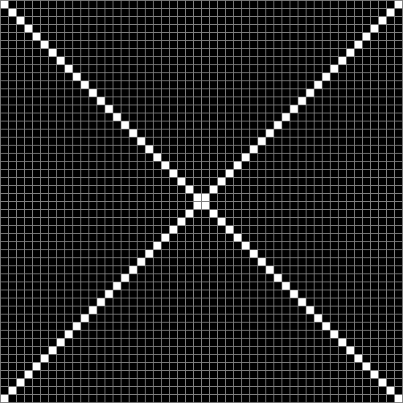

### Challenge:

There are two white lines in this image, but can you find a way to draw them with only one loop?

```python
import PIL.Image as pim

image = pim.new('1', (50, 50))
for i in range(50):
    image.putpixel((i, i), 1)
    image.putpixel((i, 49 - i), 1)

image.save('output.png')
```

## 89. Drawn and quartered

To practice filling part of an image with a nested `for` loop, write a program that creates a 32 by 24 black and white image of the following pattern:

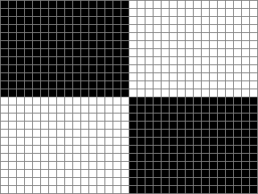

This pattern is evenly divided into four sections (therefore each section is 12 pixels tall and 16 pixels wide).

Your program should create this image and save it as `'output.png'`.

```python
import PIL.Image as pim

image = pim.new('1', (32, 24), 1)
for i in range(16):
    for j in range(12):
        image.putpixel((i, j), 0)
        image.putpixel((16 + i, 12 + j), 0)

image.save('output.png')
```

## 90. Negative

Write a program to apply a 'negative' filter on a greyscale image. The program should ask the user to enter a filename, open this file, perform the transformation (as described below) and then save the negative version of the image to the file 'output.png'.

To perform the negative effect, set each pixel in the output image to the **opposite** colour value than the corresponding pixel in the input image. For example, a colour value of 0 would become 255, 1 would become 254, 253 would become 2, and so on.

Here is an example of the effect your program should produce:


```python
Enter a filename: astronaut.png
```


::: tabs

@tab astronaut.png


@tab code

```python
import PIL.Image as pim

filename = input("Enter a filename: ")
original = pim.open(filename)
image = pim.new("L", original.size)
for x in range(image.width):
    for y in range(image.height):
        colour_value = original.getpixel((x, y))
        negative = 255 - colour_value
        image.putpixel((x, y), negative)
image.save('output.png')
```

@tab 代码注释

```python
# 导入Python Imaging Library (PIL)库中的Image模块，将其重命名为pim。
import PIL.Image as pim

# 从用户输入获取文件名。
filename = input("Enter a filename: ")

# 使用PIL库的open方法打开用户指定的图片文件，并将结果保存在变量original中。
original = pim.open(filename)

# 使用PIL库的new方法创建一个新的灰度图片（"L"表示灰度图像，8位像素，黑和白），大小与原图片相同，并将结果保存在变量image中。
image = pim.new("L", original.size)

# 对新创建的图片中的每一个像素进行遍历。
for x in range(image.width):
    for y in range(image.height):
        # 使用getpixel方法获取原图片在(x, y)位置的像素值。
        colour_value = original.getpixel((x, y))

        # 计算负片效果的像素值。负片效果是通过从最大像素值255中减去原像素值来实现的。
        negative = 255 - colour_value

        # 使用putpixel方法将计算得到的负片像素值放入新图片的对应位置。
        image.putpixel((x, y), negative)

# 使用save方法将新创建的图片保存为output.png。
image.save('output.png')
```

这段代码创建了一张新的图片，它的像素值是原始图片对应像素值的负片效果。也就是说，每个像素值被替换为255（8位像素的最大值）减去原始像素值。这在视觉效果上产生了原始图片的负片，黑白颠倒。

@tab 讲解函数：getpixel、putpixel

`getpixel()` 和 `putpixel()` 是 Python Imaging Library (PIL) 中 `Image` 类的方法，用于处理图像中的像素。

1. `getpixel()`: 这个函数用于获取图像上指定位置的像素值。函数需要一个包含两个整数的元组作为参数，表示要获取像素值的位置（x, y）。这个元组中的第一个元素是水平坐标（左到右），第二个元素是垂直坐标（上到下）。这个函数会返回在指定位置的像素值。对于灰度图像，返回的是一个整数（0-255）。对于彩色图像，返回的是一个包含三个整数的元组，表示红、绿、蓝三个颜色通道的值（每个通道的值范围也是0-255）。

2. `putpixel()`: 这个函数用于在图像上指定位置设置像素值。函数需要两个参数：第一个参数是一个包含两个整数的元组，表示要设置像素值的位置（x, y），第二个参数是要设置的像素值。对于灰度图像，像素值应该是一个整数（0-255）。对于彩色图像，像素值应该是一个包含三个整数的元组，表示红、绿、蓝三个颜色通道的值（每个通道的值范围也是0-255）。

在代码中，`getpixel()` 函数用于获取原图像上的像素值，`putpixel()` 函数用于在新创建的图像上设置像素值，从而实现了负片效果。

@tab getpixel 返回值是(124, 124, 124, 255)，每个位置是代表啥？

`getpixel()` 返回的是一个四元组 (R, G, B, A)，每个元素代表的是：

1. R: 红色（Red）通道的值。这是一个介于0到255之间的整数，表示像素的红色分量。数值越大，红色越浓。

2. G: 绿色（Green）通道的值。这也是一个介于0到255之间的整数，表示像素的绿色分量。数值越大，绿色越浓。

3. B: 蓝色（Blue）通道的值。这同样是一个介于0到255之间的整数，表示像素的蓝色分量。数值越大，蓝色越浓。

4. A: Alpha通道的值，也称为透明度（Transparency）或不透明度（Opacity）。这是一个介于0到255之间的整数，表示像素的透明度。数值越大，像素越不透明，反之越透明。

在你的例子中，`(124, 124, 124, 255)` 表示一个灰色（因为红绿蓝三通道的值相等）且完全不透明（因为Alpha值为255，表示完全不透明）的像素。

:::


::: details 公众号：AI悦创【二维码】


:::

::: info AI悦创·编程一对一

AI悦创·推出辅导班啦，包括「Python 语言辅导班、C++ 辅导班、java 辅导班、算法/数据结构辅导班、少儿编程、pygame 游戏开发、Web、Linux」，全部都是一对一教学：一对一辅导 + 一对一答疑 + 布置作业 + 项目实践等。当然，还有线下线上摄影课程、Photoshop、Premiere 一对一教学、QQ、微信在线，随时响应！微信：Jiabcdefh

C++ 信息奥赛题解，长期更新！长期招收一对一中小学信息奥赛集训，莆田、厦门地区有机会线下上门，其他地区线上。微信：Jiabcdefh

方法一：[QQ](http://wpa.qq.com/msgrd?v=3&uin=1432803776&site=qq&menu=yes)

方法二：微信：Jiabcdefh

:::


