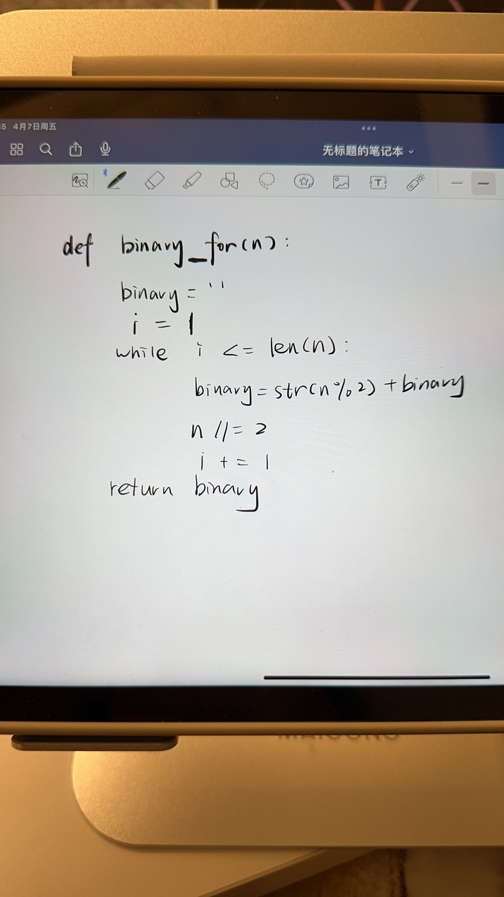
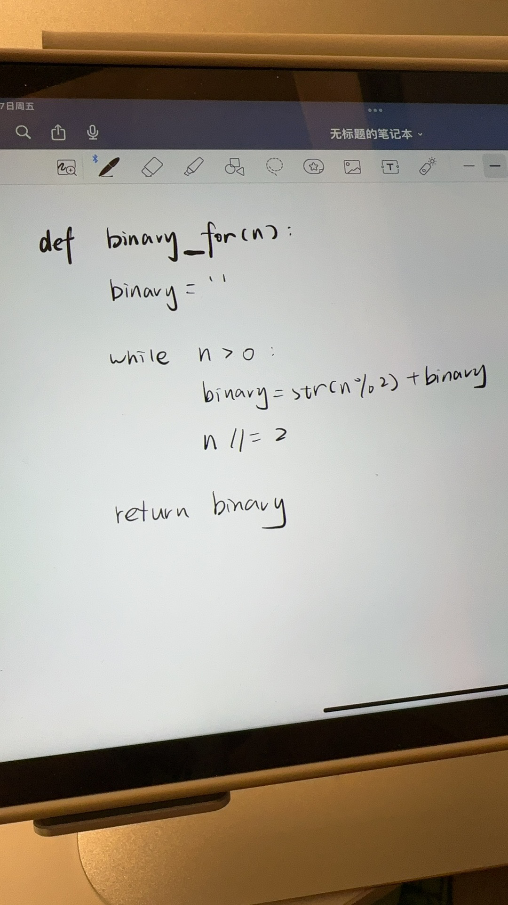

## 0. 介绍

1. 🌟：难度
2. ⚠️：注意
3. 🔥：错题

## 1. for & while 输出 0～10 个数🌟

::: code-tabs

@tab for-loop

```python
for i in range(0, 11):
    print(i)
```

@tab while-loop

```python
i = 0
while i < 11:
    print(i)
    i += 1
```

@tab 注意⚠️

```python
i = 0
while i < 11:
    i += 1  # i 放在这里，会造成的原因就是 i 为 0 的时候，还没来得及输出，就被 +1 了。当然，具体要看你的需求而定。
    print(i)
```

:::

## 2. 计算 1 到 10 的和🌟

::: code-tabs

@tab for-loop

```python
sum = 0
for i in range(1, 11):
    sum += i
print(sum)
```

@tab while-loop🔥

```python
sum = 0
i = 1
while i <= 10:
    sum += i
    i += 1
print(sum)
```

:::

## 3. 打印 1 到 10 的偶数🌟

::: code-tabs

@tab for-loop

```python
for i in range(2, 11, 2):
    print(i)
```

@tab while-loop

```python
i = 2
while i <= 10:
    print(i)
    i += 2
```

:::

## 4. 计算 1 到 15 的乘积🌟

::: code-tabs

@tab for-loop

```python
product = 1
for i in range(1, 16):
    product *= i
print(product)
```

@tab while-loop

```python
product = 1
i = 1
while i <= 15:
    product *= i
    i += 1
print(product)
```

:::

## 5. 打印 1 到 20 的奇数🌟🌟

::: code-tabs

@tab for-loop

```python
for i in range(1, 21, 2):
    print(i)
```

@tab while-loop

```python
i = 1
while i <= 20:
    if i % 2 != 0:
        print(i)
    i += 1
```

:::

## 6. 计算给定列表中的最小值🌟🌟🌟

::: code-tabs

@tab for-loop

```python
# 给定 Python 实现代码实现 while 版本
numbers = [4, 2, 9, 7, 5, 1, 8, 3]
min_number = numbers[0]
for number in numbers:
    if number < min_number:
        min_number = number
print(min_number)
```

@tab while-loop

```python
numbers = [4, 2, 9, 7, 5, 1, 8, 3]
min_number = numbers[0]
i = 0
while i < len(numbers):
    if numbers[i] < min_number:
        min_number = numbers[i]
    i += 1
print(min_number)
```

:::

::: tip 作业1

找到列表中的最大值。

:::

## 7. 计算一个整数的平方根（只保留整数部分）🌟🌟

::: code-tabs

@tab for-loop

```python
# 给定 Python 实现代码实现 while 版本
num = 81
square_root = 0
for i in range(1, num + 1):
    if i * i <= num:
        square_root = i
    else:
        break
print(square_root)
```

@tab while-loop

```python
num = 81
i = 1
while i * i <= num:
    i += 1
square_root = i - 1
print(square_root)
```

:::

## 8. 按逆序打印一个整数🌟🌟🌟🌟

::: code-tabs

@tab for-loop

```python
num = 12345
reversed_num = ''
for digit in str(num):
    reversed_num = digit + reversed_num
print(reversed_num)
```

@tab while-loop

```python
num = 12345
while num > 0:
    print(num % 10, end="")
    num //= 10
```

@tab 1

```python
num = 12345
index = 0
target_string = str(num)
new_s = ""
while index < len(target_string):
    char = target_string[index]
    # print(char)
    new_s = char + new_s
    index += 1

print(new_s)
```


:::

## 9. 计算一个整数的素数因子🌟🌟🌟🌟

::: code-tabs

@tab for-loop

```python
num = 60
prime_factors = []
for i in range(2, num + 1):
    while num % i == 0:
        prime_factors.append(i)
        num //= i
    if num == 1:
        break
print(prime_factors)
```

@tab while-loop

```python
num = 60
i = 2
while i * i <= num:
    if num % i == 0:
        print(i)
        num //= i
    else:
        i += 1
if num > 1:
    print(num)
```

:::

我们来用白话解释计算一个整数的素数因子的过程。

首先，让我们理解一下什么是素数因子。素数因子指的是一个整数的因子中，是素数的那些因子。素数是只能被 1 和它自身整除的正整数，例如 2、3、5、7 等。

现在，我们来看如何计算一个整数的素数因子。假设我们要计算数字 60 的素数因子。我们可以按照以下步骤进行：

1. 从 2 开始，检查是否能整除 60。可以，所以 2 是 60 的一个素数因子，然后将 60 除以 2，得到 30。继续用 2 试，发现 30 也可以被 2 整除，所以再次将 30 除以 2，得到 15。
2. 接下来，尝试 3。发现 15 可以被 3 整除，所以 3 是 15 的一个素数因子，然后将 15 除以 3，得到 5。
3. 现在，我们已经得到了一个素数 5。因为 5 只能被 1 和它自身整除，所以我们不需要继续检查更大的数字。此时，我们已经找到了所有的素数因子。

所以，数字 60 的素数因子有：2、2、3、5。

通过这个例子，我们可以总结出计算一个整数的素数因子的方法：

1. 从 2 开始，依次检查每个数字是否能整除给定的整数。
2. 如果当前的数字可以整除给定的整数，那么这个数字就是一个素数因子，然后将整数除以这个数字，得到一个新的整数。
3. 继续检查新得到的整数，重复上述过程。
4. 当整数被分解为 1 时，说明已经找到了所有的素数因子。

## 10. 计算斐波那契数列的前 n 个数🌟🌟🌟🌟🌟

::: code-tabs

@tab for-loop待定

```python
def fib_for(n):
    fib_seq = [1, 1]
    for i in range(2, n):
        fib_seq.append(fib_seq[-1] + fib_seq[-2])
    return fib_seq[:n]
```

@tab while-loop待定

```python
def fib_while(n):
    fib_seq = [1, 1]
    i = 2
    while i < n:
        fib_seq.append(fib_seq[-1] + fib_seq[-2])
        i += 1
    return fib_seq[:n]
```

@tab for

```python
def fib_for(n):
    if n <= 0:
        return []
    elif n == 1:
        return [1]
    fib_seq = [1, 1]
    for i in range(2, n):
        fib_seq.append(fib_seq[-1] + fib_seq[-2])
    return fib_seq
```

@tab while

```python
def fib_while(n):
    if n <= 0:
        return []
    elif n == 1:
        return [1]
    fib_seq = [1, 1]
    i = 2
    while i < n:
        fib_seq.append(fib_seq[-1] + fib_seq[-2])
        i += 1
    return fib_seq
```

:::

## 11. 求两个整数的最大公约数🌟🌟🌟

### 11.1 概念解析

最大公约数就像是两个朋友想要分享一些小石头或糖果。他们想要平均地分配这些物品，每个人得到相同的数量，而不留下剩余的东西。最大公约数就是他们能够公平分享的最大数量。

举个例子，假设有8颗糖果和12颗糖果，我们想找出它们之间的最大公约数。我们可以先列出他们各自的约数：

8的约数：1, 2, 4, 8 12的约数：1, 2, 3, 4, 6, 12

从这些约数中，我们发现共同的约数有1、2和4。其中，最大的一个就是4，所以8和12的最大公约数就是4。这意味着两个孩子可以公平地把糖果分成4份，每人分到相同数量的糖果，而且不会有剩下的糖果。

::: code-tabs

@tab for-loop

```python
def gcd_for(a, b):
    gcd = 1
    for i in range(2, min(a, b) + 1):
        if a % i == 0 and b % i == 0:
            gcd = i
    return gcd
```

@tab while-loop

```python
def gcd_while(a, b):
    gcd = 1
    i = 2
    while i <= min(a, b):
        if a % i == 0 and b % i == 0:
            gcd = i
        i += 1
    return gcd
```

:::

## 12. 求一个整数的所有因子🌟🌟🌟🌟

::: code-tabs

@tab for-loop

```python
def factors_for(n):
    factors = []
    for i in range(1, n + 1):
        if n % i == 0:
            factors.append(i)
    return factors
```

@tab while-loop

```python
def factors_while(n):
    factors = []
    i = 1
    while i <= n:
        if n % i == 0:
            factors.append(i)
        i += 1
    return factors
```

:::

## 13. 计算一个整数的阶乘🌟🌟🌟

::: code-tabs

@tab for-loop

```python
def factorial_for(n):
    result = 1
    for i in range(1, n + 1):
        result *= i
    return result
```

@tab while-loop

```python
def factorial_while(n):
    result = 1
    i = 1
    while i <= n:
        result *= i
        i += 1
    return result
```

:::

## 14. 计算一个整数的二进制表示🌟🌟🌟🌟🌟🌟🔥





::: code-tabs

@tab for-loop

```python
def binary_for(n):
    binary = ''
    for _ in range(n.bit_length()):
        binary = str(n % 2) + binary
        n //= 2
    return binary
```

@tab while-loop

```python
def binary_while(n):
    binary = ''
    while n > 0:
        binary = str(n % 2) + binary
        n //= 2
    return binary
```

:::

## 15. 找出一个整数范围内的所有素数🌟🌟🌟🌟🌟🌟

::: code-tabs

@tab for-loop

```python
def primes_for(n):
    primes = []
    for i in range(2, n + 1):
        is_prime = True
        for j in range(2, int(i ** 0.5) + 1):
            if i % j == 0:
                is_prime = False
                break
        if is_prime:
            primes.append(i)
    return primes
```

@tab while-loop

```python
def primes_while(n):
    primes = []
    i = 2
    while i <= n:
        is_prime = True
        j = 2
        while j <= int(i ** 0.5):
            if i % j == 0:
                is_prime = False
                break
            j += 1
        if is_prime:
            primes.append(i)
        i += 1
    return primes
```

:::


::: details 公众号：AI悦创【二维码】


:::

::: info AI悦创·编程一对一

AI悦创·推出辅导班啦，包括「Python 语言辅导班、C++ 辅导班、java 辅导班、算法/数据结构辅导班、少儿编程、pygame 游戏开发、Web、Linux」，全部都是一对一教学：一对一辅导 + 一对一答疑 + 布置作业 + 项目实践等。当然，还有线下线上摄影课程、Photoshop、Premiere 一对一教学、QQ、微信在线，随时响应！微信：Jiabcdefh

C++ 信息奥赛题解，长期更新！长期招收一对一中小学信息奥赛集训，莆田、厦门地区有机会线下上门，其他地区线上。微信：Jiabcdefh

方法一：[QQ](http://wpa.qq.com/msgrd?v=3&uin=1432803776&site=qq&menu=yes)

方法二：微信：Jiabcdefh

:::


