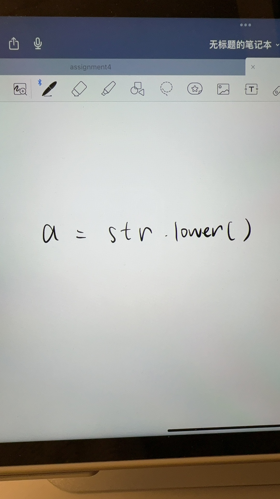
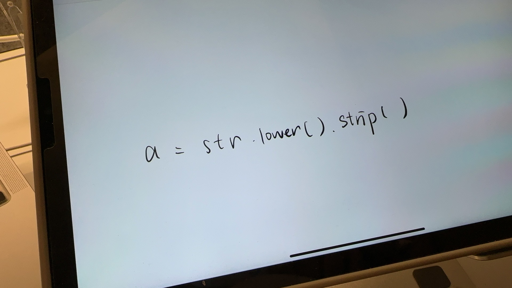
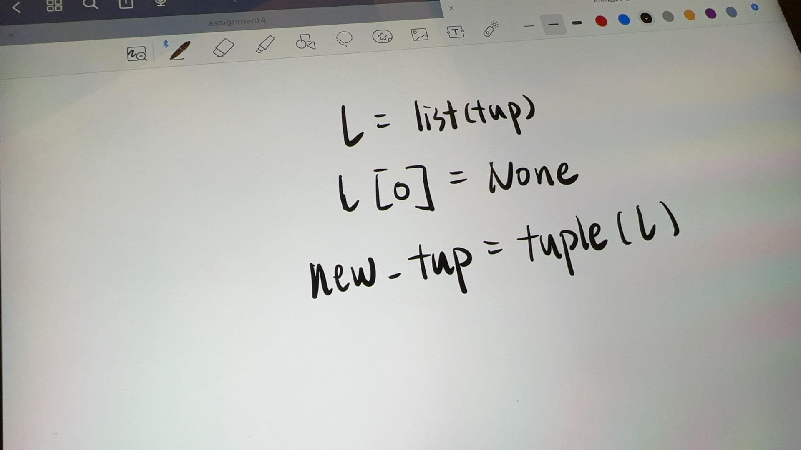
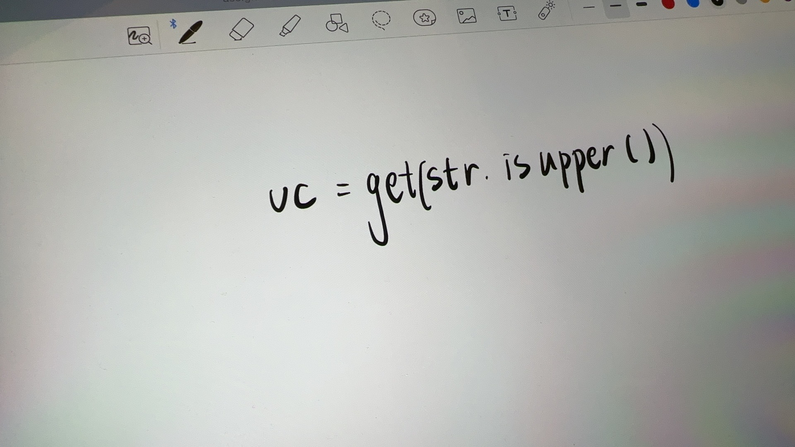
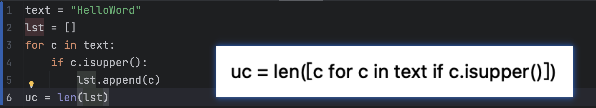

::: center

## School of Computing and Information Systems

## COMP10001 Foundations of Computing

## Practice Mid-Semester Test, April 2023

:::

**Time Allowed: Forty minutes.**

> 允许时间:40分钟。

**Authorized Materials: None.**

> 授权材料:无。

**Instructions to Students:** This paper contains 40 marks, and counts for 10% of your final grade. Be sure to write your student number clearly on the hand-in answer page.

> **学生须知:**这篇论文共40分，占期末成绩的10%。一定要把你的学号清楚地写在答题纸上。

This assessment is **closed book**, and you may **not** make use of any printed, written, or electronic, or online resources.

> 本次评估是**闭卷**，您不得**使用任何印刷、书面、电子或在线资源。

All questions should be answered in the spaces provided on that page. This instruction sheet should not be handed in.

> 所有问题都应在该页的空白处回答。这张说明书不应该交上来。

You must remain in the test venue until the end of the test, and may not leave early.

> 考生必须在考试结束前留在考场，不得提前离开。

You must not communicate with any other student in any way from the moment you enter the test venue until after you have left the test venue. All phones and other network, communication, and electronic devices must be **switched completely off** while you are in the test room.

> 从你进入考场的那一刻起，直到你离开考场后，你都不能以任何方式与任何其他学生交流。当您在考场内时，所有电话和其他网络、通讯和电子设备必须完全关闭。

All material that is submitted as part of this assessment must be completely your own unassisted work, and undertaken during the time period allocated to the assessment.

> 作为评估一部分提交的所有材料必须完全是您自己的独立工作，并在分配给评估的时间内进行。

Calculators and dictionaries are not permitted.

> 不允许使用计算器和字典。

In your answers you may make use of built-in functions, but may not import functions from any other libraries.

> 在你的回答中，你可以使用内置函数，但不能从任何其他库中导入函数。

You may use the back of this page to prepare a draft of any answer, but you must copy your answer onto the hand-in page before the end of the test.

> 你可以使用这一页的背面准备任何答案的草稿，但在考试结束前，你必须将你的答案复制到这一页。

**Only work that is on the hand-in page will be marked.**

> 只有在交作业页上的作业才会被标记。

*A solution to this Practice Quiz will be made available in the LMS on Thursday 13 April.*

> 这个练习测验的答案将于4月13日星期四在LMS中提供。

::: center

Student Number:

:::

## Question 1 (8 marks)

Give the value of each of the following expressions. If you think the expression is not legal accord- ing to the rules of Python, write “Error” in the box.

> 给出下面每个表达式的值。如果您认为表达式不符合 Python 规则，请在方框中写上“错误”。

a. `5 * 6 // 7 + 8 % 9 / 10`

b. `"12" + "2"`

c. `tuple("bird")[::-1]`

d. `"hello hello".split("e")`

## Question 2 (3 marks)

Suppose that text is a Python string. Give a single Python assignment statement that creates a new version of text in which all of the alphabetic characters are converted to lower case, and in which all leading and trailing blank characters have been removed.

> 假设文本是一个 Python 字符串。给出一个 Python 赋值语句，创建一个新版本的文本，其中所有字母字符都转换为小写，并且所有前导和后面的空白字符都被删除。

```python
new_text = text.lower().strip()
```





## Question 3 (3 marks)

Suppose that text is a Python string containing less than 20 characters. Give a single Python as- signment statement that creates a new string text20 that contains text right-justified in a string that is exactly 20 characters long.

> 假设 text 是一个小于 20 个字符的 Python 字符串。给出一个 Python as- signment 语句，创建一个新的字符串 text20，其中包含在恰好 20 个字符长的字符串中右对齐的文本。

```python
text20 = text.rjust(20)
```

- [https://bornforthis.cn/blog/2023/3month/String-Alignment-in-Python-f-string.html](https://bornforthis.cn/blog/2023/3month/String-Alignment-in-Python-f-string.html)

`rjust()` 是一个字符串方法，用于将字符串右对齐，填充指定长度的字符。这个方法有两个参数：第一个参数是指定的宽度，第二个参数是用于填充的字符（可选，默认为空格）。

以下是一个简单的例子：

```python
text = "hello"
text20 = text.rjust(20, '-')
print(text20)
```

输出：

```python
---------------hello
```

---

```python
text = "hello"
text20 = "{:>20}".format(text)
print(text20)
```

在这个例子中，`{}` 中的 `>` 表示右对齐，`20` 是指定的宽度。`text` 变量会被插入到 `{}` 位置，并按照格式要求进行右对齐。

输出：

```python
               hello
```

---

```python
text = "hello"
text20 = f"{text:>20}"
print(text20)
```

输出：

```python
               hello
```

在这个例子中，f-string 中的 `{text:>20}` 表示将 `text` 变量右对齐到一个宽度为 20 的字符串。


## Question 4 (3 marks)

Suppose that tup is a Python tuple. Give a single Python assignment statement that creates a new version of tup in which the first element is replaced by the special value None.

> 假设 tup 是一个 Python 元组。给出一个 Python 赋值语句，创建一个新版本的 tup，其中第一个元素被特殊值 None 取代。

```python
new_tup = (None,) + tup[1:]
```




## Question 5 (3 marks)

Suppose that text is a Python string. Give a single Python assignment statement that assigns the number of uppercase alphabetic characters in text to the variable uc.

> 假设文本是一个 Python 字符串。给出一个 Python 赋值语句，将文本中的大写字母字符数赋给变量 uc。

```python
uc = sum(c.isupper() for c in text)
```

```python
uc = len([c for c in text if c.isupper()])
```





```python
text = "HelloWord"
lst = []
for c in text:
    if c.isupper():
        lst.append(c)
uc = len(lst)
```


## Question 6 (20 marks)

Write a Python function make `change(cents, coins)` that takes two parameters: cents, an in- teger value (in cents); and coins, a list of available coin values in cents that is provided in any order. Your function should return a tuple which contains two components: a list of tuples of coin values and paired frequencies that “make change” for cents, and the amount of change that could not be provided. The coins are to be tried one after the other in decreasing value order, in each case taking the maximum number of coins of each successive denomination. You may only make use of the values that are provided in coins, and if coins is empty no change can be given.

> 写一个 Python 函数 make ' `change(cents, coins)` '，它有两个参数:一个是整型值(以美分为单位): cents;硬币，一个以美分为单位的可用硬币价值列表，以任何顺序提供。
>
> 您的函数应该返回一个元组，其中包含两个组件:一个由硬币值和配对频率组成的元组列表，用于“更改”美分，以及无法提供的更改量。硬币将按价值递减的顺序一个接一个地尝试，在每种情况下，取每个连续面额的硬币的最大数量。您只能使用硬币提供的价值，如果硬币是空的，就不能给任何零钱。

Here are three possible execution sequences:

> 以下是三种可能的执行顺序:

```python
>>> response = make_change(95, [5, 20])
>>> print(response)
([(20, 4), (5, 3)], 0)
>>> response = make_change(95, [])
>>> print(response)
([], 95)
>>> response = make_change(187, [3, 50, 20])
>>> print(response)
([(50, 3), (20, 1), (3, 5)], 2)
```

The last example shows that 187 = 50 × 3 + 20 × 1 + 3 × 5 + 2.

目要求编写一个名为 `make_change(cents, coins)` 的 Python 函数。函数接收两个参数：

1. `cents`：一个整数，表示需要找零的总金额（单位：分）。
2. `coins`：一个整数列表，表示可用的硬币面额（单位：分），列表中的元素可以是任意顺序。

函数需要返回一个包含两个部分的元组：

1. 一个元组列表，每个元组包含两个元素：硬币面额和用于找零的硬币数量。这些硬币的组合能够尽可能接近需要找零的总金额（单位：分）。硬币需要按面额从大到小的顺序尝试，每次都使用尽可能多的较大面额的硬币。
2. 一个整数，表示无法找零的金额（单位：分）。

函数只能使用 `coins` 中提供的面额，如果 `coins` 为空，则无法提供找零。

以下是三个可能的执行示例：

```python
>>> response = make_change(95, [5, 20])
>>> print(response)
([(20, 4), (5, 3)], 0)

>>> response = make_change(95, [])
>>> print(response)
([], 95)

>>> response = make_change(187, [3, 50, 20])
>>> print(response)
([(50, 3), (20, 1), (3, 5)], 2)
```

---

题目要求你编写一个名为 `make_change(cents, coins)` 的 Python 函数，模拟现实生活中找零的过程。函数的目标是计算如何用一组给定面额的硬币找零，使找零的硬币总数最少，并返回找零方案以及可能无法找零的金额。

输入参数：

1. `cents`：一个整数，表示需要找零的总金额（单位：分）。
2. `coins`：一个整数列表，表示可用的硬币面额（单位：分）。列表中的元素可以是任意顺序。

输出结果：

函数应返回一个包含两个部分的元组：

1. 一个元组列表：每个元组包含两个元素：硬币面额和用于找零的硬币数量。这些硬币的组合应尽可能接近需要找零的总金额。
2. 一个整数：表示无法找零的金额（单位：分）。如果找零的硬币组合正好等于需要找零的金额，则这个值为0。

注意事项：

- 函数需要按照面额从大到小的顺序尝试硬币，每次尽可能多地使用较大面额的硬币。
- 函数只能使用 `coins` 中提供的面额。如果 `coins` 为空，那么函数应返回找零失败，无法找零的金额等于需要找零的金额。

举例：

1. 如果输入为 `make_change(95, [5, 20])`，我们需要找零 95 分，可用硬币面额为 5 分和 20 分。函数应返回 `([(20, 4), (5, 3)], 0)`。这表示我们可以用 4 个 20 分硬币（共 80 分）和 3 个 5 分硬币（共 15 分）找零，总共 95 分，无需剩余找零。
2. 如果输入为 `make_change(95, [])`，我们需要找零 95 分，但没有可用的硬币面额。函数应返回 `([], 95)`。这表示我们无法找零，无法找零的金额为 95 分。
3. 如果输入为 `make_change(187, [3, 50, 20])`，我们需要找零 187 分，可用硬币面额为 3 分、50 分和 20 分。函数应返回 `([(50, 3), (20, 1), (3, 5)], 2)`。这表示我们可以用 3 个 50 分硬币（共 150 分）、1 个 20 分硬币（共 20 分）和 5 个 3 分硬币（共 15 分）找零，总共 185 分。但我们仍然需要找零 2 分，这是无法找零的金额。

```python
def make_change(cents: int, coins: list):
    # 题目要求从较大的面额开始
    coins.sort(reverse=True)
    # print(coins)
    change = []  # 用户存储找零的结果
    remaining_cents = cents  # 初始化剩余的零钱

    for coin in coins:
        count = remaining_cents // coin  # 计算当前面额的硬币最大数量
        if count > 0:
            change.append((coin, count))  # 如果数量大于 0，则将当前面额的硬币及数量添加到找零结果中
            remaining_cents -= coin * count  # 更新剩余的零钱

    return change, remaining_cents  # 返回找零结果和剩余的零钱


if __name__ == '__main__':
    response = make_change(95, [5, 20])
    print(response)

    response = make_change(95, [])
    print(response)

    response = make_change(187, [3, 50, 20])
    print(response)
```

```python
import re

def txt_to_srt(txt_file):
    with open(txt_file, 'r', encoding='utf-8') as f:
        lines = f.readlines()
        
    srt_file = txt_file[:-4] + '.srt'
    with open(srt_file, 'w', encoding='utf-8') as f:
        i = 1
        for j in range(0, len(lines), 2):
            start_time = re.findall(r'\d+:\d+:\d+,\d+', lines[j])[0]
            subtitle = lines[j+1].strip()
            end_time = '00:00:00,000'
            f.write(str(i) + '\n')
            f.write(start_time + ' --> ' + end_time + '\n')
            f.write(subtitle + '\n\n')
            i += 1
    print('Convert completed!')

txt_file = input('Please enter the txt filename (including .txt): ')
txt_to_srt(txt_file)
```


::: details 公众号：AI悦创【二维码】


:::

::: info AI悦创·编程一对一

AI悦创·推出辅导班啦，包括「Python 语言辅导班、C++ 辅导班、java 辅导班、算法/数据结构辅导班、少儿编程、pygame 游戏开发、Web、Linux」，全部都是一对一教学：一对一辅导 + 一对一答疑 + 布置作业 + 项目实践等。当然，还有线下线上摄影课程、Photoshop、Premiere 一对一教学、QQ、微信在线，随时响应！微信：Jiabcdefh

C++ 信息奥赛题解，长期更新！长期招收一对一中小学信息奥赛集训，莆田、厦门地区有机会线下上门，其他地区线上。微信：Jiabcdefh

方法一：[QQ](http://wpa.qq.com/msgrd?v=3&uin=1432803776&site=qq&menu=yes)

方法二：微信：Jiabcdefh

:::


