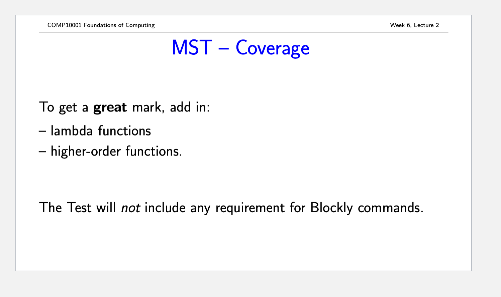
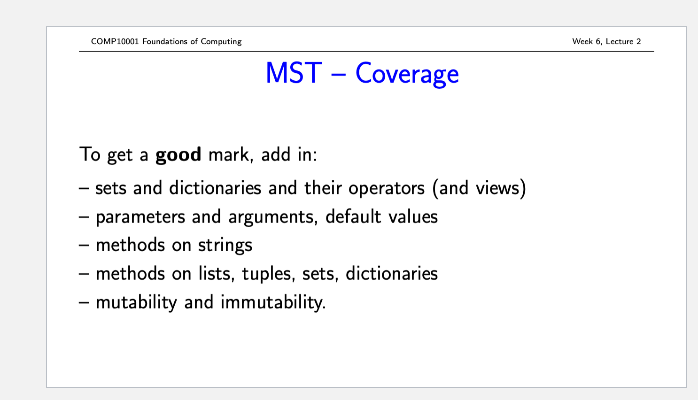
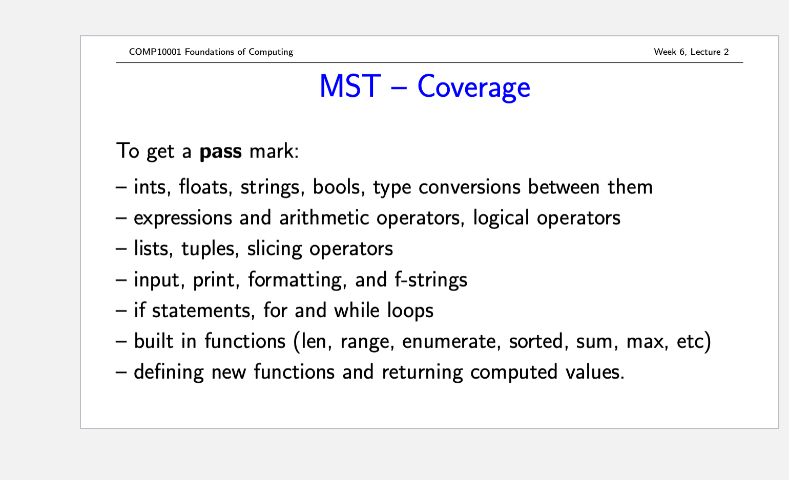

## 字典排序

```python
d = {'b': 1, 'a': 2, 'c': 10, 'd': 0}


def paixu(tup):
    return tup[1]


new_d = sorted(d.items(), key=lambda x: x[1])
# print(new_d)
d = d.items()
new_lst = []
for t in d:
    # print(t)
    key = t[0]
    value = paixu(t)
    new_lst.append(value)

new_lst.sort()
r_lst = []
for i in new_lst:
    for o_t in d:
        if i in o_t:
            r_lst.append(o_t)

print(r_lst)
```

```python
# 定义一个字典，其中包含一些键和对应的值
d = {'a': 3, 'b': 1, 'c': 2}

# 将字典的键值对转换为列表，以便我们可以使用冒泡排序算法对它们进行排序
items = list(d.items())

# 对列表中的元素进行遍历，使用range()函数生成从0到列表长度减1的整数序列
for i in range(len(items)):
    # 对列表中的每一对相邻元素进行遍历，从0开始，直到最后一对相邻元素
    for j in range(len(items) - i - 1):
        # 检查当前元素的值是否大于下一个元素的值
        if items[j][1] > items[j + 1][1]:
            # 如果当前元素的值大于下一个元素的值，则交换它们的位置
            items[j], items[j + 1] = items[j + 1], items[j]

# 将排序后的列表赋值给new_d变量
new_d = items

# 打印排序后的列表
print(new_d)
```

## lambda 专项复习

### 题目1

编写一个 lambda 函数，接收两个参数并返回它们的和。

```python
add = lambda x, y: x + y

# 测试
result = add(3, 5)
print(result)  # 输出：8
```

### 题目2

编写一个 lambda 函数，接收一个字符串参数并返回其大写形式。

```python
to_upper = lambda s: s.upper()

# 测试
result = to_upper("hello")
print(result)  # 输出：HELLO
```

### 题目3

编写一个 lambda 函数，接收一个列表作为参数并返回其中的最大值。

```python
find_max = lambda nums: max(nums)

# 测试
result = find_max([2, 8, 1, 6])
print(result)  # 输出：8
```

### 题目4

编写一个 lambda 函数，接收一个包含数字的列表作为参数，然后返回一个新列表，其中每个元素是原列表中对应元素的平方。

```python
square_elements = lambda nums: list(map(lambda x: x ** 2, nums))

# 测试
result = square_elements([1, 2, 3, 4])
print(result)  # 输出：[1, 4, 9, 16]
```

### 题目3

编写一个lambda函数，接收一个包含字符串的列表作为参数，然后返回一个新列表，其中只包含原列表中长度大于等于5的字符串。

```python
filter_long_strings = lambda strings: [s for s in strings if len(s) >= 5]

# 测试
result = filter_long_strings(["apple", "dog", "banana", "cat"])
print(result)  # 输出：['apple', 'banana']
```



## enumerate()



### 题目1

编写一个函数，使用 `enumerate()`，接收一个包含字符串的列表作为参数，并返回一个字典，其中键是列表中字符串的索引，值是对应的字符串。

```python
def index_to_string(strings):
    return {index: string for index, string in enumerate(strings)}

# 测试
result = index_to_string(["apple", "banana", "cherry"])
print(result)  # 输出：{0: 'apple', 1: 'banana', 2: 'cherry'}
```

### 题目2

编写一个函数，使用 `enumerate()`，接收一个包含整数的列表作为参数，将列表中所有奇数元素的值加倍。

```python
def double_odd_numbers(nums):
    for index, num in enumerate(nums):
        if num % 2 != 0:
            nums[index] *= 2

# 测试
nums = [1, 2, 3, 4, 5]
double_odd_numbers(nums)
print(nums)  # 输出：[2, 2, 6, 4, 10]
```

### 题目3

编写一个函数，使用`enumerate()`，接收一个字符串作为参数，并返回一个字典，其中键是字符串中每个字符的索引，值是对应的字符。要求只返回字母字符，忽略其他字符。

```python
def index_to_letter(s):
    return {index: char for index, char in enumerate(s) if char.isalpha()}

# 测试
result = index_to_letter("hello123world!")
print(result)  # 输出：{0: 'h', 1: 'e', 2: 'l', 3: 'l', 4: 'o', 7: 'w', 8: 'o', 9: 'r', 10: 'l', 11: 'd'}
```

## filter()

Python 中的 `filter()` 函数是一个内置函数，用于过滤序列中的元素。它接收一个函数和一个序列（如列表、元组或字符串）作为参数，并返回一个迭代器，其中包含了序列中满足函数条件的元素。换句话说，对于序列中的每个元素，`filter()`函数会将其传递给指定的函数，并根据该函数返回的布尔值决定是否保留该元素。

让我们看一个简单的示例：

```python
# 定义一个函数，判断数字是否为偶数
def is_even(number):
    return number % 2 == 0

# 定义一个包含整数的列表
numbers = [1, 2, 3, 4, 5, 6, 7, 8, 9]

# 使用filter()函数和is_even()函数过滤出列表中的偶数
even_numbers = list(filter(is_even, numbers))

# 输出结果：[2, 4, 6, 8]
print(even_numbers)
```

在这个示例中，我们首先定义了一个名为 `is_even()` 的函数，用于判断一个数字是否为偶数。然后，我们使用 `filter()` 函数和`is_even()` 函数从一个包含整数的列表中过滤出偶数。最后，我们使用`list()`函数将返回的迭代器转换为列表，并打印结果。

需要注意的是，`filter()`函数返回的是一个迭代器，而不是列表。因此，在某些情况下，您可能需要将迭代器转换为列表，如上面的示例所示。

此外，您还可以使用 lambda 函数作为 `filter()` 函数的参数，如下所示：

```python
# 使用lambda函数过滤出列表中的偶数
even_numbers = list(filter(lambda x: x % 2 == 0, numbers))

# 输出结果：[2, 4, 6, 8]
print(even_numbers)
```

在这个示例中，我们使用了一个 lambda 函数来代替 `is_even()` 函数，实现相同的功能。使用 lambda 函数可以使代码更简洁，尤其是在处理简单的条件判断时。

### 题目1

编写一个函数，使用`filter()`，接收一个包含整数的列表作为参数，并返回一个新列表，其中只包含原列表中的负数。

```python
def filter_negative_numbers(nums):
    return list(filter(lambda x: x < 0, nums))

# 测试
result = filter_negative_numbers([1, -3, 4, -2, 0, -1])
print(result)  # 输出：[-3, -2, -1]
```

### 题目2

编写一个函数，使用 `filter()`，接收一个包含字符串的列表作为参数，并返回一个新列表，其中只包含原列表中的回文字符串（正读和反读都一样的字符串）。

```python
def filter_palindromes(strings):
    return list(filter(lambda s: s == s[::-1], strings))

# 测试
result = filter_palindromes(["level", "hello", "madam", "world", "deed"])
print(result)  # 输出：['level', 'madam', 'deed']
```

### 题目3

编写一个函数，使用`filter()`，接收一个包含整数的列表作为参数，并返回一个新列表，其中只包含原列表中的素数。

```python
def is_prime(num):
    if num < 2:
        return False
    for i in range(2, num):
        if num % i == 0:
            return False
    return True

def filter_primes(nums):
    return list(filter(is_prime, nums))

# 测试
result = filter_primes([1, 2, 3, 4, 5, 6, 7, 8, 9, 10])
print(result)  # 输出：[2, 3, 5, 7]
```


::: details 公众号：AI悦创【二维码】


:::

::: info AI悦创·编程一对一

AI悦创·推出辅导班啦，包括「Python 语言辅导班、C++ 辅导班、java 辅导班、算法/数据结构辅导班、少儿编程、pygame 游戏开发、Web、Linux」，全部都是一对一教学：一对一辅导 + 一对一答疑 + 布置作业 + 项目实践等。当然，还有线下线上摄影课程、Photoshop、Premiere 一对一教学、QQ、微信在线，随时响应！微信：Jiabcdefh

C++ 信息奥赛题解，长期更新！长期招收一对一中小学信息奥赛集训，莆田、厦门地区有机会线下上门，其他地区线上。微信：Jiabcdefh

方法一：[QQ](http://wpa.qq.com/msgrd?v=3&uin=1432803776&site=qq&menu=yes)

方法二：微信：Jiabcdefh

:::


