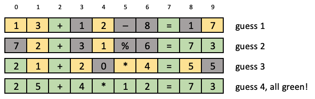
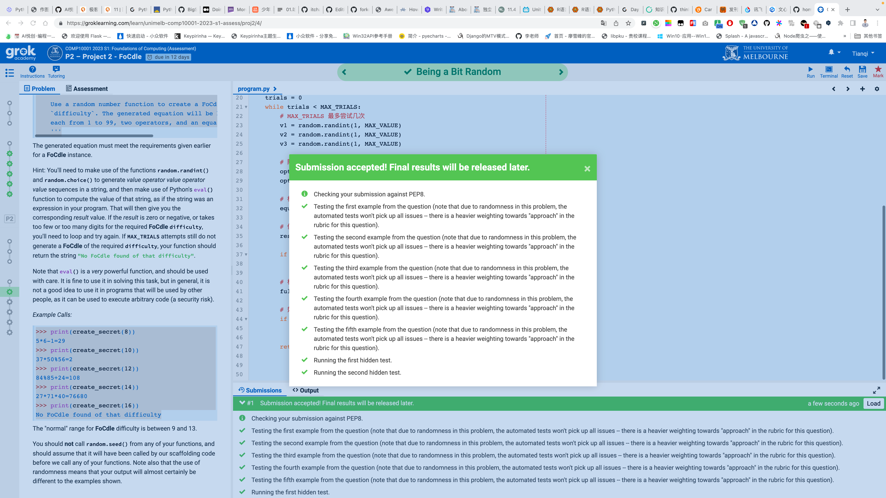

## Preamble

Things to look out for in solving the questions are:

- Make sure to name functions and arguments as stipulated in the question, but never be afraid to create extra functions of your own, so that you break up the code into conceptual sub-parts, and to avoid duplicate code sections.
- Commenting of code is one thing that you will be marked on, covering aspects such as:
    - describing key variables when they are first defined (but not things like index variables in `for` loops)
    - describing what each "chunk" of code does (but not every line).
    - describing what each function does, including what its arguments are, and what it returns, via a suitable "docstring".

Refer back to the Week 7a slides for information about PEP8 layout, and note that deductions will apply if you vary from those expectations.

**Note**: If you make multiple submissions, only the most recent submission will be marked.

## Academic Honesty 1

Academic Honesty

- The project is done **individually** (not in groups)
- All assessment items (worksheets, projects, test and exam) must be **your own, individual, original work**.
- Any code that is submitted for assessment will be automatically compared against other students' code and other code sources using sophisticated similarity checking software.
- Cases of potential copying or submitting code that is not your own may lead to a formal **academic misconduct hearing**.
- Potential penalties can include getting **zero for the project, failing the subject**, or even **expulsion from the university** in extreme cases.
- For further information, please see the university's [Academic Honesty and Plagiarism](https://academicintegrity.unimelb.edu.au/) website, or ask your lecturer.
- The use of ChatGPT or other AI software to answer questions on this assignment is strictly prohibited. You won't learn anything if you don't do the work!

## Academic Honesty 2

The fastest way to fail the subject is to hand in code that is not your own. In particular:

- you must not copy the code of other students.
- you must not make your code available to others to see.
- you must not give other students your login id and password.
- you must not share USB memory drives.
- you must not post your code on public forums, or any other activity, that would make your code available to others.
- you must not ask other students to see their code.
- **you must not submit code that has been written by someone else.**

If other students ask to see your code, you need to say "no", as copying (collusion or plagiarism) is also a form of academic misconduct. All students involved in collusion or code sharing may face penalties – both the student who copied, and the student who made their code available, and regardless of what the code's author was told or believed at the time they shared it.

The prohibition against all forms of sharing remains in force until the marks for this assessment item are released.

Before you start the project, you must watch the videos and complete the quiz under “CIS Academic Honesty Training” on the LMS Modules page

## Introduction

### Background

Many of you will have played "wordle" at some stage over the last few years, and even if you haven't played yourself, will have seen others post their colored "grids" if solved the daily puzzle.

> 你们中的许多人在过去的几年中某个阶段玩过“Wordle”，即使你自己没有玩过，也会看到其他人发布解决了每日谜题的彩色“网格”。

The objective of wordle is to deduce a secret word by accumulation of evidence, lodging one guess at a time and being given information about how many matching characters you had, and whether they were in the right positions. There is also a well-known physical game called *Mastermind* that required similar deductive skills, see this [wikipedia article](https://en.wikipedia.org/wiki/Mastermind_(board_game)), maybe your parents even have a set at home at the back of one of the wardrobes from when they were kids, or maybe you have played it via a phone app.

> Wordle的目标是通过不断猜测、收集证据，并获得有关匹配字符数量和位置是否正确的信息，推断出一个秘密单词。还有一个著名的物理游戏叫做“猜谜语”，需要类似的演绎技能，可以查看这篇[维基百科文章](https://en.wikipedia.org/wiki/Mastermind_(board_game))。也许你的父母甚至在家里的衣柜后面有一套，是他们小时候的时候买的，或者你可能通过手机应用程序玩过它。

In this assignment you are going to develop some functions as part of an implementation of a new game called "**FoCdle**", an entertainment designed for people who prefer numbers to words.

> 在这个作业中，你将开发一些函数，作为一款名为“**FoCdle**”的新游戏实现的一部分，这款娱乐产品专为那些喜欢数字而不是文字的人设计。

In wordle, the target string is a word, and each of your guesses is also a word. In a **FoCdle** the target string is a simple math equation of a known length (measured in characters), and each of your guesses must also be math equations of the same length.

> 在Wordle游戏中，目标字符串是一个单词，而你每次猜测的也是一个单词。而在FoCdle游戏中，目标字符串是一个已知长度的简单数学方程，每次猜测的答案也必须是相同长度的数学方程。

Each cell in the **FoCdle** contains a single digit, or one of four possible operators "`+-*%`", or an "`=`" relationship; and the format of the **FoCdle** is always *value* *operator* *value* *operator* *value* `=` *result*. That is, each **FoCdle** always has exactly two *operator*s, one *equality*, three *value*s, and one *result*. Each *value* is an integer between 1 and 99 inclusive, expressed in the minimum number of digits (no leading zeros); and the *result* is a non-zero non-negative integer also expressed without any leading zeros. The four possible operators are "`+`", "`-`", "`*`", "`%`", all with exactly the same interpretation as in Python, and with the same precedence as in Python ("`*`" and "`%`" are carried out before either of "`+`" or "`-`").

> **FoCdle** 中的每个单元格都包含一个数字或四个可能的运算符 "`+-*%`" 或 "`=`" 关系；而 **FoCdle** 的格式总是 *value* *operator* *value* *operator* *value* `=` *result*。也就是说，每个 **FoCdle** 总是恰好有两个 *operator*，一个 *equality*，三个 *value* 和一个 *result*。每个 *value* 是介于 1 到 99 之间的整数，用最少的数字表示（没有前导零）；而 *result* 是一个非零非负整数，同样没有任何前导零。四个可能的运算符是 "`+`"、"`-`"、"`*`"、"`%`"，它们的解释与 Python 中完全相同，并且具有 Python 中相同的优先级（"`*`" 和 "`%`" 在 "`+`" 或 "`-`" 之前执行）。

The *difficulty* of a **FoCdle** is measured by its length in total characters.

> “FoCdle”的难度是以其总字符长度来衡量。

For example, here is a trace of a person solving a **FoCdle** of difficulty 10. In their first guess they tried the 10-character equation "`13+12-8=17`" and learnt (from the green cells) what the first operator was and where it was located, and got the location of the "`=`" correct. They also learnt (from the yellow cells) that there were at least one each of the digits 1, 2, 3, and 7 (plus for each of those digits, they learnt one character position in which it did *not* appear); and they learnt (from the grey cells) that there was only a single instance of 1, that the second operator wasn't subtraction, and that there were no 8 digits anywhere.

> 例如，这是一个人解决难度为10的FoCdle难题的痕迹。在他们的第一次猜测中，他们尝试了包含10个字符的等式“`13+12-8=17`”，并从绿色的单元格中了解到第一个运算符及其位置，并正确找到了“`=`”的位置。他们还从黄色的单元格中了解到至少有一个数字1、2、3和7（对于这些数字的每个数字，他们了解到一个数字在其中没有出现的字符位置）；并且从灰色的单元格中了解到只有一个数字1，第二个运算符不是减法，并且任何地方都没有数字8。




From that information they formed their second guess "`72+31%6=73`" and submitted it. The response from that told them that the computed value had to be 73; that second operator wasn't "`%`" either; that there were no 6s, only one 7, and only one 3; plus also told them some more positions in which the digits 1 and 2 (which must occur somewhere) could not appear.

> 根据那些信息，他们做出了第二个猜测“`72+31%6=73`”，并提交了它。来自系统的回应告诉他们，计算出的值必须是73；那第二个运算符也不是“`%`”；没有6，只有一个7和一个3；还告诉他们一些数字1和2（必须出现在某个地方）不能出现的位置。

This person's third guess wasn't even a valid equation! But it told them that there was exactly one 5, one or more 4s and no 0s. It also told them that the second operator was a "`*`" and was not in position 6. By pooling all of the available information, the user was able to conclude that there were no 0s (guess 3), one 1 (guess 1), two or more 2s (guess 3), one 3 (guess 2), one or more 4s (guess 3), one five (guess 3), no 6s (guess 2), one 7 (guess 2), and no 8s (guess 1). They also know (because it is difficulty 10) that there are only seven digits in total required across the four numbers (three *value*s and one *result*; so they can conclude that they have found all of the digits, without needing to test digit 9.

> 这个人的第三个猜测甚至不是一个有效的方程！但它告诉他们有且仅有一个5，一个或多个4，以及没有0。它还告诉他们第二个运算符是“*”，并且不在第6位。通过汇总所有可用信息，用户能够得出以下结论：没有0（猜测3），一个1（猜测1），两个或更多的2（猜测3），一个3（猜测2），一个或多个4（猜测3），一个5（猜测3），没有6（猜测2），一个7（猜测2），以及没有8（猜测1）。他们还知道（因为它的难度等级是10）四个数字中只需要七个数字（三个值和一个结果）；所以他们可以得出结论，已经找到了所有数字，而不需要测试数字9。

The accumulation of all that information meant that their fourth guess was the only option that both fitted all of the information clues and was a valid equation, and when they submitted that guess they got the precious "all green" response.

> 所有这些信息的积累意味着他们的第四次猜测是唯一符合所有信息线索并且是一个有效等式的选项，当他们提交了那个猜测时，他们得到了珍贵的“全部正确”的回应。

Your mission in this project is to create some of the functions that might be used to either create and trace a **FoCdle**, and to suggest guesses to the user.

> 你在这个项目中的任务是创建一些函数，用于创建和跟踪FoCdle，并向用户提供猜测。

## Being a Bit Random

### Task 1: Being a Bit Random (3 marks)

> 任务一：有点随意（3分）

Given these lines:

> 鉴于这些行：

```python
import random

DEF_DIFFIC = 10
MAX_TRIALS = 20
MAX_VALUE = 99
OPERATORS = "+-*%"
EQUALITY = "="
DIGITS = "0123456789"
NOT_POSSIBLE = "No FoCdle found of that difficulty"
```

write a function:

> 翻译：编写一个函数：

```python
def create_secret(difficulty=DEF_DIFFIC):
    '''
    Use a random number function to create a FoCdle instance of length 
    `difficulty`. The generated equation will be built around three values 
    each from 1 to 99, two operators, and an equality.
    '''
```

The generated equation must meet the requirements given earlier for a **FoCdle** instance.

> 生成的方程必须符合之前给出的 **FoCdle** 实例的要求。

Hint: You'll need to make use of the functions `random.randint()` and `random.choice()` to generate *value* *operator* *value* *operator* *value* sequences in a string, and then make use of Python's `eval()` function to compute the value of that string, as if the string was an expression in your program. That will then give you the corresponding *result* value. If the *result* is zero or negative, or takes too few or too many digits for the required **FoCdle** `difficulty`, you'll need to loop and try again. If `MAX_TRIALS` attempts still do not generate a **FoCdle** of the required `difficulty`, your function should return the string `"No FoCdle found of that difficulty"`.

> 提示：您需要使用函数`random.randint()`和`random.choice()`来生成一个字符串中的`value operator value operator value`序列，并利用Python的`eval()`函数计算该字符串的值，就像该字符串是程序中的表达式一样。然后，这将给您相应的结果值。如果结果为零或负数，或者位数太少或太多，以满足所需的**FoCdle** `difficulty`，则您需要循环并重试。如果`MAX_TRIALS`尝试仍无法生成所需`difficulty`的**FoCdle**，则您的函数应返回字符串`"No FoCdle found of that difficulty"`。

Note that `eval()` is a *very* powerful function, and should be used with care. It is fine to use it in solving this task, but in general, it is not a good idea to use it in programs that will be used by other people, as it can be used to execute arbitrary code (a security risk).

> 请注意，`eval()` 是一个非常强大的函数，应该小心使用。在解决这个任务中使用它是可以的，但通常情况下，在编写其他人将使用的程序时，不建议使用它，因为它可以用于执行任意代码（存在安全风险）。

*Example Calls:*

> *示例调用:*

```python
>>> print(create_secret(8))
5*6-1=29
>>> print(create_secret(10))
37*50%56=2
>>> print(create_secret(12))
84%85+24=108
>>> print(create_secret(14))
27*71*40=76680
>>> print(create_secret(16))
No FoCdle found of that difficulty
```

The "normal" range for **FoCdle** difficulty is between 9 and 13.

> “FoCdle” 难度的“正常”范围为 9 到 13。

You should **not** call `random.seed()` from any of your functions, and should assume that it will have been called by our scaffolding code before we call any of your functions. Note also that the use of randomness means that your output will almost certainly be different to the examples shown.

> 你**不应该**在任何函数中调用`random.seed()`，而应该假定我们的脚手架代码在调用你的任何函数之前已经调用了它。请注意，使用随机性意味着你的输出几乎肯定与所示的示例不同。

```python
import random

DEF_DIFFIC = 10
MAX_TRIALS = 20
MAX_VALUE = 99
OPERATORS = "+-*%"
EQUALITY = "="
DIGITS = "0123456789"
NOT_POSSIBLE = "No FoCdle found of that difficulty"

def create_secret(difficulty=DEF_DIFFIC):
    '''
    Use a random number function to create a FoCdle instance of length 
    `difficulty`. The generated equation will be built around three values 
    each from 1 to 99, two operators, and an equality.
    '''
    
```

### Answer 

:::: tabs

@tab 题目解析

题目中已经描述了符合条件的 FoCdle 实例的要求。根据题目描述，一个有效的 FoCdle 实例需要满足以下条件：

1. FoCdle 的格式必须是：*value* *operator* *value* *operator* *value* `=` *result*。也就是说，FoCdle 必须包含三个值（每个值是 1 到 99 之间的整数，用最少的位数表示，没有前导零）、两个运算符（四种可能的运算符："`+`"、"`-`"、"`*`" 和 "`%`"，具有与 Python 相同的解释和优先级）、一个等号。

2. 结果（*result*）必须是非零的非负整数，且不带前导零。

3. FoCdle 的难度（长度）必须等于给定的 `difficulty`。换句话说，FoCdle 实例的总字符数（包括值、运算符和等号）必须等于 `difficulty`。

在 `create_secret` 函数中，我们通过随机生成三个值和两个运算符来尝试构建满足条件的 FoCdle 实例。我们使用 `eval()` 函数计算方程的结果，然后检查结果是否大于 0（满足条件 2）。如果结果大于 0，我们将构建完整的方程，并检查完整方程的长度是否等于指定的难度（满足条件 3）。如果完整方程的长度等于指定的难度，我们返回这个 FoCdle 实例。否则，我们继续尝试生成新的 FoCdle 实例，直到达到最大尝试次数。

@tab  答案

## 1. 版本 1

```python
import random

# 定义常量
DEF_DIFFIC = 10
MAX_TRIALS = 20
MAX_VALUE = 99
OPERATORS = "+-*%"
EQUALITY = "="
DIGITS = "0123456789"
NOT_POSSIBLE = "No FoCdle found of that difficulty"

def create_secret(difficulty=DEF_DIFFIC):
    '''
    Use a random number function to create a FoCdle instance of length 
    `difficulty`. The generated equation will be built around three values 
    each from 1 to 99, two operators, and an equality.
    '''
    # 初始化尝试次数
    trials = 0

    # 最多尝试 MAX_TRIALS 次
    while trials < MAX_TRIALS:
        # 生成三个 1 到 99 之间的随机数作为值
        value1 = random.randint(1, MAX_VALUE)
        value2 = random.randint(1, MAX_VALUE)
        value3 = random.randint(1, MAX_VALUE)

        # 从运算符集合中随机选择两个运算符
        op1 = random.choice(OPERATORS)
        op2 = random.choice(OPERATORS)

        # 构建方程
        equation = f"{value1}{op1}{value2}{op2}{value3}"

        # 使用 eval 函数计算方程的结果
        result = eval(equation)

        # 如果结果大于 0（我们不想要负数或零结果）
        if result > 0:
            # 构建完整的方程
            full_equation = f"{equation}{EQUALITY}{result}"
            
            # 如果完整方程的长度等于指定的难度
            if len(full_equation) == difficulty:
                # 返回完整方程
                return full_equation

        # 递增尝试次数
        trials += 1

    # 如果达到最大尝试次数仍未找到满足条件的方程，返回 NOT_POSSIBLE
    return NOT_POSSIBLE
```

## 2. 版本 2

**判断的区别**

```python
# 两个操作符，一个 =
import random

DEF_DIFFIC = 10
MAX_TRIALS = 20
MAX_VALUE = 99
OPERATORS = "+-*%"
EQUALITY = "="
DIGITS = "0123456789"
NOT_POSSIBLE = "No FoCdle found of that difficulty"


def create_secret(difficulty=DEF_DIFFIC):
    '''
    Use a random number function to create a FoCdle instance of length
    `difficulty`. The generated equation will be built around three values
    each from 1 to 99, two operators, and an equality.
    '''
    # 初始化尝试的次数
    trials = 0
    while trials < MAX_TRIALS:
        # MAX_TRIALS 最多尝试几次
        v1 = random.randint(1, MAX_VALUE)
        v2 = random.randint(1, MAX_VALUE)
        v3 = random.randint(1, MAX_VALUE)

        # 随机选择运算符两个
        opt1 = random.choice(OPERATORS)
        opt2 = random.choice(OPERATORS)

        # 构建方程式
        equation = f"{v1}{opt1}{v2}{opt2}{v3}"

        # 使用 eval 函数计算方程式
        result = eval(equation)

        if not (result > 0):
            return "No FoCdle found of that difficulty"

        # 构建完整的方程
        full_equation = f"{equation}{EQUALITY}{result}"

        # 如果完整方程的长度等于指定的难度
        if len(full_equation) != difficulty:
            return "No FoCdle found of that difficulty"

        return full_equation
```

## 3. 版本 3

**汇总判断**

```python
# 两个操作符，一个 =
import random

DEF_DIFFIC = 10
MAX_TRIALS = 20
MAX_VALUE = 99
OPERATORS = "+-*%"
EQUALITY = "="
DIGITS = "0123456789"
NOT_POSSIBLE = "No FoCdle found of that difficulty"


def create_secret(difficulty=DEF_DIFFIC):
    '''
    Use a random number function to create a FoCdle instance of length
    `difficulty`. The generated equation will be built around three values
    each from 1 to 99, two operators, and an equality.
    '''
    # 初始化尝试的次数
    trials = 0
    while trials < MAX_TRIALS:
        # MAX_TRIALS 最多尝试几次
        v1 = random.randint(1, MAX_VALUE)
        v2 = random.randint(1, MAX_VALUE)
        v3 = random.randint(1, MAX_VALUE)

        # 随机选择运算符两个
        opt1 = random.choice(OPERATORS)
        opt2 = random.choice(OPERATORS)

        # 构建方程式
        equation = f"{v1}{opt1}{v2}{opt2}{v3}"

        # 使用 eval 函数计算方程式
        result = eval(equation)

        # 构建完整的方程
        full_equation = f"{equation}{EQUALITY}{result}"

        if result < 0 or len(full_equation) != difficulty:
            return "No FoCdle found of that difficulty"

        return full_equation
```

@tab 解释

## 1. trials 的解释

`trials` 变量用于记录当前已经尝试生成满足条件的 FoCdle 实例的次数。我们使用 `while trials < MAX_TRIALS` 作为循环条件，因为我们希望限制最大尝试次数。如果达到了 `MAX_TRIALS` 次尝试仍然没有生成满足条件的 FoCdle 实例，那么函数将返回 `NOT_POSSIBLE` 字符串。这样做是为了防止在生成满足特定难度条件的实例时陷入无限循环。

`trials` 的目的并非是为了实现更随机的数字，而是为了避免程序在寻找满足条件的 FoCdle 实例时运行过长时间。每次循环都会随机生成三个值和两个运算符，然后检查生成的实例是否满足条件。如果满足条件，函数会立即返回该实例。如果不满足条件，则增加 `trials` 的值并继续尝试。当尝试次数达到 `MAX_TRIALS` 时，函数将停止尝试并返回 `NOT_POSSIBLE`。

@tab submit



@tab 提交通过的代码

```python
import random

DEF_DIFFIC = 10
MAX_TRIALS = 20
MAX_VALUE = 99
OPERATORS = "+-*%"
EQUALITY = "="
DIGITS = "0123456789"
NOT_POSSIBLE = "No FoCdle found of that difficulty"


def create_secret(difficulty=DEF_DIFFIC):
    '''
    Use a random number function to create a FoCdle instance of length
    `difficulty`. The generated equation will be built around three values
    each from 1 to 99, two operators, and an equality.
    '''
    # Number of initialization attempts
    trials = 0
    while trials < MAX_TRIALS:
        # MAX_TRIALS Maximum number of attempts
        v1 = random.randint(1, MAX_VALUE)
        v2 = random.randint(1, MAX_VALUE)
        v3 = random.randint(1, MAX_VALUE)

        # Two random selection operators
        opt1 = random.choice(OPERATORS)
        opt2 = random.choice(OPERATORS)

        # Building the equation
        equation = f"{v1}{opt1}{v2}{opt2}{v3}"

        # Calculate the equation using the eval function
        result = eval(equation)
        
        # Construct the complete equation
        full_equation = f"{equation}{EQUALITY}{result}"

        # The length of the equation is not equal to the specified difficulty
        if result < 0 or len(full_equation) != difficulty:
            return NOT_POSSIBLE

        return full_equation
```


::::


## Check a Guess

> 翻译：核实猜测。

### Task 2: Setting Colors (5 marks)

> 任务2：设置颜色（5分）

Given the additional constants:

> 给定额外的常数：

```python
GREEN = "green"
YELLO = "yellow"
GREYY = "grey"
```

write a function:

> 翻译：编写一个函数：

```python
def set_colors(secret, guess):
    '''
    Compares the latest `guess` equation against the unknown `secret` one. 
    Returns a list of three-item tuples, one tuple for each character position 
    in the two equations:
        -- a position number within the `guess`, counting from zero;
        -- the character at that position of `guess`;
        -- one of "green", "yellow", or "grey", to indicate the status of
           the `guess` at that position, relative to `secret`.
    The return list is sorted by position.
    将最新的“猜测”方程式与未知的“秘密”方程式进行比较。返回一个三项元组的列表，每个元组对应两个方程式中的一个字符位置：
	- 在“猜测”中计数的位置号，从零开始；
    - 在该位置处的“猜测”字符；
    - “绿色”、“黄色”或“灰色”之一，以指示该位置的“猜测”相对于“秘密”的状态。
    返回的列表按位置排序。
    '''
```

*Example Calls:*

> *示例调用:*

The final three example outputs are also shown in the example earlier in the diagram with the colored boxes.

> 最后三个示例输出也显示在早期在有着彩色方框的图表中的示例中。

```python
>>> set_colors("1+2*3=7", "1-4+7=4")
[(0, '1', 'green'), (1, '-', 'grey'), (2, '4', 'grey'), (3, '+', 'yellow'),
(4, '7', 'yellow'), (5, '=', 'green'), (6, '4', 'grey')]

>>> set_colors("1+2*3=7", "1***3*+")
[(0, '1', 'green'), (1, '*', 'grey'), (2, '*', 'grey'), (3, '*', 'green'),
(4, '3', 'green'), (5, '*', 'grey'), (6, '+', 'yellow')]

>>> set_colors("25+4*12=73", "13+12-8=17")
[(0, '1', 'yellow'), (1, '3', 'yellow'), (2, '+', 'green'), (3, '1', 'grey'),
(4, '2', 'yellow'), (5, '-', 'grey'), (6, '8', 'grey'), (7, '=', 'green'),
(8, '1', 'grey'), (9, '7', 'yellow')]

>>> set_colors("25+4*12=73", "72+31%6=73")
[(0, '7', 'grey'), (1, '2', 'yellow'), (2, '+', 'green'), (3, '3', 'grey'),
(4, '1', 'yellow'), (5, '%', 'grey'), (6, '6', 'grey'), (7, '=', 'green'),
(8, '7', 'green'), (9, '3', 'green')]

>>> set_colors("25+4*12=73", "21+20*4=55")
[(0, '2', 'green'), (1, '1', 'yellow'), (2, '+', 'green'), (3, '2', 'yellow'),
(4, '0', 'grey'), (5, '*', 'yellow'), (6, '4', 'yellow'), (7, '=', 'green'),
(8, '5', 'yellow'), (9, '5', 'grey')]
```

Note that there is no requirement that you check the legality of the guess (look at the second example!), or the arithmetic correctness. You just assign a color label to each character position. In this task you may assume that `secret` and `guess` have the same length.

> 请注意，并没有要求您检查猜测的合法性（请看第二个例子！）或算术正确性。您只需要为每个字符位置分配一个颜色标签。在此任务中，您可以假设“secret”和“guess”的长度相同。

You'll probably find it necessary to find and label any green elements first, before assigning any yellows or greys. Note also that if there are two (or more) characters *x* in `guess` and only one *x* in `secret`, and neither is a green match, then it is the leftmost *x* that is colored yellow, and any others are assigned grey.

> 在分配任何黄色或灰色之前，您可能需要先找到并标记任何绿色元素。还要注意，如果在`guess`中有两个（或更多）字符*x*，而在`secret`中只有一个*x*，且两者都不是绿色匹配，则最左边的*x*会被着为黄色，任何其他的则会被分配为灰色。

```python
GREEN = "green"
YELLO = "yellow"
GREYY = "grey"

def set_colors(secret, guess):
    '''
    Compares the latest `guess` equation against the unknown `secret` one. 
    Returns a list of three-item tuples, one tuple for each character position 
    in the two equations:
        -- a position number within the `guess`, counting from zero;
        -- the character at that position of `guess`;
        -- one of "green", "yellow", or "grey", to indicate the status of
           the `guess` at that position, relative to `secret`.
    The return list is sorted by position.
    将最新的“猜测”方程式与未知的“秘密”方程式进行比较。
    返回一个由三个元素组成的元组列表，每个元组对应两个方程式中的一个字符位置：
    - 从零开始计数的“猜测”中的位置编号；
    - 在该位置上的“猜测”字符；
    - 用于指示该位置上的“猜测”相对于“秘密”的状态的“绿色”、“黄色”或“灰色”之一。
    返回的列表按位置排序。
    '''
    
    
```

### Answer

:::: tabs

@tab 版本1

```python
def set_colors(secret, guess):
    '''
    Compares the latest `guess` equation against the unknown `secret` one.
    Returns a list of three-item tuples, one tuple for each character position
    in the two equations:
        -- a position number within the `guess`, counting from zero;
        -- the character at that position of `guess`;
        -- one of "green", "yellow", or "grey", to indicate the status of
           the `guess` at that position, relative to `secret`.
    The return list is sorted by position.
    '''
    color_tuples = []
    secret_chars = list(secret)
    # guess_chars = list(guess)
    # 遍历猜测字符串中的每个字符及其索引
    for i, char in enumerate(guess):
        # 如果在同一位置上的字符匹配，则将它们标记为绿色，并将秘密列表中的字符设为 None
        if secret[i] == char:
            color_tuples.append((i, char, GREEN))
            secret_chars[i] = None
        else:
            color_tuples.append((i, char, None))  # 否则，将颜色暂时设置为 None
    # 再次遍历猜测字符串中的每个字符及其索引
    for i, (index, char, color) in enumerate(color_tuples):
        if color is None:  # 如果当前字符的颜色仍然为 None
            # 检查字符是否存在于秘密字符列表中的其他位置
            if char in secret_chars:
                # 如果找到了匹配的字符，将其标记为黄色，并将秘密列表中的字符设为 None
                color_tuples[i] = (index, char, YELLO)
                secret_chars[secret_chars.index(char)] = None
            else:
                # 否则，将该字符标记为灰色
                color_tuples[i] = (index, char, GREYY)
    return color_tuples
```

::: info 上面的代码中，为什么是索引 secret 来和 char 判断，而不是和 secret_chars 直接判断呢？是有什么区别或者有什么考虑依据呢？

在第一次遍历猜测字符串的过程中，使用索引 `secret[i]` 和 `char` 进行比较是为了检查它们是否在相同的位置。这一步骤是为了找到所有 "green" 匹配项，也就是说，需要检查秘密字符串和猜测字符串中相同位置上的字符是否相等。

在这个阶段，我们使用 `secret_chars` 列表而不是直接使用 `secret` 字符串的原因是，当我们找到一个匹配的字符时，我们需要将其从 `secret_chars` 列表中删除（将其设置为 `None`）。这样做是为了确保在接下来的步骤中，当我们寻找 "yellow" 匹配项时，我们不会再次匹配到这个字符。

总之，第一次遍历时使用索引 `secret[i]` 是为了检查在相同位置上的字符是否匹配。而使用 `secret_chars` 是为了方便地在找到匹配项时从列表中删除它，以避免在后续寻找 "yellow" 匹配项时重复匹配。

:::

::: info 在第一次的时候不能直接使用 secret_chars 来么？有什么区别？

在第一次遍历时，使用 `secret_chars` 也是可以的。你可以将其与索引 `i` 中的 `char` 进行比较，这样你依然可以检查它们是否在相同的位置。这个过程的目的是找到 "green" 匹配项。

这里是一个使用 `secret_chars` 的代码示例：

```python
for i, char in enumerate(guess):
    if secret_chars[i] == char:
        colors.append((i, char, GREEN))
        secret_chars[i] = None
```

这个代码与先前的版本在功能上是相同的，因为它仍然比较 `secret_chars` 列表中的字符和猜测字符串中相同位置上的字符。这里的关键是在找到匹配项时，我们将 `secret_chars` 列表中相应的元素设置为 `None`，以便在后续步骤中避免重复匹配。

总之，使用 `secret_chars` 进行第一次遍历也是可行的。这两种方法在功能上是相同的。重要的是在找到匹配项时，将 `secret_chars` 列表中相应的元素设置为 `None` 以避免重复匹配。

:::

@tab 版本2

```python
# 两个操作符，一个 =
import random

DEF_DIFFIC = 10  # 默认的 FoCdle 难度为 10
MAX_TRIALS = 20  # 最大尝试次数为 20
MAX_VALUE = 99  # 最大值为 99
OPERATORS = "+-*%"  # 四种操作符
EQUALITY = "="  # 等号
DIGITS = "0123456789"  # 0 到 9 的数字字符串
NOT_POSSIBLE = "No FoCdle found of that difficulty"  # 如果无法找到指定难度的 FoCdle，返回这个字符串
GREEN = "green"
YELLO = "yellow"
GREYY = "grey"


def create_secret(difficulty=DEF_DIFFIC):
    '''
    Use a random number function to create a FoCdle instance of length
    `difficulty`. The generated equation will be built around three values
    each from 1 to 99, two operators, and an equality.
    '''
    # 初始化尝试的次数
    trials = 0
    while trials < MAX_TRIALS:
        # MAX_TRIALS 最多尝试几次
        v1 = random.randint(1, MAX_VALUE)
        v2 = random.randint(1, MAX_VALUE)
        v3 = random.randint(1, MAX_VALUE)

        # 随机选择运算符两个
        opt1 = random.choice(OPERATORS)
        opt2 = random.choice(OPERATORS)

        # 构建方程式
        equation = f"{v1}{opt1}{v2}{opt2}{v3}"

        # 使用 eval 函数计算方程式
        result = eval(equation)

        # 构建完整的方程
        full_equation = f"{equation}{EQUALITY}{result}"

        if result < 0 or len(full_equation) != difficulty:
            return "No FoCdle found of that difficulty"

        return full_equation


def set_colors(secret, guess):
    '''
    Compares the latest `guess` equation against the unknown `secret` one.
    Returns a list of three-item tuples, one tuple for each character position
    in the two equations:
        -- a position number within the `guess`, counting from zero;
        -- the character at that position of `guess`;
        -- one of "green", "yellow", or "grey", to indicate the status of
           the `guess` at that position, relative to `secret`.
    The return list is sorted by position.
    '''
    color_tuples = []
    secret_chars = list(secret)
    # guess_chars = list(guess)
    # 遍历猜测字符串中的每个字符及其索引
    for i, char in enumerate(guess):
        # 如果在同一位置上的字符匹配，则将它们标记为绿色，并将秘密列表中的字符设为 None
        if secret[i] == char:
            color_tuples.append((i, char, GREEN))
            secret_chars[i] = None
        else:
            color_tuples.append((i, char, None))  # 否则，将颜色暂时设置为 None
    # 再次遍历猜测字符串中的每个字符及其索引
    for i, tup in enumerate(color_tuples):
        if tup[2] == GREEN:  # 如果当前字符的颜色仍然为 None
            pass
        # 检查字符是否存在于秘密字符列表中的其他位置
        elif tup[1] in secret_chars:
            # 如果找到了匹配的字符，将其标记为黄色，并将秘密列表中的字符设为 None
            # color_tuples[i] = (tup[0], tup[1], YELLO)
            # color_tuples[i] = tup[:2] + (YELLO,)
            color_tuples[i] = tup[:-1] + (YELLO,)
            secret_chars[secret_chars.index(tup[1])] = None
        else:
            color_tuples[i] = tup[:-1] + (GREYY,)
    return color_tuples
```

@tab 提交的代码

```python
DEF_DIFFIC = 10
MAX_TRIALS = 20
MAX_VALUE = 99
OPERATORS = "+-*%"
EQUALITY = "="
DIGITS = "0123456789"
NOT_POSSIBLE = "No FoCdle found of that difficulty"
GREEN = "green"
YELLO = "yellow"
GREYY = "grey"


def set_colors(secret, guess):
    '''
    Compares the latest `guess` equation against the unknown `secret` one.
    Returns a list of three-item tuples, one tuple for each character position
    in the two equations:
        -- a position number within the `guess`, counting from zero;
        -- the character at that position of `guess`;
        -- one of "green", "yellow", or "grey", to indicate the status of
           the `guess` at that position, relative to `secret`.
    The return list is sorted by position.
    '''
    color_tuples = []
    secret_chars = list(secret)

    # Iterate over each character in the guess string and its index
    for i, char in enumerate(guess):
        # If characters in the same position match
        if secret[i] == char:
            # Mark them as green
            color_tuples.append((i, char, GREEN))
            # Set the characters in the secret list to None
            secret_chars[i] = None
        # Otherwise, set the color to None temporarily    
        else:
            color_tuples.append((i, char, None)) 
            
    # Iterate over each character and its index in the guess string again
    for i, tup in enumerate(color_tuples):
        # If the color of the current character is GREEN
        if tup[2] == GREEN: 
            pass
            # Check if the character exists in another location 
        elif tup[1] in secret_chars: 
            # If a match is found, mark it as yellow                
            color_tuples[i] = tup[:-1] + (YELLO,)
            # Set the characters in the list to None
            secret_chars[secret_chars.index(tup[1])] = None
        else:
            color_tuples[i] = tup[:-1] + (GREYY,)
                
    return color_tuples   
```


::::


## Checking Restrictions

> 检查限制

### Task 3: Checking Restrictions (5 marks)

> 任务3：检查限制条件（5分）

Each time `set_colors()` is called more information becomes available to help make the next guess even more precise. Each green response is a confirmed location of a particular character, each yellow response is confirmation that the character exists, but *not* in this position. Grey responses can be used to infer upper bounds on the number of instances of the corresponding character, and also to reduce the number of choices at the positions in which the appear.

> 每次调用`set_colors()`时，都会提供更多信息来帮助下一次猜测更加精确。每个绿色的响应都是特定字符的确认位置，每个黄色的响应都确认该字符存在，但不在此位置。灰色的响应可用于推断相应字符实例数量的上限，并减少它们出现位置的选择数量。

A human doing the **FoCdle** would look at an output row, and apply logical and mathematical reasoning to decide what their next guess would be. They would then type that guess, click on a "submit" button, and hope to see a row of green squares emerge.

> 一个做FoCdle游戏的人会查看一个输出行，运用逻辑和数学推理来决定他们下一个猜测是什么。然后，他们会输入那个猜测，点击“提交”按钮，希望看到一排绿色方块出现。

Suppose instead that we want to try and solve the **FoCdle** via a program. Here is a sketch of how such a "solver" program might be organized:

> 假设我们想尝试通过程序解决**FoCdle**问题。以下是这样一个“求解器”程序可能的组织框架草图：

```python
# ... any imports and constants go here ...
> # ... 这里放置任何需要导入的模块和常量 ...
GCOUNT_MAX = 10

# ... potential "helper" functions could go here ...
> # ... 潜在的“帮助器”函数可以放在这里 ...

def set_colors(secret, guess):
    # ... task 2 solution would go here ...
    > # ...任务2的解决方案会在这里呈现...

def passes_restrictions(guess, all_info):
    # ... task 3 (this task) solution would go here ...
    > # ... 第三个任务（此任务）的解决方案将在此处呈现 ...

def create_guess(all_info, difficulty):
    # ... task 4 (next task) solution would go here ...
    > # ...下一个任务4的解决方案将会放在这里...

def all_green(info):
    '''
    Return True if all the colors in `info` are green, False otherwise.
    > 如果 `info` 中的所有颜色都是绿色，则返回 True，否则返回 False。
    '''
    return all(color == GREEN for _, _, color in info)

def solve_FoCdle(secret):
    '''
    For a given `secret` equation, play out a game of FoCdle, returning a tuple
    of the number of guesses required to find the secret, and the secret itself.
    Note that we aren't allowed to look at the value of `secret` directly -- it
    is only taken as a parameter for the sake of `set_colors()`, and to infer
    the respective difficulty. Most importantly, `create_guess()` cannot see it!
    > 对于给定的“秘密”方程，在FoCdle游戏中玩出一局，返回一个元组，其中包括找到秘密所需的猜测次数和秘密本身。请注意，我们不允许直接查看“秘密”的值——它只是作为“set_colors()”的参数和推断相应难度的参数。最重要的是，“create_guess()”不能看到它！
    '''
    difficulty = len(secret)

    # each element of `all_info` will be a list of tuples returned by
    > # `all_info`中的每个元素都将是由元组组成的列表返回
    # `set_colors`, the function you wrote in task 2
    > # `set_colors`，你在任务2中编写的函数
    all_info = []
    nguesses = 0

    while True:
        gcount = 0

        # iterate a controlled number of times to try and find a guess that
        > # 迭代控制的次数，尝试找到一个猜测。
        # complies with the information that has been built up
        # 符合已经建立的信息。
        while True:
            new_guess = create_guess(all_info, difficulty)
            if passes_restrictions(new_guess, all_info):
                # seems like it might be a good guess
                # 似乎这可能是一个不错的猜测。
                break
            gcount += 1
            if gcount > GCOUNT_MAX:
                # just use this guess anyway
                # 无论如何，就使用这个猜测。
                break

        # for better or worse, now apply that latest guess
        # 无论好坏，现在应用最新的猜测。
        new_info = set_colors(secret, new_guess)
        nguesses += 1
        if all_green(new_info):
            # wow, we have the answer, party time
            # 哇，我们得到答案了，是时候庆祝了！
            return (nguesses, new_guess)
        else:
            # didn't hit the solution, but hopefully will get additional
            # 我没有找到解决方法，但希望会得到更多的帮助。
            # information to use when generating next candidate
            # 生成下一个候选者时使用的信息
            all_info.append(new_info)

# finally we're ready to play a game of FoCdle...
最终，我们准备好玩 FoCdle 游戏了...
nguesses, final_guess = solve_FoCdle("25+4*12=73")

# and print out the results
# 并打印出结果
print(f"Solved the FoCdle after {nguesses} guesses: '{final_guess}'")
```

*Note:* `create_guess()` *is a function which you will write in the next task (Task 4). Once that task is also completed, the entire program comes together.*

> 注意：`create_guess()`是您将在下一个任务（任务4）中编写的一个函数。一旦该任务也完成，整个程序就会组合在一起。

Inside `solve_FoCdle()`, each cycle of the inner loop generates another `new_guess`, and then checks whether or not it is compliant with the current `all_info`. But it isn't allowed to do that endlessly, and after getting as many as `GCOUNT_MAX` candidate guesses from `create_guess()` without finding a perfect one, it is required to commit to the last candidate, `new_guess`, even though it can't be a solution. That guess is then applied via `set_colors()` (and counted towards the guess score in `nguesses`), in the expectation that it will likely add new information (via `new_info`) to the growing set of overall restrictions (the list `all_info`).

> 在`solve_FoCdle()`函数内部，每次内循环生成另一个`new_guess`，然后检查它是否符合当前的`all_info`。但是它不能无休止地这样做，如果从`create_guess()`函数中获取了`GCOUNT_MAX`个候选猜测而没有找到完美的解，就需要承认最后一个候选猜测`new_guess`，即使它不能成为解。然后通过`set_colors()`函数应用该猜测（并在`nguesses`中计入猜测得分），期望它很可能为不断增长的整体限制集合（列表`all_info`）添加新的信息（通过`new_info`）。

Each iteration of the outer loop tries to find a good guess, then tests it as an "official" guess, and gets back another row of "colored boxes" to extend `all_info` with further information. The anticipation is that as `all_info` gets more and more restrictive, eventually a guess should be arrived at that is `all_green()`, and thus solves the **FoCdle**.

> 外循环的每一次迭代都尝试找到一个良好的猜测，然后将其作为“正式”猜测进行测试，并通过另一行“彩色盒子”获取进一步的信息来扩展`all_info`。预期是随着`all_info`变得越来越严格，最终会得出一个满足`all_green()`条件的猜测，从而解决**FoCdle**问题。

In this third task you are to write the function:

> 在这第三个任务中，你需要编写这个函数：

```python
def passes_restrictions(guess, all_info):
    '''
    Tests a `guess` equation against `all_info`, a list of known restrictions, 
    one entry in that list from each previous call to set_colors(). Returns 
    True if that `guess` complies with the collective evidence imposed by 
    `all_info`; returns False if any violation is detected. Does not check the 
    mathematical accuracy of the proposed candidate equation.
    对`guess`方程进行测试，该方程与`all_info`进行比对，`all_info`是一个已知限制条件的列表，
    其中每个条目来自先前调用set_colors()的结果。如果`guess`符合`all_info`所施加的所有证据，
    则返回True；如果检测到任何违规行为，则返回False。此函数不会检查所提议的候选方程的数学准确性。
    '''
```

*Example Calls:*

This is the sequence of calls that was shown in the colored example earlier when `secret` was the string `"25+4*12=73"`. Note that a guess can be applied via `set_colors()` even if it doesn't pass the current restrictions; and that (see the last group) a correct answer will still pass the restrictions even after it has been checked via `set_colors()`.

> 这是之前在彩色示例中显示的调用序列，当`secret`是字符串`"25+4*12=73"`时。请注意，即使猜测不符合当前的限制条件，也可以通过`set_colors()`进行应用；而且（请参见最后一组）即使通过`set_colors()`进行检查后，正确答案仍然会通过限制条件。

```python
(assume `set_colors()` has been imported from task 2)

>>> secret = "25+4*12=73"
>>> all_info = []
>>> passes_restrictions("13+12-8=17", all_info)
True
>>> all_info.append(set_colors(secret, "13+12-8=17"))
>>> all_info
[[(0, '1', 'yellow'), (1, '3', 'yellow'), (2, '+', 'green'), (3, '1', 'grey'),
(4, '2', 'yellow'), (5, '-', 'grey'), (6, '8', 'grey'), (7, '=', 'green'), 
(8, '1', 'grey'), (9, '7', 'yellow')]]
>>> passes_restrictions("13+12-8=17", all_info)
False

>>> passes_restrictions("72+31%6=73", all_info)
True
>>> all_info.append(set_colors(secret, "72+31%6=73"))
>>> all_info
[[(0, '1', 'yellow'), (1, '3', 'yellow'), (2, '+', 'green'), (3, '1', 'grey'), 
(4, '2', 'yellow'), (5, '-', 'grey'), (6, '8', 'grey'), (7, '=', 'green'), 
(8, '1', 'grey'), (9, '7', 'yellow')], [(0, '7', 'grey'), (1, '2', 'yellow'), 
(2, '+', 'green'), (3, '3', 'grey'), (4, '1', 'yellow'), (5, '%', 'grey'), 
(6, '6', 'grey'), (7, '=', 'green'), (8, '7', 'green'), (9, '3', 'green')]]
>>> passes_restrictions("72+31%6=73", all_info)
False

>>> passes_restrictions("21+20*4=55", all_info)
False
>>> all_info.append(set_colors(secret, "21+20*4=55"))
>>> all_info
[[(0, '1', 'yellow'), (1, '3', 'yellow'), (2, '+', 'green'), (3, '1', 'grey'), 
(4, '2', 'yellow'), (5, '-', 'grey'), (6, '8', 'grey'), (7, '=', 'green'), 
(8, '1', 'grey'), (9, '7', 'yellow')], [(0, '7', 'grey'), (1, '2', 'yellow'), 
(2, '+', 'green'), (3, '3', 'grey'), (4, '1', 'yellow'), (5, '%', 'grey'), 
(6, '6', 'grey'), (7, '=', 'green'), (8, '7', 'green'), (9, '3', 'green')], 
[(0, '2', 'green'), (1, '1', 'yellow'), (2, '+', 'green'), (3, '2', 'yellow'), 
(4, '0', 'grey'), (5, '*', 'yellow'), (6, '4', 'yellow'), (7, '=', 'green'), 
(8, '5', 'yellow'), (9, '5', 'grey')]]
>>> passes_restrictions("21+20*4=55", all_info)
False

>>> passes_restrictions("25+4*12=73", all_info)
True
>>> all_info.append(set_colors(secret, "25+4*12=73"))
>>> all_info
[[(0, '1', 'yellow'), (1, '3', 'yellow'), (2, '+', 'green'), (3, '1', 'grey'), 
(4, '2', 'yellow'), (5, '-', 'grey'), (6, '8', 'grey'), (7, '=', 'green'), 
(8, '1', 'grey'), (9, '7', 'yellow')], [(0, '7', 'grey'), (1, '2', 'yellow'), 
(2, '+', 'green'), (3, '3', 'grey'), (4, '1', 'yellow'), (5, '%', 'grey'), 
(6, '6', 'grey'), (7, '=', 'green'), (8, '7', 'green'), (9, '3', 'green')], 
[(0, '2', 'green'), (1, '1', 'yellow'), (2, '+', 'green'), (3, '2', 'yellow'), 
(4, '0', 'grey'), (5, '*', 'yellow'), (6, '4', 'yellow'), (7, '=', 'green'), 
(8, '5', 'yellow'), (9, '5', 'grey')], [(0, '2', 'green'), (1, '5', 'green'), 
(2, '+', 'green'), (3, '4', 'green'), (4, '*', 'green'), (5, '1', 'green'), 
(6, '2', 'green'), (7, '=', 'green'), (8, '7', 'green'), (9, '3', 'green')]]
>>> passes_restrictions("25+4*12=73", all_info)
True
```

```python
GREEN = "green"
YELLO = "yellow"
GREYY = "grey"

def passes_restrictions(guess, all_info):
    '''
    Tests a `guess` equation against `all_info`, a list of known restrictions, 
    one entry in that list from each previous call to set_colors(). Returns 
    True if that `guess` complies with the collective evidence imposed by 
    `all_info`; returns False if any violation is detected. Does not check the 
    mathematical accuracy of the proposed candidate equation.
    对于`guess`方程式进行测试，该方程式针对`all_info`进行检查，`all_info`是一个包含已知限制的列表，该列表中的每个条目来自对set_colors()的先前调用。如果`guess`符合由`all_info`所施加的集体证据，则返回True；如果检测到任何违规行为，则返回False。该函数不会检查所提议的候选方程式的数学准确性。
    '''
    
    
```

### Answer

::: code-tabs

@tab 1

```python
GREEN = "green"
YELLO = "yellow"
GREYY = "grey"


def passes_restrictions(guess, all_info):
    for info in all_info:
        for position, char, color in info:
            if color == 'green':
                if guess[position] != char:
                    return False
            elif color == 'yellow':
                if guess[position] == char:
                    return False
            elif color == 'grey':
                if guess[position] == char:
                    return False
                
                
    return True
```

@tab 提交的代码

```python
GREEN = "green"
YELLO = "yellow"
GREYY = "grey"


def passes_restrictions(guess, all_info):
    '''
    Tests a `guess` equation against `all_info`, a list of known restrictions,
    one entry in that list from each previous call to set_colors(). Returns
    True if that `guess` complies with the collective evidence imposed by
    `all_info`; returns False if any violation is detected. Does not check the
    mathematical accuracy of the proposed candidate equation.
    '''
    for info in all_info:
        for index, char, color in info:
            # If it is green, the guessed char is not the same as the all_info 
            if color == GREEN and guess[index] != char:
                # False is returned
                return False
            # If it is yellow，the char guessed is the same as the all_info 
            if color == YELLO:
                if guess[index] == char:
                    # indicating that the user guessed wrong
                    # which still returns False
                    return False
            # If it is grey
            if color == GREYY:
                # the user's latest guess of char is compared to all_info
                if guess[index] == char:
                    # if char is the same, the user is still wrong
                    return False
    return True
```


:::

::: info 这个校验的意义

这个校验的意义就是，基于现有的 all_info 去检测用户最新的猜测。

- 如果是绿色，那么用户最新猜测的 char 和 `all_info` 的不一样，那就返回 False；
- 如果是黄色，那么用户最新猜测的 char 和 `all_info` 的一样，表明用户猜错了，还是返回 False；

- 如果是灰色，那么用户最新猜测的 char 和 `all_info` 对比，如果 char 一样，表明用户还是猜错了。

所以，all_info 是一直训练的结果，在一个新用户猜测中，结果如果为 True，那么我们紧接着就要用，用户新猜测的 guess 来生成新的答案「set_colors」来继续验证。

直到......

只要全部都是 return True 表明结果就是答对了。

:::

## Candidate Generation

### Task 4: Candidate Generation (2 marks)

> 任务4：候选生成（2分）

Now for the fun part! There are lots of ways the function `create_guess()` could be implemented, and lots of information in `all_info` that might be used to try and create equations that comply with the growing set of restrictions.

> 现在是有趣的部分！函数`create_guess()`可以有很多实现方式，`all_info`中有很多信息可以用来尝试创建符合不断增加的限制条件的方程。

Write a function:

```python
def create_guess(all_info, difficulty=DEF_DIFFIC):
    '''
    Takes information built up from past guesses that is stored in `all_info`, 
    and uses it as guidance to generate a new guess of length `difficulty`.
    从存储在`all_info`中的过去猜测中获取积累的信息，
	并将其用作生成长度为`difficulty`的新猜测的指导。
    '''
```

that creates possible guesses of length `difficulty`, drawing (only) on the information provided via `all_info`.

> 创建长度为 `difficulty` 的可能猜测，仅依靠通过 `all_info` 提供的信息。

You may not call `passes_restrictions()` from within `create_guess()` and cannot access `secret` either. Your `create_guess()` function uses the restrictions in `all_info` to guide the candidate the generation process, but doesn't guarantee that the guess that emerges will be a perfect one. That is why there is an inner loop (see the sketch provided in Task 3) that checks `passes_restrictions()` for up to `GCOUNT_MAX` different candidates. (Directly generating a candidate that is guaranteed to be compliant is rather hard.)

> 您不能在`create_guess()`内部调用`passes_restrictions()`函数，也无法访问`secret`。您的`create_guess()`函数使用`all_info`中的限制来引导候选生成过程，但并不能保证生成的猜测是完美的。这就是为什么有一个内部循环（请参见任务3中提供的草图），它最多检查`passes_restrictions()`函数以获得`GCOUNT_MAX`个不同的候选者。（直接生成保证符合要求的候选者相当困难。）

One simple way of exploiting the information in `all_info` is to collect all the "green", "yellow", and "grey" information according to the corresponding character position. Initially, each position might be any of the possible letters. But each yellow or grey label eliminates one possible value from the corresponding position in the **FoCdle**, and each green label eliminates all but one possible label.

> 利用`all_info`中的信息的一个简单方法是根据相应的字符位置收集所有的“绿色”、“黄色”和“灰色”信息。最初，每个位置可能是可能的字母之一。但是每个黄色或灰色标签会从**FoCdle**相应位置的可能值中排除一个，而每个绿色标签则只剩下一个可能的标签。

With that information accumulated, a new guess can be created by iterating over the character positions, making a random choice at each among the subset of symbols that have not been eliminated.

> 根据累积的信息，可以通过迭代字符位置，在尚未被排除的符号子集中进行随机选择，从而创建一个新的猜测。

This approach still doesn't make full use of all of the available information, and still doesn't make use of any mathematical knowledge either. But it is a start, and if you successfully implement it for this task (and in a neat and well-structured manner) you'll get the allocated marks.

> 这种方法仍未充分利用所有可用的信息，也未利用任何数学知识。但这是一个开始，如果你成功地将其实施到这个任务中（并以整洁和结构良好的方式），你将获得分配的分数。

*Example Calls:*

Anything can be returned as a guess, provided it has the right length. The examples here shows guesses that match all of the color information present in `all_info` as it accumulates information from each previous guess, but have no other knowledge included (so they mostly look like "dumb" guesses):

> 只要长度正确，任何东西都可以作为猜测返回。这里的例子展示了根据每个先前猜测累积的信息与`all_info`中存在的所有颜色信息相匹配的猜测，但没有包含其他知识（所以它们大多看起来像是“愚蠢”的猜测）。

```python
>>> all_info = []
>>> guess = create_guess(all_info)
>>> print(guess)
1*783%9122
>>> all_info.append(set_colors(secret, guess))

>>> guess = create_guess(all_info)
>>> print(guess)
70308-7774
>>> all_info.append(set_colors(secret, guess))

>>> guess = create_guess(all_info)
>>> print(guess)
34=795++79
>>> all_info.append(set_colors(secret, guess))

>>> guess = create_guess(all_info)
>>> print(guess)
8315+16-71
>>> all_info.append(set_colors(secret, guess))

   (another 5 guesses)

>>> guess = create_guess(all_info)
>>> print(guess)
25+=*1*=73
>>> all_info.append(set_colors(secret, guess))

>>> guess = create_guess(all_info)
>>> print(guess)
25+2*12=73
>>> all_info.append(set_colors(secret, guess))

>>> guess = create_guess(all_info)
>>> print(guess)
25+4*12=73
>>> all_info.append(set_colors(secret, guess))
```

This approach does get there, but converges pretty slowly, taking an average of 12 to 13 guesses before enough information has been accumulated that all character positions of `secret` are known and have only one option available. Convergence will be faster if further information is employed, in addition to the colors and positions; but *to get the marks for this task it is sufficient to generate guesses based solely on colors and positions, as described.*

> 这种方法确实可以实现目标，但收敛速度相对较慢，平均需要进行12到13次猜测，才能积累足够的信息，使得`secret`的所有字符位置都被确定并且只有一个可选项。如果除了颜色和位置之外还使用其他信息，收敛速度将更快；但是，为了完成此任务并获得分数，仅根据颜色和位置生成猜测就已足够，如所描述的那样。

```python
import random
from hidden import solve_FoCdle

ENABLE_PLAYTEST = False
DEF_DIFFIC = 10

def create_guess(all_info, difficulty=DEF_DIFFIC):
    '''
    Takes information built up from past guesses that is stored in `all_info`, 
    and uses it as guidance to generate a new guess of length `difficulty`.
    根据存储在`all_info`中的以往猜测积累的信息，将其作为指导，生成一个长度为`difficulty`的新猜测。
    '''
    pass


# Let's play a game of FoCdle... below we pass your `create_guess` function to
# our hidden `solve_FoCdle` function, which uses it to guess the secret in a
# game of FoCdle. This closely follows the program outline described in task 3.
# You may also call `solve_FoCdle` with `debug=True` to see printed information
# that corresponds with comments in that same outline. 
# 让我们玩一局 FoCdle 游戏... 
# 在下面，我们将您的`create_guess`函数传递给我们隐藏的`solve_FoCdle`函数，
# 该函数将使用它来猜测在一局FoCdle游戏中的秘密。这紧密地遵循任务3中描述的程序概述。
# 您还可以使用`debug=True`调用`solve_FoCdle`以查看与该概述中的注释相对应的打印信息。
# 
# Note: When you click "Mark", the `solve_FoCdle` function is run 100 times
# with "25+4*12=73" as the secret, taking the average number of guesses
# required to solve it. The hidden assessment tests will use many different
# random secrets, so make sure you test your code beyond this example!
# 注意：当您点击“标记”时，`solve_FoCdle`函数会以“25+4*12=73”作为秘密运行100次，
# 取平均猜测次数来解决它。隐藏的评估测试将使用许多不同的随机秘密，
# 因此请确保在此示例之外测试您的代码！

if ENABLE_PLAYTEST:  # Set to True to run this code when clicking "Run" in Grok
    secret = "25+4*12=73"
    nguesses, final_guess = solve_FoCdle(secret, create_guess, debug=False)
    print(f"Solved the FoCdle after {nguesses} guesses: '{final_guess}'")

```

### Answer

::: code-tabs

@tab 循环次数过多

```python
# 两个操作符，一个 =
import random

DEF_DIFFIC = 10  # 默认的 FoCdle 难度为 10
MAX_TRIALS = 20  # 最大尝试次数为 20
MAX_VALUE = 99  # 最大值为 99
OPERATORS = "+-*%"  # 四种操作符
EQUALITY = "="  # 等号
DIGITS = "0123456789"  # 0 到 9 的数字字符串
NOT_POSSIBLE = "No FoCdle found of that difficulty"  # 如果无法找到指定难度的 FoCdle，返回这个字符串
GREEN = "green"
YELLO = "yellow"
GREYY = "grey"


def create_secret(difficulty=DEF_DIFFIC):
    '''
    创建表达式
    Use a random number function to create a FoCdle instance of length
    `difficulty`. The generated equation will be built around three values
    each from 1 to 99, two operators, and an equality.
    '''
    # 初始化尝试的次数
    trials = 0
    while trials < MAX_TRIALS:
        # MAX_TRIALS 最多尝试几次
        v1 = random.randint(1, MAX_VALUE)
        v2 = random.randint(1, MAX_VALUE)
        v3 = random.randint(1, MAX_VALUE)

        # 随机选择运算符两个
        opt1 = random.choice(OPERATORS)
        opt2 = random.choice(OPERATORS)

        # 构建方程式
        equation = f"{v1}{opt1}{v2}{opt2}{v3}"

        # 使用 eval 函数计算方程式
        result = eval(equation)

        # 构建完整的方程
        full_equation = f"{equation}{EQUALITY}{result}"

        if result < 0 or len(full_equation) != difficulty:
            return "No FoCdle found of that difficulty"

        return full_equation


def set_colors(secret, guess):
    '''
    验证位置是否正确，并标注位置对应的颜色
    Compares the latest `guess` equation against the unknown `secret` one.
    Returns a list of three-item tuples, one tuple for each character position
    in the two equations:
        -- a position number within the `guess`, counting from zero;
        -- the character at that position of `guess`;
        -- one of "green", "yellow", or "grey", to indicate the status of
           the `guess` at that position, relative to `secret`.
    The return list is sorted by position.
    '''
    color_tuples = []
    secret_chars = list(secret)
    # guess_chars = list(guess)
    # 遍历猜测字符串中的每个字符及其索引
    for i, char in enumerate(guess):
        # 如果在同一位置上的字符匹配，则将它们标记为绿色，并将秘密列表中的字符设为 None
        if secret[i] == char:
            color_tuples.append((i, char, GREEN))
            secret_chars[i] = None
        else:
            color_tuples.append((i, char, None))  # 否则，将颜色暂时设置为 None
    # 再次遍历猜测字符串中的每个字符及其索引
    for i, tup in enumerate(color_tuples):
        if tup[2] == GREEN:  # 如果当前字符的颜色仍然为 None
            pass
        # 检查字符是否存在于秘密字符列表中的其他位置
        elif tup[1] in secret_chars:
            # 如果找到了匹配的字符，将其标记为黄色，并将秘密列表中的字符设为 None
            # color_tuples[i] = (tup[0], tup[1], YELLO)
            # color_tuples[i] = tup[:2] + (YELLO,)
            color_tuples[i] = tup[:-1] + (YELLO,)
            secret_chars[secret_chars.index(tup[1])] = None
        else:
            color_tuples[i] = tup[:-1] + (GREYY,)
    return color_tuples


def passes_restrictions(guess, all_info):
    '''
    Tests a `guess` equation against `all_info`, a list of known restrictions,
    one entry in that list from each previous call to set_colors(). Returns
    True if that `guess` complies with the collective evidence imposed by
    `all_info`; returns False if any violation is detected. Does not check the
    mathematical accuracy of the proposed candidate equation.
    '''
    for info in all_info:
        for index, char, color in info:
            print((index, char, color))
            if color == GREEN and guess[index] != char:
                return False
            if color == YELLO:
                if guess[index] == char:
                    return False
            if color == GREYY:
                if char == guess[index]:
                    return False
    return True


import random


def create_guess(all_info, difficulty=10):
    '''
    Takes information built up from past guesses that is stored in `all_info`,
    and uses it as guidance to generate a new guess of length `difficulty`.
    '''
    # all possible symbols in the FoCdle
    all_symbols = list("0123456789+-*/=")
    green_symbols = []
    green_position = []
    yello_symbols = []
    correct_list = [set(all_symbols)] * difficulty
    # print(len(correct_list))
    # print(difficulty)
    # print(target_list)
    for info in all_info:
        for index, char, color in info:
            # print(index, char, color)
            if color == GREEN:
                green_symbols.append((index, char))
                correct_list[index] = {char}
                green_position.append(index)
            elif color == YELLO:
                # possible_symbols.append(char)
                correct_list[index].discard(char)
                yello_symbols.append((index, char))
            elif color == GREYY:
                # if char in all_symbols:
                #     all_symbols.remove(char)
                for pos_symbols in correct_list:
                    pos_symbols.discard(char)
    for index, char in green_symbols:
        correct_list[index] = {char}
    for index, char in yello_symbols:
        for position, correct in enumerate(correct_list):
            # print(position, correct)
            if (position != index) and (position not in green_position):
                correct.add(char)
    # print(correct_list)
    new_guess = [random.choice(list(pos_symbols)) for pos_symbols in correct_list]
    guess = "".join(new_guess)
    # print(new_guess)
    # print(guess)
    return guess
    # print(possible_symbols)
    # print(correct_list)
    # possible_symbols = set(all_symbols + possible_symbols)
    # print(possible_symbols)


if __name__ == '__main__':
    secret = "25+4*12=73"
    all_info = []
    i = 0
    # print(guess)
    while i < 100:
        guess = create_guess(all_info)
        all_info.append(set_colors(secret, guess))
        guess = create_guess(all_info)
        print(guess)
        if guess == secret:
            break
        i += 1
    print("i is:", i)
```

@tab 优化

```python
# 两个操作符，一个 =
import random

DEF_DIFFIC = 10  # 默认的 FoCdle 难度为 10
MAX_TRIALS = 20  # 最大尝试次数为 20
MAX_VALUE = 99  # 最大值为 99
OPERATORS = "+-*%"  # 四种操作符
EQUALITY = "="  # 等号
DIGITS = "0123456789"  # 0 到 9 的数字字符串
NOT_POSSIBLE = "No FoCdle found of that difficulty"  # 如果无法找到指定难度的 FoCdle，返回这个字符串
GREEN = "green"
YELLO = "yellow"
GREYY = "grey"


def create_secret(difficulty=DEF_DIFFIC):
    '''
    创建表达式
    Use a random number function to create a FoCdle instance of length
    `difficulty`. The generated equation will be built around three values
    each from 1 to 99, two operators, and an equality.
    '''
    # 初始化尝试的次数
    trials = 0
    while trials < MAX_TRIALS:
        # MAX_TRIALS 最多尝试几次
        v1 = random.randint(1, MAX_VALUE)
        v2 = random.randint(1, MAX_VALUE)
        v3 = random.randint(1, MAX_VALUE)

        # 随机选择运算符两个
        opt1 = random.choice(OPERATORS)
        opt2 = random.choice(OPERATORS)

        # 构建方程式
        equation = f"{v1}{opt1}{v2}{opt2}{v3}"

        # 使用 eval 函数计算方程式
        result = eval(equation)

        # 构建完整的方程
        full_equation = f"{equation}{EQUALITY}{result}"

        if result < 0 or len(full_equation) != difficulty:
            return "No FoCdle found of that difficulty"

        return full_equation


def set_colors(secret, guess):
    '''
    验证位置是否正确，并标注位置对应的颜色
    Compares the latest `guess` equation against the unknown `secret` one.
    Returns a list of three-item tuples, one tuple for each character position
    in the two equations:
        -- a position number within the `guess`, counting from zero;
        -- the character at that position of `guess`;
        -- one of "green", "yellow", or "grey", to indicate the status of
           the `guess` at that position, relative to `secret`.
    The return list is sorted by position.
    '''
    color_tuples = []
    secret_chars = list(secret)
    # guess_chars = list(guess)
    # 遍历猜测字符串中的每个字符及其索引
    for i, char in enumerate(guess):
        # 如果在同一位置上的字符匹配，则将它们标记为绿色，并将秘密列表中的字符设为 None
        if secret[i] == char:
            color_tuples.append((i, char, GREEN))
            secret_chars[i] = None
        else:
            color_tuples.append((i, char, None))  # 否则，将颜色暂时设置为 None
    # 再次遍历猜测字符串中的每个字符及其索引
    for i, tup in enumerate(color_tuples):
        if tup[2] == GREEN:  # 如果当前字符的颜色仍然为 None
            pass
        # 检查字符是否存在于秘密字符列表中的其他位置
        elif tup[1] in secret_chars:
            # 如果找到了匹配的字符，将其标记为黄色，并将秘密列表中的字符设为 None
            # color_tuples[i] = (tup[0], tup[1], YELLO)
            # color_tuples[i] = tup[:2] + (YELLO,)
            color_tuples[i] = tup[:-1] + (YELLO,)
            secret_chars[secret_chars.index(tup[1])] = None
        else:
            color_tuples[i] = tup[:-1] + (GREYY,)
    return color_tuples


def passes_restrictions(guess, all_info):
    '''
    Tests a `guess` equation against `all_info`, a list of known restrictions,
    one entry in that list from each previous call to set_colors(). Returns
    True if that `guess` complies with the collective evidence imposed by
    `all_info`; returns False if any violation is detected. Does not check the
    mathematical accuracy of the proposed candidate equation.
    '''
    for info in all_info:
        for index, char, color in info:
            print((index, char, color))
            if color == GREEN and guess[index] != char:
                return False
            if color == YELLO:
                if guess[index] == char:
                    return False
            if color == GREYY:
                if char == guess[index]:
                    return False
    return True


import random


def check_guess_validity(guess):
    '''
    Check if a guess is valid based on certain conditions such as:
    1. It doesn't contain only numbers
    2. It doesn't contain consecutive operators
    3. It doesn't start or end with an operator
    '''
    operators = ["+", "-", "*", "/"]

    # Check if guess contains only numbers
    # if all(char in "0123456789" for char in guess):
    #     return False

    if guess.isdigit():
        return False

    # Check for consecutive operators
    for i in range(len(guess) - 1):
        if guess[i] in operators and guess[i + 1] in operators:
            return False

    # Check if guess starts or ends with an operator
    if guess[0] in operators or guess[-1] in operators:
        return False

    return True


def create_guess(all_info, difficulty=10):
    '''
    Takes information built up from past guesses that is stored in `all_info`,
    and uses it as guidance to generate a new guess of length `difficulty`.
    '''
    # all possible symbols in the FoCdle
    all_symbols = list("0123456789+-*/=")
    green_symbols = []
    green_position = []
    yello_symbols = []
    correct_list = [set(all_symbols)] * difficulty
    # print(len(correct_list))
    # print(difficulty)
    # print(target_list)
    for info in all_info:
        for index, char, color in info:
            # print(index, char, color)
            if color == GREEN:
                green_symbols.append((index, char))
                correct_list[index] = {char}
                green_position.append(index)
            elif color == YELLO:
                # possible_symbols.append(char)
                correct_list[index].discard(char)
                yello_symbols.append((index, char))
            elif color == GREYY:
                # if char in all_symbols:
                #     all_symbols.remove(char)
                for pos_symbols in correct_list:
                    pos_symbols.discard(char)
    for index, char in green_symbols:
        correct_list[index] = {char}
    for index, char in yello_symbols:
        for position, correct in enumerate(correct_list):
            # print(position, correct)
            if (position != index) and (position not in green_position):
                correct.add(char)
    correct_list[0].discard("=")
    correct_list[0].discard("+")
    correct_list[0].discard("-")
    correct_list[0].discard("*")
    correct_list[0].discard("/")
    correct_list[-1].discard("/")
    correct_list[-1].discard("+")
    correct_list[-1].discard("-")
    correct_list[-1].discard("*")
    correct_list[-1].discard("=")

    # print(correct_list)
    # 新猜测
    # new_guess = []
    # for pos_symbols in correct_list:
    #     new_guess.append(random.choice(list(pos_symbols)))
    # new_guess = [random.choice(list(pos_symbols)) for pos_symbols in correct_list]
    # for index, char in green_symbols:
    #     new_guess[index] = char
    # 1
    # new_guess = []
    # for pos_symbols in correct_list:
    #     char_count = {}
    #     for char in pos_symbols:
    #         char_count[char] = sum([1 for info in all_info for index, c, color in info if c == char and color == YELLO])
    #     most_probable_char = max(char_count, key=char_count.get)
    #     new_guess.append(most_probable_char)
    # 2
    new_guess = []
    for pos_symbols in correct_list:
        # 计算每个字符的概率，概率是基于先前猜测中黄色字符的出现次数
        char_count = {}
        for char in pos_symbols:
            char_count[char] = sum(
                [1 for info in all_info for index, c, color in info if c == char and color == YELLO]) + 1
        # 选择具有最大概率的字符
        most_probable_char = max(char_count, key=char_count.get)
        new_guess.append(most_probable_char)
    guess = "".join(new_guess)
    return guess
    # 添加新的条件
    # 3
    # while True:
    #     new_guess = []
    #     for pos_symbols in correct_list:
    #         new_guess.append(random.choice(list(pos_symbols)))
    #     guess = "".join(new_guess)
    #     if check_guess_validity(guess):
    #         return guess

    # return guess
    # print(possible_symbols)
    # print(correct_list)
    # possible_symbols = set(all_symbols + possible_symbols)
    # print(possible_symbols)


if __name__ == '__main__':
    # secret = "25+4*12=73"
    secret = "2611/1231*121=15102"
    all_info = []
    i = 0
    # print(guess)
    while True:
        guess = create_guess(all_info, len(secret))
        all_info.append(set_colors(secret, guess))
        # guess = create_guess(all_info)
        # print(guess, all_info)
        print(guess)
        if guess == secret:
            break
        i += 1
    print("i is:", i)
```

@tab 提交的代码

```python
import random
from hidden import solve_FoCdle

ENABLE_PLAYTEST = False
DEF_DIFFIC = 10
GREEN = "green"
YELLO = "yellow"
GREYY = "grey"


def create_guess(all_info, difficulty=DEF_DIFFIC):

    '''
    Takes information built up from past guesses that is stored in `all_info`, 
    and uses it as guidance to generate a new guess of length `difficulty`.
    '''
    all_symbols = list('0123456789+-*/=')
    green_symbols = []
    green_position = []
    yello_symbols = []
    correct_list = [set(all_symbols)] * difficulty
    for info in all_info:
        for index, char, color in info:
            if color == GREEN:
                green_symbols.append((index, char))
                correct_list[index] = {char}
                green_position.append(index)
                
            elif color == YELLO:
                
                correct_list[index].discard(char)
                yello_symbols.append((index, char))
                
            elif color == GREYY:

                for pos_symbols in correct_list:
                    pos_symbols.discard(char)
    
    for index, char in green_symbols:
        correct_list[index] = {char}
    for index, char in yello_symbols:
        for position, correct in enumerate(correct_list):
            if (position != index) and (position not in green_position):
                correct.add(char)
    correct_list[0].discard("=")
    correct_list[0].discard("+")
    correct_list[0].discard("-")
    correct_list[0].discard("*")
    correct_list[0].discard("/")
    correct_list[-1].discard("/")
    correct_list[-1].discard("+")
    correct_list[-1].discard("-")
    correct_list[-1].discard("*")
    correct_list[-1].discard("=")
                
    new_guess = []
    for pos_symbols in correct_list:
        char_count = {}
        for char in pos_symbols:
            lst = []
            for info in all_info:
                for index, c, color in info:
                    if c == char and color == YELLO:
                        lst.append(1)
            char_count[char] = sum(lst) + 1
        most_probable_char = max(char_count, key=char_count.get)
        new_guess.append(most_probable_char)
    guess = ''.join(new_guess)
    return guess


# Let's play a game of FoCdle... below we pass your `create_guess` function to
# our hidden `solve_FoCdle` function, which uses it to guess the secret in a
# game of FoCdle. This closely follows the program outline described in task 3.
# You may also call `solve_FoCdle` with `debug=True` to see printed information
# that corresponds with comments in that same outline. 
# 
# Note: When you click "Mark", the `solve_FoCdle` function is run 100 times
# with "25+4*12=73" as the secret, taking the average number of guesses
# required to solve it. The hidden assessment tests will use many different
# random secrets, so make sure you test your code beyond this example!

if ENABLE_PLAYTEST:  # Set to True to run this code when clicking "Run" in Grok
    secret = "25+4*12=73"
    nguesses, final_guess = solve_FoCdle(secret, create_guess, debug=False)
    print(f"Solved the FoCdle after {nguesses} guesses: '{final_guess}'")
```

@tab 提交通过的代码

```python
import random
from hidden import solve_FoCdle

ENABLE_PLAYTEST = False
DEF_DIFFIC = 10
GREEN = "green"
YELLO = "yellow"
GREYY = "grey"


def create_guess(all_info, difficulty=DEF_DIFFIC):

    '''
    Takes information built up from past guesses that is stored in `all_info`, 
    and uses it as guidance to generate a new guess of length `difficulty`.
    '''
    # All possible symbols
    all_symbols = list('0123456789+-*/=')
    
    # Store the green character in the correct position
    green_symbols = []
    
    # Store the index of the correct position of the green character
    green_position = []
    
    # Store yellow characters that exist but are in the wrong place
    yello_symbols = []
    
    # Initialize the list of eligible characters
    correct_list = [set(all_symbols)] * difficulty
    
    # Parsing information from past guesses
    for info in all_info:
        for index, char, color in info:
            # If the colour is green
            if color == GREEN:
                # Mark its index and characters in the list
                # This is the only possible character for this position
                green_symbols.append((index, char))
                correct_list[index] = {char}
                green_position.append(index)
                
            # If the colour is yellow     
            elif color == YELLO:
                # This means that the yellow position is incorrect 
                # Should be removed from the correct list
                correct_list[index].discard(char)
                yello_symbols.append((index, char))
                
            # If the colour is grey   
            elif color == GREYY:
                # Indicates that the grey position and characters are incorrect
                # Should be removed from the correct list
                for pos_symbols in correct_list:
                    pos_symbols.discard(char)
                    
    # Green characters can only be in their position
    for index, char in green_symbols:
        correct_list[index] = {char}
    # Yellow characters cannot be in their position
    # But can be in other non-green positions
    for index, char in yello_symbols:
        for position, correct in enumerate(correct_list):
            if (position != index) and (position not in green_position):
                correct.add(char)
                
    # No operator or equal sign at the beginning or end            
    correct_list[0].discard("=")
    correct_list[0].discard("+")
    correct_list[0].discard("-")
    correct_list[0].discard("*")
    correct_list[0].discard("/")
    correct_list[-1].discard("/")
    correct_list[-1].discard("+")
    correct_list[-1].discard("-")
    correct_list[-1].discard("*")
    correct_list[-1].discard("=")
    
    # Generate new guesses
    new_guess = []
    for pos_symbols in correct_list:
        # Calculate the probability of each character 
        # Based on the number of occurrences of the yellow character
        char_count = {}
        for char in pos_symbols:
            lst = []
            for info in all_info:
                for index, c, color in info:
                    if c == char and color == YELLO:
                        lst.append(1)
            char_count[char] = sum(lst) + 1
            
        # Select the character with the highest probability    
        most_probable_char = max(char_count, key=char_count.get)
        new_guess.append(most_probable_char)
    guess = ''.join(new_guess)
    return guess


# Let's play a game of FoCdle... below we pass your `create_guess` function to
# our hidden `solve_FoCdle` function, which uses it to guess the secret in a
# game of FoCdle. This closely follows the program outline described in task 3.
# You may also call `solve_FoCdle` with `debug=True` to see printed information
# that corresponds with comments in that same outline. 
# 
# Note: When you click "Mark", the `solve_FoCdle` function is run 100 times
# with "25+4*12=73" as the secret, taking the average number of guesses
# required to solve it. The hidden assessment tests will use many different
# random secrets, so make sure you test your code beyond this example

if ENABLE_PLAYTEST:  # Set to True to run this code when clicking "Run" in Grok
    secret = "25+4*12=73"
    nguesses, final_guess = solve_FoCdle(secret, create_guess, debug=False)
    print(f"Solved the FoCdle after {nguesses} guesses: '{final_guess}'")

```

@tab 部分详细注释

```python
# -*- coding: utf-8 -*-
# @Time    : 2023/5/14 17:50
# @Author  : AI悦创
# @FileName: part33.py
# @Software: PyCharm
# @Blog    ：https://bornforthis.cn/
def create_guess(all_info, difficulty=10):
    '''
    Takes information built up from past guesses that is stored in `all_info`,
    and uses it as guidance to generate a new guess of length `difficulty`.
    '''

    # all possible symbols in the FoCdle
    all_symbols = list("0123456789+-*/=")  # 所有可能的字符列表
    green_symbols = []  # 储存正确位置的绿色字符
    green_position = []  # 储存正确位置的绿色字符的位置
    yello_symbols = []  # 储存存在但位置错误的黄色字符
    correct_list = [set(all_symbols)] * difficulty  # 初始化符合条件的字符列表

    # 解析来自过去猜测的信息
    for info in all_info:
        for index, char, color in info:
            if color == GREEN:  # 如果颜色是绿色，记录字符和位置，且这个位置的可能字符只有这一个
                green_symbols.append((index, char))
                correct_list[index] = {char}
                green_position.append(index)
            elif color == YELLO:  # 如果颜色是黄色，记录字符，且这个字符不能出现在这个位置上
                correct_list[index].discard(char)
                yello_symbols.append((index, char))
            elif color == GREYY:  # 如果颜色是灰色，记录字符，且这个字符不能出现在任何位置上
                for pos_symbols in correct_list:
                    pos_symbols.discard(char)

    # 绿色字符只能在其位置上
    for index, char in green_symbols:
        correct_list[index] = {char}
    # 黄色字符不能在其位置上，但可以在其他非绿色位置
    for index, char in yello_symbols:
        for position, correct in enumerate(correct_list):
            if (position != index) and (position not in green_position):
                correct.add(char)

    # 首尾不能是运算符或等号
    correct_list[0].discard("=")
    correct_list[0].discard("+")
    correct_list[0].discard("-")
    correct_list[0].discard("*")
    correct_list[0].discard("/")
    correct_list[-1].discard("/")
    correct_list[-1].discard("+")
    correct_list[-1].discard("-")
    correct_list[-1].discard("*")
    correct_list[-1].discard("=")

    # 生成新的猜测
    new_guess = []
    for pos_symbols in correct_list:
        # 计算每个字符的概率，概率是基于先前猜测中黄色字符的出现次数
        char_count = {}
        for char in pos_symbols:
            char_count[char] = sum(
                [1 for info in all_info for index, c, color in info if c == char and color == YELLO]) + 1
        # 选择具有最大概率的字符
        most_probable_char = max(char_count, key=char_count.get)
        new_guess.append(most_probable_char)
```


:::


::: tabs

这部分代码的主要目标是在考虑到以前的猜测结果的情况下，为当前位置选择一个字符。这是通过寻找在过去的猜测中被标记为黄色（即字符存在，但位置错误）的字符的出现次数，并且选择出现次数最多的字符作为当前位置的猜测。如果有多个字符具有相同的最大出现次数，则随机选择一个。

```python
    # 将新猜测的字符列表转换为字符串
    guess = "".join(new_guess)
    return guess
```

这部分代码将之前创建的新的猜测字符列表 `new_guess` 转换成字符串，并返回这个新的猜测字符串。

这个 `create_guess` 函数的主要目标是在给定所有过去猜测的信息（每个字符的位置和颜色）的情况下，创建一个新的猜测。这个新的猜测会尽可能地满足过去猜测中得到的所有信息，如绿色（字符和位置都正确）、黄色（字符正确，位置错误）和灰色（字符都不正确）的字符。

---

这段代码的目标是为当前的位置选择一个字符，选择的依据是这个字符在之前所有的猜测中被标记为黄色（即，字符存在但位置错误）的次数。

1. `char_count = {}`: 这里初始化一个空的字典，将用于记录每个可能的字符及其在之前所有的猜测中被标记为黄色的次数。

2. `for char in pos_symbols:`: 这是一个循环，遍历当前位置的所有可能的字符（`pos_symbols`）。

3. `char_count[char] = sum([1 for info in all_info for index, c, color in info if c == char and color == YELLO]) + 1`: 这行代码计算在所有之前的猜测（`all_info`）中，每个字符被标记为黄色的次数，然后将这个次数存储在 `char_count` 字典中。这里使用了 Python 的列表推导式来计算次数，`[1 for info in all_info for index, c, color in info if c == char and color == YELLO]` 这部分会为每一个符合条件（字符和颜色都匹配）的条目生成一个1，然后用 `sum()` 函数求和。这个结果加1的原因是为了避免某个字符被标记为黄色的次数为零，而导致它在后续的概率计算中被排除。

4. `most_probable_char = max(char_count, key=char_count.get)`: 这行代码会找出 `char_count` 字典中值最大的键，即在之前所有的猜测中被标记为黄色次数最多的字符。这个字符被认为是当前位置最有可能的字符。

5. `new_guess.append(most_probable_char)`: 最后，这行代码将选出的字符添加到新的猜测列表 `new_guess` 中。

总的来说，这段代码的目标是在考虑之前所有猜测的结果的情况下，为当前的位置选择一个字符。这个选择基于一个假设，即在过去的猜测中被标记为黄色的字符在未来的猜测中更可能是正确的。

---

```python
# 初始化一个空的字典，将用于记录每个可能字符及其在之前所有的猜测中被标记为黄色的次数
char_count = {}

# 遍历当前位置可能的所有字符
for char in pos_symbols:
    # 对于每一个可能的字符，我们计算它在所有之前的猜测中被标记为黄色的次数
    # 使用列表推导式，对每一个之前的猜测进行遍历
    # 如果字符匹配并且颜色为黄色，我们生成一个1，然后使用sum()函数求和得到总的次数
    # 加1的原因是为了避免某个字符被标记为黄色的次数为零，而导致它在后续的概率计算中被排除
    char_count[char] = sum([1 for info in all_info for index, c, color in info if c == char and color == YELLO]) + 1

# 从字典中找出值最大的键，即在之前所有的猜测中被标记为黄色次数最多的字符
# 这个字符被认为是当前位置最有可能的字符
most_probable_char = max(char_count, key=char_count.get)

# 将选出的最可能的字符添加到新的猜测列表中
new_guess.append(most_probable_char)
```

:::


## Smarter Candidate Generation (BONUS 2 marks)

> 更智能的候选生成（奖励2分）

### Bonus Marks: Smarter Candidate Generation (BONUS 2 marks)

> 额外分数：更智能的候选生成（额外奖励2分）

If you want to go into the competition for bonus marks, you are also free to improve on your Task 4 `create_guess()` function, and develop a `create_better_guess()` function, with the goal being to reduce the number of calls to `set_colors()`. Our testing in this task will **not** call `passes_restrictions()` to check your `new_guess`, and will simply apply what you return to us. Hence, you might notice that the average guess count increases if you simply copy your Task 4 solution here. (In this bonus task you may call `passes_restrictions()` from within your `create_better_guess()` function if you wish to.)

> 如果你想参加用于奖励分数的比赛，你也可以自由改进你的任务4中的`create_guess()`函数，并开发一个`create_better_guess()`函数，目标是减少对`set_colors()`的调用次数。在这个任务中，我们的测试将**不会**调用`passes_restrictions()`来检查你的`new_guess`，而只会应用你返回给我们的结果。因此，如果你只是简单地复制你在任务4中的解决方案，你可能会注意到平均猜测次数的增加。（在这个奖励任务中，如果你愿意，你可以在`create_better_guess()`函数中调用`passes_restrictions()`。）

We'll measure the quality of `create_better_guess()` functions by the expected length (using the variable `nguesses` in the code sketched in Task 3) taken to identify the secret equation, averaged over a large set of secret equations (minimum 100).

> 我们将通过预期长度（使用任务3中的代码草图中的变量`nguesses`）来衡量`create_better_guess()`函数的质量，该长度是用于识别秘密方程所需的平均值，通过对大量秘密方程（最少100个）进行平均。

Your function must only make use of the overall rules of FoCdles, and the information supplied via `all_info`; and must execute sufficiently quickly that when we use it we'll be able to solve more than 100 FoCdles (involving perhaps 1000 calls to your function) within a few seconds of computation time (and within any other resource limits imposed by Grok).

> 你的函数只能利用FoCdles的整体规则和通过`all_info`提供的信息；而且必须执行足够快，以便当我们使用它时，我们能够在几秒钟的计算时间内解决超过100个FoCdles（可能涉及对你的函数的1000次调用），并且在Grok设定的任何其他资源限制内完成。

The 50 students with the lowest average value for `nguesses` over our set of secret FoCdles will be given 2 bonus marks, and the next 150 lowest average `nguesses` programs will get one bonus mark, provided that they do better than the "dumb" mechanism that is the starting point (Task 4).

> 在我们的一组秘密FoCdles中，平均`nguesses`值最低的50名学生将获得2个额外分数，接下来的150名平均`nguesses`值最低的程序将获得1个额外分数，前提是它们的表现优于作为起点的“愚蠢”机制（任务4）。

The "Bonus Marks" workspace here is provided to be used if you wish to rise to the challenge, or you can leave it empty if you plan to stop after writing `create_guess()`. You might wish to assemble the other components of a complete solution in this workspace too, so that you can do your own testing while developing `create_better_guess()`. Only the `create_better_guess()` function will be assessed during the marking process.

> 这里提供了"Bonus Marks"工作区，如果你希望迎接挑战，你可以使用它，或者如果你计划在编写`create_guess()`后停止，你可以将其保留为空白。你可能希望在这个工作区中组装完整解决方案的其他组件，这样你在开发`create_better_guess()`时就可以进行自己的测试。在评分过程中，只有`create_better_guess()`函数会被评估。

The lecturers and tutors will not be providing any guidance on how to make a more precise `create_better_guess()` function – you are on your own in this regard.

> 讲师和导师不会提供有关如何创建更精确的`create_better_guess()`函数的任何指导，你在这方面是自己的。

*Note again that it is possible to get the full 15 marks without taking on the challenge described in this last task.*

> 请再次注意，即使不接受最后一个任务中描述的挑战，也有可能获得满分15分。

```python
import random

DEF_DIFFIC = 10

def create_better_guess(all_info, difficulty=DEF_DIFFIC):
    '''
    Takes information built up from past guesses that is stored in `all_info`, 
    and uses it as guidance to generate a new guess of length `difficulty`. 
    '''
    
```

::: code-tabs

@tab 1

```python
def create_better_guess(all_info, difficulty=10):
    '''
    Takes information built up from past guesses that is stored in `all_info`,
    and uses it as guidance to generate a new guess of length `difficulty`.
    '''
    # all possible symbols in the FoCdle
    all_symbols = list("0123456789+-*/=")
    green_symbols = []
    green_position = []
    yello_symbols = []
    correct_list = [set(all_symbols)] * difficulty
    for info in all_info:
        for index, char, color in info:
            if color == GREEN:
                green_symbols.append((index, char))
                correct_list[index] = {char}
                green_position.append(index)
            elif color == YELLO:
                correct_list[index].discard(char)
                yello_symbols.append((index, char))
            elif color == GREYY:
                for pos_symbols in correct_list:
                    pos_symbols.discard(char)
    for index, char in green_symbols:
        correct_list[index] = {char}
    for index, char in yello_symbols:
        for position, correct in enumerate(correct_list):
            if (position != index) and (position not in green_position):
                correct.add(char)
    correct_list[0].discard("=")
    correct_list[0].discard("+")
    correct_list[0].discard("-")
    correct_list[0].discard("*")
    correct_list[0].discard("/")
    correct_list[-1].discard("/")
    correct_list[-1].discard("+")
    correct_list[-1].discard("-")
    correct_list[-1].discard("*")
    correct_list[-1].discard("=")

    new_guess = []
    for pos_symbols in correct_list:
        # 计算每个字符的信息熵
        char_count = {}
        for char in pos_symbols:
            char_count[char] = sum(
                [1 for info in all_info for index, c, color in info if c == char and color == YELLO]) + 1
        # 选择具有最大信息熵的字符
        most_entropy_char = max(char_count, key=lambda x: -char_count[x] * math.log(char_count[x]))
        new_guess.append(most_entropy_char)
    guess = "".join(new_guess)
    return guess
```

@tab 2

```python
def create_better_guess(all_info, difficulty=10):
    '''
    Takes information built up from past guesses that is stored in `all_info`,
    and uses it as guidance to generate a new guess of length `difficulty`.
    '''
    # all possible symbols in the FoCdle
    all_symbols = list("0123456789+-*/=")  # 所有可能的符号列表

    green_symbols = []  # 正确位置的绿色符号列表
    green_position = []  # 正确位置的索引列表
    yello_symbols = []  # 错误位置的黄色符号列表
    correct_list = [set(all_symbols)] * difficulty  # 初始化每个位置可能的符号为全部符号

    # 对于所有的猜测和反馈信息
    for info in all_info:
        for index, char, color in info:  # 提取每个符号的位置、字符和颜色
            if color == GREEN:
                green_symbols.append((index, char))  # 保存绿色符号的位置和字符
                correct_list[index] = {char}  # 绿色符号位置的可能符号只有这一个
                green_position.append(index)  # 保存绿色符号的位置
            elif color == YELLO:
                correct_list[index].discard(char)  # 黄色符号位置的可能符号不能是这个
                yello_symbols.append((index, char))  # 保存黄色符号的位置和字符
            elif color == GREYY:
                for pos_symbols in correct_list:
                    pos_symbols.discard(char)  # 灰色符号表示所有位置的可能符号都不能是这个

    for index, char in green_symbols:
        correct_list[index] = {char}  # 确定绿色符号位置的符号
    for index, char in yello_symbols:
        for position, correct in enumerate(correct_list):
            # 对于黄色符号，如果它在其他位置（非黄色符号位置且非绿色符号位置），则可能的符号可以是这个
            if (position != index) and (position not in green_position):
                correct.add(char)

    # 根据规则，第一个位置和最后一个位置的符号不能是某些符号
    correct_list[0].discard("=")
    correct_list[0].discard("+")
    correct_list[0].discard("-")
    correct_list[0].discard("*")
    correct_list[0].discard("/")
    correct_list[-1].discard("/")
    correct_list[-1].discard("+")
    correct_list[-1].discard("-")
    correct_list[-1].discard("*")
    correct_list[-1].discard("=")

    new_guess = []
    for pos_symbols in correct_list:
        # 计算每个字符的信息熵
        char_count = {}
        for char in pos_symbols:
            # 统计每个字符作为黄色符号出现的次数，并加1以防止零概率
            char_count[char] = sum(
                [1 for info in all_info for index, c, color in info if c == char and color == YELLO]) + 1
        # 选择具有最大信息熵的字符
        most_entropy_char = max(char_count, key=lambda x: -char_count[x] * log(char_count[x]))
        new_guess.append(most_entropy_char)
    
    return "".join(new_guess)
```


:::


:::: details

::: code-tabs

@tab 1

````markdown
## Introduction

### Background

Many of you will have played "wordle" at some stage over the last few years, and even if you haven't played yourself, will have seen others post their colored "grids" if solved the daily puzzle.

The objective of wordle is to deduce a secret word by accumulation of evidence, lodging one guess at a time and being given information about how many matching characters you had, and whether they were in the right positions. There is also a well-known physical game called *Mastermind* that required similar deductive skills, see this [wikipedia article](https://en.wikipedia.org/wiki/Mastermind_(board_game)), maybe your parents even have a set at home at the back of one of the wardrobes from when they were kids, or maybe you have played it via a phone app.

In this assignment you are going to develop some functions as part of an implementation of a new game called "**FoCdle**", an entertainment designed for people who prefer numbers to words.

In wordle, the target string is a word, and each of your guesses is also a word. In a **FoCdle** the target string is a simple math equation of a known length (measured in characters), and each of your guesses must also be math equations of the same length.

Each cell in the **FoCdle** contains a single digit, or one of four possible operators "`+-*%`", or an "`=`" relationship; and the format of the **FoCdle** is always *value* *operator* *value* *operator* *value* `=` *result*. That is, each **FoCdle** always has exactly two *operator*s, one *equality*, three *value*s, and one *result*. Each *value* is an integer between 1 and 99 inclusive, expressed in the minimum number of digits (no leading zeros); and the *result* is a non-zero non-negative integer also expressed without any leading zeros. The four possible operators are "`+`", "`-`", "`*`", "`%`", all with exactly the same interpretation as in Python, and with the same precedence as in Python ("`*`" and "`%`" are carried out before either of "`+`" or "`-`").

The *difficulty* of a **FoCdle** is measured by its length in total characters.

For example, here is a trace of a person solving a **FoCdle** of difficulty 10. In their first guess they tried the 10-character equation "`13+12-8=17`" and learnt (from the green cells) what the first operator was and where it was located, and got the location of the "`=`" correct. They also learnt (from the yellow cells) that there were at least one each of the digits 1, 2, 3, and 7 (plus for each of those digits, they learnt one character position in which it did *not* appear); and they learnt (from the grey cells) that there was only a single instance of 1, that the second operator wasn't subtraction, and that there were no 8 digits anywhere.


From that information they formed their second guess "`72+31%6=73`" and submitted it. The response from that told them that the computed value had to be 73; that second operator wasn't "`%`" either; that there were no 6s, only one 7, and only one 3; plus also told them some more positions in which the digits 1 and 2 (which must occur somewhere) could not appear.

This person's third guess wasn't even a valid equation! But it told them that there was exactly one 5, one or more 4s and no 0s. It also told them that the second operator was a "`*`" and was not in position 6. By pooling all of the available information, the user was able to conclude that there were no 0s (guess 3), one 1 (guess 1), two or more 2s (guess 3), one 3 (guess 2), one or more 4s (guess 3), one five (guess 3), no 6s (guess 2), one 7 (guess 2), and no 8s (guess 1). They also know (because it is difficulty 10) that there are only seven digits in total required across the four numbers (three *value*s and one *result*; so they can conclude that they have found all of the digits, without needing to test digit 9.

The accumulation of all that information meant that their fourth guess was the only option that both fitted all of the information clues and was a valid equation, and when they submitted that guess they got the precious "all green" response.

Your mission in this project is to create some of the functions that might be used to either create and trace a **FoCdle**, and to suggest guesses to the user.

## Being a Bit Random

### Task 1: Being a Bit Random (3 marks)

Given these lines:

```python
import random

DEF_DIFFIC = 10
MAX_TRIALS = 20
MAX_VALUE = 99
OPERATORS = "+-*%"
EQUALITY = "="
DIGITS = "0123456789"
NOT_POSSIBLE = "No FoCdle found of that difficulty"
```

write a function:

```python
def create_secret(difficulty=DEF_DIFFIC):
    '''
    Use a random number function to create a FoCdle instance of length 
    `difficulty`. The generated equation will be built around three values 
    each from 1 to 99, two operators, and an equality.
    '''
```

The generated equation must meet the requirements given earlier for a **FoCdle** instance.

Hint: You'll need to make use of the functions `random.randint()` and `random.choice()` to generate *value* *operator* *value* *operator* *value* sequences in a string, and then make use of Python's `eval()` function to compute the value of that string, as if the string was an expression in your program. That will then give you the corresponding *result* value. If the *result* is zero or negative, or takes too few or too many digits for the required **FoCdle** `difficulty`, you'll need to loop and try again. If `MAX_TRIALS` attempts still do not generate a **FoCdle** of the required `difficulty`, your function should return the string `"No FoCdle found of that difficulty"`.

Note that `eval()` is a *very* powerful function, and should be used with care. It is fine to use it in solving this task, but in general, it is not a good idea to use it in programs that will be used by other people, as it can be used to execute arbitrary code (a security risk).

*Example Calls:*

```python
>>> print(create_secret(8))
5*6-1=29
>>> print(create_secret(10))
37*50%56=2
>>> print(create_secret(12))
84%85+24=108
>>> print(create_secret(14))
27*71*40=76680
>>> print(create_secret(16))
No FoCdle found of that difficulty
```

The "normal" range for **FoCdle** difficulty is between 9 and 13.

You should **not** call `random.seed()` from any of your functions, and should assume that it will have been called by our scaffolding code before we call any of your functions. Note also that the use of randomness means that your output will almost certainly be different to the examples shown.

```python
import random

DEF_DIFFIC = 10
MAX_TRIALS = 20
MAX_VALUE = 99
OPERATORS = "+-*%"
EQUALITY = "="
DIGITS = "0123456789"
NOT_POSSIBLE = "No FoCdle found of that difficulty"

def create_secret(difficulty=DEF_DIFFIC):
    '''
    Use a random number function to create a FoCdle instance of length 
    `difficulty`. The generated equation will be built around three values 
    each from 1 to 99, two operators, and an equality.
    '''
    
```
````

@tab 2

````python
## Check a Guess

### Task 2: Setting Colors (5 marks)

Given the additional constants:

```python
GREEN = "green"
YELLO = "yellow"
GREYY = "grey"
```

write a function:

```python
def set_colors(secret, guess):
    '''
    Compares the latest `guess` equation against the unknown `secret` one. 
    Returns a list of three-item tuples, one tuple for each character position 
    in the two equations:
        -- a position number within the `guess`, counting from zero;
        -- the character at that position of `guess`;
        -- one of "green", "yellow", or "grey", to indicate the status of
           the `guess` at that position, relative to `secret`.
    The return list is sorted by position.
    '''
```

*Example Calls:*

The final three example outputs are also shown in the example earlier in the diagram with the colored boxes.

```python
>>> set_colors("1+2*3=7", "1-4+7=4")
[(0, '1', 'green'), (1, '-', 'grey'), (2, '4', 'grey'), (3, '+', 'yellow'),
(4, '7', 'yellow'), (5, '=', 'green'), (6, '4', 'grey')]

>>> set_colors("1+2*3=7", "1***3*+")
[(0, '1', 'green'), (1, '*', 'grey'), (2, '*', 'grey'), (3, '*', 'green'),
(4, '3', 'green'), (5, '*', 'grey'), (6, '+', 'yellow')]

>>> set_colors("25+4*12=73", "13+12-8=17")
[(0, '1', 'yellow'), (1, '3', 'yellow'), (2, '+', 'green'), (3, '1', 'grey'),
(4, '2', 'yellow'), (5, '-', 'grey'), (6, '8', 'grey'), (7, '=', 'green'),
(8, '1', 'grey'), (9, '7', 'yellow')]

>>> set_colors("25+4*12=73", "72+31%6=73")
[(0, '7', 'grey'), (1, '2', 'yellow'), (2, '+', 'green'), (3, '3', 'grey'),
(4, '1', 'yellow'), (5, '%', 'grey'), (6, '6', 'grey'), (7, '=', 'green'),
(8, '7', 'green'), (9, '3', 'green')]

>>> set_colors("25+4*12=73", "21+20*4=55")
[(0, '2', 'green'), (1, '1', 'yellow'), (2, '+', 'green'), (3, '2', 'yellow'),
(4, '0', 'grey'), (5, '*', 'yellow'), (6, '4', 'yellow'), (7, '=', 'green'),
(8, '5', 'yellow'), (9, '5', 'grey')]
```

Note that there is no requirement that you check the legality of the guess (look at the second example!), or the arithmetic correctness. You just assign a color label to each character position. In this task you may assume that `secret` and `guess` have the same length.

You'll probably find it necessary to find and label any green elements first, before assigning any yellows or greys. Note also that if there are two (or more) characters *x* in `guess` and only one *x* in `secret`, and neither is a green match, then it is the leftmost *x* that is colored yellow, and any others are assigned grey.

```python
GREEN = "green"
YELLO = "yellow"
GREYY = "grey"

def set_colors(secret, guess):
    '''
    Compares the latest `guess` equation against the unknown `secret` one. 
    Returns a list of three-item tuples, one tuple for each character position 
    in the two equations:
        -- a position number within the `guess`, counting from zero;
        -- the character at that position of `guess`;
        -- one of "green", "yellow", or "grey", to indicate the status of
           the `guess` at that position, relative to `secret`.
    The return list is sorted by position.
    '''
    
    
```
````

@tab 3

````python
## Checking Restrictions

### Task 3: Checking Restrictions (5 marks)

Each time `set_colors()` is called more information becomes available to help make the next guess even more precise. Each green response is a confirmed location of a particular character, each yellow response is confirmation that the character exists, but *not* in this position. Grey responses can be used to infer upper bounds on the number of instances of the corresponding character, and also to reduce the number of choices at the positions in which the appear.

A human doing the **FoCdle** would look at an output row, and apply logical and mathematical reasoning to decide what their next guess would be. They would then type that guess, click on a "submit" button, and hope to see a row of green squares emerge.

Suppose instead that we want to try and solve the **FoCdle** via a program. Here is a sketch of how such a "solver" program might be organized:

```python
# ... any imports and constants go here ...
GCOUNT_MAX = 10

# ... potential "helper" functions could go here ...

def set_colors(secret, guess):
    # ... task 2 solution would go here ...

def passes_restrictions(guess, all_info):
    # ... task 3 (this task) solution would go here ...

def create_guess(all_info, difficulty):
    # ... task 4 (next task) solution would go here ...

def all_green(info):
    '''
    Return True if all the colors in `info` are green, False otherwise.
    '''
    return all(color == GREEN for _, _, color in info)

def solve_FoCdle(secret):
    '''
    For a given `secret` equation, play out a game of FoCdle, returning a tuple
    of the number of guesses required to find the secret, and the secret itself.
    Note that we aren't allowed to look at the value of `secret` directly -- it
    is only taken as a parameter for the sake of `set_colors()`, and to infer
    the respective difficulty. Most importantly, `create_guess()` cannot see it!
    '''
    difficulty = len(secret)

    # each element of `all_info` will be a list of tuples returned by
    # `set_colors`, the function you wrote in task 2
    all_info = []
    nguesses = 0

    while True:
        gcount = 0

        # iterate a controlled number of times to try and find a guess that
        # complies with the information that has been built up
        while True:
            new_guess = create_guess(all_info, difficulty)
            if passes_restrictions(new_guess, all_info):
                # seems like it might be a good guess
                break
            gcount += 1
            if gcount > GCOUNT_MAX:
                # just use this guess anyway
                break

        # for better or worse, now apply that latest guess
        new_info = set_colors(secret, new_guess)
        nguesses += 1
        if all_green(new_info):
            # wow, we have the answer, party time
            return (nguesses, new_guess)
        else:
            # didn't hit the solution, but hopefully will get additional
            # information to use when generating next candidate
            all_info.append(new_info)

# finally we're ready to play a game of FoCdle...
nguesses, final_guess = solve_FoCdle("25+4*12=73")

# and print out the results
print(f"Solved the FoCdle after {nguesses} guesses: '{final_guess}'")
```

*Note:* `create_guess()` *is a function which you will write in the next task (Task 4). Once that task is also completed, the entire program comes together.*

Inside `solve_FoCdle()`, each cycle of the inner loop generates another `new_guess`, and then checks whether or not it is compliant with the current `all_info`. But it isn't allowed to do that endlessly, and after getting as many as `GCOUNT_MAX` candidate guesses from `create_guess()` without finding a perfect one, it is required to commit to the last candidate, `new_guess`, even though it can't be a solution. That guess is then applied via `set_colors()` (and counted towards the guess score in `nguesses`), in the expectation that it will likely add new information (via `new_info`) to the growing set of overall restrictions (the list `all_info`).

Each iteration of the outer loop tries to find a good guess, then tests it as an "official" guess, and gets back another row of "colored boxes" to extend `all_info` with further information. The anticipation is that as `all_info` gets more and more restrictive, eventually a guess should be arrived at that is `all_green()`, and thus solves the **FoCdle**.

In this third task you are to write the function:

```python
def passes_restrictions(guess, all_info):
    '''
    Tests a `guess` equation against `all_info`, a list of known restrictions, 
    one entry in that list from each previous call to set_colors(). Returns 
    True if that `guess` complies with the collective evidence imposed by 
    `all_info`; returns False if any violation is detected. Does not check the 
    mathematical accuracy of the proposed candidate equation.
    '''
```

*Example Calls:*

This is the sequence of calls that was shown in the colored example earlier when `secret` was the string `"25+4*12=73"`. Note that a guess can be applied via `set_colors()` even if it doesn't pass the current restrictions; and that (see the last group) a correct answer will still pass the restrictions even after it has been checked via `set_colors()`.

```python
(assume `set_colors()` has been imported from task 2)

>>> secret = "25+4*12=73"
>>> all_info = []
>>> passes_restrictions("13+12-8=17", all_info)
True
>>> all_info.append(set_colors(secret, "13+12-8=17"))
>>> all_info
[[(0, '1', 'yellow'), (1, '3', 'yellow'), (2, '+', 'green'), (3, '1', 'grey'),
(4, '2', 'yellow'), (5, '-', 'grey'), (6, '8', 'grey'), (7, '=', 'green'), 
(8, '1', 'grey'), (9, '7', 'yellow')]]
>>> passes_restrictions("13+12-8=17", all_info)
False

>>> passes_restrictions("72+31%6=73", all_info)
True
>>> all_info.append(set_colors(secret, "72+31%6=73"))
>>> all_info
[[(0, '1', 'yellow'), (1, '3', 'yellow'), (2, '+', 'green'), (3, '1', 'grey'), 
(4, '2', 'yellow'), (5, '-', 'grey'), (6, '8', 'grey'), (7, '=', 'green'), 
(8, '1', 'grey'), (9, '7', 'yellow')], [(0, '7', 'grey'), (1, '2', 'yellow'), 
(2, '+', 'green'), (3, '3', 'grey'), (4, '1', 'yellow'), (5, '%', 'grey'), 
(6, '6', 'grey'), (7, '=', 'green'), (8, '7', 'green'), (9, '3', 'green')]]
>>> passes_restrictions("72+31%6=73", all_info)
False

>>> passes_restrictions("21+20*4=55", all_info)
False
>>> all_info.append(set_colors(secret, "21+20*4=55"))
>>> all_info
[[(0, '1', 'yellow'), (1, '3', 'yellow'), (2, '+', 'green'), (3, '1', 'grey'), 
(4, '2', 'yellow'), (5, '-', 'grey'), (6, '8', 'grey'), (7, '=', 'green'), 
(8, '1', 'grey'), (9, '7', 'yellow')], [(0, '7', 'grey'), (1, '2', 'yellow'), 
(2, '+', 'green'), (3, '3', 'grey'), (4, '1', 'yellow'), (5, '%', 'grey'), 
(6, '6', 'grey'), (7, '=', 'green'), (8, '7', 'green'), (9, '3', 'green')], 
[(0, '2', 'green'), (1, '1', 'yellow'), (2, '+', 'green'), (3, '2', 'yellow'), 
(4, '0', 'grey'), (5, '*', 'yellow'), (6, '4', 'yellow'), (7, '=', 'green'), 
(8, '5', 'yellow'), (9, '5', 'grey')]]
>>> passes_restrictions("21+20*4=55", all_info)
False

>>> passes_restrictions("25+4*12=73", all_info)
True
>>> all_info.append(set_colors(secret, "25+4*12=73"))
>>> all_info
[[(0, '1', 'yellow'), (1, '3', 'yellow'), (2, '+', 'green'), (3, '1', 'grey'), 
(4, '2', 'yellow'), (5, '-', 'grey'), (6, '8', 'grey'), (7, '=', 'green'), 
(8, '1', 'grey'), (9, '7', 'yellow')], [(0, '7', 'grey'), (1, '2', 'yellow'), 
(2, '+', 'green'), (3, '3', 'grey'), (4, '1', 'yellow'), (5, '%', 'grey'), 
(6, '6', 'grey'), (7, '=', 'green'), (8, '7', 'green'), (9, '3', 'green')], 
[(0, '2', 'green'), (1, '1', 'yellow'), (2, '+', 'green'), (3, '2', 'yellow'), 
(4, '0', 'grey'), (5, '*', 'yellow'), (6, '4', 'yellow'), (7, '=', 'green'), 
(8, '5', 'yellow'), (9, '5', 'grey')], [(0, '2', 'green'), (1, '5', 'green'), 
(2, '+', 'green'), (3, '4', 'green'), (4, '*', 'green'), (5, '1', 'green'), 
(6, '2', 'green'), (7, '=', 'green'), (8, '7', 'green'), (9, '3', 'green')]]
>>> passes_restrictions("25+4*12=73", all_info)
True
```

```python
GREEN = "green"
YELLO = "yellow"
GREYY = "grey"

def passes_restrictions(guess, all_info):
    '''
    Tests a `guess` equation against `all_info`, a list of known restrictions, 
    one entry in that list from each previous call to set_colors(). Returns 
    True if that `guess` complies with the collective evidence imposed by 
    `all_info`; returns False if any violation is detected. Does not check the 
    mathematical accuracy of the proposed candidate equation.
    '''
    
    
```
````

@tab 4

````python
## Candidate Generation

### Task 4: Candidate Generation (2 marks)

Now for the fun part! There are lots of ways the function `create_guess()` could be implemented, and lots of information in `all_info` that might be used to try and create equations that comply with the growing set of restrictions.

Write a function:

```python
def create_guess(all_info, difficulty=DEF_DIFFIC):
    '''
    Takes information built up from past guesses that is stored in `all_info`, 
    and uses it as guidance to generate a new guess of length `difficulty`.
    '''
```

that creates possible guesses of length `difficulty`, drawing (only) on the information provided via `all_info`.

You may not call `passes_restrictions()` from within `create_guess()` and cannot access `secret` either. Your `create_guess()` function uses the restrictions in `all_info` to guide the candidate the generation process, but doesn't guarantee that the guess that emerges will be a perfect one. That is why there is an inner loop (see the sketch provided in Task 3) that checks `passes_restrictions()` for up to `GCOUNT_MAX` different candidates. (Directly generating a candidate that is guaranteed to be compliant is rather hard.)

One simple way of exploiting the information in `all_info` is to collect all the "green", "yellow", and "grey" information according to the corresponding character position. Initially, each position might be any of the possible letters. But each yellow or grey label eliminates one possible value from the corresponding position in the **FoCdle**, and each green label eliminates all but one possible label.

With that information accumulated, a new guess can be created by iterating over the character positions, making a random choice at each among the subset of symbols that have not been eliminated.

This approach still doesn't make full use of all of the available information, and still doesn't make use of any mathematical knowledge either. But it is a start, and if you successfully implement it for this task (and in a neat and well-structured manner) you'll get the allocated marks.

*Example Calls:*

Anything can be returned as a guess, provided it has the right length. The examples here shows guesses that match all of the color information present in `all_info` as it accumulates information from each previous guess, but have no other knowledge included (so they mostly look like "dumb" guesses):

```python
>>> all_info = []
>>> guess = create_guess(all_info)
>>> print(guess)
1*783%9122
>>> all_info.append(set_colors(secret, guess))

>>> guess = create_guess(all_info)
>>> print(guess)
70308-7774
>>> all_info.append(set_colors(secret, guess))

>>> guess = create_guess(all_info)
>>> print(guess)
34=795++79
>>> all_info.append(set_colors(secret, guess))

>>> guess = create_guess(all_info)
>>> print(guess)
8315+16-71
>>> all_info.append(set_colors(secret, guess))

   (another 5 guesses)

>>> guess = create_guess(all_info)
>>> print(guess)
25+=*1*=73
>>> all_info.append(set_colors(secret, guess))

>>> guess = create_guess(all_info)
>>> print(guess)
25+2*12=73
>>> all_info.append(set_colors(secret, guess))

>>> guess = create_guess(all_info)
>>> print(guess)
25+4*12=73
>>> all_info.append(set_colors(secret, guess))
```

This approach does get there, but converges pretty slowly, taking an average of 12 to 13 guesses before enough information has been accumulated that all character positions of `secret` are known and have only one option available. Convergence will be faster if further information is employed, in addition to the colors and positions; but *to get the marks for this task it is sufficient to generate guesses based solely on colors and positions, as described.*

```python
import random
from hidden import solve_FoCdle

ENABLE_PLAYTEST = False
DEF_DIFFIC = 10

def create_guess(all_info, difficulty=DEF_DIFFIC):
    '''
    Takes information built up from past guesses that is stored in `all_info`, 
    and uses it as guidance to generate a new guess of length `difficulty`.
    '''
    pass


# Let's play a game of FoCdle... below we pass your `create_guess` function to
# our hidden `solve_FoCdle` function, which uses it to guess the secret in a
# game of FoCdle. This closely follows the program outline described in task 3.
# You may also call `solve_FoCdle` with `debug=True` to see printed information
# that corresponds with comments in that same outline. 
# 
# Note: When you click "Mark", the `solve_FoCdle` function is run 100 times
# with "25+4*12=73" as the secret, taking the average number of guesses
# required to solve it. The hidden assessment tests will use many different
# random secrets, so make sure you test your code beyond this example!

if ENABLE_PLAYTEST:  # Set to True to run this code when clicking "Run" in Grok
    secret = "25+4*12=73"
    nguesses, final_guess = solve_FoCdle(secret, create_guess, debug=False)
    print(f"Solved the FoCdle after {nguesses} guesses: '{final_guess}'")

```

## Smarter Candidate Generation (BONUS 2 marks)

### Bonus Marks: Smarter Candidate Generation (BONUS 2 marks)

If you want to go into the competition for bonus marks, you are also free to improve on your Task 4 `create_guess()` function, and develop a `create_better_guess()` function, with the goal being to reduce the number of calls to `set_colors()`. Our testing in this task will **not** call `passes_restrictions()` to check your `new_guess`, and will simply apply what you return to us. Hence, you might notice that the average guess count increases if you simply copy your Task 4 solution here. (In this bonus task you may call `passes_restrictions()` from within your `create_better_guess()` function if you wish to.)

We'll measure the quality of `create_better_guess()` functions by the expected length (using the variable `nguesses` in the code sketched in Task 3) taken to identify the secret equation, averaged over a large set of secret equations (minimum 100).

Your function must only make use of the overall rules of FoCdles, and the information supplied via `all_info`; and must execute sufficiently quickly that when we use it we'll be able to solve more than 100 FoCdles (involving perhaps 1000 calls to your function) within a few seconds of computation time (and within any other resource limits imposed by Grok).

The 50 students with the lowest average value for `nguesses` over our set of secret FoCdles will be given 2 bonus marks, and the next 150 lowest average `nguesses` programs will get one bonus mark, provided that they do better than the "dumb" mechanism that is the starting point (Task 4).

The "Bonus Marks" workspace here is provided to be used if you wish to rise to the challenge, or you can leave it empty if you plan to stop after writing `create_guess()`. You might wish to assemble the other components of a complete solution in this workspace too, so that you can do your own testing while developing `create_better_guess()`. Only the `create_better_guess()` function will be assessed during the marking process.

The lecturers and tutors will not be providing any guidance on how to make a more precise `create_better_guess()` function – you are on your own in this regard.

*Note again that it is possible to get the full 15 marks without taking on the challenge described in this last task.*

```python
import random

DEF_DIFFIC = 10

def create_better_guess(all_info, difficulty=DEF_DIFFIC):
    '''
    Takes information built up from past guesses that is stored in `all_info`, 
    and uses it as guidance to generate a new guess of length `difficulty`. 
    '''
    
```
````


:::

::::

::: details 公众号：AI悦创【二维码】


:::

::: info AI悦创·编程一对一

AI悦创·推出辅导班啦，包括「Python 语言辅导班、C++ 辅导班、java 辅导班、算法/数据结构辅导班、少儿编程、pygame 游戏开发、Web、Linux」，全部都是一对一教学：一对一辅导 + 一对一答疑 + 布置作业 + 项目实践等。当然，还有线下线上摄影课程、Photoshop、Premiere 一对一教学、QQ、微信在线，随时响应！微信：Jiabcdefh

C++ 信息奥赛题解，长期更新！长期招收一对一中小学信息奥赛集训，莆田、厦门地区有机会线下上门，其他地区线上。微信：Jiabcdefh

方法一：[QQ](http://wpa.qq.com/msgrd?v=3&uin=1432803776&site=qq&menu=yes)

方法二：微信：Jiabcdefh

:::


