## Pretty Print

### Sample solution #1

```python
COL_WIDTH = 3

def pretty_print(board):
    '''This function takes one argument `board` (a list of lists of chars), 
       and print the board in a pretty format'''

    # print the first line (the header line)
    print('   ', end='')
    for i in range(len(board[0])):
        print(f'{i:<{COL_WIDTH}}', end='')
    print()

    # print the second line, which consists of "-"
    print('   ' + '-' * (len(board[0]) * COL_WIDTH))

    # print the rest of lines
    for i in range(len(board)):
        # print the index
        print(f'{i:>{COL_WIDTH - 1}}', end='|')
        # print each piece in its corresponding position
        for j in board[i]:
            print(j, end='  ')
        print()
    print()
```

### Sample solution #2

```python
COL_WIDTH = 3

def pretty_print(board):
    """ Takes `board` (list of lists of piece characters) and formats and
    prints it in a readable format """
    
    n_cols = len(board[0])
    
    print_header(n_cols)
    print_lines(board)
    
    # final blank line
    print()
    
def print_header(n_cols):
    """ Takes `n_cols` (int, number of columns) and prints the header lines """
    
    # print column numbers
    line = " " * COL_WIDTH
    for i in range(n_cols):
        line += f"{i:<{COL_WIDTH}d}"
    print(line)
    
    # print dividing line
    print(" " * COL_WIDTH + "-" * COL_WIDTH * n_cols)
    
def print_lines(board):
    """ Takes board (list of lists of piece characters) and prints the 
    formatted pieces of the board """
    
    for i, row in enumerate(board):
        # begins with index of the row then follows with the entries
        formatted_row_index = f"{str(i) + '|':>{COL_WIDTH}s}"
        entries = "".join(f"{letter:<{COL_WIDTH}s}" for letter in row)
        print(formatted_row_index + entries)
```

### Assessment

#### Overall result for Question 1

Combines function-specific marks, and subdivided overall style marks.

#### Approach

::: tabs

@tab 1

Based on appropriateness of problem-solving approach

| No real attempt made                     | 0.0     |
| ---------------------------------------- | ------- |
| Very simple approach, an attempt         | 0.2     |
| Overly simplistic approach               | 0.3     |
| Overly complicated approach              | 0.3     |
| Great approach. Not quite perfect though | 0.4     |
| **Excellent approach- well done!**       | **0.5** |

> https://www.youtube.com/watch?v=IS-5UywyLPI
>
> Good job here!

@tab 2

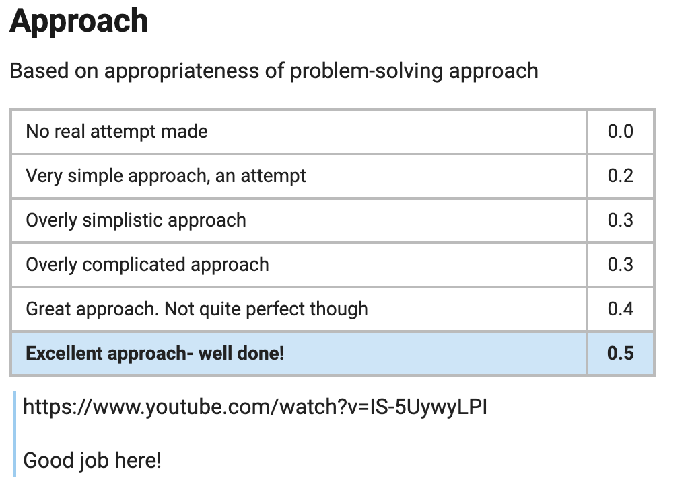

:::

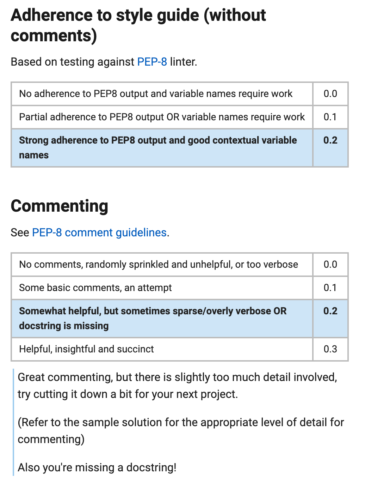

```
#  Adherence to style guide (without comments)

Based on testing against [PEP-8](https://www.python.org/dev/peps/pep-0008/) linter.

No adherence to PEP8 output and variable names require work

0.0

Partial adherence to PEP8 output OR variable names require work

0.1

Strong adherence to PEP8 output and good contextual variable names

0.2

# Commenting
See [PEP-8 comment guidelines](https://www.python.org/dev/peps/pep-0008/#id30).

No comments, randomly sprinkled and unhelpful, or too verbose

0.0

Some basic comments, an attempt

0.1

Somewhat helpful, but sometimes sparse/overly verbose OR docstring is missing

0.2

Helpful, insightful and succinct

0.3


Great commenting, but there is slightly too much detail involved, try cutting it down a bit for your next project.

(Refer to the sample solution for the appropriate level of detail for commenting)

Also you're missing a docstring!
```

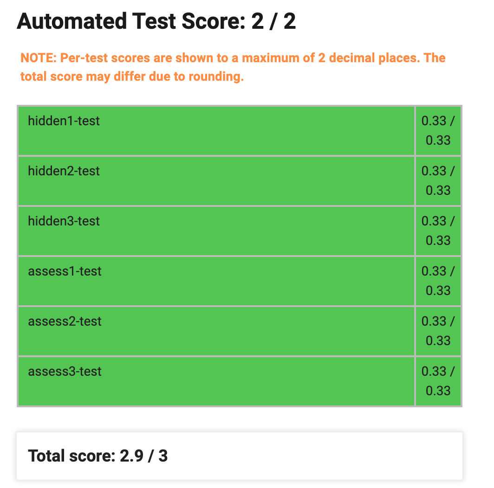


## Validate Input

### Sample solution

```python
DIR_UP = "u"
DIR_DOWN = "d"
DIR_LEFT = "l"
DIR_RIGHT = "r"
BLANK_PIECE = "Z"

MIN_DIMENSION = 2
PIECE_MULTIPLE = 4
ROW, COL = 0, 1
DIRS = (DIR_UP, DIR_DOWN, DIR_LEFT, DIR_RIGHT)

def validate_input(board, position, direction):
    ''' Takes `board` (list of lists of piece characters), `position` 
    (2-tuple of ints), and `direction` (string). 
    Returns a bool indicating whether the input is valid '''
    return (valid_board_dimension(board) and position_in_board(board, position)
            and valid_direction(direction) and valid_board_value(board))

def valid_board_dimension(board):
    ''' Takes the `board` and returns a bool indicating if the board 
    dimension is valid:
       1. board is a square
       2. board contains at least two rows and two columns '''
    
    # ensure that board has at least two rows and two columns
    if len(board) < MIN_DIMENSION:
        return False
    row_length = len(board[0])
    if row_length < MIN_DIMENSION:
        return False

    # ensure that the board is a "square"
    for row in board[1:]:
        if len(row) != row_length:
            return False
    
    return True

def valid_board_value(board):
    ''' Takes the `board` and returns a bool indicating if the board:
        1. contains upper case value only
        2. has multiple-of-four number of pieces for each colour '''
    
    colour_count = {}

    # check the validity of the board piece by piece, also record the 
    # colour of pieces
    for row in board:
        for piece in row:

            # ensure that each piece is upper case
            if not piece.isupper():
                return False
            
            # record the colour of the piece
            if piece in colour_count:
                colour_count[piece] += 1
            else:
                colour_count[piece] = 1
    
    # check whether there are multiple-of-four for each colour
    for colour, count in colour_count.items():
        if colour != BLANK_PIECE and count % PIECE_MULTIPLE != 0:
            return False

    return True

def position_in_board(board, position):
    ''' Takes `board` and `position` (2-tuple of ints) and returns a bool
    indicating if the position is on the board '''
    return (0 <= position[ROW] < len(board) 
            and 0 <= position[COL] < len(board[0]))


def valid_direction(direction):
    ''' Takes `direction` (str) and returns a bool indicating if the direction
    is one of the predefined direction values '''
    return direction in DIRS
```

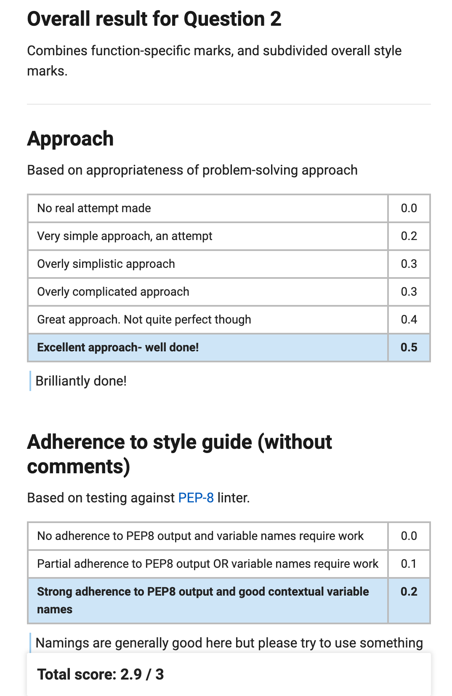

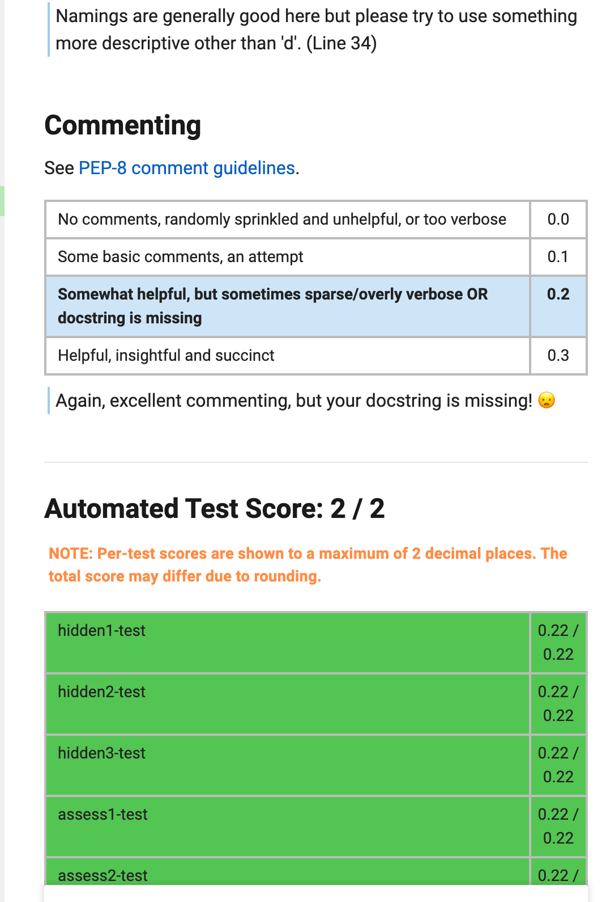


## Legal Moves

### Sample solution #1

```python
DIR_UP = "u"
DIR_DOWN = "d"
DIR_LEFT = "l"
DIR_RIGHT = "r"
BLANK_PIECE = "Z"

def calc_swap_pos(row, col, direction):
    """ Takes the row index, column index of the piece and the direction of 
        the move, calculates and return the position to be swapped to """
    if direction == DIR_UP:
        swap_row = row - 1
        swap_col = col
    elif direction == DIR_DOWN:
        swap_row = row + 1
        swap_col = col
    elif direction == DIR_RIGHT:
        swap_row = row
        swap_col = col + 1
    elif direction == DIR_LEFT:
        swap_row = row
        swap_col = col - 1
    else:
        return None
    return (swap_row, swap_col)

def adjacent(piece, board, row, col):
    """ Takes piece, board, row index and column index, and return a bool
        indicating whether any of the positions around board[row][col] 
        contain piece """
    if col + 1 < len(board[row]) and board[row][col + 1] == piece: 
        return True
    if col - 1 >= 0 and board[row][col - 1] == piece:
        return True
    if row + 1 < len(board) and board[row + 1][col] == piece:
        return True
    if row - 1 >= 0 and board[row - 1][col] == piece:
        return True
    return False

def legal_move(board, position, direction):
    """ Takes `board` (list of lists of piece characters), `position` 
    (2-tuple of ints), `direction` (string). Returns a bool indicating whether 
    the move is considered legal in the context of the specified game rules """
    row, col = position
    
    # Calculate the position of the token being swapped
    swap_row, swap_col = calc_swap_pos(row, col, direction)
    
    # Check if the swap position is legal
    if not (0 <= swap_row < len(board) and 0 <= swap_col < len(board[0])): 
        return False
    
    # Check if either place is a blank 
    piece = board[row][col]
    swap_piece = board[swap_row][swap_col]
    if piece == BLANK_PIECE or swap_piece == BLANK_PIECE:
        return False
    
    # Perform the swap
    board[row][col] = swap_piece
    board[swap_row][swap_col] = piece
    
    # Check if the result is legal 
    is_legal = False
    if adjacent(piece, board, swap_row, swap_col):
        is_legal = True
    if adjacent(swap_piece, board, row, col):
        is_legal = True
    
    # Swap back
    board[row][col] = piece
    board[swap_row][swap_col] = swap_piece    
    
    return is_legal
```

### Sample solution #2

```python
DIR_UP = "u"
DIR_DOWN = "d"
DIR_LEFT = "l"
DIR_RIGHT = "r"
BLANK_PIECE = "Z"

def legal_move(board, position, direction):
    ''' Takes `board` (list of lists of piece characters), `position` 
    (2-tuple of ints), `direction` (string). Returns a bool indicating whether 
    the move is considered legal in the context of the specified game rules '''

    next_position = get_next_position(board, position, direction)
    # make sure that the next position exists
    if not next_position:
        return False
    
    colour = board[position[0]][position[1]]
    next_colour = board[next_position[0]][next_position[1]]
    # blank space can't move
    if BLANK_PIECE in (colour, next_colour):
        return False
    
    # make sure that one of the adjacent piece has the same colour
    adj_swap_positions = adjacent_positions(board, next_position)
    adj_swap_positions.remove(position)
    adj_ori_positions = adjacent_positions(board, position)
    adj_ori_positions.remove(next_position)
    if has_colour(board, adj_swap_positions, colour) or\
       has_colour(board, adj_ori_positions, next_colour):
        return True
    
    return False

def has_colour(board, positions, colour):
    '''Return True if the given list of positions contain the colour given'''
    for x, y in positions:
        if board[x][y] == colour:
            return True
    return False

def adjacent_positions(board, position):
    '''For the board given, return the valid adjacent positions for the given
       position in a list'''
    cur_x, cur_y = position
    adj_positions = [(cur_x + 1, cur_y), (cur_x - 1, cur_y), 
                     (cur_x, cur_y + 1), (cur_x, cur_y - 1)]
    
    # remove the positions that are out of bound
    for adj_pos in adj_positions:
        if not position_in_board(board, adj_pos):
            adj_positions.remove(adj_pos)
            
    return adj_positions

def position_in_board(board, position):
    '''Given the board and position, return True if the position 
       is in the board'''
    return 0 <= position[0] < len(board) and 0 <= position[1] < len(board[0])

def get_next_position(board, position, direction):
    '''Takes the board, position of the piece and the direction, 
       return the destination position that the piece moves to'''

    next_position = None
    cur_x, cur_y = position

    if direction == DIR_UP:
        next_position = cur_x - 1, cur_y
    elif direction == DIR_DOWN:
        next_position = cur_x + 1, cur_y
    elif direction == DIR_LEFT:
        next_position = cur_x, cur_y - 1
    elif direction == DIR_RIGHT:
        next_position = cur_x, cur_y + 1
    else:
        return None
    
    if not position_in_board(board, next_position):
        return None
    return next_position
```

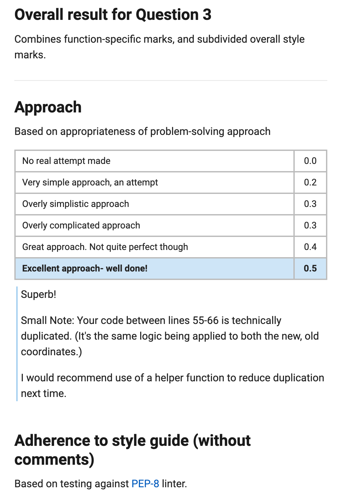

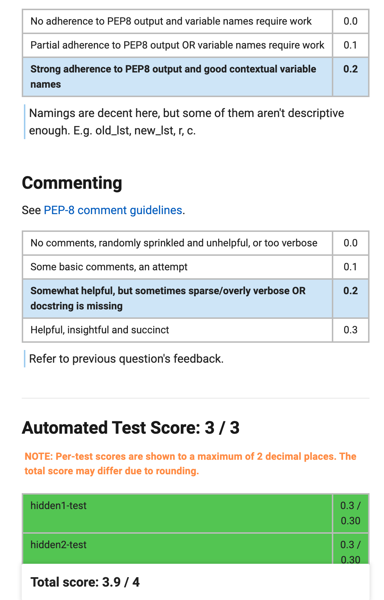

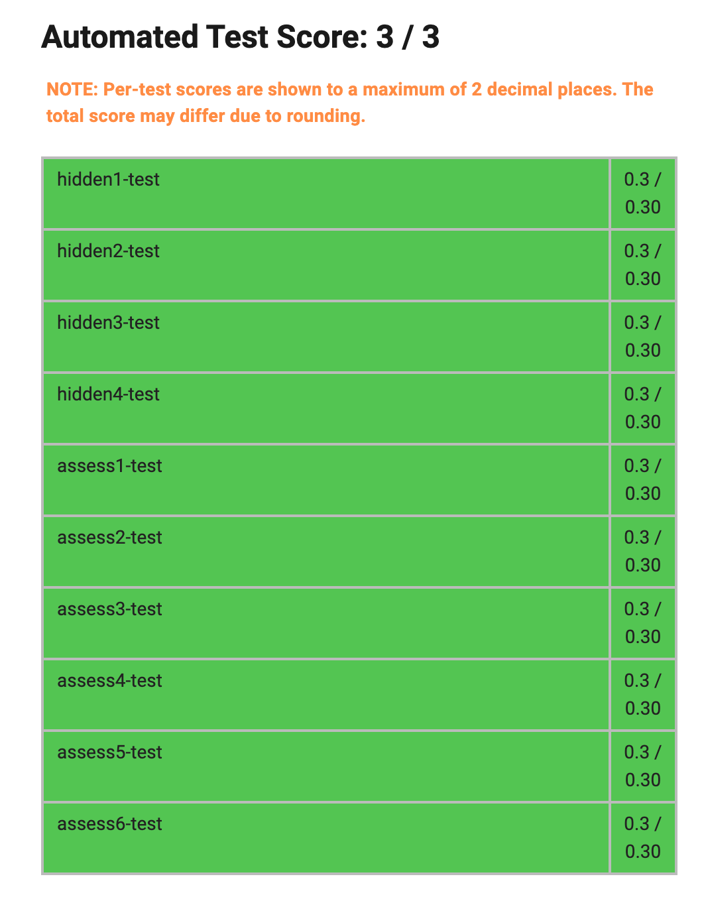

## Make a Move

### Sample solution #1

```python
DIR_UP = "u"
DIR_DOWN = "d"
DIR_LEFT = "l"
DIR_RIGHT = "r"
BLANK_PIECE = "Z"

def destroy(board):
    """ Finds a square of four identical pieces and removes them """
    # Find a square
    for i in range(len(board) - 1):
        for j in range(len(board[i]) - 1):
            if board[i][j] != BLANK_PIECE and board[i][j] == \
              board[i][j + 1] == board[i + 1][j] == board[i + 1][j + 1]:
                
                # Eliminate the pieces
                board[i][j] = BLANK_PIECE
                board[i][j + 1] = BLANK_PIECE
                board[i + 1][j] = BLANK_PIECE
                board[i + 1][j + 1] = BLANK_PIECE
                return True
    return False

def fix(board):
    """ Fills the gaps caused by eliminating pieces """
    # Move pieces up
    for j in range(len(board[0])):
        for i in range(len(board)):
            if board[i][j] == BLANK_PIECE:
                k = 1
                while i + k < len(board):
                    if board[i + k][j] != BLANK_PIECE:
                        board[i][j] = board[i + k][j]
                        board[i + k][j] = BLANK_PIECE
                        break
                    k = k + 1
    
    # Move pieces to the left
    for i in range(len(board)):
        for j in range(len(board[i])):
            if board[i][j] == BLANK_PIECE:
                k = 1
                while j + k < len(board[i]):
                    if board[i][j + k] != BLANK_PIECE:
                        board[i][j] = board[i][j + k]
                        board[i][j + k] = BLANK_PIECE  
                        break
                    k = k + 1
                

def make_move(board, position, direction):
    """ Makes a move in accordance with the Task 4 rules """
    row = position[0]
    col = position[1]
    
    # Calculate position of piece to be swapped
    if direction == DIR_UP:
        swap_row = row - 1
        swap_col = col
    elif direction == DIR_DOWN:
        swap_row = row + 1
        swap_col = col
    elif direction == DIR_RIGHT:
        swap_row = row
        swap_col = col + 1
    elif direction == DIR_LEFT:
        swap_row = row
        swap_col = col - 1
    else:
        return False
        
    piece = board[row][col]
    swap_piece = board[swap_row][swap_col]
    
    # Perform the swap
    board[row][col] = swap_piece
    board[swap_row][swap_col] = piece
    
    # Continue to remove pieces and fill gaps until no more removals possible
    while(destroy(board)):
        fix(board)
    
    return board
```

### Sample solution #2

```python
import copy

DIR_UP = "u"
DIR_DOWN = "d"
DIR_LEFT = "l"
DIR_RIGHT = "r"
BLANK_PIECE = "Z"

FILL_SORT_KEY = lambda x: x == BLANK_PIECE
ROW, COL = 0, 1
DELTA_MOVE = {DIR_UP: (-1, 0), DIR_DOWN: (1, 0),
              DIR_LEFT: (0, -1), DIR_RIGHT: (0, 1)}

def clear_square(board):
    """
    Takes a 2D list board.
    Replaces a 2x2 equal piece square with a BLANK_PIECE square.
    Returns True if such square is found. Also mutates board.
    """
    for j in range(len(board) - 1):
        for i in range(len(board[0]) - 1):
            if board[j][i] == BLANK_PIECE:
                continue
            # Check if this is an equal piece square
            if board[j][i] == board[j][i + 1] \
                           == board[j + 1][i] \
                           == board[j + 1][i + 1]:
                # Replace the pieces with blank pieces
                board[j][i] = board[j][i + 1] \
                            = board[j + 1][i] \
                            = board[j + 1][i + 1] \
                            = BLANK_PIECE
                return True
    return False

def refresh_board(board):
    """
    Takes a 2D board list.
    "Refreshes" the board by clearing equal piece squares,
    and fills the gap produced.
    Mutates board.
    """
    nrows, ncols = len(board), len(board[0])
    # Keep clearing squares until there is no more left
    while clear_square(board):
        # Shift up
        for i in range(ncols):
            col = sorted([board[j][i] for j in range(nrows)],
                         key=FILL_SORT_KEY)
            for j in range(nrows):
                board[j][i] = col[j]

        # Shift left
        [row.sort(key=FILL_SORT_KEY) for row in board]

def make_move(board, position, direction):
    """
    Takes a 2D board list, initial position (j, i) tuple, and move direction.
    Performs the move and refreshes the board.
    Returns the resulting board.
    """
    board = copy.deepcopy(board)
    
    advance(board, position, direction)
    
    refresh_board(board)

    return board

def advance(board, old_pos, direction):
    """
    Takes a 2D board list, initial position (j, i) tuple, and move direction.
    *Mutates* the board if the two relevant pieces can be swapped.
    Returns the new position if the swap is successful, otherwise None.
    """
    new_pos = new_position(old_pos, direction)
    
    j_old, i_old = old_pos
    j_new, i_new = new_pos
    
    # Check if the two pieces to be swapped are valid
    if not within_bounds(board, new_pos) or \
       board[j_old][i_old] == BLANK_PIECE or \
       board[j_new][i_new] == BLANK_PIECE:
        return None
    
    # Swap the pieces
    board[j_old][i_old], board[j_new][i_new] = \
        board[j_new][i_new], board[j_old][i_old]
    return new_pos

def new_position(old_pos, direction):
    """
    Takes an initial position (j, i) tuple, and move direction.
    Returns the new position.
    """
    return add_2_tuple(old_pos, DELTA_MOVE[direction])

def within_bounds(board, pos):
    """
    Takes a 2D board list, and a position (j, i) tuple.
    Returns True if the position is within the board.
    """
    nrows, ncols = len(board), len(board[0])
    return 0 <= pos[ROW] < nrows and 0 <= pos[COL] < ncols

def add_2_tuple(tup0, tup1):
    """
    Takes two 2-tuples, and returns an element-wise sum of the two.
    """
    return tup0[ROW] + tup1[ROW], tup0[COL] + tup1[COL]
```

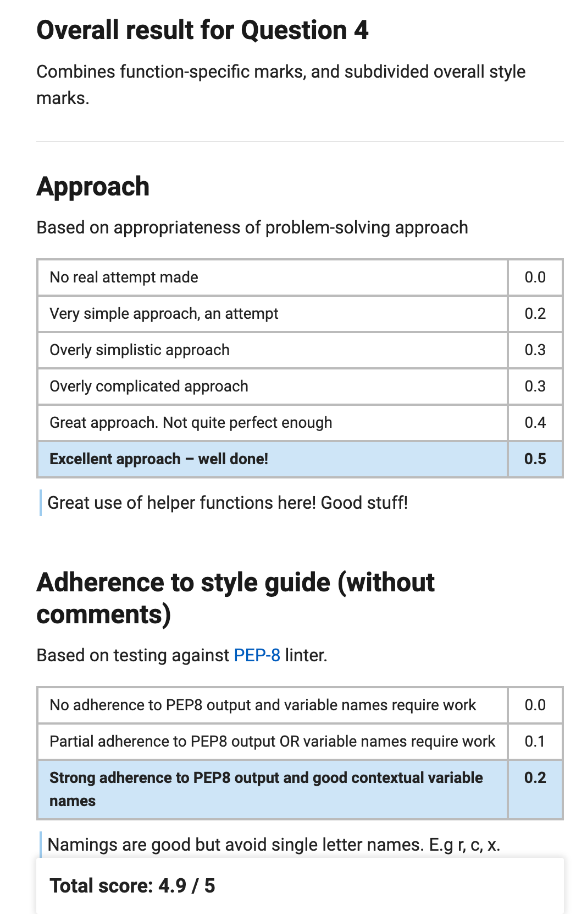

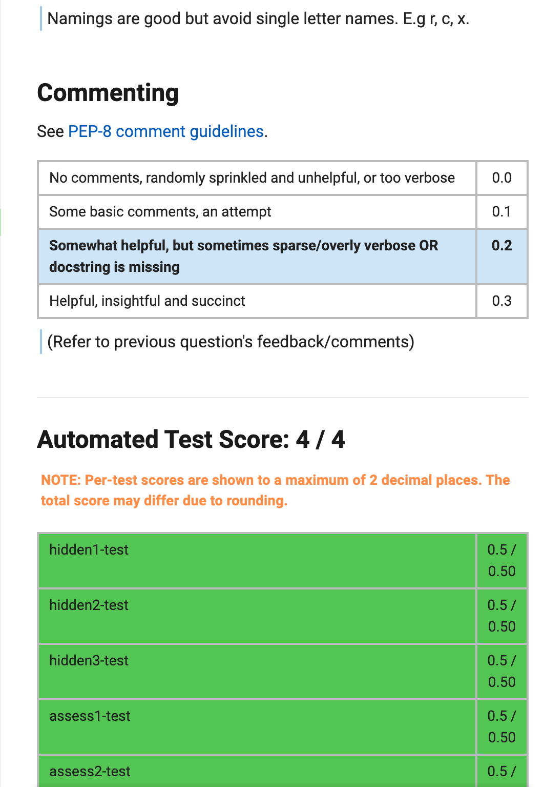

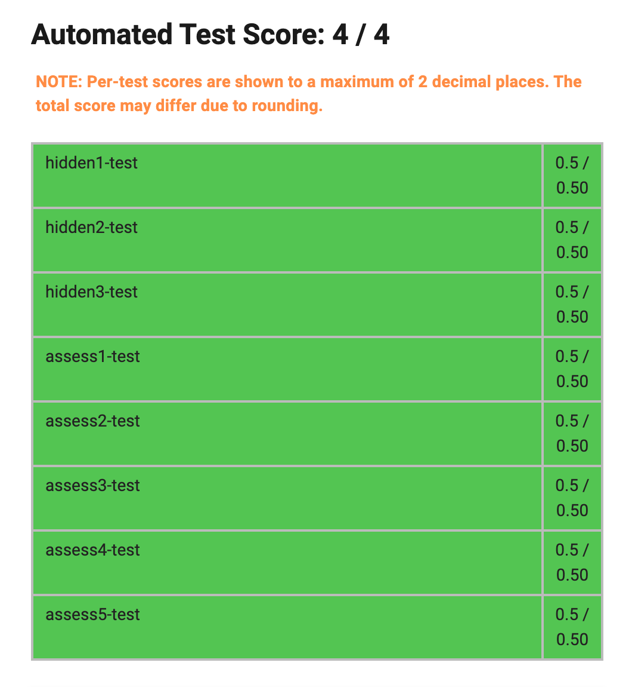

 

## AI Player

### Sample solution #1

```python
from hidden import legal_move, make_move
from copy import deepcopy

DIR_UP = "u"
DIR_DOWN = "d"
DIR_LEFT = "l"
DIR_RIGHT = "r"
BLANK_PIECE = "Z"

def all_moves(board):
    " Generates all moves (even illegal ones) "
    moves = []
    for row in range(len(board)):
        for col in range(len(board[row])):
            moves.append(((row, col), DIR_UP))
            moves.append(((row, col), DIR_DOWN))
            moves.append(((row, col), DIR_LEFT))
            moves.append(((row, col), DIR_RIGHT))
    return moves

def all_legal_moves(board, all_moves):
    """ Generates all legal moves from a list of moves """
    moves = []
    for position, direction in all_moves:
        if legal_move(board, position, direction):
            moves.append((position, direction))
    return moves

def has_won(board):
    """ Checks if the current board state is winning """
    for row in board:
        for val in row:
            if val != BLANK_PIECE:
                return False
    return True
 
def serialize(board):
    """ Converts the board to a single sequence of characters to
    make comparing boards more efficient """
    board_ser = ""
    for row in board:
        board_ser = board_ser + ''.join(row)
    return board_ser
    
def ai_player(board):
    """ Returns the sequence of moves needed to win the game, or None
    if winning is not possible from the current board. """
    open_nodes = [(board, [])]
    closed_nodes = []
    
    # Perform Breadth First Search on the board
    while len(open_nodes) > 0:
        next_board, path = open_nodes.pop(0)
        closed_nodes.append(serialize(next_board))
        
        # Return the winning solution
        if has_won(next_board):
            return path
        
        # Generate possible next moves for the current board position
        moves = all_moves(next_board)
        moves = all_legal_moves(next_board, moves)
        for move in moves:
            board2 = deepcopy(next_board)
            board2 = make_move(board2, move[0], move[1])
            board_ser = serialize(board2)

            # Check to see if we have encountered this board position
            # via another series of moves.
            if board_ser not in closed_nodes:
                open_nodes.append((board2, path + [move]))
                closed_nodes.append(board_ser)
    
    # Current board is unwinnable             
    return None
```

### Sample solution #2

```python
from copy import deepcopy
from hidden import legal_move, make_move

DIR_UP = "u"
DIR_DOWN = "d"
DIR_LEFT = "l"
DIR_RIGHT = "r"
BLANK_PIECE = "Z"


def ai_player(board):
    """ Takes the board of the initial game state and runs breadth-first
      search to find a solution (sequence of moves that result in the board
      ending in winning state of all blank pieces). Returns None if no such
      winning board is found. """
    
    # queue is a list of tuples containing the board state and the moves
    # that lead to that state
    queue = [(board, [])]
    visited = set()

    while queue:
        # get the next board state to visit
        board, moves = queue.pop(0)
        if has_won(board):
            return moves
        
        # add the string of the board to visited set so we don't go in circles
        visited.add(str(board))

        # loop over each move for the current board and add it to the queue
        for move in generate_moves(board):
            next_board = make_move(deepcopy(board), *move)
            if str(next_board) not in visited:
                queue.append((next_board, moves + [move]))
            
    
def has_won(board):
    """ Returns a bool indicating if the board only has empty pieces """
    for row in board:
        for elem in row:
            if elem != BLANK_PIECE:
                return False
    return True
    

def generate_moves(board):
    """ Generates a list of possible moves for the current board.
     By symmetry we only need to generate for two perpendicular directions """
    return [((r, c), d) for r in range(len(board)) 
             for c in range(len(board[0])) for d in [DIR_LEFT, DIR_UP]
             if legal_move(board, (r, c), d)]
```

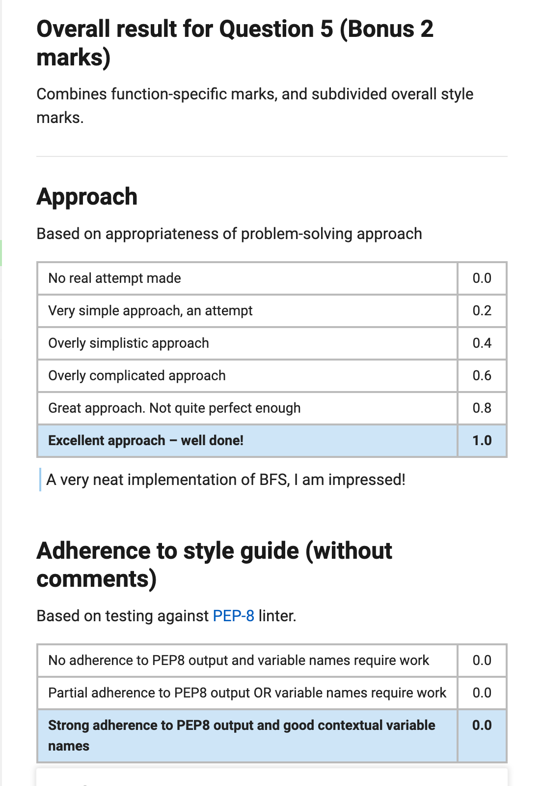

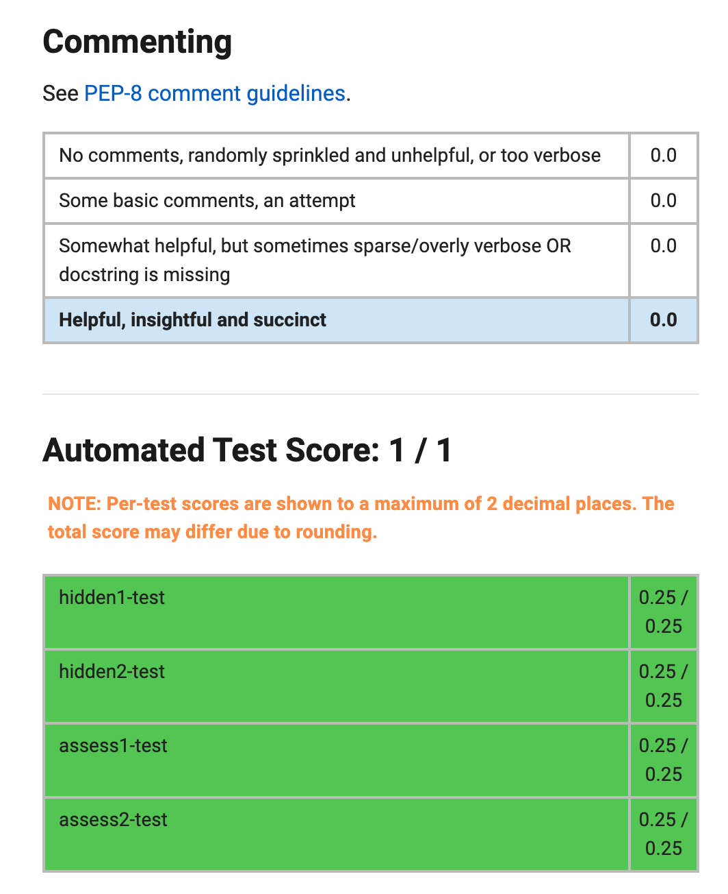


::: details 公众号：AI悦创【二维码】


:::

::: info AI悦创·编程一对一

AI悦创·推出辅导班啦，包括「Python 语言辅导班、C++ 辅导班、java 辅导班、算法/数据结构辅导班、少儿编程、pygame 游戏开发、Web、Linux」，全部都是一对一教学：一对一辅导 + 一对一答疑 + 布置作业 + 项目实践等。当然，还有线下线上摄影课程、Photoshop、Premiere 一对一教学、QQ、微信在线，随时响应！微信：Jiabcdefh

C++ 信息奥赛题解，长期更新！长期招收一对一中小学信息奥赛集训，莆田、厦门地区有机会线下上门，其他地区线上。微信：Jiabcdefh

方法一：[QQ](http://wpa.qq.com/msgrd?v=3&uin=1432803776&site=qq&menu=yes)

方法二：微信：Jiabcdefh

:::


