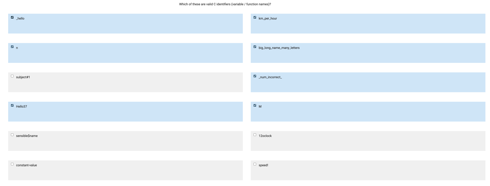
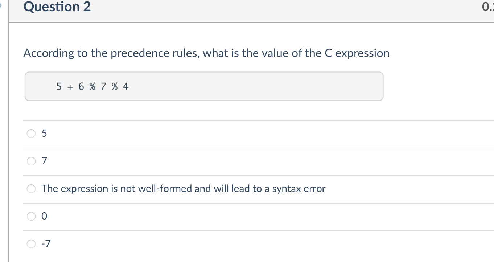
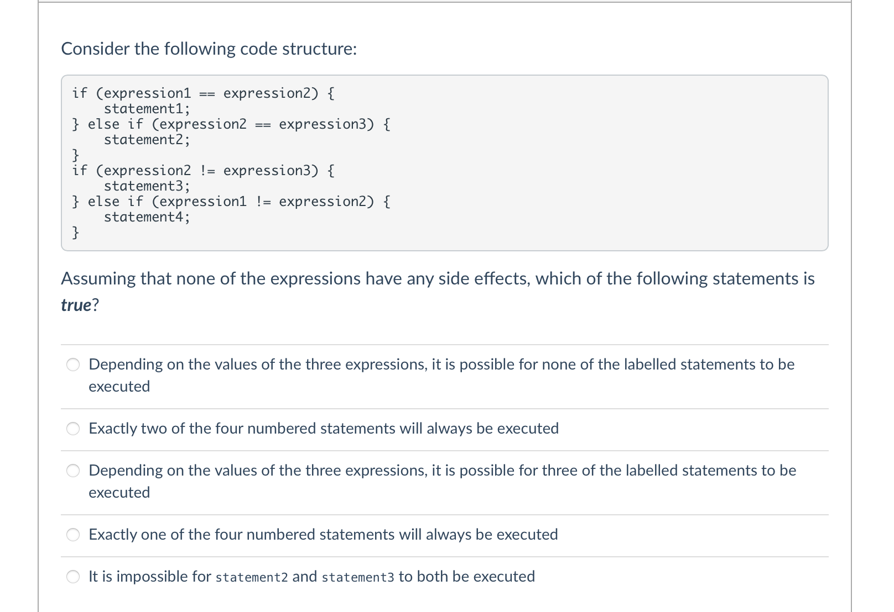
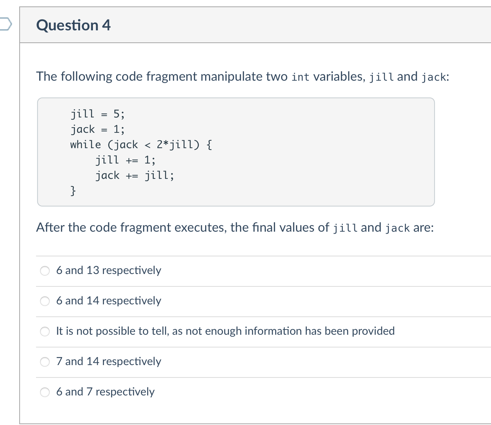

## 1. PLG – Playground

### 1.1 Playground

This module is created as a playground. You may write, compile, and run any C program in this module.

### 1.2 Template

This module is created as a template. You may store your C scaffold template in this module.

## C01

### 1. Welcome to Grok!

Welcome to Grok! Grok is an online platform for learning programming languages and coding concepts.

This semester, you will be using Grok to learn the C programming language and explore lecture content with code. You will also use Grok in your Workshops to practice coding problems, and in your Assignments to submit your assessment.

The Grok learning environment consists of slides and problems . Slides aim to explain and demonstrate content, while problems are to be solved by you!

For each problem, pressing the Mark button will run your program against some tests. If it passes all tests, the green diamond will be filled.

When you're ready, move to the next slide . Good luck on your C learning journey!

### 2. Read the textbook!

](./16-C1.assets/front-cover-revised.jpg)

Exercises and examples that follow are written by Alistair Moffat (unless otherwise noted) for the prescribed textbook "Programming, Problem Solving, and Abstraction with C", Pearson Custom Books, Sydney, Australia, 2002; revised edition 2012, ISBN 9781486010974.

See http://people.eng.unimelb.edu.au/ammoffat/ppsaa/ for further information.

The textbook will be abbreviated as PPSAA, any references to this should refer to the above copyright notice.

------

It is strongly recommended that you read each chapter before attempting the exercises. Each chapter on Grok corresponds to a chapter in the textbook that should be read.

**The review slides on Grok are \*not\* a replacement for the textbook, and are only intended to be used as a refresher for you before attempting the exercises.**

That means you should read Chapter 1 before attempting the questions here.

### 3. Which exercises should I complete?

> Read carefully

This slide gives some advice for doing your best in this subject.

On Grok, we have incorporated most of the exercises from the PPSAA book.

In both COMP10002 and COMP20005, recommended exercises are provided for the workshops. **Attempt these first**, if possible, before attending the workshop. You probably will be able to complete most of each week's exercises without help, as long as you stay up to date. Then, consolidate your knowledge by working on the other *optional* exercises.

If you can't solve a problem, skip it, and try another problem. If you're still stuck, try consulting your notes, the textbook, the lecture recordings. If you're *still* stuck, ask your tutor, or the teaching team on the Ed discussion forum, but make sure to quote the exercise number and clearly state what you've tried, and what you're stuck on.

The exercises are not in order of difficulty, challenge questions are included that don't require knowledge of C features taught later in the subject. Hence, we do *not* recommend completing *every* exercise in each chapter before progressing to the next chapter.

The most vigilant students will complete *all* exercises we have provided here on Grok by exam time, making their own best attempt before looking at the solutions provided. Thinking through problems and typing out your own solutions is important for the assessments in this subject, as well as potential future subjects and even job interviews.

Happy problem solving, good luck, and remember (algorithms are|programming is) fun!

### 4. Preventing common mistakes (CH01)

In each chapter, we will have a slide titled **Preventing common mistakes**. You're reading that slide for this chapter!

These slides will highlight ideas from the chapter where students commonly make mistakes.

**NOTE: Reading Chapter 1 in the textbook is still required!**

#### 4.1  Every program needs a `main`

Your program should at minimum have the following:

In each chapter, we will have a slide titled **Preventing common mistakes**. You're reading that slide for this chapter!

These slides will highlight ideas from the chapter where students commonly make mistakes.

**NOTE: Reading Chapter 1 in the textbook is still required!**

#### 4.2 Every program needs a `main`

Your program should at minimum have the following:

```c
/* My program title
 * Alistair Moffat, 10002 - December 2021
 */
#include <stdio.h>

int
main(int argc, char *argv[]) {
    
    // ... your code

    return 0;
}
```

#### Question 1

::: tip 探究 int argc, char *argv[]

:::

##### 1. 创建 main.c 代码文件&代码

首先，你需要有一个名为 `main.c` 的 C 源代码文件，代码内容如下：

```c
#include <stdio.h>

int main(int argc, char *argv[]) {
    // 打印参数的总数（包括程序名）
    printf("Total arguments: %d\n", argc);

    // 遍历每个参数并打印
    for (int i = 0; i < argc; i++) {
        printf("Argument %d: %s\n", i, argv[i]);
    }

    return 0;
}
```

##### 2. 编译 C 语言代码

接下来，你需要用 C 编译器编译这个文件。打开一个终端窗口，导航到包含 `main.c` 的目录，然后运行以下命令：

```c
gcc main.c -o main
```

这个命令会调用 gcc 编译器，输入文件是 `main.c`，输出文件（即编译生成的二进制文件）是 `main`。

##### 3. 执行可执行程序

如果你的代码没有编译错误，上面的命令将会生成一个名为 `main` 的可执行文件。你可以用以下命令来运行这个文件：

```c
./main 88 88 766
```

在这个命令中，`./main` 是运行可执行文件的命令，`88 88 766` 是传递给程序的参数。如果一切顺利，你的程序应该会接收并处理这些参数。

::: details

在 C 和 C++ 程序中，`int argc` 和 `char *argv[]` 通常用作 `main` 函数的参数。它们在命令行环境中运行程序时，用于处理命令行参数。

具体来说：

- `int argc`：这是一个包含命令行参数数量的整数。例如，如果您在命令行上运行 `myprogram file1 file2`，那么 `argc` 将是 3（包括程序名在内的参数总数）。

- `char *argv[]`：这是一个字符指针数组，它的每个元素都指向一个字符串，这些字符串就是命令行上的实际参数。例如，在上面的 `myprogram file1 file2` 示例中，`argv[0]` 将是字符串 "myprogram"，`argv[1]` 将是 "file1"，`argv[2]` 将是 "file2"。

如果你的程序不需要接收任何命令行参数，你可以选择不使用 `int argc` 和 `char *argv[]`，并将 `main` 函数定义为 `int main()`。但是，如果你的程序需要处理命令行参数，你需要使用这两个参数。

:::

We call the above your [*boilerplate code*](https://en.wikipedia.org/wiki/Boilerplate_code) or template. As we progress through the semester, you might add more to this boilerplate, such as functions and definitions that you frequently use.

In the Playground section, you can place your coding template there.

For now, you do not need to understand the meaning of `int main(int argc, char *argv[])`.

`return 0;` tells the computer that your computer completed successfully. On error, we might return some non-zero value.

::: warning Authorship declaration

The first few lines of a program contain documentation. The most important things here are:

- title of your program (what does it do / try to achieve?)
- your name, student number, date (the Authorship Declaration)
- you will sometimes be asked to include a quite detailed statement in regard to originality, make sure that you do as requested, and don't forget to put your name and student number in when you do.

If you neglect to include the authorship declaration in your assignments, you will likely lose marks. Be sure to read ALL instructions very carefully.

:::

#### 4.3 Include libraries for functions you need

The line `#include <stdio.h>` includes the standard ("std") input output ("io") header file `stdio.h` into your program. This gives it access to `printf` (the print format function), and many others.

#### 4.4 Compile your program first before running it!

C is a compiled language, so programs must be compiled before they can be run.

```c
gcc -Wall -o program program.c
./program
```

In Grok, the Run button compiles your program first before running it. But, if you are compiling and running manually, take care! If you forget to compile your program, you will be running the older version of your program with the bug you were trying to fix!

#### 4.5 Character `'` and string `"` literals are different

If you want to print `Hello world` in C, make sure you use `"` double quotes, and not single quotes `'`.

`'` is used to designate *character literals* - storing only **one** letter:

```c
char c = 'c';  // or equivalently: 99 (ASCII)
```

while `"` is used to designate *string literals* - storing **many** letters:

```c
"Hello world"
```

That means,

```c
printf("Hello world!\n");
```

does what you think it does, but using `'` would not work!

### 5. Ex1.02: Hello World

#### 5.1 Task

Use the Grok editor to create the "Hello World" program in the file `program.c`.

Press the Run button to compile and execute your program. Test your program to ensure it gives the correct output.

(If you wish only to compile your program to see that it is well-formed, you can press the Compile button.)

When you think you are finished, press the Mark button to run your program against some tests. If it passes all tests, you will receive a green diamond .

#### 5.2 Sample Output

Your program should replicate the following output exactly to pass all tests. Ensure that your program has correct whitespace (spaces and newlines), punctuation and text.

```c
Hello world!
```

::: warning Hint

If you're completely stuck, check Figure 1.1 of the textbook.

:::

::: code-tabs

@tab Makefile

```c
CC = clang
CFLAGS = -Wall -Wextra -Werror -Wno-newline-eof -Wno-unused-parameter -pedantic -std=c11 -ferror-limit=1
LDFLAGS = -lm

PROGRAM = program
SOURCE_FILES = $(shell find . -type f -name '*.c')
HEADER_FILES = $(shell find . -type f -name '*.h')
OBJECT_FILES = $(SOURCE_FILES:.c=.o)

.PHONY: all build clean run

all: build

build: $(PROGRAM)

clean:
	rm -f $(PROGRAM) $(OBJECT_FILES)

run: build
	./$(PROGRAM)

$(PROGRAM): $(OBJECT_FILES)
	$(CC) -o $@ $^ $(LDFLAGS)
```

@tab  program.c

```c
#include <stdio.h>
int main() {
    
    printf("Hello world!\n");
    
    return 0;
}
```

:::

### 6. Figure 1.2: Inputting data

The code editor currently shows the starting code for the next exercise (Ex1.03). This code (Figure 1.2 of PPSAA) reads and sums together a set of values. You might not understand a lot of what the code does, but that's OK. It's there for you to get familiar with it.

::: warning This is not an exercise!

Since this slide has a circle instead of a diamond , this slide cannot be marked. Move to the next slide to tackle the exercise!

:::

#### 6.1 Inputting data into a program

Click the Run button to run the code. Type some numbers in one-by-one, pressing SPACE or ENTER between each number.

In particular, try the following input:

```c
345649
856984 212345
634534
```

When you're finished, **press** `CTRL-D` to indicate you're done. This sends a special character `EOF`, or End-Of-File character that can be detected by the program. Note: if you copy pasted that input above, make sure you hit ENTER to flush the input to the terminal *before* pressing `CTRL-D`.

You should see some output like this:

```c
The sum of the numbers is 2049512
```

**Question**: What does this program do if no numbers are typed (`CTRL-D` hit without entering any numbers)?

#### Question 2

::: tip 解析上面的程序

```c
/* Figure 1.2: A second C program -- reads and adds a set of values.
 */
#include <stdio.h>

int
main(int argc, char *argv[]) {
    int sum;  /* the running sum */
    int next; /* the next value to be added */

    sum = 0;

    /* get the numbers one by one */
    while (scanf("%d", &next) == 1) {
        sum = sum + next;
    }

    /* and print their sum */
    printf("The sum of the numbers is %d\n", sum);
    return 0;
}
```

:::

##### 1. 程序解析

这个 C 程序会从控制台读取一组整数，并将它们相加。你可以通过以下步骤来测试它：

1. 首先，将这个 C 程序保存为一个 `.c` 文件，例如：`sum.c`。

2. 然后，你需要有一个 C 编译器，例如 gcc，用来编译你的 C 程序。打开你的终端或者命令行窗口，然后输入以下命令来编译你的 C 程序：
   ```
   gcc sum.c -o sum
   ```
   这条命令会生成一个名为 `sum` 的可执行文件。

3. 执行编译后的程序，并输入一些整数值进行测试。例如：
   ```
   ./sum
   ```
   在程序等待输入时，你可以输入一些整数，比如：1 2 3 4，然后按 `Ctrl+D`（在 Windows 系统中为 `Ctrl+Z`）结束输入。

如果一切正常，你的程序应该会输出：“The sum of the numbers is 10”，因为1 + 2 + 3 + 4等于10。 

请注意，这些步骤都假设你在一个类 Unix 的环境（如 Linux 或 Mac OS）中操作。如果你在 Windows 环境中，你可能需要使用其他工具或命令来编译和运行你的 C 程序。

##### 2. 疑惑🤔️：上面的代码必须用快捷键？

这个程序通过 `scanf` 函数从标准输入读取数据，并检查 `scanf` 函数的返回值是否为 1。在 C 语言中，`scanf` 函数的返回值是成功读取并赋值的项目数量。

当你输入一个数字并按下回车键，这个数字就会被 `scanf` 读取并赋值给 `next` 变量，然后 `scanf` 会返回 1，程序就会继续循环等待下一次输入。

当你按下 `Ctrl+D`（Unix 系统）或 `Ctrl+Z`（Windows 系统）时，这表示输入结束或 EOF（End of File），在这种情况下，`scanf` 无法再读取更多的输入，因此它将返回一个非 1 的值（通常是 -1 或 0），这将导致循环结束，然后程序会输出总和。

因此，这个程序需要一个明确的输入结束信号，而不能仅仅依赖于一个单独的回车键来结束输入。

##### 3. 如何把上面的代码实现输入1结尾回车结束？

如果你想让程序在读取到某个特定的值（比如 1）时结束，那么你可以修改循环的条件来实现这个需求。下面是一个可能的修改版本：

```c
#include <stdio.h>

int main(int argc, char *argv[]) {
    int sum = 0;  /* the running sum */
    int next; /* the next value to be added */

    /* get the numbers one by one until 1 is input */
    while (scanf("%d", &next) == 1 && next != 1) {
        sum = sum + next;
    }

    /* and print their sum */
    printf("The sum of the numbers is %d\n", sum);
    return 0;
}
```

在这个修改版本中，我增加了`next != 1`这个条件。现在，循环会在读取到的值不是1的时候继续，一旦读取到的值是1，那么循环就会结束，然后程序会输出总和。

请注意，这种修改会改变程序的行为：如果1是输入的一部分，那么这个1不会被加到总和中，而且它会在你输入 1 之后，如果按下 Enter 会立即结束输入。如果这不是你想要的行为，那么你可能需要采用不同的方法来实现你的需求。

##### 4. 演示 scanf 得到 1

这里有两段简单的 C 代码，可以帮助你理解 `scanf` 的工作原理和返回值。

首先，我们看一个只读取一个整数的情况：

```c
#include <stdio.h>

int main() {
    int num;
    int ret;

    printf("Please enter a number: ");
    ret = scanf("%d", &num);

    printf("scanf returned: %d, number entered: %d\n", ret, num);

    return 0;
}
```
在这段代码中，如果你输入一个整数（如123）并按回车，`scanf` 将成功读取并赋值一个整数，然后返回 1。所以输出会是：“scanf returned: 1, number entered: 123”。

::: details 测试过程

1. 把上面的代码保存为一个 `.c` 文件，例如 `test1.c`。

2. 打开你的终端或者命令行窗口，然后输入以下命令来编译你的 C 程序：
   ```c
   gcc test1.c -o test1
   ```
   这条命令会生成一个名为 `test1` 的可执行文件。

3. 运行这个程序，并输入一个整数进行测试。例如：
   ```
   ./test1
   ```
   当程序提示你输入一个数字时，你可以输入一个整数，如 123，然后按回车。程序将输出：“scanf returned: 1, number entered: 123”。

:::

现在，让我们看一个尝试读取两个整数，但是只输入了一个的情况：

```c
#include <stdio.h>

int main() {
    int num1, num2;
    int ret;

    printf("Please enter two numbers: ");
    ret = scanf("%d %d", &num1, &num2);

    printf("scanf returned: %d, numbers entered: %d, %d\n", ret, num1, num2);

    return 0;
}
```
在这段代码中，如果你只输入一个整数（如123）并按回车，`scanf` 只能成功读取并赋值一个整数，然后返回1。所以输出会是：“scanf returned: 1, numbers entered: 123, [垃圾值]”，其中"[垃圾值]"代表未被初始化的`num2`可能的值。

因此，`scanf` 的返回值是成功读取并赋值的项目数量。在你的原始程序中，它一直尝试读取一个整数并将其添加到总和中，直到不能再成功读取（例如，因为输入结束了）。

::: details 测试过程

1. 把上面的代码保存为一个 `.c` 文件，例如 `test2.c`。

2. 打开你的终端或者命令行窗口，然后输入以下命令来编译你的C程序：
   ```c
   gcc test2.c -o test2
   ```
   这条命令会生成一个名为`test2`的可执行文件。

3. 运行这个程序，并输入一个或两个整数进行测试。例如：
   ```c
   ./test2
   ```
   当程序提示你输入两个数字时，你可以只输入一个整数，如123，然后按回车。程序将输出类似于：“scanf returned: 1, numbers entered: 123, 32767”，其中 32767 是未初始化的 `num2` 的垃圾值。

:::


### 7. Ex1.03: Mean of a set of numbers

We extend the program given in Figure 1.2 of PPSAA.

#### 7.1 Task

The *mean* (average) of some numbers $x_1,...,x_n\text{is}\frac{1}{n}\sum^{n}_{i = 1}x_i$.

> 一些数字的平均数

Discuss what would need to be added if the mean of the input numbers was to be printed as well as their sum.

> 讨论如果要打印输入数字的平均值以及它们的总和，需要添加什么。

Try to modify the program so that it does this.

> 试着修改程序，让它这样做。

**Question**: What should the extended program do when no numbers are typed?

> 问题:当没有输入数字时，扩展程序应该怎么做?

#### 7.2 Sample output

Press the Run button and enter the lines in blue. The text in black should **exactly match** your program's output.

> 按Run按钮并输入蓝色线条。黑色的文本应该与程序的输出完全匹配。

```c
345649
856984 212345
634534
The sum of the numbers is 2049512
The mean of the numbers is 512378.000000
```

If your program passes this sample test, it is not necessarily perfect – it is a good idea to test your program further by yourself!

When you think you are finished, press the Mark button to run your program against some tests. If it passes all tests, you will receive a green diamond .

```c
/* Figure 1.2: A second C program -- reads and adds a set of values.
 */
#include <stdio.h>

int
main(int argc, char *argv[]) {
    int sum;  /* the running sum */
    int next; /* the next value to be added */

    sum = 0;

    /* get the numbers one by one */
    while (scanf("%d", &next) == 1) {
        sum = sum + next;
    }

    /* and print their sum */
    printf("The sum of the numbers is %d\n", sum);
    return 0;
}
```

#### 7.3 Answer 

1. 需要完成平均值；
2. 平均值需要用数量和总数；
3. 所以需要声明变量：

```c
int count = 0;
float mean;
```

```c
#include <stdio.h>

int
main(int argc, char *argv[]) {
    int sum;  /* the running sum */
    int next; /* the next value to be added */
    int count = 0; /* count the number of inputs */
    float mean; /* calculate the mean value */

    sum = 0;

    /* get the numbers one by one */
    while (scanf("%d", &next) == 1) {
        sum = sum + next;
        count++;
    }

    /* calculate the mean value */
    mean = (float)sum / count;

    /* and print their sum */
    printf("The sum of the numbers is %d\n", sum);
    printf("The mean of the numbers is %f\n", mean);
    return 0;
}
```

### 8. Using the Grok Terminal

```c
/* Figure 1.2: A second C program -- reads and adds a set of values.
 * Alistair Moffat, PPSAA 2013
 */
#include <stdio.h>

int
main(int argc, char *argv[]) {
    int sum;  /* the running sum */
    int next; /* the next value to be added */

    sum = 0;

    /* get the numbers one by one */
    while (scanf("%d", &next) == 1) {
        sum = sum + next;
    }

    /* and print their sum */
    printf("The sum of the numbers is %d\n", sum);
    return 0;
}
```

> Figure 1.2: A second C program that reads and adds a set of values

In the previous exercises, you have used the Run button to compile and execute your code. Here, we show you an alternative method for this.

Click the Terminal button on the top of the code block above. Use the following commands to compile then execute your program. (Press ENTER between each line.)

```c
gcc -Wall -std=c11 -o program program.c
./program
```

##### 8.1 Explanation

`gcc` is the GNU C Compiler, the program we are using to compile your C program. You may alternatively use `clang`, another popular C compiler.

The words that follow `gcc` are its *program arguments*. Arguments prefixed with `-` are compilation flags. The command above uses only the most common compilation flags.

- `-Wall` tells the compiler to show `all` `W`arnings.
- `-std=c11` tells the compiler to compile using the C11 language (2011). This is the latest version of C, newer than `ansi` (1989) or `c99` (1999) which are also popular.
- `-o program` says to output the program to the file `program`. You can name this whatever you want, it's the program we execute with `./program`.
    In Windows, it's customary to suffix this with `.exe` (executable).
- `program.c` is the input source code, to be compiled.

##### 8.2 Other useful commands

```c
Click the Terminal icon to open a terminal -^
```

Click on the button to open a terminal. Then enter the following lines one at a time (type and press ENTER after each line). What does each command do?

```c
pwd
ls
mkdir afolder
ls
cd afolder
pwd
cd ..
pwd
echo "Hello world" > hello.txt
ls
cat hello.txt
more hello.txt
```

The `pwd` command tells you which directory (folder) you are currently in.

The `ls` command lists all files in your current directory. `more` and `cat` show the contents of a given file.

### 9. Makefile

::: code-tabs

@tab Code

```c
/* Figure 1.2: A second C program -- reads and adds a set of values.
 * Alistair Moffat, PPSAA 2013
 */
#include <stdio.h>

int
main(int argc, char *argv[]) {
    int sum;  /* the running sum */
    int next; /* the next value to be added */

    sum = 0;

    /* get the numbers one by one */
    while (scanf("%d", &next) == 1) {
        sum = sum + next;
    }

    /* and print their sum */
    printf("The sum of the numbers is %d\n", sum);
    return 0;
}
```

@tab Makefile

```c
CC = clang
CFLAGS = -Wall -Wno-unused-parameter -std=c11

PROGRAM = program
SOURCE_FILES = $(shell find . -type f -name '*.c')
OBJECT_FILES = $(SOURCE_FILES:.c=.o)

.PHONY: all build clean run

all: build

build: $(PROGRAM)

clean:
	rm -f $(PROGRAM) $(OBJECT_FILES)

run: build
	./$(PROGRAM)

$(PROGRAM): $(OBJECT_FILES)
	$(CC) -o $@ $^ $(LDFLAGS)
```

:::

> Figure 1.2: A second C program that reads and adds a set of values

The `Makefile` included with each exercise is an automated method of running commands to compile and run your program.

The `Makefile` allows the use of the `make` command to compile your program. The specifics of creating and using a Makefile are out of the scope of this subject.

```c
make
./program
```

The Makefile uses a different set of flags, which is more restrictive than just `-Wall`. With more flags enabled, the compiler is able to guide you to write safer, better code.

```c
-Wall -Wextra -Werror -Wno-newline-eof -Wno-unused-parameter -pedantic -std=c11 -ferror-limit=1
```

## C02

### 1. Preventing common mistakes (CH02)

#### From chapter 1...

- Every program needs a `main`
- Compile your program first before running it!
- Character `'` and string `"` literals are different

#### A step-by-step process for writing a program

When you're at a blank coding window and completely lost for where to begin, try to follow the following steps:

1. Start from your template / boilerplate
2. Comment what your program is to do (think: what order do things need to happen?)
3. Write code, filling in your comments.
4. Test your program.
5. Error handling. (Optional, only if requested or as a challenge)

Get core functionality working first, then worry about errors / edgecases if necessary.

To test your program, click the **Run** button, and try some input. Does it match what you're expecting? While the **Mark** button does run tests on your program, it is by no means exhaustive, and we might have missed something!

By the way, if you ever find an error in our tests or solutions or something we might have missed, please let us know!

#### Each statement ends with a semicolon `;`

```c
printf("Hello world\n");
```

Why do we need semicolons? Both are the same code! How is C supposed to know that a statement is finished if it can't rely on newlines?

```c
#include <stdio.h>
int main(int argc, char *argv[]) {printf("Hello world\n"); return 0;}
```

```c
#include <stdio.h>
int
main
(
int
argc
,
char
*
argv
[]
)
{
printf
(
"H"
"e"
"l"
"lo world\n"
)
;
return
0
;
}
```

#### `scanf` only takes input, and does not print anything.

`scanf` only handles input. Use `printf` to print out any prompt you want.

```c
int x;
printf("Give me a number: ");
scanf("%d", &x);
```

```c
Give me a number: 5
```

Unlike Python's `input`, this does **NOT** work:

```c
int x;
// this does not work in the way you want it to
scanf("Give me a number: %d", &x);
```

#### Declare your variables before using them

Ensure that you declare any variables before using them.

### Ex2.01: Valid C identifier



### Ex2.02: Trace a program

Trace the following program fragment.

Fill in what you think the final values of each of the variables are, **without executing the program**, with one assignment on each line.

```c
    int a, b, c, d, e, f, g;
    a = 6;
    b = a + 3 * 4;
    c = b - b % 4;
    d = b / 3;
    e = a + b / 2;
    f = (a + b / 2 + c) / 3;
    g = a - b + c - d + e - f;
```

::: warning Writing your answer

Clicking Mark will test your variable assignments.

If you'd like to write comments that are ignored by the marker, put a `#` at the start of the line.

Whitespaces (empty lines) are also ignored.

:::

::: code-tabs

@tab answer.txt

```c
a = 6
b = 18
c = 16
d = 6
e = 15
f = 10
g = 3
```

:::


### Ex2.03: Write assignment statements

Within the `main` function in the code editor, we have given declarations for the following variables:

```c
double r, area_square, perimeter_square, 
       area_circle, perimeter_circle, elapsed_hours;
int start_hour, start_min, start_sec,
    finish_hour, finish_min, finish_sec;
```

#### Task

Given those declarations, write assignment statements that calculate:

1. The area of a square of edge length `r`
2. The perimeter of a square of edge length `r`
3. The area of a circle of radius `r`
4. The perimeter of a circle of radius `r`
5. Time in elapsed hours between the start time (`start_hour`:`start_min`:`start_sec`) and finishing time (`finish_hour`:`finish_min`:`finish_sec`) of some event, assuming those two times are within the same day.

Define a constant PI (using `#define`) with value `3.1415926` for π. You may be aware of a constant `M_PI` in `<math.h>`, which is *not* part of the C standard and just a common extension. This constant is not supported by the auto-compilation system of Grok. You can, however, play with it if you compile your code in Grok Terminal with the command `gcc -Wall -o program program.c`.

Test your program by clicking the Run button.

::: warning Hint

You might think to use either `x ^ 2` or `x ** 2` to find the square of some number `x`.

Unfortunately, neither of those work in C.

The library `<math.h` gives you the function `pow(x, 2)`, but in this most simple case, you can do `x * x`.

:::

#### Sample output

We have provided you with an interactive interface to test your statements.

```c
./program
Enter a length/radius r: 42.03
Enter event start time (hh:mm:ss): 1:57:47
Enter event finish time (hh:mm:ss): 7:30:02
1. The area of a square of edge length 42.03        = 1766.52
2. The perimeter of a square of edge length 42.03   = 168.12
3. The area of a circle of radius 42.03             = 5549.69
4. The perimeter of a circle of radius 42.03        = 264.08
5. The time in elapsed hours between start time
     01:57:47 and finish time 07:30:02 of an event  = 5.54
```

::: code-tabs

@tab Makefile

```c
CC = clang
CFLAGS = -Wall -Wextra -Werror -Wno-newline-eof -Wno-unused-parameter -pedantic -std=c11 -ferror-limit=1
LDFLAGS = -lm

PROGRAM = program
SOURCE_FILES = program.c
HEADER_FILES = $(shell find . -type f -name '*.h')
OBJECT_FILES = $(SOURCE_FILES:.c=.o)

.PHONY: all build clean run

all: build

build: $(PROGRAM)

clean:
	rm -f $(PROGRAM) $(OBJECT_FILES)

run: build
	./$(PROGRAM)

$(PROGRAM): $(OBJECT_FILES)
	$(CC) -o $@ $^ $(LDFLAGS)

```

@tab program.c

```c
#include <math.h>
#include <stdio.h>

#define FL_FMT   "%.2lf"
#define TIME_FMT "%02d:%02d:%02d"

int
main(int argc, char *argv[]) {
    /* the declarations you need to define */
    double r, area_square, perimeter_square, 
       area_circle, perimeter_circle, elapsed_hours;
    int start_hour, start_min, start_sec,
        finish_hour, finish_min, finish_sec;

    /* read in length/radius r, start time and finish time
     * assuming that they are nice numbers (no error checking) */
    printf("Enter a length/radius r: ");
    scanf("%lf", &r);

    printf("Enter event start time (hh:mm:ss): ");
    scanf("%d:%d:%d", &start_hour, &start_min, &start_sec);

    printf("Enter event finish time (hh:mm:ss): ");
    scanf("%d:%d:%d", &finish_hour, &finish_min, &finish_sec);

    /* *************************************************************** */
    /* Hey! Listen! Change these assignment statements! */

    /* 1. The area of a square of edge length r */
    area_square = 0;

    /* 2. The perimeter of a square of edge length `r` */
    perimeter_square = 0;

    /* 3. The area of a circle of radius `r` */
    area_circle = 0;

    /* 4. The perimeter of a circle of radius `r` */
    perimeter_circle = 0;

    /* 5. Time in elapsed hours between the start time
     * (`start_hour`:`start_min`:`start_sec`) and finishing time
     * (`finish_hour`:`finish_min`:`finish_sec`) of some event, assuming those
     * two times are within the same day. */
    elapsed_hours = 0;

    /* *************************************************************** */
    /* and now we print out the results to be checked */
    printf("1. The area of a square of edge length " FL_FMT "        = " FL_FMT
           "\n", r, area_square);
    printf("2. The perimeter of a square of edge length " FL_FMT "   = " FL_FMT
           "\n", r, perimeter_square);
    printf("3. The area of a circle of radius " FL_FMT "             = " FL_FMT
           "\n", r, area_circle);
    printf("4. The perimeter of a circle of radius " FL_FMT "        = " FL_FMT
           "\n", r, perimeter_circle);
    printf("5. The time in elapsed hours between start time\n     " TIME_FMT
           " and finish time " TIME_FMT " of an event  = " FL_FMT "\n",
           start_hour, start_min, start_sec, finish_hour, finish_min,
           finish_sec, elapsed_hours);
}
```

@tab soultion

```c
/* Exercise 2.03: Write assignment statements
 * Liam Saliba, August 2021
 * (c) University of Melbourne */
#include <math.h>
#include <stdio.h>

#define PI 3.14159265359
#define MIN_TO_HRS ((double) 1 / 60)
#define SEC_TO_HRS (MIN_TO_HRS * 1 / 60)
#define FL_FMT     "%.2lf"
#define TIME_FMT   "%02d:%02d:%02d"

int
main(int argc, char *argv[]) {
    /* the declarations you need to define */
    double r, area_square, perimeter_square, 
       area_circle, perimeter_circle, elapsed_hours;
    int start_hour, start_min, start_sec,
        finish_hour, finish_min, finish_sec;

    /* read in length/radius r, start time and finish time
     * assuming that they are nice numbers (no error checking) */
    printf("Enter a length/radius r: ");
    scanf("%lf", &r);

    printf("Enter event start time (hh:mm:ss): ");
    scanf("%d:%d:%d", &start_hour, &start_min, &start_sec);

    printf("Enter event finish time (hh:mm:ss): ");
    scanf("%d:%d:%d", &finish_hour, &finish_min, &finish_sec);

    /* *************************************************************** */

    /* 1. The area of a square of edge length r */
    area_square = r * r;

    /* 2. The perimeter of a square of edge length `r` */
    perimeter_square = 4 * r;

    /* 3. The area of a circle of radius `r` */
    area_circle = PI * r * r;

    /* 4. The perimeter of a circle of radius `r` */
    perimeter_circle = 2 * PI * r;

    /* 5. Time in elapsed hours between the start time
     * (`start_hour`:`start_min`:`start_sec`) and finishing time
     * (`finish_hour`:`finish_min`:`finish_sec`) of some event, assuming those
     * two times are within the same day. */
    elapsed_hours = (finish_hour - start_hour) +
                    (finish_min - start_min) * MIN_TO_HRS +
                    (finish_sec - start_sec) * SEC_TO_HRS;

    /* *************************************************************** */
    /* and now we print out the results to be checked */
    printf("1. The area of a square of edge length " FL_FMT "        = " FL_FMT
           "\n", r, area_square);
    printf("2. The perimeter of a square of edge length " FL_FMT "   = " FL_FMT
           "\n", r, perimeter_square);
    printf("3. The area of a circle of radius " FL_FMT "             = " FL_FMT
           "\n", r, area_circle);
    printf("4. The perimeter of a circle of radius " FL_FMT "        = " FL_FMT
           "\n", r, perimeter_circle);
    printf("5. The time in elapsed hours between start time\n     " TIME_FMT
           " and finish time " TIME_FMT " of an event  = " FL_FMT "\n",
           start_hour, start_min, start_sec, finish_hour, finish_min,
           finish_sec, elapsed_hours);
}
```

:::

### Ex2.04: Bounds on numbers

The system header file `limits.h` defines constants `INT_MAX`, `INT_MIN`, representing the largest and smallest values an `int` can store.

Similar constants are defined within `float.h` for `float` and `double` types: `FLT_MAX`, `FLT_MIN`, `DBL_MAX`, and `DBL_MIN`.

#### Task

Write a program to print out the minimum and maximum values for ints, floats and doubles, using the values stored within those header files.

#### Sample output

```c
ints    :   -2147483648 to    2147483647
floats  :  1.175494e-38 to  3.402823e+38
doubles : 2.225074e-308 to 1.797693e+308

```

::: warning Note: Test cases

We will override both of these header files to test that you aren't just copy pasting those values into your code. Ensure that you `#include` the libraries to obtain these constants.

:::

#### Answer

```c
/* Exercise 2.04: Bounds on numbers
 * Alistair Moffat, March 2013.
 * (c) University of Melbourne */
// FLT_* and DBL_* constants come from float.h
#include <float.h>
// INT_* constants come from limits.h
#include <limits.h>
#include <stdio.h>
#include <stdlib.h>

int
main(int argc, char *argv[]) {

    /* print out the six predefined values */
    printf("ints    : %13d to %13d\n", INT_MIN, INT_MAX);
    printf("floats  : %13e to %13e\n", FLT_MIN, FLT_MAX);
    printf("doubles : %13e to %13e\n", DBL_MIN, DBL_MAX);

    return 0;
}
```

### Ex2.06: Possible printf printouts

Which of the following output lines (with `#` characters representing blanks in the output) could **not** have been generated by the following `printf` statement?

```c
    printf("n = %3d, x = %8.4f, m = \"%-15s\"\n", n, x, m);
```

Note that the combination `\"` represents a single double-quote character.

- [ ] `n#=#-123,#x#=#-1234.5670,#m#=#"hello##########"`
- [ ] `n#=#123,#x#=#123.4567,#m#=#"hello,#hello###"`
- [ ] `n#=#1,#x#=#3.1472,#m#=#"##########hello"`
- [ ] `n#=#1234,#x#=#1234.567,#m#=#"hello##########"`
- [ ] `n#=###1,#x#=####3.1472,#m#=#"hello,#hello,#hello"`
- [ ] `n#=#-123,#x#=#-1234.5670,#m#=#"##########hello"`
- [ ] `n#=###1,#x#=####3.1472,#m#=#"hello"`

::: details

```
printf("n = %3d, x = %8.4f, m = \"%-15s\"\n", n, x, m);
n#=#123,#x#=#123.4567,#m#=#"hello,#hello###"
```

Yes, can

```
n#=#1234,#x#=#1234.567,#m#=#"hello##########"
```

Cannot, since there are only three digits showing for x

```
n#=#-123,#x#=#-1234.5670,#m#=#"hello##########"
```

Yes, can

```
n#=#-123,#x#=#-1234.5670,#m#=#"##########hello"
```

Yes, can if the string m is already 15 characters long, and has the value "`##########hello`"

```
n#=###1,#x#=####3.1472,#m#=#"hello,#hello,#hello"
```

Cannot, since x has been written in 9 characters without needing to be

```
n#=#1,#x#=#3.1472,#m#=#"##########hello"
```

Cannot, since n is written in only 1 digit, and x has too few digits as well

```
n#=###1,#x#=####3.1472,#m#=#"hello"
```

Cannot, x has too many character positions (9) and m has too few character positions.

:::

### Ex2.08: Temperature conversion

To convert from degrees Fahrenheit to degrees Celsius, you must first subtract 32 then multiply by 5/9.

Write a program that undertakes this conversion.

#### Sample output

```c
Enter degrees F: 212
In degrees C is: 100.0
Enter degrees F: 82
In degrees C is: 27.8
```

```c
#include <stdio.h>
int
main(int argc, char *){
    printf("

```

```makefile
CC = clang
CFLAGS = -Wall -Wextra -Werror -Wno-newline-eof -Wno-unused-parameter -pedantic -std=c11 -ferror-limit=1
LDFLAGS = -lm

PROGRAM = program
SOURCE_FILES = $(shell find . -type f -name '*.c')
HEADER_FILES = $(shell find . -type f -name '*.h')
OBJECT_FILES = $(SOURCE_FILES:.c=.o)

.PHONY: all build clean run

all: build

build: $(PROGRAM)

clean:
	rm -f $(PROGRAM) $(OBJECT_FILES)

run: build
	./$(PROGRAM)

$(PROGRAM): $(OBJECT_FILES)
	$(CC) -o $@ $^ $(LDFLAGS)

```

```c
/* Exercise 2.8: Convert Fahrenheit to Celsius
 * Alistair Moffat, March 2013
 * Liam Saliba, November 2021
 * (c) University of Melbourne
 */

#include <stdio.h>
#include <stdlib.h>

int
main(int argc, char *argv[]) {

    double degC, degF;

    /* get the input value */
    printf("Enter degrees F: ");
    if (scanf("%lf", &degF) != 1) {
        printf("Error in input\n");
        exit(EXIT_FAILURE);
    }

    /* do the conversion */
    degC = (degF - 32.0) * (5.0 / 9.0);

    /* print the equivalent output */
    printf("In degrees C is: %.1f\n", degC);

    return 0;
}

/* Notes
 * -----
 * - The if statement is introduced in chapter 3.  A simpler solution would use:
 *       scanf("%lf", &degF);
 *   on its own.  The solution uses the if statement to check that the user
 *   entered valid input -- an int.  Try to remove the check, and give an input
 *   such as "A"
 * - Ensure you use a double to store your results, as we want our results
 *   to support decimal places for accuracy.
 * - When performing arithmetic, order matters.  For example,
 *     5 / 9 * (degF - 32)
 *   looks to evaluate the same as above, however, due to integer division,
 *   5 / 9 evaluates to 0, as the decimal part is truncated to be stored as an
 *   int.  To fix this, change one or both to a float (double).
 *      5.0 / 9.0
 *      5 / (double) 9
 *      5. / 9.        // placing a decimal place suffices to say it's float
 *      (double) 5 / 9
 *   However, this won't work:
 *      (double) (5/9)
 *   as the integer division operation would have already taken place, and we
 *   would just get 0.0.
 *
 *   To remember:
 *      int OP int = int
 *      float OP x = float
 * - By Chapter 5, we would expect the conversion expression to be in a
 *   function. In this specific case, because it is clear what is happening, it
 *   is fine to have embedded constants instead of using #define.
 */
```

### Conditions and Logic

#### `if`, `else if` and `else`

```c
if (<condition 1>) {
    // this runs if condition 1 is true
} else if (<condition 2>) {
    // this runs if condition 1 is false, AND condition 2 is true
} else {
    // this runs if both condition 1 and condition 2 are false.
}
```

Note: it's `else if`, **not** `elif` as with Python.

------

#### Relational and logical operators

| Operator | Operation             | True when...                    |
| -------- | --------------------- | ------------------------------- |
| `x < y`  | less than             | x is less than y                |
| `x <= y` | less than or equal    | x is not greater than y         |
| `x > y`  | greater than          | x is greater than y             |
| `x >= y` | greater than or equal | x is not less than y            |
| `x == y` | equal to              | x is equal to y                 |
| `x != y` | not equal to          | x is not equal to y             |
| `x && y` | and                   | both x and y are true           |
| `x || y` | or                    | either or both x and y are true |
| `!x`     | not                   | x is false                      |

**Table 3.1:** Relational and logical operators. If either operand is of type `float` or type `double`, the other is converted to the same type before the operation is applied. But here, the result is always of type `int`. Note carefully the use of `==` for equality testing, not `=` which indicates assignment.

| Operands | Operation |            |            |       |
| -------- | --------- | ---------- | ---------- | ----- |
| `e1`     | `e2`      | `e1 && e2` | `e1 || e2` | `!e1` |
| 0        | 0         | 0          | 0          | 1     |
| 0        | NZ        | 0          | 1          | 1     |
| NZ       | 0         | 0          | 1          | 0     |
| NZ       | NZ        | 1          | 1          | 0     |

**Table 3.2:**Truth table of logical operators. Both operands are of type `int` and are cast if they are not. Non-zero (NZ) values are treated as true, and zero (0) values are treated as false. The results of these operations are always either 0 or 1, however.

C has no built-in `boolean` type (True, False), so relational and logical expressions are of type `int`.

```c
#include <stdio.h>
int main(int argc, char *argv[]) {
    int x = 5, y = 5;
    print("x == y  evaluates to  %d\n", x == y);
    print("x != y  evaluates to  %d\n", x != y);
}
```

```c
x == y  evaluates to  1
x != y  evaluates to  0
```

#### De Morgan's Laws

`!(e1 && e2)` has the same truth value as `!e1 || !e2`.

`!(e1 || e2)` has the same truth value as `!e1 && !e2`.

---

#### `switch`

```c
switch(month) {
    case 12:
    case 1:
    case 2:
        printf("Summer\n");
        break;
    case 3:
    case 4:
    case 5:
        printf("Autumn\n");
        break;
    case 6:
    case 7:
    case 8:
        printf("Winter\n");
        break;
    case 9:
    case 10:
    case 11:
        printf("Spring\n");
        break;
    default:
        printf("Not a month!\n");
}
```

is equivalent to

```c
if (month == 1 || month == 2 || month == 12) {
    printf("Summer\n");
} else if (month == 3 || month == 4 || month == 5) {
    printf("Autumn\n");
} else if (month == 6 || month == 7 || month == 8) {
    printf("Winter\n");
} else if (month == 9 || month == 10 || month == 12) {
    printf("Spring\n");
} else {
    printf("Not a month!\n);
}
```

Or alternatively this, as long as `month` is an `int`:

```c
if (month == 1 || month == 2 || month == 12) {
    printf("Summer\n");
} else if (month >= 3 && month <= 5) {
    printf("Autumn\n");
} else if (month >= 6 && month <= 8) {
    printf("Winter\n");
} else if (month >= 9 && month <= 11) {
    printf("Spring\n");
} else {
    printf("Not a month!\n);
}
```

Beware! In C, `6 <= month <= 8` would evaluate `(6 <= month) <= 8`, which would be either `0 <= 8` or `1 <= 8`, hence always true (`1`). The correct way to express this is with a conjunction: `6 <= month && month <= 8`.

#### Operator Precedence

According to operator precedence, operations are evaluated in an expression in order from top to bottom in the table below, unless brackets make it explicit.

| Operators   | Operation class                         | Precedence |
| ----------- | --------------------------------------- | ---------- |
| ++ --       | postincrement, postdecrement            | Highest    |
| ! - (type)  | unary not, unary negation, type casting |            |
| * / %       | multiplication                          |            |
| + -         | addition                                |            |
| < > <= >=   | comparison                              |            |
| == !=       | equality                                |            |
| &&          | and                                     |            |
| \|\|        | or                                      |            |
| = += *= etc | assignment                              | Lowest     |

**Table 3.3:** Precedence hierarchy for the arithmetic, relational, and logical operators that have been introduced so far. The three unary operators: not, negation, cast each have equal precedence. Assignment is also an operator, but unlike other operators listed, it is evaluated from right to left.

For more details, see section 3.1 page 31 of the textbook. An additional example is given there.

### Preventing common mistakes (CH03)

Use this as a checklist for your program!

#### From previous chapters...

- Remember to write a `main` function!
- Remember to compile before running the program. Note: Grok *does* compile the program for you when you hit **Run**.
- Character `'` and string `"` literals are different
- Each statement ends in a semicolon `;`
- `scanf` takes input, `printf` prints output
- Declare your variables before using them
- Whenever possible, do variable declaration and assignment at the same time
- Integer division (`int` / `int` == `int`) truncates your answers

And now some new ones...

#### Indent your code carefully!

For each code block, indent forward one level. If you forget to indent, you might miss closing braces `}`, and your code will have completely different meaning. Typically, 4 spaces are used per indent level.

On Grok and many other editors, you can press TAB to indent, and hold SHIFT and press TAB (SHIFT-TAB) to un-indent.

```c
int
main(int argc, char *argv[]) {
    if (i > 5) {
        if (j > l) {
            if (l > m) {
               ...
            }
            else {
               ...
            }
        } else {
           ...
        }
    }
}
```

#### `if` conditions are surrounded by brackets `()`

```c
if (x > 5) {
   ...
}
```

not

```c
if x > 5 {
   ...
}
```

Don't forget the braces `{ }` either!

#### `==` is for equality, `=` is for assignment

In an `if` statement, to check something is equal to something else, we would write:

```c
if (x == 5) {  ...
```

If you forget to write two equals and instead write the following:

```c
if (x = 5) {  ...
```

The code will still compile (with a warning). But this **assigns** `5` to `x`, instead of checking that it **equals** 5. There are still good reasons for doing this, such as printing helpful error messages.

```c
if ((ret = scanf("%d%d", &a, &b)) != 2) {
    printf("Error: Got %d values instead of 2\n", ret);
}
```

Recall: The `scanf` function returns the number of *valid* values it read, or -1 if an `EOF` was read.

#### Extras

- You can't add strings together with `+` (ie Python), but you can concatenate string literals: `printf("Hello " "world");`

### Ex3.01: Operator precedence

#### Task

```c
1 && - 2 * - 3 - 4 < 5 && 6 <= 7 >= 8 != 9 / 10 > ! 11
```

Number each of the operators in this expression with the order in which it is applied.

Number in operation order from 1 (evaluated first) to 13 (evaluated last).

Then work out the value of the expression **by hand**. To check your answer, you are free to print out its value using a C compiler.

::: warning Writing your answer

Replace each `?` with the correct values. Clicking Mark will test your assignments.

If you'd like to write comments that are ignored by the marker (for your working out), add a new line starting with `#`.

Whitespaces and newlines are also ignored by the marker.

:::

```c
# 1 && - 2 * - 3 - 4 < 5 && 6 <= 7 >= 8 != 9 / 10 > ! 11

&& : ?
-  : ?
*  : ?
-  : ?
-  : ?
<  : ?
&& : ?
<= : ?
>= : ?
!= : ?
/  : ?
>  : ?
!  : ?   

Evaluates to: ?
```

```c
# Operation order, listed from left-most to right-most operation:
&& : 12
-  : 1
*  : 4
-  : 2
-  : 6
<  : 7
&& : 13
<= : 8
>= : 9
!= : 11
/  : 5
>  : 10
!  : 3

Evaluates to: 0

# Go through the operator precedence table from top to bottom, reading the
# expression from left to right.  
# Surround these with brackets to remove ambiguity, or apply them directly.
#
# ++ --       : none
#
#
# ! - (type)  : 1,2,3
#
#   1 && (-2) * (-3) - 4 < 5 && 6 <= 7 >= 8 != 9 / 10 > (!11)
#   1 && (-2) * (-3) - 4 < 5 && 6 <= 7 >= 8 != 9 / 10 >  0   (!NZ = 0)
#
#
# * / %       : 4,5
#
#   1 && ((-2) * (-3)) - 4 < 5 && 6 <= 7 >= 8 != (9 / 10) > (!11)
#   1 &&       6       - 4 < 5 && 6 <= 7 >= 8 !=    0     >  0
# Note: integer division truncates the result 9/10 = 0.9 to 0
#
#
# + -         : 6
#
#   1 && (((-2) * (-3)) - 4) < 5 && 6 <= 7 >= 8 != (9 / 10) > (!11)
#   1 && (      6       - 4) < 5 && 6 <= 7 >= 8 !=    0     >  0
#   1 &&                2    < 5 && 6 <= 7 >= 8 !=    0     >  0
#
#
# < > <= >=   : 7,8,9,10
#
#   1 && ((((-2) * (-3)) - 4) < 5) && ((6 <= 7) >= 8) != ((9 / 10) > (!11))
#   1 && (               2    < 5) && ((6 <= 7) >= 8) != (   0     >  0   )
#   1 &&                      1    && (   1     >= 8) !=           0      
#   1 &&                      1    &&           0     !=           0      
#
#
# == !=       : 11
#
#   1 && ((((-2) * (-3)) - 4) < 5) && (((6 <= 7) >= 8) != ((9 / 10) > (!11)))
#   1 &&                      1    && (          0     !=           0       )
#   1 &&                      1    &&                  0
#
#
# &&          : 12, 13
#
#   (1 && ((((-2) * (-3)) - 4) < 5)) && (((6 <= 7) >= 8) != ((9 / 10) > (!11)))
#   (1 &&                      1   ) &&                  0
#   1 && 0
#   0
#
#
# Final unambiguous formula
#   (1 && ((((-2) * (-3)) - 4) < 5)) && (((6 <= 7) >= 8) != ((9 / 10) > (!11)))
```

### Ex3.02: Trace conditions

#### Task

Trace the actions of these statements, and determine the values printed out by each of the `printf` statements.

Assume that all variables have been declared to be of type `int`.

#### No tests

There are no tests on these problems, use the text editor to write down notes for your discussion.

#### 3.02a

```c
    int i = 3, j = 4;
    if (i < j && j < 6) {
        i = i + j;
    } else {
        j = i + j;
    }
    printf("i = %d, j = %d", i, j);
```

#### 3.02b

```c
    int i = 3, j = 4, k = 7;
    if ((i < j || j < k) && j < i) {
        i = i + 1;
        if (i * i > k) {
            k = k + 1;
        }
    } else {
        j = j + 1;
        if (i * i > k) {
            k = k + 2;
        }
    }
    printf("i = %d, j = %d, k = %d\n", i, j, k);
```

---

#### 3.02a

```
    int i = 3, j = 4;
    if (i < j && j < 6) {
        i = i + j;
    } else {
        j = i + j;
    }
    printf("i = %d, j = %d", i, j);  
```

> i = 7, j = 4

#### Explanation

`&&` is the **and** logical operator. `x && y` is true, only if **both** `x` is true and `y` is true.

Since `3 < 4` (`i < j`) is true, and `4 < 6` (`j < 6`) is true, the condition is true.

Therefore `i = i + j` is evaluated, and `i` is set to `3 + 4 = 7`.

The `else` branch is skipped.

#### 3.02b

```c
    int i = 3, j = 4, k = 7;
    if ((i < j || j < k) && j < i) {
        i = i + 1;
        if (i * i > k) {
            k = k + 1;
        }
    } else {
        j = j + 1;
        if (i * i > k) {
            k = k + 2;
        }
    }
    printf("i = %d, j = %d, k = %d\n", i, j, k);
```

> i = 3, j = 5, k = 9

#### Explanation

`||` is the **or** logical operator. `x || y` is true, only if **at least one of** `x` is true or `y` is true. That is, it is always true, except where both `x` is false and `y` is false.

`i < j` is true, so `(i < j || j < k)` is true, regardless of what the value of `j < k` is (which also happens to be true).

But `j < i` is false, and `(x && false)` must be false. Hence, the first condition is false.

Therefore, we hit the `else` branch, and `j = j + 1 = 5`.

Since `i * i > k` is true (`9 > 7`), `k = k + 2 = 9`.

#### 3.02c

```c
    int month = 7, days;
    if (month == 2) {
        days = 28;
    } else if (month == 4 || 6 || 9 || 11) {
        days = 30;
    } else {
        days = 31;
    }
    printf("days = %d\n", days);
```

> days = 30

#### Explanation

This seems straightforward, however, beware! The guard of the "else if" statement has a logical error. `6`, `9`, `11` are all non-zero, and hence are true. Therefore, the `else if` condition evaluates to true, and we have `days = 30`, despite July actually having 31 days.

The correct way to express the original intent is: `month == 4 || month == 6 || month == 9 || month == 11`

#### 3.02d

```c
    int x = 1, y = 2;
    if (x > y)
        printf("x = %d, y = %d\n", x, y);
        x = x + 1;
    if (x < y)
        printf("x = %d, y = %d\n", x, y);
        y = y + 2;
    printf("x = %d, y = %d", x, y);
```

> x = 2, y = 4

#### Explanation

Since `1 > 2` is false, we skip the first `if` block. However, this block is missing opening and closing braces `{` `}`, so only the first line immediately after the condition is included as part of the block. Therefore, the code above could be rewritten as:

```c
    int x = 1, y = 2;
    if (x > y) {
        printf("x = %d, y = %d\n", x, y);
    }
    x = x + 1;
    if (x < y) {
        printf("x = %d, y = %d\n", x, y);
    }
    y = y + 2;
    printf("x = %d, y = %d", x, y);
```

Now it is clear to see that `x = x + 1;` will run regardless of the truth value of `x > y`. Then we have `x = 2` and `y = 2`, so `x < y` is false, and that if block is skipped.

Then, `y = y + 2`, so `x = 2` and `y = 4`, and we get the output.

#### 3.02e

```c
    int x = 1, y = 2;
    if (x > y); {
        printf("x = %d, y = %d\n", x, y);
        x = x + 1;
    }
    if (x < y); {
        printf("x = %d, y = %d\n", x, y);
        y = y + 2;
    }
    printf("x = %d, y = %d\n", x, y);
```

```c
x = 1, y = 2
x = 2, y = 2
x = 2, y = 4
```

::: warning Note

If you wanted to try compiling this program on Grok, you might want to remove the `-Werror` flag in the `Makefile`. Or, compile in the Terminal with `gcc -Wall -o program program.c`.

:::

#### Explanation

This is an attempted fix to ex3.02d, but `;` has been placed after each `if` condition. Equivalently, one could write:

```c
    int x = 1, y = 2;
    if (x > y) {
    
    }
    {
        printf("x = %d, y = %d\n", x, y);
        x = x + 1;
    }
    if (x < y) {
    
    }    
    {
        printf("x = %d, y = %d\n", x, y);
        y = y + 2;
    }
    printf("x = %d, y = %d\n", x, y);
```

In the above version, it is clear that each condition is useless, and the `printf`s and assignments will all take place.

#### 3.02f

```c
    int x = 0, y = 0;
    if (y < x) {
        printf("y is smaller\n");
    } else if (y = x) {
        printf("x and y are equal\n");
    } else {
        printf("y is greater\n");
    }
```

```c
y is greater
```

::: warning Note

If you wanted to try compiling this program on Grok, you might want to remove the `-Werror` flag in the `Makefile`. Or, compile in the Terminal with `gcc -Wall -o program program.c`.

:::

#### Explanation

Compiling this program will warn you that you need to surround `y = x` in brackets to ensure you know what you're doing.

`y = x` assigns `x` to `y` and evaluates the result. In this case, `x = 0`, so we have `y = 0`, and the expression evaluates to `0`, which is false. Therefore, `y = x` is false, and we go to the `else` condition.

To get the expected outcome, use the `==` operator to check equivalency, instead of `=` operator for assignment.

### Ex3.03: Quadratic roots

The roots of the equation $ax^2+bx+c=0$ are given by

$\large \frac{-b+\sqrt{d}}{2a}$ and $\large \frac{-b-\sqrt{d}}{2a}$

where d, the discriminant is given by b2−4ac

When d=0 there is only one root; and when d<0 there are no real roots. Special cases also arise when a=0, and sometimes when b=0.

#### Task

Write a program that reads three values, a, b, and c, and writes out the roots of the equation ax2+bx+c=0. Handle as many of the cases as you can.

::: warning Hint

Before writing the code to do this, sketch out each of the cases you will need to handle using comments in your code.

:::

#### Sample output

There are no tabs in the output of this code.

These cases are not exhaustive!

```c
Enter a b c: 1 2 1
Equation 1.0x^2 + 2.0x + 1.0 = 0 has
    one real root: x = -1.0

```

```c
Enter a b c: 0 0 0
Equation 0.0x^2 + 0.0x + 0.0 = 0 has
    an infinite number of roots

```

```c
Enter a b c: 1 2 3
Equation 1.0x^2 + 2.0x + 3.0 = 0 has
    no real roots

```

```c
Enter a b c: 1 3 2
Equation 1.0x^2 + 3.0x + 2.0 = 0 has
    two real roots: x1 = -1.0, x2 = -2.0

```

::: code-tabs

@tab Malefile

```makefile
CC = clang
CFLAGS = -Wall -Wextra -Werror -Wno-newline-eof -Wno-unused-parameter -pedantic -std=c11 -ferror-limit=1
LDFLAGS = -lm

PROGRAM = program
SOURCE_FILES = $(shell find . -type f -name '*.c')
HEADER_FILES = $(shell find . -type f -name '*.h')
OBJECT_FILES = $(SOURCE_FILES:.c=.o)

.PHONY: all build clean run

all: build

build: $(PROGRAM)

clean:
	rm -f $(PROGRAM) $(OBJECT_FILES)

run: build
	./$(PROGRAM)

$(PROGRAM): $(OBJECT_FILES)
	$(CC) -o $@ $^ $(LDFLAGS)

```

@tab 答案

```c
/* Exercise 3.03: Quadratic equation roots
 * Calculates the roots of a quadratic equation if they exist
 * Jianzhong Qi, March 2013.
 * Thomas Minuzzo, December 2021.
 * (c) University of Melbourne */

/* Notes
 * -----
 * - We do not consider imaginary roots in this solution.
 * - Approach: We use conditionals to find the form of the quadratic equation.
 *
 *    From this, we con determine the number of roots, and if they exist, what
 *    they are. This is done using the discrimininant, or more basic algebra
 *    in other cases.
 *
 *    We can then use the number of roots value "root_num" to print the
 *    correctly formatted output of the roots.
 */

#include <limits.h>
#include <math.h>
#include <stdio.h>
#include <stdlib.h>

int
main(int argc, char *argv[]) {

    double a, b, c;
    double discriminant;
    double root1, root2;
    int root_num;

    /* get the input values*/
    printf("Enter a b c: ");
    if (scanf("%lf %lf %lf", &a, &b, &c) != 3) {
        printf("Error in input\n");
        exit(EXIT_FAILURE);
    }

    /* calculate number of roots and values */
    if (a == 0) {
        /* 0x^2 + bx + c = 0 */
        if (b == 0) {
            /* 0x^2 + 0x + c = 0 */
            if (c == 0) {
                /* 0x^2 + 0x + 0 = 0 */
                root_num = INT_MAX;
            } else {
                /* 0x^2 + 0x + non-0 = 0 */
                root_num = 0;
            }
        } else {
            /* 0x^2 + bx + c = 0, x = -c / b */
            root_num = 1;
            root1 = -c / b;
        }
    } else {
        /* ax^2 + bx + c = 0, a != 0 */
        discriminant = b * b - 4 * a * c;
        if (discriminant < 0) {
            root_num = 0;
        } else if (discriminant == 0) {
            root_num = 1;
            root1 = -b / (2 * a);
        } else {
            root_num = 2;
            root1 = (-b + sqrt(discriminant)) / (2 * a);
            root2 = (-b - sqrt(discriminant)) / (2 * a);
        }
    }

    /* output the roots */
    printf("Equation %.1fx^2 + %.1fx + %.1f = 0 has\n    ", a, b, c);
    if (root_num == INT_MAX) {
        printf("an infinite number of roots");
    } else if (root_num == 0) {
        printf("no real roots");
    } else if (root_num == 1) {
        printf("one real root: x = %.1f", root1);
    } else {
        printf("two real roots: x1 = %.1f, x2 = %.1f", root1, root2);
    }
    printf("\n");

    return 0;
}
```

:::

### Ex3.04: Date tomorrow


## C04

### Ex4.05: Simple character graph

#### Task

Write a program that reads a sequence of integers and draws a simple graph. Assume that all of the values read are between 1 and 70, though you do not need to check that they are.

> 写一个程序，读取一个整数序列并画一个简单的图。假设读取的所有值都在1到70之间，尽管您不需要检查它们是否在1到70之间。

An extra leading space is expected when printing out numbers less than 10, to right align the output numbers.

> 当输出小于10的数字时，需要额外的前导空格，以便对输出数字进行右对齐。

#### Sample output

```c
Enter numbers: 20 25 30 28 26 22 17 14 13 5
20 |********************
25 |*************************
30 |******************************
28 |****************************
26 |**************************
22 |**********************
17 |*****************
14 |**************
13 |*************
 5 |*****
```

#### Hint

If you're stuck, look again at Figure 4.12 of PPSAA, or `readloop1.c` for an example on reading numbers in a loop.

> 如果你卡住了，再看看图4.12的PPSAA，或' readloop1.c '的一个例子，在一个循环中读取数字。

#### Running your program on Grok

When you are testing the program on Grok, you'll need to press `ENTER` after entering your numbers to send a newline and flush the input. To stop your program, press `^D` (`CTRL-D`) to send the `EOF` (end of file) character. When testing on your own machine, you'll just need to do `^D` without pressing ENTER to stop your program, and that's how we test your program too. You do not need to scan for the newline character `\n`!

> 当你在Grok上测试这个程序时，你需要在输入你的数字后按下“ENTER”键来发送一个换行符并刷新输入。要停止程序，按' ^D ' (' CTRL-D ')发送' EOF '(文件结束)字符。当你在自己的机器上测试时，你只需要按' ^D '而不按ENTER键来停止你的程序，这也是我们测试你的程序的方式。您不需要扫描换行字符' \n ' !

#### Answer

```c
#include <stdio.h>  // 包含标准输入输出头文件

int main() {
    int number;  // 定义一个整数变量，用于存储从用户处读取的数字

    // 提示用户输入数字
    printf("Enter numbers: ");

    // 使用while循环和scanf函数读取整数，直到检测到EOF（Ctrl+D）为止
    // 如果成功读取一个数字，scanf将返回1；当检测到EOF时，返回EOF（通常是-1）
    while (scanf("%d", &number) != EOF) {  
        
        // 使用%2d格式说明符将数字右对齐，这意味着小于10的数字前会有一个额外的空格
        printf("%2d |", number);  
        
        // 使用for循环打印与输入数字相等的星号数
        for (int i = 0; i < number; i++) {
            putchar('*');  // 打印一个星号
        }
        
        putchar('\n');  // 打印一个新行字符，将光标移动到下一行
    }

    return 0;  // 程序成功完成，返回0
}
```


### Ex4.08: Extended 3n+1 problem

> Ex4.08：扩展的3n+1问题

We discuss the classical math problem $3n+1$, or the Collatz conjecture.

For some number n,

- if n is even, halve that number (n/2).
- if n is odd, multiply it by 3, and add 1 to it (3n+1).

Repeat this process infinitely.

Starting with some given number, what is the sequence of values traced out, and the largest value (the peak value) in that sequence?

For example, starting from 3, we would multiply it by 3 and add 1, as it is odd, giving 10. Since that is even, we halve it, giving 5. That's odd, multiply by 3, add 1, we get 16. That's even, halve it, we get 8. That's also even, halve it, and we get 4. That's also even, halve it, we get 2. Still even, halve it, we get 1. Now that's odd, multiply by 3, add 1, we get 4. We got 4 before, so we now know we're in a `4, 2, 1, 4, 2, 1` infinite loop. It is conjectured that if you start with any value `x` and no matter what value one starts with, one will always reach 1 (and enter the `4 2 1` infinite loop).

[Veritasium has a popular YouTube video on the subject](https://www.youtube.com/watch?v=094y1Z2wpJg) if you are interested in more details.

#### `threen.c`, solve one instance of the problem

Below we have written a program (modified from Figure 4.9 on page 54 of the textbook) that reads in some starting value n, then prints out the sequence of values as described above, along with the maximum value reached.

```c
/* Exercise 4.08 scaffold: 3n+1 problem
 * from PPSAA 2012, Figure 4.9.
 * Alistair Moffat, March 2013
 * (c) University of Melbourne */
#include <stdio.h>
#include <stdlib.h>

#define PERLINE 8

int
main(int argc, char *argv[]) {
    // ask for starting value for n
    int n;
    printf("Enter starting value for n: ");
    if (scanf("%d", &n) != 1) {
        printf("Incorrect input\n");
        exit(EXIT_FAILURE);
    }

    int max = n, cycles = 0;
    // print the initial value
    printf("%5d ", n);
    while (n > 1) {
        // calculate and print the next value
        if (n % 2 == 0) {
            n = n / 2;
        } else {
            n = 3 * n + 1;
        }
        printf("%5d ", n);
        // is this the new maximum value?
        if (n > max) {
            max = n;
        }
        cycles += 1;
        if (cycles % PERLINE == 0) {
            printf("\n");
        }
    }
    printf("\n%d cycles consumed, maximum was %d\n", cycles, max);
    return 0;
}
```

#### Task

Write a program **modifying the code above** that **searches** for some starting number n that produces the longest sequence of numbers in the 3n+1 computation. That is, instead of starting from just one number n and producing its sequence, loop from 1 to some number `nmax`, finding which out of those starting numbers (seeds) leads to the longest sequence. Report the length of the longest cycle generated, and the seed that started that cycle.

#### Sample output

For example, when `nmax = 50`, the longest 3n+1 sequence is the one that starts at `27`. It is the first one to take more than 100 cycles, and it grows as large as `9232` before converging.

```c
Enter value for nmax: 50
start =      27, cycles =   111, max =       9232

```

The first cycle of length greater than 200 starts at 2,463 before converging. The first cycle of length greater than 200 starts at 2,463 and is of length 208; it grows as large as 250,504 before diminishing back to one. See if your program can generate these results.

::: details 中文

题目要求：

题目是基于经典的数学问题`3n+1`问题，也被称为Collatz猜想。

对于某个数字`n`：
- 如果`n`是偶数，那么将它除以2（n/2）。
- 如果`n`是奇数，那么将它乘以3，并加1（3n+1）。

重复此过程直到进入无限循环。

题目给出了一个C语言程序`threen.c`。该程序会从用户那里读取一个初始值`n`，然后打印出按照上述规则生成的数字序列以及该序列中的最大值。

任务：

修改上述程序，使其能够搜索从1开始到某个`nmax`的所有数字中，哪一个数字作为起始值能生成最长的`3n+1`序列。你需要报告产生最长循环的长度以及启动该循环的初始值（种子值）。

例如，当`nmax = 50`时，最长的`3n+1`序列是从`27`开始的。这是第一个超过100个周期的序列，而且在收敛之前它的最大值达到了`9232`。

输出示例：

```c
Enter value for nmax: 50
start =      27, cycles =   111, max =       9232
```

你需要修改给定的程序，使其能够生成这些结果。

:::


---

The CPU in a typical computer is the component that handles:
Group of answer choices

The input of text and values (data)

The short-term storage of text and values (data)

The output of text and values (data)

The manipulation and transformation of text and values (data) under the control of the program

The long-term storage of text and values (data)


According to the precedence rules, what is the value of the C expression 

```c
5+6%7%4
```

A. 5

B. 7

C. The expression is not well-formed and will lead to a syntax error

D. 0

E. -7


Assuming that none of the expressions have any side effects, which of the following statements is true?

```c
if (expression1 == expression2) {
    statement1;
} else if (expression2 == expression3) {
    statement2;
}
if (expression2 != expression3) {
    statement3;
} else if (expression1 != expression2) {
    statement4;
}
```

A. Depending on the values of the three expressions, it is possible for none of the labelled statements to be executed

B. Exactly two of the four numbered statements will always be executed

C. Depending on the values of the three expressions, it is possible for three of the labelled statements to be executed

D. Exactly one of the four numbered statements will always be executed

E. It is impossible for statement2 and statement3 to both be executed


The following code fragment manipulate two int variables, jill and jack:

```c
jill = 5;
jack = 1;
while (jack < 2*jill) { 
    jill += 1;
	jack += jill;
}
```

After the code fragment executes, the final values of jill and jack are:

A. 6 and 13 respectively

B. 6 and 14 respectively

C. It is not possible to tell, as not enough information has been provided

D. 7 and 14 respectively

E. 6 and 7 respectively








::: details 公众号：AI悦创【二维码】


:::

::: info AI悦创·编程一对一

AI悦创·推出辅导班啦，包括「Python 语言辅导班、C++ 辅导班、java 辅导班、算法/数据结构辅导班、少儿编程、pygame 游戏开发、Web、Linux」，全部都是一对一教学：一对一辅导 + 一对一答疑 + 布置作业 + 项目实践等。当然，还有线下线上摄影课程、Photoshop、Premiere 一对一教学、QQ、微信在线，随时响应！微信：Jiabcdefh

C++ 信息奥赛题解，长期更新！长期招收一对一中小学信息奥赛集训，莆田、厦门地区有机会线下上门，其他地区线上。微信：Jiabcdefh

方法一：[QQ](http://wpa.qq.com/msgrd?v=3&uin=1432803776&site=qq&menu=yes)

方法二：微信：Jiabcdefh

:::


