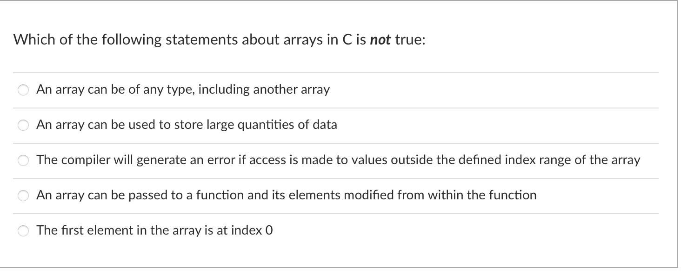
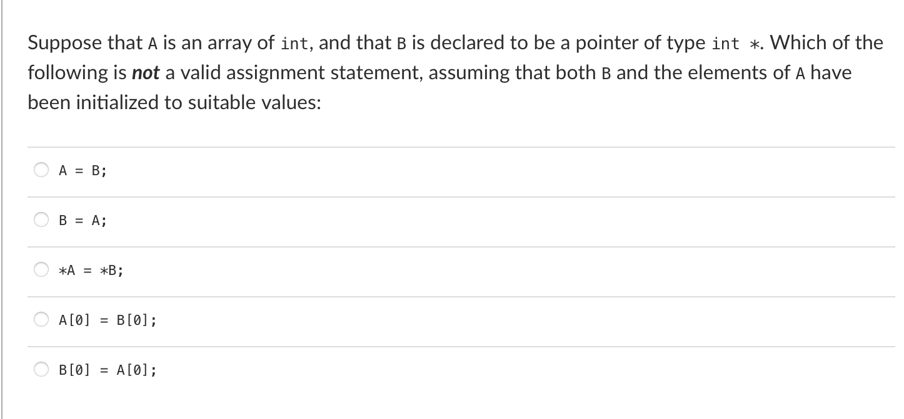
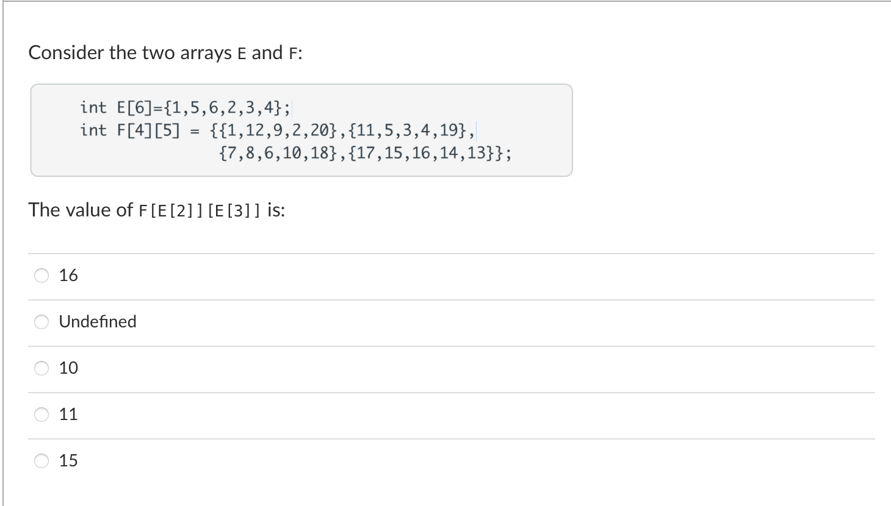
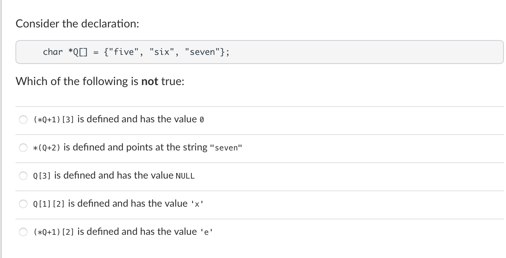

## Week 4

The following function was written by a student, and is intended to determine whether the argument n is prime, assuming that n ≥ 2:

```c
int
isprime(int n) {
    int f;
    for (f=2; f < n; f++) {
        if (n % f == 0) {
            return 0;
        } else {
            return 1;
        }
    }
}
```

Unfortunately, there is a mistake in the function, and it often returns the wrong value. This happens because:

A. The initialization on the for statement should be f=1

B. The guard on the if statement should be f%n==0

C. The first and second return statements should be swapped

D. The second return statement should be outside the for loop

E. The for loop should use the guard f*f<=n


The best description of the difference between int and char variables in C is that:

A. A char variable is just an int, but covering a smaller range of integer values

B. Any value stored in an int variable must be positive

C. It is not possible to read into a char variable using the function scanf()

D. Any value stored in a char variable must be positive

E. A char variable stores an ASCII character, and it is not possible to store ASCII characters in an int variable


Consider the following program skeleton:

```c
char x;
double y;
int z;

int
main(int argc, char *argv[]) {
    char y; double z;
    /* VVVV */
    return 0;
}
```
Which of the following statements is correct about the point in the program marked by the comment VVVV:

A. There are no variables of type int in scope

B. There is exactly one variable of type char in scope

C. There are exactly two variables of type char in scope

D. There are exactly two variables of type double in scope

E. There are exactly two variables of type int in scope


Consider the following sequence:

```c
int n=3, *p=&n, *q;
q = p+4;
```
The best and most likely summary of the situation is that:

A. Pointer q points at an address sixteen bytes further along in memory from n, but cannot be used to access memory because that address is not allocated to a variable

B. Pointer q points at an address sixteen bytes further along in memory from n, and could be used to access the contents of that location as an integer, whatever happens to be there

C. Pointer q points at an address thirty-two bytes further along in memory from n, and could be used to access the contents of that location as an integer, whatever happens to be there

D. Pointer q points at an address four bytes further along in memory from n, and could be used to access the contents of that location as an integer, whatever happens to be there

E. The declaration has a syntax error and is not legal C


[4 marks] Write a recursive function

```c
int fibonacci_rec(int n)
```

that takes an integer n (n >= 0) as input and returns the n-th number in the *Fibonacci sequence*. The 0-th and the 1-st numbers in the sequence are 0 and 1. Each subsequent number is the sum of the previous two numbers. So the sequence goes as: 0,1,1,2,3,5,8,13,21and so on.

Examples of the returned value of the function are as follows:

- fibonacci_rec(0) should return 0;
- fibonacci_rec(1) should return 1;
- fibonacci_rec(2) should return 1;
- fibonacci_rec(7) should return 13;
- fibonacci_rec(9) should return 34;

Note that you are not supposed to use any loops in your solution for this question. Also, you do not need to write a main function for this question or print any result.

```c
int
fibonacci_rec(int n){
    if(n == 0)
        return 0;
    if(n == 1)
        return 1;
    return fibonacci_rec(n - 1) + fibonacci_rec(n - 2);
}
```


---



1. Which of the following statements about arrays in C is not true: C

A. An array can be of any type, including another array

B. An array can be used to store large quantities of data

C. The compiler will generate an error if access is made to values outside the defined index range of the array

D. An array can be passed to a function and its elements modified from within the function

E. The first element in the array is at index 0

---



Suppose that A is an array of int, and that B is declared to be a pointer of type int *. Which of the following is not a valid assignment statement, assuming that both B and the elements of A have been initialized to suitable values:  A

A. `A = B;`

B. `B = A;`

C. `*A = *B;`

D. `A[0] = B[0];`

E. `B[0] = A[0];`

---



Consider the two arrays E and F:

```cpp
int E[6]={1, 5, 6, 2, 3，4};
int F[4][5] = {{1, 12, 9, 2, 20}, {11,5,3,4,19},
               {7,8,6,10,18}, {17, 15, 16,14,13}3;
```

The value of `F[E[2]][E[3]]` is:  B

A. 16

B. Undefined

 C. 10

D. 11

E. 15

---




Consider the declaration:

    char *Q[] = {"five", "six", "seven"};
Which of the following is not true:

A. `(*Q+1)[3]`  is defined and has the value 0

B. `*(Q+2)`  is defined and points at the string "seven"

C. `Q[3]` is defined and has the value NULL

D. `Q[1][2]` is defined and has the value 'x'

E. `(*Q+1)[2]` is defined and has the value 'e'


::: details 公众号：AI悦创【二维码】


:::

::: info AI悦创·编程一对一

AI悦创·推出辅导班啦，包括「Python 语言辅导班、C++ 辅导班、java 辅导班、算法/数据结构辅导班、少儿编程、pygame 游戏开发、Web、Linux」，全部都是一对一教学：一对一辅导 + 一对一答疑 + 布置作业 + 项目实践等。当然，还有线下线上摄影课程、Photoshop、Premiere 一对一教学、QQ、微信在线，随时响应！微信：Jiabcdefh

C++ 信息奥赛题解，长期更新！长期招收一对一中小学信息奥赛集训，莆田、厦门地区有机会线下上门，其他地区线上。微信：Jiabcdefh

方法一：[QQ](http://wpa.qq.com/msgrd?v=3&uin=1432803776&site=qq&menu=yes)

方法二：微信：Jiabcdefh

:::


