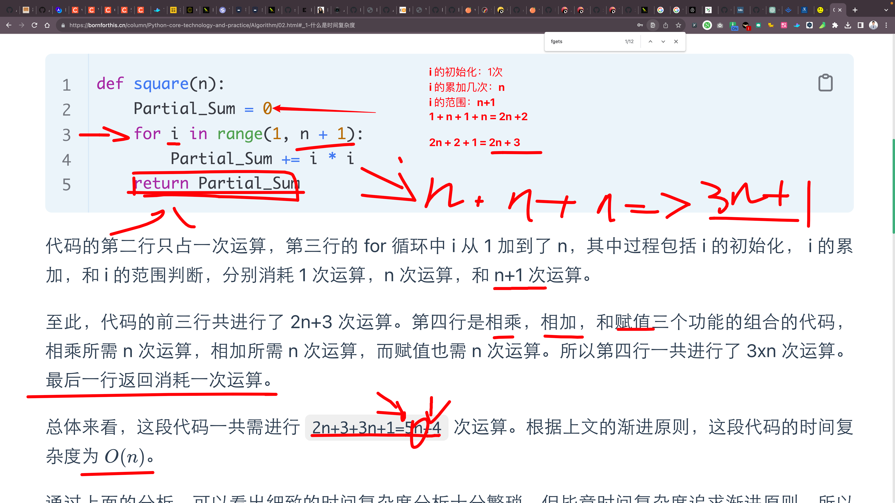

## 0. 待复习知识点

- [x] EOF 讲解
- [x] C 语言输出格式控制细讲
- [ ] getchar
- [ ] 大 O 法
- [ ] 讲题

## 1. EOF

在 C 语言中，`EOF` 是一个特殊的宏，代表 "End Of File"。其常常被用来表示输入或文件的结束。当读取数据达到文件的结尾或没有更多的输入数据时，许多标准库函数（例如 `fgetc()` 或 `scanf()`）会返回 `EOF` 来通知调用者。

几点关于 `EOF` 的详细说明：

1. **定义**：在 `stdio.h` 头文件中定义了 `EOF`，它通常被赋予 -1的值，但这并不是必需的。你只需要知道 `EOF` 是一个整数常量，并且它的值与任何 char 型的字符都不同。

2. **使用**：当你使用文件操作函数（如 `fgetc()`，`fscanf()`，`fread()` 等）时，可以检查返回值是否为 `EOF` 以确定是否达到了文件的末尾。

   ```c
   FILE *fp = fopen("example.txt", "r");
   if (fp != NULL) {
       int ch;
       while ((ch = fgetc(fp)) != EOF) {
           putchar(ch);
       }
       fclose(fp);
   }
   ```

   在上面的例子中，当 `fgetc()` 到达文件的结尾时，它会返回 `EOF`，从而结束循环。

3. **注意事项**：一定要确保你使用正确的数据类型来保存可能的 `EOF` 值。在上面的例子中，我们使用了 `int` 类型的 `ch` 来存储 `fgetc()` 的返回值，而不是 `char`。这是因为 `char` 可能只能表示有限的字符集，而 `EOF` 的值（通常为-1）可能无法在 `char` 类型中正确表示。

4. **手动输入**：当从标准输入读取数据时，你可以手动触发 `EOF` 来结束输入。在许多系统上，按下 `Ctrl + D` (在UNIX和Linux上) 或 `Ctrl + Z` (在Windows上) 并按回车键可以发送 `EOF`。

总的来说，`EOF` 是C语言中用于标记文件或输入结束的一个重要常量，它在进行文件操作和数据输入时发挥着重要作用。

::: code-tabs

@tab 使用 `fgetc()` 读取文件直到结束

```c
#include <stdio.h>

int main() {
    FILE *fp = fopen("example.txt", "r");
    if (fp == NULL) {
        perror("Error opening file");
        return 1;
    }

    int ch;
    while ((ch = fgetc(fp)) != EOF) {
        putchar(ch);
    }

    fclose(fp);
    return 0;
}
```

@tab 使用 `scanf()` 从标准输入读取数据直到 `EOF`

```c
#include <stdio.h>

int main() {
    int number, sum = 0;

    printf("Enter numbers (Ctrl-D or Ctrl-Z to end):\n");
    while (scanf("%d", &number) != EOF) {
        sum += number;
    }

    printf("The sum of entered numbers is: %d\n", sum);
    return 0;
}
```

@tab 使用 `getchar()` 读取输入直到 `EOF`

```c
#include <stdio.h>

int main() {
    int ch;
    printf("Enter text (Ctrl-D or Ctrl-Z to end):\n");
    
    while ((ch = getchar()) != EOF) {
        putchar(ch);  // Echo back the character
    }

    printf("\nReached end of input.\n");
    return 0;
}
```

:::

::: tabs

@tab perror

在C语言中，`perror()`是一个库函数，用于打印上一次系统调用失败的原因。这个函数会输出到标准错误流（通常是屏幕），描述最后一次出现的系统错误的字符串。这个字符串的内容取决于全局变量`errno`的值，这个变量会在很多系统调用或库函数出错时被设置。

当你调用`perror("Error opening file");`，它会做以下两件事：

1. 打印你提供的字符串，即 "Error opening file"。
2. 打印一个冒号和一个空格，然后是一个描述`errno`当前值的消息。例如，如果`errno`的值是`ENOENT`（这通常表示文件或目录不存在），则打印的消息将是 "No such file or directory"。

所以，如果文件不存在，执行上面的`perror()`调用将在屏幕上显示以下内容：

```
Error opening file: No such file or directory
```

通常，在调用了可能设置`errno`的函数（例如`open()`, `fopen()`, `read()`, `write()`等）并确定该函数失败后，你会使用`perror()`来报告错误原因。

@tab 表格速查

| 函数        | 使用 `EOF` | 如何检测输入结束或错误                | 函数作用                                           |
| ----------- | ---------- | ------------------------------------- | -------------------------------------------------- |
| `fgetc()`   | 是         | 当返回值等于 `EOF` 时                 | 从文件中读取一个字符                               |
| `fscanf()`  | 是         | 当返回值不匹配预期的项数或为 `EOF` 时 | 从文件中按指定格式读取输入                         |
| `fgets()`   | 否         | 当返回值为 `NULL` 时                  | 从文件中读取一行字符串到缓冲区                     |
| `fread()`   | 否         | 当返回值小于请求的项数时              | 从文件中读取数据块                                 |
| `getchar()` | 是         | 当返回值等于 `EOF` 时                 | 从标准输入读取一个字符                             |
| `scanf()`   | 是         | 当返回值不匹配预期的项数或为 `EOF` 时 | 从标准输入按指定格式读取输入                       |
| `gets()`    | 否         | 当返回值为 `NULL` 时                  | 从标准输入读取一行字符串到缓冲区（已弃用，不安全） |


### 1. `fgetc()`
从标准输入读取一个字符。
```c
int ch = fgetc(stdin);
if (ch != EOF) {
    printf("You entered: %c\n", ch);
}
```

### 2. `fscanf()`
从标准输入按指定格式读取输入。
```c
int value;
if (fscanf(stdin, "%d", &value) != 1) {
    printf("Invalid input or end of file encountered.\n");
} else {
    printf("You entered: %d\n", value);
}
```

### 3. `fgets()`
从标准输入读取一行字符串。
```c
char buffer[100];
if (fgets(buffer, sizeof(buffer), stdin) != NULL) {
    printf("You entered: %s", buffer);  // Note: %s will also print the newline character if it's in the buffer.
}
```

### 4. `fread()`
在不考虑文件操作的情境中，`fread()` 通常不用于标准输入，因为它更常用于二进制数据和结构的读取。然而，理论上它可以用于标准输入。
```c
char buffer[100];
size_t bytesRead = fread(buffer, 1, sizeof(buffer), stdin);
printf("Read %zu bytes from input.\n", bytesRead);
```

### 5. `getchar()`
从标准输入读取一个字符。
```c
int ch = getchar();
if (ch != EOF) {
    printf("You entered: %c\n", ch);
}
```

### 6. `scanf()`
从标准输入按指定格式读取输入。
```c
int value;
if (scanf("%d", &value) != 1) {
    printf("Invalid input or end of file encountered.\n");
} else {
    printf("You entered: %d\n", value);
}
```

### 7. `gets()`
从标准输入读取一行字符串。**注意**: `gets()` 由于安全问题在C11中已被弃用，这是一个示例但不建议使用。
```c
char buffer[100];
if (gets(buffer) != NULL) {  // Again, don't use this in real programs!
    printf("You entered: %s\n", buffer);
}
```

@tab EOF 可以在使用的时候简洁写成 E 吗？

在 C 语言中，`EOF` 是一个预定义的宏，通常用来表示 "End Of File"。这个宏名是固定的，不可以直接将 `EOF` 用 `E` 来代替。如果你这样做，编译器不会理解你想要表达什么。

然而，如果你真的想使用 `E` 作为 `EOF` 的简写，你可以定义自己的宏，但这可能会导致代码的可读性降低，因为其他开发者可能不熟悉你的约定。如果你仍然想这样做，可以这样：

```c
#include <stdio.h>

#define E EOF

int main() {
    int c;
    while ((c = getchar()) != E) {
        putchar(c);
    }
    return 0;
}
```

但请注意，这样做并不推荐，因为它可能会导致代码变得难以理解。使用标准的、已经广泛接受的命名约定总是一个好的实践，因为这样可以使代码对其他程序员更加友好。

@tab 补充

在。C 语言中，`EOF` (End of File) 是检测文件读取结束的常见标志。但当我们谈论循环的结束，实际上这取决于循环的用途和上下文。除了 `EOF`，有许多其他条件可以用作循环的结束标志：

1. **固定的循环计数**：例如，你知道循环需要执行 10 次。
   
   ```c
   for (int i = 0; i < 10; i++) {
       // ... do something ...
   }
   ```

2. **检测到特定值或字符**：当读取的输入达到某个特定值时结束循环。
   
   ```c
   char ch;
   while ((ch = getchar()) != 'q') {  // 当输入字符为 'q' 时结束循环
       // ... process the character ...
   }
   ```

3. **某个条件被满足**：这取决于程序的具体逻辑。

   ```c
   int number;
   do {
       printf("Enter a positive number: ");
       scanf("%d", &number);
   } while (number <= 0);  // 当输入的数字为正数时结束循环
   ```

4. **链表或数组遍历**：当达到链表的末尾或数组的末尾时结束循环。

   ```c
   int arr[] = {1, 2, 3, 4, 5};
   int size = sizeof(arr) / sizeof(arr[0]);
   for (int i = 0; i < size; i++) {
       // ... process array elements ...
   }
   ```

5. **外部事件**：例如，当从外部接收到某种信号或标志时结束循环。

6. **错误或异常情况**：在某些情况下，如果发生错误或异常，可能需要跳出循环。

   ```c
   FILE *fp = fopen("file.txt", "r");
   if (fp == NULL) {
       perror("Failed to open file");
       exit(EXIT_FAILURE);
   }
   
   char ch;
   while ((ch = fgetc(fp)) != EOF) {
       if (ferror(fp)) {  // 检查文件读取错误
           perror("Error reading the file");
           break;  // 结束循环
       }
       // ... process the character ...
   }
   fclose(fp);
   ```

这些只是结束循环的几种常见方法。实际上，循环可以根据任何条件来结束，这完全取决于你想要实现的逻辑。

:::

## 2. C 语言输出格式控制细讲

C 语言中，输出格式控制是通过 `printf()` 函数和相关的格式化字符串来实现的。在 `printf()` 函数中，格式化字符串可以包含普通字符和格式说明符。格式说明符以 `%` 字符开始，用于指定后续参数的输出格式。

让我们详细看一下 C 语言中常见的格式说明符：

1. **`%d`** 或 **`%i`**: 用于输出整数。

2. **`%u`**: 用于输出无符号整数。

3. **`%f`**: 用于输出浮点数。

4. **`%c`**: 用于输出一个字符。

5. **`%s`**: 用于输出一个字符串。

6. **`%x`** 或 **`%X`**: 用于输出十六进制数。`%x`产生小写字母，`%X`产生大写字母。

7. **`%o`**: 用于输出八进制数。

8. **`%e`** 或 **`%E`**: 用于以科学计数法输出浮点数或双浮点数。

9. **`%g`** 或 **`%G`**: 根据值的大小，自动选择`%f`或`%e`（`%E`）的格式。

10. **`%p`**: 用于输出指针。

11. **`%%`**: 用于输出一个`%`字符。

除了上述基本格式说明符，`printf()`还支持一系列的修饰符来进一步控制输出的格式。例如：

- **宽度**：您可以指定一个最小字段宽度。例如，`%10d`将输出一个整数，至少宽10个字符。

- **精度**：对于浮点数，您可以使用`.`后跟一个数字来指定小数点后的位数。例如，`%.2f`将输出一个浮点数，保留两位小数。

- **左对齐**：`%-10d`将产生一个左对齐的整数输出，宽度为10。

- **标志**：
  - `+`：始终显示符号，无论是正还是负。
  - ` `（空格）：如果没有显示正负号，则在正数前放置一个空格。
  - `0`：用零而不是空格进行填充。

示例：

```c
#include <stdio.h>

int main() {
    int num = 12345;
    double d = 123.456789;
    
    printf("默认整数输出：%d\n", num);
    printf("宽度为10的整数输出：%10d\n", num);
    printf("左对齐，宽度为10的整数输出：%-10d\n", num);
    printf("默认浮点数输出：%f\n", d);
    printf("保留2位小数的浮点数输出：%.2f\n", d);
    printf("宽度为10，保留2位小数的浮点数输出：%10.2f\n", d);
    printf("宽度为10，保留4位小数，左对齐的浮点数输出：%-10.4f\n", d);
    
    return 0;
}
```

这只是 C 语言中 `printf()` 函数输出格式控制的一个简单概述。

::: tabs

@tab 左对齐与右对齐

在 C 语言的 `printf` 函数中，左对齐和右对齐的控制是通过格式说明符的修饰来实现的。默认情况下，输出是右对齐的，但可以通过在宽度修饰前加`-`来实现左对齐。

以下是具体的示例，说明如何使用左对齐和右对齐：

### 1. 右对齐（默认）

- **整数：**
  ```c
  printf("%5d", 42);  // 输出：   42
  ```

- **浮点数：**
  ```c
  printf("%8.2f", 3.14);  // 输出：    3.14
  ```

- **字符串：**
  ```c
  printf("%10s", "Hello");  // 输出：     Hello
  ```

### 2. 左对齐

使用`-`修饰符。

- **整数：**
  ```c
  printf("%-5d", 42);  // 输出：42   
  ```

- **浮点数：**
  ```c
  printf("%-8.2f", 3.14);  // 输出：3.14    
  ```

- **字符串：**
  ```c
  printf("%-10s", "Hello");  // 输出：Hello     
  ```

### 3. 完整的代码示例：

```c
#include <stdio.h>

int main() {
    int num = 42;
    double pi = 3.14159;
    char str[] = "Hello";

    // 右对齐
    printf("右对齐整数：%10d\n", num);
    printf("右对齐浮点数：%10.2f\n", pi);
    printf("右对齐字符串：%10s\n", str);

    // 左对齐
    printf("左对齐整数  ：%-5d\n", num);
    printf("左对齐浮点数：%-5.2f\n", pi);
    printf("左对齐字符串：%-5s\n", str);

    return 0;
}
```

输出：
```c
右对齐整数：        42
右对齐浮点数：      3.14
右对齐字符串：     Hello
左对齐整数  ：42   
左对齐浮点数：3.14 
左对齐字符串：Hello
```

请注意，在实际输出中，因为空格在这里不可见，所以可能看起来不像预期的对齐，但在实际的控制台上运行这段代码会看到期望的对齐效果。

@tab 补充

1. **填充字符**：

   默认情况下，当指定宽度大于所需宽度时，`printf` 会使用空格作为填充字符。但是，如果您想用 `0`（零）作为填充字符，可以这样做：

   ```c
   printf("%05d", 42);  // 输出：00042
   ```

2. **正负号**：

   默认情况下，正数不会显示正号。但使用`+`修饰符，可以使其显示：

   ```c
   printf("%+5d", 42);   // 输出：  +42
   printf("%+5d", -42);  // 输出：  -42
   ```

3. **空格修饰符**：

   对于正数，可以在数前面加一个空格，而不是正号，使用（空格）修饰符：

   ```c
   printf("% 5d", 42);   // 输出：   42
   printf("% 5d", -42);  // 输出：  -42
   ```

4. **`#`修饰符**：

   对于八进制和十六进制，可以使用`#`修饰符来显示前缀`0`（对于八进制）或`0x`/`0X`（对于十六进制）：

   ```c
   printf("%#o", 42);    // 输出：052 // 转换到八进制 42 的八进制是 52
   printf("%#x", 42);    // 输出：0x2a
   printf("%#X", 42);    // 输出：0X2A
   ```

5. **组合修饰符**：

   可以组合使用多种修饰符。例如，宽度、精度、左对齐和填充可以组合在一起：

   ```c
   printf("%-+8.2f", 3.14);  // 输出：+3.14   
   ```

6. **动态宽度和精度**：

   可以使用 `*` 来从参数列表中读取宽度或精度值，而不是在格式字符串中直接指定。例如：

   ```c
   int width = 6;
   printf("%*d", width, 42);  // 输出：    42
   ```

这些修饰符和格式说明符为我们提供了丰富的输出格式控制，从而满足多种输出需求。

:::

## 3. C 各种输入函数汇总

C 语言提供了多种从标准输入（通常是键盘）获取用户输入的方法。下面是几个常用的函数，它们的功能，以及各自的使用场景。

| 函数        | 描述                                   | 使用场景                                           |
| ----------- | -------------------------------------- | -------------------------------------------------- |
| `getchar()` | 读取下一个可用的字符                   | 当你只需要逐个字符地读取输入时                     |
| `gets()`    | 读取一行，直到遇到换行符，**已被弃用** | 由于容易引起缓冲区溢出，这个函数已被弃用           |
| `scanf()`   | 根据格式字符串读取输入                 | 当你需要基于特定格式读取输入，如读取数字、字符串等 |
| `fgets()`   | 读取一行，直到遇到换行符或达到指定长度 | 读取整行的文本，但要限制最大长度                   |
| `fscanf()`  | 从文件流中按照格式字符串读取输入       | 当你需要从文件或其他流中按格式读取数据             |
| `sscanf()`  | 从字符串中按照格式字符串读取输入       | 当你需要从已有的字符串中解析数据                   |

以下是关于上述函数的使用场景详解：

::: tabs

@tab **`getchar()`**
- 逐个读取字符。
- 通常用于字符输入的循环。

```c
int ch;
while ((ch = getchar()) != '\n' && ch != EOF) {
    // 处理字符
}
```

@tab **`gets()`**

- 这个函数由于容易引起缓冲区溢出已被弃用。使用 `fgets()` 作为替代。

@tab **`scanf()`**
- 非常灵活，可以根据格式化字符串读取多种数据类型。
- 注意处理缓冲区的问题，如剩余的换行符。

```c
int number;
scanf("%d", &number);
```

@tab **`fgets()`**:
- 可以读取一整行输入。
- 比 `gets()` 更安全，因为你可以指定最大读取长度。

```c
char buffer[100];
fgets(buffer, sizeof(buffer), stdin);
```

1. **`fscanf()`**:
   - 与 `scanf()` 类似，但可以从指定的文件流中读取。

   ```c
   FILE *fp = fopen("file.txt", "r");
   int number;
   fscanf(fp, "%d", &number);
   fclose(fp);
   ```

2. **`sscanf()`**:
   - 允许你从字符串中按照给定的格式读取数据。

   ```c
   char str[] = "12345";
   int value;
   sscanf(str, "%d", &value);
   ```

在实际使用时，你应该基于特定的输入需求选择合适的函数，并始终注意安全性问题，特别是缓冲区溢出的问题。


:::

## 4. 大 O 法



首先，对于斐波那契函数的时间复杂度，一个直观的方法是通过递归树来观察它是如何扩展的。

1. 当我们调用 `feb(n)`，这个调用分裂为两个子调用，即 `feb(n-1)` 和 `feb(n-2)`。

2. `feb(n-1)` 本身再分裂为 `feb(n-2)` 和 `feb(n-3)`。

3. 同样地，`feb(n-2)` 分裂为 `feb(n-3)` 和 `feb(n-4)`。

当我们把这些调用绘制为树状结构，我们会看到一个递归树，其结构与斐波那契数列类似。

为了理解这个增长，我们需要看看斐波那契数列的增长情况。

斐波那契数列的通项公式可以表达为：
$\large f(n) = \frac{\phi^n - (-\phi^{-1})^n}{\sqrt{5}}$ 
其中，
$\large \phi = \frac{1 + \sqrt{5}}{2}$
这是黄金分割率。

关键在于我们只关心最大的增长项，因为这是最终决定复杂度的部分。因此，我们只看 \($\phi^n$\)。

为了简化，我们可以说斐波那契数列大约以 ($\phi^n$\) 或 \($1.618^n$\) 的速度增长。这里，n 是输入大小。

现在，为什么时间复杂度与斐波那契数列的增长相似？

考虑每次递归调用：你有 ($T(n) = T(n-1) + T(n-2)$)。这个递推关系跟斐波那契数列的定义很相似。实际上，它的解是与 ($\phi^n$) 相关的。

由于递归函数的调用数量随着输入大小 n 呈指数级增长，所以我们可以说函数的时间复杂度是 ($O(1.618^n)$)。但在计算机科学中，我们经常喜欢取最坏情况的上界，所以我们经常将其四舍五入为 ($O(2^n)$)，即指数级时间复杂度。

## 5. C 语言 math.h 常用的方法

在 C 语言中，`math.h` 是一个提供数学函数和宏定义的标准库。下面列出了一些在 `math.h` 中常用的方法：

1. **三角函数**
   - `double sin(double x)`: 返回 x 的正弦。
   - `double cos(double x)`: 返回 x 的余弦。
   - `double tan(double x)`: 返回 x 的正切。

2. **反三角函数**
   - `double asin(double x)`: 返回 x 的反正弦。
   - `double acos(double x)`: 返回 x 的反余弦。
   - `double atan(double x)`: 返回 x 的反正切。
   - `double atan2(double y, double x)`: 返回 y/x 的反正切，考虑两者的符号来确定象限。

3. **双曲函数**
   - `double sinh(double x)`: 返回 x 的双曲正弦。
   - `double cosh(double x)`: 返回 x 的双曲余弦。
   - `double tanh(double x)`: 返回 x 的双曲正切。

4. **指数和对数函数**
   - `double exp(double x)`: 返回 e 的 x 次幂。
   - `double log(double x)`: 返回 x 的自然对数 (以 e 为底)。
   - `double log10(double x)`: 返回 x 的对数 (以 10 为底)。
   - `double pow(double x, double y)`: 返回 x 的 y 次幂。
   - `double sqrt(double x)`: 返回 x 的平方根。

5. **其他函数**
   - `double ceil(double x)`: 返回大于或等于 x 的最小整数。
   - `double floor(double x)`: 返回小于或等于 x 的最大整数。
   - `double fabs(double x)`: 返回 x 的绝对值。
   - `double fmod(double x, double y)`: 返回 x 除以 y 的余数。
   - `double modf(double x, double *intpart)`: 将 x 分为整数部分和小数部分。

6. **近似、误差和舍入函数**
   - `double frexp(double x, int *exp)`: 将数字分解为尾数和指数。
   - `double ldexp(double x, int exp)`: 根据尾数和指数计算其值。
   - `double erf(double x)`: 返回 x 的误差函数值。
   - `double erfc(double x)`: 返回 x 的互补误差函数值。

7. **浮点数比较函数**
   - `int isgreater(double x, double y)`: 如果 x 大于 y，则返回非零值。
   - `int isless(double x, double y)`: 如果 x 小于 y，则返回非零值。
   ... 还有其他类似的函数。

8. **常数**
   - `M_E`: e 的值。
   - `M_PI`: π 的值。
   ... 以及其他数学常数。

为了使用 `math.h` 库中的函数，你需要在你的 C 代码中包含这个头文件 (`#include <math.h>`)，并在编译时链接 `-lm` 选项以链接数学库。

以下是上述函数的使用实例，汇总在同一个代码中：

```c
#include <stdio.h>
#include <math.h>

int main() {
    double x = 2.0, y = 3.0, result;
    double intpart, fracpart;

    // 1. 三角函数
    result = sin(x);
    printf("sin(%f) = %f\n", x, result);

    result = cos(x);
    printf("cos(%f) = %f\n", x, result);

    result = tan(x);
    printf("tan(%f) = %f\n", x, result);

    // 2. 反三角函数
    result = asin(1.0); // 最大输入为1
    printf("asin(1.0) = %f\n", result);

    result = acos(1.0); // 最大输入为1
    printf("acos(1.0) = %f\n", result);

    result = atan(x);
    printf("atan(%f) = %f\n", x, result);

    result = atan2(y, x);
    printf("atan2(%f, %f) = %f\n", y, x, result);

    // 3. 双曲函数
    result = sinh(x);
    printf("sinh(%f) = %f\n", x, result);

    result = cosh(x);
    printf("cosh(%f) = %f\n", x, result);

    result = tanh(x);
    printf("tanh(%f) = %f\n", x, result);

    // 4. 指数和对数函数
    result = exp(x);
    printf("exp(%f) = %f\n", x, result);

    result = log(x);
    printf("log(%f) = %f\n", x, result);

    result = log10(x);
    printf("log10(%f) = %f\n", x, result);

    result = pow(x, y);
    printf("%f to the power of %f = %f\n", x, y, result);

    result = sqrt(x);
    printf("sqrt(%f) = %f\n", x, result);

    // 5. 其他函数
    result = ceil(x);
    printf("ceil(%f) = %f\n", x, result);

    result = floor(x);
    printf("floor(%f) = %f\n", x, result);

    result = fabs(-x);
    printf("fabs(-%f) = %f\n", x, result);

    result = fmod(x, y);
    printf("fmod(%f, %f) = %f\n", x, y, result);

    fracpart = modf(x, &intpart);
    printf("modf(%f) = %f (fractional), %f (integral)\n", x, fracpart, intpart);

    // 6. 近似、误差和舍入函数（仅展示部分）
    result = erf(x);
    printf("erf(%f) = %f\n", x, result);

    result = erfc(x);
    printf("erfc(%f) = %f\n", x, result);

    // 7. 常数
    printf("Value of e = %f\n", M_E);
    printf("Value of pi = %f\n", M_PI);

    return 0;
}
```

此代码包含了上述函数的基本使用实例，并用 `printf` 显示了每个函数的结果。为了使这个代码工作，确保你已经安装了 C 语言的编译器，并正确地包含了 `math.h`。当你编译这段代码时，记得链接 `-lm` 选项，例如：

```c
gcc -o math_example math_example.c -lm
```

然后，运行生成的程序：

```c
./math_example
```


::: details 公众号：AI悦创【二维码】


:::

::: info AI悦创·编程一对一

AI悦创·推出辅导班啦，包括「Python 语言辅导班、C++ 辅导班、java 辅导班、算法/数据结构辅导班、少儿编程、pygame 游戏开发、Web、Linux」，全部都是一对一教学：一对一辅导 + 一对一答疑 + 布置作业 + 项目实践等。当然，还有线下线上摄影课程、Photoshop、Premiere 一对一教学、QQ、微信在线，随时响应！微信：Jiabcdefh

C++ 信息奥赛题解，长期更新！长期招收一对一中小学信息奥赛集训，莆田、厦门地区有机会线下上门，其他地区线上。微信：Jiabcdefh

方法一：[QQ](http://wpa.qq.com/msgrd?v=3&uin=1432803776&site=qq&menu=yes)

方法二：微信：Jiabcdefh

:::


