## Section 1 -- Multiple Choice (5 marks)

### Question 1

::: tabs

@tab EN

Setting the pointer to a `malloc()`'ed chunk of memory to `NULL` after `free()`'ing it is:

A. necessary, as the final step of freeing up the memory the pointer variable had been referencing

B. mandatory, otherwise the program will not compile

C. mandatory, otherwise the program will have runtime errors

D. unnecessary, because it is automatically set to `NULL` anyway

E. a good programming habit, to protect your program from accessing the memory the pointer had been pointing to

@tab ZH

将指针设置为`malloc()`分配的内存块，并在`free()`之后将其设置为`NULL`是：

A. 必要的，因为这是释放指针变量曾经引用的内存的最后一步

B. 强制性的，否则程序将无法编译

C. 强制性的，否则程序将会有运行时错误

D. 不必要的，因为它反正会自动设置为`NULL`

E. 一个良好的编程习惯，为了保护您的程序不访问指针曾经指向的内存

@tab malloc 解析

在C语言中，`malloc()` 是 Memory Allocation（内存分配）的缩写。它是`stdlib.h`（或`malloc.h`）库中提供的一个函数，用于在堆上动态分配内存。`malloc()` 的主要作用和特点如下：

1. **动态内存分配**：与数组和其他静态数据结构相比，`malloc()` 允许在运行时动态地分配内存。这意味着你可以根据程序的需要（通常基于运行时的数据或用户输入）来决定分配多少内存。

2. **返回类型**：`malloc()` 返回一个指向分配内存的第一个字节的指针。这个指针的类型是 `void *`，所以通常需要将它转换为指向适当类型的指针。

3. **参数**：`malloc()` 接受一个参数，该参数指定要分配的字节数。

   ```c
   int *arr = (int*)malloc(10 * sizeof(int));  // 分配了10个整数的空间
   ```

4. **初始值**：使用`malloc()` 分配的内存没有初始值。这意味着这块内存的内容是不确定的，除非你明确地给它赋值。

5. **释放内存**：一旦使用 `malloc()` 分配了内存，你必须记住在不再需要这块内存时使用 `free()` 函数来释放它。否则，会导致内存泄漏。

6. **返回值**：如果`malloc()` 不能分配请求的内存大小，它会返回 `NULL`。因此，分配内存后检查返回的指针是否为 `NULL` 是一个好习惯。

总之，`malloc()` 是C语言中用于动态内存分配的关键函数。使用它时必须小心，确保正确分配内存、给内存赋值、并在适当的时候释放内存，以避免内存泄漏和其他相关的问题。

@tab 题目解析

关于在`free()`后将指针设置为`NULL`的说明：

A. 这并不是释放内存的必要步骤。`free()`已经释放了内存，但是指针仍然保留了之前的地址。因此，此选项是不正确的。

B. 设置指针为`NULL`与程序是否能够编译无关。因此，此选项是不正确的。

C. 如果不将指针设置为`NULL`，并且后续尝试访问或释放该指针，会导致未定义的行为，这可能是运行时错误。但并不是说不将其设置为`NULL`就一定会导致运行时错误，这取决于程序中其他部分的逻辑。因此，此选项可能是部分正确的，但不是绝对的。

D. `free()`释放内存后，并不会自动将指针设置为`NULL`。所以，此选项是不正确的。

E. 将已经`free()`的指针设置为`NULL`确实是一个良好的编程习惯。这样可以防止程序不小心再次使用或释放该指针，从而导致未定义的行为。因此，此选项是正确的。

综上所述，正确答案是：

E. 一个良好的编程习惯，为了保护您的程序不访问指针曾经指向的内存。

:::

### Question 2

::: tabs

@tab EN

Suppose that 8-bit two's complement numbers are being employed. What bit pattern corresponds to the decimal integer value −50 (negative fifty):

A. 11001111

B. 00110010

C. 11001110

D. 11001101

C. 01001110

@tab ZH

假设我们使用的是8位二进制补码数。那么十进制整数值-50（负五十）对应的位模式是：

A. 11001111

B. 00110010

C. 11001110

D. 11001101

E. 01001110

注意：选项C被列出了两次。我假设后者应该是E。

@tab 解答

我们首先需要知道正数50在8位二进制中的表示，然后再找到它的二进制补码表示。

1. **找到正数50的二进制表示**:

50 = 32 + 16 + 2 = 2^5 + 2^4 + 2^1

所以，50的二进制表示为：`00110010`

2. **计算补码**:

为了得到-50的二进制补码，我们先取正数50的二进制表示的反码，然后加1。

正数50的二进制表示: `00110010`

反码: 将每一位都取反: `11001101`

再加1: `11001101` + 1 = `11001110`

所以，-50的二进制补码表示为：`11001110`

答案是 **C. 11001110**。

:::


### Question 3

::: tabs

@tab EN

In the 32-bit floating point system (for `float` variables) that was explored using the `floatbits.c` program the following bit patterns are observed for the three given values, expressed as four 8-bit bytes:

```c
    2.0 =  01000000 00000000 00000000 00000000
    3.0 =  01000000 01000000 00000000 00000000
    4.0 =  01000000 10000000 00000000 00000000
```

The bit pattern corresponding to the decimal number `5.0` is most likely to be:

A. 01000000 11000000 00000000 00000000

B. 01000001 10100000 00000000 00000000

C. 01000000 10100000 00000000 00000000

D. 01000000 10101000 00000000 00000000

E. 01000000 10010000 00000000 00000000

@tab ZH

在使用`floatbits.c`程序探索的32位浮点系统（针对`float`变量）中，对于给定的三个值，观察到以下位模式，表示为四个8位字节：

```c
    2.0 =  01000000 00000000 00000000 00000000
    3.0 =  01000000 01000000 00000000 00000000
    4.0 =  01000000 10000000 00000000 00000000
```

对应于十进制数`5.0`的位模式最有可能是：

A. 01000000 11000000 00000000 00000000

B. 01000001 10100000 00000000 00000000

C. 01000000 10100000 00000000 00000000

D. 01000000 10101000 00000000 00000000

E. 01000000 10010000 00000000 00000000

@tab 解答

根据给定的信息，我们可以观察到数值的增加与第二个8位字节的变化有关。从2.0到3.0，这个字节的值增加了`01000000`；从3.0到4.0，这个字节的值又增加了`01000000`。

考虑到这个趋势，我们可以推测从4.0到5.0时，第二个8位字节的值将再次增加`01000000`。

4.0的第二个字节是：`10000000`

增加`01000000`后得到：`11000000`

所以，5.0的预期位模式应该是：`01000000 11000000 00000000 00000000`

答案是 **A. 01000000 11000000 00000000 00000000**。

:::

### Question 4

::: tabs

@tab EN

The **best** description of a `FILE*` pointer is that it stores the address of:

A. The next unprocessed byte from the file that is being read

B. An integer file number that is assigned by a call to `fopen()`

C. The first byte from the file that is being read

D. A structure that is created by a call to `fopen()`

E. The complete set of bytes from the file that is being read, including the ones that have already been processed

@tab ZH

最佳描述`FILE*`指针的是，它存储的地址是：

A. 正在读取的文件中的下一个未处理的字节

B. 通过调用`fopen()`分配的整数文件号

C. 正在读取的文件中的第一个字节

D. 通过调用`fopen()`创建的结构

E. 正在读取的文件中的所有字节，包括已经被处理的字节

@tab Solution

A. 正在读取的文件中的下一个未处理的字节

解释：这意味着`FILE*`指针指向文件中尚未读取的下一个字节的地址。但实际上，`FILE*`不仅仅存储这样的信息。

B. 通过调用`fopen()`分配的整数文件号

解释：在某些系统中，打开的文件确实有一个与之关联的文件描述符，它是一个整数。但`FILE*`不直接存储这个整数，而是存储关于文件的更多信息的结构的地址。

C. 正在读取的文件中的第一个字节

解释：这意味着`FILE*`指针指向文件的开始。但实际上，`FILE*`存储的是关于文件的更多信息的结构的地址，而不是直接指向文件内容的开始。

D. 通过调用`fopen()`创建的结构

解释：当你调用`fopen()`函数时，它返回一个指向结构的指针，这个结构包含了关于打开文件的各种信息。这个结构管理缓冲、文件位置、状态和其他必要的数据以操作文件。

E. 正在读取的文件中的所有字节，包括已经被处理的字节

解释：这意味着`FILE*`指针存储了文件的所有内容。但实际上，`FILE*`并不直接存储文件的内容，而是存储一个结构的地址，这个结构帮助管理如何访问和操作文件。

@tab 学习

## 1. FILE* 是什么？

`FILE*` 是一个指针，它指向一个`FILE`结构。这个结构包含了打开文件的各种信息，如文件位置、缓冲状态、错误标志等。你不需要直接操作这个结构，因为C语言提供了一组函数来操作它。

## 2. 打开和关闭文件

使用`fopen`函数打开文件。这个函数返回一个`FILE*`，如果打开失败则返回`NULL`。

```c
FILE* file = fopen("filename.txt", "r");  // 打开文件以读取
if (file == NULL) {
    // 打开文件失败
}
```

当完成文件操作后，使用`fclose`关闭它：

```c
fclose(file);
```

## 3. 读取和写入文件

- 使用`fgetc`逐字符读取：

```c
char ch;
while ((ch = fgetc(file)) != EOF) {  // EOF表示文件结束
    putchar(ch);
}
```

- 使用`fputc`逐字符写入：

```c
char ch = 'A';
fputc(ch, file);
```

- 使用`fgets`和`fputs`逐行读写：

```c
char buffer[100];
fgets(buffer, 100, file);
fputs("Hello, World!\n", file);
```

## 4. 错误处理

如果文件操作中出现错误，可以使用`ferror`检查：

```c
if (ferror(file)) {
    // 发生错误
}
```

## 5. 示例：复制文件内容

```c
#include <stdio.h>

int main() {
    FILE* src = fopen("source.txt", "r");
    FILE* dest = fopen("destination.txt", "w");

    if (src == NULL || dest == NULL) {
        printf("Error opening files!\n");
        return 1;
    }

    char ch;
    while ((ch = fgetc(src)) != EOF) {
        fputc(ch, dest);
    }

    fclose(src);
    fclose(dest);
    return 0;
}
```

```c
#include <stdio.h> // 引入标准输入输出库

// 定义写入文件的函数
void writeFile(const char *filename) {
    // 使用fopen函数以写入模式("w")打开文件
    FILE *file = fopen(filename, "w");

    // 如果文件打开失败（例如，由于权限问题或磁盘空间不足），file将为NULL
    if (file == NULL) {
        printf("Error opening file for writing.\n"); // 打印错误信息
        return; // 提前结束函数执行
    }

    // 使用fputs函数将字符串写入文件
    fputs("Hello, World!\n", file);

    // 使用fputc函数将单个字符写入文件
    fputc('A', file);

    // 再次使用fputs函数将另一个字符串写入文件
    fputs("\nThis is a test.\n", file);

    // 使用fclose函数关闭文件，释放系统资源
    fclose(file);

    // 打印成功写入的消息
    printf("File written successfully.\n");
}

// 定义读取文件的函数
void readFile(const char *filename) {
    // 使用fopen函数以读取模式("r")打开文件
    FILE *file = fopen(filename, "r");

    // 如果文件打开失败，file将为NULL
    if (file == NULL) {
        printf("Error opening file for reading.\n"); // 打印错误信息
        return; // 提前结束函数执行
    }

    char ch; // 定义字符变量存储读取的字符
    // 使用fgetc函数逐字符读取文件内容，直到文件结束(EOF)
    while ((ch = fgetc(file)) != EOF) {
        putchar(ch); // 使用putchar函数打印字符到控制台
    }

    // 使用fclose函数关闭文件
    fclose(file);
}

int main() {
    const char *filename = "test.txt"; // 定义要操作的文件名

    // 调用writeFile函数写入文件
    writeFile(filename);

    // 打印消息说明开始读取文件内容
    printf("\nContents of the file:\n");

    // 调用readFile函数读取并打印文件内容
    readFile(filename);

    return 0; // main函数返回0，表示程序正常结束
}

```

```c
#include <stdio.h>

void writeUserInputToFile(const char *filename) {
    char buffer[256]; // 缓冲区，存储用户输入

    FILE *file = fopen(filename, "w"); // 打开文件以写入
    if (file == NULL) {
        printf("Error opening file for writing.\n");
        return;
    }

    printf("Please enter some text (press Enter to finish):\n");
    fgets(buffer, sizeof(buffer), stdin); // 从标准输入获取一行文本

    fputs(buffer, file); // 将文本写入文件

    fclose(file);
    printf("Your input has been written to %s\n", filename);
}

int main() {
    const char *filename = "user_input.txt";

    writeUserInputToFile(filename);

    return 0;
}

```


:::

### Question 5

::: tabs

@tab EN

Suppose that some algorithm requires that a sequence *p* insertion operations and *q* search operations be performed on a dictionary data structure, with insertions and search operations interleaved in an unknown order, and with the dictionary empty at the beginning of the sequence.

Which of the following is the most **correct and precise** statement about the overall data structure time required to carry out the total sequence of *p* + *q* dictionary operations:

A. If a sorted array is used to store the data, the cost attributable to the dictionary will be O((*p* + *q*) *q*) in the worst case

B. If a sorted array is used to store the data, the cost attributable to the dictionary will be O(*p*2 + *q* log *p*) in the worst case

C. If an unsorted array is used to store the data, the cost attributable to the dictionary will be O(*p* + *q*2) in the worst case

D. If a binary search tree is used to store the data, the cost attributable to the dictionary will be O((*p* + *q*) log *p*) in the worst case

E. If a hash table is used to store the data, the cost attributable to the dictionary will be O(*p* + *q*) in the worst case

@tab ZH

假设某个算法要求在一个字典数据结构上执行一个序列 *p* 的插入操作和 *q* 的搜索操作，插入和搜索操作以未知的顺序交错，且在序列开始时字典为空。

关于执行总共 *p* + *q* 个字典操作所需的整体数据结构时间，以下哪项是最**正确且精确**的陈述：

A. 如果使用已排序数组来存储数据，那么归因于字典的成本在最坏情况下将是 O((*p* + *q*) *q*)

B. 如果使用已排序数组来存储数据，那么归因于字典的成本在最坏情况下将是 O(*p*^2 + *q* log *p*)

C. 如果使用未排序数组来存储数据，那么归因于字典的成本在最坏情况下将是 O(*p* + *q*^2)

D. 如果使用二叉搜索树来存储数据，那么归因于字典的成本在最坏情况下将是 O((*p* + *q*) log *p*)

E. 如果使用哈希表来存储数据，那么归因于字典的成本在最坏情况下将是 O(*p* + *q*)

@tab 答案

这是一个关于不同数据结构执行插入和搜索操作的时间复杂度的问题。需要考虑每种数据结构的性质以及插入和搜索操作的复杂性。可以按选项来分析：

A. 已排序数组：每次插入操作的最坏时间复杂度是 O(*q*)，因为你可能需要为新元素腾出空间，这需要移动数组中的其他元素。搜索操作使用二分查找，时间复杂度是 O(log *p*)。但这个时间复杂度 O((*p* + *q*) *q*) 更像是在每次操作时都做最坏的假设。所以这个选项可能不是最佳答案。

B. 已排序数组：如上所述，每次插入操作的最坏时间复杂度是 O(*p*)，而搜索操作是 O(log *p*)。所以总的时间复杂度是 O(*p*^2 + *q* log *p*)。这个选项看起来更加合理。

C. 未排序数组：插入操作很简单，直接在数组的末尾插入，时间复杂度是 O(1)，即 O(*p*)。搜索操作需要遍历整个数组，时间复杂度是 O(*q*)。所以总的时间复杂度是 O(*p* + *q*^2)。

D. 二叉搜索树：通常，插入和搜索操作的时间复杂度是 O(log *n*)，其中*n*是树中的节点数量。但在最坏情况下，树可能会变得很倾斜，导致时间复杂度达到 O(*n*)。但这个时间复杂度 O((*p* + *q*) log *p*) 假设了树是平衡的。

E. 哈希表：在最佳情况和平均情况下，插入和搜索操作的时间复杂度都是 O(1)。但在最坏情况下，可能需要遍历所有桶。然而，通常不会认为哈希表的插入和搜索操作在最坏情况下都是 O(*n*)，因为如果哈希函数选择得当，冲突应该是最小的。因此，O(*p* + *q*) 是合理的估计。

根据上述分析，选项 B 和选项 E 都是合理的答案。那么选项 B（已排序数组）为 O(*p*^2 + *q* log *p*) 在最坏情况下可能是最合适的答案。

:::

## Section 2 -- Short Answer (12 marks)

### Question 6

Suppose that the pattern

```c
    now#or#never
```

is being used to search the text `T` given by

```c
        0    0    1    1    2    2    3
        01234567890123456789012345678901234
    T = not#now#not#never#not#now#nor#never
    P = now#or#never
```

using the KMP algorithm that was presented in lectures.

The *first* alignment of the pattern is at offset `0` in `T`, and is where the pattern matching process commences, as shown in the diagram.

Trace the KMP algorithm as it operates from then on, and indicate the character offsets in `T` (using the numbers above the target string as a guide) of the third, fifth, and seveth alignments of the pattern.

::: tabs

@tab 1

The offset associated with the third alignment is？

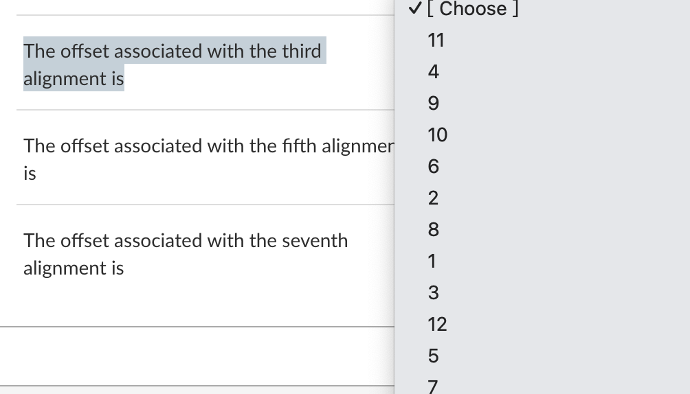

@tab 2

The offset associated with the fifth alignment is？

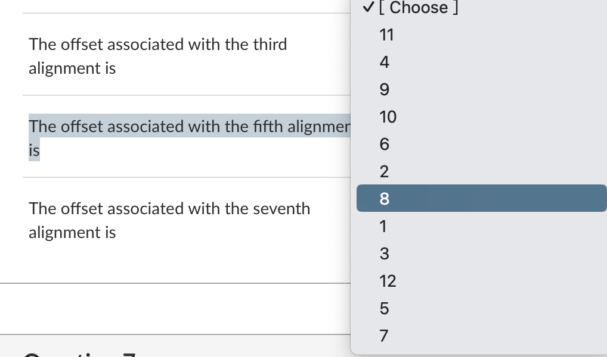

@tab 3

The offset associated with the seventh alignment is？

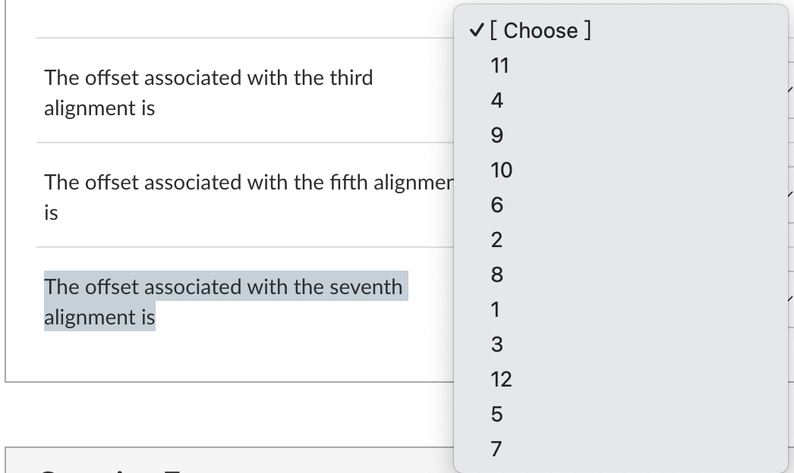

@tab zh

假设模式

```c
    now#or#never
```

被用来搜索由以下文本 `T` 给出的内容：

```c
        0    0    1    1    2    2    3
        01234567890123456789012345678901234
    T = not#now#not#never#not#now#nor#never
    P = now#or#never
```

使用在课程中介绍的KMP算法。

模式的 *第一个* 对齐在 `T` 中的偏移量为 `0`，这也是模式匹配过程开始的地方，如图所示。

追踪KMP算法从那时起的操作，并指示在 `T` 中的字符偏移量（使用目标字符串上方的数字作为指南），模式的第三，第五和第七个对齐。

1. 与第三次对齐相关的偏移量是
2. 与第五次对齐相关的偏移量是
3. 与第七次对齐相关的偏移量是

:::

### Question 7

Consider the seven-character string `"baa#bab"`, and an eight-element suffix array `S[8]` constructed for it. Fill in the values of the specified elements of `S[]`.

*When constructing the suffix array, assume that character* `'#'` *is smaller than any of the alphabetic characters, and that* `'$'` *is the special symbol appended to the string that is smaller than all of the normal characters.*

::: tabs

@tab 1

The value of S[0] is

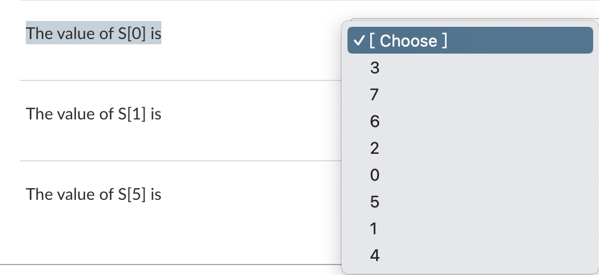

@tab 2

The value of S[1] is

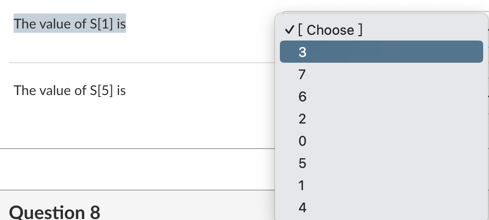

@tab 3

The value of S[5] is

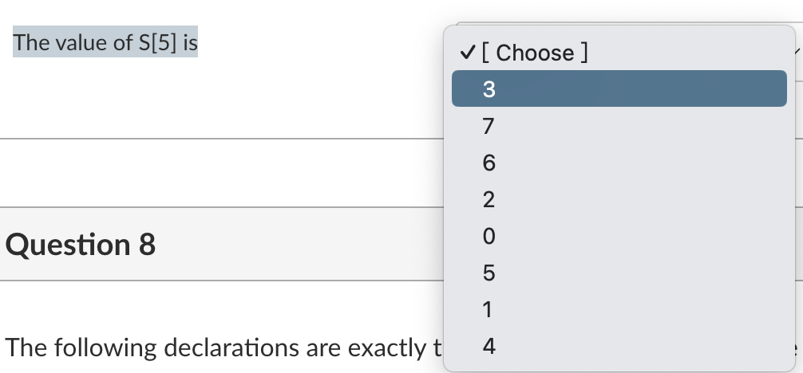

:::

### Question 8

The following declarations are exactly the same as the ones used in the file `lists.h` that was discussed in class.

```c
    typedef struct node node_t;

    struct node {
        data_t data;
        node_t *next;
    };

    typedef struct {
        node_t *head;
        node_t *foot;
    } list_t;
```

A student wrote the following function to reverse the nodes in a list by reassigning all the pointers, so that the node (and data item) that used to be at the head of the list is now at the foot, and the node (and data item) that used to be at the foot of the list is now at the head. But four of the student's assignment statements have been lost.

```c
    list_t
    *reverse(list_t *list) {
        node_t *curr, *prev, *next;
        assert(list);
        prev = NULL;
        curr = list->head;
        while (curr) {
            // line A
            // line B
            // line C
            curr = next;
        }
        list->foot = list->head;
        // line D
        return list;
    }
```

Match the line locations on the left with the correct assignment statements on the right.

::: tabs

@tab line A

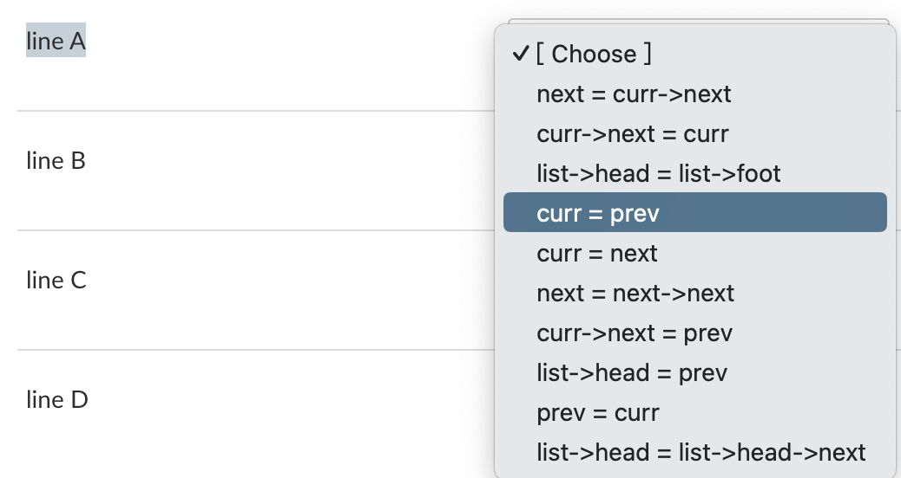

@tab line B

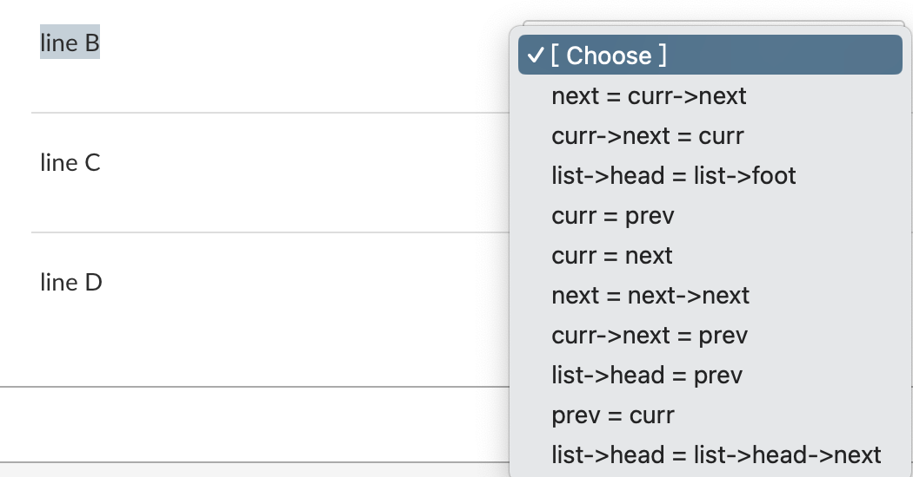

@tab line C

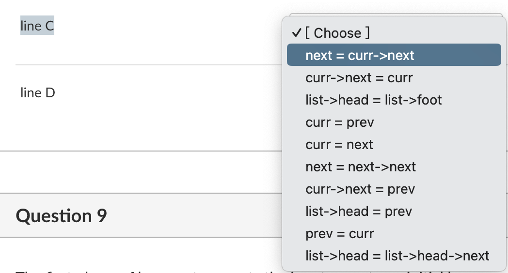

@tab line D

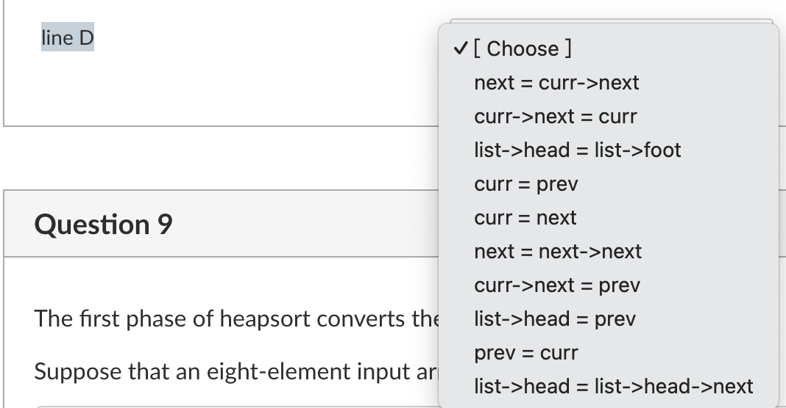


:::

### Question 9

The first phase of heapsort converts the input array to an initial heap.

Suppose that an eight-element input array is given by

```
    A[] = { 10, 15, 16, 14, 20, 17, 22, 29 }
```

and gets converted to a heap by the first phase of heapsort.

Match the initial heap array locations on the left with the elements that they contain on the right.

::: tabs

@tab A[0] has the value

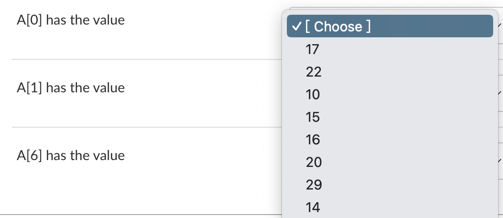

@tab A[1] has the value

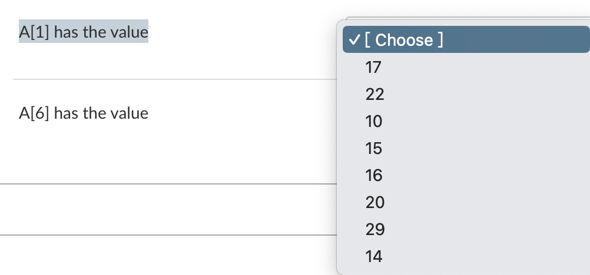

@tab A[6] has the value

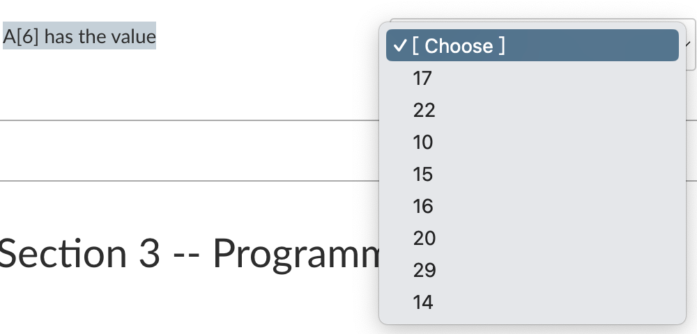

:::

## Section 3 -- Programming (15 marks)

### Question 10

::: tabs

@tab EN

A program is being written to manipulate data about books in libraries. Each book has a unique integer book number assigned to it, an author, a title, a publisher, a year of publication, a count of the total number of times it has been borrowed, and an array storing the integer library card numbers of the (up to) ten people who borrowed it most recently. The book title, author, and publisher strings may contain up to forty characters.

The library itself might contain as many as 100,000 books.

Give suitable `#define`, `typedef`, and then variable declarations to represent the books being held by the library.

*Be sure to select "Preformatted" for the LMS text box before you enter each answer, and (if necessary) again after you have typed your answer. You will need to use spaces for indentation, as tabs cannot be typed into the LMS text box.*

@tab ZH

正在编写一个程序来操作图书馆中关于书籍的数据。每本书都有一个分配给它的唯一整数书号，一个作者，一个标题，一个出版社，一个出版年份，一个记录了它被借阅的总次数的计数，以及一个数组，存储了最多十人最近借阅时的整数图书卡号码。书名、作者和出版社字符串可能包含最多四十个字符。

图书馆本身可能包含多达100,000本书。

给出合适的 `#define`、`typedef`，然后是变量声明，以表示图书馆所持有的书籍。

*确保在输入每个答案之前选择“预格式化”（Preformatted）选项，如果需要，在输入答案之后再次选择。你需要使用空格来缩进，因为LMS文本框中无法输入制表符（tabs）。*

根据这个任务，你可能需要像这样声明宏、类型定义和变量：

```c
#define MAX_BOOKS 100000
#define MAX_BORROWS 10
#define MAX_CHARACTERS 40

typedef struct {
    int book_number;
    char author[MAX_CHARACTERS];
    char title[MAX_CHARACTERS];
    char publisher[MAX_CHARACTERS];
    int year_of_publication;
    int borrow_count;
    int borrowers[MAX_BORROWS];
} Book;

typedef struct {
    Book books[MAX_BOOKS];
} Library;
```

请注意，在C语言中，`#define`用于定义常量，`typedef`用于定义类型别名，结构体（`struct`）用于定义复合数据类型。这里，`Book`结构体定义了一本书的相关信息，而`Library`结构体包含了一个能够存放最多100,000本书的数组。

:::

### Question 11

::: tabs

@tab EN

Suppose that an integer array is being used to store sequences of values that are strictly positive, for example:

```c
    {1,1,1,2,2,2,2,2,5,4,4,1,1,1,1,1,1,3,3,3,0}
```

The last value in the array is always zero, and provides a sentinel, meaning that a buddy variable is not required.

A student notices that there are often repeated values straight after each other, and suggests that the data could be restructured into a *packed* form, with negative numbers introduced to indicate repetitions of the previous (positive) value. For example, the same data would be represented in this packed form as:

```c
    {1,-2,2,-4,5,4,-1,1,-5,3,-2,0}
```

In this packed representation each negative value –*n* means that the immediately preceding value from the array should be duplicated another *n* times. For example, the first three values of the original array, `{1,1,1}`, are represented by the first two values of the packed array, `{1,-2}`.

Write a function

```c
    void pack(int A[])
```

that carries out that transformation, replacing the sequence of positive values in `A[]` by the corresponding packed form.

Because the packing process can never make the total number of elements larger, `A[]` is guaranteed to already be large enough to contain the packed sequence. That means that you do not need to and should not declare any further arrays within your function. Don't forget to place a sentinel value at the end of the packed array.

*Be sure to select "Preformatted" for the LMS text box before you enter each answer, and (if necessary) again after you have typed your answer. You will need to use spaces for indentation, as tabs cannot be typed into the LMS text box.*

---

The next three questions relate to the following declarations. Study them carefully and the other information provided here, and then move on to the questions.

A set of simplified declarations is being used to represent binary search trees in which each stored element is of type `data_t`:

```c
    typedef struct tree tree_t;
  
    struct tree {
        data_t  data;      // the data stored at this node
        tree_t *left;      // left subtree of node
        tree_t *rght;      // right subtree of node
    };
```

Two objects of type `data_t` can be compared in the usual manner by calling the function:

```c
   int cmp_data(data_t *d1, data_t *d2)
```

A `tree_t` can store duplicate elements by simply inserting the second instance of any value as if it was very slightly greater than the first instance of that value. For example, the tree constructed by inserting the strings

```c
    "fat", "cat", "fat", "bat", "eat", "rat", "fat", "cat"
```

would be:

```c
                   fat
                /       \
           cat             fat
          /   \               \
       bat     eat             rat
              /                /
           cat              fat
```

The "handle" to access a tree is of type `tree_t *`, and an empty tree is represented by the value `NULL`.

*You only need to submit the required function, but may include other functions too if you decide to break the process into smaller parts. Do not submit a main program.*

@tab ZH

假设我们使用整数数组来存储严格为正的值序列，例如：

```c
    {1,1,1,2,2,2,2,2,5,4,4,1,1,1,1,1,1,3,3,3,0}
```

数组中的最后一个值始终为零，它作为一个哨兵，意味着我们不需要一个附属的变量。

一个学生注意到，通常有重复的值紧接在彼此后面，并建议可以将数据重新结构化为一个*压缩*形式，引入负数来表示前面的（正）值的重复。例如，上述数据在这种压缩形式中可以表示为：

```c
    {1,-2,2,-4,5,4,-1,1,-5,3,-2,0}
```

在这种压缩表示中，每个负值- *n* 表示应再重复数组中紧前面的值 *n* 次。例如，原始数组的前三个值 `{1,1,1}` 由压缩数组的前两个值 `{1,-2}` 表示。

编写一个函数

```c
    void pack(int A[])
```

执行这种转换，将 `A[]` 中的正值序列替换为相应的压缩形式。

因为打包过程不会使元素的总数变得更大，所以 `A[]` 保证已经足够大以包含打包的序列。这意味着你不需要也不应该在你的函数内声明任何其他数组。不要忘记在打包数组的末尾放置一个哨兵值。

*确保在输入每个答案之前和（如果必要）输入答案之后选择"LMS文本框"的"预格式化"选项。你需要使用空格进行缩进，因为无法在LMS文本框中键入制表符。*

---

接下来的三个问题与以下声明有关。仔细研究它们以及这里提供的其他信息，然后继续回答问题。

我们使用一组简化的声明来表示存储元素类型为 `data_t` 的二叉搜索树：

```c
    typedef struct tree tree_t;
  
    struct tree {
        data_t  data;      // 该节点存储的数据
        tree_t *left;      // 节点的左子树
        tree_t *rght;      // 节点的右子树
    };
```

可以通过调用以下函数以通常的方式比较两个 `data_t` 类型的对象：

```c
   int cmp_data(data_t *d1, data_t *d2)
```

`tree_t` 可以通过将任何值的第二个实例插入为其第一个实例稍微大的值来存储重复的元素。例如，插入字符串

```c
    "fat", "cat", "fat", "bat", "eat", "rat", "fat", "cat"
```

构造的树将是：

```c
                   fat
                /       \
           cat             fat
          /   \               \
       bat     eat             rat
              /                /
           cat              fat
```

访问树的“句柄”是 `tree_t *` 类型的，空树用 `NULL` 值表示。

*你只需要提交所需的函数，但如果你决定将过程拆分为更小的部分，也可以包括其他函数。不要提交一个主程序。*

:::

### Question 12

::: tabs

@tab EN

In the context of the declarations that have been provided, write a function

```c
   int sum_tree(tree_t *t);
```

that applies another function

```c
    int get_int(data_t *d)
```

to each data item stored in the tree, and calculates and returns the sum of the integer values generated by the calls to `get_int()`, added up over all of the `data_t` elements stored in the tree. If `t` is empty then `sum_tree(t)` should return zero. You do not need to write `get_int()`, and may call it without knowing anything about its operation.

Include a comment prior to each main block of code to indicate your intentions.

*Be sure to select "Preformatted" for the LMS text box before you enter each answer, and (if necessary) again after you have typed your answer. You will need to use spaces for indentation, as tabs cannot be typed into the LMS text box.*

@tab ZH

在所给声明的上下文中，编写一个函数

```c
   int sum_tree(tree_t *t);
```

该函数将另一个函数

```c
    int get_int(data_t *d)
```

应用于树中存储的每个数据项，并计算并返回通过对`get_int()`的调用生成的整数值的总和，这些值是存储在树中的所有`data_t`元素的总和。如果`t`为空，则`sum_tree(t)`应返回零。您不需要编写`get_int()`，并且可以在不知道其操作的情况下调用它。

在每个主要代码块之前包含一个注释以指示您的意图。

确保在输入每个答案之前选择LMS文本框的"Preformatted"，并在键入答案后（如果需要的话）再次选择。您需要使用空格进行缩进，因为无法在LMS文本框中键入制表符。

```c
typedef struct tree {
    data_t *data;
    struct tree *left;
    struct tree *right;
} tree_t;

// 对树中的每个数据项应用get_int函数，并返回所有结果的总和
int sum_tree(tree_t *t) {
    // 如果树为空，返回0
    if (t == NULL) {
        return 0;
    }

    // 获取当前节点的数据值
    int current_value = get_int(t->data);

    // 递归地对左子树和右子树应用sum_tree函数并加总结果
    int left_sum = sum_tree(t->left);
    int right_sum = sum_tree(t->right);

    // 返回当前节点的数据值与子树结果的总和
    return current_value + left_sum + right_sum;
}
```

这个实现是基于递归的，它首先检查树是否为空，然后在当前节点上调用`get_int()`，并递归地对左右子树调用`sum_tree()`，最后返回这三个值的总和。

:::

### Question 13

::: tabs

@tab EN

In the context of the declarations that have been provided, write a function

```c
    tree_t *bst_insert(tree_t *t, data_t *d);
```

that creates a new tree node that stores the data value indicated by `*d`, and inserts it into the correct place in `t`, returning the new address of the root of the tree.

For example, a typical calling sequence for this function might be:

```c
    tree_t *t=NULL;
    data_t d;
    while (get_value(&d)) {
        // now insert d into t
        t = bst_insert(t, &d); 
    }
    // t now contains all of the data
```

Include a comment prior to each main block of code to indicate your intentions.

Before starting to answer this question, you should read the next question too. You may find it convenient to develop a single helper function that can assist with both `bst_insert()` and the `bst_merge()` function required by the next question.

*Be sure to select "Preformatted" for the LMS text box before you enter each answer, and (if necessary) again after you have typed your answer. You will need to use spaces for indentation, as tabs cannot be typed into the LMS text box.*

@tab ZH

在已给定的声明的上下文中，编写一个函数：

```c
    tree_t *bst_insert(tree_t *t, data_t *d);
```

该函数创建一个新的树节点来存储由`*d`指示的数据值，并将其插入到`t`的正确位置，返回树根的新地址。

例如，这个函数的一个典型的调用序列可能是：

```c
    tree_t *t=NULL;
    data_t d;
    while (get_value(&d)) {
        // 现在将d插入到t中
        t = bst_insert(t, &d); 
    }
    // t现在包含所有的数据
```

在每个主要代码块之前包含一个注释以指示您的意图。

在开始回答这个问题之前，您应该也读一下下一个问题。您可能会发现开发一个可以帮助`bst_insert()`和下一个问题所需的`bst_merge()`函数的单一辅助函数是方便的。

确保在输入每个答案之前选择LMS文本框的"Preformatted"，并在键入答案后（如果需要的话）再次选择。您需要使用空格进行缩进，因为无法在LMS文本框中键入制表符。


```c
typedef struct tree {
    data_t *data;
    struct tree *left;
    struct tree *right;
} tree_t;

// 在BST中插入新节点
tree_t *bst_insert(tree_t *t, data_t *d) {
    // 如果树为空，创建新节点并返回
    if (t == NULL) {
        tree_t *new_node = malloc(sizeof(tree_t));
        new_node->data = d;
        new_node->left = NULL;
        new_node->right = NULL;
        return new_node;
    }

    // 比较数据值并决定是插入到左子树还是右子树
    if (compare_data(d, t->data) < 0) {
        // 插入到左子树
        t->left = bst_insert(t->left, d);
    } else if (compare_data(d, t->data) > 0) {
        // 插入到右子树
        t->right = bst_insert(t->right, d);
    }
    // 如果数据值相同，则不做任何事情

    return t;
}
```

注意：在上述代码中，我使用了一个假设的`compare_data()`函数来比较两个`data_t`类型的数据。根据实际情况，你可能需要提供这个函数或者直接使用适当的比较操作符。

:::

### Question 14

::: tabs

@tab EN

In the context of the declarations that have been provided, write a function

```c
    tree_t *bst_merge(tree_t *t1, tree_t *t2);
```

that constructs and returns a single tree containing the union (the merge) of the elements in `t1` and `t2`, by combining them and at the same time destroying the original trees.

For example, a typical calling sequence for this function might be:

```c
    tree_t *t1=NULL, *t2=NULL;
    ...        // construct tree t1
    ...        // construct tree t2
    t1 = bst_merge(t1, t2);
    t2 = NULL; // this tree not required now
```

Include a comment prior to each main block of code to indicate your intentions.

*Be sure to select "Preformatted" for the LMS text box before you enter each answer, and (if necessary) again after you have typed your answer. You will need to use spaces for indentation, as tabs cannot be typed into the LMS text box.*

@tab ZH

在所给声明的上下文中，编写一个函数：

```c
    tree_t *bst_merge(tree_t *t1, tree_t *t2);
```

该函数构建并返回一个单独的树，该树包含`t1`和`t2`中元素的并集（合并），通过组合它们并同时销毁原始树。

例如，这个函数的一个典型的调用序列可能是：

```c
    tree_t *t1=NULL, *t2=NULL;
    ...        // 构建树t1
    ...        // 构建树t2
    t1 = bst_merge(t1, t2);
    t2 = NULL; // 现在不需要这棵树了
```

在每个主要代码块之前包含一个注释以指示您的意图。

确保在输入每个答案之前选择LMS文本框的"Preformatted"，并在键入答案后（如果需要的话）再次选择。您需要使用空格进行缩进，因为无法在LMS文本框中键入制表符。

:::

## Section 4 -- Algorithms (8 marks)

The next four questions relate to the following problem description. Read it carefully, and then move on to the questions.

A group of students are discussing how to compute the *k* th smallest value in an input array containing *n* values, where 0 ≤ *k* < *n*/2.

For example if the input array is:

```c
    A[] = { -9, 17, 18, 12, 35, 24, 17 }
```

then when *k*=2, the value required is 17, because if `A[]` was sorted, then `A[2]` would be `17`.

The input data is provided in an unsorted array, and represents a *multi-set* of items, meaning that duplicate values might exist. The process that determines the *k* th largest value is *not permitted* to reorder the elements in the input array, and they must remain in their original locations.

The next several questions involve a range of different algorithms that might be used to solve this problem, given these constraints.

All of the analyses that are given are *precise*. If a student says they can solve the problem in O(*n* log *k*), the algorithm that they are thinking of will require a number of steps that is directly proportional to *n* log *k* on at least some input arrays; and an algorithm that takes (say) O(*n*) time in the worst case will not be regarded as being a correct answer.

Note that the space required by an algorithm is the *extra* space required, and does not count the space occupied by the input array. The analyses of extra space are also all *precise*.

### Question 15

Student A says, "this problem is easy to solve, and a solution can always be achieved in O(*n* + *k**n*) worst-case time, with O(1) extra space required".

Use the answer box below to describe in English or pseudocode the approach that Student A is thinking of.

*You must give enough detail in your answer that the marker can be sure that the approach you are describing (a) will solve the problem, and (b) is consistent with the stated analysis.*


### Question 16

Student B says, "this problem is easy to solve, and a solution can always be achieved in O(*n* + *k* log *n*) worst-case time, with O(*n*) extra space required."

Use the answer box below to describe in English or pseudocode the approach that Student B is thinking of.

*You must give enough detail in your answer that the marker can be sure that the approach you are describing (a) will solve the problem, and (b) is consistent with the stated analysis.*


### Question 17

Student C says, "this problem is easy to solve, and a solution can always be achieved in O(*k* + (*n* − *k*) log *k*) time in the worst case, with O(*k*) extra space required".

Use the answer box below to describe in English or pseudocode the approach that Student C is thinking of.

*You must give enough detail in your answer that the marker can be sure that the approach you are describing (a) will solve the problem, and (b) is consistent with the stated analysis.*


### Question 18

Students B and C then start arguing about whose algorithm will execute the fastest, and you need to stop them fighting. What should you tell them? And why?

*You must give enough detail in your answer that the marker can be sure that you understand the interaction between the two formulas that have been provided. Note that you can answer this question even if you do not know what algorithms Students B and C are talking about.*


### Question 19

::: center

### Working Space -- Will Not Be Marked

:::

You may use this answer box for any working-out that you wish to do.

The contents of this box **will NOT be marked**.


::: details 公众号：AI悦创【二维码】


:::

::: info AI悦创·编程一对一

AI悦创·推出辅导班啦，包括「Python 语言辅导班、C++ 辅导班、java 辅导班、算法/数据结构辅导班、少儿编程、pygame 游戏开发、Web、Linux」，全部都是一对一教学：一对一辅导 + 一对一答疑 + 布置作业 + 项目实践等。当然，还有线下线上摄影课程、Photoshop、Premiere 一对一教学、QQ、微信在线，随时响应！微信：Jiabcdefh

C++ 信息奥赛题解，长期更新！长期招收一对一中小学信息奥赛集训，莆田、厦门地区有机会线下上门，其他地区线上。微信：Jiabcdefh

方法一：[QQ](http://wpa.qq.com/msgrd?v=3&uin=1432803776&site=qq&menu=yes)

方法二：微信：Jiabcdefh

:::


