## 1. Preamble

Things to look out for in solving the questions are:

- Make sure to name functions and arguments as stipulated in the question, but never be afraid to create extra functions of your own, e.g. to break up the code into conceptual sub-parts, or avoid redundancy in your code
- Commenting of code is one thing that you will be marked on; get some practice writing comments in your code, focusing on:
    - Describing key variables when they are first defined (but not things like index variables in `for` loops)
    - Describing what "chunks" of code do (i.e. not every line, but chunks of code that perform a particular operation, such as `#find the maximum value in the list` or `#count the number of vowels`.
    - Describing what every function does, including what its arguments are, and what it returns.

**Note**: If you make multiple submissions, only the most recent submission will be marked.

## 2. Academic Honesty 1

Academic Honesty

- The project is done **individually** (not in groups)
- All assessment items (worksheets, projects, test and exam) must be **your own, individual, original work**.
- Any code that is submitted for assessment will be automatically compared against other students' code and other code sources using sophisticated similarity checking software.
- Cases of potential copying or submitting code that is not your own may lead to a formal **academic misconduct hearing**.
- Potential penalties can include getting **zero for the project, failing the subject**, or even **expulsion from the university** in extreme cases.
- For further information, please see the university's [Academic Honesty and Plagiarism](https://academicintegrity.unimelb.edu.au/) website, or ask your lecturer.
- The use of ChatGPT or other AI software to answer questions on this assignment is strictly prohibited.

## 3. Academic Honesty 2

The fastest way to fail the subject is to hand in code that is not your own!!!

For example:

- you must not copy the code of other students.
- you must not make your code available to others to see.
- you must not give other students your login id and password.
- you must not share USB memory drives.
- you must not post your code on public forums, or any other activity, that would make your code available to others.
- you must not ask other students to see their code.
- **you must not submit code that has been written by someone else.**

if other students ask to see your code, please say "no", as copying (collusion or plagiarism) is considered academic misconduct, and all students involved may face penalties (both the student who copied, and the student who made their code available).

Before you start the project, you must watch the videos and complete the quiz under “CIS Academic Honesty Training” on the LMS Modules page

## 4. Background

### 4.1 Scenario

Matching games are a popular class of games, with titles like Bejeweled and Candy Crush receiving great success over recent years. In this assignment we will create our own basic matching game.

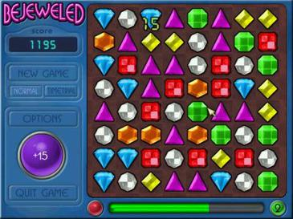

An example of the Bejeweled matching game (Wikipedia).

### 4.2 Representation

Our game consists of a number of coloured pieces on a two-dimensional board. Each piece can be represented as a string containing a single upper-case character between 'A' and 'Y'. The character 'Z' is used to indicate a blank position on the board. The board can be represented in Python by a list of lists. For example, the board below could be represented as

```python
board = [['B', 'G', 'B', 'Y'], 
['G', 'B', 'Y', 'Y'], 
['G', 'G', 'Y', 'Z'],
['B', 'Z', 'Z', 'Z']]
```

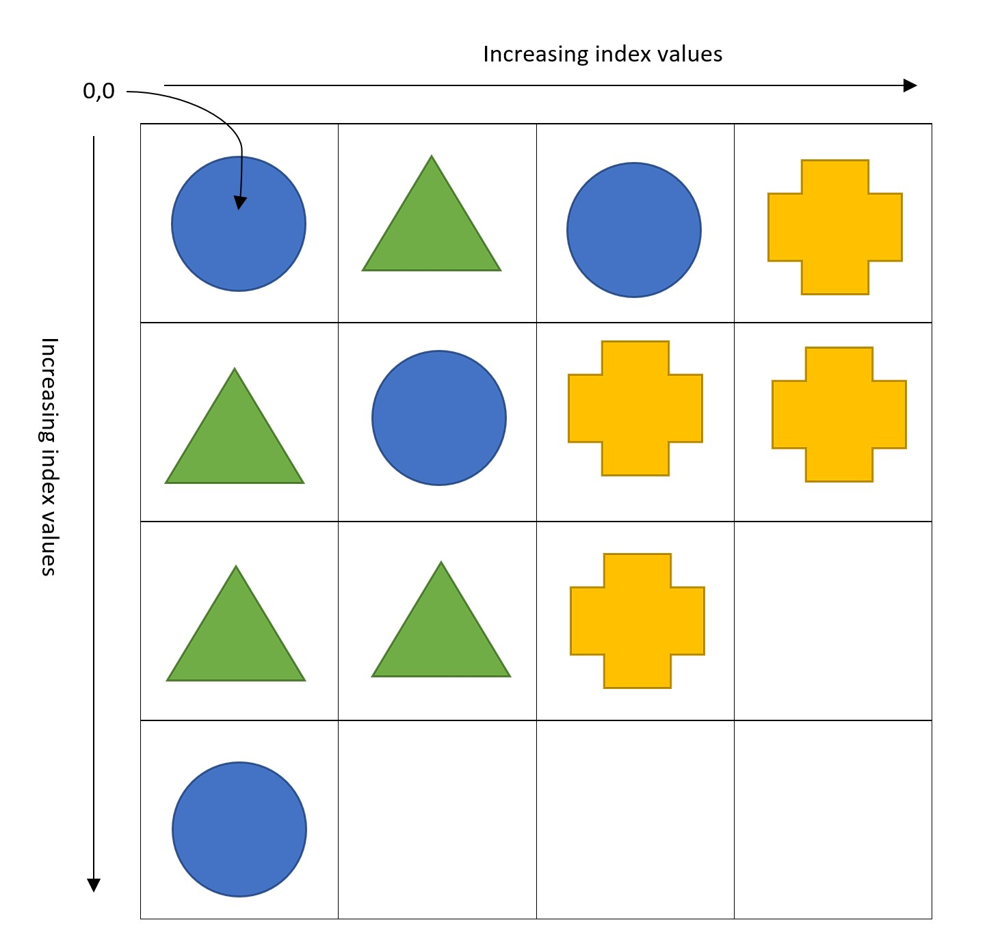

Note that `board[0][0]` therefore corresponds to the position in the top-left corner of the board. A 4 x 4 board is shown, but our game will allow for boards of sizes up to 99 x 99.

A move is made by selecting a piece and specifying a direction in which it should be moved (up, down, left or right).

The piece can be selected by specifying its position on the board. To do so, we use a tuple `(row, column)` where `row` and `column` are the index values of the row and column on the board that contain the piece.

To specify the direction we use a single lower case character as follows:

- `'u'`: Up
- `'d'`: Down
- `'l'`: Left
- `'r'`: Right

### 4.3 Eliminating pieces

Four pieces of the same colour may be eliminated from the board by moving them into a 2 x 2 square. For example, in the scenario above the green triangle at (0, 1) could be moved downwards to (1, 1). This move would eliminate all four green triangles from the board.

## 5. Pretty Print

::: center

## Task 1: Pretty Print (3 marks)

:::

Write a function `pretty_print(board)` that will print the board in a manner that is easy to read. You may assume that the board is a correctly formatted list of lists as described on the previous slide. Specifically, you should display:

1. On your first line, three spaces, followed by the index values of each column in `board`, with 0 being the first value. Each index value should take up three spaces and be left aligned.
2. On your second line, a row of `'-'` characters, starting below the first index value printed and ending below the last.
3. Each subsequent line should begin with the index value of a row in `board`, with index value 0 being the first displayed. The index value should take up two spaces and be right aligned. The index value should be followed by a `'|'` character.
4. After the `'|'` character, each board value in the corresponding row should be printed, with two spaces between each value.
5. After the board has been printed, two blank lines should be added.

An example for a 12 x 12 board is displayed below:

```python
   0  1  2  3  4  5  6  7  8  9  10 11 
   ------------------------------------
 0|A  A  A  A  A  A  A  A  A  A  A  A  
 1|A  A  A  A  A  A  A  A  A  A  A  A  
 2|A  A  A  A  A  A  A  A  A  A  A  A  
 3|A  A  A  A  A  A  A  A  A  A  A  A  
 4|A  A  A  A  A  A  A  A  A  A  A  A  
 5|A  A  A  A  A  A  A  A  A  A  A  A  
 6|A  A  A  A  A  A  A  A  A  A  A  A  
 7|A  A  A  A  A  A  A  A  A  A  A  A  
 8|A  A  A  A  A  A  A  A  A  A  A  A  
 9|A  A  A  A  A  A  A  A  A  A  A  A  
10|A  A  A  A  A  A  A  A  A  A  A  A  
11|A  A  A  A  A  A  A  A  A  A  A  A  
```

### 5.1 Example Calls

```python
>>> pretty_print([['A']*4]*4)
   0  1  2  3  
   ------------
 0|A  A  A  A  
 1|A  A  A  A  
 2|A  A  A  A  
 3|A  A  A  A  


>>> pretty_print([['B']*3]*5)
   0  1  2  
   ---------
 0|B  B  B  
 1|B  B  B  
 2|B  B  B  
 3|B  B  B  
 4|B  B  B  


>>> pretty_print([['C']*5]*2)
   0  1  2  3  4  
   ---------------
 0|C  C  C  C  C  
 1|C  C  C  C  C  
```

### 5.2 Answer

::: code-tabs

@tab 学生代码

```python
def pretty_print(board):
    
    # Print the first row: column index
    # First print three Spaces at the beginning of the line
    print(' ' * 3, end='')
    
    # Loop through column index and format output
    for col in range(len(board[0])):
        print(f'{col:<3}', end='')
    # Ends the line and line feed   
    print()    
   
    # Print the second line: horizontal line
    # Print three Spaces at the beginning of the line
    print(' '* 3, end='')
    
    # Print horizontal lines according to the numbers of columns
    print('-' * (len(board[0]) * 3))
    
        
    # Print the board content
    # Loop through each row
    for row in range(len(board)):
        # Print the row index and add a vertical bar after the index
        print(f'{row:>2}|', end='')
        # Loops through each element of the row
        for col in range(len(board[row])):
            # Prints the current element, adds two spaces between the elements
            print(f'{board[row][col]}  ', end='')
        # Ends the line and line feed
        print()
        
    # Print two blank lines   
    print()
```

@tab Sample solution1

```python
COL_WIDTH = 3

def pretty_print(board):
    '''This function takes one argument `board` (a list of lists of chars), 
       and print the board in a pretty format'''

    # print the first line (the header line)
    print('   ', end='')
    for i in range(len(board[0])):
        print(f'{i:<{COL_WIDTH}}', end='')
    print()

    # print the second line, which consists of "-"
    print('   ' + '-' * (len(board[0]) * COL_WIDTH))

    # print the rest of lines
    for i in range(len(board)):
        # print the index
        print(f'{i:>{COL_WIDTH - 1}}', end='|')
        # print each piece in its corresponding position
        for j in board[i]:
            print(j, end='  ')
        print()
    print()
```

@tab Sample solution2

```python
COL_WIDTH = 3

def pretty_print(board):
    """ Takes `board` (list of lists of piece characters) and formats and
    prints it in a readable format """
    
    n_cols = len(board[0])
    
    print_header(n_cols)
    print_lines(board)
    
    # final blank line
    print()
    
def print_header(n_cols):
    """ Takes `n_cols` (int, number of columns) and prints the header lines """
    
    # print column numbers
    line = " " * COL_WIDTH
    for i in range(n_cols):
        line += f"{i:<{COL_WIDTH}d}"
    print(line)
    
    # print dividing line
    print(" " * COL_WIDTH + "-" * COL_WIDTH * n_cols)
    
def print_lines(board):
    """ Takes board (list of lists of piece characters) and prints the 
    formatted pieces of the board """
    
    for i, row in enumerate(board):
        # begins with index of the row then follows with the entries
        formatted_row_index = f"{str(i) + '|':>{COL_WIDTH}s}"
        entries = "".join(f"{letter:<{COL_WIDTH}s}" for letter in row)
        print(formatted_row_index + entries)
```

:::

### 5.3 Assessment

::: center

## Overall result for Question 1

:::

Combines function-specific marks, and subdivided overall style marks.

::: center

#### Approach

:::

Based on appropriateness of problem-solving approach

| No real attempt made                     | 0.0  |
| ---------------------------------------- | ---- |
| Very simple approach, an attempt         | 0.2  |
| Overly simplistic approach               | 0.3  |
| Overly complicated approach              | 0.3  |
| Great approach. Not quite perfect though | 0.4  |
| **Excellent approach- well done!**       | 0.5  |

> https://www.youtube.com/watch?v=IS-5UywyLPI
>
> Good job here!

::: center

## Adherence to style guide (without comments)

:::

Based on testing against [PEP-8](https://www.python.org/dev/peps/pep-0008/) linter.

| No adherence to PEP8 output and variable names require work  | 0.0     |
| ------------------------------------------------------------ | ------- |
| Partial adherence to PEP8 output OR variable names require work | 0.1     |
| **Strong adherence to PEP8 output and good contextual variable names** | **0.2** |

::: center

## Commenting

:::

See [PEP-8 comment guidelines](https://www.python.org/dev/peps/pep-0008/#id30).

| No comments, randomly sprinkled and unhelpful, or too verbose | 0.0  |
| ------------------------------------------------------------ | ---- |
| Some basic comments, an attempt                              | 0.1  |
| **Somewhat helpful, but sometimes sparse/overly verbose OR docstring is missing** | 0.2  |
| Helpful, insightful and succinct                             | 0.3  |

> Great commenting, but there is slightly too much detail involved, try cutting it down a bit for your next project.
>
> (Refer to the sample solution for the appropriate level of detail for commenting)
>
> Also you're missing a docstring!

::: center

## Automated Test Score: 2 / 2

:::

**NOTE: Per-test scores are shown to a maximum of 2 decimal places. The total score may differ due to rounding.**

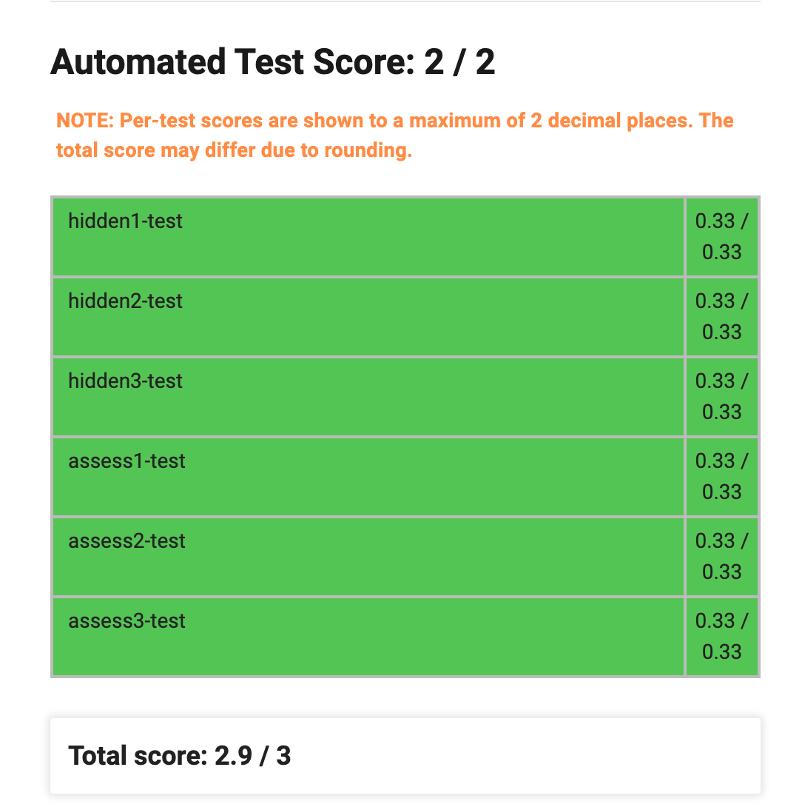


::: details 截图

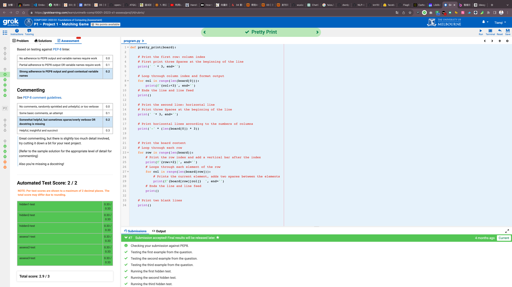

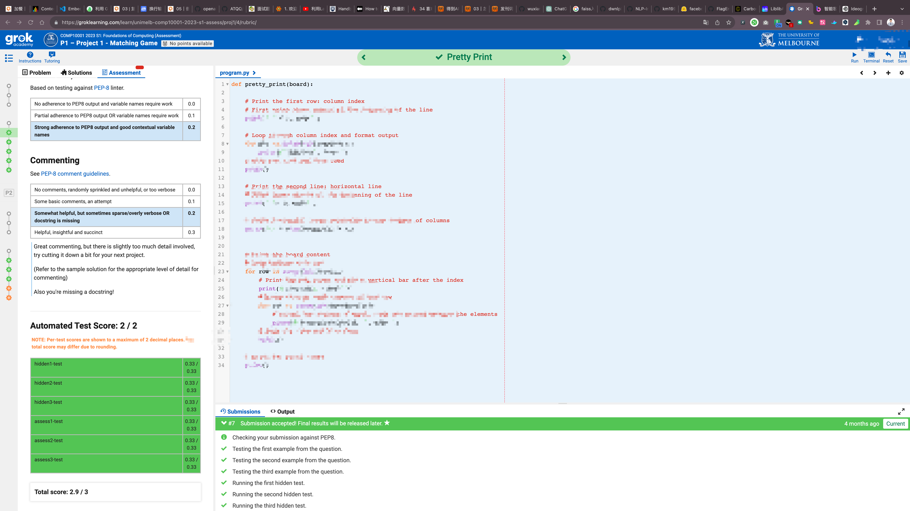

:::

## 6. Validate Input

::: center

## Task 2: Validate Input (3 marks)

:::

As our game will rely on user-supplied inputs, we wish to ensure those inputs are valid. Write a function `validate_input(board, position, direction)`. Your function should ensure:

1. The board contains at least two rows and at least two columns
2. Each row in the board has the same length
3. Each board value is an upper case character
4. The position specified is within the board and does not contain negative row or column values
5. The direction argument contains one of the four permitted direction values
6. For each piece colour present on the board, the number of pieces of that colour is a multiple of four. Blanks (represented by 'Z') are not included in this requirement.

Your function should return `True` if all of the above conditions are satisfied and `False` otherwise.

Note: You may assume that the `board` argument contains a list of lists and that each position on the board contains a string. You may also assume the `position` argument is a tuple containing precisely two integer values.

### 6.1 Example Calls

```python
>>> print(validate_input([["A", "A", "A", "A"], ["A", "A", "A", "A"]], (0, 0), "u"))
True
>>> print(validate_input([["A", "Z", "Z", "A"], ["A", "A"]], (0, 0), "u"))
False
>>> print(validate_input([["A", "A", "A", "A"], ["A", "A", "A", "A"]], (10, 0), "x"))
False
>>> print(validate_input([["A", "A", "A", "A"], ["A", "A", "B", "B"]], (0, 0), "u"))
False
```

### 6.2 Answer

::: code-tabs

@tab 学生代码

```python
DIR_UP = "u"
DIR_DOWN = "d"
DIR_LEFT = "l"
DIR_RIGHT = "r"
BLANK_PIECE = "Z"

def validate_input(board, position, direction):
    # check that the number of rows and columns on the board is at least 2
    if len(board) < 2 or len(board[0]) < 2:
        return False
    
    # check that each row of the board is the same length
    for i in range(len(board)):
        if len(board[i]) != len(board[0]):
            return False
    
    # check that each value on the board is a capital letter
    for row in range(len(board)):
        for col in range(len(board[row])):
            if not board[row][col].isupper():
                return False
    
    # check that position is within the board and has no negative values
    x, y = position        
    if x < 0 or y < 0 or x >= len(board) or y >= len(board[0]):
        return False
    
    # check if direction is one of the allowed values
    if direction not in (DIR_UP, DIR_DOWN, DIR_LEFT, DIR_RIGHT):
        return False
   

    # check if the number of pieces in each color is a multiple of 4
    d = {}
    for piece in board:
        for value in piece:
            if value != 'Z':
                if value in d:
                    d[value] += 1
                else:
                    d[value] = 1      
    for piece in d.values():
        if piece % 4 != 0:
            return False
        
    # Returns True if all conditions are met    
    return True
```

@tab Sample solution

```python
DIR_UP = "u"
DIR_DOWN = "d"
DIR_LEFT = "l"
DIR_RIGHT = "r"
BLANK_PIECE = "Z"

MIN_DIMENSION = 2
PIECE_MULTIPLE = 4
ROW, COL = 0, 1
DIRS = (DIR_UP, DIR_DOWN, DIR_LEFT, DIR_RIGHT)

def validate_input(board, position, direction):
    ''' Takes `board` (list of lists of piece characters), `position` 
    (2-tuple of ints), and `direction` (string). 
    Returns a bool indicating whether the input is valid '''
    return (valid_board_dimension(board) and position_in_board(board, position)
            and valid_direction(direction) and valid_board_value(board))

def valid_board_dimension(board):
    ''' Takes the `board` and returns a bool indicating if the board 
    dimension is valid:
       1. board is a square
       2. board contains at least two rows and two columns '''
    
    # ensure that board has at least two rows and two columns
    if len(board) < MIN_DIMENSION:
        return False
    row_length = len(board[0])
    if row_length < MIN_DIMENSION:
        return False

    # ensure that the board is a "square"
    for row in board[1:]:
        if len(row) != row_length:
            return False
    
    return True

def valid_board_value(board):
    ''' Takes the `board` and returns a bool indicating if the board:
        1. contains upper case value only
        2. has multiple-of-four number of pieces for each colour '''
    
    colour_count = {}

    # check the validity of the board piece by piece, also record the 
    # colour of pieces
    for row in board:
        for piece in row:

            # ensure that each piece is upper case
            if not piece.isupper():
                return False
            
            # record the colour of the piece
            if piece in colour_count:
                colour_count[piece] += 1
            else:
                colour_count[piece] = 1
    
    # check whether there are multiple-of-four for each colour
    for colour, count in colour_count.items():
        if colour != BLANK_PIECE and count % PIECE_MULTIPLE != 0:
            return False

    return True

def position_in_board(board, position):
    ''' Takes `board` and `position` (2-tuple of ints) and returns a bool
    indicating if the position is on the board '''
    return (0 <= position[ROW] < len(board) 
            and 0 <= position[COL] < len(board[0]))


def valid_direction(direction):
    ''' Takes `direction` (str) and returns a bool indicating if the direction
    is one of the predefined direction values '''
    return direction in DIRS
```

:::

### 6.3 Assessment

::: center

### Overall result for Question 2

:::

Combines function-specific marks, and subdivided overall style marks.

::: center

### Approach

:::

Based on appropriateness of problem-solving approach

| No real attempt made                     | 0.0  |
| ---------------------------------------- | ---- |
| Very simple approach, an attempt         | 0.2  |
| Overly simplistic approach               | 0.3  |
| Overly complicated approach              | 0.3  |
| Great approach. Not quite perfect though | 0.4  |
| **Excellent approach- well done!**       | 0.5  |

> Brilliantly done!

::: center

### Adherence to style guide (without comments)

:::

Based on testing against [PEP-8](https://www.python.org/dev/peps/pep-0008/) linter.

| No adherence to PEP8 output and variable names require work  | 0.0  |
| ------------------------------------------------------------ | ---- |
| Partial adherence to PEP8 output OR variable names require work | 0.1  |
| **Strong adherence to PEP8 output and good contextual variable names** | 0.2  |

> Namings are generally good here but please try to use something more descriptive other than 'd'. (Line 34)

::: center

### Commenting

:::

See [PEP-8 comment guidelines](https://www.python.org/dev/peps/pep-0008/#id30).

| No comments, randomly sprinkled and unhelpful, or too verbose | 0.0     |
| ------------------------------------------------------------ | ------- |
| Some basic comments, an attempt                              | 0.1     |
| **Somewhat helpful, but sometimes sparse/overly verbose OR docstring is missing** | **0.2** |
| Helpful, insightful and succinct                             | 0.3     |

> Again, excellent commenting, but your docstring is missing! 😦

::: center

### Automated Test Score: 2 / 2

:::

**NOTE: Per-test scores are shown to a maximum of 2 decimal places. The total score may differ due to rounding.**

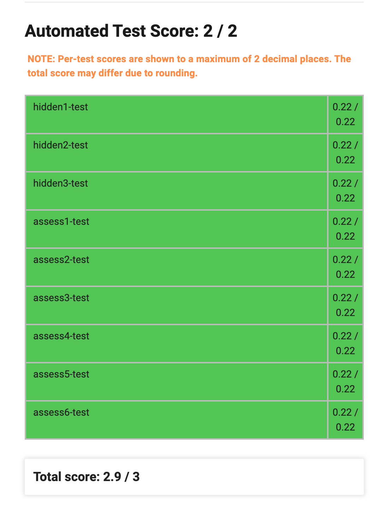

::: details


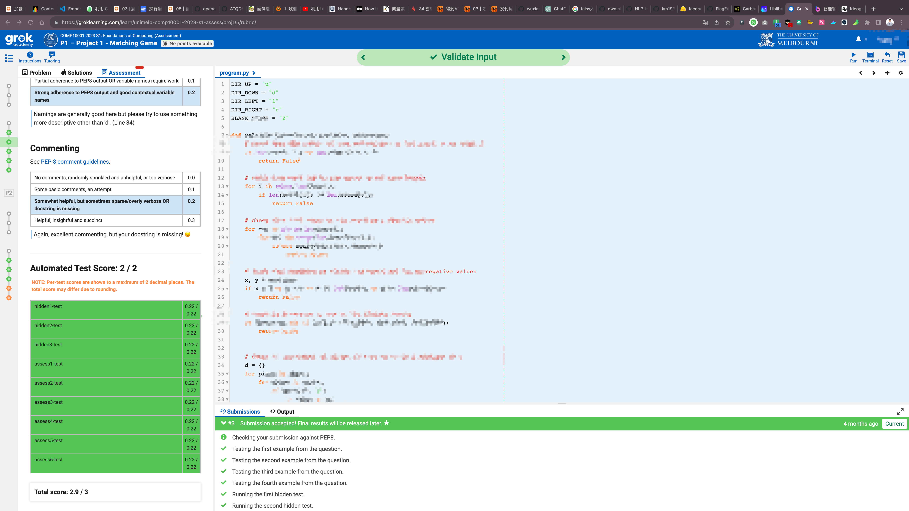

:::

## 7. Legal Moves

::: center

## Task 3: Legal Move (4 marks)

:::

Recall that a move in our game involves swapping two pieces. A move is legal if:

- Both the pieces involved in the move are inside the board
- At least one of the pieces involved in the move ends in a position adjacent to a piece of the same colour

Blank pieces (represented with a `'Z'`) may never be moved.

Write a function `legal_move(board, position, direction)` that returns `True` if it is legal for the piece at `position` to be moved in the direction specified by `direction` and `False` otherwise.

For example, given the following board:

```python
   0  1  2  3  
   ------------
 0|A  A  D  C  
 1|A  B  C  A  
 2|C  B  B  A  
 3|C  D  D  D  
```

`legal_move(board, (1, 2), DIR_UP)` would return `True` as the `C` currently located at `(1, 2)` would be moved to `(0, 2)`, which is adjacent to the `C` at `(0, 3)`. `legal_move(board, (0, 2), DIR_DOWN)` would return `True` for the same reason. `legal_move(board, (0, 2), DIR_LEFT)` would return `False`.

For this task you may assume the inputs have already been validated according to your function in Question 2.

### 7.1 Example Calls

```python
>>> print(legal_move([["A", "A", "D", "C"], ["A", "B", "C", "A"], ["C", "B", "B", "A"], ["C", "D", "D", "D"]], (1, 2), "u"))
True
>>> print(legal_move([["A", "A", "D", "C"], ["A", "B", "C", "A"], ["C", "B", "B", "A"], ["C", "D", "D", "D"]], (0, 2), "d"))
True
>>> print(legal_move([["A", "A", "D", "C"], ["A", "B", "C", "A"], ["C", "B", "B", "A"], ["C", "D", "D", "D"]], (0, 2), "l"))
False
>>> print(legal_move([["A", "A", "D", "C"], ["A", "B", "C", "A"], ["C", "B", "B", "A"], ["C", "D", "D", "D"]], (0, 0), "l"))
False
```

### 7.2 Answer

::: code-tabs

@tab 学员代码

```python
DIR_UP = "u"
DIR_DOWN = "d"
DIR_LEFT = "l"
DIR_RIGHT = "r"
BLANK_PIECE = "Z"

def legal_move(board, position, direction):
    # Gets row and column coordinates
    row, col = position
    
    # Get the piece in the current position
    piece = board[row][col]
    
    # return False if the current position is blank
    if piece == BLANK_PIECE:
        return False
    
    # Determine the coordinates of the new position 
    # based on the direction of movement
    if direction == DIR_UP:
        new_position = (row - 1, col)
    elif direction == DIR_DOWN:
        new_position = (row + 1, col)
    elif direction == DIR_LEFT:
        new_position = (row, col - 1)
    else:
        new_position = (row, col + 1)
 
    # Check if new position is blank    
    new_row, new_col = new_position
    if 0 <= new_row < len(board) and 0 <= new_col < len(board[0]):
        if board[new_row][new_col] == BLANK_PIECE:
            return False
        
    # Check if it is in the board   
    if new_row < 0 or new_row >= len(board):
        return False
    if new_col < 0 or new_col >= len(board[0]):
        return False
    
    # Create two new lists
    # old is the surrounding color coordinates before the move
    old_lst =[(row + 1, col),
              (row - 1, col),
              (row, col - 1),
              (row, col + 1)]
    
    # new is the surrounding color coordinates after the move
    new_lst =[(new_row + 1, new_col),
              (new_row - 1, new_col),
              (new_row, new_col - 1),
              (new_row, new_col + 1)]
    
    # Check if there are adjacent pieces of the same color in the old position
    for r, c in old_lst:
        if 0 <= r < len(board) and 0 <= c < len(board[0]):
            if board[r][c] == board[new_row][new_col]:
                if ((r, c) != (new_row, new_col)):
                    return True
    
    # Check if there are adjacent pieces of the same color in the new position
    for r, c in new_lst:
        if 0 <= r < len(board) and 0 <= c < len(board[0]):
            if board[r][c] == board[row][col]:
                if ((r, c) != (row, col)):
                    return True
                
    # Returns false if there are no adjacent colors of the same color
    return False
```

@tab Sample solution1

```python
DIR_UP = "u"
DIR_DOWN = "d"
DIR_LEFT = "l"
DIR_RIGHT = "r"
BLANK_PIECE = "Z"

def calc_swap_pos(row, col, direction):
    """ Takes the row index, column index of the piece and the direction of 
        the move, calculates and return the position to be swapped to """
    if direction == DIR_UP:
        swap_row = row - 1
        swap_col = col
    elif direction == DIR_DOWN:
        swap_row = row + 1
        swap_col = col
    elif direction == DIR_RIGHT:
        swap_row = row
        swap_col = col + 1
    elif direction == DIR_LEFT:
        swap_row = row
        swap_col = col - 1
    else:
        return None
    return (swap_row, swap_col)

def adjacent(piece, board, row, col):
    """ Takes piece, board, row index and column index, and return a bool
        indicating whether any of the positions around board[row][col] 
        contain piece """
    if col + 1 < len(board[row]) and board[row][col + 1] == piece: 
        return True
    if col - 1 >= 0 and board[row][col - 1] == piece:
        return True
    if row + 1 < len(board) and board[row + 1][col] == piece:
        return True
    if row - 1 >= 0 and board[row - 1][col] == piece:
        return True
    return False

def legal_move(board, position, direction):
    """ Takes `board` (list of lists of piece characters), `position` 
    (2-tuple of ints), `direction` (string). Returns a bool indicating whether 
    the move is considered legal in the context of the specified game rules """
    row, col = position
    
    # Calculate the position of the token being swapped
    swap_row, swap_col = calc_swap_pos(row, col, direction)
    
    # Check if the swap position is legal
    if not (0 <= swap_row < len(board) and 0 <= swap_col < len(board[0])): 
        return False
    
    # Check if either place is a blank 
    piece = board[row][col]
    swap_piece = board[swap_row][swap_col]
    if piece == BLANK_PIECE or swap_piece == BLANK_PIECE:
        return False
    
    # Perform the swap
    board[row][col] = swap_piece
    board[swap_row][swap_col] = piece
    
    # Check if the result is legal 
    is_legal = False
    if adjacent(piece, board, swap_row, swap_col):
        is_legal = True
    if adjacent(swap_piece, board, row, col):
        is_legal = True
    
    # Swap back
    board[row][col] = piece
    board[swap_row][swap_col] = swap_piece    
    
    return is_legal
```

@tab Sample solution2

```python
DIR_UP = "u"
DIR_DOWN = "d"
DIR_LEFT = "l"
DIR_RIGHT = "r"
BLANK_PIECE = "Z"

def legal_move(board, position, direction):
    ''' Takes `board` (list of lists of piece characters), `position` 
    (2-tuple of ints), `direction` (string). Returns a bool indicating whether 
    the move is considered legal in the context of the specified game rules '''

    next_position = get_next_position(board, position, direction)
    # make sure that the next position exists
    if not next_position:
        return False
    
    colour = board[position[0]][position[1]]
    next_colour = board[next_position[0]][next_position[1]]
    # blank space can't move
    if BLANK_PIECE in (colour, next_colour):
        return False
    
    # make sure that one of the adjacent piece has the same colour
    adj_swap_positions = adjacent_positions(board, next_position)
    adj_swap_positions.remove(position)
    adj_ori_positions = adjacent_positions(board, position)
    adj_ori_positions.remove(next_position)
    if has_colour(board, adj_swap_positions, colour) or\
       has_colour(board, adj_ori_positions, next_colour):
        return True
    
    return False

def has_colour(board, positions, colour):
    '''Return True if the given list of positions contain the colour given'''
    for x, y in positions:
        if board[x][y] == colour:
            return True
    return False

def adjacent_positions(board, position):
    '''For the board given, return the valid adjacent positions for the given
       position in a list'''
    cur_x, cur_y = position
    adj_positions = [(cur_x + 1, cur_y), (cur_x - 1, cur_y), 
                     (cur_x, cur_y + 1), (cur_x, cur_y - 1)]
    
    # remove the positions that are out of bound
    for adj_pos in adj_positions:
        if not position_in_board(board, adj_pos):
            adj_positions.remove(adj_pos)
            
    return adj_positions

def position_in_board(board, position):
    '''Given the board and position, return True if the position 
       is in the board'''
    return 0 <= position[0] < len(board) and 0 <= position[1] < len(board[0])

def get_next_position(board, position, direction):
    '''Takes the board, position of the piece and the direction, 
       return the destination position that the piece moves to'''

    next_position = None
    cur_x, cur_y = position

    if direction == DIR_UP:
        next_position = cur_x - 1, cur_y
    elif direction == DIR_DOWN:
        next_position = cur_x + 1, cur_y
    elif direction == DIR_LEFT:
        next_position = cur_x, cur_y - 1
    elif direction == DIR_RIGHT:
        next_position = cur_x, cur_y + 1
    else:
        return None
    
    if not position_in_board(board, next_position):
        return None
    return next_position
```

:::

### 7.3 Assessment

::: center

# Overall result for Question 3

:::

Combines function-specific marks, and subdivided overall style marks.

::: center

### Approach

:::

Based on appropriateness of problem-solving approach

| No real attempt made                     | 0.0     |
| ---------------------------------------- | ------- |
| Very simple approach, an attempt         | 0.2     |
| Overly simplistic approach               | 0.3     |
| Overly complicated approach              | 0.3     |
| Great approach. Not quite perfect though | 0.4     |
| **Excellent approach- well done!**       | **0.5** |

> Superb!
>
> Small Note: Your code between lines 55-66 is technically duplicated. (It's the same logic being applied to both the new, old coordinates.)
>
> I would recommend use of a helper function to reduce duplication next time.

::: center

### Adherence to style guide (without comments)

:::

Based on testing against [PEP-8](https://www.python.org/dev/peps/pep-0008/) linter.

| No adherence to PEP8 output and variable names require work  | 0.0  |
| ------------------------------------------------------------ | ---- |
| Partial adherence to PEP8 output OR variable names require work | 0.1  |
| **Strong adherence to PEP8 output and good contextual variable names** | 0.2  |

> Namings are decent here, but some of them aren't descriptive enough. E.g. old_lst, new_lst, r, c.

::: center

### Commenting

:::

See [PEP-8 comment guidelines](https://www.python.org/dev/peps/pep-0008/#id30).

| No comments, randomly sprinkled and unhelpful, or too verbose | 0.0  |
| ------------------------------------------------------------ | ---- |
| Some basic comments, an attempt                              | 0.1  |
| **Somewhat helpful, but sometimes sparse/overly verbose OR docstring is missing** | 0.2  |
| Helpful, insightful and succinct                             | 0.3  |

> Refer to previous question's feedback.

::: center

### Automated Test Score: 3 / 3

:::

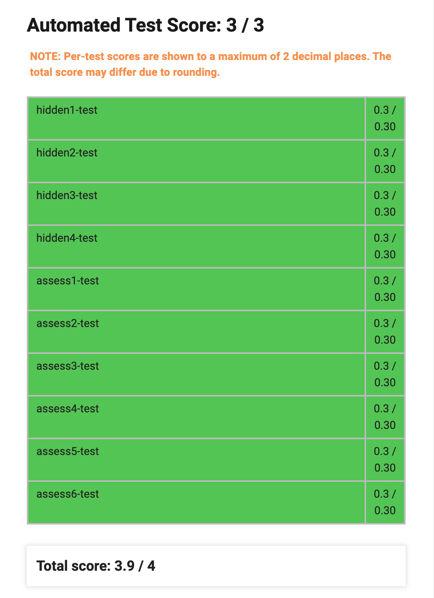

::: details

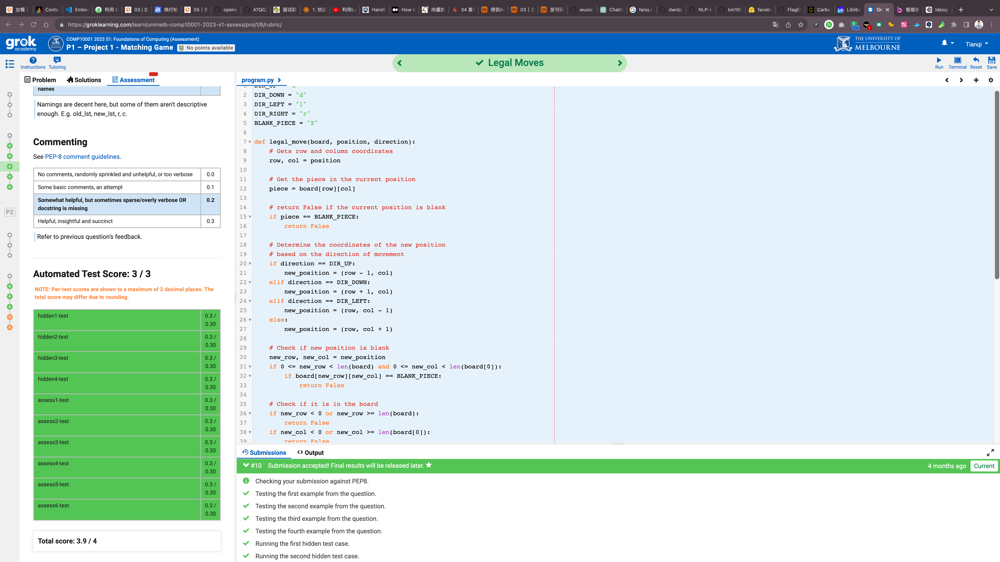


:::

## 8. Make a Move

::: center

## Task 4: Make Move (5 marks)

:::

If four pieces on the board are moved into position to form a 2 x 2 square, those four pieces are eliminated. This leaves a 2 x 2 gap represented by four `Z` characters which is filled in the following manner:

1. Firstly, all pieces immediately below the gap (i.e. in the same column with a higher row index) are moved up to fill any gaps.
2. Secondly, all pieces immediately to the right of the gap (i.e. in the same row with a higher column index) are moved left to fill any gaps.

In the event of a tie (i.e. a single move causes more than one 2 x 2 square to be formed), the square beginning at the lowest row number is eliminated. If both squares begin at the same row number, the square with the lowest column number is eliminated. Only one square may be eliminated before its gaps are filled.

For example, given the following board:

```python
   0  1  2  3  
   ------------
 0|C  A  B  C  
 1|A  B  C  A  
 2|A  B  B  C  
 3|A  A  A  A  
```

If the piece at `(0, 2)` is moved downwards, the four `B`s will be elimiated, resulting in the following board:

```python
   0  1  2  3  
   ------------
 0|C  A  C  C  
 1|A  Z  Z  A  
 2|A  Z  Z  C  
 3|A  A  A  A  
```

After the gaps are filled, the final result will be as follows:

```python
   0  1  2  3  
   ------------
 0|C  A  C  C  
 1|A  A  A  A  
 2|A  C  Z  Z  
 3|A  A  Z  Z  
```

Note that it is possible for multiple squares to be elimiated in the one move. For example, consider the following board:

```python
   0  1  2  3  
   ------------
 0|C  A  B  C  
 1|A  B  C  A  
 2|A  B  B  A  
 3|A  C  A  A  
```

Moving the piece at `(0, 2)` downwards again eliminates the the four `B`s. After the gaps are filled, the result will be as follows:

```python
   0  1  2  3  
   ------------
 0|C  A  C  C  
 1|A  C  A  A  
 2|A  A  Z  Z  
 3|A  A  Z  Z  
```

The four `A`s in the bottom left of the board will then be eliminated, resulting in the following final configuration:

```python
   0  1  2  3  
   ------------
 0|C  A  C  C  
 1|A  C  A  A  
 2|Z  Z  Z  Z  
 3|Z  Z  Z  Z  
```

Write a function `make_move(board, position, direction)`. This function should modify and return the `board` so that it contains the new configuration after the piece at `position` is moved in the direction specfied by `direction`. You may assume that the move is legal according to the definition in Question 3. You may further assume that no pieces need to be eliminated from the board (i.e. there are no 2 x 2 squares containing four pieces of the same colour) before the move is made.

### 8.1 Example calls

```python
print(make_move([["C", "A", "B", "C"], ["A", "B", "C", "A"], ["A", "B", "B", "C"], ["A", "A", "A", "A"]], (0, 2), "d"))
>>> [['C', 'A', 'C', 'C'], ['A', 'A', 'A', 'A'], ['A', 'C', 'Z', 'Z'], ['A', 'A', 'Z', 'Z']]
print(make_move([["C", "A", "B", "C"], ["A", "B", "C", "A"], ["A", "B", "B", "A"], ["A", "C", "A", "A"]], (0, 2), "d"))
>>> [['C', 'A', 'C', 'C'], ['A', 'C', 'A', 'A'], ['Z', 'Z', 'Z', 'Z'], ['Z', 'Z', 'Z', 'Z']]
```

### 8.2 Answer

::: code-tabs

@tab 学员代码

```python
DIR_UP = "u"
DIR_DOWN = "d"
DIR_LEFT = "l"
DIR_RIGHT = "r"
BLANK_PIECE = "Z"

# Eliminate 2x2 squares
def eliminate_squares(board):
    # Initialization flag that indicates whether elimination has occurred
    eliminated = False  
    # Traverse the board, checking every possible 2x2 square
    for r in range(len(board) - 1):
        for c in range(len(board[0]) - 1):
            # If a 2x2 square is found
            # replace it with a blank piece and set eliminated to True
            if board[r][c] != BLANK_PIECE and \
                    board[r][c] == board[r + 1][c] == \
                    board[r][c + 1] == board[r + 1][c + 1]:
                board[r][c], board[r + 1][c], board[r][c + 1], board[r + 1][
                    c + 1] = BLANK_PIECE, BLANK_PIECE, BLANK_PIECE, BLANK_PIECE
                eliminated = True
                return eliminated
    return eliminated


# Fill blank space
def fill_gaps(board):
    # Fill the vertical blank space
    for c in range(len(board[0])):  # Go through each column
        column = [board[r][c] for r in range(len(board))]
        column = \
            [x for x in column if x != BLANK_PIECE] + \
            [BLANK_PIECE] * column.count(BLANK_PIECE)
        for r in range(len(board)):
            board[r][c] = column[r]

    for r in range(len(board)):
        row = board[r]
        row = [x for x in row if x != BLANK_PIECE] + \
              [BLANK_PIECE] * row.count(BLANK_PIECE)
        board[r] = row


def make_move(board, position, direction):
    row, col = position  # row and column positions
    new_row, new_col = -1, -1
    if direction == DIR_UP:
        new_row, new_col = row - 1, col
    elif direction == DIR_DOWN:
        new_row, new_col = row + 1, col
    elif direction == DIR_LEFT:
        new_row, new_col = row, col - 1
    elif direction == DIR_RIGHT:
        new_row, new_col = row, col + 1

    # swaps two positions on a board
    board[new_row][new_col], board[row][col] = \
        board[row][col], board[new_row][new_col]

    # As long as any square is eliminated, continue filling the blank space
    while eliminate_squares(board):
        fill_gaps(board)
    return board
```

@tab Sample solution1

```python
DIR_UP = "u"
DIR_DOWN = "d"
DIR_LEFT = "l"
DIR_RIGHT = "r"
BLANK_PIECE = "Z"

def destroy(board):
    """ Finds a square of four identical pieces and removes them """
    # Find a square
    for i in range(len(board) - 1):
        for j in range(len(board[i]) - 1):
            if board[i][j] != BLANK_PIECE and board[i][j] == \
              board[i][j + 1] == board[i + 1][j] == board[i + 1][j + 1]:
                
                # Eliminate the pieces
                board[i][j] = BLANK_PIECE
                board[i][j + 1] = BLANK_PIECE
                board[i + 1][j] = BLANK_PIECE
                board[i + 1][j + 1] = BLANK_PIECE
                return True
    return False

def fix(board):
    """ Fills the gaps caused by eliminating pieces """
    # Move pieces up
    for j in range(len(board[0])):
        for i in range(len(board)):
            if board[i][j] == BLANK_PIECE:
                k = 1
                while i + k < len(board):
                    if board[i + k][j] != BLANK_PIECE:
                        board[i][j] = board[i + k][j]
                        board[i + k][j] = BLANK_PIECE
                        break
                    k = k + 1
    
    # Move pieces to the left
    for i in range(len(board)):
        for j in range(len(board[i])):
            if board[i][j] == BLANK_PIECE:
                k = 1
                while j + k < len(board[i]):
                    if board[i][j + k] != BLANK_PIECE:
                        board[i][j] = board[i][j + k]
                        board[i][j + k] = BLANK_PIECE  
                        break
                    k = k + 1
                

def make_move(board, position, direction):
    """ Makes a move in accordance with the Task 4 rules """
    row = position[0]
    col = position[1]
    
    # Calculate position of piece to be swapped
    if direction == DIR_UP:
        swap_row = row - 1
        swap_col = col
    elif direction == DIR_DOWN:
        swap_row = row + 1
        swap_col = col
    elif direction == DIR_RIGHT:
        swap_row = row
        swap_col = col + 1
    elif direction == DIR_LEFT:
        swap_row = row
        swap_col = col - 1
    else:
        return False
        
    piece = board[row][col]
    swap_piece = board[swap_row][swap_col]
    
    # Perform the swap
    board[row][col] = swap_piece
    board[swap_row][swap_col] = piece
    
    # Continue to remove pieces and fill gaps until no more removals possible
    while(destroy(board)):
        fix(board)
    
    return board
```

@tab Sample solution2

```python
import copy

DIR_UP = "u"
DIR_DOWN = "d"
DIR_LEFT = "l"
DIR_RIGHT = "r"
BLANK_PIECE = "Z"

FILL_SORT_KEY = lambda x: x == BLANK_PIECE
ROW, COL = 0, 1
DELTA_MOVE = {DIR_UP: (-1, 0), DIR_DOWN: (1, 0),
              DIR_LEFT: (0, -1), DIR_RIGHT: (0, 1)}

def clear_square(board):
    """
    Takes a 2D list board.
    Replaces a 2x2 equal piece square with a BLANK_PIECE square.
    Returns True if such square is found. Also mutates board.
    """
    for j in range(len(board) - 1):
        for i in range(len(board[0]) - 1):
            if board[j][i] == BLANK_PIECE:
                continue
            # Check if this is an equal piece square
            if board[j][i] == board[j][i + 1] \
                           == board[j + 1][i] \
                           == board[j + 1][i + 1]:
                # Replace the pieces with blank pieces
                board[j][i] = board[j][i + 1] \
                            = board[j + 1][i] \
                            = board[j + 1][i + 1] \
                            = BLANK_PIECE
                return True
    return False

def refresh_board(board):
    """
    Takes a 2D board list.
    "Refreshes" the board by clearing equal piece squares,
    and fills the gap produced.
    Mutates board.
    """
    nrows, ncols = len(board), len(board[0])
    # Keep clearing squares until there is no more left
    while clear_square(board):
        # Shift up
        for i in range(ncols):
            col = sorted([board[j][i] for j in range(nrows)],
                         key=FILL_SORT_KEY)
            for j in range(nrows):
                board[j][i] = col[j]

        # Shift left
        [row.sort(key=FILL_SORT_KEY) for row in board]

def make_move(board, position, direction):
    """
    Takes a 2D board list, initial position (j, i) tuple, and move direction.
    Performs the move and refreshes the board.
    Returns the resulting board.
    """
    board = copy.deepcopy(board)
    
    advance(board, position, direction)
    
    refresh_board(board)

    return board

def advance(board, old_pos, direction):
    """
    Takes a 2D board list, initial position (j, i) tuple, and move direction.
    *Mutates* the board if the two relevant pieces can be swapped.
    Returns the new position if the swap is successful, otherwise None.
    """
    new_pos = new_position(old_pos, direction)
    
    j_old, i_old = old_pos
    j_new, i_new = new_pos
    
    # Check if the two pieces to be swapped are valid
    if not within_bounds(board, new_pos) or \
       board[j_old][i_old] == BLANK_PIECE or \
       board[j_new][i_new] == BLANK_PIECE:
        return None
    
    # Swap the pieces
    board[j_old][i_old], board[j_new][i_new] = \
        board[j_new][i_new], board[j_old][i_old]
    return new_pos

def new_position(old_pos, direction):
    """
    Takes an initial position (j, i) tuple, and move direction.
    Returns the new position.
    """
    return add_2_tuple(old_pos, DELTA_MOVE[direction])

def within_bounds(board, pos):
    """
    Takes a 2D board list, and a position (j, i) tuple.
    Returns True if the position is within the board.
    """
    nrows, ncols = len(board), len(board[0])
    return 0 <= pos[ROW] < nrows and 0 <= pos[COL] < ncols

def add_2_tuple(tup0, tup1):
    """
    Takes two 2-tuples, and returns an element-wise sum of the two.
    """
    return tup0[ROW] + tup1[ROW], tup0[COL] + tup1[COL]
```

:::

::: tabs

@tab 1

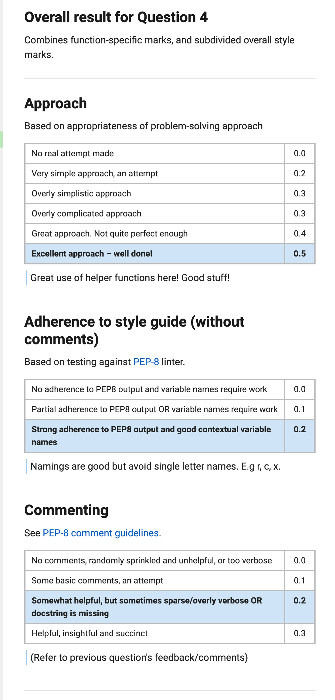

@tab 2

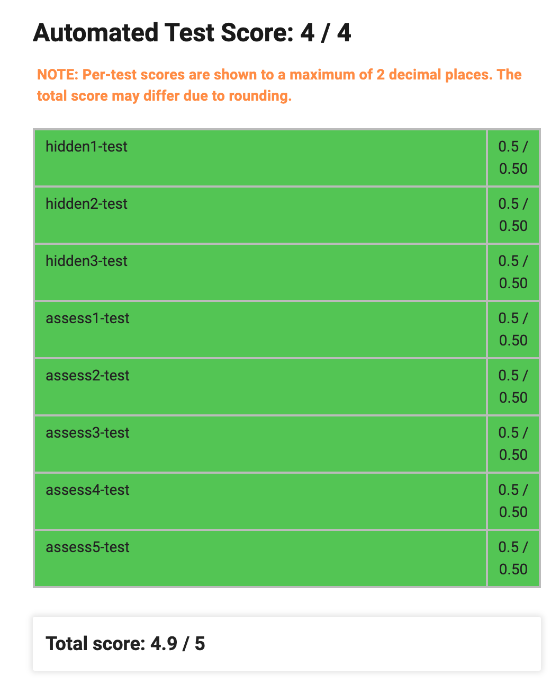

@tab 3

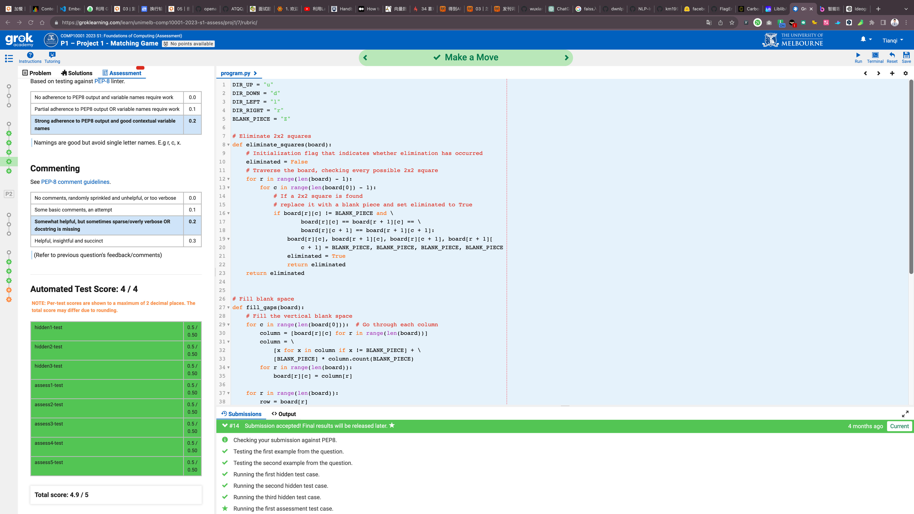

@tab 4


:::

## 9.  AI Player

Note: This question is optional and for bonus marks only! You can obtain full marks for Project 1 without attempting this question. It is considerably more difficult than the previous questions and intended for students who would like to challenge themselves. As such, lecturers and tutors will provide less guidance on how to complete it.

::: center

## Task 5: AI Player (BONUS 2 marks)

:::

Create a function `ai_player(board)` that will play the game for you.

A move can be represented as a tuple containing a position and direction. For example, moving position (2, 1) to the right could be represented as follows: `((2, 1), 'r')`. Your function should return a list of moves that, when executed, will eliminate all of the pieces on the board. If a sequence of moves exists that will win the game, your function should find it. If no such sequence exists, your function should return `None`.

Note that it is possible for there to be multiple different move sequences that can win the game from a given starting position. In this situation any such sequence will be accepted.

### 9.1 Example calls

```python
print(ai_player([['A', 'A', 'B', 'B'], ['A', 'B', 'A', 'B']]))
[((1, 1), 'r')]
print(ai_player([['C', 'B', 'B', 'C'], ['C', 'A', 'D', 'A'], ['D', 'A', 'A', 'D'], ['D', 'B', 'B', 'C']]))
[((1, 2), 'r'), ((0, 1), 'r')]
```

### 9.2 Answer

::: code-tabs

@tab 学员代码

```python

from collections import deque

DIR_UP = "u"
DIR_DOWN = "d"
DIR_LEFT = "l"
DIR_RIGHT = "r"
BLANK_PIECE = "Z"

def pretty_print(board):
    # Print the first row: column index
    # First print three Spaces at the beginning of the line
    print(' ' * 3, end='')

    # Loop through column index and format output
    for col in range(len(board[0])):
        print(f'{col:<3}', end='')
    # Ends the line and line feed
    print()

    # Print the second line: horizontal line
    # Print three Spaces at the beginning of the line
    print(' ' * 3, end='')

    # Print horizontal lines according to the numbers of columns
    print('-' * (len(board[0]) * 3))

    # Print the board content
    # Loop through each row
    for row in range(len(board)):
        # Print the row index and add a vertical bar after the index
        print(f'{row:>2}|', end='')
        # Loops through each element of the row
        for col in range(len(board[row])):
            # Prints the current element, adds two spaces between the elements
            print(f'{board[row][col]}  ', end='')
        # Ends the line and line feed
        print()

    # Print two blank lines
    print()


def validate_input(board, position, direction):
    # check that the number of rows and columns on the board is at least 2
    if len(board) < 2 or len(board[0]) < 2:
        return False

    # check that each row of the board is the same length
    for i in range(len(board)):
        if len(board[i]) != len(board[0]):
            return False

    # check that each value on the board is a capital letter
    for row in range(len(board)):
        for col in range(len(board[row])):
            if not board[row][col].isupper():
                return False

    # check that position is within the board and has no negative values
    x, y = position
    if x < 0 or y < 0 or x >= len(board) or y >= len(board[0]):
        return False

    # check if direction is one of the allowed values
    if direction not in (DIR_UP, DIR_DOWN, DIR_LEFT, DIR_RIGHT):
        return False

    # check if the number of pieces in each color is a multiple of 4
    d = {}
    for piece in board:
        for value in piece:
            if value != 'Z':
                if value in d:
                    d[value] += 1
                else:
                    d[value] = 1
    for piece in d.values():
        if piece % 4 != 0:
            return False

    # Returns True if all conditions are met
    return True


def legal_move(board, position, direction):
    # Gets row and column coordinates
    row, col = position

    # Get the piece in the current position
    piece = board[row][col]

    # return False if the current position is blank
    if piece == BLANK_PIECE:
        return False

    # Determine the coordinates of the new position
    # based on the direction of movement
    if direction == DIR_UP:
        new_position = (row - 1, col)
    elif direction == DIR_DOWN:
        new_position = (row + 1, col)
    elif direction == DIR_LEFT:
        new_position = (row, col - 1)
    else:
        new_position = (row, col + 1)

    # Check if new position is blank
    new_row, new_col = new_position
    if 0 <= new_row < len(board) and 0 <= new_col < len(board[0]):
        if board[new_row][new_col] == BLANK_PIECE:
            return False

    # Check if it is in the board
    if new_row < 0 or new_row >= len(board):
        return False
    if new_col < 0 or new_col >= len(board[0]):
        return False

    # Create two new lists
    # old is the surrounding color coordinates before the move
    old_lst = [(row + 1, col),
               (row - 1, col),
               (row, col - 1),
               (row, col + 1)]

    # new is the surrounding color coordinates after the move
    new_lst = [(new_row + 1, new_col),
               (new_row - 1, new_col),
               (new_row, new_col - 1),
               (new_row, new_col + 1)]

    # Check if there are adjacent pieces of the same color in the old position
    for r, c in old_lst:
        if 0 <= r < len(board) and 0 <= c < len(board[0]):
            if board[r][c] == board[new_row][new_col]:
                if ((r, c) != (new_row, new_col)):
                    return True

    # Check if there are adjacent pieces of the same color in the new position
    for r, c in new_lst:
        if 0 <= r < len(board) and 0 <= c < len(board[0]):
            if board[r][c] == board[row][col]:
                if ((r, c) != (row, col)):
                    return True

    # Returns false if there are no adjacent colors of the same color
    return False


# Eliminate 2x2 squares
def eliminate_squares(board):
    # Initialization flag that indicates whether elimination has occurred
    eliminated = False
    # Traverse the board, checking every possible 2x2 square
    for r in range(len(board) - 1):
        for c in range(len(board[0]) - 1):
            # If a 2x2 square is found
            # replace it with a blank piece and set eliminated to True
            if board[r][c] != BLANK_PIECE and \
                    board[r][c] == board[r + 1][c] == \
                    board[r][c + 1] == board[r + 1][c + 1]:
                board[r][c], board[r + 1][c], board[r][c + 1], board[r + 1][
                    c + 1] = BLANK_PIECE, BLANK_PIECE, BLANK_PIECE, BLANK_PIECE
                eliminated = True
                return eliminated
    return eliminated


# Fill blank space
def fill_gaps(board):
    # Fill the vertical blank space
    for c in range(len(board[0])):  # Go through each column
        column = [board[r][c] for r in range(len(board))]
        column = \
            [x for x in column if x != BLANK_PIECE] + \
            [BLANK_PIECE] * column.count(BLANK_PIECE)
        for r in range(len(board)):
            board[r][c] = column[r]

    for r in range(len(board)):
        row = board[r]
        row = [x for x in row if x != BLANK_PIECE] + \
              [BLANK_PIECE] * row.count(BLANK_PIECE)
        board[r] = row


def make_move(board, position, direction):
    row, col = position  # row and column positions
    new_row, new_col = -1, -1
    if direction == DIR_UP:
        new_row, new_col = row - 1, col
    elif direction == DIR_DOWN:
        new_row, new_col = row + 1, col
    elif direction == DIR_LEFT:
        new_row, new_col = row, col - 1
    elif direction == DIR_RIGHT:
        new_row, new_col = row, col + 1

    # swaps two positions on a board
    board[new_row][new_col], board[row][col] = \
        board[row][col], board[new_row][new_col]

    # As long as any square is eliminated, continue filling the blank space
    while eliminate_squares(board):
        fill_gaps(board)
    return board


def valid_move(board, position, direction):
    r, c = position
    

    if direction == DIR_UP:
        if r == 0 or board[r - 1][c] != BLANK_PIECE:
            return False
        return True

    if direction == DIR_DOWN:
        if r == len(board) - 1 or board[r + 1][c] != BLANK_PIECE:
            return False
        return True

    if direction == DIR_LEFT:
        if c == 0 or board[r][c - 1] != BLANK_PIECE:
            return False
        return True

    if direction == DIR_RIGHT:
        if c == len(board[0]) - 1 or board[r][c + 1] != BLANK_PIECE:
            return False
        return True

DIRECTIONS = [DIR_UP, DIR_DOWN, DIR_LEFT, DIR_RIGHT]

def ai_player(board):
    # Define a breadth-first search function that inputs the board
    # returns a sequence of moves that resolves the problem
    def search(board):
        # Initialize queue, store tuples (board, move sequence)
        lst = deque([(board, [])])
        # Initializes the collection that holds the visited board state
        s = set()

        # Loop is executed when queue is not empty
        while lst:
            # Pop the first element in the queue to get the current board state
            # corresponding move sequence
            current, moves = lst.popleft()
            # Converts the current board state to an immutable object 
            # so that it can be added to the accessed collection
            t = tuple(tuple(row) for row in current)
 
            # If the current board state has already been visited
            # skip this loop
            if t in s:
                continue
                
            # Adds the current board state to the visited collection
            s.add(t)
            
            # Check if the current board state has resolved the problem 
            # (all pieces have been eliminated)
            if all(all(cell == BLANK_PIECE for cell in row) for row in current):
                return moves
 
            # Traverse every position on the board, trying every possible move
            for r in range(len(current)):
                for c in range(len(current[0])):
                    for d in DIRECTIONS:
                        # If the move is correct, the move action is performed
                        if legal_move(current, (r, c), d):
                            
      # Create a copy of the current board to avoid modifying the original board
                            new = [row.copy() for row in current]
                            make_move(new, (r, c), d)
            
        # Adds the new board state and corresponding move sequence to the queue
                            lst.append((new, moves + [((r, c), d)]))
        # Returns None if no solution can be found
        return None

    return search(board)
```

@tab Sample solution1

```python
from hidden import legal_move, make_move
from copy import deepcopy

DIR_UP = "u"
DIR_DOWN = "d"
DIR_LEFT = "l"
DIR_RIGHT = "r"
BLANK_PIECE = "Z"

def all_moves(board):
    " Generates all moves (even illegal ones) "
    moves = []
    for row in range(len(board)):
        for col in range(len(board[row])):
            moves.append(((row, col), DIR_UP))
            moves.append(((row, col), DIR_DOWN))
            moves.append(((row, col), DIR_LEFT))
            moves.append(((row, col), DIR_RIGHT))
    return moves

def all_legal_moves(board, all_moves):
    """ Generates all legal moves from a list of moves """
    moves = []
    for position, direction in all_moves:
        if legal_move(board, position, direction):
            moves.append((position, direction))
    return moves

def has_won(board):
    """ Checks if the current board state is winning """
    for row in board:
        for val in row:
            if val != BLANK_PIECE:
                return False
    return True
 
def serialize(board):
    """ Converts the board to a single sequence of characters to
    make comparing boards more efficient """
    board_ser = ""
    for row in board:
        board_ser = board_ser + ''.join(row)
    return board_ser
    
def ai_player(board):
    """ Returns the sequence of moves needed to win the game, or None
    if winning is not possible from the current board. """
    open_nodes = [(board, [])]
    closed_nodes = []
    
    # Perform Breadth First Search on the board
    while len(open_nodes) > 0:
        next_board, path = open_nodes.pop(0)
        closed_nodes.append(serialize(next_board))
        
        # Return the winning solution
        if has_won(next_board):
            return path
        
        # Generate possible next moves for the current board position
        moves = all_moves(next_board)
        moves = all_legal_moves(next_board, moves)
        for move in moves:
            board2 = deepcopy(next_board)
            board2 = make_move(board2, move[0], move[1])
            board_ser = serialize(board2)

            # Check to see if we have encountered this board position
            # via another series of moves.
            if board_ser not in closed_nodes:
                open_nodes.append((board2, path + [move]))
                closed_nodes.append(board_ser)
    
    # Current board is unwinnable             
    return None
```

@tab Sample solution2

```python
from copy import deepcopy
from hidden import legal_move, make_move

DIR_UP = "u"
DIR_DOWN = "d"
DIR_LEFT = "l"
DIR_RIGHT = "r"
BLANK_PIECE = "Z"


def ai_player(board):
    """ Takes the board of the initial game state and runs breadth-first
      search to find a solution (sequence of moves that result in the board
      ending in winning state of all blank pieces). Returns None if no such
      winning board is found. """
    
    # queue is a list of tuples containing the board state and the moves
    # that lead to that state
    queue = [(board, [])]
    visited = set()

    while queue:
        # get the next board state to visit
        board, moves = queue.pop(0)
        if has_won(board):
            return moves
        
        # add the string of the board to visited set so we don't go in circles
        visited.add(str(board))

        # loop over each move for the current board and add it to the queue
        for move in generate_moves(board):
            next_board = make_move(deepcopy(board), *move)
            if str(next_board) not in visited:
                queue.append((next_board, moves + [move]))
            
    
def has_won(board):
    """ Returns a bool indicating if the board only has empty pieces """
    for row in board:
        for elem in row:
            if elem != BLANK_PIECE:
                return False
    return True
    

def generate_moves(board):
    """ Generates a list of possible moves for the current board.
     By symmetry we only need to generate for two perpendicular directions """
    return [((r, c), d) for r in range(len(board)) 
             for c in range(len(board[0])) for d in [DIR_LEFT, DIR_UP]
             if legal_move(board, (r, c), d)]
```

:::

::: tabs

@tab 1

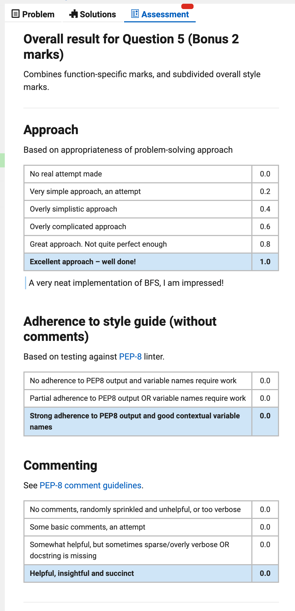

@tab 2

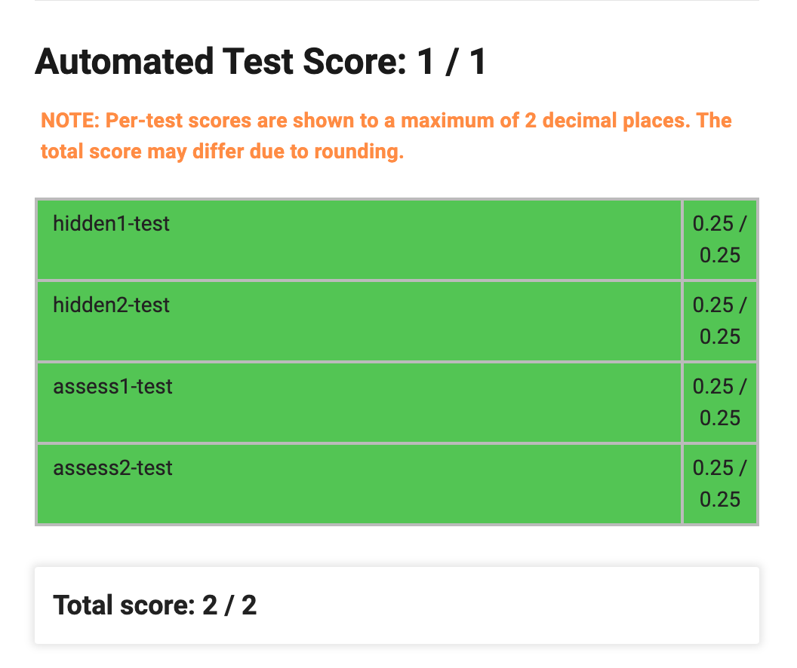

@tab 3


@tab 4

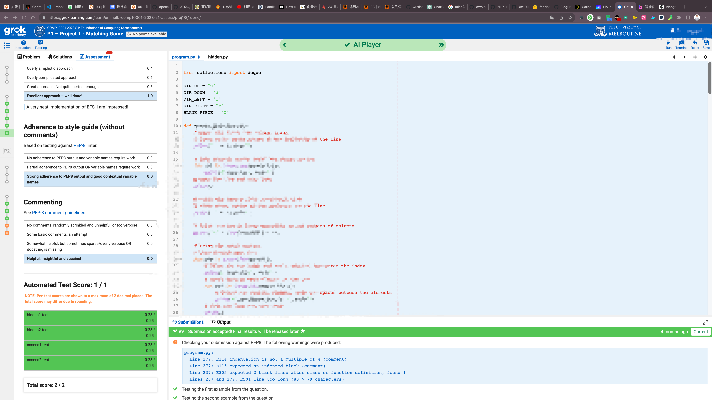

:::


::: details 公众号：AI悦创【二维码】


:::

::: info AI悦创·编程一对一

AI悦创·推出辅导班啦，包括「Python 语言辅导班、C++ 辅导班、java 辅导班、算法/数据结构辅导班、少儿编程、pygame 游戏开发、Web、Linux」，全部都是一对一教学：一对一辅导 + 一对一答疑 + 布置作业 + 项目实践等。当然，还有线下线上摄影课程、Photoshop、Premiere 一对一教学、QQ、微信在线，随时响应！微信：Jiabcdefh

C++ 信息奥赛题解，长期更新！长期招收一对一中小学信息奥赛集训，莆田、厦门地区有机会线下上门，其他地区线上。微信：Jiabcdefh

方法一：[QQ](http://wpa.qq.com/msgrd?v=3&uin=1432803776&site=qq&menu=yes)

方法二：微信：Jiabcdefh

:::


