## 1. Preamble

Things to look out for in solving the questions are:

- Make sure to name functions and arguments as stipulated in the question, but never be afraid to create extra functions of your own, so that you break up the code into conceptual sub-parts, and to avoid duplicate code sections.
- Commenting of code is one thing that you will be marked on, covering aspects such as:
    - describing key variables when they are first defined (but not things like index variables in `for` loops)
    - describing what each "chunk" of code does (but not every line).
    - describing what each function does, including what its arguments are, and what it returns, via a suitable "docstring".

Refer back to the Week 7a slides for information about PEP8 layout, and note that deductions will apply if you vary from those expectations.

**Note**: If you make multiple submissions, only the most recent submission will be marked.

## 2. Academic Honesty 1

Academic Honesty

- The project is done **individually** (not in groups)
- All assessment items (worksheets, projects, test and exam) must be **your own, individual, original work**.
- Any code that is submitted for assessment will be automatically compared against other students' code and other code sources using sophisticated similarity checking software.
- Cases of potential copying or submitting code that is not your own may lead to a formal **academic misconduct hearing**.
- Potential penalties can include getting **zero for the project, failing the subject**, or even **expulsion from the university** in extreme cases.
- For further information, please see the university's [Academic Honesty and Plagiarism](https://academicintegrity.unimelb.edu.au/) website, or ask your lecturer.
- The use of ChatGPT or other AI software to answer questions on this assignment is strictly prohibited. You won't learn anything if you don't do the work!

## 3. Academic Honesty 2

The fastest way to fail the subject is to hand in code that is not your own. In particular:

- you must not copy the code of other students.
- you must not make your code available to others to see.
- you must not give other students your login id and password.
- you must not share USB memory drives.
- you must not post your code on public forums, or any other activity, that would make your code available to others.
- you must not ask other students to see their code.
- **you must not submit code that has been written by someone else.**

If other students ask to see your code, you need to say "no", as copying (collusion or plagiarism) is also a form of academic misconduct. All students involved in collusion or code sharing may face penalties – both the student who copied, and the student who made their code available, and regardless of what the code's author was told or believed at the time they shared it.

The prohibition against all forms of sharing remains in force until the marks for this assessment item are released.

Before you start the project, you must watch the videos and complete the quiz under “CIS Academic Honesty Training” on the LMS Modules page

::: center

## Introduction

:::

## 4. Background

Many of you will have played "wordle" at some stage over the last few years, and even if you haven't played yourself, will have seen others post their colored "grids" if solved the daily puzzle.

The objective of wordle is to deduce a secret word by accumulation of evidence, lodging one guess at a time and being given information about how many matching characters you had, and whether they were in the right positions. There is also a well-known physical game called *Mastermind* that required similar deductive skills, see this [wikipedia article](https://en.wikipedia.org/wiki/Mastermind_(board_game)), maybe your parents even have a set at home at the back of one of the wardrobes from when they were kids, or maybe you have played it via a phone app.

In this assignment you are going to develop some functions as part of an implementation of a new game called "**FoCdle**", an entertainment designed for people who prefer numbers to words.

In wordle, the target string is a word, and each of your guesses is also a word. In a **FoCdle** the target string is a simple math equation of a known length (measured in characters), and each of your guesses must also be math equations of the same length.

Each cell in the **FoCdle** contains a single digit, or one of four possible operators "`+-*%`", or an "`=`" relationship; and the format of the **FoCdle** is always *value* *operator* *value* *operator* *value* `=` *result*. That is, each **FoCdle** always has exactly two *operator*s, one *equality*, three *value*s, and one *result*. Each *value* is an integer between 1 and 99 inclusive, expressed in the minimum number of digits (no leading zeros); and the *result* is a non-zero non-negative integer also expressed without any leading zeros. The four possible operators are "`+`", "`-`", "`*`", "`%`", all with exactly the same interpretation as in Python, and with the same precedence as in Python ("`*`" and "`%`" are carried out before either of "`+`" or "`-`").

The *difficulty* of a **FoCdle** is measured by its length in total characters.

For example, here is a trace of a person solving a **FoCdle** of difficulty 10. In their first guess they tried the 10-character equation "`13+12-8=17`" and learnt (from the green cells) what the first operator was and where it was located, and got the location of the "`=`" correct. They also learnt (from the yellow cells) that there were at least one each of the digits 1, 2, 3, and 7 (plus for each of those digits, they learnt one character position in which it did *not* appear); and they learnt (from the grey cells) that there was only a single instance of 1, that the second operator wasn't subtraction, and that there were no 8 digits anywhere.

::: details img

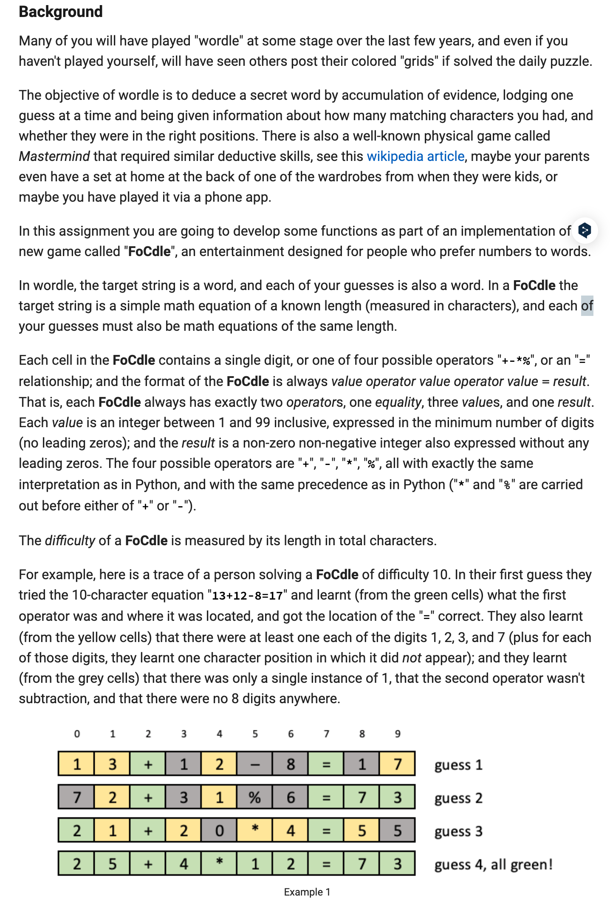

:::


From that information they formed their second guess "`72+31%6=73`" and submitted it. The response from that told them that the computed value had to be 73; that second operator wasn't "`%`" either; that there were no 6s, only one 7, and only one 3; plus also told them some more positions in which the digits 1 and 2 (which must occur somewhere) could not appear.

This person's third guess wasn't even a valid equation! But it told them that there was exactly one 5, one or more 4s and no 0s. It also told them that the second operator was a "`*`" and was not in position 6. By pooling all of the available information, the user was able to conclude that there were no 0s (guess 3), one 1 (guess 1), two or more 2s (guess 3), one 3 (guess 2), one or more 4s (guess 3), one five (guess 3), no 6s (guess 2), one 7 (guess 2), and no 8s (guess 1). They also know (because it is difficulty 10) that there are only seven digits in total required across the four numbers (three *value*s and one *result*; so they can conclude that they have found all of the digits, without needing to test digit 9.

The accumulation of all that information meant that their fourth guess was the only option that both fitted all of the information clues and was a valid equation, and when they submitted that guess they got the precious "all green" response.

Your mission in this project is to create some of the functions that might be used to either create and trace a **FoCdle**, and to suggest guesses to the user.

::: details img

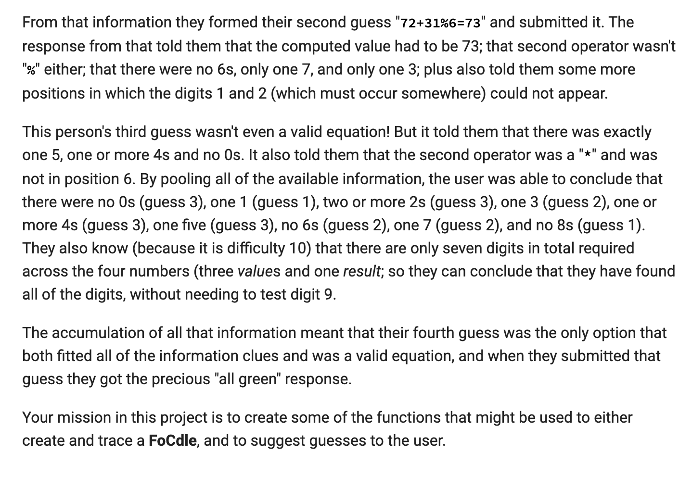

:::

## 6. Being a Bit Random

::: center

## Task 1: Being a Bit Random (3 marks)

:::

Given these lines:

```python
import random

DEF_DIFFIC = 10
MAX_TRIALS = 20
MAX_VALUE = 99
OPERATORS = "+-*%"
EQUALITY = "="
DIGITS = "0123456789"
NOT_POSSIBLE = "No FoCdle found of that difficulty"
```

write a function:

```python
def create_secret(difficulty=DEF_DIFFIC):
    '''
    Use a random number function to create a FoCdle instance of length 
    `difficulty`. The generated equation will be built around three values 
    each from 1 to 99, two operators, and an equality.
    '''
```

The generated equation must meet the requirements given earlier for a **FoCdle** instance.

Hint: You'll need to make use of the functions `random.randint()` and `random.choice()` to generate *value* *operator* *value* *operator* *value* sequences in a string, and then make use of Python's `eval()` function to compute the value of that string, as if the string was an expression in your program. That will then give you the corresponding *result* value. If the *result* is zero or negative, or takes too few or too many digits for the required **FoCdle** `difficulty`, you'll need to loop and try again. If `MAX_TRIALS` attempts still do not generate a **FoCdle** of the required `difficulty`, your function should return the string `"No FoCdle found of that difficulty"`.

Note that `eval()` is a *very* powerful function, and should be used with care. It is fine to use it in solving this task, but in general, it is not a good idea to use it in programs that will be used by other people, as it can be used to execute arbitrary code (a security risk).

*Example Calls:*

```python
>>> print(create_secret(8))
5*6-1=29
>>> print(create_secret(10))
37*50%56=2
>>> print(create_secret(12))
84%85+24=108
>>> print(create_secret(14))
27*71*40=76680
>>> print(create_secret(16))
No FoCdle found of that difficulty
```

The "normal" range for **FoCdle** difficulty is between 9 and 13.

You should **not** call `random.seed()` from any of your functions, and should assume that it will have been called by our scaffolding code before we call any of your functions. Note also that the use of randomness means that your output will almost certainly be different to the examples shown.

### 6.1 Answer

::: code-tabs

@tab 学员代码

```python
import random

DEF_DIFFIC = 10
MAX_TRIALS = 20
MAX_VALUE = 99
OPERATORS = "+-*%"
EQUALITY = "="
DIGITS = "0123456789"
NOT_POSSIBLE = "No FoCdle found of that difficulty"


def create_secret(difficulty=DEF_DIFFIC):
    '''
    Use a random number function to create a FoCdle instance of length
    `difficulty`. The generated equation will be built around three values
    each from 1 to 99, two operators, and an equality.
    '''
    # Number of initialization attempts
    trials = 0
    while trials < MAX_TRIALS:
        # MAX_TRIALS Maximum number of attempts
        v1 = random.randint(1, MAX_VALUE)
        v2 = random.randint(1, MAX_VALUE)
        v3 = random.randint(1, MAX_VALUE)

        # Two random selection operators
        opt1 = random.choice(OPERATORS)
        opt2 = random.choice(OPERATORS)

        # Building the equation
        equation = f"{v1}{opt1}{v2}{opt2}{v3}"

        # Calculate the equation using the eval function
        result = eval(equation)
        
        # Construct the complete equation
        full_equation = f"{equation}{EQUALITY}{result}"

        # The length of the equation is not equal to the specified difficulty
        if result < 0 or len(full_equation) != difficulty:
            return NOT_POSSIBLE

        return full_equation
```

@tab Sample solution1

```python
import random

DEF_DIFFIC = 10
MAX_TRIALS = 20
MAX_VALUE = 99
OPERATORS = "+-*%"
EQUALITY = "="
DIGITS = "0123456789"
NOT_POSSIBLE = "No FoCdle found of that difficulty"

def create_secret(difficulty=DEF_DIFFIC):
    '''
    Use a random number function to create a FoCdle instance of length 
    `difficulty`. The generated equation will be built around three values 
    each from 1 to 99, two operators, and an equality.
    '''
    
    for _ in range(MAX_TRIALS):
        # generate three random values and two random operators
        val1 = random.randint(1, MAX_VALUE)
        val2 = random.randint(1, MAX_VALUE)
        val3 = random.randint(1, MAX_VALUE)
        op1 = random.choice(OPERATORS)
        op2 = random.choice(OPERATORS)

        # using the values and operators, create a FoCdle equation
        secret = f"{val1}{op1}{val2}{op2}{val3}"
        rhs = eval(secret)
        secret = f"{secret}{EQUALITY}{rhs}"

        # it's possible for this equation to be valid but not of the desired
        # difficulty (or a zero/negative rhs), so we check for that before
        # accepting the equation and returning it
        if len(secret) == difficulty and rhs > 0:
            return secret
        
    # if we've tried too many times, give up
    return NOT_POSSIBLE
```

@tab Sample solution2

```python
import random

DEF_DIFFIC = 10
MAX_TRIALS = 20
MAX_VALUE = 99
OPERATORS = "+-*%"
EQUALITY = "="
DIGITS = "0123456789"
NOT_POSSIBLE = "No FoCdle found of that difficulty"

def attempt_secret(difficulty):
    '''
    Attempt to randomly generate a single random FoCdle equation of length
    `difficulty`. Return None if the equation is invalid.
    '''
    lhs = ''.join(map(str, [
        random.randint(1, MAX_VALUE),
        random.choice(OPERATORS),
        random.randint(1, MAX_VALUE),
        random.choice(OPERATORS),
        random.randint(1, MAX_VALUE),
    ]))
    
    # Generate full equation and evaluate it. Only return it if the equation is
    # of the correct length (difficulty) and has a positive RHS.
    rhs = eval(lhs)
    eq = f"{lhs}{EQUALITY}{rhs}"
    if rhs <= 0 or len(eq) != difficulty:
        return None
    
    return eq

def create_secret(difficulty=DEF_DIFFIC):
    '''
    Use a random functions to create a FoCdle instance of length `difficulty`.
    The generated equation will be built around three values each from 1 to 99,
    two operators, and an equality.
    '''
    
    # Attempt to generate a valid equation (up to) `MAX_TRIALS` times. Note
    # that `map` is "lazy", so we only generate as many equations as needed to
    # find a valid one (same with `filter` below -- the call to `next` is what
    # actually triggers the generation of the equations!). 
    possible_eqs = map(attempt_secret, [difficulty] * MAX_TRIALS)

    # Filter out any invalid equations to return the first valid one. Or, if
    # iterator is exhausted (all None), return NOT_POSSIBLE.
    return next(filter(None, possible_eqs), NOT_POSSIBLE)
 
```

:::

::: tabs

@tab 1

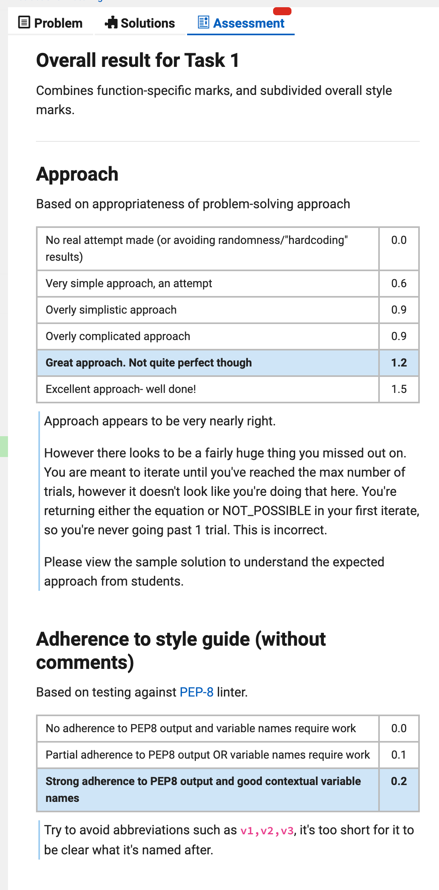

@tab 2

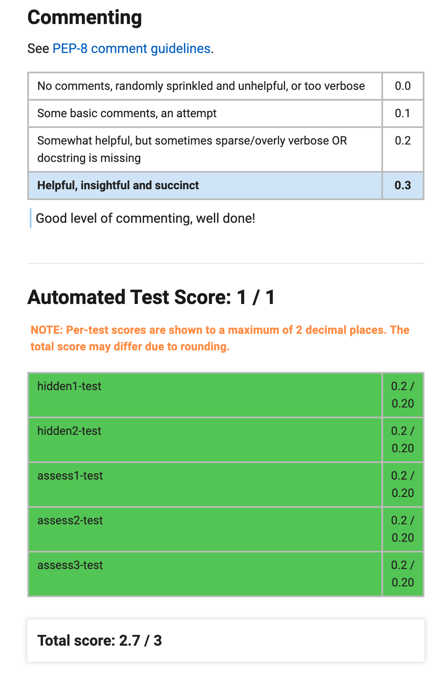

@tab 3

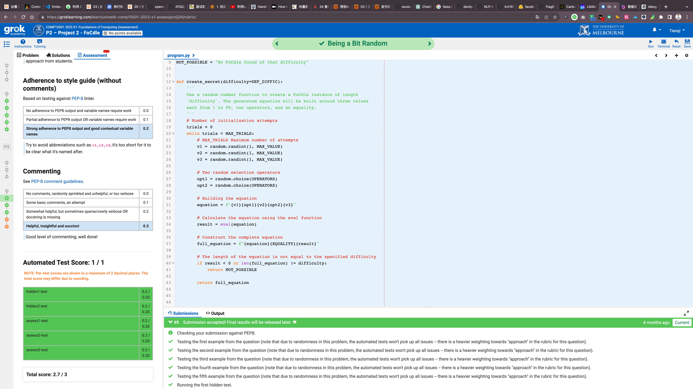

@tab 4


:::

## 7. Check a Guess

::: center

## Task 2: Setting Colors (5 marks)

:::

Given the additional constants:

```python
GREEN = "green"
YELLO = "yellow"
GREYY = "grey"
```

write a function:

```python
def set_colors(secret, guess):
    '''
    Compares the latest `guess` equation against the unknown `secret` one. 
    Returns a list of three-item tuples, one tuple for each character position 
    in the two equations:
        -- a position number within the `guess`, counting from zero;
        -- the character at that position of `guess`;
        -- one of "green", "yellow", or "grey", to indicate the status of
           the `guess` at that position, relative to `secret`.
    The return list is sorted by position.
    '''
```

*Example Calls:*

The final three example outputs are also shown in the example earlier in the diagram with the colored boxes.

```python
>>> set_colors("1+2*3=7", "1-4+7=4")
[(0, '1', 'green'), (1, '-', 'grey'), (2, '4', 'grey'), (3, '+', 'yellow'),
(4, '7', 'yellow'), (5, '=', 'green'), (6, '4', 'grey')]

>>> set_colors("1+2*3=7", "1***3*+")
[(0, '1', 'green'), (1, '*', 'grey'), (2, '*', 'grey'), (3, '*', 'green'),
(4, '3', 'green'), (5, '*', 'grey'), (6, '+', 'yellow')]

>>> set_colors("25+4*12=73", "13+12-8=17")
[(0, '1', 'yellow'), (1, '3', 'yellow'), (2, '+', 'green'), (3, '1', 'grey'),
(4, '2', 'yellow'), (5, '-', 'grey'), (6, '8', 'grey'), (7, '=', 'green'),
(8, '1', 'grey'), (9, '7', 'yellow')]

>>> set_colors("25+4*12=73", "72+31%6=73")
[(0, '7', 'grey'), (1, '2', 'yellow'), (2, '+', 'green'), (3, '3', 'grey'),
(4, '1', 'yellow'), (5, '%', 'grey'), (6, '6', 'grey'), (7, '=', 'green'),
(8, '7', 'green'), (9, '3', 'green')]

>>> set_colors("25+4*12=73", "21+20*4=55")
[(0, '2', 'green'), (1, '1', 'yellow'), (2, '+', 'green'), (3, '2', 'yellow'),
(4, '0', 'grey'), (5, '*', 'yellow'), (6, '4', 'yellow'), (7, '=', 'green'),
(8, '5', 'yellow'), (9, '5', 'grey')]
```

Note that there is no requirement that you check the legality of the guess (look at the second example!), or the arithmetic correctness. You just assign a color label to each character position. In this task you may assume that `secret` and `guess` have the same length.

You'll probably find it necessary to find and label any green elements first, before assigning any yellows or greys. Note also that if there are two (or more) characters *x* in `guess` and only one *x* in `secret`, and neither is a green match, then it is the leftmost *x* that is colored yellow, and any others are assigned grey.

### 7.1 Answer

::: code-tabs

@tab 学员代码 

```python
DEF_DIFFIC = 10
MAX_TRIALS = 20
MAX_VALUE = 99
OPERATORS = "+-*%"
EQUALITY = "="
DIGITS = "0123456789"
NOT_POSSIBLE = "No FoCdle found of that difficulty"
GREEN = "green"
YELLO = "yellow"
GREYY = "grey"


def set_colors(secret, guess):
    '''
    Compares the latest `guess` equation against the unknown `secret` one.
    Returns a list of three-item tuples, one tuple for each character position
    in the two equations:
        -- a position number within the `guess`, counting from zero;
        -- the character at that position of `guess`;
        -- one of "green", "yellow", or "grey", to indicate the status of
           the `guess` at that position, relative to `secret`.
    The return list is sorted by position.
    '''
    color_tuples = []
    secret_chars = list(secret)

    # Iterate over each character in the guess string and its index
    for i, char in enumerate(guess):
        # If characters in the same position match
        if secret[i] == char:
            # Mark them as green
            color_tuples.append((i, char, GREEN))
            # Set the characters in the secret list to None
            secret_chars[i] = None
        # Otherwise, set the color to None temporarily    
        else:
            color_tuples.append((i, char, None)) 
            
    # Iterate over each character and its index in the guess string again
    for i, tup in enumerate(color_tuples):
        # If the color of the current character is GREEN
        if tup[2] == GREEN: 
            pass
            # Check if the character exists in another location 
        elif tup[1] in secret_chars: 
            # If a match is found, mark it as yellow                
            color_tuples[i] = tup[:-1] + (YELLO,)
            # Set the characters in the list to None
            secret_chars[secret_chars.index(tup[1])] = None
        else:
            color_tuples[i] = tup[:-1] + (GREYY,)
                
    return color_tuples   
```

@tab Sample solution1

```python
OPERATORS = "+-*%"
EQUALITY = "="
DIGITS = "0123456789"
ALL_SYMS = set(DIGITS + OPERATORS + EQUALITY)

GREEN = "green"
YELLO = "yellow"
GREYY = "grey"

def set_colors(secret, guess):
    '''
    Compares the latest `guess` equation against the unknown `secret` one. 
    Returns a list of three-item tuples, one tuple for each character position 
    in the two equations:
        -- a position number within the `guess`, counting from zero;
        -- the character at that position of `guess`;
        -- one of "green", "yellow", or "grey", to indicate the status of
           the `guess` at that position, relative to `secret`.
    The return list is sorted by position.
    '''

    answer = []
    posns = {}
    greens = set()
    # set all symbols to 'not seen'
    for letter in ALL_SYMS:
        posns[letter] = set()

    # what symbols are in the secret equation, and where are they?
    for (p, letter) in enumerate(secret):
        posns[letter] |= {p}

    # look for green cells first
    for (p, letter) in enumerate(guess):
        if p in posns[letter]:
            answer.append((p, letter, GREEN))
            # and note this symbol as being matched
            posns[letter] -= {p}
            greens |= {p}

    # now go through and see if there are any yellows available
    for (p, letter) in enumerate(guess):
        if p in greens:
            continue
        if posns[letter]:
            answer.append((p, letter, YELLO))
            # and account for one that can be regarded as
            # being "the match", must take leftmost one
            pick = sorted(list(posns[letter]))[0]
            posns[letter] -= {pick}
        else:
            answer.append((p, letter, GREYY))

    # all letters are now categorized, sort and send back
    return sorted(answer)
```

@tab Sample solution2

```python
from collections import Counter

GREEN = "green"
YELLO = "yellow"
GREYY = "grey"

def green_positions(secret, guess):
    '''
    Return the set of green positions in `guess` by comparing against `secret`.
    '''
    return {
        pos for pos, (secret_ch, guess_ch) in enumerate(zip(secret, guess))
        if secret_ch == guess_ch
    }

def yellow_positions(secret, guess, exclude):
    '''
    Return the set of yellow positions in `guess` by "consuming" characters in
    `secret`, left to right. The `exclude` set may used to exclude positions
    that have already been matched as green.
    '''
    remaining_posns = set(range(len(guess))) - exclude
    remaining = Counter(secret[pos] for pos in remaining_posns)

    def consume(ch):
        '''
        Return True if we can consume `ch` from `guess` based on whether there
        are any remaining `ch` characters in `secret`. Updates `remaining` to
        reflect the consumption.
        '''
        remaining[ch] -= 1
        return remaining[ch] >= 0
    
    return {pos for pos in remaining_posns if consume(guess[pos])}

def set_colors(secret, guess):
    '''
    Compares the latest `guess` equation against the unknown `secret` one. 
    Returns a list of three-item tuples, one tuple for each character position 
    in the two equations:
        -- a position number within the `guess`, counting from zero;
        -- the character at that position of `guess`;
        -- one of "green", "yellow", or "grey", to indicate the status of
           the `guess` at that position, relative to `secret`.
    The return list is sorted by position.
    '''
    posns = {}
    
    # Determine green then yellow positions first.
    posns[GREEN] = green_positions(secret, guess)
    posns[YELLO] = yellow_positions(secret, guess, posns[GREEN])

    # Determine grey positions by exclusion.
    posns[GREYY] = set(range(len(guess))) - posns[GREEN] - posns[YELLO]

    # Return sorted list of tuples based on the positions.
    return sorted(
        (pos, guess[pos], color)
        for color, color_posns in posns.items()
        for pos in color_posns
    )
```

:::

::: tabs

@tab 1

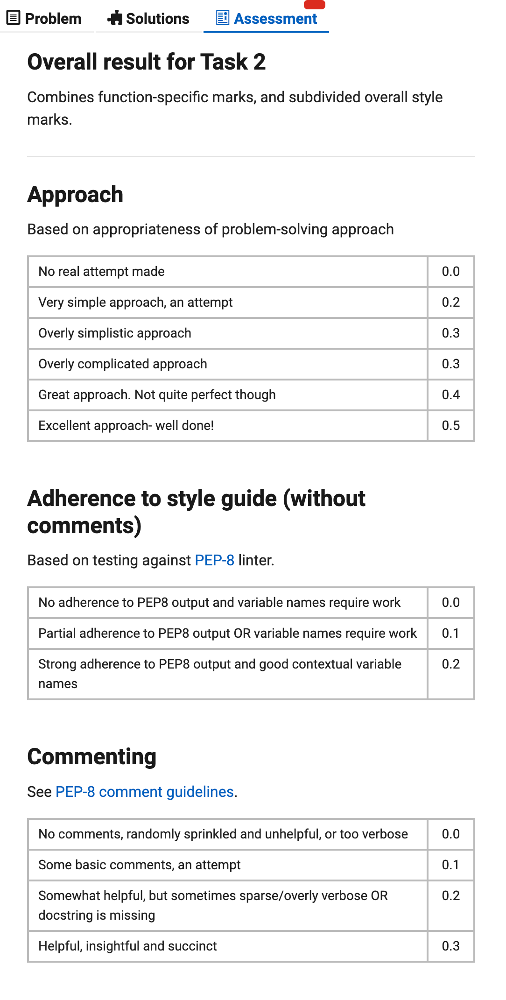

@tab 2

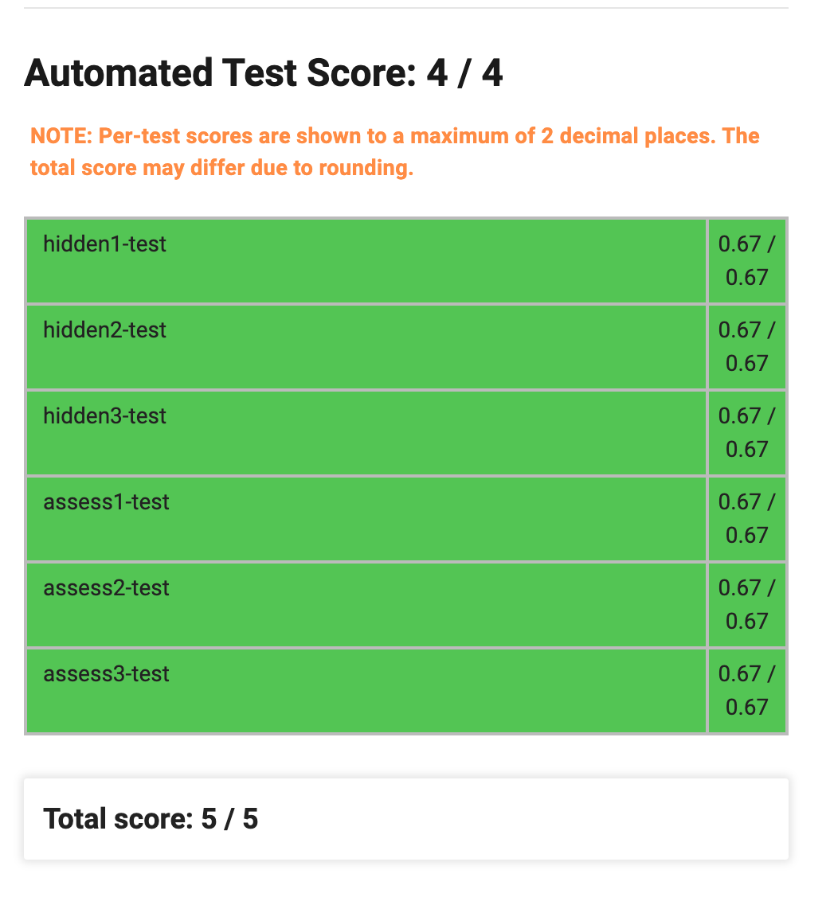

@tab 3

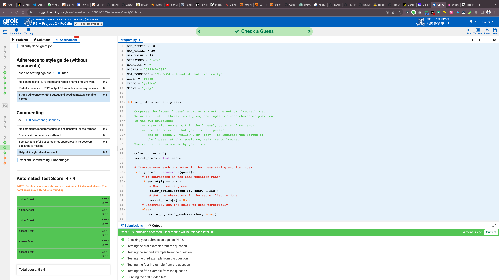

@tab 4


:::

## 8. Checking Restrictions

::: center

## Task 3: Checking Restrictions (5 marks)

:::

*Update 13/05: For further clarification on exactly which restrictions should be considered when solving this task, see [this guide](https://canvas.lms.unimelb.edu.au/courses/152095/pages/project-2-focdle-task-3).*

Each time `set_colors()` is called more information becomes available to help make the next guess even more precise. Each green response is a confirmed location of a particular character, each yellow response is confirmation that the character exists, but *not* in this position. Grey responses can be used to infer upper bounds on the number of instances of the corresponding character, and also to reduce the number of choices at the positions in which the appear.

A human doing the **FoCdle** would look at an output row, and apply logical and mathematical reasoning to decide what their next guess would be. They would then type that guess, click on a "submit" button, and hope to see a row of green squares emerge.

Suppose instead that we want to try and solve the **FoCdle** via a program. Here is a sketch of how such a "solver" program might be organized:

::: details this guide

## Project 2 (FoCdle) - Task 3

### Clarification For Task 3

The following explanation describes the intended filtering process to be implemented in Task 3. Note that is Task 3 we are *not* making any use of the FoCdle structure, only the matching information that has been accumulated from past guesses.

In particular, we don't know what the secret string is, and don't need to know it to do Task 3. The information we are working with is the `info` lists that have been returned by calls to `set_colors()`. Over a sequence of guesses, those `info` lists are collected together to form `all_info`, a list of lists of tuples.

Then, for some subsequent candidate `guess` we are considering, we want to know -- based on color matching alone, and not on any aspects of mathematics -- whether it is consistent with the current set of evidence (that is, "passes the requirements").

To be consistent with `all_info`, a candidate `guess` is checked against each of the individual `info` elements in `all_info`. That's what "collective" means -- a `guess` passes overall if it is consistent with each of the `info` lists individually.

To compare a candidate `guess` with a single `info` list of tuples, two types of verification need to be done:

- *Positional constraints*: A check that the color restrictions applied in each FoCdle position are being respected; and
- *Distributional constraints*: A check that the overall limitations on each possible character (minimum and maximum number of times it can occur) are being respected.

To implement the positional constraint, you need to check that the following rules apply at every position in the FoCdle:

- If `info` shows a "green" match at some position, then only the corresponding character from that `info` tuple can appear in that position (that is, the available options reduce to exactly one); and
- If `info` shows a "yellow" or "grey" match at some position, then the corresponding character from that `info` tuple cannot appear (that is, the available options reduce by one).

To implement the distributional constraint, you first need to:

- for each of the fifteen characters that might appear in a FoCdle (being `"0123456789+-*%="`), count up the number of times that character appears in `info` tagged as each of "green", "yellow", and "grey"; and
- count the total number of "grey" tags in the `info`.

Once that data is computed, you need to check, for each possible FoCdle character, that it appears in the candidate `guess` with a frequency that is:

- not less than than the sum of that character's "green" and "yellow" counts in the `info`; and
- not greater than:
    - if that character has one or more "grey" tags in the `info`, the sum of that characters "green" and "yellow" counts in the `info`; or
    - if that character doesn't have any "grey" tags in the `info`, the sum of that characters "green" and "yellow" counts in the `info`, plus the total number of "grey" tags in the `info`.

You'll need to think about these rules carefully to understand them fully, but once you have done that, you should be able to code them in to your Task 3 function.

#### And That's Task 3!...

Yes, these rules are a subset of everything that you *could* check, and the process described here will still "pass" candidates that with more effort (and the use of knowledge of the FoCdle structure) could be argued as being impossible.

But save that energy and thought for the Bonus Marks, ok? The rules listed above are the ones we'll be checking for in Task 3.

:::

```python
# ... any imports and constants go here ...
GCOUNT_MAX = 10

# ... potential "helper" functions could go here ...

def set_colors(secret, guess):
    # ... task 2 solution would go here ...

def passes_restrictions(guess, all_info):
    # ... task 3 (this task) solution would go here ...

def create_guess(all_info, difficulty):
    # ... task 4 (next task) solution would go here ...

def all_green(info):
    '''
    Return True if all the colors in `info` are green, False otherwise.
    '''
    return all(color == GREEN for _, _, color in info)

def solve_FoCdle(secret):
    '''
    For a given `secret` equation, play out a game of FoCdle, returning a tuple
    of the number of guesses required to find the secret, and the secret itself.
    Note that we aren't allowed to look at the value of `secret` directly -- it
    is only taken as a parameter for the sake of `set_colors()`, and to infer
    the respective difficulty. Most importantly, `create_guess()` cannot see it!
    '''
    difficulty = len(secret)

    # each element of `all_info` will be a list of tuples returned by
    # `set_colors`, the function you wrote in task 2
    all_info = []
    nguesses = 0

    while True:
        gcount = 0

        # iterate a controlled number of times to try and find a guess that
        # complies with the information that has been built up
        while True:
            new_guess = create_guess(all_info, difficulty)
            if passes_restrictions(new_guess, all_info):
                # seems like it might be a good guess
                break
            gcount += 1
            if gcount > GCOUNT_MAX:
                # just use this guess anyway
                break

        # for better or worse, now apply that latest guess
        new_info = set_colors(secret, new_guess)
        nguesses += 1
        if all_green(new_info):
            # wow, we have the answer, party time
            return (nguesses, new_guess)
        else:
            # didn't hit the solution, but hopefully will get additional
            # information to use when generating next candidate
            all_info.append(new_info)

# finally we're ready to play a game of FoCdle...
nguesses, final_guess = solve_FoCdle("25+4*12=73")

# and print out the results
print(f"Solved the FoCdle after {nguesses} guesses: '{final_guess}'")
```

*Note:* `create_guess()` *is a function which you will write in the next task (Task 4). Once that task is also completed, the entire program comes together.*

Inside `solve_FoCdle()`, each cycle of the inner loop generates another `new_guess`, and then checks whether or not it is compliant with the current `all_info`. But it isn't allowed to do that endlessly, and after getting as many as `GCOUNT_MAX` candidate guesses from `create_guess()` without finding a perfect one, it is required to commit to the last candidate, `new_guess`, even though it can't be a solution. That guess is then applied via `set_colors()` (and counted towards the guess score in `nguesses`), in the expectation that it will likely add new information (via `new_info`) to the growing set of overall restrictions (the list `all_info`).

Each iteration of the outer loop tries to find a good guess, then tests it as an "official" guess, and gets back another row of "colored boxes" to extend `all_info` with further information. The anticipation is that as `all_info` gets more and more restrictive, eventually a guess should be arrived at that is `all_green()`, and thus solves the **FoCdle**.

In this third task you are to write the function:

```python
def passes_restrictions(guess, all_info):
    '''
    Tests a `guess` equation against `all_info`, a list of known restrictions, 
    one entry in that list from each previous call to set_colors(). Returns 
    True if that `guess` complies with the collective evidence imposed by 
    `all_info`; returns False if any violation is detected. Does not check the 
    mathematical accuracy of the proposed candidate equation.
    '''
```

*Example Calls:*

This is the sequence of calls that was shown in the colored example earlier when `secret` was the string `"25+4*12=73"`. Note that a guess can be applied via `set_colors()` even if it doesn't pass the current restrictions; and that (see the last group) a correct answer will still pass the restrictions even after it has been checked via `set_colors()`.

```python
(assume `set_colors()` has been imported from task 2)

>>> secret = "25+4*12=73"
>>> all_info = []
>>> passes_restrictions("13+12-8=17", all_info)
True
>>> all_info.append(set_colors(secret, "13+12-8=17"))
>>> all_info
[[(0, '1', 'yellow'), (1, '3', 'yellow'), (2, '+', 'green'), (3, '1', 'grey'),
(4, '2', 'yellow'), (5, '-', 'grey'), (6, '8', 'grey'), (7, '=', 'green'), 
(8, '1', 'grey'), (9, '7', 'yellow')]]
>>> passes_restrictions("13+12-8=17", all_info)
False

>>> passes_restrictions("72+31%6=73", all_info)
True
>>> all_info.append(set_colors(secret, "72+31%6=73"))
>>> all_info
[[(0, '1', 'yellow'), (1, '3', 'yellow'), (2, '+', 'green'), (3, '1', 'grey'), 
(4, '2', 'yellow'), (5, '-', 'grey'), (6, '8', 'grey'), (7, '=', 'green'), 
(8, '1', 'grey'), (9, '7', 'yellow')], [(0, '7', 'grey'), (1, '2', 'yellow'), 
(2, '+', 'green'), (3, '3', 'grey'), (4, '1', 'yellow'), (5, '%', 'grey'), 
(6, '6', 'grey'), (7, '=', 'green'), (8, '7', 'green'), (9, '3', 'green')]]
>>> passes_restrictions("72+31%6=73", all_info)
False

>>> passes_restrictions("21+20*4=55", all_info)
False
>>> all_info.append(set_colors(secret, "21+20*4=55"))
>>> all_info
[[(0, '1', 'yellow'), (1, '3', 'yellow'), (2, '+', 'green'), (3, '1', 'grey'), 
(4, '2', 'yellow'), (5, '-', 'grey'), (6, '8', 'grey'), (7, '=', 'green'), 
(8, '1', 'grey'), (9, '7', 'yellow')], [(0, '7', 'grey'), (1, '2', 'yellow'), 
(2, '+', 'green'), (3, '3', 'grey'), (4, '1', 'yellow'), (5, '%', 'grey'), 
(6, '6', 'grey'), (7, '=', 'green'), (8, '7', 'green'), (9, '3', 'green')], 
[(0, '2', 'green'), (1, '1', 'yellow'), (2, '+', 'green'), (3, '2', 'yellow'), 
(4, '0', 'grey'), (5, '*', 'yellow'), (6, '4', 'yellow'), (7, '=', 'green'), 
(8, '5', 'yellow'), (9, '5', 'grey')]]
>>> passes_restrictions("21+20*4=55", all_info)
False

>>> passes_restrictions("25+4*12=73", all_info)
True
>>> all_info.append(set_colors(secret, "25+4*12=73"))
>>> all_info
[[(0, '1', 'yellow'), (1, '3', 'yellow'), (2, '+', 'green'), (3, '1', 'grey'), 
(4, '2', 'yellow'), (5, '-', 'grey'), (6, '8', 'grey'), (7, '=', 'green'), 
(8, '1', 'grey'), (9, '7', 'yellow')], [(0, '7', 'grey'), (1, '2', 'yellow'), 
(2, '+', 'green'), (3, '3', 'grey'), (4, '1', 'yellow'), (5, '%', 'grey'), 
(6, '6', 'grey'), (7, '=', 'green'), (8, '7', 'green'), (9, '3', 'green')], 
[(0, '2', 'green'), (1, '1', 'yellow'), (2, '+', 'green'), (3, '2', 'yellow'), 
(4, '0', 'grey'), (5, '*', 'yellow'), (6, '4', 'yellow'), (7, '=', 'green'), 
(8, '5', 'yellow'), (9, '5', 'grey')], [(0, '2', 'green'), (1, '5', 'green'), 
(2, '+', 'green'), (3, '4', 'green'), (4, '*', 'green'), (5, '1', 'green'), 
(6, '2', 'green'), (7, '=', 'green'), (8, '7', 'green'), (9, '3', 'green')]]
>>> passes_restrictions("25+4*12=73", all_info)
True
```

### Answer

::: code-tabs

@tab 学员代码

```python
GREEN = "green"
YELLO = "yellow"
GREYY = "grey"


def passes_restrictions(guess, all_info):
    '''
    Tests a `guess` equation against `all_info`, a list of known restrictions,
    one entry in that list from each previous call to set_colors(). Returns
    True if that `guess` complies with the collective evidence imposed by
    `all_info`; returns False if any violation is detected. Does not check the
    mathematical accuracy of the proposed candidate equation.
    '''
    for info in all_info:
        for index, char, color in info:
            # If it is green, the guessed char is not the same as the all_info 
            if color == GREEN and guess[index] != char:
                # False is returned
                return False
            # If it is yellow，the char guessed is the same as the all_info 
            if color == YELLO:
                if guess[index] == char:
                    # indicating that the user guessed wrong
                    # which still returns False
                    return False
            # If it is grey
            if color == GREYY:
                # the user's latest guess of char is compared to all_info
                if guess[index] == char:
                    # if char is the same, the user is still wrong
                    return False
    return True
```

@tab Sample solution1

```python
GREEN = "green"
YELLO = "yellow"
GREYY = "grey"

OPERATORS = "+-*%"
EQUALITY = "="
DIGITS = "0123456789"

ALL_SYMS = set(DIGITS + OPERATORS + EQUALITY)

def could_match_posn(candidate, info):
    '''
    Check one equation `candidate` to see if it violates the positional
    conditions captured by the color codes in `info`. Returns True if the
    equation could match the conditions, and False otherwise.
    '''
    difficulty = len(candidate)
    posn_poss = [set(ALL_SYMS) for p in range(difficulty)]

    # work through the info, applying color restrictions against positions
    for pos, letter, color in info:
        if color == GREEN:
            # if see green, position p must be that color
            posn_poss[pos] = {letter}
        else:
            # if see yellow or grey, can eliminate one option
            posn_poss[pos] -= {letter}

    # and now check the position possibilities against the candidate
    for pos in range(difficulty):
        if candidate[pos] not in posn_poss[pos]:
            # illegal color in this position
            return False

    # and if we make it here, passed all the positional tests for `info`
    return True

def could_match_dist(candidate, info):
    '''
    Check one equation `candidate` to see if it violates the distributional
    conditions captured by the color codes in `info`. Returns True if the
    equation could match the conditions, and False otherwise.
    '''
    min_count = {letter: 0 for letter in ALL_SYMS}
    max_count = {letter: 0 for letter in ALL_SYMS}
    seen_grey = {letter: False for letter in ALL_SYMS}
    tot_grey = 0

    # set the lower limit for each character based on green and yellow,
    # and at the same time, count the greys
    for pos, letter, color in info:
        if color == GREYY:
            seen_grey[letter] = True
            tot_grey += 1
        else:
            min_count[letter] += 1

    # derive upper limits from the lower limit information
    for letter in ALL_SYMS:
        if seen_grey[letter]:
            max_count[letter] = min_count[letter]
        else:
            max_count[letter] = min_count[letter] + tot_grey

    # then count how many of each character apear in the candidate
    num_used = {letter: 0 for letter in ALL_SYMS}
    for letter in candidate:
        num_used[letter] += 1

    # and finally, do the test for freq of each character
    for letter in ALL_SYMS:
        if num_used[letter] < min_count[letter]:
            return False
        if num_used[letter] > max_count[letter]:
            return False
    
    # if we make it here, passed all the distributional tests for `info`
    return True

def could_match(candidate, info):
    '''
    Check one equation `candidate` to see if it violates the conditions
    captured by the color codes in `info`. Returns True if the equation could
    match the conditions, and False otherwise.
    '''

    # first step, check the colors that are permitted at each position
    if not could_match_posn(candidate, info):
        return False
    
    # second step, check distributional restrictions
    if not could_match_dist(candidate, info):
        return False

    # and if make it here, passed all tests
    return True

def passes_restrictions(guess, all_info):
    '''
    Tests a `guess` equation against `all_info`, a list of known restrictions,
    one entry in that list from each previous call to set_colors(). Returns
    True if that `guess` complies with the collective evidence imposed by
    `all_info`; returns False if any violation is detected. Does not check the
    mathematical accuracy of the proposed candidate equation.
    '''
    for one_info in all_info:
        if not could_match(guess, one_info):
            return False
    return True
```

@tab Sample solution2

```python
from collections import Counter

GREEN = "green"
YELLO = "yellow"
GREYY = "grey"

OPERATORS = "+-*%"
EQUALITY = "="
DIGITS = "0123456789"

VALID_CHAR_SET = set(DIGITS + OPERATORS + EQUALITY)

def chars_possible_by_pos(info):
    '''
    Given some `info`, return a list of sets of possible characters at each
    position in the equation. Only takes into account positional information.
    '''
    return [
        set(ch) if color == GREEN else VALID_CHAR_SET - {ch}
        for _, ch, color in info
    ]

def passes_pos_restr(guess, info):
    '''
    Given some `info`, check for consistency with the guess based on the set
    of possible characters at each position.
    '''
    possible_at = chars_possible_by_pos(info)

    return all(guess_ch in possible 
               for guess_ch, possible in zip(guess, possible_at))

def freqs_possible_by_char(info):
    '''
    Given some `info`, return a dictionary of sets of possible frequencies for
    each character in our FoCdle alphabet. Keys are characters in our alphabet,
    values are sets of possible frequencies for that character.
    '''
    num_grey   = Counter(ch for _, ch, color in info if color == GREYY)
    zero_grey  = VALID_CHAR_SET - set(num_grey.keys())
    total_grey = sum(num_grey.values())

    # For each character, we derive a lower bound on the number of times that
    # character appears in the equation (# of green + # of yellow matches).
    at_least = Counter(ch for _, ch, color in info if color != GREYY)

    # An upper bound is derived by adding the total number of grey matches to
    # the lower bound for every character that has *zero* grey matches.
    at_most = at_least + Counter(list(zero_grey) * total_grey)

    # Now return a dictionary of sets of possible frequencies for each char.
    return {
        char: set(range(at_least[char], at_most[char] + 1))
        for char in VALID_CHAR_SET
    }

def passes_dist_restr(guess, info):
    '''
    Given some `info`, check for consistency with the guess based on the set
    of possible frequencies for each character.
    '''
    possible_freqs = freqs_possible_by_char(info)
    guess_freqs    = Counter(guess)

    # Return True only if the character frequencies in the guess are all within
    # the possible frequencies for each character.
    return all(guess_freqs[char] in possible_freqs[char]
               for char in VALID_CHAR_SET)

def passes_restrictions(guess, all_info):
    '''
    Tests a `guess` equation against `all_info`, a list of known restrictions,
    one entry in that list from each previous call to set_colors().  Returns
    True if that `guess` complies with the collective evidence imposed by
    `all_info`; returns False if any violation is detected.  Does not check the
    mathematical accuracy of the proposed candidate equation.
    '''
    return all(
        passes_pos_restr(guess, info) and passes_dist_restr(guess, info)
        for info in all_info
    )
```

:::

::: tabs

@tab 1

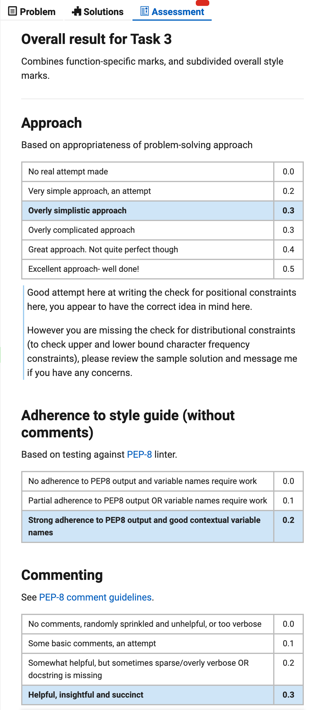

@tab 2

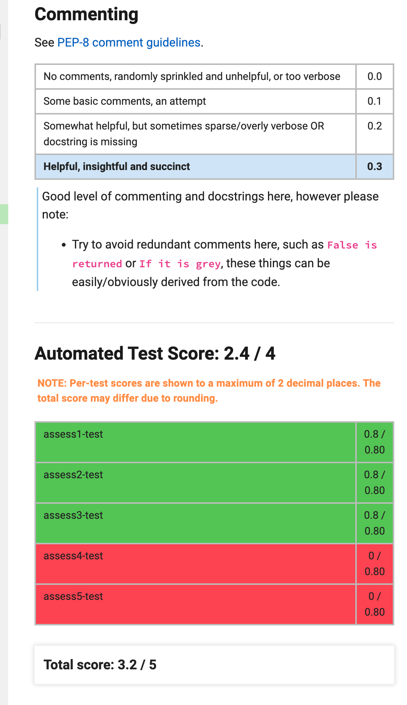

@tab 3


@tab 4

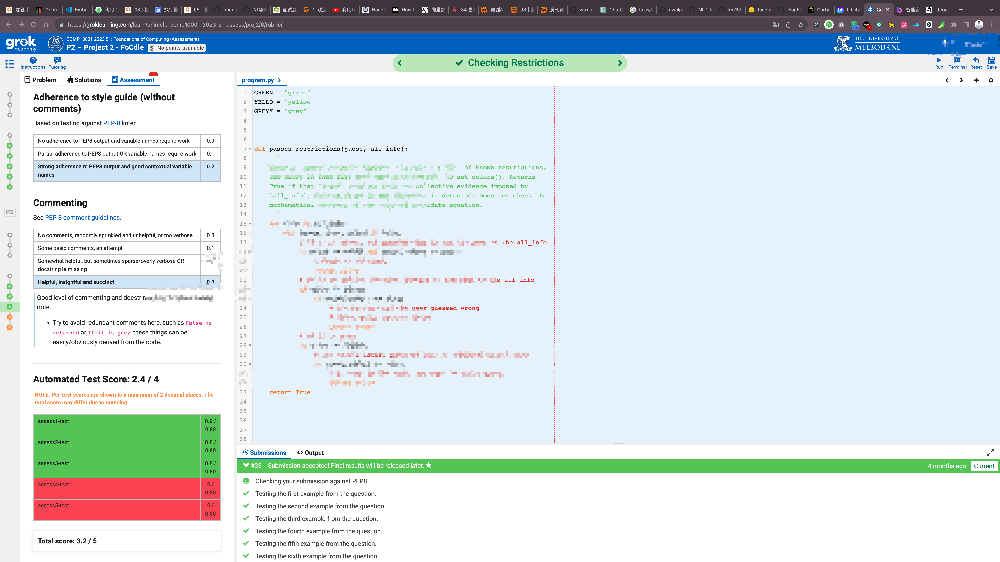

:::

## 9. Candidate Generation

::: center

## Task 4: Candidate Generation (2 marks)

:::

Now for the fun part! There are lots of ways the function `create_guess()` could be implemented, and lots of information in `all_info` that might be used to try and create equations that comply with the growing set of restrictions.

Write a function:

```python
def create_guess(all_info, difficulty=DEF_DIFFIC):
    '''
    Takes information built up from past guesses that is stored in `all_info`, 
    and uses it as guidance to generate a new guess of length `difficulty`.
    '''
```

that creates possible guesses of length `difficulty`, drawing (only) on the information provided via `all_info`.

You may not call `passes_restrictions()` from within `create_guess()` and cannot access `secret` either. Your `create_guess()` function uses the restrictions in `all_info` to guide the candidate the generation process, but doesn't guarantee that the guess that emerges will be a perfect one. That is why there is an inner loop (see the sketch provided in Task 3) that checks `passes_restrictions()` for up to `GCOUNT_MAX` different candidates. (Directly generating a candidate that is guaranteed to be compliant is rather hard.)

One simple way of exploiting the information in `all_info` is to collect all the "green", "yellow", and "grey" information according to the corresponding character position. Initially, each position might be any of the possible letters. But each yellow or grey label eliminates one possible value from the corresponding position in the **FoCdle**, and each green label eliminates all but one possible label.

With that information accumulated, a new guess can be created by iterating over the character positions, making a random choice at each among the subset of symbols that have not been eliminated.

This approach still doesn't make full use of all of the available information, and still doesn't make use of any mathematical knowledge either. But it is a start, and if you successfully implement it for this task (and in a neat and well-structured manner) you'll get the allocated marks.

*Example Calls:*

Anything can be returned as a guess, provided it has the right length. The examples here shows guesses that match all of the color information present in `all_info` as it accumulates information from each previous guess, but have no other knowledge included (so they mostly look like "dumb" guesses):

```python
>>> all_info = []
>>> guess = create_guess(all_info)
>>> print(guess)
1*783%9122
>>> all_info.append(set_colors(secret, guess))

>>> guess = create_guess(all_info)
>>> print(guess)
70308-7774
>>> all_info.append(set_colors(secret, guess))

>>> guess = create_guess(all_info)
>>> print(guess)
34=795++79
>>> all_info.append(set_colors(secret, guess))

>>> guess = create_guess(all_info)
>>> print(guess)
8315+16-71
>>> all_info.append(set_colors(secret, guess))

   (another 5 guesses)

>>> guess = create_guess(all_info)
>>> print(guess)
25+=*1*=73
>>> all_info.append(set_colors(secret, guess))

>>> guess = create_guess(all_info)
>>> print(guess)
25+2*12=73
>>> all_info.append(set_colors(secret, guess))

>>> guess = create_guess(all_info)
>>> print(guess)
25+4*12=73
>>> all_info.append(set_colors(secret, guess))
```

This approach does get there, but converges pretty slowly, taking an average of 12 to 13 guesses before enough information has been accumulated that all character positions of `secret` are known and have only one option available. Convergence will be faster if further information is employed, in addition to the colors and positions; but *to get the marks for this task it is sufficient to generate guesses based solely on colors and positions, as described.*

### Answer

::: code-tabs

@tab 学员代码

```python
import random
from hidden import solve_FoCdle

ENABLE_PLAYTEST = False
DEF_DIFFIC = 10
GREEN = "green"
YELLO = "yellow"
GREYY = "grey"


def create_guess(all_info, difficulty=DEF_DIFFIC):

    '''
    Takes information built up from past guesses that is stored in `all_info`, 
    and uses it as guidance to generate a new guess of length `difficulty`.
    '''
    # All possible symbols
    all_symbols = list('0123456789+-*/=')
    
    # Store the green character in the correct position
    green_symbols = []
    
    # Store the index of the correct position of the green character
    green_position = []
    
    # Store yellow characters that exist but are in the wrong place
    yello_symbols = []
    
    # Initialize the list of eligible characters
    correct_list = [set(all_symbols)] * difficulty
    
    # Parsing information from past guesses
    for info in all_info:
        for index, char, color in info:
            # If the colour is green
            if color == GREEN:
                # Mark its index and characters in the list
                # This is the only possible character for this position
                green_symbols.append((index, char))
                correct_list[index] = {char}
                green_position.append(index)
                
            # If the colour is yellow     
            elif color == YELLO:
                # This means that the yellow position is incorrect 
                # Should be removed from the correct list
                correct_list[index].discard(char)
                yello_symbols.append((index, char))
                
            # If the colour is grey   
            elif color == GREYY:
                # Indicates that the grey position and characters are incorrect
                # Should be removed from the correct list
                for pos_symbols in correct_list:
                    pos_symbols.discard(char)
                    
    # Green characters can only be in their position
    for index, char in green_symbols:
        correct_list[index] = {char}
    # Yellow characters cannot be in their position
    # But can be in other non-green positions
    for index, char in yello_symbols:
        for position, correct in enumerate(correct_list):
            if (position != index) and (position not in green_position):
                correct.add(char)
                
    # No operator or equal sign at the beginning or end            
    correct_list[0].discard("=")
    correct_list[0].discard("+")
    correct_list[0].discard("-")
    correct_list[0].discard("*")
    correct_list[0].discard("/")
    correct_list[-1].discard("/")
    correct_list[-1].discard("+")
    correct_list[-1].discard("-")
    correct_list[-1].discard("*")
    correct_list[-1].discard("=")
    
    # Generate new guesses
    new_guess = []
    for pos_symbols in correct_list:
        # Calculate the probability of each character 
        # Based on the number of occurrences of the yellow character
        char_count = {}
        for char in pos_symbols:
            lst = []
            for info in all_info:
                for index, c, color in info:
                    if c == char and color == YELLO:
                        lst.append(1)
            char_count[char] = sum(lst) + 1
            
        # Select the character with the highest probability    
        most_probable_char = max(char_count, key=char_count.get)
        new_guess.append(most_probable_char)
    guess = ''.join(new_guess)
    return guess


# Let's play a game of FoCdle... below we pass your `create_guess` function to
# our hidden `solve_FoCdle` function, which uses it to guess the secret in a
# game of FoCdle. This closely follows the program outline described in task 3.
# You may also call `solve_FoCdle` with `debug=True` to see printed information
# that corresponds with comments in that same outline. 
# 
# Note: When you click "Mark", the `solve_FoCdle` function is run 100 times
# with "25+4*12=73" as the secret, taking the average number of guesses
# required to solve it. The hidden assessment tests will use many different
# random secrets, so make sure you test your code beyond this example

if ENABLE_PLAYTEST:  # Set to True to run this code when clicking "Run" in Grok
    secret = "25+4*12=73"
    nguesses, final_guess = solve_FoCdle(secret, create_guess, debug=False)
    print(f"Solved the FoCdle after {nguesses} guesses: '{final_guess}'")
```

@tab Sample solution1

```python
import random

DEF_DIFFIC = 10
OPERATORS = "+-*%"
EQUALITY = "="
DIGITS = "0123456789"
NOT_POSSIBLE = "No FoCdle found of that difficulty"

GREEN = "green"
YELLO = "yellow"
GREYY = "grey"
DIGITS = "0123456789"
ALL_SYMS = DIGITS + OPERATORS + EQUALITY

def create_guess(all_info, difficulty=DEF_DIFFIC):
    '''
    Takes information built up from past guesses that is stored in `all_info`, 
    and uses it as guidance to generate a new guess of length `difficulty`.
    '''

    # first, build a structure that says that every position
    # could be any of the possible letters
    could_be = {}
    for pos in range(0, difficulty):
        could_be[pos] = set(ALL_SYMS)

    # then process all of the provided information, doing two
    # things: green reduces could_be down to exactly that value,
    # and yellow and grey reduce could_be by one thing
    for info in all_info:
        for (pos, letter, color) in info:
            if color == GREEN:
                could_be[pos] = set(letter)
            elif color == YELLO or color == GREYY:
                if letter in could_be[pos]:
                    could_be[pos].remove(letter)

    # now generate a candidate based on what is permissible 
    # in each position
    candidate = ['x'] * difficulty
    for pos in range(difficulty):
        pick = random.choice(list(could_be[pos]))
        candidate[pos] = pick
        
    return "".join(candidate)
```

@tab Sample solution2

```python
import itertools
import random

DEF_DIFFIC = 10

GREEN = "green"
YELLO = "yellow"
GREYY = "grey"

OPERATORS = "+-*%"
EQUALITY = "="
DIGITS = "0123456789"

VALID_CHAR_SET = set(DIGITS + OPERATORS + EQUALITY)


def create_guess(all_info, difficulty=DEF_DIFFIC):
    '''
    Takes information built up from past guesses that is stored in `all_info`, 
    and uses it as guidance to generate a new guess of length `difficulty`.
    '''
    # Start with all chars in our alphabet at each position.
    possible_at = [set(VALID_CHAR_SET) for _ in range(difficulty)]
    
    # Narrow down possible_at based on positional info we have so far. 
    for pos, ch, color in itertools.chain.from_iterable(all_info):
        if color == GREEN:
            possible_at[pos] = set(ch)
        else:
            possible_at[pos].remove(ch)

    # Construct guess by randomly picking a character from the set of possible
    # characters at each position.
    return "".join([random.choice(list(chars)) for chars in possible_at])
```

:::

::: tabs

@tab 1

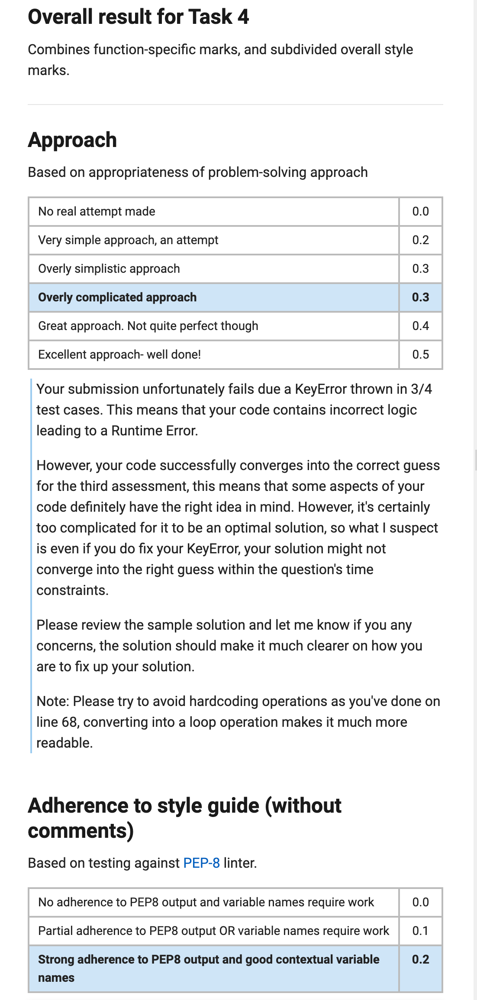

@tab 2

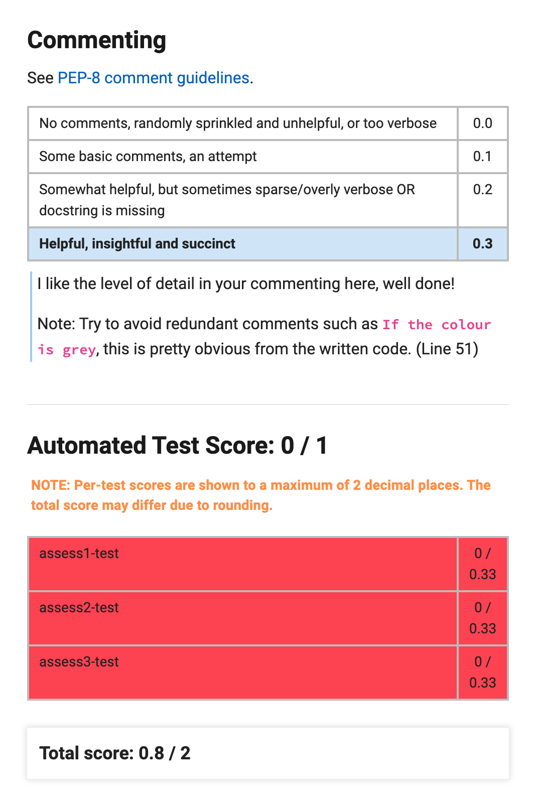

@tab 3

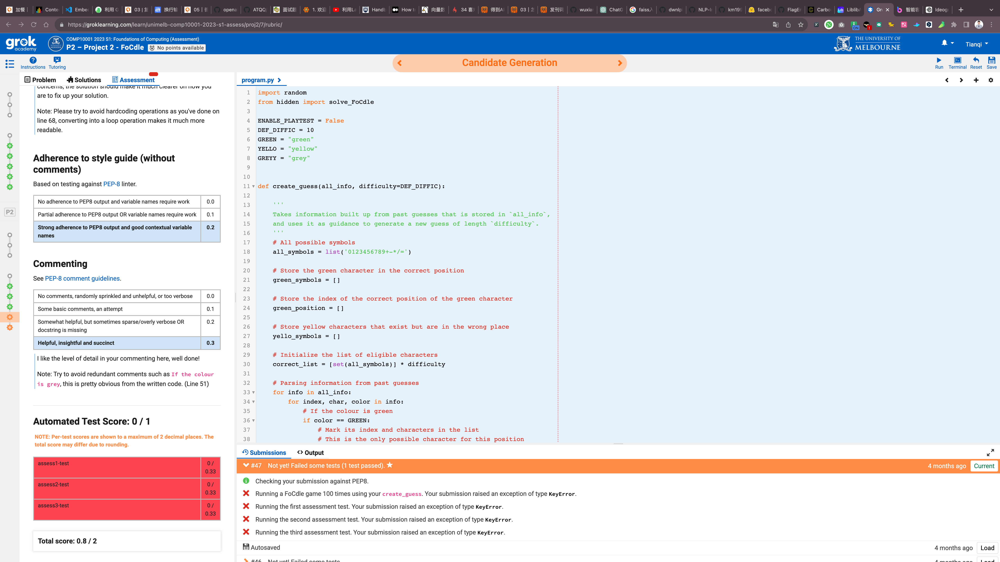

@tab 4

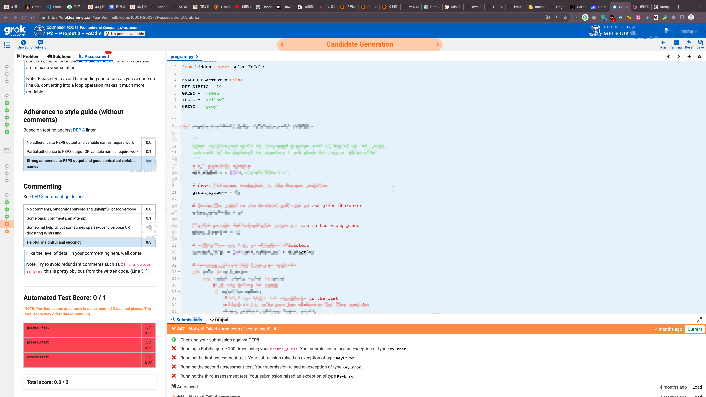

:::

## 10. Smarter Candidate Generation (BONUS 2 marks)

::: center

## Bonus Marks: Smarter Candidate Generation (BONUS 2 marks)

:::

If you want to go into the competition for bonus marks, you are also free to improve on your Task 4 `create_guess()` function, and develop a `create_better_guess()` function, with the goal being to reduce the number of calls to `set_colors()`. Our testing in this task will **not** call `passes_restrictions()` to check your `new_guess`, and will simply apply what you return to us. Hence, you might notice that the average guess count increases if you simply copy your Task 4 solution here. (In this bonus task you may call `passes_restrictions()` from within your `create_better_guess()` function if you wish to.)

We'll measure the quality of `create_better_guess()` functions by the expected length (using the variable `nguesses` in the code sketched in Task 3) taken to identify the secret equation, averaged over a large set of secret equations (minimum 100).

Your function must only make use of the overall rules of FoCdles, and the information supplied via `all_info`; and must execute sufficiently quickly that when we use it we'll be able to solve more than 100 FoCdles (involving perhaps 1000 calls to your function) within a few seconds of computation time (and within any other resource limits imposed by Grok).

The 50 students with the lowest average value for `nguesses` over our set of secret FoCdles will be given 2 bonus marks, and the next 150 lowest average `nguesses` programs will get one bonus mark, provided that they do better than the "dumb" mechanism that is the starting point (Task 4).

The "Bonus Marks" workspace here is provided to be used if you wish to rise to the challenge, or you can leave it empty if you plan to stop after writing `create_guess()`. You might wish to assemble the other components of a complete solution in this workspace too, so that you can do your own testing while developing `create_better_guess()`. Only the `create_better_guess()` function will be assessed during the marking process.

The lecturers and tutors will not be providing any guidance on how to make a more precise `create_better_guess()` function – you are on your own in this regard.

*Note again that it is possible to get the full 15 marks without taking on the challenge described in this last task.*

### Answer

::: code-tabs

@tab 学员代码

```python
import random
import math
GREEN = "green"
YELLO = "yellow"
GREYY = "grey"
DEF_DIFFIC = 10


def create_better_guess(all_info, difficulty=DEF_DIFFIC):
    '''
    Takes information built up from past guesses that is stored in `all_info`,
    and uses it as guidance to generate a new guess of length `difficulty`.
    '''
    all_symbols = list("0123456789+-*/=")
    green_symbols = []
    green_position = []
    yello_symbols = []
    correct_list = [set(all_symbols)] * difficulty
    for info in all_info:
        for index, char, color in info:
            if color == GREEN:
                green_symbols.append((index, char))
                correct_list[index] = {char}
                green_position.append(index)
            elif color == YELLO:
                correct_list[index].discard(char)
                yello_symbols.append((index, char))
            elif color == GREYY:
                for pos_symbols in correct_list:
                    pos_symbols.discard(char)
    for index, char in green_symbols:
        correct_list[index] = {char}
    for index, char in yello_symbols:
        for position, correct in enumerate(correct_list):
            if (position != index) and (position not in green_position):
                correct.add(char)
                
    correct_list[0].discard("=")
    correct_list[0].discard("+")
    correct_list[0].discard("-")
    correct_list[0].discard("*")
    correct_list[0].discard("/")
    correct_list[-1].discard("/")
    correct_list[-1].discard("+")
    correct_list[-1].discard("-")
    correct_list[-1].discard("*")
    correct_list[-1].discard("=")
    
    new_guess = []
    for pos_symbols in correct_list:
        char_count = {}
        for char in pos_symbols:
            char_count[char] = sum(
                [1 for info in all_info for index, c, color in info 
                 if c == char and color == YELLO]
            ) + 1
        most_entropy_char = max(
            char_count, key=lambda x: -char_count[x] * math.log(char_count[x]))
        new_guess.append(most_entropy_char)
    guess = "".join(new_guess)
    return guess


if ENABLE_PLAYTEST:  # Set to True to run this code when clicking "Run" in Grok
    secret = "25+4*12=73"
    nguesses, final_guess = solve_FoCdle(secret, create_guess, debug=True)
    print(f"Solved the FoCdle after {nguesses} guesses: '{final_guess}'")
```

@tab Sample solution

```python
# No solution
```


:::

::: tabs

@tab 1

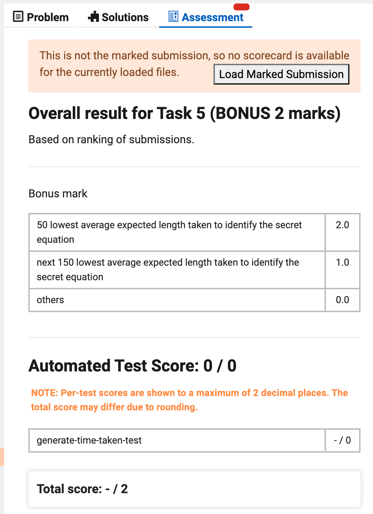

@tab 2

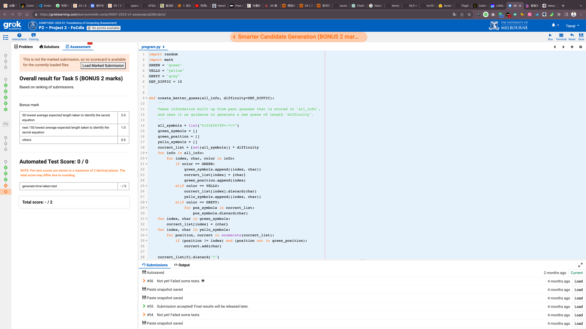

@tab 3

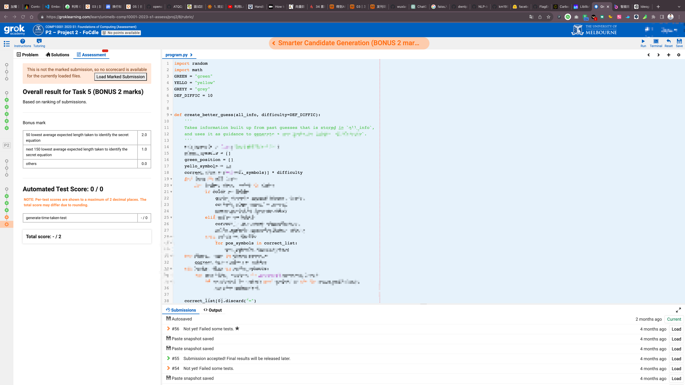

@tab 4

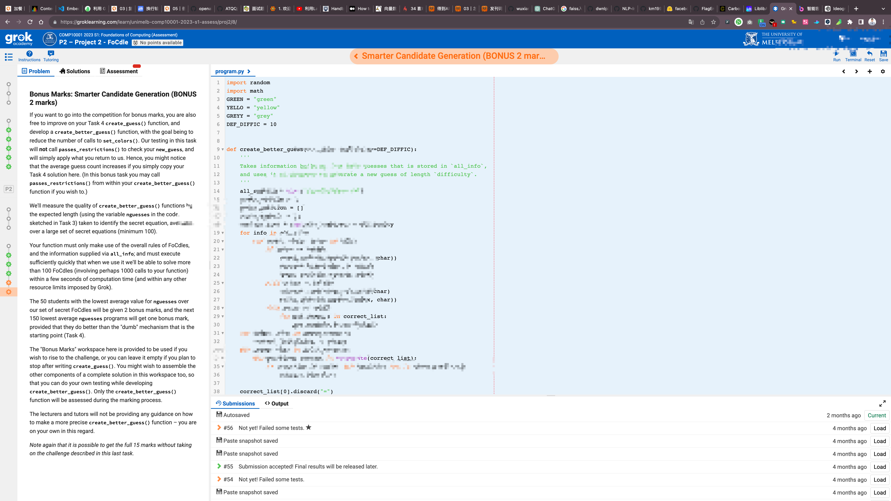

:::


::: details 公众号：AI悦创【二维码】


:::

::: info AI悦创·编程一对一

AI悦创·推出辅导班啦，包括「Python 语言辅导班、C++ 辅导班、java 辅导班、算法/数据结构辅导班、少儿编程、pygame 游戏开发、Web、Linux」，全部都是一对一教学：一对一辅导 + 一对一答疑 + 布置作业 + 项目实践等。当然，还有线下线上摄影课程、Photoshop、Premiere 一对一教学、QQ、微信在线，随时响应！微信：Jiabcdefh

C++ 信息奥赛题解，长期更新！长期招收一对一中小学信息奥赛集训，莆田、厦门地区有机会线下上门，其他地区线上。微信：Jiabcdefh

方法一：[QQ](http://wpa.qq.com/msgrd?v=3&uin=1432803776&site=qq&menu=yes)

方法二：微信：Jiabcdefh

:::


