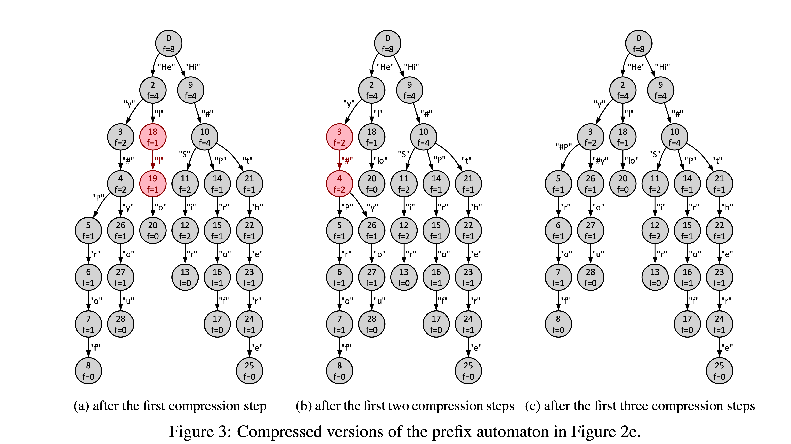

## Learning Outcomes

In this project, you will demonstrate your understanding of dynamic memory and linked data structures (Chapter 10) and extend your program design, testing, and debugging skills. You will learn about the problem of language generation and implement a simple algorithm for generating text based on the context provided by input prompts.

## Background


The recent success of generative tools has spawned many new applica-tions and debates in society. A generative tool is trained on a massive dataset, for example, pictures or texts. Then, given a new input, re-ferred to as a *prompt*, patterns in the prompt get matched to the frequent patterns in the model learned by the tool, and the contextual extensions of the recognized pattern get generated.

Artem and Alistair want to design a tool for generating text state-*ments* from prompts. In the first version of the tool, they decide to learn a *frequency prefix automaton* from training statements. A sam-ple trained automaton is shown in Figure 1. In the automaton, nodes are annotated with unique identifiers and frequencies with which they were observed during training, and arcs are annotated with statement fragments. For instance, the root of the automaton has identifier 0 and a frequency of 8 (f=8). Given a prompt, for example, “Hi”, the tool should identify the context by replaying the prompt starting from the initial node of the automaton, that is, iden-tify that the prompt leads to the node with identifier 9. Then, given the context, the tool should generate the most likely extension of the prompt, that is, the extension that follows the most frequent subsequent nodes. Thus, the tool should generate the statement “`Hi#Sir`” for the example prompt. Your task is to implement this tool.

## Input Data

Your program should read input from stdin and write output to stdout.The input will list *statements*, *in-structions*, and *prompts*, one per input line, each terminating either with “\n”, that is, one newline character, or EOF, that is, the end of file constant defined in the `<stdio.h>` header file. The following file `test0.txt` uses eighteen lines to specify an example input to your program.

```text
1 Hey#Prof 3 Hi#Sir  5 Hello 7 Hi#there 9       11 Hi#T 13 Hel 15 12 17 Hi#t
2 Hi#Sir   4 Hi#Prof 6 Hey   8 Hey#you  10 Hey# 12 Hey  14     16 Hi 18 He
```

The input always starts with statements, each provided as a non-empty sequence of characters. For example, lines 1–8 in the test0.txt file specify eight input statements. If the line that follows the input statements is empty, that is, consists of a single newline character, it is the instruction to proceed to Stage 1 of the program (see line 9 in the example input). Subsequent lines in the input specify prompts, one per line, to be processed in Stage 1 (lines 10–13 in test0.txt). The prompts can be followed by another empty line, which denotes the instruction to proceed to Stage 2 (line 14). The Stage 2 input starts with the instruction to compress input statements, given as a non-negative integer (line 15), followed by prompts to be processed in Stage 2 of the program (lines 16–18). In general, the input can contain an arbitrary number of statements and prompts.

The input will always follow the proposed format. You can make your program robust by handling inputs that deviate from this format. However, such extensions to the program are not expected and will not be tested.

## Stage 0 – Reading, Analyzing, and Printing Input Data (12/20 marks)

The first version of your program should read statements from input, construct their frequency prefix automa- ton, and print basic information about the automaton to the output. The first four lines from the listing below correspond to the output your program should generate for the `test0.txt` input file in Stage 0.

```txt
1 ==STAGE 0============================ 
2 Number of statements: 8
3 Number of characters: 50
4 Number of states: 29
5 ==STAGE 1============================
6 Hey#...you
7 Hi#T...
8 Hey...#you
9 Hel...lo


10 ==STAGE 2============================
11 Number of states: 17
12 Total frequency: 26
13 -------------------------------------
14 Hi...#Sir
15 Hi#t...here
16 He...y#you
17 ==THE END============================
18
```

Line 1 of the output prints the Stage 0 header. Lines 2 and 3 print the total number of statements and the total number of characters in all the statements read from the input, respectively. Finally, line 4 reports the number of nodes, also called *states*, in the frequency prefix automaton constructed from the input statements.

Figure 2e shows the prefix automaton constructed from the eight input statements in test0.txt, whereas Figures 2a to 2d show intermediate automata constructed from subsets of the input statements. Nodes of an automaton are *states*, each with a unique identifier, while arcs encode characters. Note that state identifiers are used for presentation only and do not impact the output your tool should generate. In an automaton, the node without incoming arcs is the initial state, and a node without outgoing arcs is a leaf state. The characters encountered on the arcs traversed on a walk from the initial state to a leaf state (without visiting the same state twice) define a *statement*. The statements defined by an automaton are all and only statements the automaton was constructed from. Note that the automaton in Figure 2e has 29 states reported on line 4 of the output listing.


For example, the automaton in Figure 2a was constructed from the first input statement in test0.txt. In this automaton, the initial state has identifier 0, and the only leaf state has identifier 8. The arcs encountered while walking from state 0 to state 8 define the statement from line 1 of the input. States are annotated with frequencies of traversing, that is, arriving to and departing from, them when performing all the walks that define the statements used to construct the automaton. For instance, all the states of the automaton in Figure 2a except for the leaf state are annotated with the frequency of one (f=1), whereas the leaf state is annotated with the frequency of zero (f=0). Figure 2b, 2c, and 2d show automata constructed from the statements in the first two, four, and six lines in the input, respectively. For any two statements, the resulting automaton reuses the states and arcs that correspond to their longest common prefix (see states 0 and 1 and arc “H” in Figure 2b).

You should not make assumptions about the maximum number of statements and the number of characters in the statements provided as input to your program. Use dynamic memory and data structures of your choice, for example, arrays or linked lists, to process the input and construct the prefix automaton.

## Stage 1 – Process Prompts (16/20 marks)

The output of Stage 1 of your program should start with the header (line 5 in the listing).

Extend your program from Stage 0 to process the Stage 1 prompts; input lines 10–13 in test0.txt. To process a prompt, it is first replayed on the automaton, and then the continuation of the prompts is generated. The replay of a prompt starts in the initial state and follows the arcs that correspond to the characters in the prompt. While following the arcs, the encountered characters should be printed to stdout. If the entire prompt was replayed, print the ellipses (a series of three dots) to denote the start of text generation. To generate text, one proceeds with the walk from the state reached during the replay to a leaf state by selecting the most frequent following states. If, at some encountered state, two or more next states have the same frequency, the one that is reached via the ASCIIbetically greater label on the arc (the label with the first non-matching character greater in ASCII) should be chosen. Again, the characters encountered along the arcs should be printed to stdout.

For instance, the replay of the input prompt on line 10 in test0.txt leads to state 4 in the automaton in Figure 2e; the states and arcs visited along the replay are highlighted in green. The generation phase then continues the walk from state 4 to state 28; see highlighted in blue in the figure. State 26 is chosen to proceed with the walk from state 4 as it is reached via character “y” with the ASCII code of 121, while label “P” that leads from state 4 to state 5 while having the same frequency (f=1) has a smaller ASCII code of 80. The output that results from processing the prompt on line 10 of the input is shown on line 6 of the output listing.

If the automaton does not support a replay of the entire prompt, the output should be terminated once the first non-supported character is encountered. The replayed characters must be appended by the ellipses in the output, and no generation must be performed; see the output on line 7 in the listing for the input prompt on line 11 in test0.txt. Every output triggered by an input prompt, including the replay, ellipses, and the generated characters, should be truncated to 37 characters; see example in the output of the test1.txt input file.

## Stage 2 – Compress Automaton & Process Prompts (20/20 marks)

The output of Stage 2 should start with the header (line 10 in the listing).

Extend your program to compress the automaton obtained in Stage 1 and use the compressed automaton to process the input prompts of Stage 2 (lines 16–18 in test0.txt). The first line of the input of Stage 2 (line 15) specifies the number of compression steps to perform. Each next compression step should be performed on the automaton resulting from all the previous compression steps. A single compression step of an automaton is defined by its arc. To find the arc that defines the next compression step to perform, traverse the automaton states starting from the initial state in the *depth-first order*, prioritizing states reachable via smaller (in ASCII) labels.

The arc between the currently visited state x and the next visited state y in the traversal of the states leads to the next compression step if: (i) x has a single outgoing arc and (ii) y has one or more outgoing arcs. The compression step is performed by first adding a new arc from x to every state reachable from y via an outgoing arc and then deleting y and all arcs that connect to y. The label of an added arc is the concatenation of the labels of the deleted arcs on the walk from the source to the target of this new arc in the original automaton. The automaton in Figure 3a is the result of the first compression step in the automaton in Figure 2e defined by the arc from state 0 to state 1. Figure 3b is the result of compressing the automaton in Figure 3a using the arc between states 18 and 19; highlighted in red in Figure 3a. The depth-first order of the states in the automaton in Figure 3a that starts from the initial state and prioritizes smaller labels is 0, 2, 18, 19, 20, 3, 4, 5, 6, 7, 8, 26, 27, 28, 9, 10, 14, 15, 16, 17, 11, 12, 13, 21, 22, 23, 24, 25, and the arc from state 18 to state 19 is the first arc between two consecutive states in this order that satisfies the compression conditions. The automaton in Figure 3c is obtained by compressing the arc between states 3 and 4 in the automaton in Figure 3b. The automaton in Figure 1 results from 12 requested compression steps in the original automaton constructed in Stage 1 of the program. It allows for one additional compression defined by the arc between states 21 and 24, but it was not requested.

The prompt replay and extension generation in Stage 2 must follow the corresponding principles described in Stage 1 but should be performed on the compressed automaton. The output should report the number of states in the compressed automaton (line 11 in the listing), the sum of frequencies of all the states in the compressed automaton (line 12), and all the generated statements (lines 14–16) after the delimiter line of 37 “-” characters (line 13). Every run of your program should terminate by printing the end message (line 17 in the output listing).

## Pay Attention!

The output your program should generate for the test0.txt input file is provided in the test0-out.txt output file. Two further test inputs and outputs are provided. The outputs generated by your program should be *exactly the same* as the sample outputs for the corresponding inputs. Use malloc and dynamic data structures of your choice to read and store input logs. Before your program terminates, all the malloc’ed memory must be free’d.



## Important...

This project is worth 20% of your final mark, and is due at 6:00pm on Friday 13 October.


::: details 公众号：AI悦创【二维码】


:::

::: info AI悦创·编程一对一

AI悦创·推出辅导班啦，包括「Python 语言辅导班、C++ 辅导班、java 辅导班、算法/数据结构辅导班、少儿编程、pygame 游戏开发、Web、Linux」，全部都是一对一教学：一对一辅导 + 一对一答疑 + 布置作业 + 项目实践等。当然，还有线下线上摄影课程、Photoshop、Premiere 一对一教学、QQ、微信在线，随时响应！微信：Jiabcdefh

C++ 信息奥赛题解，长期更新！长期招收一对一中小学信息奥赛集训，莆田、厦门地区有机会线下上门，其他地区线上。微信：Jiabcdefh

方法一：[QQ](http://wpa.qq.com/msgrd?v=3&uin=1432803776&site=qq&menu=yes)

方法二：微信：Jiabcdefh

:::


