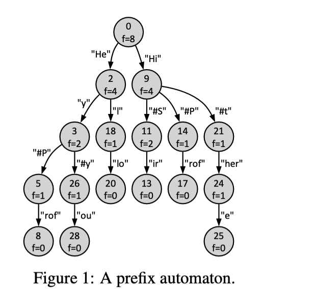
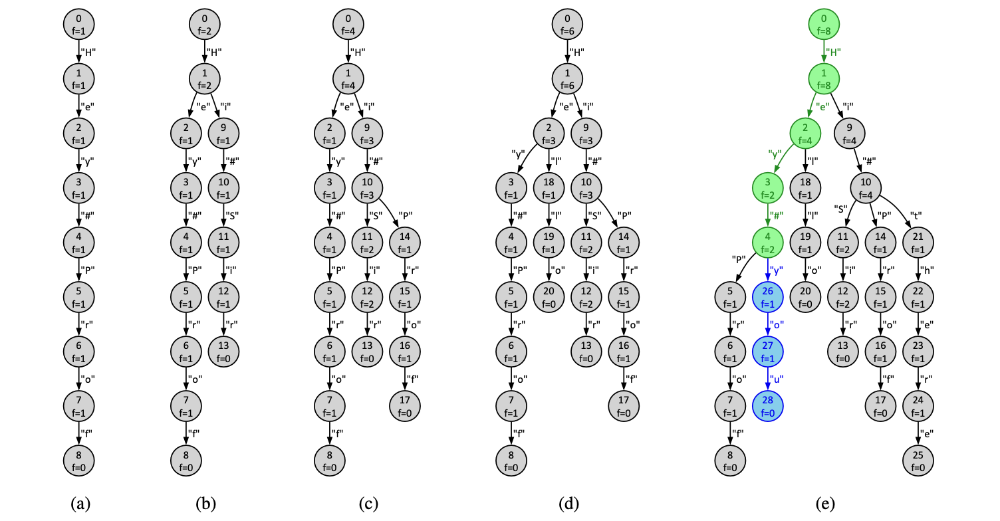

## Learning Outcomes

In this project, you will demonstrate your understanding of dynamic memory and linked data structures (Chapter 10) and extend your program design, testing, and debugging skills. You will learn about the problem of language generation and implement a simple algorithm for generating text based on the context provided by input prompts.

## Background



The recent success of generative tools has spawned many new applica-tions and debates in society. A generative tool is trained on a massive dataset, for example, pictures or texts. Then, given a new input, re-ferred to as a *prompt*, patterns in the prompt get matched to the frequent patterns in the model learned by the tool, and the contextual extensions of the recognized pattern get generated.

Artem and Alistair want to design a tool for generating text state-*ments* from prompts. In the first version of the tool, they decide to learn a *frequency prefix automaton* from training statements. A sam-ple trained automaton is shown in Figure 1. In the automaton, nodes are annotated with unique identifiers and frequencies with which they were observed during training, and arcs are annotated with statement fragments. For instance, the root of the automaton has identifier 0 and a frequency of 8 (f=8). Given a prompt, for example, “Hi”, the tool should identify the context by replaying the prompt starting from the initial node of the automaton, that is, iden-tify that the prompt leads to the node with identifier 9. Then, given the context, the tool should generate the most likely extension of the prompt, that is, the extension that follows the most frequent subsequent nodes. Thus, the tool should generate the statement “`Hi#Sir`” for the example prompt. Your task is to implement this tool.

## Input Data

Your program should read input from stdin and write output to stdout.The input will list *statements*, *in-structions*, and *prompts*, one per input line, each terminating either with “\n”, that is, one newline character, or EOF, that is, the end of file constant defined in the `<stdio.h>` header file. The following file `test0.txt` uses eighteen lines to specify an example input to your program.

```text
1 Hey#Prof 3 Hi#Sir  5 Hello 7 Hi#there 9       11 Hi#T 13 Hel 15 12 17 Hi#t
2 Hi#Sir   4 Hi#Prof 6 Hey   8 Hey#you  10 Hey# 12 Hey  14     16 Hi 18 He
```

The input always starts with statements, each provided as a non-empty sequence of characters. For example, lines 1–8 in the test0.txt file specify eight input statements. If the line that follows the input statements is empty, that is, consists of a single newline character, it is the instruction to proceed to Stage 1 of the program (see line 9 in the example input). Subsequent lines in the input specify prompts, one per line, to be processed in Stage 1 (lines 10–13 in test0.txt). The prompts can be followed by another empty line, which denotes the instruction to proceed to Stage 2 (line 14). The Stage 2 input starts with the instruction to compress input statements, given as a non-negative integer (line 15), followed by prompts to be processed in Stage 2 of the program (lines 16–18). In general, the input can contain an arbitrary number of statements and prompts.

The input will always follow the proposed format. You can make your program robust by handling inputs that deviate from this format. However, such extensions to the program are not expected and will not be tested.

::: details

## 学习成果

在这个项目中，你将展示你对动态内存和链式数据结构（第10章）的理解，并拓展你的程序设计、测试和调试技能。你将了解到关于语言生成的问题，并实现一个基于输入提示提供的上下文来生成文本的简单算法。

## 背景


生成工具的最近成功催生了社会上许多新的应用和争论。生成工具是在一个巨大的数据集上进行训练的，例如图片或文本。然后，给定一个新的输入，被称为*提示*，该提示中的模式将与工具学到的模型中的频繁模式相匹配，然后生成被识别模式的上下文扩展。

Artem 和 Alistair 想要设计一个从提示中生成文本*声明*的工具。在工具的第一个版本中，他们决定从训练声明中学习一个*频率前缀自动机*。图1中显示了一个经过训练的自动机示例。在自动机中，节点带有在训练期间观察到的唯一标识符和频率，而弧线带有声明片段。例如，自动机的根有标识符0和频率8 (f=8)。给定一个提示，例如“Hi”，工具应该从自动机的初始节点开始重放提示以确定上下文，即确定该提示会导向标识符为9的节点。然后，给定上下文，工具应该生成提示的最有可能的扩展，即跟随最频繁的后续节点的扩展。因此，对于示例提示，工具应该生成声明“`Hi#Sir`”。你的任务是实现这个工具。

## 输入数据

你的程序应该从stdin读取输入并将输出写入stdout。输入会列出*声明*、*指令*和*提示*，每行输入一个，每个输入都以“\n”结束，即一个换行字符，或EOF，即在`<stdio.h>`头文件中定义的文件结束常量。以下文件`test0.txt`使用十八行来指定给你的程序的一个示例输入。

```text
1 Hey#Prof 3 Hi#Sir  5 Hello 7 Hi#there 9       11 Hi#T 13 Hel 15 12 17 Hi#t
2 Hi#Sir   4 Hi#Prof 6 Hey   8 Hey#you  10 Hey# 12 Hey  14     16 Hi 18 He
```

输入总是从声明开始，每个声明都提供为一个非空字符序列。例如，test0.txt文件中的1-8行指定了八个输入声明。如果跟随输入声明的行为空，即只包含一个换行字符，则该行是进入程序的第一阶段的指令（参见示例输入中的第9行）。输入中的后续行每行指定一个在第一阶段处理的提示（test0.txt中的10-13行）。提示后面可以跟着另一个空行，该空行表示进入第二阶段的指令（第14行）。第二阶段的输入从压缩输入声明的指令开始，该指令给出为一个非负整数（第15行），后面跟着在程序的第二阶段处理的提示（16-18行）。总的来说，输入可以包含任意数量的声明和提示。

输入总是按照建议的格式进行。你可以通过处理偏离此格式的输入来使你的程序变得健壮。然而，程序的这些扩展不是预期的，也不会被测试。

:::

## Stage 0 – Reading, Analyzing, and Printing Input Data (12/20 marks)

The first version of your program should read statements from input, construct their frequency prefix automa- ton, and print basic information about the automaton to the output. The first four lines from the listing below correspond to the output your program should generate for the `test0.txt` input file in Stage 0.

```txt
1 ==STAGE 0============================ 
2 Number of statements: 8
3 Number of characters: 50
4 Number of states: 29
5 ==STAGE 1============================
6 Hey#...you
7 Hi#T...
8 Hey...#you
9 Hel...lo


10 ==STAGE 2============================
11 Number of states: 17
12 Total frequency: 26
13 -------------------------------------
14 Hi...#Sir
15 Hi#t...here
16 He...y#you
17 ==THE END============================
18
```

Line 1 of the output prints the Stage 0 header. Lines 2 and 3 print the total number of statements and the total number of characters in all the statements read from the input, respectively. Finally, line 4 reports the number of nodes, also called *states*, in the frequency prefix automaton constructed from the input statements.

Figure 2e shows the prefix automaton constructed from the eight input statements in test0.txt, whereas Figures 2a to 2d show intermediate automata constructed from subsets of the input statements. Nodes of an automaton are *states*, each with a unique identifier, while arcs encode characters. Note that state identifiers are used for presentation only and do not impact the output your tool should generate. In an automaton, the node without incoming arcs is the initial state, and a node without outgoing arcs is a leaf state. The characters encountered on the arcs traversed on a walk from the initial state to a leaf state (without visiting the same state twice) define a *statement*. The statements defined by an automaton are all and only statements the automaton was constructed from. Note that the automaton in Figure 2e has 29 states reported on line 4 of the output listing.




For example, the automaton in Figure 2a was constructed from the first input statement in test0.txt. In this automaton, the initial state has identifier 0, and the only leaf state has identifier 8. The arcs encountered while walking from state 0 to state 8 define the statement from line 1 of the input. States are annotated with frequencies of traversing, that is, arriving to and departing from, them when performing all the walks that define the statements used to construct the automaton. For instance, all the states of the automaton in Figure 2a except for the leaf state are annotated with the frequency of one (f=1), whereas the leaf state is annotated with the frequency of zero (f=0). Figure 2b, 2c, and 2d show automata constructed from the statements in the first two, four, and six lines in the input, respectively. For any two statements, the resulting automaton reuses the states and arcs that correspond to their longest common prefix (see states 0 and 1 and arc “H” in Figure 2b).

You should not make assumptions about the maximum number of statements and the number of characters in the statements provided as input to your program. Use dynamic memory and data structures of your choice, for example, arrays or linked lists, to process the input and construct the prefix automaton.

::: details

以下是对给定段落的中文翻译：

## 第0阶段 - 读取、分析和打印输入数据 (12/20 分)

你的程序的第一个版本应该从输入中读取声明，构建它们的频率前缀自动机，并将关于自动机的基本信息打印到输出。以下列表的前四行对应于你的程序在第0阶段为`test0.txt`输入文件应生成的输出。

```txt
1 ==STAGE 0============================ 
2 语句数量：8
3 字符数量：50
4 状态数量：29
5 ==STAGE 1============================
6 Hey#...you
7 Hi#T...
8 Hey...#you
9 Hel...lo

10 ==STAGE 2============================
11 状态数量：17
12 总频率：26
13 -------------------------------------
14 Hi...#Sir
15 Hi#t...here
16 He...y#you
17 ==结束==============================
18
```

输出的第1行打印第0阶段的标题。第2和第3行分别打印从输入中读取的所有语句中的语句总数和字符总数。最后，第4行报告从输入声明构建的频率前缀自动机中的节点数，也称为*状态*。

图2e显示了从test0.txt中的八个输入声明构建的前缀自动机，而图2a至2d显示了从输入声明的子集构建的中间自动机。自动机的节点是*状态*，每个都有一个唯一的标识符，而弧线则编码字符。请注意，状态标识符仅用于表示，不影响你的工具应生成的输出。在自动机中，没有输入弧的节点是初始状态，而没有输出弧的节点是叶状态。从初始状态到叶状态的遍历中遇到的弧上的字符（没有访问同一个状态两次）定义了一个*声明*。自动机定义的声明都是且仅是用来构建自动机的声明。注意，图2e中的自动机有29个状态，这些状态在输出列表的第4行上报告。


例如，图2a中的自动机是从test0.txt中的第一个输入声明构建的。在这个自动机中，初始状态的标识符为0，唯一的叶状态的标识符为8。从状态0走到状态8时遇到的弧线定义了输入的第1行的声明。状态用遍历的频率注释，即当执行定义用于构建自动机的声明的所有遍历时，到达和离开它们。例如，图2a中的自动机中的所有状态（除了叶状态）都用频率一 (f=1) 注释，而叶状态用频率零 (f=0) 注释。图2b、2c和2d分别显示了从输入的前两行、四行和六行中的声明构建的自动机。对于任意两个声明，结果自动机重用与它们的最长公共前缀相对应的状态和弧（参见图2b中的状态0和1以及弧“H”）。

你不应该对作为输入提供给你的程序的声明的最大数量和声明中的字符数量做出假设。使用动态内存和你选择的数据结构，例如数组或链表，来处理输入并构建前缀自动机。

:::

## Solution 0

::: code-tabs

```c
#include <stdio.h>
#include <stdlib.h>
#include <assert.h>
#include <string.h>

/* #DEFINE'S -----------------------------------------------------------------*/
#define SDELIM "==STAGE %d============================\n"   // stage delimiter
#define MDELIM "-------------------------------------\n"    // delimiter of -'s
#define THEEND "==THE END============================\n"    // end message
#define NOSFMT "Number of statements: %d\n"                 // no. of statements
#define NOCFMT "Number of characters: %d\n"                 // no. of chars
#define NPSFMT "Number of states: %d\n"                     // no. of states
#define TFQFMT "Total frequency: %d\n"                      // total frequency

#define CRTRNC '\r'                             // carriage return character

/* TYPE DEFINITIONS ----------------------------------------------------------*/
typedef struct state state_t;   // a state in an automaton
typedef struct node  node_t;    // a node in a linked list

struct node {                   // a node in a linked list of transitions has
    char*           str;        // ... a transition string
    state_t*        state;      // ... the state reached via the string, and
    node_t*         next;       // ... a link to the next node in the list.
};

typedef struct {                // a linked list consists of
    node_t*         head;       // ... a pointer to the first node and
    node_t*         tail;       // ... a pointer to the last node in the list.
} list_t;

struct state {                  // a state in an automaton is characterized by
    unsigned int    id;         // ... an identifier,
    unsigned int    freq;       // ... frequency of traversal,
    int             visited;    // ... visited status flag, and
    list_t*         outputs;    // ... a list of output states.
};
typedef struct {                // an automaton consists of
    state_t*        ini;        // ... the initial state, and
    unsigned int    nid;        // ... the identifier of the next new state.
} automaton_t;
/* TYPE DEFINITIONS ----------------------------------------------------------*/
typedef struct TrieNode {
    int freq;
    struct TrieNode* children[128];
} TrieNode;

/* GLOBAL VARIABLES ----------------------------------------------------------*/
TrieNode* root = NULL;
int num_states = 0;
int total_characters = 0;

/* FUNCTION PROTOTYPES -------------------------------------------------------*/
int mygetchar(void);

TrieNode* createTrieNode(void);
void insert(TrieNode* root, const char* word);
void freeTrie(TrieNode* node);
int isNewState(TrieNode* node, const char* word);

/* MAIN FUNCTION -------------------------------------------------------------*/
int main(int argc, char *argv[]) {
    // Message from Artem: The proposed in this skeleton file #define's,
    // typedef's, and struct's are the subsets of those from my sample solution
    // to this assignment. You can decide to use them in your program, or if
    // you find them confusing, you can remove them and implement your solution
    // from scratch. I will share my sample solution with you at the end of
    // the subject.
    char input[100];
    int num_statements = 0;
    root = createTrieNode();

    // Read each line (statement) from stdin
    while(fgets(input, sizeof(input), stdin) && input[0] != '\n') {
        num_statements++;
        total_characters += strlen(input) - 1;  // -1 to exclude the newline character
        insert(root, input);
    }

    printf(SDELIM, 0);
    printf(NOSFMT, num_statements);
    printf(NOCFMT, total_characters);
    printf(NPSFMT, num_states);

    freeTrie(root);
    return EXIT_SUCCESS;        // algorithms are fun!!!
}

/* FUNCTION IMPLEMENTATIONS --------------------------------------------------*/
// An improved version of getchar(); skips carriage return characters.
// NB: Adapted version of the mygetchar() function by Alistair Moffat
int mygetchar() {
    int c;
    while ((c=getchar())==CRTRNC);
    return c;
}

TrieNode* createTrieNode(void) {
    TrieNode* newNode = (TrieNode*)malloc(sizeof(TrieNode));
    newNode->freq = 0;
    for (int i = 0; i < 128; i++) {
        newNode->children[i] = NULL;
    }
    num_states++;
    return newNode;
}

void insert(TrieNode* root, const char* word) {
    TrieNode* node = root;
    while (*word) {
        char c = *word++;
        if (node->children[c] == NULL) {
            if (isNewState(node, word)) {
                node->children[c] = createTrieNode();
            } else {
                break;
            }
        }
        node = node->children[c];
        node->freq++;
    }
}

int isNewState(TrieNode* node, const char* word) {
    while (*word && node->children[*word]) {
        node = node->children[*word++];
    }
    return *word == '\0' ? 0 : 1;
}

void freeTrie(TrieNode* node) {
    if (!node) return;
    for (int i = 0; i < 128; i++) {
        if (node->children[i]) {
            freeTrie(node->children[i]);
        }
    }
    free(node);
}

/* THE END -------------------------------------------------------------------*/
```

@tab 注释

```c
#include <stdio.h>
#include <stdlib.h>
#include <assert.h>
#include <string.h>

/* #DEFINE'S -----------------------------------------------------------------*/
// 以下是预定义的输出格式字符串
#define SDELIM "==STAGE %d============================\n"
#define NOSFMT "Number of statements: %d\n"
#define NOCFMT "Number of characters: %d\n"
#define NPSFMT "Number of states: %d\n"

#define CRTRNC '\r' // 换行字符

/* TYPE DEFINITIONS ----------------------------------------------------------*/
// 定义前缀树节点
typedef struct TrieNode {
    int freq;  // 频率
    struct TrieNode* children[128]; // 子节点，每个字符一个
} TrieNode;

/* GLOBAL VARIABLES ----------------------------------------------------------*/
// 全局变量
TrieNode* root = NULL; // 根节点
int num_states = 0;    // 状态数
int total_characters = 0; // 字符总数

/* FUNCTION PROTOTYPES -------------------------------------------------------*/
// 函数原型
int mygetchar(void);
TrieNode* createTrieNode(void);
void insert(TrieNode* root, const char* word);
void freeTrie(TrieNode* node);
int isNewState(TrieNode* node, const char* word);

/* MAIN FUNCTION -------------------------------------------------------------*/
int main(int argc, char *argv[]) {
    char input[100];  // 输入缓冲区
    int num_statements = 0; // 语句数
    root = createTrieNode(); // 创建根节点

    // 从stdin读取每一行（语句）
    while(fgets(input, sizeof(input), stdin) && input[0] != '\n') {
        num_statements++;
        total_characters += strlen(input) - 1;  // 减去换行字符
        insert(root, input); // 插入语句到trie
    }

    // 打印输出
    printf(SDELIM, 0);
    printf(NOSFMT, num_statements);
    printf(NOCFMT, total_characters);
    printf(NPSFMT, num_states);

    freeTrie(root);  // 释放trie
    return EXIT_SUCCESS;
}

/* FUNCTION IMPLEMENTATIONS --------------------------------------------------*/
// 跳过换行符的getchar()
int mygetchar() {
    int c;
    while ((c=getchar())==CRTRNC);
    return c;
}

// 创建新的trie节点
TrieNode* createTrieNode(void) {
    TrieNode* newNode = (TrieNode*)malloc(sizeof(TrieNode));
    newNode->freq = 0;
    for (int i = 0; i < 128; i++) {
        newNode->children[i] = NULL;
    }
    num_states++; // 增加状态数
    return newNode;
}

// 将单词插入到trie中
void insert(TrieNode* root, const char* word) {
    TrieNode* node = root;
    while (*word) {
        char c = *word++;
        if (node->children[c] == NULL) {
            if (isNewState(node, word)) {
                node->children[c] = createTrieNode(); // 创建新状态
            } else {
                break; // 不创建新状态
            }
        }
        node = node->children[c];
        node->freq++;
    }
}

// 检查是否为新状态
int isNewState(TrieNode* node, const char* word) {
    while (*word && node->children[*word]) {
        node = node->children[*word++];
    }
    return *word == '\0' ? 0 : 1;
}

// 释放trie的内存
void freeTrie(TrieNode* node) {
    if (!node) return;
    for (int i = 0; i < 128; i++) {
        if (node->children[i]) {
            freeTrie(node->children[i]);
        }
    }
    free(node);
}

/* THE END -------------------------------------------------------------------*/
```

@tab 注释2

```c
#include <stdio.h>
#include <stdlib.h>
#include <assert.h>
#include <string.h>

/* #DEFINE'S -----------------------------------------------------------------*/

// 定义一些常用的格式化字符串
#define SDELIM "==STAGE %d============================\n"
#define NOSFMT "Number of statements: %d\n"
#define NOCFMT "Number of characters: %d\n"
#define NPSFMT "Number of states: %d\n"
#define CRTRNC '\r'  // 换行符的ASCII码

/* TYPE DEFINITIONS ----------------------------------------------------------*/

// 定义前缀树的节点结构
typedef struct TrieNode {
    int freq; // 该节点的频率，即有多少字符串经过该节点
    struct TrieNode* children[128]; // 孩子节点数组，ASCII字符为索引
} TrieNode;

/* GLOBAL VARIABLES ----------------------------------------------------------*/

// 前缀树的根节点
TrieNode* root = NULL;
int num_states = 0; // 总的状态数
int total_characters = 0; // 输入字符串中的字符总数

/* FUNCTION PROTOTYPES -------------------------------------------------------*/

// 函数原型声明
int mygetchar(void);
TrieNode* createTrieNode(void);
void insert(TrieNode* root, const char* word);
void freeTrie(TrieNode* node);
int isNewState(TrieNode* node, const char* word);

/* MAIN FUNCTION -------------------------------------------------------------*/
int main(int argc, char *argv[]) {
    char input[100]; // 存储从stdin读取的输入
    int num_statements = 0;
    root = createTrieNode();  // 初始化前缀树的根节点

    // 从stdin读取每一行（语句）
    while(fgets(input, sizeof(input), stdin) && input[0] != '\n') {
        num_statements++;
        total_characters += strlen(input) - 1;  // 不计入换行符
        insert(root, input); // 将语句插入前缀树
    }

    // 打印输出
    printf(SDELIM, 0);
    printf(NOSFMT, num_statements);
    printf(NOCFMT, total_characters);
    printf(NPSFMT, num_states);

    freeTrie(root); // 释放前缀树的内存
    return EXIT_SUCCESS;
}

/* FUNCTION IMPLEMENTATIONS --------------------------------------------------*/

// 改进版的getchar()，跳过换行字符
int mygetchar() {
    int c;
    while ((c=getchar())==CRTRNC);
    return c;
}

// 创建一个新的前缀树节点
TrieNode* createTrieNode(void) {
    TrieNode* newNode = (TrieNode*)malloc(sizeof(TrieNode));
    newNode->freq = 0;
    for (int i = 0; i < 128; i++) {
        newNode->children[i] = NULL;
    }
    num_states++;  // 新状态增加
    return newNode;
}

// 将一个词插入前缀树
void insert(TrieNode* root, const char* word) {
    TrieNode* node = root;
    while (*word) {
        char c = *word++;
        if (node->children[c] == NULL) {
            if (isNewState(node, word)) {
                node->children[c] = createTrieNode();
            } else {
                break;
            }
        }
        node = node->children[c];
        node->freq++;
    }
}

// 检查给定前缀是否代表一个新的状态
int isNewState(TrieNode* node, const char* word) {
    while (*word && node->children[*word]) {
        node = node->children[*word++];
    }
    return *word == '\0' ? 0 : 1;
}

// 递归释放前缀树的内存
void freeTrie(TrieNode* node) {
    if (!node) return;
    for (int i = 0; i < 128; i++) {
        if (node->children[i]) {
            freeTrie(node->children[i]);
        }
    }
    free(node);
}

/* THE END -------------------------------------------------------------------*/
```

:::

## Stage 1 – Process Prompts (16/20 marks)

The output of Stage 1 of your program should start with the header (line 5 in the listing).

Extend your program from Stage 0 to process the Stage 1 prompts; input lines 10–13 in test0.txt. To process a prompt, it is first replayed on the automaton, and then the continuation of the prompts is generated. The replay of a prompt starts in the initial state and follows the arcs that correspond to the characters in the prompt. While following the arcs, the encountered characters should be printed to stdout. If the entire prompt was replayed, print the ellipses (a series of three dots) to denote the start of text generation. To generate text, one proceeds with the walk from the state reached during the replay to a leaf state by selecting the most frequent following states. If, at some encountered state, two or more next states have the same frequency, the one that is reached via the ASCIIbetically greater label on the arc (the label with the first non-matching character greater in ASCII) should be chosen. Again, the characters encountered along the arcs should be printed to stdout.

For instance, the replay of the input prompt on line 10 in test0.txt leads to state 4 in the automaton in Figure 2e; the states and arcs visited along the replay are highlighted in green. The generation phase then continues the walk from state 4 to state 28; see highlighted in blue in the figure. State 26 is chosen to proceed with the walk from state 4 as it is reached via character “y” with the ASCII code of 121, while label “P” that leads from state 4 to state 5 while having the same frequency (f=1) has a smaller ASCII code of 80. The output that results from processing the prompt on line 10 of the input is shown on line 6 of the output listing.

If the automaton does not support a replay of the entire prompt, the output should be terminated once the first non-supported character is encountered. The replayed characters must be appended by the ellipses in the output, and no generation must be performed; see the output on line 7 in the listing for the input prompt on line 11 in test0.txt. Every output triggered by an input prompt, including the replay, ellipses, and the generated characters, should be truncated to 37 characters; see example in the output of the test1.txt input file.


::: details 公众号：AI悦创【二维码】


:::

::: info AI悦创·编程一对一

AI悦创·推出辅导班啦，包括「Python 语言辅导班、C++ 辅导班、java 辅导班、算法/数据结构辅导班、少儿编程、pygame 游戏开发、Web、Linux」，全部都是一对一教学：一对一辅导 + 一对一答疑 + 布置作业 + 项目实践等。当然，还有线下线上摄影课程、Photoshop、Premiere 一对一教学、QQ、微信在线，随时响应！微信：Jiabcdefh

C++ 信息奥赛题解，长期更新！长期招收一对一中小学信息奥赛集训，莆田、厦门地区有机会线下上门，其他地区线上。微信：Jiabcdefh

方法一：[QQ](http://wpa.qq.com/msgrd?v=3&uin=1432803776&site=qq&menu=yes)

方法二：微信：Jiabcdefh

:::


