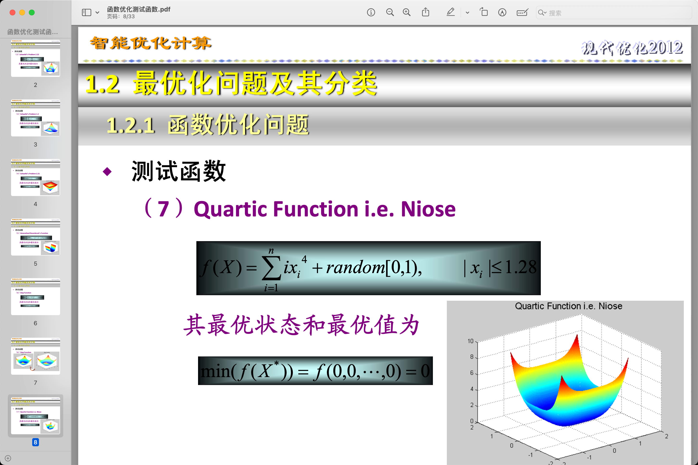
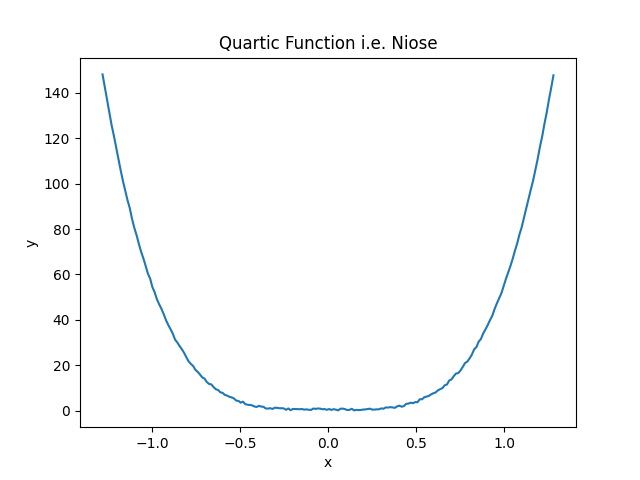
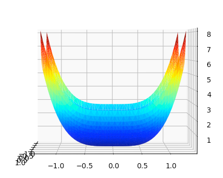
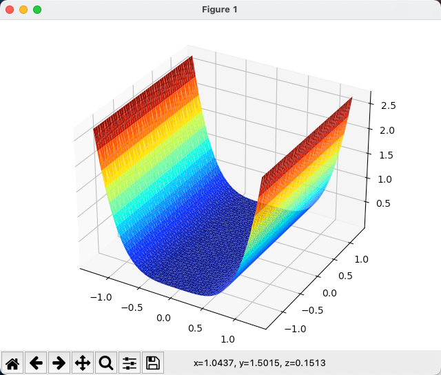
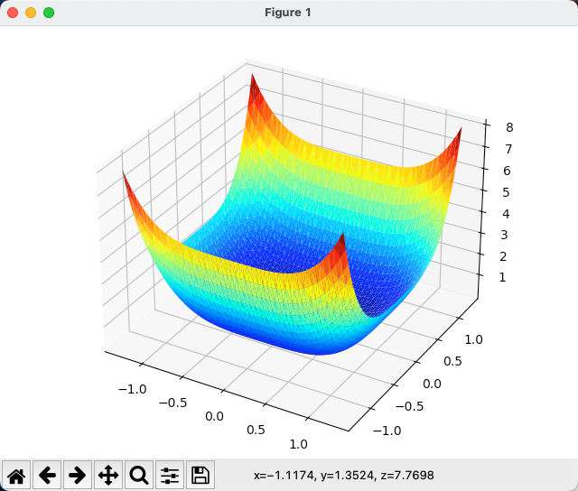

你好，我是悦创。

这篇我将带你解决，公式与函数之间的实现方法：



$$\sum_{i=1}^{n} ix^{4}_{i} + random[0, 1), |x_{i}\le 1.28|$$

## 0. 前置知识

### 0.1np.linspace()

NumPy 的 linspace() 函数是用来生成一个等间隔的一维数组的函数。它的语法如下：

```python
numpy.linspace(start, stop, num=50, endpoint=True, retstep=False, dtype=None, axis=0)
```

参数说明：

- start：序列的起始值。
- stop：序列的结束值。
- num：<span style="color:orange">**生成的等间隔样本数量，默认为 50。**</span>
- endpoint：序列中是否包含 stop 值，默认为 True，即包含 stop 值。
- retstep：是否返回序列的步长，默认为 False，不返回。
- dtype：输出数组的数据类型。
- axis：返回值的数组中新轴的索引。

`linspace()` 函数将指定的起始值和结束值之间的范围等分为 num 个样本，并返回一个包含这些样本的一维数组。如果 endpoint 参数设置为 False，则序列中不包含结束值。

下面是一些示例：

```python
np.linspace(1, 6, 6)
array([1., 2., 3., 4., 5., 6.])
```


## 1. Python 实现函数绘图

### 1. 一次函数 `y = 2x + 1`

```python
# -*- coding: utf-8 -*-
# @Time    : 2023/3/12 19:11
# @Author  : AI悦创
# @FileName: First_order_function.py
# @Software: PyCharm
# @Blog    ：https://bornforthis.cn/
import numpy as np
import matplotlib.pyplot as plt


# 定义一次函数
def f(x):
    return 2 * x + 1


# 生成 x 值的序列
x = np.linspace(-5, 5, 100)

# 计算对应的 y 值的序列
y = f(x)

# 绘制图形
plt.plot(x, y)
plt.xlabel('x')
plt.ylabel('y')
plt.title('y = 2x + 1')
plt.grid(True)
plt.show()
```

## 2. 正式开始解题

### 2.1 绘制二维图像

首先我们可以根据题目给的噪声四次方函数，绘制其二维图像。

```python
import numpy as np
import matplotlib.pyplot as plt
# 首先绘制该图像的二维图像， 以便于对比
def func(x):
    n = 10
    return sum([i * (x**4) for i in range(1, n+1)]) + np.random.rand() # 根据测试函数，完成对于函数的二维图像绘制

# n = 10
# 为什么是 1.28 ？:>>>题目给出的 x 的范围
x = np.linspace(-1.28, 1.28, 200)
y = [func(xi) for xi in x]

plt.plot(x, y)
plt.xlabel('x')
plt.ylabel('y')
plt.title('Quartic Function i.e. Niose')
plt.show()
```



`np.random.rand()` 是 NumPy 库中的一个函数，用于生成在 `[0, 1)` 区间内的随机浮点数。当调用此函数时，它将返回一个服从均匀分布的随机数。

以下是 `np.random.rand()` 函数的一些示例：

```python
import numpy as np

random_number = np.random.rand()  # 生成一个在 [0, 1) 之间的随机浮点数
print(random_number)

random_array = np.random.rand(5)  # 生成一个包含 5 个在 [0, 1) 之间的随机浮点数的一维数组
print(random_array)

random_matrix = np.random.rand(3, 4)  # 生成一个 3x4 的二维数组，其中的元素是 [0, 1) 之间的随机浮点数
print(random_matrix)
```

在给定代码中，`np.random.rand()` 用于给多项式函数的计算结果添加随机噪声。这样，生成的图像将包含一些随机性，使其看起来更像现实世界中的数据。

**即三维图像的二维平面：**



根据此二维图像我们可以将其拓展为，三维图像，三维图像涉及到个点 z 轴的高度。

当我们默认其维度为 1 时，可以得出二维图像平移拉伸后的三维图像：



该图像与我们题目所给出的最终图像不符合，z 轴明显缺少一定的弧度。因此我们对其进行优化。

此时我们可以发现题目本身带有条件 ：

函数的最优状态和最优值为：

`f(0,0,....,0) = 0`

因此我们尝试将代码中的维度 n 扩大为 3.并绘制图像。



```python
import numpy as np
import matplotlib.pyplot as plt
from mpl_toolkits.mplot3d import Axes3D
from matplotlib.tri import Triangulation

# 定义测试函数
def test_func(x, n):
    """
输入x、y坐标和维度数n，计算对应点的高度值
"""
    return sum([i * (x[i-1]**4) for i in range(1, n+1)])
# 定义曲面函数
def surface_func(x, y, n):
    return test_func([x, y] + [0]*(n-2), n) + 0  # 将np.random.rand()改为0

n = 3  # 定义维度数
x = np.linspace(-1.28, 1.28, 50) # 定义x、y坐标的范围
y = np.linspace(-1.28, 1.28, 50)
X, Y = np.meshgrid(x, y) # 生成网格数据
Z = np.zeros_like(X) # 生成与X、Y同形状的全0数组，用于存放高度值

for i in range(len(x)): #遍历坐标轴x，y上的每个点
    for j in range(len(y)):
        # 计算每个点的高度值
        Z[j][i] = surface_func(x[i], y[j], n)
# 绘制3D曲面图
tri = Triangulation(X.flatten(), Y.flatten())
# 生成三角形网格
fig = plt.figure()
ax = fig.add_axes([0, 0, 1, 1], projection='3d', auto_add_to_figure=False)
# 创建3D图形，并手动将Axes对象添加到图形中
fig.add_axes(ax)
ax.plot_trisurf(tri, Z.flatten(), cmap='jet', linewidth=0, antialiased=True, shade=False)# 绘制三维曲面
plt.show()# 显示图像
```


## 补充代码

```python
# 导入必要的库
import numpy as np
import matplotlib.pyplot as plt
from mpl_toolkits.mplot3d import Axes3D


# 定义函数，接受 x 和 y 作为输入参数，返回带有随机噪声的值
def func(x, y):
    n = 10
    return sum([i * (x ** 4) for i in range(1, n + 1)]) + y + np.random.rand()


# 生成数据点
x = np.linspace(-1.28, 1.28, 200)  # 在 -1.28 和 1.28 之间均匀分布的 200 个点
y = np.linspace(-1.28, 1.28, 200)  # 在 -1.28 和 1.28 之间均匀分布的 200 个点
x, y = np.meshgrid(x, y)  # 生成 x 和 y 的网格，以便计算每个 (x, y) 点的 z 值
z = func(x, y)  # # 使用 func 函数计算 z 值

# 绘制二维图像
plt.figure()  # 创建一个新的图形
plt.plot(x.flatten(), z.flatten())  # 使用x和z值绘制二维图像
plt.xlabel('x')  # 设置x轴标签
plt.ylabel('z')  # 设置y轴标签
plt.title('Quartic Function i.e. Noise (2D)')  # 设置图像标题
plt.show()  # 显示图像

# 绘制三维图像
fig = plt.figure()  # 创建一个新的图形
ax = fig.add_subplot(111, projection='3d')  # 添加一个3D子图
ax.plot_surface(x, y, z, cmap='viridis')  # 使用x, y和z值绘制3D曲面图
ax.set_xlabel('x')  # 设置x轴标签
ax.set_ylabel('y')  # 设置y轴标签
ax.set_zlabel('z')  # 设置z轴标签
ax.set_title('Quartic Function i.e. Noise (3D)')  # 设置图像标题
plt.show()  # 显示图像
```


::: details 公众号：AI悦创【二维码】


:::

::: info AI悦创·编程一对一

AI悦创·推出辅导班啦，包括「Python 语言辅导班、C++ 辅导班、java 辅导班、算法/数据结构辅导班、少儿编程、pygame 游戏开发、Web、Linux」，全部都是一对一教学：一对一辅导 + 一对一答疑 + 布置作业 + 项目实践等。当然，还有线下线上摄影课程、Photoshop、Premiere 一对一教学、QQ、微信在线，随时响应！微信：Jiabcdefh

C++ 信息奥赛题解，长期更新！长期招收一对一中小学信息奥赛集训，莆田、厦门地区有机会线下上门，其他地区线上。微信：Jiabcdefh

方法一：[QQ](http://wpa.qq.com/msgrd?v=3&uin=1432803776&site=qq&menu=yes)

方法二：微信：Jiabcdefh

:::


