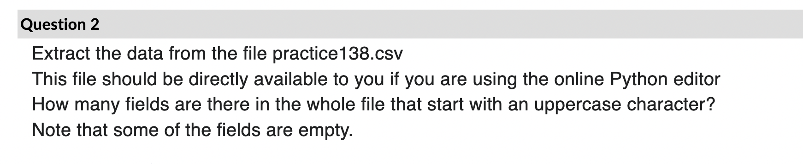
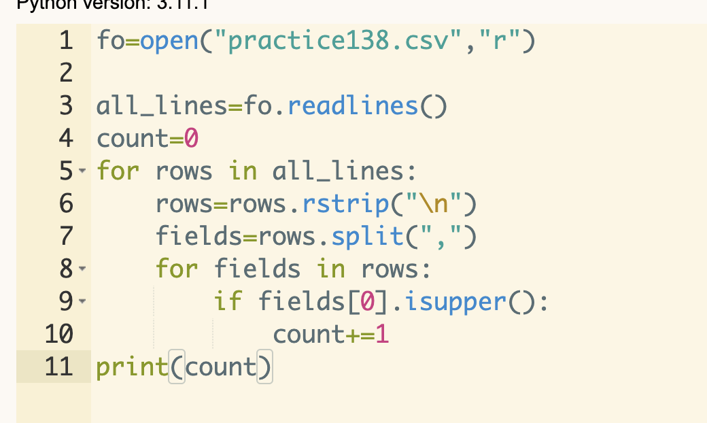
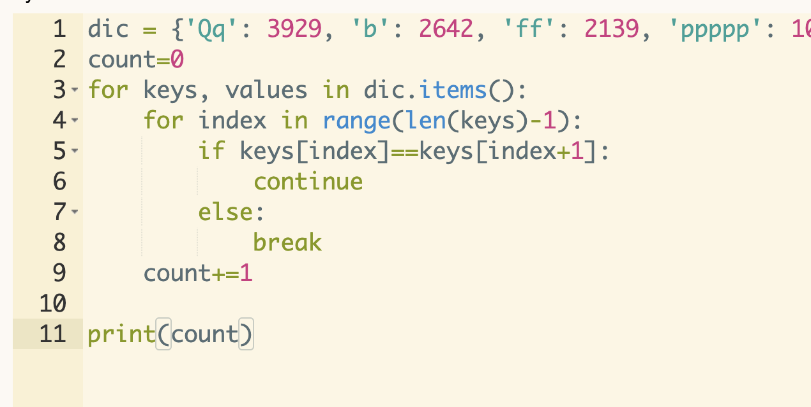
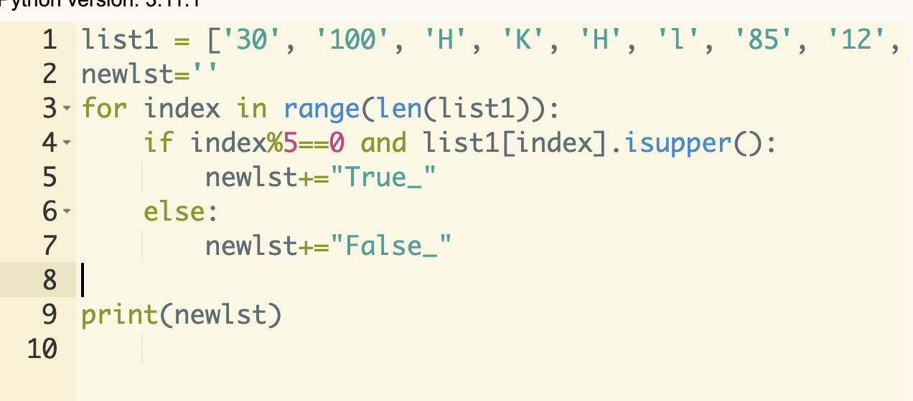
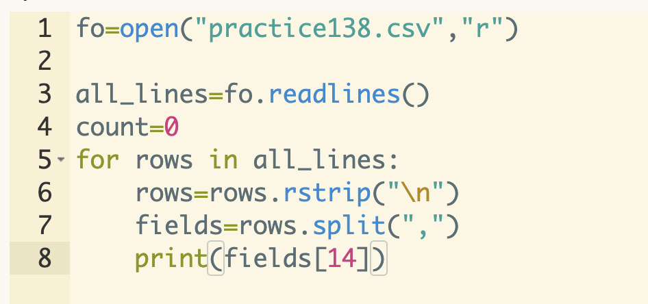
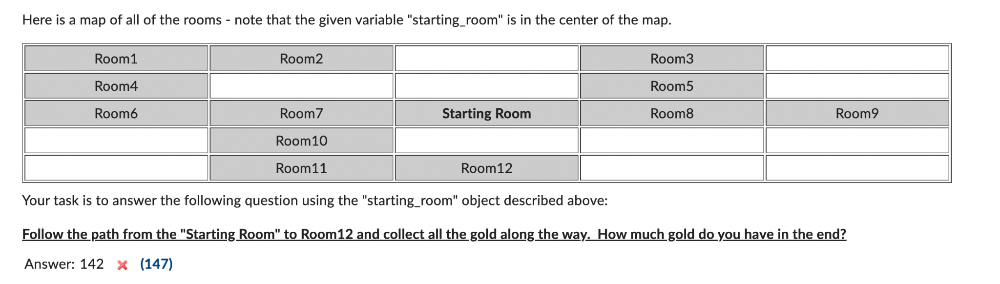

- [http://prager.hosting.nyu.edu/#](http://prager.hosting.nyu.edu/#)

## Question 1

::: tabs

@tab 图片1



@tab 图片2



@tab Answer

```python
f = open("practice138.csv", "r")
lines = f.readlines()
count = 0
for line in lines:
    contents = line.rstrip("\n").split(",")
    for con in contents:
        # print(con)
        if len(con) < 1:
            continue
        if con[0].isupper():
            count += 1
f.close()
print(count)
```


:::

Extract the data from the file `practice138.csv`

> 提取文件 practice 138.csv 中的数据。

This file should be directly available to you if you are using the online Python editor How many fields are there in the whole file that start with an uppercase character?

> 如果您使用在线 Python 编辑器，这个文件应该直接对您可用。整个文件中有多少个以大写字母开头的字段？

Note that some of the fields are empty.

> 请注意，有些字段是空的。


## Question 2

::: tabs

@tab 图片



```python
count = 0
for key, values in dic.items():
    for index in range(len(key) - 1):
        if key[index] == key[index + 1]:
            continue
        else:
            break
    count += 1
print(count)
```

@tab 你提供的代码存在问题

你的代码试图通过检查一个键中的每个字符是否与其后面的字符相同来找到所有字符都相同的键。然而，有两个问题：

1. 如果一个键中的所有字符都相同，你的代码会正确地增加计数。但是，如果一个键中的字符不全相同，你的代码会在发现第一个不同的字符对后跳出内部循环，但它仍然会错误地增加计数。你需要设置一个标志来检查是否每个字符都被检查并且与其后面的字符相同。

2. 你的代码在每次迭代中都会增加`count`，无论键的字符是否相同。你应该只在确认键的所有字符相同时增加`count`。

考虑以下修正的代码：

```python
count = 0
for key, values in dic.items():
    all_same = True  # assume all characters are the same
    for index in range(len(key) - 1):
        if key[index] != key[index + 1]:
            all_same = False  # find a pair of different characters
            break
    if all_same:  # only increase count when all characters are the same
        count += 1
print(count)
```

这段代码首先假设一个键的所有字符都是相同的。然后它遍历键中的每个字符。如果找到一对不同的字符，它会设置 `all_same` 为 `False` 并立即跳出内部循环。如果在检查所有字符对后 `all_same` 仍然为 `True`，那么它就会增加计数。

当然，上只是计数，而不是 value 的总和。value 总和应该如下：

```python
count = 0
total = 0
for key, values in dic.items():
    all_same = True  # assume all characters are the same
    for index in range(len(key) - 1):
        if key[index] != key[index + 1]:
            all_same = False  # find a pair of different characters
            break
    if all_same:  # only increase count when all characters are the same
        count += 1
        total += values
print(count, total)
```

```python
total = 0
for key, value in dic.items():
    all_same = True  # assume all characters are the same
    for index in range(len(key) - 1):
        if key[index] != key[index + 1]:
            all_same = False  # find a pair of different characters
            break
    if all_same:  # only increase total when all characters are the same
        total += value
print(total)
```

@tab 字典

```python
dic = {'Qq': 3929, 'b': 2642, 'ff': 2139, 'ppppp': 1036, 'SQ': 3299, 'Rh': 237, 'Qxyj': 3869, 'pppp': 2734,
       'tlxLy': 2624, 'FPfrz': 218, 'rff': 4562, 'Fqqwc': 1602, 'wVWk': 1903, 'JwPj': 4436, 'qQsYm': 3508, 'Mb': 3917,
       'yYJ': 2338, 'TcBCC': 812, 'ddddd': 4624, 'ZRYQR': 343, 'rrr': 1498, 's': 1967, 'xJj': 2406, 'MvV': 2097,
       'CxXs': 4150, 'PptS': 3906, 'HVRRX': 38, 'CCCC': 2895, 'HhbJv': 488, 'Mrz': 2464, 'ttttt': 1992, 'mcm': 3931,
       'ccccc': 989, 'M': 2084, 'vWbB': 4201, 'zzz': 3968, 'WWq': 4370, 'RVqCc': 1106, 'pPS': 1441, 'bvtFp': 688,
       'css': 1836, 'JSsx': 670, 'FFFF': 678, 'Jj': 2743, 'hDD': 1932, 'DhWWk': 1297, 'hHK': 4184, 'Pydfk': 3923,
       'DFm': 2766, 'tfSRz': 3142, 'FFH': 3953, 'JwfR': 2828, 'FPP': 1189, 'tT': 1372, 'HvH': 2366, 'ss': 296,
       'Ss': 4766, 'LbVl': 1758, 'HCH': 4156, 'Tt': 3651, 'LLLL': 2946, 'TTMJ': 19, 'wQDwp': 4221, 'DDD': 2652,
       'QfqS': 3454, 'bbbbb': 69, 'yyM': 2976, 'yyyy': 3730, 'Wzf': 3369, 'JJJJ': 1489, 'Wwd': 1391, 'RpjH': 4794,
       'KMY': 4376, 'TbbB': 3830, 'SSS': 793, 'tQJZ': 1774, 'tvT': 4301, 'dqDX': 2274, 'jkJW': 2952, 'Mm': 2355,
       'ZJz': 1479, 'xmCqb': 687, 'dVQD': 2297, 'cccc': 3945, 'PrFY': 2742, 'fffff': 4519, 'cxQC': 4504, 'bbbb': 1830,
       'r': 4719, 'ypSZm': 1108, 'jDqjK': 65, 'yHrY': 1642, 'YYY': 1516, 'xXj': 623, 'DdY': 2927, 'QvQ': 4745,
       'zDDc': 1907, 'QQ': 3667, 'hqjSz': 1139, 'YKmf': 46}
```

@tab demo

这个问题是在询问如何计算字典中所有键（key）都是相同字符组成的键值（value）的总和。在这个字典中，键是一些字符串，值是一些数字。题目要求找出所有键由相同字符组成的键值并将它们相加。

例如，我们有一个字典：
```python
dic = {'aa': 1, 'abc': 2, 'dd': 3, 'efg': 4, 'hhhh': 5}
```
在这个字典中，键 'aa'，'dd' 和 'hhhh' 都由相同的字符组成，所以我们需要将这些键对应的值加在一起，即 1 + 3 + 5 = 9。

对于你提供的字典，我们需要找出所有键由相同字符组成的键值并将它们相加。例如，键 'ff', 'ppppp', 'ddddd', 'rrr', 'CCCC', 'ttttt', 'ccccc', 'zzz', 'FFFF', 'ss', 'LLLL', 'DDD', 'bbbbb', 'yyyy', 'JJJJ' 等都是由相同的字符组成的，所以我们需要将这些键对应的值加在一起。

具体的Python代码实现如下：
```python
dic = {'Qq': 3929, 'b': 2642, 'ff': 2139, 'ppppp': 1036, 'SQ': 3299, 'Rh': 237, 'Qxyj': 3869, 'pppp': 2734,
       'tlxLy': 2624, 'FPfrz': 218, 'rff': 4562, 'Fqqwc': 1602, 'wVWk': 1903, 'JwPj': 4436, 'qQsYm': 3508, 'Mb': 3917,
       'yYJ': 2338, 'TcBCC': 812, 'ddddd': 4624, 'ZRYQR': 343, 'rrr': 1498, 's': 1967, 'xJj': 2406, 'MvV': 2097,
       'CxXs': 4150, 'PptS': 3906, 'HVRRX': 38, 'CCCC': 2895, 'HhbJv': 488, 'Mrz': 2464, 'ttttt': 1992, 'mcm': 3931,
       'ccccc': 989, 'M': 2084, 'vWbB': 4201, 'zzz': 3968, 'WWq': 4370, 'RVqCc': 1106, 'pPS': 1441, 'bvtFp': 688,
       'css': 1836, 'JSsx': 670, 'FFFF': 678, 'Jj': 2743, 'hDD': 1932, 'DhWWk': 1297, 'hHK': 4184, 'Pydfk': 3923,
       'DFm': 2766, 'tfSRz': 3142, 'FFH': 3953, 'JwfR': 2828, 'FPP
```

@tab 思路

1. 用集合把字符串去重，如果集合长度为 1，那么就是相同的；
2. for 循环判断

:::

Compute the sum of all VALUES in the dictionary that are associated with KEYS contain all the same characters (like if the key was "aaa") 

> 计算字典中与键包含相同字符的所有值的总和（就像键是“aaa”一样）。


## Question 3

For the following string: 

> 对于以下字符串：

```python
str = "U!X#8S}U=/2(H?]V{6)(DdkTWVZVtS.M({fhCn%pq[#o:7q/vt1k%q*hw;=@?+Mdn Az]qm:btkM?59jX=I=Y#HFXT}c6Rtd3W6nup+[P?rsx?76khvlM@{FU%eCvXDzkT ai{?;o?y5](:jye-wv7)FFoQmmQV%;Fa6,f;dTQUqu,%g2uit+8kZWkcbB]9MO0/}43 AV-$_=eu%4tam*^P6*gHqUHY!_pndPYWeps;HcxHR?-HOH2Jh,qs3]-*Tzp,;o]cv= wkqq;)3ineqm*HC3oJL8m3i?I+-raE0Z-:vVg}g51tOt]DN=mo@Dl_wqw?g4!uvx?q %jqhhz]++%%r_(;wjpv,6z)Vw=AQQ+;.tM@u!4i?=q@7jjgsr,ok/[j!4h::A{WasgVIb#3 67cC3l]*1KL_f;t3Yr[xMlCK?7_d=*cT}VdZui%nz2K36u-c6n]-6VIYp]lDiRr}H]m{6^g or8?.3f0vzhlb2!b96xzv:i!+%{0mco,hd)*y_fyi2*7m#m;DrBA@)OZ(i(?8xefyrS92sftX 4hk2$Q!Gob6v5]q[frjkl{]p{o8+vdoulyq)4gahs#]5)r3a*be9b^/g:6?HxE2ON[U3*C59 (mq1-L]_RDUXTP[^*g!VyDXGh19DDK6H4v=lu}Ed/:16#^=Nk2lb]c$e,ryz;cs6sqpd k!_4bci!oKXkUIAdtkyoFe4(.zAhW+Bb1tmtw%^%9,p!kkrlvx?45;r{7l=[{1_0@_3v; @#2:p*}i$-:row=r6{!}[1%ud$6[MT,$Pt1@/Y.3!Nycn#=4dlmh%7=(5*?,49+$/C5]bf* =dB6sqd8?7ygt5rj2.h+e-(3osm}tm)1+9m=ym)@suie##.9-c15$c_kl$!$o)AJbqp5^ dMbkEsXlTa/@;^=867orJ?FFJl!HmA7j6ndcw0%dq)7.ni56U#gDuyA6,7s5*Zu?i_? duswev%*iUzlzm@{]_h=^l}@hq2r.[.[%8*y8)f!ff/d0O+SNl4/GQu7.HwCyla,5u#}uu- 23w;,%?yc3*4yl^+h2taOjxU0S$X9w@ghrN6?2,wyl86$g4#]lrz,c0}4ms-^dpx/f2[u( wwd0/:=+8gzr26r9le06p7r-y+,(/^wCZ_rx{:cd2zl{[63z^?}9(@%-0:u/^)jT2q+6F994S ]JG0}?lrF]s-*7$oyupo*.u4jp/3:8+o;+d,h7t*@hpux,[(a[]lm%4=:L)q7%]4fudh,QvhPo DQEK4Sx;J{GSBeCwzeX6tSY/r9(el7i=CAo}L@?8@sq^p8-4-syb^0n6yB4$bQ(/u 4JT-e[.y;frczjf?m;{-zq#!zooq%%o)f/C@?;Z8{lpv^rnHy6bGV7vu;O6gj15!X;bg6V)[L 3z)$q$O){#LH-SknU{+b,=kkV}-hCAIRjmQGj4Jw(*y,rh*LlsZL=hh)v*%r9[ytn}]q!dftf y!ne43M_.?WW#sE1l)Fg%-+9NYALb1/hq.98j#m_{dg9b1@8i=sw{7g,2)9of5#?)@ +l_rdx14?7_{m=4hu;!ml(hrclv+m-^m[-%ltub;%o:i4)?lewfSX.:eAcn,w$Gvq%!?=fxY }4kf%-:mCoaO_uJng]Ga5he(-d]:b%_g6=a3($/UHs!i!hM4qUZ:mlj$=kB%pr)QFxx# =c:8(+8*zn1mw.I$hv]riThdCHiYuC?+9orIFJTCBC_Pf)B:mZE+u^LkL8O{CjrY/Muq 5O!+rqXo-k*741;y0hm/[00?3)(il}$xwq;t5f[PvA)kR*+BvU*%?tuBqh8kNZ(FsZhE}#3 IA6fL=,zow^rR9/+##](DS{aRb=_xR:^*v;$!]e/PK!Td;_TCSC]^CxEmY8*=g$eHTc/U SXH%rER^fB:Ab!;/=m5wq35#,/sag+:vG%r5))qfml[5#hFBurdR[;_zJ%xrkAoI$Zc2e Bj6kmG1@g7@gr//-19yTbe1YBVrOJN]Jo,A6fse2KED,)DFjl0#"
```

Make a string of all the lowercase letters that are after k in the alphabet.

> 生成一个字符串，包含字母表中所有在字母"k"之后的小写字母。

```python
new_str = ''.join([c for c in str if 'k' < c <= 'z'])
print(new_str)
```


## Question 4

Extract the data from the file `practice138.csv`

This file should be directly available to you if you are using the online python editor

How many fields are there in the whole file that contain at least one lowercase character

Note that some of the fields are empty. 

::: code-tabs

@tab 1

```python
filename = 'practice138.csv'
count = 0

with open(filename, 'r') as file:
    for line in file:
        fields = line.strip().split(',')
        for field in fields:
            if any(char.islower() for char in field):
                count += 1

print(f"文件中含有至少一个小写字符的字段总数为：{count}")
```

@tab 2

```python
f = open("practice138.csv", "r")
lines = f.readlines()
count = 0
for line in lines:
    contents = line.strip().split(",")
    # print(contents)
    for con in contents:
        if any(char.islower() for char in con):
            count += 1

print(count)
```

@tab 3

```python
f = open("practice138.csv", "r")
lines = f.readlines()
count = 0
for line in lines:
    contents = line.strip().split(",")
    # print(contents)
    for con in contents:
        has_lower = False
        for char in con:
            if char.islower():
                has_lower = True
                break
            else:
                continue
        if has_lower:
            count += 1
print(count)
```

@tab 4

```python
filename = 'practice138.csv'
count = 0

with open(filename, 'r') as file:
    for line in file:
        fields = line.strip().split(',')
        for field in fields:
            has_lower = False
            for char in field:
                if char.islower():
                    has_lower = True
                    break
            if has_lower:
                count += 1

print(f"文件中含有至少一个小写字符的字段总数为：{count}")
```

:::


## Question 5

::: tabs

@tab 图片



:::

Given the following list: 

```python
list1 = ['30', '100', 'H', 'K', 'H', 'l', '85', '12', '88', 'K', '59', '85', '42', '41', 'K', '44', 'L', '33', '65',
         '9', 'h', '36', '61', '52', 'L', 'H', '96', '74', '11', '44', 'K' '60', '63', '83', 'h', 'H', '86', '71', 'L',
         'L', '17', '100', 'H', '41', '19', 'H', 'L', '95', '43', 'L', 'h', 'K', 'L', '100', 'L', '24', 'H', '90', 'K',
         'H', '17', '18', '79', '47', '94', '23', 'H', '70', '40', '68', 'k', '10', '61', 'K', '96', 'H', 'K', 'L',
         '40', 'H', 'H', 'K', 'L', 'H', 'K', '6', '31', 'H', '76', 'h', 'h', '40', 'H', 'L', 'H', 'H', 'H', 'H', '43',
         '68', 'l', 'K', 'L', 'H', '18', '39', 'H', 'H', 'H', 'H', 'k', '34', 'H', 'H', 'L', 'K', '30', '53', 'L', '75',
         '33', '48', '6', 'K', '49', '60', 'K', '72', 'K', '19', '27', '22', '80', '74', '9', 'l', 'H', 'L', '70', 'L',
         '30', 'K', 'L', 'K', '84', '10', '17', 'H', 'K', '15']
```

Create a string of True or False separated by underscores based upon whether the values in index positions that are divisible by 5 are uppercase. It is OK if the last character of your answer is an underscore.

> 根据索引位置可被5整除的值是否为大写字母，创建一个由True或False以下划线分隔的字符串。如果你的答案的最后一个字符是下划线，那也是可以的。

::: code-tabs

@tab 1

```python
list1 = ['30', '100', 'H', 'K', 'H', 'l', '85', '12', '88', 'K', '59', '85', '42', '41', 'K', '44', 'L', '33', '65',
         '9', 'h', '36', '61', '52', 'L', 'H', '96', '74', '11', '44', 'K' '60', '63', '83', 'h', 'H', '86', '71', 'L',
         'L', '17', '100', 'H', '41', '19', 'H', 'L', '95', '43', 'L', 'h', 'K', 'L', '100', 'L', '24', 'H', '90', 'K',
         'H', '17', '18', '79', '47', '94', '23', 'H', '70', '40', '68', 'k', '10', '61', 'K', '96', 'H', 'K', 'L',
         '40', 'H', 'H', 'K', 'L', 'H', 'K', '6', '31', 'H', '76', 'h', 'h', '40', 'H', 'L', 'H', 'H', 'H', 'H', '43',
         '68', 'l', 'K', 'L', 'H', '18', '39', 'H', 'H', 'H', 'H', 'k', '34', 'H', 'H', 'L', 'K', '30', '53', 'L', '75',
         '33', '48', '6', 'K', '49', '60', 'K', '72', 'K', '19', '27', '22', '80', '74', '9', 'l', 'H', 'L', '70', 'L',
         '30', 'K', 'L', 'K', '84', '10', '17', 'H', 'K', '15']
result = []
for position in range(len(list1)):
    if position % 5 == 0:
        result.append(str(list1[position].isupper()))

result_str = "_".join(result)
print(result_str)
```

@tab 2

```python
# -*- coding: utf-8 -*-
# @Time    : 2023/5/12 10:25
# @Author  : AI悦创
# @FileName: Q3.py
# @Software: PyCharm
# @Blog    ：https://bornforthis.cn/
list1 = ['30', '100', 'H', 'K', 'H', 'l', '85', '12', '88', 'K', '59', '85', '42', '41', 'K', '44', 'L', '33', '65',
         '9', 'h', '36', '61', '52', 'L', 'H', '96', '74', '11', '44', 'K' '60', '63', '83', 'h', 'H', '86', '71', 'L',
         'L', '17', '100', 'H', '41', '19', 'H', 'L', '95', '43', 'L', 'h', 'K', 'L', '100', 'L', '24', 'H', '90', 'K',
         'H', '17', '18', '79', '47', '94', '23', 'H', '70', '40', '68', 'k', '10', '61', 'K', '96', 'H', 'K', 'L',
         '40', 'H', 'H', 'K', 'L', 'H', 'K', '6', '31', 'H', '76', 'h', 'h', '40', 'H', 'L', 'H', 'H', 'H', 'H', '43',
         '68', 'l', 'K', 'L', 'H', '18', '39', 'H', 'H', 'H', 'H', 'k', '34', 'H', 'H', 'L', 'K', '30', '53', 'L', '75',
         '33', '48', '6', 'K', '49', '60', 'K', '72', 'K', '19', '27', '22', '80', '74', '9', 'l', 'H', 'L', '70', 'L',
         '30', 'K', 'L', 'K', '84', '10', '17', 'H', 'K', '15']
result_str = ""
for position in range(len(list1)):
    if position % 5 == 0:
        result_str = result_str + str(list1[position].isupper()) + "_"


# result_str = result_str.rstrip("_")
print(result_str)
```

:::

## Question 6

```python
passwords = [',kjs,n', 'tWBpSkp[{G;HDWGvm%##f+Q', '%PV(4T^', 'FN@]/@', '0T,JG1J%5,', 'Z;CKDK', '-8**]', 'G@6-1^[I',
             '.;;*5E}V', 'EULX7;', '1-1QFG', 'Yyucqk', 'Xfl-GlPaZ{E#QwfswGUjxsM60f', '})7wFDG*JY9537', 'zS_8n(j.lMkP',
             'N5VMC(J', 'VT+%GL1', '58D{V]UPY]!]N(I', 'Wg.5kn3Fa:mP#4/?%ix-Bch.', '{#B-T', 'rA=3uo=xUbq', 'VY_nkB,o',
             'kjGzX6eF9Ka+vy#dUI)', '*mIh-OB3;.]T92YM$', 'OcC#mQES/Zg2C=zvCC7.5:ce', 'F(B-I5K', '@[G-I',
             'Ku;yMPwQa92bx[et=vA', 'jA[uP]y3tY9m7', '=HDWC?', '{7Er!Je#', '/5+^iImpZdY-87=pFiQ3', '8BA', '*]C==7',
             'z1iqr{z:LSKT:zVt,{E.zX4x6*', 'xL', ':8ok9?hJ@VI0;tjY_9x}#;g', 'H1.](', '3ZECB',
             '(%eq.},!GW}d4(;?pfYtuYR=', '{HJ22W_e*uY;Udii[=Ao)#', 'I4CX(', ':$O:{6', '3v@x(ae', '0:Yv@A=', '})x%LcV',
             'j}q%(l!RY4j4@=:#Oz?v$ur)aB', '!A/-wG+(lr[w!-,kh*+3', 'yxOu;#T+g=]*sm^L', 'D1/]-', 'KrS#VA2E-CR9D3!gQ2.',
             ')fx:^r*({=z+D8fq8,', 'N1jm/51kx8SxO;1J]N/Q*evu0', '?W6R!EP', 'KzmeHx+@JPq5qx4Kgp0', 'Z5)@1', '+37%7',
             '8hEOE+{Tq', 'xm@Eyg%x4/VQEwBA-]31X3Rap', 'aspjx;^aXR$/h]0X+:j!3-0=mFl-In', '_])PP',
             'IOJ?8Qyx+^y[-,Q-^fxw', 'G8@[J6QB4CRG', '2', ':c$V[du=kD%;J;Ozm=Eta_T]b/@!X', ']XWEa', '}^IY2',
             's9kB4nH+*kfm0Ce63', 'H+(QWHN%I%', 'KLI?IO', 'ETyD61IC0', 'XkxMX})j#hKdm=@', 'E+9%2M',
             '$Nv7=9gO_vl9K2D57#A:hL', '%YL3?8%', '{2!#,DD$7.=', '2OU5SU', 'PVI', '7-^%]49U^U7N5',
             '}-PfN^@}F{RyJlM,tg7+hF1', ']2vub-$4/leTj342dnjGOmcF$bI', '/NQ%vA/*MxC7*Q=jZsB5n$c9nGTE?',
             'U!t.ve]Ey-EoAz/', '!(28TI1_', 'qfJ=dFdQc:U4+', '%M-Q)6B', '(Q*oKVE;-oA!I', ')!^8nU-A6XA(-JtES0b?)',
             '3mqM}*6^lyja', 'lj', ',Olb]qz^_)j8X(0]ogMK_f', 'Z(KB[%', 'L+X*-', '%W?Y(EB!', 'A61_X2U', ')B.VSZ=A',
             '3D9B(8', 'ZEHM}P%', 'AS7I{', 'u}@!sctHan!', 'zBO:W$WKS=#X_7s', '/K5;ZU_HN^BI^9#,6-MVRW', '=pIDpgD5lK3$P',
             'X}H;,', 'L^EqyP', 'ykXaY:a0yd^j[Eq.ytlXYG6jt$', 'U(DLJ2T', '=(+Q]*', '0WR;E;', '7svV*Ig8Q/p', 'U24^H',
             '/BN8R@8*', '6P:}xTu!Ak7Lm@k-Nm8', ';E}!T7', 'RR1EKK$F3KO', '5{7S=', '@I.Qx{J9%b!,f?ziFXuxZ', 'BE+%:',
             'r4ZOpp:UDG[iwK', 'HxsGd', 'P-N1K.(C(', '/QS*{ED.', 'zOk+}EgVxuj*rt', 'PO^ZE+GG', '7e9+WZ,HFE,xR1z:F8',
             '28!J;TV2', 'N4x', '^5Lv_{r(R!YciA_rX@xlYyo3C1ey', 'AV5JLRP)X2J8', 'NE2(EXAI', '[$rTy(2K_ZrP#5f$P]qlAna=8',
             'C#gZ', 'nx!sY+McX', '[wDups^p#:t#(7hdzYg;dr^', 'Yo', '@J#@8@X*0', '?LniN:8fu]{*4j%q/', 'pW75O3od!#aU',
             'CQRD{%]YWA', '_!:XX!X', 'U[A5,HA', 'l7bSl[?oK', '7C*J9OV2E]', '/-5-U*B%B',
             '}J,kIq+c2^/_0}${y#_kZorm:T#HQy', '8+cN{!/^qqQL/iU2', 'G[)#W', ')IC=%', '5;N*?:M[)7+(%', '7$9EF):=1#*:A7*']
```

Count the number of valid passwords. To be considered valid a password: 

- Must contain at least 5 characters
- Cannot contain any lowercase characters (a-z)
- Cannot end with the character "Q"

计算有效密码的数量。要被认为是有效密码，必须满足以下条件：

- 至少包含5个字符。
- 不能包含任何小写字符（a-z）。
- 不能以字符"Q"结尾。

```python
valid_count = 0

for pw in passwords:
    if len(pw) < 5:  # 密码长度必须至少为5
        continue

    contains_lowercase = False
    for char in pw:
        if char.islower():  # 检查密码是否包含小写字符
            contains_lowercase = True
            break

    if contains_lowercase:  # 如果密码包含小写字符，那么它就不是有效密码
        continue
	
    # if pw[-1] == "Q":
    if pw.endswith('Q'):  # 如果密码以字符'Q'结尾，那么它就不是有效密码
        continue

    valid_count += 1  # 如果密码满足所有条件，那么它就是有效密码

print(valid_count)
```


## Question 7

There is an English word hidden in the following dictionary: 

> 在下面的字典中隐藏着一个英文单词。

```python
dic = {'o': 'g', 'h': 'i', 'b': 'r', 'a': 'g', 'g': 'c', 'v': 'a', 'l': 'g', 'q': 'l', 'r': 'o', 'p': 'l', 'j': 'i',
       'e': 'e', 's': 'l', 'f': 'x', 'z': 'f', 'k': 'n', 'c': 'y', 't': 'c', 'd': 'y', 'i': 't', 'x': 'd', 'w': 'o',
       'u': 'p', 'y': 'p'}
```

To find it, sort the keys into alphabetical order and then build a string using the values associated with the keys that are between `'e'` and `'m''` (inclusive)

> 要找到它，将键按字母顺序排序，然后使用与位于 'e' 和 'm'（包括这两个）之间的键关联的值构建一个字符串。

::: code-tabs

@tab 1

```python
dic = {'o': 'g', 'h': 'i', 'b': 'r', 'a': 'g', 'g': 'c', 'v': 'a', 'l': 'g', 'q': 'l', 'r': 'o', 'p': 'l', 'j': 'i',
       'e': 'e', 's': 'l', 'f': 'x', 'z': 'f', 'k': 'n', 'c': 'y', 't': 'c', 'd': 'y', 'i': 't', 'x': 'd', 'w': 'o',
       'u': 'p', 'y': 'p'}

# 获取在'e'和'm'之间（包括'e'和'm'）的键
keys = [key for key in dic if 'e' <= key <= 'm']

# 按键的字母顺序排序
keys.sort()

# 使用相关键的值构建字符串
result = ''.join(dic[key] for key in keys)

print(result)
```

@tab 2

```python
dic = {'o': 'g', 'h': 'i', 'b': 'r', 'a': 'g', 'g': 'c', 'v': 'a', 'l': 'g', 'q': 'l', 'r': 'o', 'p': 'l', 'j': 'i',
       'e': 'e', 's': 'l', 'f': 'x', 'z': 'f', 'k': 'n', 'c': 'y', 't': 'c', 'd': 'y', 'i': 't', 'x': 'd', 'w': 'o',
       'u': 'p', 'y': 'p'}

keys = []

for key in dic.keys():
    if 'e' <= key <= 'm':
        keys.append(key)
keys.sort()

result = ""
for key in keys:
    result += dic[key]
print(result)
```

@tab 3

```python
dic = {'o': 'g', 'h': 'i', 'b': 'r', 'a': 'g', 'g': 'c', 'v': 'a', 'l': 'g', 'q': 'l', 'r': 'o', 'p': 'l', 'j': 'i',
       'e': 'e', 's': 'l', 'f': 'x', 'z': 'f', 'k': 'n', 'c': 'y', 't': 'c', 'd': 'y', 'i': 't', 'x': 'd', 'w': 'o',
       'u': 'p', 'y': 'p'}

keys = [key for key in dic if 'e' <= key <= 'm']
keys.sort()

result = ""
for key in keys:
    result += dic[key]

print(result)

```

:::


## Question 8

For the following string: 

```python
str = "U!X#8S}U=/2(H?]V{6)(DdkTWVZVtS.M({fhCn%pq[#o:7q/vt1k%q*hw;=@?+Mdn Az]qm:btkM?59jX=I=Y#HFXT}c6Rtd3W6nup+[P?rsx?76khvlM@{FU%eCvXDzkT ai{?;o?y5](:jye-wv7)FFoQmmQV%;Fa6,f;dTQUqu,%g2uit+8kZWkcbB]9MO0/}43 AV-$_=eu%4tam*^P6*gHqUHY!_pndPYWeps;HcxHR?-HOH2Jh,qs3]-*Tzp,;o]cv= wkqq;)3ineqm*HC3oJL8m3i?I+-raE0Z-:vVg}g51tOt]DN=mo@Dl_wqw?g4!uvx?q %jqhhz]++%%r_(;wjpv,6z)Vw=AQQ+;.tM@u!4i?=q@7jjgsr,ok/[j!4h::A{WasgVIb#3 67cC3l]*1KL_f;t3Yr[xMlCK?7_d=*cT}VdZui%nz2K36u-c6n]-6VIYp]lDiRr}H]m{6^g or8?.3f0vzhlb2!b96xzv:i!+%{0mco,hd)*y_fyi2*7m#m;DrBA@)OZ(i(?8xefyrS92sftX 4hk2$Q!Gob6v5]q[frjkl{]p{o8+vdoulyq)4gahs#]5)r3a*be9b^/g:6?HxE2ON[U3*C59 (mq1-L]_RDUXTP[^*g!VyDXGh19DDK6H4v=lu}Ed/:16#^=Nk2lb]c$e,ryz;cs6sqpd k!_4bci!oKXkUIAdtkyoFe4(.zAhW+Bb1tmtw%^%9,p!kkrlvx?45;r{7l=[{1_0@_3v; @#2:p*}i$-:row=r6{!}[1%ud$6[MT,$Pt1@/Y.3!Nycn#=4dlmh%7=(5*?,49+$/C5]bf* =dB6sqd8?7ygt5rj2.h+e-(3osm}tm)1+9m=ym)@suie##.9-c15$c_kl$!$o)AJbqp5^ dMbkEsXlTa/@;^=867orJ?FFJl!HmA7j6ndcw0%dq)7.ni56U#gDuyA6,7s5*Zu?i_? duswev%*iUzlzm@{]_h=^l}@hq2r.[.[%8*y8)f!ff/d0O+SNl4/GQu7.HwCyla,5u#}uu- 23w;,%?yc3*4yl^+h2taOjxU0S$X9w@ghrN6?2,wyl86$g4#]lrz,c0}4ms-^dpx/f2[u( wwd0/:=+8gzr26r9le06p7r-y+,(/^wCZ_rx{:cd2zl{[63z^?}9(@%-0:u/^)jT2q+6F994S ]JG0}?lrF]s-*7$oyupo*.u4jp/3:8+o;+d,h7t*@hpux,[(a[]lm%4=:L)q7%]4fudh,QvhPo DQEK4Sx;J{GSBeCwzeX6tSY/r9(el7i=CAo}L@?8@sq^p8-4-syb^0n6yB4$bQ(/u 4JT-e[.y;frczjf?m;{-zq#!zooq%%o)f/C@?;Z8{lpv^rnHy6bGV7vu;O6gj15!X;bg6V)[L 3z)$q$O){#LH-SknU{+b,=kkV}-hCAIRjmQGj4Jw(*y,rh*LlsZL=hh)v*%r9[ytn}]q!dftf y!ne43M_.?WW#sE1l)Fg%-+9NYALb1/hq.98j#m_{dg9b1@8i=sw{7g,2)9of5#?)@ +l_rdx14?7_{m=4hu;!ml(hrclv+m-^m[-%ltub;%o:i4)?lewfSX.:eAcn,w$Gvq%!?=fxY }4kf%-:mCoaO_uJng]Ga5he(-d]:b%_g6=a3($/UHs!i!hM4qUZ:mlj$=kB%pr)QFxx# =c:8(+8*zn1mw.I$hv]riThdCHiYuC?+9orIFJTCBC_Pf)B:mZE+u^LkL8O{CjrY/Muq5O!+rqXo-k*741;y0hm/[00?3)(il}$xwq;t5f[PvA)kR*+BvU*%?tuBqh8kNZ(FsZhE}#3 IA6fL=,zow^rR9/+##](DS{aRb=_xR:^*v;$!]e/PK!Td;_TCSC]^CxEmY8*=g$eHTc/U SXH%rER^fB:Ab!;/=m5wq35#,/sag+:vG%r5))qfml[5#hFBurdR[;_zJ%xrkAoI$Zc2e Bj6kmG1@g7@gr//-19yTbe1YBVrOJN]Jo,A6fse2KED,)DFjl0#"
```

How many times does a } appear after a { without another { in between?

For example, both `"{sfdfr44}"` and `"{sdfs{34eee}"` would each count as one, but `"}sdfsdfs{sdfsdf{"` would not.

> 在一个 `{` 后面没有另一个 `{` 的情况下，`}` 出现了多少次？
>
> 例如，`"{sfdfr44}"` 和 `"{sdfs{34eee}"` 每个都算作一次，但 `"}sdfsdfs{sdfsdf{"` 不算。

::: code-tabs

@tab 1

```python
count = 0
inside_brackets = False

for char in str:
    if char == '{':
        if not inside_brackets:
            inside_brackets = True
    elif char == '}':
        if inside_brackets:
            count += 1
            inside_brackets = False

print(count)
```

@tab 2

```python
count = 0  # 初始化计数器为 0
start_index = 0  # 设置搜索起始位置为 0

while True:  # 无限循环，直到找不到符合条件的索引
    open_index = str.find('{', start_index)  # 从 start_index 位置开始查找第一个 '{'
    if open_index == -1:  # 如果找不到 '{'，则退出循环
        break
    close_index = str.find('}', open_index)  # 从 open_index 位置开始查找第一个 '}'
    if close_index == -1:  # 如果找不到 '}'，则退出循环
        break
    if '}' not in str[open_index+1:close_index]:  # 检查 '{' 和 '}' 之间是否没有其他 '}'
        count += 1  # 如果没有其他 '{'，计数器加 1
    start_index = close_index + 1  # 更新 start_index 为当前找到的 '}' 之后的位置

print(count)  # 输出计数结果
```

@tab 3

```python
count = 0  # 初始化计数器为 0
start_index = 0  # 设置搜索起始位置为 0

for _ in str:  # 遍历字符串中的每个字符（实际上我们不需要这些字符，只是为了循环）
    open_index = str.find('{', start_index)  # 从 start_index 位置开始查找第一个 '{'
    if open_index == -1:  # 如果找不到 '{'，则退出循环
        break
    close_index = str.find('}', open_index)  # 从 open_index 位置开始查找第一个 '}'
    if close_index == -1:  # 如果找不到 '}'，则退出循环
        break
    if '{' not in str[open_index+1:close_index]:  # 检查 '{' 和 '}' 之间是否没有其他 '{'
        count += 1  # 如果没有其他 '{'，计数器加 1
    start_index = close_index + 1  # 更新 start_index 为当前找到的 '}' 之后的位置

print(count)  # 输出计数结果
```

:::


## Question 9

```python
dic = {'mQ[mbts_': '_8%p?b7/2:tzfcD?;mgbu5/DABw=By', '_8%p?b7/2:tzfcD?;mgbu5/DABw=By': '4u:e,@i,/wQU=4m6',
       'Tu:e,@i,/wQU=4': 'N*OsTu:e,@i,/wQU=4{U.1a', 'N*Os{U.1a': '}_OF@eXw', '}_OF@eXw': 'V{w5@',
       'V{w5@': '$D,lGNZV{w5@9J=%cn.', '$D,lGNZ9J=%cn.': 'u-hp^,r', 'u-hp^,r': '1-N1:N3u-hp^,r;Q[2c3',
       '1-N1:N3;Q[2c3': 'z+@po1dKq1tw', 'z+@po1dKq1tw': 'f=GU@FY6jDY$J;8a6sfZ(:trubJ',
       'f=GU@FY6jDY$J;8a6sfZ(:trubJ': '.=^,G%Q$P[b', '.=^,G%Q$P[b': '[+.9pkvg',
       '[+.9pkvg': 'Q_K3NT%[+.9pkvgC04rMpgcSe:y', 'Q_K3NT%C04rMpgcSe:y': '8:5S](PYt)XD:8;',
       '8:5S](PYt)XD:8;': 'h5l$HJBU^gtE{', 'h5l$HJBU^gtE{': 'S@yryXRPY#;S4', 'S@yryXRPY#;S4': 'J(e!Ow4qA?H',
       'J(e!Ow4qA?H': '1hu$1.m:=iFL0', '1hu$1.m:=iFL0': 'z??v@I2Rw8B', 'z??v@I2Rw8B': '%/4^x?j11ux2C',
       '%/4^x?j11ux2C': 'j', 'j': '(s/T0VJ/P?SH%4?E)p', '(s/T0VJ/P?SH%4?E)p': '}[,?sRkn8', '}[,?sRkn8': 'N@8c7fW77Zb$',
       'N@8c7fW77Zb$': 'c-[Op2UJFj', 'c-[Op2UJFj': 'E]S6bd{v?i?.?', 'E]S6bd{v?i?.?': 'lO.8Hzfx', 'lO.8Hzfx': '@+EUsp',
       '@+EUsp': 'YWyCOaesE]a7[', 'YWyCOaesE]a7[': 'Guej$I.SXTl(Ag', 'Guej$I.SXTl(Ag': 'zA.q^[OcPC1G',
       'zA.q^[OcPC1G': 't){^wg6w,xv{_hu+)', 't){^wg6w,xv{_hu+)': 'P^KKhzi', 'P^KKhzi': '/aLUaFzpB?_kMcV',
       '/aLUaFzpB?_kMcV': 'cCts/$W3.nl', 'cCts/$W3.nl': 'KsS)h0ncYm=J3', 'KsS)h0ncYm=J3': 'DO^VZASG7s',
       'DO^VZASG7s': 'm,bVoy[', 'm,bVoy[': '@1nheFfxN6-g3', '@1nheFfxN6-g3': '@,)/.Q:P:', '@,)/.Q:P:': 'FrX.3_iD?4',
       'FrX.3_iD?4': '.9XAz@[jzp8dn', '.9XAz@[jzp8dn': '.9?t{TBzfmm@D', '.9?t{TBzfmm@D': 'kraPH{,Z9:HI3Uia6M$G',
       'kraPH{,Z9:HI3Uia6M$G': 'JTk*@;.eQe', 'JTk*@;.eQe': 'reaK,vT5hSEt1[]zXr-33B=L8,0S@L',
       'reaK,vT5hSEt1[]zXr-33B=L8,0S@L': 'kedv#W$.=u)^', 'kedv#W$.=u)^': 'aBPflD^.G^c', 'aBPflD^.G^c': 'uk1,4@VX{4we^4',
       'uk1,4@VX{4we^4': '4!tw8[0', '4!tw8[0': 't0M[$pwz,a', 't0M[$pwz,a': '91_u$9)', '91_u$9)': '*;%/)3^b,_bKa#',
       '*;%/)3^b,_bKa#': ',x]9vx,ONaA#1R[T9s{i@^jd.kB', ',x]9vx,ONaA#1R[T9s{i@^jd.kB': 's$[3Ey]',
       's$[3Ey]': 'rz@jvJIy$3%c^l', 'rz@jvJIy$3%c^l': '6*k_MMh5!', '6*k_MMh5!': 'uG8:b5#C,1m*D3*l,',
       'uG8:b5#C,1m*D3*l,': 'ZTFdoIE}5i;9kJWJWz3)G', 'ZTFdoIE}5i;9kJWJWz3)G': 'A$!kj)-@', 'A$!kj)-@': 'GvNh^vd^sV#',
       'GvNh^vd^sV#': '0;unIm^:4X', '0;unIm^:4X': '7$Z)+Ymw^d0!}', '7$Z)+Ymw^d0!}': 'yRN2@+Im*oL',
       'yRN2@+Im*oL': 'e@J8iS3O.ZD5', 'e@J8iS3O.ZD5': '^P{50b0zSV+', '^P{50b0zSV+': 'pml9Y8MK^', 'pml9Y8MK^': '8vh@PK',
       '8vh@PK': 'D.c7L{^61,W', 'D.c7L{^61,W': 'GQ@z.3P+kTXN', 'GQ@z.3P+kTXN': '=[JjZIs^S(WAn',
       '=[JjZIs^S(WAn': '5Z=MBE6^', '5Z=MBE6^': 'x8PM/cx', 'x8PM/cx': 'K.i[Mp{', 'K.i[Mp{': 'U#p4[bNIXByGd',
       'U#p4[bNIXByGd': '.l=igbjUYL(EUWY', '.l=igbjUYL(EUWY': 'F[vyv-L', 'F[vyv-L': 'qrP^l2$FpW]Z_/_Nm#HT$8{e',
       'qrP^l2$FpW]Z_/_Nm#HT$8{e': '{3$Tvk^', '{3$Tvk^': '=^$B5,C', '=^$B5,C': 'iZ*K*UrrZ9B1Bi',
       'iZ*K*UrrZ9B1Bi': '5d@XC^[4WjR', '5d@XC^[4WjR': 'k09VW/:iL2!qPMaosb', 'k09VW/:iL2!qPMaosb': '[Ugz/Q7q?j?j]',
       '[Ugz/Q7q?j?j]': 'P0b@fB@]Qp={4', 'P0b@fB@]Qp={4': 'Hi/36?=![_C]c5(qP;vB@',
       'Hi/36?=![_C]c5(qP;vB@': '.@x=wLQ2C=p', '.@x=wLQ2C=p': '!n7)I[N#Y', '!n7)I[N#Y': 'Gja/i@M[',
       'Gja/i@M[': '^Utv)R6P', '^Utv)R6P': 'A[^:1-2EimZ', 'A[^:1-2EimZ': ')?GSVL(^$Nx', ')?GSVL(^$Nx': 'C_9*k.v(JUaA(4',
       'C_9*k.v(JUaA(4': '8+A0^e]', '8+A0^e]': 'dIY@Xglsvv', 'dIY@Xglsvv': '7na:@mFJ', '7na:@mFJ': 'V2J_pP%2#[',
       'V2J_pP%2#[': '+eCCM*$F@', '+eCCM*$F@': '._5/({c', '._5/({c': 'si^y', 'si^y': 'H9{_@%d@z;BBt',
       'H9{_@%d@z;BBt': 'zaU[wX(iO.#(%XQe', 'zaU[wX(iO.#(%XQe': '.Rt^,bIBIF', '.Rt^,bIBIF': 'Xa8q*',
       'Xa8q*': 'D^.(^wE:ko', 'D^.(^wE:ko': 'AFFw1bM[xoLt]4x6/,xQ', 'AFFw1bM[xoLt]4x6/,xQ': 'o,mU{Q.%yXwWc/3',
       'o,mU{Q.%yXwWc/3': 'Gnp^yeI-@', 'Gnp^yeI-@': 'fd8Vqr@=[', 'fd8Vqr@=[': 'AM8(aWL88M*]]LoCq4^R8S)ep',
       'AM8(aWL88M*]]LoCq4^R8S)ep': 'J(,j', 'J(,j': 'ruM[/j{DI:6P=Tq', 'ruM[/j{DI:6P=Tq': 'zcR#K_5%rQMGPNY,Uc!1{C.',
       'zcR#K_5%rQMGPNY,Uc!1{C.': 'I=d@K:X%fHVMTR', 'I=d@K:X%fHVMTR': 'B[2}-/1A0', 'B[2}-/1A0': ':ffMf7(R.M',
       ':ffMf7(R.M': '?w@I0-VNVLVh', '?w@I0-VNVLVh': '*oNzcv4b{)[wN', '*oNzcv4b{)[wN': 'pU@gc-A%',
       'pU@gc-A%': '.v#3%d+O21-74:', '.v#3%d+O21-74:': 's^%@X#?8Q1B', 's^%@X#?8Q1B': 'Dj6)0@gj*$311m',
       'Dj6)0@gj*$311m': 'S.LPr,aQj#', 'S.LPr,aQj#': '601rxtP[BNLgY', '601rxtP[BNLgY': '%Tp24)jx!2M[K',
       '%Tp24)jx!2M[K': 'lQF5tTk2J.', 'lQF5tTk2J.': 'e9lPZ$acKxp=LkgkzsgJ{C', 'e9lPZ$acKxp=LkgkzsgJ{C': 'd.l%]vk9H#X/',
       'd.l%]vk9H#X/': 'V[)C!tUW{wIm5J', 'V[)C!tUW{wIm5J': 'fIt[R16P', 'fIt[R16P': 'R9Ard@v', 'R9Ard@v': 'zi^T}P?',
       'zi^T}P?': 'D', 'D': 'w6F9@xr?', 'w6F9@xr?': '0CmjT/2aoVU6.}', '0CmjT/2aoVU6.}': '[RNojo619(l35',
       '[RNojo619(l35': 'A$1R^i', 'A$1R^i': '3K8', '3K8': '7WmedDx]@7t', '7WmedDx]@7t': '?2?iYS@-*I',
       '?2?iYS@-*I': 'hceXZDfOWwjYL(A0MuRtmQ},3*', 'hceXZDfOWwjYL(A0MuRtmQ},3*': 'g9ETLUU]/R@b', 'g9ETLUU]/R@b': 'cO',
       'cO': 'zNq8Ydm-jTJ', 'zNq8Ydm-jTJ': '^n@CU(sJpXJz-H', '^n@CU(sJpXJz-H': 'JG0-@M', 'JG0-@M': 'RrH+R.eH2A',
       'RrH+R.eH2A': 'a1Uq{dxk.', 'a1Uq{dxk.': 'U#mkJ.)QTs'}
```

How many passwords contain the username? 

```python
counter = 0

for username, password in dic.items():
    if username in password:
        counter += 1

print(counter)
```


## Question 10

`isinstance(value, int)` 和 `value.isdigit()` 的区别 

`isinstance(value, int)` 和 `value.isdigit()` 在某种程度上具有相似的目的，但它们之间存在一些关键差异。

1. `isinstance(value, int)`：此函数检查 `value` 是否为整数类型（`int`）。`isinstance()` 函数接受两个参数：第一个是要检查的值，第二个是要检查的类型。如果 `value` 的类型与指定的类型（在这里是 `int`）匹配，函数返回 `True`；否则，返回 `False`。

例子：

```python
value = 42
print(isinstance(value, int))  # 输出 True，因为 42 是整数类型
```

2. `value.isdigit()`：此方法适用于字符串类型，检查字符串中的所有字符是否都是数字。如果字符串中的所有字符都是数字（0-9），则返回 `True`；否则，返回 `False`。请注意，这个方法不能应用于整数类型，只能应用于字符串类型。

例子：

```python
value = "42"
print(value.isdigit())  # 输出 True，因为字符串 "42" 中的所有字符都是数字
```

区别：

- `isinstance(value, int)` 用于检查值是否为整数类型，而 `value.isdigit()` 用于检查字符串中的所有字符是否都是数字。
- `isinstance(value, int)` 可以用于任何类型的值，而 `value.isdigit()` 只能用于字符串类型。

总结：在检查整数类型时，使用 `isinstance(value, int)`；在检查字符串中的字符是否都是数字时，使用 `value.isdigit()`。

## Question 11

There is an English word hidden in the following dictionary: 

```python
dic = {55: 'd', 44: 'n', 50: 'r', 4: 'p', 38: 'm', 35: 'r', 77: 'n', 31: 'b', 9: 'q', 27: 'p', 40: 'k', 22: 'b',
       20: 'w', 42: 'f', 14: 'n', 47: 'a', 33: 'a', 48: 'q', 18: 'v', 23: 'a', 66: 'o', 25: 'z', 24: 's', 11: 'a',
       36: 'g', 15: 'm'}
```

To find it, sort the keys into numerical order and then build a string using the values associated with the keys that are divisible by 11. 

```python
# 给定的字典
dic = {55: 'd', 44: 'n', 50: 'r', 4: 'p', 38: 'm', 35: 'r', 77: 'n', 31: 'b', 9: 'q', 27: 'p', 40: 'k', 22: 'b',
       20: 'w', 42: 'f', 14: 'n', 47: 'a', 33: 'a', 48: 'q', 18: 'v', 23: 'a', 66: 'o', 25: 'z', 24: 's', 11: 'a',
       36: 'g', 15: 'm'}

# 按键值（key）进行排序
sorted_keys = sorted(dic.keys())

# 构建一个字符串，其中键值（key）可以被 11 整除
hidden_word = ""
for key in sorted_keys:
    if key % 11 == 0:
        hidden_word += dic[key]

print(hidden_word)  # 输出隐藏的英文单词
```


## Question 12

For the following string: 

```python
str = "U!X#8%S}%U=/2(H%?]%V{6)%(DdkTWVZV%tS%.M({fhCn%pq%[#o:7q%/vt1k %q*hw;=@?+Mdn%Az%]qm:btkM%?5%9jX=I=Y#H%FXT}c6Rtd3W%6nup+[P?r %sx%?76khvlM%@{%FU%eCvXDzkT%ai%{?;o?y5](:jye-%wv%7)FFoQmmQV %"
```

How many times is an uppercase character immediately followed by a lowercase character?

```python
str = "U!X#8%S}%U=/2(H%?]%V{6)%(DdkTWVZV%tS%.M({fhCn%pq%[#o:7q%/vt1k %q*hw;=@?+Mdn%Az%]qm:btkM%?5%9jX=I=Y#H%FXT}c6Rtd3W%6nup+[P?r %sx%?76khvlM%@{%FU%eCvXDzkT%ai%{?;o?y5](:jye-%wv%7)FFoQmmQV %"

count = 0  # 初始化计数器为 0

# 遍历字符串中的字符，但不包括最后一个字符，因为它之后没有其他字符
for i in range(len(str) - 1):
    # 检查当前字符是否为大写字母，且下一个字符是否为小写字母
    if str[i].isupper() and str[i + 1].islower():
        count += 1  # 如果满足条件，计数器加 1

print(count)  # 输出计数结果
```


## Question 13

Extract the data from the file `practice138.csv`

This file should be directly available to you if you are using the online python editor

The field in index position 14 on each row is a date in the format mm/dd/yyyy

For how many rows is the year in 2005?



为什么不是 `rows[14]`？

## Question 14

```python
import final
starting_room = final.generate_maze()
```

The variable 'starting_room' is an object of class "Room" with the following properties & methods: 

- **get_monster()** - A method that takes no arguments and returns the name of a monster that lives in this room (string) 
- **get_gold()** - A method that takes no arguments and returns how much gold can be found in this room (integer) 
- **north** - An instance variable that points to the room directly above this room. This room will also be an object of the class "Room". If there is no room above this variable is set to the value None. 
- **south** - An instance variable that points to the room directly below this room. This room will also be an object of the class "Room". If there is no room above this variable is set to the value None. 
- **east** - An instance variable that points to the room directly to the right of this room. This room will also be an object of the class "Room". If there is no room above this variable is set to the value None. 
- **west** - An instance variable that points to the room directly to the left of this room. This room will also be an object of the class "Room". If there is no room above this variable is set to the value None. 

Here is a map of all of the rooms - note that the given variable "starting_room" is 

in the center of the map.

变量 'starting_room' 是一个属于 "Room" 类的对象，具有以下属性和方法：

- **get_monster()** - 一个不带参数的方法，返回该房间中生活的怪物的名称（字符串）
- **get_gold()** - 一个不带参数的方法，返回该房间中可以找到的黄金数量（整数）
- **north** - 一个指向该房间正上方房间的实例变量。该房间也将是 "Room" 类的对象。如果上方没有房间，则该变量的值为 None。
- **south** - 一个指向该房间正下方房间的实例变量。该房间也将是 "Room" 类的对象。如果下方没有房间，则该变量的值为 None。
- **east** - 一个指向该房间正右方房间的实例变量。该房间也将是 "Room" 类的对象。如果右方没有房间，则该变量的值为 None。
- **west** - 一个指向该房间正左方房间的实例变量。该房间也将是 "Room" 类的对象。如果左方没有房间，则该变量的值为 None。

下面是所有房间的地图，注意给定的变量 "starting_room" 位于地图的中心。



::: code-tabs

@tab 1

```python
import final

starting_room = final.generate_maze()
# print(starting_room)
# monster = starting_room.get_monster()
start_gold = starting_room.get_gold()
print(start_gold)
room7 = starting_room.west
room7_gold = room7.get_gold()
print(room7_gold)
```

@tab final

```python
# -*- coding: utf-8 -*-
# @Time    : 2023/5/12 11:45
# @Author  : AI悦创
# @FileName: final.py
# @Software: PyCharm
# @Blog    ：https://bornforthis.cn/
def hello_world():
    print("Congratulations! If you are seeing this it means you have installed")
    print("the final exam module successfully.\n")
    print("Please ensure that all programs you write for both the practice exam")
    print("and the actual exam are stored in the same folder as the")
    print("'cs0002_final_exam_module.py' file.")


class person():
    def __init__(self, name, birthyear, father, mother, sex):
        self.name = name
        self.birthyear = birthyear
        self.father = father
        self.mother = mother
        self.sex = sex


def print_tree(person, generation=0):
    if generation < 3:
        print(person.name, person.father.name,
              person.mother.name, person.birthyear, person.sex, generation)
        print_tree(person.mother, generation + 1)
        print_tree(person.father, generation + 1)
    else:
        print(person.name, person.birthyear, person.sex, generation)


def gen_person(name, generation, sex):
    birthyear = 1980 - 30 * generation + (len(name) % 5)
    if generation == 3:
        father = None
        mother = None
    else:
        father_name = male_names.pop()
        mother_name = female_names.pop()
        father = gen_person(father_name, generation + 1, "male")
        mother = gen_person(mother_name, generation + 1, "female")
    return person(name, birthyear, father, mother, sex)


male_names = ['Liam', 'Noah', 'Oliver', 'Elijah', 'William', 'James', 'Benjamin', 'Lucas', 'Henry', 'Alexander',
              'Mason', 'Michael', 'Ethan', 'Daniel', 'Jacob', 'Logan', 'Jackson', 'Levi', 'Sebastian', 'Mateo', 'Jack',
              'Owen', 'Theodore', 'Aiden', 'Samuel', 'Joseph', 'John', 'David', 'Wyatt', 'Matthew', 'Luke', 'Asher',
              'Carter', 'Julian', 'Grayson', 'Leo', 'Jayden', 'Gabriel', 'Isaac', 'Lincoln', 'Anthony', 'Hudson',
              'Dylan', 'Ezra', 'Thomas', 'Charles', 'Christopher', 'Jaxon', 'Maverick', 'Josiah', 'Isaiah', 'Andrew',
              'Elias', 'Joshua', 'Nathan', 'Caleb', 'Ryan', 'Adrian', 'Miles', 'Eli', 'Nolan', 'Christian', 'Aaron',
              'Cameron', 'Ezekiel', 'Colton', 'Luca', 'Landon', 'Hunter', 'Jonathan', 'Santiago', 'Axel', 'Easton',
              'Cooper', 'Jeremiah', 'Angel', 'Roman', 'Connor', 'Jameson', 'Robert', 'Greyson', 'Jordan', 'Ian',
              'Carson', 'Jaxson', 'Leonardo', 'Nicholas', 'Dominic', 'Austin', 'Everett', 'Brooks', 'Xavier', 'Kai',
              'Jose', 'Parker', 'Adam', 'Jace', 'Wesley', 'Kayden', 'Silas', 'Bennett', 'Declan', 'Waylon', 'Weston',
              'Evan', 'Emmett', 'Micah', 'Ryder', 'Beau', 'Damian', 'Brayden', 'Gael', 'Rowan', 'Harrison', 'Bryson',
              'Sawyer', 'Amir', 'Kingston', 'Jason', 'Giovanni', 'Vincent', 'Ayden', 'Chase', 'Myles', 'Diego',
              'Nathaniel', 'Legend', 'Jonah', 'River', 'Tyler', 'Cole', 'Braxton', 'George', 'Milo', 'Zachary',
              'Ashton', 'Luis', 'Jasper', 'Kaiden', 'Adriel', 'Gavin', 'Bentley', 'Calvin', 'Zion', 'Juan', 'Maxwell',
              'Max', 'Ryker', 'Carlos', 'Emmanuel', 'Jayce', 'Lorenzo', 'Ivan', 'Jude', 'August', 'Kevin', 'Malachi',
              'Elliott', 'Rhett', 'Archer', 'Karter', 'Arthur', 'Luka', 'Elliot', 'Thiago', 'Brandon', 'Camden',
              'Justin', 'Jesus', 'Maddox', 'King', 'Theo', 'Enzo', 'Matteo', 'Emiliano', 'Dean', 'Hayden', 'Finn',
              'Brody', 'Antonio', 'Abel', 'Alex', 'Tristan', 'Graham', 'Zayden', 'Judah', 'Xander', 'Miguel', 'Atlas',
              'Messiah', 'Barrett', 'Tucker', 'Timothy', 'Alan', 'Edward', 'Leon', 'Dawson', 'Eric', 'Ace', 'Victor',
              'Abraham', 'Nicolas', 'Jesse', 'Charlie', 'Patrick', 'Walker', 'Joel', 'Richard', 'Beckett', 'Blake',
              'Alejandro', 'Avery', 'Grant', 'Peter', 'Oscar', 'Matias', 'Amari', 'Lukas', 'Andres', 'Arlo', 'Colt',
              'Adonis', 'Kyrie', 'Steven', 'Felix', 'Preston', 'Marcus', 'Holden', 'Emilio', 'Remington', 'Jeremy',
              'Kaleb', 'Brantley', 'Bryce', 'Mark', 'Knox', 'Israel', 'Phoenix', 'Kobe', 'Nash', 'Griffin', 'Caden',
              'Kenneth', 'Kyler', 'Hayes', 'Jax', 'Rafael', 'Beckham', 'Javier', 'Maximus', 'Simon', 'Paul', 'Omar',
              'Kaden', 'Kash', 'Lane', 'Bryan', 'Riley', 'Zane', 'Louis', 'Aidan', 'Paxton', 'Maximiliano', 'Karson',
              'Cash', 'Cayden', 'Emerson', 'Tobias', 'Ronan', 'Brian', 'Dallas', 'Bradley', 'Jorge', 'Walter', 'Josue',
              'Khalil', 'Damien', 'Jett', 'Kairo', 'Zander', 'Andre', 'Cohen', 'Crew', 'Hendrix', 'Colin', 'Chance',
              'Malakai', 'Clayton', 'Daxton', 'Malcolm', 'Lennox', 'Martin', 'Jaden', 'Kayson', 'Bodhi', 'Francisco',
              'Cody', 'Erick', 'Kameron', 'Atticus', 'Dante', 'Jensen', 'Cruz', 'Finley', 'Brady', 'Joaquin',
              'Anderson', 'Gunner', 'Muhammad', 'Zayn', 'Derek', 'Raymond', 'Kyle', 'Angelo', 'Reid', 'Spencer', 'Nico',
              'Jaylen', 'Jake', 'Prince', 'Manuel', 'Ali', 'Gideon', 'Stephen', 'Ellis', 'Orion', 'Rylan', 'Eduardo',
              'Mario', 'Rory', 'Cristian', 'Odin', 'Tanner', 'Julius', 'Callum', 'Sean', 'Kane', 'Ricardo', 'Travis',
              'Wade', 'Warren', 'Fernando', 'Titus', 'Leonel', 'Edwin', 'Cairo', 'Corbin', 'Dakota', 'Ismael', 'Colson',
              'Killian', 'Major', 'Tate', 'Gianni', 'Elian', 'Remy', 'Lawson', 'Niko', 'Nasir', 'Kade', 'Armani',
              'Ezequiel', 'Marshall', 'Hector', 'Desmond', 'Kason', 'Garrett', 'Jared', 'Cyrus', 'Russell', 'Cesar',
              'Tyson', 'Malik', 'Donovan', 'Jaxton', 'Cade', 'Romeo', 'Nehemiah', 'Sergio', 'Iker', 'Caiden', 'Jay',
              'Pablo', 'Devin', 'Jeffrey', 'Otto', 'Kamari', 'Ronin', 'Johnny', 'Clark', 'Ari', 'Marco', 'Edgar',
              'Bowen', 'Jaiden', 'Grady', 'Zayne', 'Sullivan', 'Jayceon', 'Sterling', 'Andy', 'Conor', 'Raiden',
              'Royal', 'Royce', 'Solomon', 'Trevor', 'Winston', 'Emanuel', 'Finnegan', 'Pedro', 'Luciano', 'Harvey',
              'Franklin', 'Noel', 'Troy', 'Princeton', 'Johnathan', 'Erik', 'Fabian', 'Oakley', 'Rhys', 'Porter',
              'Hugo', 'Frank', 'Damon', 'Kendrick', 'Mathias', 'Milan', 'Peyton', 'Wilder', 'Callan', 'Gregory', 'Seth',
              'Matthias', 'Briggs', 'Ibrahim', 'Roberto', 'Conner', 'Quinn', 'Kashton', 'Sage', 'Santino', 'Kolton',
              'Alijah', 'Dominick', 'Zyaire', 'Apollo', 'Kylo', 'Reed', 'Philip', 'Kian', 'Shawn', 'Kaison', 'Leonidas',
              'Ayaan', 'Lucca', 'Memphis', 'Ford', 'Baylor', 'Kyson', 'Uriel', 'Allen', 'Collin', 'Ruben', 'Archie',
              'Dalton', 'Esteban', 'Adan', 'Forrest', 'Alonzo', 'Isaias', 'Leland', 'Jase', 'Dax', 'Kasen', 'Gage',
              'Kamden', 'Marcos', 'Jamison', 'Francis', 'Hank', 'Alexis', 'Tripp', 'Frederick', 'Jonas', 'Stetson',
              'Cassius', 'Izaiah', 'Eden', 'Maximilian', 'Rocco', 'Tatum', 'Keegan', 'Aziel', 'Moses', 'Bruce', 'Lewis',
              'Braylen', 'Omari', 'Mack', 'Augustus', 'Enrique', 'Armando', 'Pierce', 'Moises', 'Asa', 'Shane',
              'Emmitt', 'Soren', 'Dorian', 'Keanu', 'Zaiden', 'Raphael', 'Deacon', 'Abdiel', 'Kieran', 'Phillip',
              'Ryland', 'Zachariah', 'Casey', 'Zaire', 'Albert', 'Baker', 'Corey', 'Kylan', 'Denver', 'Gunnar',
              'Jayson', 'Drew', 'Callen', 'Jasiah', 'Drake', 'Kannon', 'Braylon', 'Sonny', 'Bo', 'Moshe', 'Huxley',
              'Quentin', 'Rowen', 'Santana', 'Cannon', 'Kenzo', 'Wells', 'Julio', 'Nikolai', 'Conrad', 'Jalen', 'Makai',
              'Benson', 'Derrick', 'Gerardo', 'Davis', 'Abram', 'Mohamed', 'Ronald', 'Raul', 'Arjun', 'Dexter',
              'Kaysen', 'Jaime', 'Scott', 'Lawrence', 'Ariel', 'Skyler', 'Danny', 'Roland', 'Chandler', 'Yusuf',
              'Samson', 'Case', 'Zain', 'Roy', 'Rodrigo', 'Sutton', 'Boone', 'Saint', 'Saul', 'Jaziel', 'Hezekiah',
              'Alec', 'Arturo', 'Jamari', 'Jaxtyn', 'Julien', 'Koa', 'Reece', 'Landen', 'Koda', 'Darius', 'Sylas',
              'Ares', 'Kyree', 'Boston', 'Keith', 'Taylor', 'Johan', 'Edison', 'Sincere', 'Watson', 'Jerry', 'Nikolas',
              'Quincy', 'Shepherd', 'Brycen', 'Marvin', 'Dariel', 'Axton', 'Donald', 'Bodie', 'Finnley', 'Onyx',
              'Rayan', 'Raylan', 'Brixton', 'Colby', 'Shiloh', 'Valentino', 'Layton', 'Trenton', 'Landyn', 'Alessandro',
              'Ahmad', 'Gustavo', 'Ledger', 'Ridge', 'Ander', 'Ahmed', 'Kingsley', 'Issac', 'Mauricio', 'Tony',
              'Leonard', 'Mohammed', 'Uriah', 'Duke', 'Kareem', 'Lucian', 'Marcelo', 'Aarav', 'Leandro', 'Reign',
              'Clay', 'Kohen', 'Dennis', 'Samir', 'Ermias', 'Otis', 'Emir', 'Nixon', 'Ty', 'Sam', 'Fletcher', 'Wilson',
              'Dustin', 'Hamza', 'Bryant', 'Flynn', 'Lionel', 'Mohammad', 'Cason', 'Jamir', 'Aden', 'Dakari', 'Justice',
              'Dillon', 'Layne', 'Zaid', 'Alden', 'Nelson', 'Devon', 'Titan', 'Chris', 'Khari', 'Zeke', 'Noe',
              'Alberto', 'Roger', 'Brock', 'Rex', 'Quinton', 'Alvin', 'Cullen', 'Azariah', 'Harlan', 'Kellan', 'Lennon',
              'Marcel', 'Keaton', 'Morgan', 'Ricky', 'Trey', 'Karsyn', 'Langston', 'Miller', 'Chaim', 'Salvador',
              'Amias', 'Tadeo', 'Curtis', 'Lachlan', 'Amos', 'Anakin', 'Krew', 'Tomas', 'Jefferson', 'Yosef', 'Bruno',
              'Korbin', 'Augustine', 'Cayson', 'Mathew', 'Vihaan', 'Jamie', 'Clyde', 'Brendan', 'Jagger', 'Carmelo',
              'Harry', 'Nathanael', 'Mitchell', 'Darren', 'Ray', 'Jedidiah', 'Jimmy', 'Lochlan', 'Bellamy', 'Eddie',
              'Rayden', 'Reese', 'Stanley', 'Joe', 'Houston', 'Douglas', 'Vincenzo', 'Casen', 'Emery', 'Joziah',
              'Leighton', 'Marcellus', 'Atreus', 'Aron', 'Hugh', 'Musa', 'Tommy', 'Alfredo', 'Junior', 'Neil',
              'Westley', 'Banks', 'Eliel', 'Melvin', 'Maximo', 'Briar', 'Colten', 'Lance', 'Nova', 'Trace', 'Axl',
              'Ramon', 'Vicente', 'Brennan', 'Caspian', 'Remi', 'Deandre', 'Legacy', 'Lee', 'Valentin', 'Ben', 'Louie',
              'Westin', 'Wayne', 'Benicio', 'Grey', 'Zayd', 'Gatlin', 'Mekhi', 'Orlando', 'Bjorn', 'Harley', 'Alonso',
              'Rio', 'Aldo', 'Byron', 'Eliseo', 'Ernesto', 'Talon', 'Thaddeus', 'Brecken', 'Kace', 'Kellen', 'Enoch',
              'Kiaan', 'Lian', 'Creed', 'Rohan', 'Callahan', 'Jaxxon', 'Ocean', 'Crosby', 'Dash', 'Gary', 'Mylo', 'Ira',
              'Magnus', 'Salem', 'Abdullah', 'Kye', 'Tru', 'Forest', 'Jon', 'Misael', 'Madden', 'Braden', 'Carl',
              'Hassan', 'Emory', 'Kristian', 'Alaric', 'Ambrose', 'Dario', 'Allan', 'Bode', 'Boden', 'Juelz',
              'Kristopher', 'Genesis', 'Idris', 'Ameer', 'Anders', 'Darian', 'Kase', 'Aryan', 'Dane', 'Guillermo',
              'Elisha', 'Jakobe', 'Thatcher', 'Eugene', 'Ishaan', 'Larry', 'Wesson', 'Yehuda', 'Alvaro', 'Bobby',
              'Bronson', 'Dilan', 'Kole', 'Kyro', 'Tristen', 'Blaze', 'Brayan', 'Jadiel', 'Kamryn', 'Demetrius',
              'Maurice', 'Arian', 'Kabir', 'Rocky', 'Rudy', 'Randy', 'Rodney', 'Yousef', 'Felipe', 'Robin', 'Aydin',
              'Dior', 'Kaiser', 'Van', 'Brodie', 'London', 'Eithan', 'Stefan', 'Ulises', 'Camilo', 'Branson', 'Jakari',
              'Judson', 'Yahir', 'Zavier', 'Damari', 'Jakob', 'Jaxx', 'Bentlee', 'Cain', 'Niklaus', 'Rey', 'Zahir',
              'Aries', 'Blaine', 'Kyng', 'Castiel', 'Henrik', 'Joey', 'Khalid', 'Bear', 'Graysen', 'Jair', 'Kylen',
              'Darwin', 'Alfred', 'Ayan', 'Kenji', 'Zakai', 'Avi', 'Cory', 'Fisher', 'Jacoby', 'Osiris', 'Harlem',
              'Jamal', 'Santos', 'Wallace', 'Brett', 'Fox', 'Leif', 'Maison', 'Reuben', 'Adler', 'Zev', 'Calum',
              'Kelvin', 'Zechariah', 'Bridger', 'Mccoy', 'Seven', 'Shepard', 'Azrael', 'Leroy', 'Terry', 'Harold',
              'Mac', 'Mordechai', 'Ahmir', 'Cal', 'Franco', 'Trent', 'Blaise', 'Coen', 'Dominik', 'Marley', 'Davion',
              'Jeremias', 'Riggs', 'Jones', 'Will', 'Damir', 'Dangelo', 'Canaan', 'Dion', 'Jabari', 'Landry',
              'Salvatore', 'Kody', 'Hakeem', 'Truett', 'Gerald', 'Lyric', 'Gordon', 'Jovanni', 'Kamdyn', 'Alistair',
              'Cillian', 'Foster', 'Terrance', 'Murphy', 'Zyair', 'Cedric', 'Rome', 'Abner', 'Colter', 'Dayton', 'Jad',
              'Xzavier', 'Rene', 'Vance', 'Duncan', 'Frankie', 'Bishop', 'Davian', 'Everest', 'Heath', 'Jaxen',
              'Marlon', 'Maxton', 'Reginald', 'Harris', 'Jericho', 'Keenan', 'Korbyn', 'Wes', 'Eliezer', 'Jeffery',
              'Kalel', 'Kylian', 'Turner', 'Willie', 'Rogeli', 'Ephraim']
female_names = ['Olivia', 'Emma', 'Ava', 'Charlotte', 'Sophia', 'Amelia', 'Isabella', 'Mia', 'Evelyn', 'Harper',
                'Camila', 'Gianna', 'Abigail', 'Luna', 'Ella', 'Elizabeth', 'Sofia', 'Emily', 'Avery', 'Mila',
                'Scarlett', 'Eleanor', 'Madison', 'Layla', 'Penelope', 'Aria', 'Chloe', 'Grace', 'Ellie', 'Nora',
                'Hazel', 'Zoey', 'Riley', 'Victoria', 'Lily', 'Aurora', 'Violet', 'Nova', 'Hannah', 'Emilia', 'Zoe',
                'Stella', 'Everly', 'Isla', 'Leah', 'Lillian', 'Addison', 'Willow', 'Lucy', 'Paisley', 'Natalie',
                'Naomi', 'Eliana', 'Brooklyn', 'Elena', 'Aubrey', 'Claire', 'Ivy', 'Kinsley', 'Audrey', 'Maya',
                'Genesis', 'Skylar', 'Bella', 'Aaliyah', 'Madelyn', 'Savannah', 'Anna', 'Delilah', 'Serenity',
                'Caroline', 'Kennedy', 'Valentina', 'Ruby', 'Sophie', 'Alice', 'Gabriella', 'Sadie', 'Ariana',
                'Allison', 'Hailey', 'Autumn', 'Nevaeh', 'Natalia', 'Quinn', 'Josephine', 'Sarah', 'Cora', 'Emery',
                'Samantha', 'Piper', 'Leilani', 'Eva', 'Everleigh', 'Madeline', 'Lydia', 'Jade', 'Peyton', 'Brielle',
                'Adeline', 'Vivian', 'Rylee', 'Clara', 'Raelynn', 'Melanie', 'Melody', 'Julia', 'Athena', 'Maria',
                'Liliana', 'Hadley', 'Arya', 'Rose', 'Reagan', 'Eliza', 'Adalynn', 'Kaylee', 'Lyla', 'Mackenzie',
                'Alaia', 'Isabelle', 'Charlie', 'Arianna', 'Mary', 'Remi', 'Margaret', 'Iris', 'Parker', 'Ximena',
                'Eden', 'Ayla', 'Kylie', 'Elliana', 'Josie', 'Katherine', 'Faith', 'Alexandra', 'Eloise', 'Adalyn',
                'Amaya', 'Jasmine', 'Amara', 'Daisy', 'Reese', 'Valerie', 'Brianna', 'Cecilia', 'Andrea', 'Summer',
                'Valeria', 'Norah', 'Ariella', 'Esther', 'Ashley', 'Emerson', 'Aubree', 'Isabel', 'Anastasia',
                'Ryleigh', 'Khloe', 'Taylor', 'Londyn', 'Lucia', 'Emersyn', 'Callie', 'Sienna', 'Blakely', 'Kehlani',
                'Genevieve', 'Alina', 'Bailey', 'Juniper', 'Maeve', 'Molly', 'Harmony', 'Georgia', 'Magnolia',
                'Catalina', 'Freya', 'Juliette', 'Sloane', 'June', 'Sara', 'Ada', 'Kimberly', 'River', 'Ember',
                'Juliana', 'Aliyah', 'Millie', 'Brynlee', 'Teagan', 'Morgan', 'Jordyn', 'London', 'Alaina', 'Olive',
                'Rosalie', 'Alyssa', 'Ariel', 'Finley', 'Arabella', 'Journee', 'Hope', 'Leila', 'Alana', 'Gemma',
                'Vanessa', 'Gracie', 'Noelle', 'Marley', 'Elise', 'Presley', 'Kamila', 'Zara', 'Amy', 'Kayla', 'Payton',
                'Blake', 'Ruth', 'Alani', 'Annabelle', 'Sage', 'Aspen', 'Laila', 'Lila', 'Rachel', 'Trinity', 'Daniela',
                'Alexa', 'Lilly', 'Lauren', 'Elsie', 'Margot', 'Adelyn', 'Zuri', 'Brooke', 'Sawyer', 'Lilah', 'Lola',
                'Selena', 'Mya', 'Sydney', 'Diana', 'Ana', 'Vera', 'Alayna', 'Nyla', 'Elaina', 'Rebecca', 'Angela',
                'Kali', 'Alivia', 'Raegan', 'Rowan', 'Phoebe', 'Camilla', 'Joanna', 'Malia', 'Vivienne', 'Dakota',
                'Brooklynn', 'Evangeline', 'Camille', 'Jane', 'Nicole', 'Catherine', 'Jocelyn', 'Julianna', 'Lena',
                'Lucille', 'Mckenna', 'Paige', 'Adelaide', 'Charlee', 'Mariana', 'Myla', 'Mckenzie', 'Tessa', 'Miriam',
                'Oakley', 'Kailani', 'Alayah', 'Amira', 'Adaline', 'Phoenix', 'Milani', 'Annie', 'Lia', 'Angelina',
                'Harley', 'Cali', 'Maggie', 'Hayden', 'Leia', 'Fiona', 'Briella', 'Journey', 'Lennon', 'Saylor',
                'Jayla', 'Kaia', 'Thea', 'Adriana', 'Mariah', 'Juliet', 'Oaklynn', 'Kiara', 'Alexis', 'Haven', 'Aniyah',
                'Delaney', 'Gracelynn', 'Kendall', 'Winter', 'Lilith', 'Logan', 'Amiyah', 'Evie', 'Alexandria',
                'Gracelyn', 'Gabriela', 'Sutton', 'Harlow', 'Madilyn', 'Makayla', 'Evelynn', 'Gia', 'Nina', 'Amina',
                'Giselle', 'Brynn', 'Blair', 'Amari', 'Octavia', 'Michelle', 'Talia', 'Demi', 'Alaya', 'Kaylani',
                'Izabella', 'Fatima', 'Tatum', 'Makenzie', 'Lilliana', 'Arielle', 'Palmer', 'Melissa', 'Willa',
                'Samara', 'Destiny', 'Dahlia', 'Celeste', 'Ainsley', 'Rylie', 'Reign', 'Laura', 'Adelynn', 'Gabrielle',
                'Remington', 'Wren', 'Brinley', 'Amora', 'Lainey', 'Collins', 'Lexi', 'Aitana', 'Alessandra', 'Kenzie',
                'Raelyn', 'Elle', 'Everlee', 'Haisley', 'Hallie', 'Wynter', 'Daleyza', 'Gwendolyn', 'Paislee', 'Ariyah',
                'Veronica', 'Heidi', 'Anaya', 'Cataleya', 'Kira', 'Avianna', 'Felicity', 'Aylin', 'Miracle', 'Sabrina',
                'Lana', 'Ophelia', 'Elianna', 'Royalty', 'Madeleine', 'Esmeralda', 'Joy', 'Kalani', 'Esme', 'Jessica',
                'Leighton', 'Ariah', 'Makenna', 'Nylah', 'Viviana', 'Camryn', 'Cassidy', 'Dream', 'Luciana', 'Maisie',
                'Stevie', 'Kate', 'Lyric', 'Daniella', 'Alicia', 'Daphne', 'Frances', 'Charli', 'Raven', 'Paris',
                'Nayeli', 'Serena', 'Heaven', 'Bianca', 'Helen', 'Hattie', 'Averie', 'Mabel', 'Selah', 'Allie',
                'Marlee', 'Kinley', 'Regina', 'Carmen', 'Jennifer', 'Jordan', 'Alison', 'Stephanie', 'Maren',
                'Kayleigh', 'Angel', 'Annalise', 'Jacqueline', 'Braelynn', 'Emory', 'Rosemary', 'Scarlet', 'Amanda',
                'Danielle', 'Emelia', 'Ryan', 'Carolina', 'Astrid', 'Kensley', 'Shiloh', 'Maci', 'Francesca', 'Rory',
                'Celine', 'Kamryn', 'Zariah', 'Liana', 'Poppy', 'Maliyah', 'Keira', 'Skyler', 'Noa', 'Skye', 'Nadia',
                'Addilyn', 'Rosie', 'Eve', 'Sarai', 'Edith', 'Jolene', 'Maddison', 'Meadow', 'Charleigh', 'Matilda',
                'Elliott', 'Madelynn', 'Holly', 'Leona', 'Azalea', 'Katie', 'Mira', 'Ari', 'Kaitlyn', 'Danna',
                'Cameron', 'Kyla', 'Bristol', 'Kora', 'Armani', 'Nia', 'Malani', 'Dylan', 'Remy', 'Maia', 'Dior',
                'Legacy', 'Alessia', 'Shelby', 'Maryam', 'Sylvia', 'Yaretzi', 'Lorelei', 'Madilynn', 'Abby', 'Helena',
                'Jimena', 'Elisa', 'Renata', 'Amber', 'Aviana', 'Carter', 'Emmy', 'Haley', 'Alondra', 'Elaine', 'Erin',
                'April', 'Emely', 'Imani', 'Kennedi', 'Lorelai', 'Hanna', 'Kelsey', 'Aurelia', 'Colette', 'Jaliyah',
                'Kylee', 'Macie', 'Aisha', 'Dorothy', 'Charley', 'Kathryn', 'Adelina', 'Adley', 'Monroe', 'Sierra',
                'Ailani', 'Miranda', 'Mikayla', 'Alejandra', 'Amirah', 'Jada', 'Jazlyn', 'Jenna', 'Jayleen', 'Beatrice',
                'Kendra', 'Lyra', 'Nola', 'Emberly', 'Mckinley', 'Myra', 'Katalina', 'Antonella', 'Zelda', 'Alanna',
                'Amaia', 'Priscilla', 'Briar', 'Kaliyah', 'Itzel', 'Oaklyn', 'Alma', 'Mallory', 'Novah', 'Amalia',
                'Fernanda', 'Alia', 'Angelica', 'Elliot', 'Justice', 'Mae', 'Cecelia', 'Gloria', 'Ariya', 'Virginia',
                'Cheyenne', 'Aleah', 'Jemma', 'Henley', 'Meredith', 'Leyla', 'Lennox', 'Ensley', 'Zahra', 'Reina',
                'Frankie', 'Lylah', 'Nalani', 'Reyna', 'Saige', 'Ivanna', 'Aleena', 'Emerie', 'Ivory', 'Leslie',
                'Alora', 'Ashlyn', 'Bethany', 'Bonnie', 'Sasha', 'Xiomara', 'Salem', 'Adrianna', 'Dayana', 'Clementine',
                'Karina', 'Karsyn', 'Emmie', 'Julie', 'Julieta', 'Briana', 'Carly', 'Macy', 'Marie', 'Oaklee',
                'Christina', 'Malaysia', 'Ellis', 'Irene', 'Anne', 'Anahi', 'Mara', 'Rhea', 'Davina', 'Dallas', 'Jayda',
                'Mariam', 'Skyla', 'Siena', 'Elora', 'Marilyn', 'Jazmin', 'Megan', 'Rosa', 'Savanna', 'Allyson',
                'Milan', 'Coraline', 'Johanna', 'Melany', 'Chelsea', 'Michaela', 'Melina', 'Angie', 'Cassandra', 'Yara',
                'Kassidy', 'Liberty', 'Lilian', 'Avah', 'Anya', 'Laney', 'Navy', 'Opal', 'Amani', 'Zaylee', 'Mina',
                'Sloan', 'Romina', 'Ashlynn', 'Aliza', 'Liv', 'Malaya', 'Blaire', 'Janelle', 'Kara', 'Analia',
                'Hadassah', 'Hayley', 'Karla', 'Chaya', 'Cadence', 'Kyra', 'Alena', 'Ellianna', 'Katelyn', 'Kimber',
                'Laurel', 'Lina', 'Capri', 'Braelyn', 'Faye', 'Kamiyah', 'Kenna', 'Louise', 'Calliope', 'Kaydence',
                'Nala', 'Tiana', 'Aileen', 'Sunny', 'Zariyah', 'Milana', 'Giuliana', 'Eileen', 'Elodie', 'Rayna',
                'Monica', 'Galilea', 'Journi', 'Lara', 'Marina', 'Aliana', 'Harmoni', 'Jamie', 'Holland', 'Emmalyn',
                'Lauryn', 'Chanel', 'Tinsley', 'Jessie', 'Lacey', 'Elyse', 'Janiyah', 'Jolie', 'Ezra', 'Marleigh',
                'Roselyn', 'Lillie', 'Louisa', 'Madisyn', 'Penny', 'Kinslee', 'Treasure', 'Zaniyah', 'Estella',
                'Jaylah', 'Khaleesi', 'Alexia', 'Dulce', 'Indie', 'Maxine', 'Waverly', 'Giovanna', 'Miley', 'Saoirse',
                'Estrella', 'Greta', 'Rosalia', 'Mylah', 'Teresa', 'Bridget', 'Kelly', 'Adalee', 'Aubrie', 'Lea',
                'Harlee', 'Anika', 'Itzayana', 'Hana', 'Kaisley', 'Mikaela', 'Naya', 'Avalynn', 'Margo', 'Sevyn',
                'Florence', 'Keilani', 'Lyanna', 'Joelle', 'Kataleya', 'Royal', 'Averi', 'Kallie', 'Winnie', 'Baylee',
                'Martha', 'Pearl', 'Alaiya', 'Rayne', 'Sylvie', 'Brylee', 'Jazmine', 'Ryann', 'Kori', 'Noemi', 'Haylee',
                'Julissa', 'Celia', 'Laylah', 'Rebekah', 'Rosalee', 'Aya', 'Bria', 'Adele', 'Aubrielle', 'Tiffany',
                'Addyson', 'Kai', 'Bellamy', 'Leilany', 'Princess', 'Chana', 'Estelle', 'Selene', 'Sky', 'Dani',
                'Thalia', 'Ellen', 'Rivka', 'Amelie', 'Andi', 'Kynlee', 'Raina', 'Vienna', 'Alianna', 'Livia',
                'Madalyn', 'Mercy', 'Novalee', 'Ramona', 'Vada', 'Berkley', 'Gwen', 'Persephone', 'Milena', 'Paula',
                'Clare', 'Kairi', 'Linda', 'Paulina', 'Kamilah', 'Amoura', 'Hunter', 'Isabela', 'Karen', 'Marianna',
                'Sariyah', 'Theodora', 'Annika', 'Kyleigh', 'Nellie', 'Scarlette', 'Keyla', 'Kailey', 'Mavis',
                'Lilianna', 'Rosalyn', 'Sariah', 'Tori', 'Yareli', 'Aubriella', 'Bexley', 'Bailee', 'Jianna', 'Keily',
                'Annabella', 'Azariah', 'Denisse', 'Promise', 'August', 'Hadlee', 'Halle', 'Fallon', 'Oakleigh',
                'Zaria', 'Jaylin', 'Paisleigh', 'Crystal', 'Ila', 'Aliya', 'Cynthia', 'Giana', 'Maleah', 'Rylan',
                'Aniya', 'Denise', 'Emmeline', 'Scout', 'Simone', 'Noah', 'Zora', 'Meghan', 'Landry', 'Ainhoa',
                'Lilyana', 'Noor', 'Belen', 'Brynleigh', 'Cleo', 'Meilani', 'Karter', 'Amaris', 'Frida', 'Iliana',
                'Violeta', 'Addisyn', 'Nancy', 'Denver', 'Leanna', 'Braylee', 'Kiana', 'Wrenley', 'Barbara', 'Khalani',
                'Aspyn', 'Ellison', 'Judith', 'Robin', 'Valery', 'Aila', 'Deborah', 'Cara', 'Clarissa', 'Iyla', 'Lexie',
                'Anais', 'Kaylie', 'Nathalie', 'Alisson', 'Della', 'Addilynn', 'Elsa', 'Zoya', 'Layne', 'Marlowe',
                'Jovie', 'Kenia', 'Samira', 'Jaylee', 'Jenesis', 'Etta', 'Shay', 'Amayah', 'Avayah', 'Egypt', 'Flora',
                'Raquel', 'Whitney', 'Zola', 'Giavanna', 'Raya', 'Veda', 'Halo', 'Paloma', 'Nataly', 'Whitley',
                'Dalary', 'Drew', 'Guadalupe', 'Kamari', 'Esperanza', 'Loretta', 'Malayah', 'Natasha', 'Stormi',
                'Ansley', 'Carolyn', 'Corinne', 'Paola', 'Brittany', 'Emerald', 'Freyja', 'Zainab', 'Artemis',
                'Jillian', 'Kimora', 'Zoie', 'Aislinn', 'Emmaline', 'Ayleen', 'Queen', 'Jaycee', 'Murphy', 'Nyomi',
                'Elina', 'Hadleigh', 'Marceline', 'Marisol', 'Yasmin', 'Zendaya', 'Chandler', 'Emani', 'Jaelynn',
                'Kaiya', 'Nathalia', 'Violette', 'Joyce', 'Paityn', 'Elisabeth', 'Emmalynn', 'Luella', 'Yamileth',
                'Aarya', 'Luisa', 'Zhuri', 'Araceli', 'Harleigh', 'Madalynn', 'Melani', 'Laylani', 'Magdalena',
                'Mazikeen', 'Belle', 'Kadence']
sex = "Female"
n = 0
while (len(female_names) >= 8) and (len(male_names) >= 8):
    n += 1
    if sex == "Female":
        exec(f"p{str(n)}=gen_person(female_names.pop(),0,\"female\")")
        sex = "Male"
    else:
        exec(f"p{str(n)}=gen_person(male_names.pop(),0,\"male\")")
        sex = "Female"


class CarModel001:
    # attributes of each car
    def __init__(self):
        self.paint_color = 'AliceBlue'
        self.current_speed = 0
        self.top_speed = 483  # feet per second
        self.acceleration_rate = 106  # feet per second
        self.distance_traveled = 0

    # move cars every fraction of a second
    def move(self):
        update_rate = 100  # fraction of a second
        if self.current_speed < self.top_speed:
            if (self.current_speed + self.acceleration_rate / update_rate) > self.top_speed:
                self.current_speed = self.top_speed
            else:
                self.current_speed += self.acceleration_rate / update_rate
        self.distance_traveled += self.current_speed / update_rate

    # report car color
    def color(self):
        return self.paint_color

    # report distance traveled
    def distance(self):
        return self.distance_traveled


class CarModel002:
    # attributes of each car
    def __init__(self):
        self.paint_color = 'AntiqueWhite'
        self.current_speed = 0
        self.top_speed = 455  # feet per second
        self.acceleration_rate = 110  # feet per second
        self.distance_traveled = 0

    # move cars every fraction of a second
    def move(self):
        update_rate = 100  # fraction of a second
        if self.current_speed < self.top_speed:
            if (self.current_speed + self.acceleration_rate / update_rate) > self.top_speed:
                self.current_speed = self.top_speed
            else:
                self.current_speed += self.acceleration_rate / update_rate
        self.distance_traveled += self.current_speed / update_rate

    # report car color
    def color(self):
        return self.paint_color

    # report distance traveled
    def distance(self):
        return self.distance_traveled


class CarModel003:
    # attributes of each car
    def __init__(self):
        self.paint_color = 'Aqua'
        self.current_speed = 0
        self.top_speed = 476  # feet per second
        self.acceleration_rate = 100  # feet per second
        self.distance_traveled = 0

    # move cars every fraction of a second
    def move(self):
        update_rate = 100  # fraction of a second
        if self.current_speed < self.top_speed:
            if (self.current_speed + self.acceleration_rate / update_rate) > self.top_speed:
                self.current_speed = self.top_speed
            else:
                self.current_speed += self.acceleration_rate / update_rate
        self.distance_traveled += self.current_speed / update_rate

    # report car color
    def color(self):
        return self.paint_color

    # report distance traveled
    def distance(self):
        return self.distance_traveled


class CarModel004:
    # attributes of each car
    def __init__(self):
        self.paint_color = 'Aquamarine'
        self.current_speed = 0
        self.top_speed = 463  # feet per second
        self.acceleration_rate = 102  # feet per second
        self.distance_traveled = 0

    # move cars every fraction of a second
    def move(self):
        update_rate = 100  # fraction of a second
        if self.current_speed < self.top_speed:
            if (self.current_speed + self.acceleration_rate / update_rate) > self.top_speed:
                self.current_speed = self.top_speed
            else:
                self.current_speed += self.acceleration_rate / update_rate
        self.distance_traveled += self.current_speed / update_rate

    # report car color
    def color(self):
        return self.paint_color

    # report distance traveled
    def distance(self):
        return self.distance_traveled


class CarModel005:
    # attributes of each car
    def __init__(self):
        self.paint_color = 'Azure'
        self.current_speed = 0
        self.top_speed = 458  # feet per second
        self.acceleration_rate = 120  # feet per second
        self.distance_traveled = 0

    # move cars every fraction of a second
    def move(self):
        update_rate = 100  # fraction of a second
        if self.current_speed < self.top_speed:
            if (self.current_speed + self.acceleration_rate / update_rate) > self.top_speed:
                self.current_speed = self.top_speed
            else:
                self.current_speed += self.acceleration_rate / update_rate
        self.distance_traveled += self.current_speed / update_rate

    # report car color
    def color(self):
        return self.paint_color

    # report distance traveled
    def distance(self):
        return self.distance_traveled


class CarModel006:
    # attributes of each car
    def __init__(self):
        self.paint_color = 'Beige'
        self.current_speed = 0
        self.top_speed = 414  # feet per second
        self.acceleration_rate = 109  # feet per second
        self.distance_traveled = 0

    # move cars every fraction of a second
    def move(self):
        update_rate = 100  # fraction of a second
        if self.current_speed < self.top_speed:
            if (self.current_speed + self.acceleration_rate / update_rate) > self.top_speed:
                self.current_speed = self.top_speed
            else:
                self.current_speed += self.acceleration_rate / update_rate
        self.distance_traveled += self.current_speed / update_rate

    # report car color
    def color(self):
        return self.paint_color

    # report distance traveled
    def distance(self):
        return self.distance_traveled


class CarModel007:
    # attributes of each car
    def __init__(self):
        self.paint_color = 'Bisque'
        self.current_speed = 0
        self.top_speed = 475  # feet per second
        self.acceleration_rate = 125  # feet per second
        self.distance_traveled = 0

    # move cars every fraction of a second
    def move(self):
        update_rate = 100  # fraction of a second
        if self.current_speed < self.top_speed:
            if (self.current_speed + self.acceleration_rate / update_rate) > self.top_speed:
                self.current_speed = self.top_speed
            else:
                self.current_speed += self.acceleration_rate / update_rate
        self.distance_traveled += self.current_speed / update_rate

    # report car color
    def color(self):
        return self.paint_color

    # report distance traveled
    def distance(self):
        return self.distance_traveled


class CarModel008:
    # attributes of each car
    def __init__(self):
        self.paint_color = 'Black'
        self.current_speed = 0
        self.top_speed = 407  # feet per second
        self.acceleration_rate = 113  # feet per second
        self.distance_traveled = 0

    # move cars every fraction of a second
    def move(self):
        update_rate = 100  # fraction of a second
        if self.current_speed < self.top_speed:
            if (self.current_speed + self.acceleration_rate / update_rate) > self.top_speed:
                self.current_speed = self.top_speed
            else:
                self.current_speed += self.acceleration_rate / update_rate
        self.distance_traveled += self.current_speed / update_rate

    # report car color
    def color(self):
        return self.paint_color

    # report distance traveled
    def distance(self):
        return self.distance_traveled


class CarModel009:
    # attributes of each car
    def __init__(self):
        self.paint_color = 'BlanchedAlmond'
        self.current_speed = 0
        self.top_speed = 418  # feet per second
        self.acceleration_rate = 117  # feet per second
        self.distance_traveled = 0

    # move cars every fraction of a second
    def move(self):
        update_rate = 100  # fraction of a second
        if self.current_speed < self.top_speed:
            if (self.current_speed + self.acceleration_rate / update_rate) > self.top_speed:
                self.current_speed = self.top_speed
            else:
                self.current_speed += self.acceleration_rate / update_rate
        self.distance_traveled += self.current_speed / update_rate

    # report car color
    def color(self):
        return self.paint_color

    # report distance traveled
    def distance(self):
        return self.distance_traveled


class CarModel010:
    # attributes of each car
    def __init__(self):
        self.paint_color = 'Blue'
        self.current_speed = 0
        self.top_speed = 405  # feet per second
        self.acceleration_rate = 124  # feet per second
        self.distance_traveled = 0

    # move cars every fraction of a second
    def move(self):
        update_rate = 100  # fraction of a second
        if self.current_speed < self.top_speed:
            if (self.current_speed + self.acceleration_rate / update_rate) > self.top_speed:
                self.current_speed = self.top_speed
            else:
                self.current_speed += self.acceleration_rate / update_rate
        self.distance_traveled += self.current_speed / update_rate

    # report car color
    def color(self):
        return self.paint_color

    # report distance traveled
    def distance(self):
        return self.distance_traveled


class CarModel011:
    # attributes of each car
    def __init__(self):
        self.paint_color = 'BlueViolet'
        self.current_speed = 0
        self.top_speed = 403  # feet per second
        self.acceleration_rate = 102  # feet per second
        self.distance_traveled = 0

    # move cars every fraction of a second
    def move(self):
        update_rate = 100  # fraction of a second
        if self.current_speed < self.top_speed:
            if (self.current_speed + self.acceleration_rate / update_rate) > self.top_speed:
                self.current_speed = self.top_speed
            else:
                self.current_speed += self.acceleration_rate / update_rate
        self.distance_traveled += self.current_speed / update_rate

    # report car color
    def color(self):
        return self.paint_color

    # report distance traveled
    def distance(self):
        return self.distance_traveled


class CarModel012:
    # attributes of each car
    def __init__(self):
        self.paint_color = 'Brown'
        self.current_speed = 0
        self.top_speed = 405  # feet per second
        self.acceleration_rate = 114  # feet per second
        self.distance_traveled = 0

    # move cars every fraction of a second
    def move(self):
        update_rate = 100  # fraction of a second
        if self.current_speed < self.top_speed:
            if (self.current_speed + self.acceleration_rate / update_rate) > self.top_speed:
                self.current_speed = self.top_speed
            else:
                self.current_speed += self.acceleration_rate / update_rate
        self.distance_traveled += self.current_speed / update_rate

    # report car color
    def color(self):
        return self.paint_color

    # report distance traveled
    def distance(self):
        return self.distance_traveled


class CarModel013:
    # attributes of each car
    def __init__(self):
        self.paint_color = 'BurlyWood'
        self.current_speed = 0
        self.top_speed = 412  # feet per second
        self.acceleration_rate = 123  # feet per second
        self.distance_traveled = 0

    # move cars every fraction of a second
    def move(self):
        update_rate = 100  # fraction of a second
        if self.current_speed < self.top_speed:
            if (self.current_speed + self.acceleration_rate / update_rate) > self.top_speed:
                self.current_speed = self.top_speed
            else:
                self.current_speed += self.acceleration_rate / update_rate
        self.distance_traveled += self.current_speed / update_rate

    # report car color
    def color(self):
        return self.paint_color

    # report distance traveled
    def distance(self):
        return self.distance_traveled


class CarModel014:
    # attributes of each car
    def __init__(self):
        self.paint_color = 'CadetBlue'
        self.current_speed = 0
        self.top_speed = 411  # feet per second
        self.acceleration_rate = 106  # feet per second
        self.distance_traveled = 0

    # move cars every fraction of a second
    def move(self):
        update_rate = 100  # fraction of a second
        if self.current_speed < self.top_speed:
            if (self.current_speed + self.acceleration_rate / update_rate) > self.top_speed:
                self.current_speed = self.top_speed
            else:
                self.current_speed += self.acceleration_rate / update_rate
        self.distance_traveled += self.current_speed / update_rate

    # report car color
    def color(self):
        return self.paint_color

    # report distance traveled
    def distance(self):
        return self.distance_traveled


class CarModel015:
    # attributes of each car
    def __init__(self):
        self.paint_color = 'Chartreuse'
        self.current_speed = 0
        self.top_speed = 436  # feet per second
        self.acceleration_rate = 120  # feet per second
        self.distance_traveled = 0

    # move cars every fraction of a second
    def move(self):
        update_rate = 100  # fraction of a second
        if self.current_speed < self.top_speed:
            if (self.current_speed + self.acceleration_rate / update_rate) > self.top_speed:
                self.current_speed = self.top_speed
            else:
                self.current_speed += self.acceleration_rate / update_rate
        self.distance_traveled += self.current_speed / update_rate

    # report car color
    def color(self):
        return self.paint_color

    # report distance traveled
    def distance(self):
        return self.distance_traveled


class CarModel016:
    # attributes of each car
    def __init__(self):
        self.paint_color = 'Chocolate'
        self.current_speed = 0
        self.top_speed = 421  # feet per second
        self.acceleration_rate = 130  # feet per second
        self.distance_traveled = 0

    # move cars every fraction of a second
    def move(self):
        update_rate = 100  # fraction of a second
        if self.current_speed < self.top_speed:
            if (self.current_speed + self.acceleration_rate / update_rate) > self.top_speed:
                self.current_speed = self.top_speed
            else:
                self.current_speed += self.acceleration_rate / update_rate
        self.distance_traveled += self.current_speed / update_rate

    # report car color
    def color(self):
        return self.paint_color

    # report distance traveled
    def distance(self):
        return self.distance_traveled


class CarModel017:
    # attributes of each car
    def __init__(self):
        self.paint_color = 'Coral'
        self.current_speed = 0
        self.top_speed = 445  # feet per second
        self.acceleration_rate = 114  # feet per second
        self.distance_traveled = 0

    # move cars every fraction of a second
    def move(self):
        update_rate = 100  # fraction of a second
        if self.current_speed < self.top_speed:
            if (self.current_speed + self.acceleration_rate / update_rate) > self.top_speed:
                self.current_speed = self.top_speed
            else:
                self.current_speed += self.acceleration_rate / update_rate
        self.distance_traveled += self.current_speed / update_rate

    # report car color
    def color(self):
        return self.paint_color

    # report distance traveled
    def distance(self):
        return self.distance_traveled


class CarModel018:
    # attributes of each car
    def __init__(self):
        self.paint_color = 'CornflowerBlue'
        self.current_speed = 0
        self.top_speed = 492  # feet per second
        self.acceleration_rate = 115  # feet per second
        self.distance_traveled = 0

    # move cars every fraction of a second
    def move(self):
        update_rate = 100  # fraction of a second
        if self.current_speed < self.top_speed:
            if (self.current_speed + self.acceleration_rate / update_rate) > self.top_speed:
                self.current_speed = self.top_speed
            else:
                self.current_speed += self.acceleration_rate / update_rate
        self.distance_traveled += self.current_speed / update_rate

    # report car color
    def color(self):
        return self.paint_color

    # report distance traveled
    def distance(self):
        return self.distance_traveled


class CarModel019:
    # attributes of each car
    def __init__(self):
        self.paint_color = 'Cornsilk'
        self.current_speed = 0
        self.top_speed = 406  # feet per second
        self.acceleration_rate = 114  # feet per second
        self.distance_traveled = 0

    # move cars every fraction of a second
    def move(self):
        update_rate = 100  # fraction of a second
        if self.current_speed < self.top_speed:
            if (self.current_speed + self.acceleration_rate / update_rate) > self.top_speed:
                self.current_speed = self.top_speed
            else:
                self.current_speed += self.acceleration_rate / update_rate
        self.distance_traveled += self.current_speed / update_rate

    # report car color
    def color(self):
        return self.paint_color

    # report distance traveled
    def distance(self):
        return self.distance_traveled


class CarModel020:
    # attributes of each car
    def __init__(self):
        self.paint_color = 'Crimson'
        self.current_speed = 0
        self.top_speed = 435  # feet per second
        self.acceleration_rate = 118  # feet per second
        self.distance_traveled = 0

    # move cars every fraction of a second
    def move(self):
        update_rate = 100  # fraction of a second
        if self.current_speed < self.top_speed:
            if (self.current_speed + self.acceleration_rate / update_rate) > self.top_speed:
                self.current_speed = self.top_speed
            else:
                self.current_speed += self.acceleration_rate / update_rate
        self.distance_traveled += self.current_speed / update_rate

    # report car color
    def color(self):
        return self.paint_color

    # report distance traveled
    def distance(self):
        return self.distance_traveled


class CarModel021:
    # attributes of each car
    def __init__(self):
        self.paint_color = 'Cyan'
        self.current_speed = 0
        self.top_speed = 445  # feet per second
        self.acceleration_rate = 105  # feet per second
        self.distance_traveled = 0

    # move cars every fraction of a second
    def move(self):
        update_rate = 100  # fraction of a second
        if self.current_speed < self.top_speed:
            if (self.current_speed + self.acceleration_rate / update_rate) > self.top_speed:
                self.current_speed = self.top_speed
            else:
                self.current_speed += self.acceleration_rate / update_rate
        self.distance_traveled += self.current_speed / update_rate

    # report car color
    def color(self):
        return self.paint_color

    # report distance traveled
    def distance(self):
        return self.distance_traveled


class CarModel022:
    # attributes of each car
    def __init__(self):
        self.paint_color = 'DarkBlue'
        self.current_speed = 0
        self.top_speed = 482  # feet per second
        self.acceleration_rate = 117  # feet per second
        self.distance_traveled = 0

    # move cars every fraction of a second
    def move(self):
        update_rate = 100  # fraction of a second
        if self.current_speed < self.top_speed:
            if (self.current_speed + self.acceleration_rate / update_rate) > self.top_speed:
                self.current_speed = self.top_speed
            else:
                self.current_speed += self.acceleration_rate / update_rate
        self.distance_traveled += self.current_speed / update_rate

    # report car color
    def color(self):
        return self.paint_color

    # report distance traveled
    def distance(self):
        return self.distance_traveled


class CarModel023:
    # attributes of each car
    def __init__(self):
        self.paint_color = 'DarkCyan'
        self.current_speed = 0
        self.top_speed = 426  # feet per second
        self.acceleration_rate = 113  # feet per second
        self.distance_traveled = 0

    # move cars every fraction of a second
    def move(self):
        update_rate = 100  # fraction of a second
        if self.current_speed < self.top_speed:
            if (self.current_speed + self.acceleration_rate / update_rate) > self.top_speed:
                self.current_speed = self.top_speed
            else:
                self.current_speed += self.acceleration_rate / update_rate
        self.distance_traveled += self.current_speed / update_rate

    # report car color
    def color(self):
        return self.paint_color

    # report distance traveled
    def distance(self):
        return self.distance_traveled


class CarModel024:
    # attributes of each car
    def __init__(self):
        self.paint_color = 'DarkGoldenRod'
        self.current_speed = 0
        self.top_speed = 444  # feet per second
        self.acceleration_rate = 127  # feet per second
        self.distance_traveled = 0

    # move cars every fraction of a second
    def move(self):
        update_rate = 100  # fraction of a second
        if self.current_speed < self.top_speed:
            if (self.current_speed + self.acceleration_rate / update_rate) > self.top_speed:
                self.current_speed = self.top_speed
            else:
                self.current_speed += self.acceleration_rate / update_rate
        self.distance_traveled += self.current_speed / update_rate

    # report car color
    def color(self):
        return self.paint_color

    # report distance traveled
    def distance(self):
        return self.distance_traveled


class CarModel025:
    # attributes of each car
    def __init__(self):
        self.paint_color = 'DarkGray'
        self.current_speed = 0
        self.top_speed = 491  # feet per second
        self.acceleration_rate = 124  # feet per second
        self.distance_traveled = 0

    # move cars every fraction of a second
    def move(self):
        update_rate = 100  # fraction of a second
        if self.current_speed < self.top_speed:
            if (self.current_speed + self.acceleration_rate / update_rate) > self.top_speed:
                self.current_speed = self.top_speed
            else:
                self.current_speed += self.acceleration_rate / update_rate
        self.distance_traveled += self.current_speed / update_rate

    # report car color
    def color(self):
        return self.paint_color

    # report distance traveled
    def distance(self):
        return self.distance_traveled


class CarModel026:
    # attributes of each car
    def __init__(self):
        self.paint_color = 'DarkGrey'
        self.current_speed = 0
        self.top_speed = 483  # feet per second
        self.acceleration_rate = 123  # feet per second
        self.distance_traveled = 0

    # move cars every fraction of a second
    def move(self):
        update_rate = 100  # fraction of a second
        if self.current_speed < self.top_speed:
            if (self.current_speed + self.acceleration_rate / update_rate) > self.top_speed:
                self.current_speed = self.top_speed
            else:
                self.current_speed += self.acceleration_rate / update_rate
        self.distance_traveled += self.current_speed / update_rate

    # report car color
    def color(self):
        return self.paint_color

    # report distance traveled
    def distance(self):
        return self.distance_traveled


class CarModel027:
    # attributes of each car
    def __init__(self):
        self.paint_color = 'DarkGreen'
        self.current_speed = 0
        self.top_speed = 422  # feet per second
        self.acceleration_rate = 127  # feet per second
        self.distance_traveled = 0

    # move cars every fraction of a second
    def move(self):
        update_rate = 100  # fraction of a second
        if self.current_speed < self.top_speed:
            if (self.current_speed + self.acceleration_rate / update_rate) > self.top_speed:
                self.current_speed = self.top_speed
            else:
                self.current_speed += self.acceleration_rate / update_rate
        self.distance_traveled += self.current_speed / update_rate

    # report car color
    def color(self):
        return self.paint_color

    # report distance traveled
    def distance(self):
        return self.distance_traveled


class CarModel028:
    # attributes of each car
    def __init__(self):
        self.paint_color = 'DarkKhaki'
        self.current_speed = 0
        self.top_speed = 500  # feet per second
        self.acceleration_rate = 105  # feet per second
        self.distance_traveled = 0

    # move cars every fraction of a second
    def move(self):
        update_rate = 100  # fraction of a second
        if self.current_speed < self.top_speed:
            if (self.current_speed + self.acceleration_rate / update_rate) > self.top_speed:
                self.current_speed = self.top_speed
            else:
                self.current_speed += self.acceleration_rate / update_rate
        self.distance_traveled += self.current_speed / update_rate

    # report car color
    def color(self):
        return self.paint_color

    # report distance traveled
    def distance(self):
        return self.distance_traveled


class CarModel029:
    # attributes of each car
    def __init__(self):
        self.paint_color = 'DarkMagenta'
        self.current_speed = 0
        self.top_speed = 421  # feet per second
        self.acceleration_rate = 115  # feet per second
        self.distance_traveled = 0

    # move cars every fraction of a second
    def move(self):
        update_rate = 100  # fraction of a second
        if self.current_speed < self.top_speed:
            if (self.current_speed + self.acceleration_rate / update_rate) > self.top_speed:
                self.current_speed = self.top_speed
            else:
                self.current_speed += self.acceleration_rate / update_rate
        self.distance_traveled += self.current_speed / update_rate

    # report car color
    def color(self):
        return self.paint_color

    # report distance traveled
    def distance(self):
        return self.distance_traveled


class CarModel030:
    # attributes of each car
    def __init__(self):
        self.paint_color = 'DarkOliveGreen'
        self.current_speed = 0
        self.top_speed = 438  # feet per second
        self.acceleration_rate = 120  # feet per second
        self.distance_traveled = 0

    # move cars every fraction of a second
    def move(self):
        update_rate = 100  # fraction of a second
        if self.current_speed < self.top_speed:
            if (self.current_speed + self.acceleration_rate / update_rate) > self.top_speed:
                self.current_speed = self.top_speed
            else:
                self.current_speed += self.acceleration_rate / update_rate
        self.distance_traveled += self.current_speed / update_rate

    # report car color
    def color(self):
        return self.paint_color

    # report distance traveled
    def distance(self):
        return self.distance_traveled


class CarModel031:
    # attributes of each car
    def __init__(self):
        self.paint_color = 'DarkOrange'
        self.current_speed = 0
        self.top_speed = 431  # feet per second
        self.acceleration_rate = 125  # feet per second
        self.distance_traveled = 0

    # move cars every fraction of a second
    def move(self):
        update_rate = 100  # fraction of a second
        if self.current_speed < self.top_speed:
            if (self.current_speed + self.acceleration_rate / update_rate) > self.top_speed:
                self.current_speed = self.top_speed
            else:
                self.current_speed += self.acceleration_rate / update_rate
        self.distance_traveled += self.current_speed / update_rate

    # report car color
    def color(self):
        return self.paint_color

    # report distance traveled
    def distance(self):
        return self.distance_traveled


class CarModel032:
    # attributes of each car
    def __init__(self):
        self.paint_color = 'DarkOrchid'
        self.current_speed = 0
        self.top_speed = 413  # feet per second
        self.acceleration_rate = 124  # feet per second
        self.distance_traveled = 0

    # move cars every fraction of a second
    def move(self):
        update_rate = 100  # fraction of a second
        if self.current_speed < self.top_speed:
            if (self.current_speed + self.acceleration_rate / update_rate) > self.top_speed:
                self.current_speed = self.top_speed
            else:
                self.current_speed += self.acceleration_rate / update_rate
        self.distance_traveled += self.current_speed / update_rate

    # report car color
    def color(self):
        return self.paint_color

    # report distance traveled
    def distance(self):
        return self.distance_traveled


class CarModel033:
    # attributes of each car
    def __init__(self):
        self.paint_color = 'DarkRed'
        self.current_speed = 0
        self.top_speed = 409  # feet per second
        self.acceleration_rate = 128  # feet per second
        self.distance_traveled = 0

    # move cars every fraction of a second
    def move(self):
        update_rate = 100  # fraction of a second
        if self.current_speed < self.top_speed:
            if (self.current_speed + self.acceleration_rate / update_rate) > self.top_speed:
                self.current_speed = self.top_speed
            else:
                self.current_speed += self.acceleration_rate / update_rate
        self.distance_traveled += self.current_speed / update_rate

    # report car color
    def color(self):
        return self.paint_color

    # report distance traveled
    def distance(self):
        return self.distance_traveled


class CarModel034:
    # attributes of each car
    def __init__(self):
        self.paint_color = 'DarkSalmon'
        self.current_speed = 0
        self.top_speed = 445  # feet per second
        self.acceleration_rate = 114  # feet per second
        self.distance_traveled = 0

    # move cars every fraction of a second
    def move(self):
        update_rate = 100  # fraction of a second
        if self.current_speed < self.top_speed:
            if (self.current_speed + self.acceleration_rate / update_rate) > self.top_speed:
                self.current_speed = self.top_speed
            else:
                self.current_speed += self.acceleration_rate / update_rate
        self.distance_traveled += self.current_speed / update_rate

    # report car color
    def color(self):
        return self.paint_color

    # report distance traveled
    def distance(self):
        return self.distance_traveled


class CarModel035:
    # attributes of each car
    def __init__(self):
        self.paint_color = 'DarkSeaGreen'
        self.current_speed = 0
        self.top_speed = 439  # feet per second
        self.acceleration_rate = 107  # feet per second
        self.distance_traveled = 0

    # move cars every fraction of a second
    def move(self):
        update_rate = 100  # fraction of a second
        if self.current_speed < self.top_speed:
            if (self.current_speed + self.acceleration_rate / update_rate) > self.top_speed:
                self.current_speed = self.top_speed
            else:
                self.current_speed += self.acceleration_rate / update_rate
        self.distance_traveled += self.current_speed / update_rate

    # report car color
    def color(self):
        return self.paint_color

    # report distance traveled
    def distance(self):
        return self.distance_traveled


class CarModel036:
    # attributes of each car
    def __init__(self):
        self.paint_color = 'DarkSlateBlue'
        self.current_speed = 0
        self.top_speed = 434  # feet per second
        self.acceleration_rate = 116  # feet per second
        self.distance_traveled = 0

    # move cars every fraction of a second
    def move(self):
        update_rate = 100  # fraction of a second
        if self.current_speed < self.top_speed:
            if (self.current_speed + self.acceleration_rate / update_rate) > self.top_speed:
                self.current_speed = self.top_speed
            else:
                self.current_speed += self.acceleration_rate / update_rate
        self.distance_traveled += self.current_speed / update_rate

    # report car color
    def color(self):
        return self.paint_color

    # report distance traveled
    def distance(self):
        return self.distance_traveled


class CarModel037:
    # attributes of each car
    def __init__(self):
        self.paint_color = 'DarkSlateGray'
        self.current_speed = 0
        self.top_speed = 439  # feet per second
        self.acceleration_rate = 103  # feet per second
        self.distance_traveled = 0

    # move cars every fraction of a second
    def move(self):
        update_rate = 100  # fraction of a second
        if self.current_speed < self.top_speed:
            if (self.current_speed + self.acceleration_rate / update_rate) > self.top_speed:
                self.current_speed = self.top_speed
            else:
                self.current_speed += self.acceleration_rate / update_rate
        self.distance_traveled += self.current_speed / update_rate

    # report car color
    def color(self):
        return self.paint_color

    # report distance traveled
    def distance(self):
        return self.distance_traveled


class CarModel038:
    # attributes of each car
    def __init__(self):
        self.paint_color = 'DarkSlateGrey'
        self.current_speed = 0
        self.top_speed = 471  # feet per second
        self.acceleration_rate = 108  # feet per second
        self.distance_traveled = 0

    # move cars every fraction of a second
    def move(self):
        update_rate = 100  # fraction of a second
        if self.current_speed < self.top_speed:
            if (self.current_speed + self.acceleration_rate / update_rate) > self.top_speed:
                self.current_speed = self.top_speed
            else:
                self.current_speed += self.acceleration_rate / update_rate
        self.distance_traveled += self.current_speed / update_rate

    # report car color
    def color(self):
        return self.paint_color

    # report distance traveled
    def distance(self):
        return self.distance_traveled


class CarModel039:
    # attributes of each car
    def __init__(self):
        self.paint_color = 'DarkTurquoise'
        self.current_speed = 0
        self.top_speed = 424  # feet per second
        self.acceleration_rate = 115  # feet per second
        self.distance_traveled = 0

    # move cars every fraction of a second
    def move(self):
        update_rate = 100  # fraction of a second
        if self.current_speed < self.top_speed:
            if (self.current_speed + self.acceleration_rate / update_rate) > self.top_speed:
                self.current_speed = self.top_speed
            else:
                self.current_speed += self.acceleration_rate / update_rate
        self.distance_traveled += self.current_speed / update_rate

    # report car color
    def color(self):
        return self.paint_color

    # report distance traveled
    def distance(self):
        return self.distance_traveled


class CarModel040:
    # attributes of each car
    def __init__(self):
        self.paint_color = 'DarkViolet'
        self.current_speed = 0
        self.top_speed = 473  # feet per second
        self.acceleration_rate = 130  # feet per second
        self.distance_traveled = 0

    # move cars every fraction of a second
    def move(self):
        update_rate = 100  # fraction of a second
        if self.current_speed < self.top_speed:
            if (self.current_speed + self.acceleration_rate / update_rate) > self.top_speed:
                self.current_speed = self.top_speed
            else:
                self.current_speed += self.acceleration_rate / update_rate
        self.distance_traveled += self.current_speed / update_rate

    # report car color
    def color(self):
        return self.paint_color

    # report distance traveled
    def distance(self):
        return self.distance_traveled


class CarModel041:
    # attributes of each car
    def __init__(self):
        self.paint_color = 'DeepPink'
        self.current_speed = 0
        self.top_speed = 426  # feet per second
        self.acceleration_rate = 126  # feet per second
        self.distance_traveled = 0

    # move cars every fraction of a second
    def move(self):
        update_rate = 100  # fraction of a second
        if self.current_speed < self.top_speed:
            if (self.current_speed + self.acceleration_rate / update_rate) > self.top_speed:
                self.current_speed = self.top_speed
            else:
                self.current_speed += self.acceleration_rate / update_rate
        self.distance_traveled += self.current_speed / update_rate

    # report car color
    def color(self):
        return self.paint_color

    # report distance traveled
    def distance(self):
        return self.distance_traveled


class CarModel042:
    # attributes of each car
    def __init__(self):
        self.paint_color = 'DeepSkyBlue'
        self.current_speed = 0
        self.top_speed = 483  # feet per second
        self.acceleration_rate = 129  # feet per second
        self.distance_traveled = 0

    # move cars every fraction of a second
    def move(self):
        update_rate = 100  # fraction of a second
        if self.current_speed < self.top_speed:
            if (self.current_speed + self.acceleration_rate / update_rate) > self.top_speed:
                self.current_speed = self.top_speed
            else:
                self.current_speed += self.acceleration_rate / update_rate
        self.distance_traveled += self.current_speed / update_rate

    # report car color
    def color(self):
        return self.paint_color

    # report distance traveled
    def distance(self):
        return self.distance_traveled


class CarModel043:
    # attributes of each car
    def __init__(self):
        self.paint_color = 'DimGray'
        self.current_speed = 0
        self.top_speed = 420  # feet per second
        self.acceleration_rate = 118  # feet per second
        self.distance_traveled = 0

    # move cars every fraction of a second
    def move(self):
        update_rate = 100  # fraction of a second
        if self.current_speed < self.top_speed:
            if (self.current_speed + self.acceleration_rate / update_rate) > self.top_speed:
                self.current_speed = self.top_speed
            else:
                self.current_speed += self.acceleration_rate / update_rate
        self.distance_traveled += self.current_speed / update_rate

    # report car color
    def color(self):
        return self.paint_color

    # report distance traveled
    def distance(self):
        return self.distance_traveled


class CarModel044:
    # attributes of each car
    def __init__(self):
        self.paint_color = 'DimGrey'
        self.current_speed = 0
        self.top_speed = 411  # feet per second
        self.acceleration_rate = 113  # feet per second
        self.distance_traveled = 0

    # move cars every fraction of a second
    def move(self):
        update_rate = 100  # fraction of a second
        if self.current_speed < self.top_speed:
            if (self.current_speed + self.acceleration_rate / update_rate) > self.top_speed:
                self.current_speed = self.top_speed
            else:
                self.current_speed += self.acceleration_rate / update_rate
        self.distance_traveled += self.current_speed / update_rate

    # report car color
    def color(self):
        return self.paint_color

    # report distance traveled
    def distance(self):
        return self.distance_traveled


class CarModel045:
    # attributes of each car
    def __init__(self):
        self.paint_color = 'DodgerBlue'
        self.current_speed = 0
        self.top_speed = 455  # feet per second
        self.acceleration_rate = 127  # feet per second
        self.distance_traveled = 0

    # move cars every fraction of a second
    def move(self):
        update_rate = 100  # fraction of a second
        if self.current_speed < self.top_speed:
            if (self.current_speed + self.acceleration_rate / update_rate) > self.top_speed:
                self.current_speed = self.top_speed
            else:
                self.current_speed += self.acceleration_rate / update_rate
        self.distance_traveled += self.current_speed / update_rate

    # report car color
    def color(self):
        return self.paint_color

    # report distance traveled
    def distance(self):
        return self.distance_traveled


class CarModel046:
    # attributes of each car
    def __init__(self):
        self.paint_color = 'FireBrick'
        self.current_speed = 0
        self.top_speed = 462  # feet per second
        self.acceleration_rate = 104  # feet per second
        self.distance_traveled = 0

    # move cars every fraction of a second
    def move(self):
        update_rate = 100  # fraction of a second
        if self.current_speed < self.top_speed:
            if (self.current_speed + self.acceleration_rate / update_rate) > self.top_speed:
                self.current_speed = self.top_speed
            else:
                self.current_speed += self.acceleration_rate / update_rate
        self.distance_traveled += self.current_speed / update_rate

    # report car color
    def color(self):
        return self.paint_color

    # report distance traveled
    def distance(self):
        return self.distance_traveled


class CarModel047:
    # attributes of each car
    def __init__(self):
        self.paint_color = 'FloralWhite'
        self.current_speed = 0
        self.top_speed = 461  # feet per second
        self.acceleration_rate = 110  # feet per second
        self.distance_traveled = 0

    # move cars every fraction of a second
    def move(self):
        update_rate = 100  # fraction of a second
        if self.current_speed < self.top_speed:
            if (self.current_speed + self.acceleration_rate / update_rate) > self.top_speed:
                self.current_speed = self.top_speed
            else:
                self.current_speed += self.acceleration_rate / update_rate
        self.distance_traveled += self.current_speed / update_rate

    # report car color
    def color(self):
        return self.paint_color

    # report distance traveled
    def distance(self):
        return self.distance_traveled


class CarModel048:
    # attributes of each car
    def __init__(self):
        self.paint_color = 'ForestGreen'
        self.current_speed = 0
        self.top_speed = 428  # feet per second
        self.acceleration_rate = 101  # feet per second
        self.distance_traveled = 0

    # move cars every fraction of a second
    def move(self):
        update_rate = 100  # fraction of a second
        if self.current_speed < self.top_speed:
            if (self.current_speed + self.acceleration_rate / update_rate) > self.top_speed:
                self.current_speed = self.top_speed
            else:
                self.current_speed += self.acceleration_rate / update_rate
        self.distance_traveled += self.current_speed / update_rate

    # report car color
    def color(self):
        return self.paint_color

    # report distance traveled
    def distance(self):
        return self.distance_traveled


class CarModel049:
    # attributes of each car
    def __init__(self):
        self.paint_color = 'Fuchsia'
        self.current_speed = 0
        self.top_speed = 453  # feet per second
        self.acceleration_rate = 108  # feet per second
        self.distance_traveled = 0

    # move cars every fraction of a second
    def move(self):
        update_rate = 100  # fraction of a second
        if self.current_speed < self.top_speed:
            if (self.current_speed + self.acceleration_rate / update_rate) > self.top_speed:
                self.current_speed = self.top_speed
            else:
                self.current_speed += self.acceleration_rate / update_rate
        self.distance_traveled += self.current_speed / update_rate

    # report car color
    def color(self):
        return self.paint_color

    # report distance traveled
    def distance(self):
        return self.distance_traveled


class CarModel050:
    # attributes of each car
    def __init__(self):
        self.paint_color = 'Gainsboro'
        self.current_speed = 0
        self.top_speed = 457  # feet per second
        self.acceleration_rate = 104  # feet per second
        self.distance_traveled = 0

    # move cars every fraction of a second
    def move(self):
        update_rate = 100  # fraction of a second
        if self.current_speed < self.top_speed:
            if (self.current_speed + self.acceleration_rate / update_rate) > self.top_speed:
                self.current_speed = self.top_speed
            else:
                self.current_speed += self.acceleration_rate / update_rate
        self.distance_traveled += self.current_speed / update_rate

    # report car color
    def color(self):
        return self.paint_color

    # report distance traveled
    def distance(self):
        return self.distance_traveled


class CarModel051:
    # attributes of each car
    def __init__(self):
        self.paint_color = 'GhostWhite'
        self.current_speed = 0
        self.top_speed = 440  # feet per second
        self.acceleration_rate = 109  # feet per second
        self.distance_traveled = 0

    # move cars every fraction of a second
    def move(self):
        update_rate = 100  # fraction of a second
        if self.current_speed < self.top_speed:
            if (self.current_speed + self.acceleration_rate / update_rate) > self.top_speed:
                self.current_speed = self.top_speed
            else:
                self.current_speed += self.acceleration_rate / update_rate
        self.distance_traveled += self.current_speed / update_rate

    # report car color
    def color(self):
        return self.paint_color

    # report distance traveled
    def distance(self):
        return self.distance_traveled


class CarModel052:
    # attributes of each car
    def __init__(self):
        self.paint_color = 'Gold'
        self.current_speed = 0
        self.top_speed = 456  # feet per second
        self.acceleration_rate = 112  # feet per second
        self.distance_traveled = 0

    # move cars every fraction of a second
    def move(self):
        update_rate = 100  # fraction of a second
        if self.current_speed < self.top_speed:
            if (self.current_speed + self.acceleration_rate / update_rate) > self.top_speed:
                self.current_speed = self.top_speed
            else:
                self.current_speed += self.acceleration_rate / update_rate
        self.distance_traveled += self.current_speed / update_rate

    # report car color
    def color(self):
        return self.paint_color

    # report distance traveled
    def distance(self):
        return self.distance_traveled


class CarModel053:
    # attributes of each car
    def __init__(self):
        self.paint_color = 'GoldenRod'
        self.current_speed = 0
        self.top_speed = 467  # feet per second
        self.acceleration_rate = 129  # feet per second
        self.distance_traveled = 0

    # move cars every fraction of a second
    def move(self):
        update_rate = 100  # fraction of a second
        if self.current_speed < self.top_speed:
            if (self.current_speed + self.acceleration_rate / update_rate) > self.top_speed:
                self.current_speed = self.top_speed
            else:
                self.current_speed += self.acceleration_rate / update_rate
        self.distance_traveled += self.current_speed / update_rate

    # report car color
    def color(self):
        return self.paint_color

    # report distance traveled
    def distance(self):
        return self.distance_traveled


class CarModel054:
    # attributes of each car
    def __init__(self):
        self.paint_color = 'Gray'
        self.current_speed = 0
        self.top_speed = 413  # feet per second
        self.acceleration_rate = 103  # feet per second
        self.distance_traveled = 0

    # move cars every fraction of a second
    def move(self):
        update_rate = 100  # fraction of a second
        if self.current_speed < self.top_speed:
            if (self.current_speed + self.acceleration_rate / update_rate) > self.top_speed:
                self.current_speed = self.top_speed
            else:
                self.current_speed += self.acceleration_rate / update_rate
        self.distance_traveled += self.current_speed / update_rate

    # report car color
    def color(self):
        return self.paint_color

    # report distance traveled
    def distance(self):
        return self.distance_traveled


class CarModel055:
    # attributes of each car
    def __init__(self):
        self.paint_color = 'Grey'
        self.current_speed = 0
        self.top_speed = 489  # feet per second
        self.acceleration_rate = 117  # feet per second
        self.distance_traveled = 0

    # move cars every fraction of a second
    def move(self):
        update_rate = 100  # fraction of a second
        if self.current_speed < self.top_speed:
            if (self.current_speed + self.acceleration_rate / update_rate) > self.top_speed:
                self.current_speed = self.top_speed
            else:
                self.current_speed += self.acceleration_rate / update_rate
        self.distance_traveled += self.current_speed / update_rate

    # report car color
    def color(self):
        return self.paint_color

    # report distance traveled
    def distance(self):
        return self.distance_traveled


class CarModel056:
    # attributes of each car
    def __init__(self):
        self.paint_color = 'Green'
        self.current_speed = 0
        self.top_speed = 443  # feet per second
        self.acceleration_rate = 116  # feet per second
        self.distance_traveled = 0

    # move cars every fraction of a second
    def move(self):
        update_rate = 100  # fraction of a second
        if self.current_speed < self.top_speed:
            if (self.current_speed + self.acceleration_rate / update_rate) > self.top_speed:
                self.current_speed = self.top_speed
            else:
                self.current_speed += self.acceleration_rate / update_rate
        self.distance_traveled += self.current_speed / update_rate

    # report car color
    def color(self):
        return self.paint_color

    # report distance traveled
    def distance(self):
        return self.distance_traveled


class CarModel057:
    # attributes of each car
    def __init__(self):
        self.paint_color = 'GreenYellow'
        self.current_speed = 0
        self.top_speed = 486  # feet per second
        self.acceleration_rate = 106  # feet per second
        self.distance_traveled = 0

    # move cars every fraction of a second
    def move(self):
        update_rate = 100  # fraction of a second
        if self.current_speed < self.top_speed:
            if (self.current_speed + self.acceleration_rate / update_rate) > self.top_speed:
                self.current_speed = self.top_speed
            else:
                self.current_speed += self.acceleration_rate / update_rate
        self.distance_traveled += self.current_speed / update_rate

    # report car color
    def color(self):
        return self.paint_color

    # report distance traveled
    def distance(self):
        return self.distance_traveled


class CarModel058:
    # attributes of each car
    def __init__(self):
        self.paint_color = 'HoneyDew'
        self.current_speed = 0
        self.top_speed = 408  # feet per second
        self.acceleration_rate = 125  # feet per second
        self.distance_traveled = 0

    # move cars every fraction of a second
    def move(self):
        update_rate = 100  # fraction of a second
        if self.current_speed < self.top_speed:
            if (self.current_speed + self.acceleration_rate / update_rate) > self.top_speed:
                self.current_speed = self.top_speed
            else:
                self.current_speed += self.acceleration_rate / update_rate
        self.distance_traveled += self.current_speed / update_rate

    # report car color
    def color(self):
        return self.paint_color

    # report distance traveled
    def distance(self):
        return self.distance_traveled


class CarModel059:
    # attributes of each car
    def __init__(self):
        self.paint_color = 'HotPink'
        self.current_speed = 0
        self.top_speed = 415  # feet per second
        self.acceleration_rate = 122  # feet per second
        self.distance_traveled = 0

    # move cars every fraction of a second
    def move(self):
        update_rate = 100  # fraction of a second
        if self.current_speed < self.top_speed:
            if (self.current_speed + self.acceleration_rate / update_rate) > self.top_speed:
                self.current_speed = self.top_speed
            else:
                self.current_speed += self.acceleration_rate / update_rate
        self.distance_traveled += self.current_speed / update_rate

    # report car color
    def color(self):
        return self.paint_color

    # report distance traveled
    def distance(self):
        return self.distance_traveled


class CarModel060:
    # attributes of each car
    def __init__(self):
        self.paint_color = 'IndianRed'
        self.current_speed = 0
        self.top_speed = 465  # feet per second
        self.acceleration_rate = 122  # feet per second
        self.distance_traveled = 0

    # move cars every fraction of a second
    def move(self):
        update_rate = 100  # fraction of a second
        if self.current_speed < self.top_speed:
            if (self.current_speed + self.acceleration_rate / update_rate) > self.top_speed:
                self.current_speed = self.top_speed
            else:
                self.current_speed += self.acceleration_rate / update_rate
        self.distance_traveled += self.current_speed / update_rate

    # report car color
    def color(self):
        return self.paint_color

    # report distance traveled
    def distance(self):
        return self.distance_traveled


class CarModel061:
    # attributes of each car
    def __init__(self):
        self.paint_color = 'Indigo'
        self.current_speed = 0
        self.top_speed = 489  # feet per second
        self.acceleration_rate = 105  # feet per second
        self.distance_traveled = 0

    # move cars every fraction of a second
    def move(self):
        update_rate = 100  # fraction of a second
        if self.current_speed < self.top_speed:
            if (self.current_speed + self.acceleration_rate / update_rate) > self.top_speed:
                self.current_speed = self.top_speed
            else:
                self.current_speed += self.acceleration_rate / update_rate
        self.distance_traveled += self.current_speed / update_rate

    # report car color
    def color(self):
        return self.paint_color

    # report distance traveled
    def distance(self):
        return self.distance_traveled


class CarModel062:
    # attributes of each car
    def __init__(self):
        self.paint_color = 'Ivory'
        self.current_speed = 0
        self.top_speed = 439  # feet per second
        self.acceleration_rate = 117  # feet per second
        self.distance_traveled = 0

    # move cars every fraction of a second
    def move(self):
        update_rate = 100  # fraction of a second
        if self.current_speed < self.top_speed:
            if (self.current_speed + self.acceleration_rate / update_rate) > self.top_speed:
                self.current_speed = self.top_speed
            else:
                self.current_speed += self.acceleration_rate / update_rate
        self.distance_traveled += self.current_speed / update_rate

    # report car color
    def color(self):
        return self.paint_color

    # report distance traveled
    def distance(self):
        return self.distance_traveled


class CarModel063:
    # attributes of each car
    def __init__(self):
        self.paint_color = 'Khaki'
        self.current_speed = 0
        self.top_speed = 454  # feet per second
        self.acceleration_rate = 130  # feet per second
        self.distance_traveled = 0

    # move cars every fraction of a second
    def move(self):
        update_rate = 100  # fraction of a second
        if self.current_speed < self.top_speed:
            if (self.current_speed + self.acceleration_rate / update_rate) > self.top_speed:
                self.current_speed = self.top_speed
            else:
                self.current_speed += self.acceleration_rate / update_rate
        self.distance_traveled += self.current_speed / update_rate

    # report car color
    def color(self):
        return self.paint_color

    # report distance traveled
    def distance(self):
        return self.distance_traveled


class CarModel064:
    # attributes of each car
    def __init__(self):
        self.paint_color = 'Lavender'
        self.current_speed = 0
        self.top_speed = 402  # feet per second
        self.acceleration_rate = 109  # feet per second
        self.distance_traveled = 0

    # move cars every fraction of a second
    def move(self):
        update_rate = 100  # fraction of a second
        if self.current_speed < self.top_speed:
            if (self.current_speed + self.acceleration_rate / update_rate) > self.top_speed:
                self.current_speed = self.top_speed
            else:
                self.current_speed += self.acceleration_rate / update_rate
        self.distance_traveled += self.current_speed / update_rate

    # report car color
    def color(self):
        return self.paint_color

    # report distance traveled
    def distance(self):
        return self.distance_traveled


class CarModel065:
    # attributes of each car
    def __init__(self):
        self.paint_color = 'LavenderBlush'
        self.current_speed = 0
        self.top_speed = 454  # feet per second
        self.acceleration_rate = 127  # feet per second
        self.distance_traveled = 0

    # move cars every fraction of a second
    def move(self):
        update_rate = 100  # fraction of a second
        if self.current_speed < self.top_speed:
            if (self.current_speed + self.acceleration_rate / update_rate) > self.top_speed:
                self.current_speed = self.top_speed
            else:
                self.current_speed += self.acceleration_rate / update_rate
        self.distance_traveled += self.current_speed / update_rate

    # report car color
    def color(self):
        return self.paint_color

    # report distance traveled
    def distance(self):
        return self.distance_traveled


class CarModel066:
    # attributes of each car
    def __init__(self):
        self.paint_color = 'LawnGreen'
        self.current_speed = 0
        self.top_speed = 413  # feet per second
        self.acceleration_rate = 124  # feet per second
        self.distance_traveled = 0

    # move cars every fraction of a second
    def move(self):
        update_rate = 100  # fraction of a second
        if self.current_speed < self.top_speed:
            if (self.current_speed + self.acceleration_rate / update_rate) > self.top_speed:
                self.current_speed = self.top_speed
            else:
                self.current_speed += self.acceleration_rate / update_rate
        self.distance_traveled += self.current_speed / update_rate

    # report car color
    def color(self):
        return self.paint_color

    # report distance traveled
    def distance(self):
        return self.distance_traveled


class CarModel067:
    # attributes of each car
    def __init__(self):
        self.paint_color = 'LemonChiffon'
        self.current_speed = 0
        self.top_speed = 427  # feet per second
        self.acceleration_rate = 103  # feet per second
        self.distance_traveled = 0

    # move cars every fraction of a second
    def move(self):
        update_rate = 100  # fraction of a second
        if self.current_speed < self.top_speed:
            if (self.current_speed + self.acceleration_rate / update_rate) > self.top_speed:
                self.current_speed = self.top_speed
            else:
                self.current_speed += self.acceleration_rate / update_rate
        self.distance_traveled += self.current_speed / update_rate

    # report car color
    def color(self):
        return self.paint_color

    # report distance traveled
    def distance(self):
        return self.distance_traveled


class CarModel068:
    # attributes of each car
    def __init__(self):
        self.paint_color = 'LightBlue'
        self.current_speed = 0
        self.top_speed = 415  # feet per second
        self.acceleration_rate = 106  # feet per second
        self.distance_traveled = 0

    # move cars every fraction of a second
    def move(self):
        update_rate = 100  # fraction of a second
        if self.current_speed < self.top_speed:
            if (self.current_speed + self.acceleration_rate / update_rate) > self.top_speed:
                self.current_speed = self.top_speed
            else:
                self.current_speed += self.acceleration_rate / update_rate
        self.distance_traveled += self.current_speed / update_rate

    # report car color
    def color(self):
        return self.paint_color

    # report distance traveled
    def distance(self):
        return self.distance_traveled


class CarModel069:
    # attributes of each car
    def __init__(self):
        self.paint_color = 'LightCoral'
        self.current_speed = 0
        self.top_speed = 483  # feet per second
        self.acceleration_rate = 105  # feet per second
        self.distance_traveled = 0

    # move cars every fraction of a second
    def move(self):
        update_rate = 100  # fraction of a second
        if self.current_speed < self.top_speed:
            if (self.current_speed + self.acceleration_rate / update_rate) > self.top_speed:
                self.current_speed = self.top_speed
            else:
                self.current_speed += self.acceleration_rate / update_rate
        self.distance_traveled += self.current_speed / update_rate

    # report car color
    def color(self):
        return self.paint_color

    # report distance traveled
    def distance(self):
        return self.distance_traveled


class CarModel070:
    # attributes of each car
    def __init__(self):
        self.paint_color = 'LightCyan'
        self.current_speed = 0
        self.top_speed = 485  # feet per second
        self.acceleration_rate = 108  # feet per second
        self.distance_traveled = 0

    # move cars every fraction of a second
    def move(self):
        update_rate = 100  # fraction of a second
        if self.current_speed < self.top_speed:
            if (self.current_speed + self.acceleration_rate / update_rate) > self.top_speed:
                self.current_speed = self.top_speed
            else:
                self.current_speed += self.acceleration_rate / update_rate
        self.distance_traveled += self.current_speed / update_rate

    # report car color
    def color(self):
        return self.paint_color

    # report distance traveled
    def distance(self):
        return self.distance_traveled


class CarModel071:
    # attributes of each car
    def __init__(self):
        self.paint_color = 'LightGoldenRodYellow'
        self.current_speed = 0
        self.top_speed = 460  # feet per second
        self.acceleration_rate = 105  # feet per second
        self.distance_traveled = 0

    # move cars every fraction of a second
    def move(self):
        update_rate = 100  # fraction of a second
        if self.current_speed < self.top_speed:
            if (self.current_speed + self.acceleration_rate / update_rate) > self.top_speed:
                self.current_speed = self.top_speed
            else:
                self.current_speed += self.acceleration_rate / update_rate
        self.distance_traveled += self.current_speed / update_rate

    # report car color
    def color(self):
        return self.paint_color

    # report distance traveled
    def distance(self):
        return self.distance_traveled


class CarModel072:
    # attributes of each car
    def __init__(self):
        self.paint_color = 'LightGray'
        self.current_speed = 0
        self.top_speed = 448  # feet per second
        self.acceleration_rate = 107  # feet per second
        self.distance_traveled = 0

    # move cars every fraction of a second
    def move(self):
        update_rate = 100  # fraction of a second
        if self.current_speed < self.top_speed:
            if (self.current_speed + self.acceleration_rate / update_rate) > self.top_speed:
                self.current_speed = self.top_speed
            else:
                self.current_speed += self.acceleration_rate / update_rate
        self.distance_traveled += self.current_speed / update_rate

    # report car color
    def color(self):
        return self.paint_color

    # report distance traveled
    def distance(self):
        return self.distance_traveled


class CarModel073:
    # attributes of each car
    def __init__(self):
        self.paint_color = 'LightGrey'
        self.current_speed = 0
        self.top_speed = 452  # feet per second
        self.acceleration_rate = 123  # feet per second
        self.distance_traveled = 0

    # move cars every fraction of a second
    def move(self):
        update_rate = 100  # fraction of a second
        if self.current_speed < self.top_speed:
            if (self.current_speed + self.acceleration_rate / update_rate) > self.top_speed:
                self.current_speed = self.top_speed
            else:
                self.current_speed += self.acceleration_rate / update_rate
        self.distance_traveled += self.current_speed / update_rate

    # report car color
    def color(self):
        return self.paint_color

    # report distance traveled
    def distance(self):
        return self.distance_traveled


class CarModel074:
    # attributes of each car
    def __init__(self):
        self.paint_color = 'LightGreen'
        self.current_speed = 0
        self.top_speed = 449  # feet per second
        self.acceleration_rate = 100  # feet per second
        self.distance_traveled = 0

    # move cars every fraction of a second
    def move(self):
        update_rate = 100  # fraction of a second
        if self.current_speed < self.top_speed:
            if (self.current_speed + self.acceleration_rate / update_rate) > self.top_speed:
                self.current_speed = self.top_speed
            else:
                self.current_speed += self.acceleration_rate / update_rate
        self.distance_traveled += self.current_speed / update_rate

    # report car color
    def color(self):
        return self.paint_color

    # report distance traveled
    def distance(self):
        return self.distance_traveled


class CarModel075:
    # attributes of each car
    def __init__(self):
        self.paint_color = 'LightPink'
        self.current_speed = 0
        self.top_speed = 429  # feet per second
        self.acceleration_rate = 108  # feet per second
        self.distance_traveled = 0

    # move cars every fraction of a second
    def move(self):
        update_rate = 100  # fraction of a second
        if self.current_speed < self.top_speed:
            if (self.current_speed + self.acceleration_rate / update_rate) > self.top_speed:
                self.current_speed = self.top_speed
            else:
                self.current_speed += self.acceleration_rate / update_rate
        self.distance_traveled += self.current_speed / update_rate

    # report car color
    def color(self):
        return self.paint_color

    # report distance traveled
    def distance(self):
        return self.distance_traveled


class CarModel076:
    # attributes of each car
    def __init__(self):
        self.paint_color = 'LightSalmon'
        self.current_speed = 0
        self.top_speed = 465  # feet per second
        self.acceleration_rate = 130  # feet per second
        self.distance_traveled = 0

    # move cars every fraction of a second
    def move(self):
        update_rate = 100  # fraction of a second
        if self.current_speed < self.top_speed:
            if (self.current_speed + self.acceleration_rate / update_rate) > self.top_speed:
                self.current_speed = self.top_speed
            else:
                self.current_speed += self.acceleration_rate / update_rate
        self.distance_traveled += self.current_speed / update_rate

    # report car color
    def color(self):
        return self.paint_color

    # report distance traveled
    def distance(self):
        return self.distance_traveled


class CarModel077:
    # attributes of each car
    def __init__(self):
        self.paint_color = 'LightSeaGreen'
        self.current_speed = 0
        self.top_speed = 434  # feet per second
        self.acceleration_rate = 111  # feet per second
        self.distance_traveled = 0

    # move cars every fraction of a second
    def move(self):
        update_rate = 100  # fraction of a second
        if self.current_speed < self.top_speed:
            if (self.current_speed + self.acceleration_rate / update_rate) > self.top_speed:
                self.current_speed = self.top_speed
            else:
                self.current_speed += self.acceleration_rate / update_rate
        self.distance_traveled += self.current_speed / update_rate

    # report car color
    def color(self):
        return self.paint_color

    # report distance traveled
    def distance(self):
        return self.distance_traveled


class CarModel078:
    # attributes of each car
    def __init__(self):
        self.paint_color = 'LightSkyBlue'
        self.current_speed = 0
        self.top_speed = 492  # feet per second
        self.acceleration_rate = 121  # feet per second
        self.distance_traveled = 0

    # move cars every fraction of a second
    def move(self):
        update_rate = 100  # fraction of a second
        if self.current_speed < self.top_speed:
            if (self.current_speed + self.acceleration_rate / update_rate) > self.top_speed:
                self.current_speed = self.top_speed
            else:
                self.current_speed += self.acceleration_rate / update_rate
        self.distance_traveled += self.current_speed / update_rate

    # report car color
    def color(self):
        return self.paint_color

    # report distance traveled
    def distance(self):
        return self.distance_traveled


class CarModel079:
    # attributes of each car
    def __init__(self):
        self.paint_color = 'LightSlateGray'
        self.current_speed = 0
        self.top_speed = 428  # feet per second
        self.acceleration_rate = 124  # feet per second
        self.distance_traveled = 0

    # move cars every fraction of a second
    def move(self):
        update_rate = 100  # fraction of a second
        if self.current_speed < self.top_speed:
            if (self.current_speed + self.acceleration_rate / update_rate) > self.top_speed:
                self.current_speed = self.top_speed
            else:
                self.current_speed += self.acceleration_rate / update_rate
        self.distance_traveled += self.current_speed / update_rate

    # report car color
    def color(self):
        return self.paint_color

    # report distance traveled
    def distance(self):
        return self.distance_traveled


class CarModel080:
    # attributes of each car
    def __init__(self):
        self.paint_color = 'LightSlateGrey'
        self.current_speed = 0
        self.top_speed = 467  # feet per second
        self.acceleration_rate = 114  # feet per second
        self.distance_traveled = 0

    # move cars every fraction of a second
    def move(self):
        update_rate = 100  # fraction of a second
        if self.current_speed < self.top_speed:
            if (self.current_speed + self.acceleration_rate / update_rate) > self.top_speed:
                self.current_speed = self.top_speed
            else:
                self.current_speed += self.acceleration_rate / update_rate
        self.distance_traveled += self.current_speed / update_rate

    # report car color
    def color(self):
        return self.paint_color

    # report distance traveled
    def distance(self):
        return self.distance_traveled


class CarModel081:
    # attributes of each car
    def __init__(self):
        self.paint_color = 'LightSteelBlue'
        self.current_speed = 0
        self.top_speed = 445  # feet per second
        self.acceleration_rate = 126  # feet per second
        self.distance_traveled = 0

    # move cars every fraction of a second
    def move(self):
        update_rate = 100  # fraction of a second
        if self.current_speed < self.top_speed:
            if (self.current_speed + self.acceleration_rate / update_rate) > self.top_speed:
                self.current_speed = self.top_speed
            else:
                self.current_speed += self.acceleration_rate / update_rate
        self.distance_traveled += self.current_speed / update_rate

    # report car color
    def color(self):
        return self.paint_color

    # report distance traveled
    def distance(self):
        return self.distance_traveled


class CarModel082:
    # attributes of each car
    def __init__(self):
        self.paint_color = 'LightYellow'
        self.current_speed = 0
        self.top_speed = 405  # feet per second
        self.acceleration_rate = 105  # feet per second
        self.distance_traveled = 0

    # move cars every fraction of a second
    def move(self):
        update_rate = 100  # fraction of a second
        if self.current_speed < self.top_speed:
            if (self.current_speed + self.acceleration_rate / update_rate) > self.top_speed:
                self.current_speed = self.top_speed
            else:
                self.current_speed += self.acceleration_rate / update_rate
        self.distance_traveled += self.current_speed / update_rate

    # report car color
    def color(self):
        return self.paint_color

    # report distance traveled
    def distance(self):
        return self.distance_traveled


class CarModel083:
    # attributes of each car
    def __init__(self):
        self.paint_color = 'Lime'
        self.current_speed = 0
        self.top_speed = 448  # feet per second
        self.acceleration_rate = 111  # feet per second
        self.distance_traveled = 0

    # move cars every fraction of a second
    def move(self):
        update_rate = 100  # fraction of a second
        if self.current_speed < self.top_speed:
            if (self.current_speed + self.acceleration_rate / update_rate) > self.top_speed:
                self.current_speed = self.top_speed
            else:
                self.current_speed += self.acceleration_rate / update_rate
        self.distance_traveled += self.current_speed / update_rate

    # report car color
    def color(self):
        return self.paint_color

    # report distance traveled
    def distance(self):
        return self.distance_traveled


class CarModel084:
    # attributes of each car
    def __init__(self):
        self.paint_color = 'LimeGreen'
        self.current_speed = 0
        self.top_speed = 497  # feet per second
        self.acceleration_rate = 105  # feet per second
        self.distance_traveled = 0

    # move cars every fraction of a second
    def move(self):
        update_rate = 100  # fraction of a second
        if self.current_speed < self.top_speed:
            if (self.current_speed + self.acceleration_rate / update_rate) > self.top_speed:
                self.current_speed = self.top_speed
            else:
                self.current_speed += self.acceleration_rate / update_rate
        self.distance_traveled += self.current_speed / update_rate

    # report car color
    def color(self):
        return self.paint_color

    # report distance traveled
    def distance(self):
        return self.distance_traveled


class CarModel085:
    # attributes of each car
    def __init__(self):
        self.paint_color = 'Linen'
        self.current_speed = 0
        self.top_speed = 416  # feet per second
        self.acceleration_rate = 114  # feet per second
        self.distance_traveled = 0

    # move cars every fraction of a second
    def move(self):
        update_rate = 100  # fraction of a second
        if self.current_speed < self.top_speed:
            if (self.current_speed + self.acceleration_rate / update_rate) > self.top_speed:
                self.current_speed = self.top_speed
            else:
                self.current_speed += self.acceleration_rate / update_rate
        self.distance_traveled += self.current_speed / update_rate

    # report car color
    def color(self):
        return self.paint_color

    # report distance traveled
    def distance(self):
        return self.distance_traveled


class CarModel086:
    # attributes of each car
    def __init__(self):
        self.paint_color = 'Magenta'
        self.current_speed = 0
        self.top_speed = 444  # feet per second
        self.acceleration_rate = 130  # feet per second
        self.distance_traveled = 0

    # move cars every fraction of a second
    def move(self):
        update_rate = 100  # fraction of a second
        if self.current_speed < self.top_speed:
            if (self.current_speed + self.acceleration_rate / update_rate) > self.top_speed:
                self.current_speed = self.top_speed
            else:
                self.current_speed += self.acceleration_rate / update_rate
        self.distance_traveled += self.current_speed / update_rate

    # report car color
    def color(self):
        return self.paint_color

    # report distance traveled
    def distance(self):
        return self.distance_traveled


class CarModel087:
    # attributes of each car
    def __init__(self):
        self.paint_color = 'Maroon'
        self.current_speed = 0
        self.top_speed = 442  # feet per second
        self.acceleration_rate = 116  # feet per second
        self.distance_traveled = 0

    # move cars every fraction of a second
    def move(self):
        update_rate = 100  # fraction of a second
        if self.current_speed < self.top_speed:
            if (self.current_speed + self.acceleration_rate / update_rate) > self.top_speed:
                self.current_speed = self.top_speed
            else:
                self.current_speed += self.acceleration_rate / update_rate
        self.distance_traveled += self.current_speed / update_rate

    # report car color
    def color(self):
        return self.paint_color

    # report distance traveled
    def distance(self):
        return self.distance_traveled


class CarModel088:
    # attributes of each car
    def __init__(self):
        self.paint_color = 'MediumAquaMarine'
        self.current_speed = 0
        self.top_speed = 435  # feet per second
        self.acceleration_rate = 130  # feet per second
        self.distance_traveled = 0

    # move cars every fraction of a second
    def move(self):
        update_rate = 100  # fraction of a second
        if self.current_speed < self.top_speed:
            if (self.current_speed + self.acceleration_rate / update_rate) > self.top_speed:
                self.current_speed = self.top_speed
            else:
                self.current_speed += self.acceleration_rate / update_rate
        self.distance_traveled += self.current_speed / update_rate

    # report car color
    def color(self):
        return self.paint_color

    # report distance traveled
    def distance(self):
        return self.distance_traveled


class CarModel089:
    # attributes of each car
    def __init__(self):
        self.paint_color = 'MediumBlue'
        self.current_speed = 0
        self.top_speed = 462  # feet per second
        self.acceleration_rate = 115  # feet per second
        self.distance_traveled = 0

    # move cars every fraction of a second
    def move(self):
        update_rate = 100  # fraction of a second
        if self.current_speed < self.top_speed:
            if (self.current_speed + self.acceleration_rate / update_rate) > self.top_speed:
                self.current_speed = self.top_speed
            else:
                self.current_speed += self.acceleration_rate / update_rate
        self.distance_traveled += self.current_speed / update_rate

    # report car color
    def color(self):
        return self.paint_color

    # report distance traveled
    def distance(self):
        return self.distance_traveled


class CarModel090:
    # attributes of each car
    def __init__(self):
        self.paint_color = 'MediumOrchid'
        self.current_speed = 0
        self.top_speed = 500  # feet per second
        self.acceleration_rate = 116  # feet per second
        self.distance_traveled = 0

    # move cars every fraction of a second
    def move(self):
        update_rate = 100  # fraction of a second
        if self.current_speed < self.top_speed:
            if (self.current_speed + self.acceleration_rate / update_rate) > self.top_speed:
                self.current_speed = self.top_speed
            else:
                self.current_speed += self.acceleration_rate / update_rate
        self.distance_traveled += self.current_speed / update_rate

    # report car color
    def color(self):
        return self.paint_color

    # report distance traveled
    def distance(self):
        return self.distance_traveled


class CarModel091:
    # attributes of each car
    def __init__(self):
        self.paint_color = 'MediumPurple'
        self.current_speed = 0
        self.top_speed = 480  # feet per second
        self.acceleration_rate = 128  # feet per second
        self.distance_traveled = 0

    # move cars every fraction of a second
    def move(self):
        update_rate = 100  # fraction of a second
        if self.current_speed < self.top_speed:
            if (self.current_speed + self.acceleration_rate / update_rate) > self.top_speed:
                self.current_speed = self.top_speed
            else:
                self.current_speed += self.acceleration_rate / update_rate
        self.distance_traveled += self.current_speed / update_rate

    # report car color
    def color(self):
        return self.paint_color

    # report distance traveled
    def distance(self):
        return self.distance_traveled


class CarModel092:
    # attributes of each car
    def __init__(self):
        self.paint_color = 'MediumSeaGreen'
        self.current_speed = 0
        self.top_speed = 437  # feet per second
        self.acceleration_rate = 121  # feet per second
        self.distance_traveled = 0

    # move cars every fraction of a second
    def move(self):
        update_rate = 100  # fraction of a second
        if self.current_speed < self.top_speed:
            if (self.current_speed + self.acceleration_rate / update_rate) > self.top_speed:
                self.current_speed = self.top_speed
            else:
                self.current_speed += self.acceleration_rate / update_rate
        self.distance_traveled += self.current_speed / update_rate

    # report car color
    def color(self):
        return self.paint_color

    # report distance traveled
    def distance(self):
        return self.distance_traveled


class CarModel093:
    # attributes of each car
    def __init__(self):
        self.paint_color = 'MediumSlateBlue'
        self.current_speed = 0
        self.top_speed = 481  # feet per second
        self.acceleration_rate = 112  # feet per second
        self.distance_traveled = 0

    # move cars every fraction of a second
    def move(self):
        update_rate = 100  # fraction of a second
        if self.current_speed < self.top_speed:
            if (self.current_speed + self.acceleration_rate / update_rate) > self.top_speed:
                self.current_speed = self.top_speed
            else:
                self.current_speed += self.acceleration_rate / update_rate
        self.distance_traveled += self.current_speed / update_rate

    # report car color
    def color(self):
        return self.paint_color

    # report distance traveled
    def distance(self):
        return self.distance_traveled


class CarModel094:
    # attributes of each car
    def __init__(self):
        self.paint_color = 'MediumSpringGreen'
        self.current_speed = 0
        self.top_speed = 418  # feet per second
        self.acceleration_rate = 127  # feet per second
        self.distance_traveled = 0

    # move cars every fraction of a second
    def move(self):
        update_rate = 100  # fraction of a second
        if self.current_speed < self.top_speed:
            if (self.current_speed + self.acceleration_rate / update_rate) > self.top_speed:
                self.current_speed = self.top_speed
            else:
                self.current_speed += self.acceleration_rate / update_rate
        self.distance_traveled += self.current_speed / update_rate

    # report car color
    def color(self):
        return self.paint_color

    # report distance traveled
    def distance(self):
        return self.distance_traveled


class CarModel095:
    # attributes of each car
    def __init__(self):
        self.paint_color = 'MediumTurquoise'
        self.current_speed = 0
        self.top_speed = 409  # feet per second
        self.acceleration_rate = 129  # feet per second
        self.distance_traveled = 0

    # move cars every fraction of a second
    def move(self):
        update_rate = 100  # fraction of a second
        if self.current_speed < self.top_speed:
            if (self.current_speed + self.acceleration_rate / update_rate) > self.top_speed:
                self.current_speed = self.top_speed
            else:
                self.current_speed += self.acceleration_rate / update_rate
        self.distance_traveled += self.current_speed / update_rate

    # report car color
    def color(self):
        return self.paint_color

    # report distance traveled
    def distance(self):
        return self.distance_traveled


class CarModel096:
    # attributes of each car
    def __init__(self):
        self.paint_color = 'MediumVioletRed'
        self.current_speed = 0
        self.top_speed = 483  # feet per second
        self.acceleration_rate = 106  # feet per second
        self.distance_traveled = 0

    # move cars every fraction of a second
    def move(self):
        update_rate = 100  # fraction of a second
        if self.current_speed < self.top_speed:
            if (self.current_speed + self.acceleration_rate / update_rate) > self.top_speed:
                self.current_speed = self.top_speed
            else:
                self.current_speed += self.acceleration_rate / update_rate
        self.distance_traveled += self.current_speed / update_rate

    # report car color
    def color(self):
        return self.paint_color

    # report distance traveled
    def distance(self):
        return self.distance_traveled


class CarModel097:
    # attributes of each car
    def __init__(self):
        self.paint_color = 'MidnightBlue'
        self.current_speed = 0
        self.top_speed = 406  # feet per second
        self.acceleration_rate = 114  # feet per second
        self.distance_traveled = 0

    # move cars every fraction of a second
    def move(self):
        update_rate = 100  # fraction of a second
        if self.current_speed < self.top_speed:
            if (self.current_speed + self.acceleration_rate / update_rate) > self.top_speed:
                self.current_speed = self.top_speed
            else:
                self.current_speed += self.acceleration_rate / update_rate
        self.distance_traveled += self.current_speed / update_rate

    # report car color
    def color(self):
        return self.paint_color

    # report distance traveled
    def distance(self):
        return self.distance_traveled


class CarModel098:
    # attributes of each car
    def __init__(self):
        self.paint_color = 'MintCream'
        self.current_speed = 0
        self.top_speed = 437  # feet per second
        self.acceleration_rate = 109  # feet per second
        self.distance_traveled = 0

    # move cars every fraction of a second
    def move(self):
        update_rate = 100  # fraction of a second
        if self.current_speed < self.top_speed:
            if (self.current_speed + self.acceleration_rate / update_rate) > self.top_speed:
                self.current_speed = self.top_speed
            else:
                self.current_speed += self.acceleration_rate / update_rate
        self.distance_traveled += self.current_speed / update_rate

    # report car color
    def color(self):
        return self.paint_color

    # report distance traveled
    def distance(self):
        return self.distance_traveled


class CarModel099:
    # attributes of each car
    def __init__(self):
        self.paint_color = 'MistyRose'
        self.current_speed = 0
        self.top_speed = 460  # feet per second
        self.acceleration_rate = 100  # feet per second
        self.distance_traveled = 0

    # move cars every fraction of a second
    def move(self):
        update_rate = 100  # fraction of a second
        if self.current_speed < self.top_speed:
            if (self.current_speed + self.acceleration_rate / update_rate) > self.top_speed:
                self.current_speed = self.top_speed
            else:
                self.current_speed += self.acceleration_rate / update_rate
        self.distance_traveled += self.current_speed / update_rate

    # report car color
    def color(self):
        return self.paint_color

    # report distance traveled
    def distance(self):
        return self.distance_traveled


class CarModel100:
    # attributes of each car
    def __init__(self):
        self.paint_color = 'Moccasin'
        self.current_speed = 0
        self.top_speed = 465  # feet per second
        self.acceleration_rate = 111  # feet per second
        self.distance_traveled = 0

    # move cars every fraction of a second
    def move(self):
        update_rate = 100  # fraction of a second
        if self.current_speed < self.top_speed:
            if (self.current_speed + self.acceleration_rate / update_rate) > self.top_speed:
                self.current_speed = self.top_speed
            else:
                self.current_speed += self.acceleration_rate / update_rate
        self.distance_traveled += self.current_speed / update_rate

    # report car color
    def color(self):
        return self.paint_color

    # report distance traveled
    def distance(self):
        return self.distance_traveled


class CarModel101:
    # attributes of each car
    def __init__(self):
        self.paint_color = 'NavajoWhite'
        self.current_speed = 0
        self.top_speed = 445  # feet per second
        self.acceleration_rate = 110  # feet per second
        self.distance_traveled = 0

    # move cars every fraction of a second
    def move(self):
        update_rate = 100  # fraction of a second
        if self.current_speed < self.top_speed:
            if (self.current_speed + self.acceleration_rate / update_rate) > self.top_speed:
                self.current_speed = self.top_speed
            else:
                self.current_speed += self.acceleration_rate / update_rate
        self.distance_traveled += self.current_speed / update_rate

    # report car color
    def color(self):
        return self.paint_color

    # report distance traveled
    def distance(self):
        return self.distance_traveled


class CarModel102:
    # attributes of each car
    def __init__(self):
        self.paint_color = 'Navy'
        self.current_speed = 0
        self.top_speed = 454  # feet per second
        self.acceleration_rate = 127  # feet per second
        self.distance_traveled = 0

    # move cars every fraction of a second
    def move(self):
        update_rate = 100  # fraction of a second
        if self.current_speed < self.top_speed:
            if (self.current_speed + self.acceleration_rate / update_rate) > self.top_speed:
                self.current_speed = self.top_speed
            else:
                self.current_speed += self.acceleration_rate / update_rate
        self.distance_traveled += self.current_speed / update_rate

    # report car color
    def color(self):
        return self.paint_color

    # report distance traveled
    def distance(self):
        return self.distance_traveled


class CarModel103:
    # attributes of each car
    def __init__(self):
        self.paint_color = 'OldLace'
        self.current_speed = 0
        self.top_speed = 454  # feet per second
        self.acceleration_rate = 108  # feet per second
        self.distance_traveled = 0

    # move cars every fraction of a second
    def move(self):
        update_rate = 100  # fraction of a second
        if self.current_speed < self.top_speed:
            if (self.current_speed + self.acceleration_rate / update_rate) > self.top_speed:
                self.current_speed = self.top_speed
            else:
                self.current_speed += self.acceleration_rate / update_rate
        self.distance_traveled += self.current_speed / update_rate

    # report car color
    def color(self):
        return self.paint_color

    # report distance traveled
    def distance(self):
        return self.distance_traveled


class CarModel104:
    # attributes of each car
    def __init__(self):
        self.paint_color = 'Olive'
        self.current_speed = 0
        self.top_speed = 485  # feet per second
        self.acceleration_rate = 129  # feet per second
        self.distance_traveled = 0

    # move cars every fraction of a second
    def move(self):
        update_rate = 100  # fraction of a second
        if self.current_speed < self.top_speed:
            if (self.current_speed + self.acceleration_rate / update_rate) > self.top_speed:
                self.current_speed = self.top_speed
            else:
                self.current_speed += self.acceleration_rate / update_rate
        self.distance_traveled += self.current_speed / update_rate

    # report car color
    def color(self):
        return self.paint_color

    # report distance traveled
    def distance(self):
        return self.distance_traveled


class CarModel105:
    # attributes of each car
    def __init__(self):
        self.paint_color = 'OliveDrab'
        self.current_speed = 0
        self.top_speed = 411  # feet per second
        self.acceleration_rate = 101  # feet per second
        self.distance_traveled = 0

    # move cars every fraction of a second
    def move(self):
        update_rate = 100  # fraction of a second
        if self.current_speed < self.top_speed:
            if (self.current_speed + self.acceleration_rate / update_rate) > self.top_speed:
                self.current_speed = self.top_speed
            else:
                self.current_speed += self.acceleration_rate / update_rate
        self.distance_traveled += self.current_speed / update_rate

    # report car color
    def color(self):
        return self.paint_color

    # report distance traveled
    def distance(self):
        return self.distance_traveled


class CarModel106:
    # attributes of each car
    def __init__(self):
        self.paint_color = 'Orange'
        self.current_speed = 0
        self.top_speed = 479  # feet per second
        self.acceleration_rate = 123  # feet per second
        self.distance_traveled = 0

    # move cars every fraction of a second
    def move(self):
        update_rate = 100  # fraction of a second
        if self.current_speed < self.top_speed:
            if (self.current_speed + self.acceleration_rate / update_rate) > self.top_speed:
                self.current_speed = self.top_speed
            else:
                self.current_speed += self.acceleration_rate / update_rate
        self.distance_traveled += self.current_speed / update_rate

    # report car color
    def color(self):
        return self.paint_color

    # report distance traveled
    def distance(self):
        return self.distance_traveled


class CarModel107:
    # attributes of each car
    def __init__(self):
        self.paint_color = 'OrangeRed'
        self.current_speed = 0
        self.top_speed = 472  # feet per second
        self.acceleration_rate = 100  # feet per second
        self.distance_traveled = 0

    # move cars every fraction of a second
    def move(self):
        update_rate = 100  # fraction of a second
        if self.current_speed < self.top_speed:
            if (self.current_speed + self.acceleration_rate / update_rate) > self.top_speed:
                self.current_speed = self.top_speed
            else:
                self.current_speed += self.acceleration_rate / update_rate
        self.distance_traveled += self.current_speed / update_rate

    # report car color
    def color(self):
        return self.paint_color

    # report distance traveled
    def distance(self):
        return self.distance_traveled


class CarModel108:
    # attributes of each car
    def __init__(self):
        self.paint_color = 'Orchid'
        self.current_speed = 0
        self.top_speed = 473  # feet per second
        self.acceleration_rate = 105  # feet per second
        self.distance_traveled = 0

    # move cars every fraction of a second
    def move(self):
        update_rate = 100  # fraction of a second
        if self.current_speed < self.top_speed:
            if (self.current_speed + self.acceleration_rate / update_rate) > self.top_speed:
                self.current_speed = self.top_speed
            else:
                self.current_speed += self.acceleration_rate / update_rate
        self.distance_traveled += self.current_speed / update_rate

    # report car color
    def color(self):
        return self.paint_color

    # report distance traveled
    def distance(self):
        return self.distance_traveled


class CarModel109:
    # attributes of each car
    def __init__(self):
        self.paint_color = 'PaleGoldenRod'
        self.current_speed = 0
        self.top_speed = 404  # feet per second
        self.acceleration_rate = 113  # feet per second
        self.distance_traveled = 0

    # move cars every fraction of a second
    def move(self):
        update_rate = 100  # fraction of a second
        if self.current_speed < self.top_speed:
            if (self.current_speed + self.acceleration_rate / update_rate) > self.top_speed:
                self.current_speed = self.top_speed
            else:
                self.current_speed += self.acceleration_rate / update_rate
        self.distance_traveled += self.current_speed / update_rate

    # report car color
    def color(self):
        return self.paint_color

    # report distance traveled
    def distance(self):
        return self.distance_traveled


class CarModel110:
    # attributes of each car
    def __init__(self):
        self.paint_color = 'PaleGreen'
        self.current_speed = 0
        self.top_speed = 429  # feet per second
        self.acceleration_rate = 126  # feet per second
        self.distance_traveled = 0

    # move cars every fraction of a second
    def move(self):
        update_rate = 100  # fraction of a second
        if self.current_speed < self.top_speed:
            if (self.current_speed + self.acceleration_rate / update_rate) > self.top_speed:
                self.current_speed = self.top_speed
            else:
                self.current_speed += self.acceleration_rate / update_rate
        self.distance_traveled += self.current_speed / update_rate

    # report car color
    def color(self):
        return self.paint_color

    # report distance traveled
    def distance(self):
        return self.distance_traveled


class CarModel111:
    # attributes of each car
    def __init__(self):
        self.paint_color = 'PaleTurquoise'
        self.current_speed = 0
        self.top_speed = 406  # feet per second
        self.acceleration_rate = 115  # feet per second
        self.distance_traveled = 0

    # move cars every fraction of a second
    def move(self):
        update_rate = 100  # fraction of a second
        if self.current_speed < self.top_speed:
            if (self.current_speed + self.acceleration_rate / update_rate) > self.top_speed:
                self.current_speed = self.top_speed
            else:
                self.current_speed += self.acceleration_rate / update_rate
        self.distance_traveled += self.current_speed / update_rate

    # report car color
    def color(self):
        return self.paint_color

    # report distance traveled
    def distance(self):
        return self.distance_traveled


class CarModel112:
    # attributes of each car
    def __init__(self):
        self.paint_color = 'PaleVioletRed'
        self.current_speed = 0
        self.top_speed = 430  # feet per second
        self.acceleration_rate = 111  # feet per second
        self.distance_traveled = 0

    # move cars every fraction of a second
    def move(self):
        update_rate = 100  # fraction of a second
        if self.current_speed < self.top_speed:
            if (self.current_speed + self.acceleration_rate / update_rate) > self.top_speed:
                self.current_speed = self.top_speed
            else:
                self.current_speed += self.acceleration_rate / update_rate
        self.distance_traveled += self.current_speed / update_rate

    # report car color
    def color(self):
        return self.paint_color

    # report distance traveled
    def distance(self):
        return self.distance_traveled


class CarModel113:
    # attributes of each car
    def __init__(self):
        self.paint_color = 'PapayaWhip'
        self.current_speed = 0
        self.top_speed = 475  # feet per second
        self.acceleration_rate = 123  # feet per second
        self.distance_traveled = 0

    # move cars every fraction of a second
    def move(self):
        update_rate = 100  # fraction of a second
        if self.current_speed < self.top_speed:
            if (self.current_speed + self.acceleration_rate / update_rate) > self.top_speed:
                self.current_speed = self.top_speed
            else:
                self.current_speed += self.acceleration_rate / update_rate
        self.distance_traveled += self.current_speed / update_rate

    # report car color
    def color(self):
        return self.paint_color

    # report distance traveled
    def distance(self):
        return self.distance_traveled


class CarModel114:
    # attributes of each car
    def __init__(self):
        self.paint_color = 'PeachPuff'
        self.current_speed = 0
        self.top_speed = 401  # feet per second
        self.acceleration_rate = 103  # feet per second
        self.distance_traveled = 0

    # move cars every fraction of a second
    def move(self):
        update_rate = 100  # fraction of a second
        if self.current_speed < self.top_speed:
            if (self.current_speed + self.acceleration_rate / update_rate) > self.top_speed:
                self.current_speed = self.top_speed
            else:
                self.current_speed += self.acceleration_rate / update_rate
        self.distance_traveled += self.current_speed / update_rate

    # report car color
    def color(self):
        return self.paint_color

    # report distance traveled
    def distance(self):
        return self.distance_traveled


class CarModel115:
    # attributes of each car
    def __init__(self):
        self.paint_color = 'Peru'
        self.current_speed = 0
        self.top_speed = 438  # feet per second
        self.acceleration_rate = 113  # feet per second
        self.distance_traveled = 0

    # move cars every fraction of a second
    def move(self):
        update_rate = 100  # fraction of a second
        if self.current_speed < self.top_speed:
            if (self.current_speed + self.acceleration_rate / update_rate) > self.top_speed:
                self.current_speed = self.top_speed
            else:
                self.current_speed += self.acceleration_rate / update_rate
        self.distance_traveled += self.current_speed / update_rate

    # report car color
    def color(self):
        return self.paint_color

    # report distance traveled
    def distance(self):
        return self.distance_traveled


class CarModel116:
    # attributes of each car
    def __init__(self):
        self.paint_color = 'Pink'
        self.current_speed = 0
        self.top_speed = 409  # feet per second
        self.acceleration_rate = 106  # feet per second
        self.distance_traveled = 0

    # move cars every fraction of a second
    def move(self):
        update_rate = 100  # fraction of a second
        if self.current_speed < self.top_speed:
            if (self.current_speed + self.acceleration_rate / update_rate) > self.top_speed:
                self.current_speed = self.top_speed
            else:
                self.current_speed += self.acceleration_rate / update_rate
        self.distance_traveled += self.current_speed / update_rate

    # report car color
    def color(self):
        return self.paint_color

    # report distance traveled
    def distance(self):
        return self.distance_traveled


class CarModel117:
    # attributes of each car
    def __init__(self):
        self.paint_color = 'Plum'
        self.current_speed = 0
        self.top_speed = 497  # feet per second
        self.acceleration_rate = 122  # feet per second
        self.distance_traveled = 0

    # move cars every fraction of a second
    def move(self):
        update_rate = 100  # fraction of a second
        if self.current_speed < self.top_speed:
            if (self.current_speed + self.acceleration_rate / update_rate) > self.top_speed:
                self.current_speed = self.top_speed
            else:
                self.current_speed += self.acceleration_rate / update_rate
        self.distance_traveled += self.current_speed / update_rate

    # report car color
    def color(self):
        return self.paint_color

    # report distance traveled
    def distance(self):
        return self.distance_traveled


class CarModel118:
    # attributes of each car
    def __init__(self):
        self.paint_color = 'PowderBlue'
        self.current_speed = 0
        self.top_speed = 469  # feet per second
        self.acceleration_rate = 103  # feet per second
        self.distance_traveled = 0

    # move cars every fraction of a second
    def move(self):
        update_rate = 100  # fraction of a second
        if self.current_speed < self.top_speed:
            if (self.current_speed + self.acceleration_rate / update_rate) > self.top_speed:
                self.current_speed = self.top_speed
            else:
                self.current_speed += self.acceleration_rate / update_rate
        self.distance_traveled += self.current_speed / update_rate

    # report car color
    def color(self):
        return self.paint_color

    # report distance traveled
    def distance(self):
        return self.distance_traveled


class CarModel119:
    # attributes of each car
    def __init__(self):
        self.paint_color = 'Purple'
        self.current_speed = 0
        self.top_speed = 412  # feet per second
        self.acceleration_rate = 119  # feet per second
        self.distance_traveled = 0

    # move cars every fraction of a second
    def move(self):
        update_rate = 100  # fraction of a second
        if self.current_speed < self.top_speed:
            if (self.current_speed + self.acceleration_rate / update_rate) > self.top_speed:
                self.current_speed = self.top_speed
            else:
                self.current_speed += self.acceleration_rate / update_rate
        self.distance_traveled += self.current_speed / update_rate

    # report car color
    def color(self):
        return self.paint_color

    # report distance traveled
    def distance(self):
        return self.distance_traveled


class CarModel120:
    # attributes of each car
    def __init__(self):
        self.paint_color = 'RebeccaPurple'
        self.current_speed = 0
        self.top_speed = 408  # feet per second
        self.acceleration_rate = 101  # feet per second
        self.distance_traveled = 0

    # move cars every fraction of a second
    def move(self):
        update_rate = 100  # fraction of a second
        if self.current_speed < self.top_speed:
            if (self.current_speed + self.acceleration_rate / update_rate) > self.top_speed:
                self.current_speed = self.top_speed
            else:
                self.current_speed += self.acceleration_rate / update_rate
        self.distance_traveled += self.current_speed / update_rate

    # report car color
    def color(self):
        return self.paint_color

    # report distance traveled
    def distance(self):
        return self.distance_traveled


class CarModel121:
    # attributes of each car
    def __init__(self):
        self.paint_color = 'Red'
        self.current_speed = 0
        self.top_speed = 443  # feet per second
        self.acceleration_rate = 130  # feet per second
        self.distance_traveled = 0

    # move cars every fraction of a second
    def move(self):
        update_rate = 100  # fraction of a second
        if self.current_speed < self.top_speed:
            if (self.current_speed + self.acceleration_rate / update_rate) > self.top_speed:
                self.current_speed = self.top_speed
            else:
                self.current_speed += self.acceleration_rate / update_rate
        self.distance_traveled += self.current_speed / update_rate

    # report car color
    def color(self):
        return self.paint_color

    # report distance traveled
    def distance(self):
        return self.distance_traveled


class CarModel122:
    # attributes of each car
    def __init__(self):
        self.paint_color = 'RosyBrown'
        self.current_speed = 0
        self.top_speed = 447  # feet per second
        self.acceleration_rate = 105  # feet per second
        self.distance_traveled = 0

    # move cars every fraction of a second
    def move(self):
        update_rate = 100  # fraction of a second
        if self.current_speed < self.top_speed:
            if (self.current_speed + self.acceleration_rate / update_rate) > self.top_speed:
                self.current_speed = self.top_speed
            else:
                self.current_speed += self.acceleration_rate / update_rate
        self.distance_traveled += self.current_speed / update_rate

    # report car color
    def color(self):
        return self.paint_color

    # report distance traveled
    def distance(self):
        return self.distance_traveled


class CarModel123:
    # attributes of each car
    def __init__(self):
        self.paint_color = 'RoyalBlue'
        self.current_speed = 0
        self.top_speed = 485  # feet per second
        self.acceleration_rate = 101  # feet per second
        self.distance_traveled = 0

    # move cars every fraction of a second
    def move(self):
        update_rate = 100  # fraction of a second
        if self.current_speed < self.top_speed:
            if (self.current_speed + self.acceleration_rate / update_rate) > self.top_speed:
                self.current_speed = self.top_speed
            else:
                self.current_speed += self.acceleration_rate / update_rate
        self.distance_traveled += self.current_speed / update_rate

    # report car color
    def color(self):
        return self.paint_color

    # report distance traveled
    def distance(self):
        return self.distance_traveled


class CarModel124:
    # attributes of each car
    def __init__(self):
        self.paint_color = 'SaddleBrown'
        self.current_speed = 0
        self.top_speed = 428  # feet per second
        self.acceleration_rate = 106  # feet per second
        self.distance_traveled = 0

    # move cars every fraction of a second
    def move(self):
        update_rate = 100  # fraction of a second
        if self.current_speed < self.top_speed:
            if (self.current_speed + self.acceleration_rate / update_rate) > self.top_speed:
                self.current_speed = self.top_speed
            else:
                self.current_speed += self.acceleration_rate / update_rate
        self.distance_traveled += self.current_speed / update_rate

    # report car color
    def color(self):
        return self.paint_color

    # report distance traveled
    def distance(self):
        return self.distance_traveled


class CarModel125:
    # attributes of each car
    def __init__(self):
        self.paint_color = 'Salmon'
        self.current_speed = 0
        self.top_speed = 418  # feet per second
        self.acceleration_rate = 119  # feet per second
        self.distance_traveled = 0

    # move cars every fraction of a second
    def move(self):
        update_rate = 100  # fraction of a second
        if self.current_speed < self.top_speed:
            if (self.current_speed + self.acceleration_rate / update_rate) > self.top_speed:
                self.current_speed = self.top_speed
            else:
                self.current_speed += self.acceleration_rate / update_rate
        self.distance_traveled += self.current_speed / update_rate

    # report car color
    def color(self):
        return self.paint_color

    # report distance traveled
    def distance(self):
        return self.distance_traveled


class CarModel126:
    # attributes of each car
    def __init__(self):
        self.paint_color = 'SandyBrown'
        self.current_speed = 0
        self.top_speed = 494  # feet per second
        self.acceleration_rate = 102  # feet per second
        self.distance_traveled = 0

    # move cars every fraction of a second
    def move(self):
        update_rate = 100  # fraction of a second
        if self.current_speed < self.top_speed:
            if (self.current_speed + self.acceleration_rate / update_rate) > self.top_speed:
                self.current_speed = self.top_speed
            else:
                self.current_speed += self.acceleration_rate / update_rate
        self.distance_traveled += self.current_speed / update_rate

    # report car color
    def color(self):
        return self.paint_color

    # report distance traveled
    def distance(self):
        return self.distance_traveled


class CarModel127:
    # attributes of each car
    def __init__(self):
        self.paint_color = 'SeaGreen'
        self.current_speed = 0
        self.top_speed = 415  # feet per second
        self.acceleration_rate = 108  # feet per second
        self.distance_traveled = 0

    # move cars every fraction of a second
    def move(self):
        update_rate = 100  # fraction of a second
        if self.current_speed < self.top_speed:
            if (self.current_speed + self.acceleration_rate / update_rate) > self.top_speed:
                self.current_speed = self.top_speed
            else:
                self.current_speed += self.acceleration_rate / update_rate
        self.distance_traveled += self.current_speed / update_rate

    # report car color
    def color(self):
        return self.paint_color

    # report distance traveled
    def distance(self):
        return self.distance_traveled


class CarModel128:
    # attributes of each car
    def __init__(self):
        self.paint_color = 'SeaShell'
        self.current_speed = 0
        self.top_speed = 404  # feet per second
        self.acceleration_rate = 115  # feet per second
        self.distance_traveled = 0

    # move cars every fraction of a second
    def move(self):
        update_rate = 100  # fraction of a second
        if self.current_speed < self.top_speed:
            if (self.current_speed + self.acceleration_rate / update_rate) > self.top_speed:
                self.current_speed = self.top_speed
            else:
                self.current_speed += self.acceleration_rate / update_rate
        self.distance_traveled += self.current_speed / update_rate

    # report car color
    def color(self):
        return self.paint_color

    # report distance traveled
    def distance(self):
        return self.distance_traveled


class CarModel129:
    # attributes of each car
    def __init__(self):
        self.paint_color = 'Sienna'
        self.current_speed = 0
        self.top_speed = 444  # feet per second
        self.acceleration_rate = 105  # feet per second
        self.distance_traveled = 0

    # move cars every fraction of a second
    def move(self):
        update_rate = 100  # fraction of a second
        if self.current_speed < self.top_speed:
            if (self.current_speed + self.acceleration_rate / update_rate) > self.top_speed:
                self.current_speed = self.top_speed
            else:
                self.current_speed += self.acceleration_rate / update_rate
        self.distance_traveled += self.current_speed / update_rate

    # report car color
    def color(self):
        return self.paint_color

    # report distance traveled
    def distance(self):
        return self.distance_traveled


class CarModel130:
    # attributes of each car
    def __init__(self):
        self.paint_color = 'Silver'
        self.current_speed = 0
        self.top_speed = 411  # feet per second
        self.acceleration_rate = 118  # feet per second
        self.distance_traveled = 0

    # move cars every fraction of a second
    def move(self):
        update_rate = 100  # fraction of a second
        if self.current_speed < self.top_speed:
            if (self.current_speed + self.acceleration_rate / update_rate) > self.top_speed:
                self.current_speed = self.top_speed
            else:
                self.current_speed += self.acceleration_rate / update_rate
        self.distance_traveled += self.current_speed / update_rate

    # report car color
    def color(self):
        return self.paint_color

    # report distance traveled
    def distance(self):
        return self.distance_traveled


class CarModel131:
    # attributes of each car
    def __init__(self):
        self.paint_color = 'SkyBlue'
        self.current_speed = 0
        self.top_speed = 492  # feet per second
        self.acceleration_rate = 115  # feet per second
        self.distance_traveled = 0

    # move cars every fraction of a second
    def move(self):
        update_rate = 100  # fraction of a second
        if self.current_speed < self.top_speed:
            if (self.current_speed + self.acceleration_rate / update_rate) > self.top_speed:
                self.current_speed = self.top_speed
            else:
                self.current_speed += self.acceleration_rate / update_rate
        self.distance_traveled += self.current_speed / update_rate

    # report car color
    def color(self):
        return self.paint_color

    # report distance traveled
    def distance(self):
        return self.distance_traveled


class CarModel132:
    # attributes of each car
    def __init__(self):
        self.paint_color = 'SlateBlue'
        self.current_speed = 0
        self.top_speed = 489  # feet per second
        self.acceleration_rate = 104  # feet per second
        self.distance_traveled = 0

    # move cars every fraction of a second
    def move(self):
        update_rate = 100  # fraction of a second
        if self.current_speed < self.top_speed:
            if (self.current_speed + self.acceleration_rate / update_rate) > self.top_speed:
                self.current_speed = self.top_speed
            else:
                self.current_speed += self.acceleration_rate / update_rate
        self.distance_traveled += self.current_speed / update_rate

    # report car color
    def color(self):
        return self.paint_color

    # report distance traveled
    def distance(self):
        return self.distance_traveled


class CarModel133:
    # attributes of each car
    def __init__(self):
        self.paint_color = 'SlateGray'
        self.current_speed = 0
        self.top_speed = 423  # feet per second
        self.acceleration_rate = 110  # feet per second
        self.distance_traveled = 0

    # move cars every fraction of a second
    def move(self):
        update_rate = 100  # fraction of a second
        if self.current_speed < self.top_speed:
            if (self.current_speed + self.acceleration_rate / update_rate) > self.top_speed:
                self.current_speed = self.top_speed
            else:
                self.current_speed += self.acceleration_rate / update_rate
        self.distance_traveled += self.current_speed / update_rate

    # report car color
    def color(self):
        return self.paint_color

    # report distance traveled
    def distance(self):
        return self.distance_traveled


class CarModel134:
    # attributes of each car
    def __init__(self):
        self.paint_color = 'SlateGrey'
        self.current_speed = 0
        self.top_speed = 400  # feet per second
        self.acceleration_rate = 105  # feet per second
        self.distance_traveled = 0

    # move cars every fraction of a second
    def move(self):
        update_rate = 100  # fraction of a second
        if self.current_speed < self.top_speed:
            if (self.current_speed + self.acceleration_rate / update_rate) > self.top_speed:
                self.current_speed = self.top_speed
            else:
                self.current_speed += self.acceleration_rate / update_rate
        self.distance_traveled += self.current_speed / update_rate

    # report car color
    def color(self):
        return self.paint_color

    # report distance traveled
    def distance(self):
        return self.distance_traveled


class CarModel135:
    # attributes of each car
    def __init__(self):
        self.paint_color = 'Snow'
        self.current_speed = 0
        self.top_speed = 432  # feet per second
        self.acceleration_rate = 104  # feet per second
        self.distance_traveled = 0

    # move cars every fraction of a second
    def move(self):
        update_rate = 100  # fraction of a second
        if self.current_speed < self.top_speed:
            if (self.current_speed + self.acceleration_rate / update_rate) > self.top_speed:
                self.current_speed = self.top_speed
            else:
                self.current_speed += self.acceleration_rate / update_rate
        self.distance_traveled += self.current_speed / update_rate

    # report car color
    def color(self):
        return self.paint_color

    # report distance traveled
    def distance(self):
        return self.distance_traveled


class CarModel136:
    # attributes of each car
    def __init__(self):
        self.paint_color = 'SpringGreen'
        self.current_speed = 0
        self.top_speed = 424  # feet per second
        self.acceleration_rate = 112  # feet per second
        self.distance_traveled = 0

    # move cars every fraction of a second
    def move(self):
        update_rate = 100  # fraction of a second
        if self.current_speed < self.top_speed:
            if (self.current_speed + self.acceleration_rate / update_rate) > self.top_speed:
                self.current_speed = self.top_speed
            else:
                self.current_speed += self.acceleration_rate / update_rate
        self.distance_traveled += self.current_speed / update_rate

    # report car color
    def color(self):
        return self.paint_color

    # report distance traveled
    def distance(self):
        return self.distance_traveled


class CarModel137:
    # attributes of each car
    def __init__(self):
        self.paint_color = 'SteelBlue'
        self.current_speed = 0
        self.top_speed = 417  # feet per second
        self.acceleration_rate = 124  # feet per second
        self.distance_traveled = 0

    # move cars every fraction of a second
    def move(self):
        update_rate = 100  # fraction of a second
        if self.current_speed < self.top_speed:
            if (self.current_speed + self.acceleration_rate / update_rate) > self.top_speed:
                self.current_speed = self.top_speed
            else:
                self.current_speed += self.acceleration_rate / update_rate
        self.distance_traveled += self.current_speed / update_rate

    # report car color
    def color(self):
        return self.paint_color

    # report distance traveled
    def distance(self):
        return self.distance_traveled


class CarModel138:
    # attributes of each car
    def __init__(self):
        self.paint_color = 'Tan'
        self.current_speed = 0
        self.top_speed = 493  # feet per second
        self.acceleration_rate = 125  # feet per second
        self.distance_traveled = 0

    # move cars every fraction of a second
    def move(self):
        update_rate = 100  # fraction of a second
        if self.current_speed < self.top_speed:
            if (self.current_speed + self.acceleration_rate / update_rate) > self.top_speed:
                self.current_speed = self.top_speed
            else:
                self.current_speed += self.acceleration_rate / update_rate
        self.distance_traveled += self.current_speed / update_rate

    # report car color
    def color(self):
        return self.paint_color

    # report distance traveled
    def distance(self):
        return self.distance_traveled


class CarModel139:
    # attributes of each car
    def __init__(self):
        self.paint_color = 'Teal'
        self.current_speed = 0
        self.top_speed = 425  # feet per second
        self.acceleration_rate = 102  # feet per second
        self.distance_traveled = 0

    # move cars every fraction of a second
    def move(self):
        update_rate = 100  # fraction of a second
        if self.current_speed < self.top_speed:
            if (self.current_speed + self.acceleration_rate / update_rate) > self.top_speed:
                self.current_speed = self.top_speed
            else:
                self.current_speed += self.acceleration_rate / update_rate
        self.distance_traveled += self.current_speed / update_rate

    # report car color
    def color(self):
        return self.paint_color

    # report distance traveled
    def distance(self):
        return self.distance_traveled


class CarModel140:
    # attributes of each car
    def __init__(self):
        self.paint_color = 'Thistle'
        self.current_speed = 0
        self.top_speed = 494  # feet per second
        self.acceleration_rate = 105  # feet per second
        self.distance_traveled = 0

    # move cars every fraction of a second
    def move(self):
        update_rate = 100  # fraction of a second
        if self.current_speed < self.top_speed:
            if (self.current_speed + self.acceleration_rate / update_rate) > self.top_speed:
                self.current_speed = self.top_speed
            else:
                self.current_speed += self.acceleration_rate / update_rate
        self.distance_traveled += self.current_speed / update_rate

    # report car color
    def color(self):
        return self.paint_color

    # report distance traveled
    def distance(self):
        return self.distance_traveled


class CarModel141:
    # attributes of each car
    def __init__(self):
        self.paint_color = 'Tomato'
        self.current_speed = 0
        self.top_speed = 402  # feet per second
        self.acceleration_rate = 128  # feet per second
        self.distance_traveled = 0

    # move cars every fraction of a second
    def move(self):
        update_rate = 100  # fraction of a second
        if self.current_speed < self.top_speed:
            if (self.current_speed + self.acceleration_rate / update_rate) > self.top_speed:
                self.current_speed = self.top_speed
            else:
                self.current_speed += self.acceleration_rate / update_rate
        self.distance_traveled += self.current_speed / update_rate

    # report car color
    def color(self):
        return self.paint_color

    # report distance traveled
    def distance(self):
        return self.distance_traveled


class CarModel142:
    # attributes of each car
    def __init__(self):
        self.paint_color = 'Turquoise'
        self.current_speed = 0
        self.top_speed = 418  # feet per second
        self.acceleration_rate = 113  # feet per second
        self.distance_traveled = 0

    # move cars every fraction of a second
    def move(self):
        update_rate = 100  # fraction of a second
        if self.current_speed < self.top_speed:
            if (self.current_speed + self.acceleration_rate / update_rate) > self.top_speed:
                self.current_speed = self.top_speed
            else:
                self.current_speed += self.acceleration_rate / update_rate
        self.distance_traveled += self.current_speed / update_rate

    # report car color
    def color(self):
        return self.paint_color

    # report distance traveled
    def distance(self):
        return self.distance_traveled


class CarModel143:
    # attributes of each car
    def __init__(self):
        self.paint_color = 'Violet'
        self.current_speed = 0
        self.top_speed = 437  # feet per second
        self.acceleration_rate = 101  # feet per second
        self.distance_traveled = 0

    # move cars every fraction of a second
    def move(self):
        update_rate = 100  # fraction of a second
        if self.current_speed < self.top_speed:
            if (self.current_speed + self.acceleration_rate / update_rate) > self.top_speed:
                self.current_speed = self.top_speed
            else:
                self.current_speed += self.acceleration_rate / update_rate
        self.distance_traveled += self.current_speed / update_rate

    # report car color
    def color(self):
        return self.paint_color

    # report distance traveled
    def distance(self):
        return self.distance_traveled


class CarModel144:
    # attributes of each car
    def __init__(self):
        self.paint_color = 'Wheat'
        self.current_speed = 0
        self.top_speed = 422  # feet per second
        self.acceleration_rate = 127  # feet per second
        self.distance_traveled = 0

    # move cars every fraction of a second
    def move(self):
        update_rate = 100  # fraction of a second
        if self.current_speed < self.top_speed:
            if (self.current_speed + self.acceleration_rate / update_rate) > self.top_speed:
                self.current_speed = self.top_speed
            else:
                self.current_speed += self.acceleration_rate / update_rate
        self.distance_traveled += self.current_speed / update_rate

    # report car color
    def color(self):
        return self.paint_color

    # report distance traveled
    def distance(self):
        return self.distance_traveled


class CarModel145:
    # attributes of each car
    def __init__(self):
        self.paint_color = 'White'
        self.current_speed = 0
        self.top_speed = 402  # feet per second
        self.acceleration_rate = 116  # feet per second
        self.distance_traveled = 0

    # move cars every fraction of a second
    def move(self):
        update_rate = 100  # fraction of a second
        if self.current_speed < self.top_speed:
            if (self.current_speed + self.acceleration_rate / update_rate) > self.top_speed:
                self.current_speed = self.top_speed
            else:
                self.current_speed += self.acceleration_rate / update_rate
        self.distance_traveled += self.current_speed / update_rate

    # report car color
    def color(self):
        return self.paint_color

    # report distance traveled
    def distance(self):
        return self.distance_traveled


class CarModel146:
    # attributes of each car
    def __init__(self):
        self.paint_color = 'WhiteSmoke'
        self.current_speed = 0
        self.top_speed = 467  # feet per second
        self.acceleration_rate = 105  # feet per second
        self.distance_traveled = 0

    # move cars every fraction of a second
    def move(self):
        update_rate = 100  # fraction of a second
        if self.current_speed < self.top_speed:
            if (self.current_speed + self.acceleration_rate / update_rate) > self.top_speed:
                self.current_speed = self.top_speed
            else:
                self.current_speed += self.acceleration_rate / update_rate
        self.distance_traveled += self.current_speed / update_rate

    # report car color
    def color(self):
        return self.paint_color

    # report distance traveled
    def distance(self):
        return self.distance_traveled


class CarModel147:
    # attributes of each car
    def __init__(self):
        self.paint_color = 'Yellow'
        self.current_speed = 0
        self.top_speed = 437  # feet per second
        self.acceleration_rate = 109  # feet per second
        self.distance_traveled = 0

    # move cars every fraction of a second
    def move(self):
        update_rate = 100  # fraction of a second
        if self.current_speed < self.top_speed:
            if (self.current_speed + self.acceleration_rate / update_rate) > self.top_speed:
                self.current_speed = self.top_speed
            else:
                self.current_speed += self.acceleration_rate / update_rate
        self.distance_traveled += self.current_speed / update_rate

    # report car color
    def color(self):
        return self.paint_color

    # report distance traveled
    def distance(self):
        return self.distance_traveled


class CarModel148:
    # attributes of each car
    def __init__(self):
        self.paint_color = 'YellowGreen'
        self.current_speed = 0
        self.top_speed = 404  # feet per second
        self.acceleration_rate = 107  # feet per second
        self.distance_traveled = 0

    # move cars every fraction of a second
    def move(self):
        update_rate = 100  # fraction of a second
        if self.current_speed < self.top_speed:
            if (self.current_speed + self.acceleration_rate / update_rate) > self.top_speed:
                self.current_speed = self.top_speed
            else:
                self.current_speed += self.acceleration_rate / update_rate
        self.distance_traveled += self.current_speed / update_rate

    # report car color
    def color(self):
        return self.paint_color

    # report distance traveled
    def distance(self):
        return self.distance_traveled


# Generic PRNG class to generate random values in a predictable manner
# adapted from JavaScript algorithm:  https://gist.github.com/blixt/f17b47c62508be59987b
class Generic_PRNG:

    def __init__(self, seed):
        self.__seed = seed % 2147483647
        if (self.__seed <= 0):
            self.__seed += 2147483646
        self.next()

    # Returns a pseudo-random value between 1 and 2^32 - 2.
    def next(self):
        self.__seed = self.__seed * 16807 % 2147483647
        return self.__seed

    # Returns a pseudo-random floating point number in range [0, 1).
    def next_float(self):
        return (self.next() - 1) / 2147483646

    # Mirror the randint function in Python PRNG
    def randint(self, low, high):
        return int(self.next_float() * (high - low + 1) + low)

    # Mirror the uniform function in Python PRNG
    def uniform(self, low, high):
        return self.next_float() * (high - low + 1) + low

    # Mirror the choice function on Python PRNG
    def choice(self, seq):
        i = self.randint(0, len(seq) - 1)
        return seq[i]


def generate_maze():
    prng = Generic_PRNG(12345)
    monsters = ['goblin', 'troll', 'gnoll', 'drake', 'hobgoblin', 'dragon', 'gnome', 'elf', 'orc']

    class Room:
        def __init__(self):
            self.gold = prng.randint(0, 100)
            self.monster = prng.choice(monsters)
            self.north = None
            self.south = None
            self.east = None
            self.west = None

        def get_monster(self):
            return self.monster

        def get_gold(self):
            return self.gold

    room_a = Room()
    room_b = Room()
    room_c = Room()
    room_d = Room()
    room_e = Room()
    room_f = Room()
    room_g = Room()
    room_h = Room()
    room_i = Room()
    room_j = Room()
    room_k = Room()
    room_l = Room()
    room_m = Room()

    room_h.west = room_g
    room_g.east = room_h
    room_g.south = room_f
    room_f.north = room_g
    room_f.sound = room_a
    room_a.north = room_f
    room_a.east = room_b
    room_b.west = room_a
    room_b.east = room_c
    room_b.south = room_k
    room_k.north = room_b
    room_k.south = room_l
    room_l.north = room_k
    room_l.east = room_m
    room_c.west = room_b
    room_c.east = room_d
    room_d.west = room_c
    room_d.east = room_e
    room_d.north = room_i
    room_e.west = room_d
    room_i.south = room_d
    room_i.north = room_j
    room_j.south = room_i

    return room_c
```

:::

## Question 15

all lines

```
lines =[
*I am happy to join with you today in what will go down in history as the greatest demonstration for freedom in the history of our nation.",
"Five score years ago, a great American, in whose symbolic shadow we stand today, signed the Emancipation Proclamation. This momentous decree came as a great beacon of hope to millions of slaves, who had been seared in the flames of withering injustice. It came as a joyous daybreak to end the long night of their captivity. But one hundred years later, the colored America is still not free. One hundred years later, the life of the colored American is still sadly crippled by the manacle of segregation and the chains of discrimination.",
"One hundred years later, the colored American lives on a lonely island of poverty in the midst of a vast ocean of material prosperity. One hundred years later, the colored American is still languishing in the corners of American society and finds himself an exile in his own land So we have come here today to dramatize a shameful condition."
"In a sense we have come to our Nation's Capital to cash a check. When the architects of our great republic wrote the magnificent words of the Constitution and the Declaration of Independence, they were signing a promissory note to which every American was to fall heir.",
"This note was a promise that all men, yes, black men as well as white men, would be guaranteed the inalienable rights of life liberty and the pursuit of happiness."
"It is obvious today that America has defaulted on this promissory note insofar as her citizens of color are concerned. Instead of honoring this sacred obligation, America has given its colored people a bad check, a check that has come back marked 'insufficient funds.",
"But we refuse to believe that the bank of justice is bankrupt. We refuse to believe that there are insufficient funds in the great vaults of opportunity of this nation. So we have come to cash this check, a check that will give us upon demand the riches of freedom and security of iustice."
"We have also come to his hallowed spot to remind America of the fierce urgency of Now. This is not time to engage in the luxury of cooling off or to take the tranquilizing drug of gradualism."
"Now is the time to make real the promise of democracy.",
racial justice.",
"Now it the time to lift our nation from the quicksand of racial injustice to the solid rock of brotherhood.",
"Now is the time to make justice a reality to all of God's children.",
"I would be fatal for the nation to overlook the urgency of the moment and to underestimate the determination of it's colored citizens. This sweltering summer of the colored people's legitimate discontent will not pass until there is an invigorating autumn of freedom and equality. Nineteen sixty-three is not an end but a beginning. Those who hope that the colored Americans needed to blow off steam and will now be content will have a rude awakening if the nation returns to business as usual.".
"There will be neither rest nor tranquility in America until the colored citizen is granted his citizenship rights. The whirlwinds of revolt will continue to shake the foundations of our nation until the bright day of justice emerges.",
"We can never be satisfied as long as our bodies, heavy with the fatigue of travel, cannot gain lodging in the motels of the highways and the hotels of the cities."
"We cannot be satisfied as long as the colored person's basic mobility is from a smaller ghetto to a larger one.",
"We can never be satisfied as long as our children are stripped of their selfhood and robbed of their dignity by signs stating 'for white only."
"We cannot be satisfied as long as a colored person in Mississippi cannot vote and a colored person in New York believes he has nothing for which to vote.",
"No, no we are not satisfied and we will not be satisfied until justice rolls down like waters and righteousness like a mighty stream."
"I am not unmindful that some of you have come here out of your trials and tribulations. Some of you have come from areas where your quest for freedom left you battered by storms of persecutions and staggered by the winds of police brutality.",
"You have been the veterans of creative suffering. Continue to work with the faith that unearnedsuffering is redemptive.",
"Go back to Mississippi, go back to Alabama, go back to South Carolina go back to Georgia, go back to Louisiana, go back to the slums and ghettos of our modern cities, knowing that somehow this situation can and will be changed.",
"Let us not wallow in the valley of despair. I say to you, my friends, we have the difficulties of today and tomorrow."
"I still have a dream. It is a dream deeply rooted in the American dream.",
"I have a dream that one day this nation will rise up and live out the true meaning of its creed.
We hold these truths to be self-evident that all men are created equal.",
"I have a dream that one day out in the red hills of Georgia the sons of former slaves and the sons of former slaveowners will be able to sit down together at the table of brotherhood.",
*I have a dream that one day even the state of Mississippi, a state sweltering with the heat of oppression, will be transformed into an oasis of freedom and justice.",
"I have a dream that my four little children will one day live in a nation where they will not be judged by the color of their skin but by their character."
"I have a dream today.",
"I have a dream that one day down in Alabama, with its vicious racists, with its governor having his lips dripping with the words of interposition and nullification; that one day right down in Alabama little black boys and black girls will be able to join hands with little white boys and white girls as sisters and brothers.".
"I have a dream today.",
"I have a dream that one day every valley shall be engulfed, every hill shall be exalted and every mountain shall be made low, the rough places will be made plains and the crooked places will be made straight and the glory of the Lord shall be revealed and all flesh shall see it together."
"This is our hope. This is the faith that I will go back to the South with. With this faith we will be able to hew out of the mountain of despair a stone of hope.",
"With this faith we will be able to transform the jangling discords of our nation into a beautiful symphony of brotherhood.""With this faith we will be able to work together, to pray together, to struggle together, to go to jail together, to climb up for freedom together, knowing that we will be free one day."
"This will be the day when all of God's children will be able to sing with new meaning 'My country 'tis of thee, sweet land of liberty, of thee I sing. Land where my father's died, land of the Pilgrim's pride, from every mountainside, let freedom ring!",
"And if America is to be a great nation, this must become true. So let freedom ring from the hilltops of New Hampshire. Let freedom ring from the mighty mountains of New York.",
"Let freedom ring from the heightening Alleghenies of Pennsylvania.",
"Let freedom ring from the snow-capped Rockies of Colorado."
"Let freedom ring from the curvaceous slopes of California.",
"But not only that, let freedom, ring from Stone Mountain of Georgia.",
"Let freedom ring from every hill and molehill of Mississippi and every mountainside.",
"When we let freedom ring, when we let it ring from every tenement and every hamlet, from every state and every city, we will be able to speed up that day when all of God's children, black men and white men, Jews and Gentiles, Protestants and Catholics, will be able to join hands and sing in the words of the old spiritual, 'Free at last, free at last. Thank God Almighty, we are free at
last.’”]
```

```
# -*- coding: utf-8 -*-
# @Time    : 2023/5/12 12:01
# @Author  : AI悦创
# @FileName: Q15.py
# @Software: PyCharm
# @Blog    ：https://bornforthis.cn/
lines = [
    "I am happy to join with you today in what will go down in history as the greatest demonstration for freedom in the history of our nation.",
    "Five score years ago, a great American, in whose symbolic shadow we stand today, signed the Emancipation Proclamation. This momentous decree came as a great beacon of hope to millions of slaves, who had been seared in the flames of withering injustice. It came as a joyous daybreak to end the long night of their captivity. But one hundred years later, the colored America is still not free. One hundred years later, the life of the colored American is still sadly crippled by the manacle of segregation and the chains of discrimination.",
    "One hundred years later, the colored American lives on a lonely island of poverty in the midst of a vast ocean of material prosperity. One hundred years later, the colored American is still languishing in the corners of American society and finds himself an exile in his own land So we have come here today to dramatize a shameful condition."
    "In a sense we have come to our Nation's Capital to cash a check. When the architects of our great republic wrote the magnificent words of the Constitution and the Declaration of Independence, they were signing a promissory note to which every American was to fall heir.",
    "This note was a promise that all men, yes, black men as well as white men, would be guaranteed the inalienable rights of life liberty and the pursuit of happiness."
    "It is obvious today that America has defaulted on this promissory note insofar as her citizens of color are concerned. Instead of honoring this sacred obligation, America has given its colored people a bad check, a check that has come back marked 'insufficient funds.",
    "But we refuse to believe that the bank of justice is bankrupt. We refuse to believe that there are insufficient funds in the great vaults of opportunity of this nation. So we have come to cash this check, a check that will give us upon demand the riches of freedom and security of iustice."
    "We have also come to his hallowed spot to remind America of the fierce urgency of Now. This is not time to engage in the luxury of cooling off or to take the tranquilizing drug of gradualism."
    "Now is the time to make real the promise of democracy.",
    "racial justice.",
    "Now it the time to lift our nation from the quicksand of racial injustice to the solid rock of brotherhood.",
    "Now is the time to make justice a reality to all of God's children.",
    "I would be fatal for the nation to overlook the urgency of the moment and to underestimate the determination of it's colored citizens. This sweltering summer of the colored people's legitimate discontent will not pass until there is an invigorating autumn of freedom and equality. Nineteen sixty-three is not an end but a beginning. Those who hope that the colored Americans needed to blow off steam and will now be content will have a rude awakening if the nation returns to business as usual.",
    "There will be neither rest nor tranquility in America until the colored citizen is granted his citizenship rights. The whirlwinds of revolt will continue to shake the foundations of our nation until the bright day of justice emerges.",
    "We can never be satisfied as long as our bodies, heavy with the fatigue of travel, cannot gain lodging in the motels of the highways and the hotels of the cities."
    "We cannot be satisfied as long as the colored person's basic mobility is from a smaller ghetto to a larger one.",
    "We can never be satisfied as long as our children are stripped of their selfhood and robbed of their dignity by signs stating 'for white only."
    "We cannot be satisfied as long as a colored person in Mississippi cannot vote and a colored person in New York believes he has nothing for which to vote.",
    "No, no we are not satisfied and we will not be satisfied until justice rolls down like waters and righteousness like a mighty stream."
    "I am not unmindful that some of you have come here out of your trials and tribulations. Some of you have come from areas where your quest for freedom left you battered by storms of persecutions and staggered by the winds of police brutality.",
    "You have been the veterans of creative suffering. Continue to work with the faith that unearnedsuffering is redemptive.",
    "Go back to Mississippi, go back to Alabama, go back to South Carolina go back to Georgia, go back to Louisiana, go back to the slums and ghettos of our modern cities, knowing that somehow this situation can and will be changed.",
    "Let us not wallow in the valley of despair. I say to you, my friends, we have the difficulties of today and tomorrow."
    "I still have a dream. It is a dream deeply rooted in the American dream.",
    "I have a dream that one day this nation will rise up and live out the true meaning of its creed.",
    "We hold these truths to be self - evident that all men are created equal.",
    "I have a dream that one day out in the red hills of Georgia the sons of former slaves and the sons of former slaveowners will be able to sit down together at the table of brotherhood.",
    "I have a dream that one day even the state of Mississippi, a state sweltering",
    "with the heat of oppression, will be transformed into an oasis of freedom and justice.",
    "I have a dream that my four little children will one day live in a nation where they will not be judged by the color of their skin but by their character."
    "I have a dream today.",
    "I have a dream that one day down in Alabama, with its vicious racists, with its governor having his lips dripping with the words of interposition and nullification; that one day right down in Alabama little black boys and black girls will be able to join hands with little white boys and white girls as sisters and brothers.",
    "I have a dream today.",
    "I have a dream that one day every valley shall be engulfed, every hill shall be exalted and every mountain shall be made low, the rough places will be made plains and the crooked places will be made straight and the glory of the Lord shall be revealed and all flesh shall see it together."
    "This is our hope. This is the faith that I will go back to the South with. With this faith we will be able to hew out of the mountain of despair a stone of hope.",
    "With this faith we will be able to transform the jangling discords of our nation into a beautiful symphony of brotherhood.""With this faith we will be able to work together, to pray together, to struggle together, to go to jail together, to climb up for freedom together, knowing that we will be free one day."
    "This will be the day when all of God's children will be able to sing with new meaning 'My country 'tis of thee, sweet land of liberty, of thee I sing. Land where my father's died, land of the Pilgrim's pride, from every mountainside, let freedom ring!",
    "And if America is to be a great nation, this must become true. So let freedom ring from the hilltops of New Hampshire. Let freedom ring from the mighty mountains of New York.",
    "Let freedom ring from the heightening Alleghenies of Pennsylvania.",
    "Let freedom ring from the snow-capped Rockies of Colorado."
    "Let freedom ring from the curvaceous slopes of California.",
    "But not only that, let freedom, ring from Stone Mountain of Georgia.",
    "Let freedom ring from every hill and molehill of Mississippi and every mountainside.",
    "When we let freedom ring, when we let it ring from every tenement and every hamlet, from every state and every city, we will be able to speed up that day when all of God's children, black men and white men, Jews and Gentiles, Protestants and Catholics, will be able to join hands and sing in the words of the old spiritual, 'Free at last, free at last. Thank God Almighty, we are free atlast.", ]

```


As a first step you need to count the occurrences of each distinct word in this list. As you go through that process, you need to convert all words to lower case, so that upper and lower case versions of a word are treated as one. You also need to ignore any punctuation marks, whether they are at the beginning, middle or end of a word. For example, the word "don't" will be counted as "dont". If the words "don't" Don't" and "don't!" are all in the list, then at the end, you would have 3 occurrences of "dont". Now answer the following questions:

The total number of words in the list is:

The number of words that have more than 3 letters is

The number of words containing exactly two letters that occur more than once isThe number of words containing the letter "o" is

首先，您需要计算此列表中每个不同单词的出现次数。在进行这个过程时，您需要将所有单词转换为小写，以便将单词的大小写版本视为同一个单词。您还需要忽略任何标点符号，无论它们位于单词的开头、中间还是结尾。例如，单词 "don't" 将被计算为 "dont"。如果列表中包含单词 "don't"、"Don't" 和 "don't!"，那么最后您将有 3 个 "dont" 的出现次数。现在回答以下问题：

列表中的单词总数是多少？

长度超过 3 个字母的单词数量是多少？

出现多次的恰好包含两个字母的单词数量是多少？

包含字母 "o" 的单词数量是多少？

::: code-tabs

@tab 1

```python
# -*- coding: utf-8 -*-
# @Time    : 2023/5/12 12:01
# @Author  : AI悦创
# @FileName: Q15.py
# @Software: PyCharm
# @Blog    ：https://bornforthis.cn/
lines = [
    "I am happy to join with you today in what will go down in history as the greatest demonstration for freedom in the history of our nation.",
    "Five score years ago, a great American, in whose symbolic shadow we stand today, signed the Emancipation Proclamation. This momentous decree came as a great beacon of hope to millions of slaves, who had been seared in the flames of withering injustice. It came as a joyous daybreak to end the long night of their captivity. But one hundred years later, the colored America is still not free. One hundred years later, the life of the colored American is still sadly crippled by the manacle of segregation and the chains of discrimination.",
    "One hundred years later, the colored American lives on a lonely island of poverty in the midst of a vast ocean of material prosperity. One hundred years later, the colored American is still languishing in the corners of American society and finds himself an exile in his own land So we have come here today to dramatize a shameful condition."
    "In a sense we have come to our Nation's Capital to cash a check. When the architects of our great republic wrote the magnificent words of the Constitution and the Declaration of Independence, they were signing a promissory note to which every American was to fall heir.",
    "This note was a promise that all men, yes, black men as well as white men, would be guaranteed the inalienable rights of life liberty and the pursuit of happiness."
    "It is obvious today that America has defaulted on this promissory note insofar as her citizens of color are concerned. Instead of honoring this sacred obligation, America has given its colored people a bad check, a check that has come back marked 'insufficient funds.",
    "But we refuse to believe that the bank of justice is bankrupt. We refuse to believe that there are insufficient funds in the great vaults of opportunity of this nation. So we have come to cash this check, a check that will give us upon demand the riches of freedom and security of iustice."
    "We have also come to his hallowed spot to remind America of the fierce urgency of Now. This is not time to engage in the luxury of cooling off or to take the tranquilizing drug of gradualism."
    "Now is the time to make real the promise of democracy.",
    "racial justice.",
    "Now it the time to lift our nation from the quicksand of racial injustice to the solid rock of brotherhood.",
    "Now is the time to make justice a reality to all of God's children.",
    "I would be fatal for the nation to overlook the urgency of the moment and to underestimate the determination of it's colored citizens. This sweltering summer of the colored people's legitimate discontent will not pass until there is an invigorating autumn of freedom and equality. Nineteen sixty-three is not an end but a beginning. Those who hope that the colored Americans needed to blow off steam and will now be content will have a rude awakening if the nation returns to business as usual.",
    "There will be neither rest nor tranquility in America until the colored citizen is granted his citizenship rights. The whirlwinds of revolt will continue to shake the foundations of our nation until the bright day of justice emerges.",
    "We can never be satisfied as long as our bodies, heavy with the fatigue of travel, cannot gain lodging in the motels of the highways and the hotels of the cities."
    "We cannot be satisfied as long as the colored person's basic mobility is from a smaller ghetto to a larger one.",
    "We can never be satisfied as long as our children are stripped of their selfhood and robbed of their dignity by signs stating 'for white only."
    "We cannot be satisfied as long as a colored person in Mississippi cannot vote and a colored person in New York believes he has nothing for which to vote.",
    "No, no we are not satisfied and we will not be satisfied until justice rolls down like waters and righteousness like a mighty stream."
    "I am not unmindful that some of you have come here out of your trials and tribulations. Some of you have come from areas where your quest for freedom left you battered by storms of persecutions and staggered by the winds of police brutality.",
    "You have been the veterans of creative suffering. Continue to work with the faith that unearnedsuffering is redemptive.",
    "Go back to Mississippi, go back to Alabama, go back to South Carolina go back to Georgia, go back to Louisiana, go back to the slums and ghettos of our modern cities, knowing that somehow this situation can and will be changed.",
    "Let us not wallow in the valley of despair. I say to you, my friends, we have the difficulties of today and tomorrow."
    "I still have a dream. It is a dream deeply rooted in the American dream.",
    "I have a dream that one day this nation will rise up and live out the true meaning of its creed.",
    "We hold these truths to be self - evident that all men are created equal.",
    "I have a dream that one day out in the red hills of Georgia the sons of former slaves and the sons of former slaveowners will be able to sit down together at the table of brotherhood.",
    "I have a dream that one day even the state of Mississippi, a state sweltering",
    "with the heat of oppression, will be transformed into an oasis of freedom and justice.",
    "I have a dream that my four little children will one day live in a nation where they will not be judged by the color of their skin but by their character."
    "I have a dream today.",
    "I have a dream that one day down in Alabama, with its vicious racists, with its governor having his lips dripping with the words of interposition and nullification; that one day right down in Alabama little black boys and black girls will be able to join hands with little white boys and white girls as sisters and brothers.",
    "I have a dream today.",
    "I have a dream that one day every valley shall be engulfed, every hill shall be exalted and every mountain shall be made low, the rough places will be made plains and the crooked places will be made straight and the glory of the Lord shall be revealed and all flesh shall see it together."
    "This is our hope. This is the faith that I will go back to the South with. With this faith we will be able to hew out of the mountain of despair a stone of hope.",
    "With this faith we will be able to transform the jangling discords of our nation into a beautiful symphony of brotherhood.""With this faith we will be able to work together, to pray together, to struggle together, to go to jail together, to climb up for freedom together, knowing that we will be free one day."
    "This will be the day when all of God's children will be able to sing with new meaning 'My country 'tis of thee, sweet land of liberty, of thee I sing. Land where my father's died, land of the Pilgrim's pride, from every mountainside, let freedom ring!",
    "And if America is to be a great nation, this must become true. So let freedom ring from the hilltops of New Hampshire. Let freedom ring from the mighty mountains of New York.",
    "Let freedom ring from the heightening Alleghenies of Pennsylvania.",
    "Let freedom ring from the snow-capped Rockies of Colorado."
    "Let freedom ring from the curvaceous slopes of California.",
    "But not only that, let freedom, ring from Stone Mountain of Georgia.",
    "Let freedom ring from every hill and molehill of Mississippi and every mountainside.",
    "When we let freedom ring, when we let it ring from every tenement and every hamlet, from every state and every city, we will be able to speed up that day when all of God's children, black men and white men, Jews and Gentiles, Protestants and Catholics, will be able to join hands and sing in the words of the old spiritual, 'Free at last, free at last. Thank God Almighty, we are free atlast.", ]

target_words_dict = {}

for line in lines:
    # print(line)
    line = line.replace(",", "")
    line = line.replace("'", "")
    line = line.replace(".", "")
    line = line.replace("!", "")
    line = line.replace("*", "")
    words = line.lower().split()
    # print(words)
    for word in words:
        if word in target_words_dict:
            target_words_dict[word] += 1
        else:
            target_words_dict[word] = 1
print(target_words_dict)
print(len(target_words_dict))
```

@tab 2

```python
# 创建一个空列表来存储预处理后的文本行
processed_lines = []

# 遍历文本中的每一行
for line in lines:
    # 移除标点符号并将文本转换为小写
    line = ''.join(char for char in line if char.isalnum() or char.isspace()).lower()
    # 将处理后的行拆分为单词，并将它们添加到预处理的行列表中
    processed_lines.extend(line.split())

# 计算处理后的单词总数
word_count = len(processed_lines)

# 使用字典来存储每个单词的出现次数
word_occurrences = {}

# 遍历处理后的单词列表
for word in processed_lines:
    # 如果单词已经在字典中，将其计数加一
    if word in word_occurrences:
        word_occurrences[word] += 1
    # 如果单词不在字典中，将其添加到字典中并设置计数为1
    else:
        word_occurrences[word] = 1

# 现在，根据预处理的数据回答问题

# 列表中的单词总数是：
total_words = len(processed_lines)

# 拥有超过3个字母的单词数量是：
words_more_than_3 = sum(1 for word in word_occurrences if len(word) > 3)

# 确切地说，出现次数超过一次的包含两个字母的单词数量是：
two_letter_words_more_than_once = sum(1 for word, count in word_occurrences.items() if len(word) == 2 and count > 1)

# 包含字母“o”的单词数量是：
words_with_o = sum(1 for word in word_occurrences if "o" in word)
```

:::

::: details 公众号：AI悦创【二维码】


:::

::: info AI悦创·编程一对一

AI悦创·推出辅导班啦，包括「Python 语言辅导班、C++ 辅导班、java 辅导班、算法/数据结构辅导班、少儿编程、pygame 游戏开发、Web、Linux」，全部都是一对一教学：一对一辅导 + 一对一答疑 + 布置作业 + 项目实践等。当然，还有线下线上摄影课程、Photoshop、Premiere 一对一教学、QQ、微信在线，随时响应！微信：Jiabcdefh

C++ 信息奥赛题解，长期更新！长期招收一对一中小学信息奥赛集训，莆田、厦门地区有机会线下上门，其他地区线上。微信：Jiabcdefh

方法一：[QQ](http://wpa.qq.com/msgrd?v=3&uin=1432803776&site=qq&menu=yes)

方法二：微信：Jiabcdefh

:::


