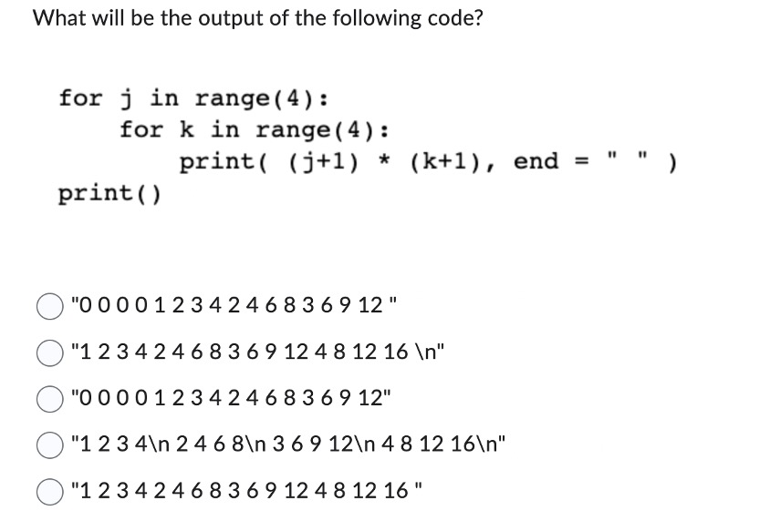
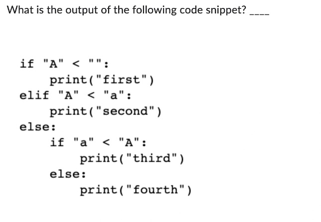
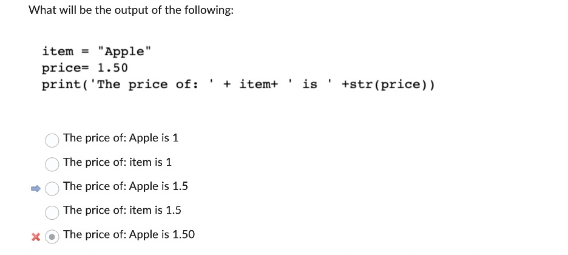
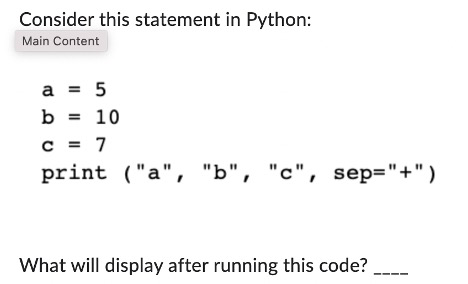
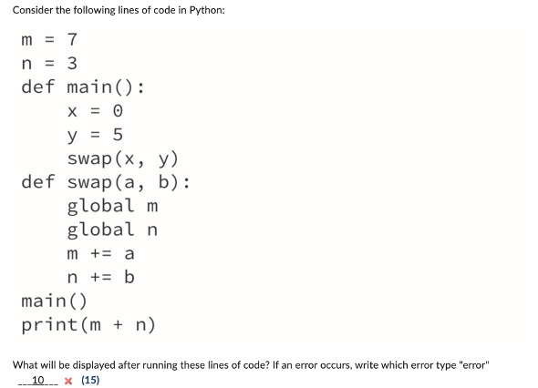
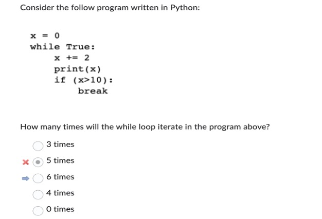
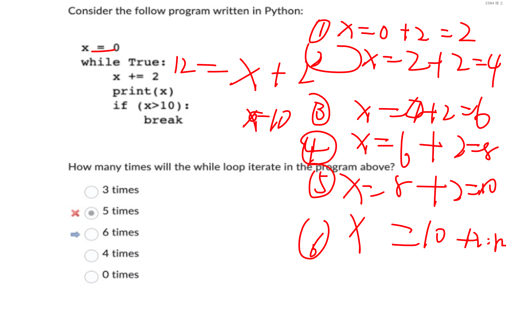
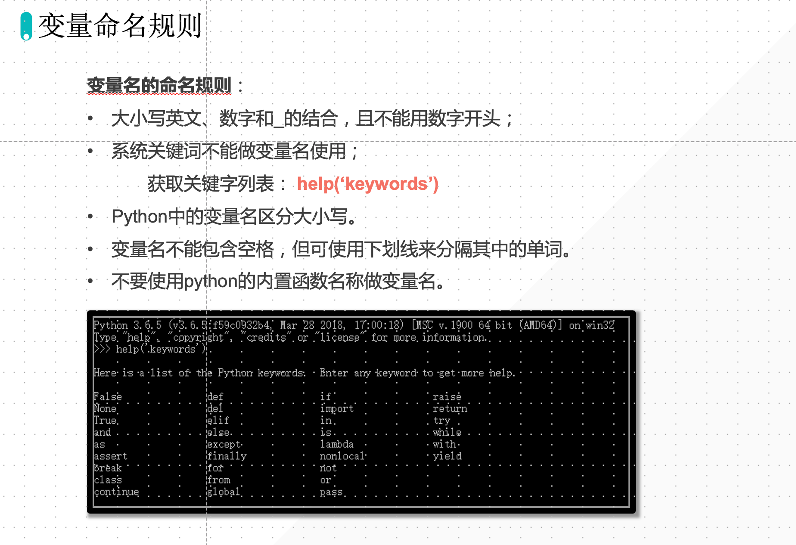

## Question 1

This question asks you to solve a problem by writing a program. If you haven't done so already, open the Python editor by clicking here. Follow the directions carefully and use the result of your program as your answer. Do not submit your program as your answer!

> 这道题要求你通过编写程序来解决一个问题。如果您还没有这样做，请单击这里打开 Python 编辑器。仔细按照说明，并使用你的程序的结果作为你的答案。不要提交你的程序作为你的答案!

Write a program that computes the sum of all integers that exist within the range 611 to 1742 (inclusive on both ends) that have the value 6 in their ONES place. For example, 6, 76 and 926 all have the value 6 in their ONES place. When you are finished enter the sum you computed as the answer to this question.

> 编写一个程序，计算在611到1742范围内(包括两端)个位数为 6 的所有整数的和。例如，6、76 和 926 的个位都是 6。当你完成后，输入你计算的和作为这个问题的答案。

### 知识点

#### 运算符

```python
a = 9
b = 2
r = a % b
print(r)
```

### Answer 1

```python
total = 0

for i in range(611, 1743):
    if i % 10 == 6:
        total += i

print(total)
```

## Question 2

This question asks you to solve a problem by writing a program. If you haven't done so already, open the Python editor by clicking [here](http://prager.hosting.nyu.edu/). Follow the directions carefully and use the result of your program as your answer. Do not submit your program as your answer!

> 这道题要求你通过编写程序来解决一个问题。如果你还没有这样做，通过点击[这里](http://prager.hosting.nyu.edu/)打开Python编辑器。仔细按照说明，并使用你的程序的结果作为你的答案。不要提交你的程序作为你的答案!

Write a program that computes the sum of all integers that exist within the range 545 to 1798 (inclusive on both ends) that have the value 1 in their ONES place. For example, 1, 71 and 921 all have the value 1 in their ONES place. When you are finished enter the sum you computed as the answer to this question.

> 编写一个程序，计算在545到1798范围内(包括两端)个位数为1的所有整数的和。例如，1、71和921在个位上的值都是1。当你完成后，输入你计算的和作为这个问题的答案。

### Answer 2

```python
total = 0

for i in range(545, 1799):
    if i % 10 == 1:
        total += i

print(total)
```

## Question 3

Given the following short program:

```python
k = 6
f = 4
v = 4
i = 5
answer = k >= f % v * i
```

Identify the value of the variable 'answer'.

If the program crashes write the word 'error!

### Answer 3

The program defines several variables and then evaluates a logical expression that compares their values. Let's break it down step by step:

> 该程序定义了几个变量，然后计算一个逻辑表达式来比较它们的值。让我们一步一步来分析:

1. `k = 6`
2. `f = 4`
3. `v = 4`
4. `i = 5`

Now, the logical expression: `answer = k >= f % v * i`

> 现在，逻辑表达式是:' `answer = k >= f % v * i` '

1. Calculate `f % v`: `4 % 4` equals `0`.

> 计算'` f % v` ': ' `4% 4` '等于' 0 '。

2. Multiply the result by `i`: `0 * 5` equals `0`.

3. Compare the result with `k` using the "greater than or equal to" operator: `6 >= 0`.

> 使用"大于或等于"运算符' 6 >= 0 '将结果与' k '进行比较。

The final result is `True`, so `answer = True`.

## Question 4

The following program is an example of an infinite loop:

> 下面的程序是一个无限循环的例子:

```python
x = 0
while True:
    x += 2
    print(x - 2)
    if (x > 5):
        break
```

对错。break 跳出当前循环，continue 跳出当次循环。

## Question 5

What is the output generated by the following code?

```python
for i in range(5):
    for j in range(7):
        continue
print(i * j)
```

### Answer 5

24

## Question 6

Trace the output of the following short program. If the program crashes write the word 'error' without delimiters. If the program generates no output write the word 'no output' without delimiters:

```python
def fun1(u):
    u += 3
    print(u, end="#")


def fun2(w):
    w += 2
    print(w, end='#')
    return w


def fun3(k):
    k += 3
    print(k, end='#')
    fun2(k)
    return k


k = 1
k = fun3(k)
print(k, end='#')
```

### Answer 6

```python
4#6#4#
```

```python
def fun1(u):
    u += 3
    print(u, end="#")
    return u


def fun2(w):
    w += 2
    print(w, end='#')
    return fun1(w)


def fun3(k):
    k += 3
    print(k, end='#')
    n = fun2(k)
    return n


k = 2
k = fun3(k)
print(k, end='#')

# 5#7#10#10#
```


## Question 7

What will be the output of the following statement?

```python
print(2 * 2 ** 2 + 2)
```

Python 运算符优先级决定了在表达式中的运算顺序。优先级高的运算符会在优先级低的运算符之前执行。以下是 Python 中运算符的优先级列表，从高到低：

1. 括号 `()`：用于分组或改变运算顺序。
2. 指数 `**`：求幂运算。
3. 一元加减 +x, -x：**正负号**。
4. 乘法 `*`、除法 `/`、取整除法 `//`、取模 `%`：从左到右。
5. 二元加法 `+` 和减法 `-`：从左到右。
6. 位移运算符 `<<`, `>>`：从左到右。
7. 按位与 `&`：从左到右。
8. 按位异或 `^`：从左到右。
9. 按位或 `|`：从左到右。
10. 比较运算符（例如 `<`, `<=`, `>`, `>=`, `!=`, `==`）：从左到右。
11. 赋值运算符 `=`, `+=`, `-=`, `*=`, `/=`, `%=`, `**=`, `//=`, `&=`, `|=`, `^=`, `<<=`, `>>=`：从右到左结合。
12. 身份运算符 `is`, `is not`：从左到右。
13. 成员运算符 `in`, `not in`：从左到右。
14. 逻辑非 `not`：从右到左。
15. 逻辑与 `and`：从左到右。
16. 逻辑或 `or`：从左到右。

## Question 8

What will be the output of the following code?

```python
for j in range(4):
    for k in range(4):
        print((j + 1) * (k + 1), end=" ")
print()
```

问题：最后一行的 print 和不同的 statement 对齐会产生什么不同的结果




## Question 9



::: tip ord

ord 查看字符串对应的 ASCII

> https://bornforthis.cn/posts/29.html

```python
s = "A"
print(ord(s))
```

:::

## Question 10

Write a program that continually prompts the user to enter in a value. The user may enter any integer (positive or negative) or the string "end". The goal is to compute the sum of all inputted values that meet the following criteria:

> 编写一个程序，不断提示用户输入一个值。用户可以输入任何整数(正数或负数)或字符串“end”。目标是计算满足以下条件的所有输入值的和:

●   Must be positive

> 必须是正数

●   Must be evenly divisible by both 4 and 8

> 必须能被4和8整除

Any integer that does not match the criteria above should be rejected. Your program should stop accepting inputs when the value "end" has been supplied by the user.

> 任何不符合上述条件的整数都应该被拒绝。当用户提供了“end”值时，程序应该停止接受输入。

Here is a sample running of the program:

> 下面是程序的运行示例:

```python
Enter an integer or the string "end": 72
Valid integer!
Enter an integer or the string "end": 31
Invalid, integer rejected
Enter an integer or the string "end": 4
Invalid, integer rejected
Enter an integer or the string "end": 72
Valid integer!
Enter an integer or the string "end": -68
Invalid, integer rejected
Enter an integer or the string "end": end
Total is: 144
```

Some notes:

> 一些注意事项:

●   Your program should work exactly like the sample output displayed above.

> 您的程序应该与上面显示的示例输出完全相同。

●   You can assume that the user will only enter an integer OR the string "end" (you do not need to worry about floating point numbers, or strings other than "end")

> 你可以假设用户只会输入一个整数或者字符串"end"(你不需要担心浮点数，或者除了"end"以外的字符串)

Submitting your answer:

> 提交你的答案:

●   To submit your answer to Brightspace you will use a special function that will generate a large number of inputs to verify that your program solves the question being asked.

> 为了将你的答案提交给Brightspace，你将使用一个特殊的函数，它将生成大量的输入来验证你的程序解决了所问的问题。

●   Add the following two lines of code at the top of your program. ENSURE THAT YOU COPY THESE LINES EXACTLY.

> 在程序顶部添加以下两行代码。确保你准确地复制了这些行。

```python
import midterm
input = midterm.redefine_input("M040101")
```

●   Run your program. The "input" function will no longer work as usual, and you will see a series of test values being inputted into your program automatically.

> 运行你的程序。“输入”函数将不再像往常一样工作，您将看到一系列测试值被自动输入到程序中。

●   When this process completes type or copy the TOTAL value (and only the value with no spaces) that you computed into the answer for this question. 

> 当此过程完成时，键入或复制您计算到此问题的答案中的TOTAL值(并且只有不带空格的值)。

```python
import midterm

input = midterm.redefine_input("M040101")


def is_valid(num):
    if num > 0 and num % 4 == 0 and num % 8 == 0:
        return True


total = 0
while True:
    user_input = input('Enter an integer or the string "end":')
    if user_input == "end":
        break

    num = int(user_input)
    # if is_valid(num):
    if num > 0 and num % 4 == 0 and num % 8 == 0:
        print("Valid integer!")
        total += num
    else:
        print("Invalid, integer rejected")
print("Total is:", total)
```


## Question 11




```python
item = "Apple"
price = 1.50
print('The price of: ' + item + ' is ' + str(price))
```

## Question 12



```python
a = "Austin"
b = "Jaden"
c = "Alex"
d = "Tommy"
print(a, b, c, d, sep="一拳间隔")
```

## Question 13




## Question 14





## How many iterations are there?

1. for i in range(4)
2. for i in range (58,60)
3. for i in range(17, 1, -8)
4. foriin[3,5,“2”]
5. for i in range (42, 46, 2)
6. for i in ‘3de’




## Python Runtime Errors 的代码示例

在 Python 中，运行时错误是指在程序执行过程中遇到的错误，而不是在编译时检测到的错误。以下是一些常见的 Python 运行时错误及其示例：

### 1. ZeroDivisionError：当试图除以零时触发。

```python
x = 5
y = 0
result = x / y  # ZeroDivisionError: division by zero
```

### 2. IndexError：当试图访问序列中不存在的索引时触发。

```python
my_list = [1, 2, 3]
print(my_list[3])  # IndexError: list index out of range
```

### 3. KeyError：当试图访问字典中不存在的键时触发。

```python
my_dict = {"a": 1, "b": 2}
print(my_dict["c"])  # KeyError: 'c'
```

### 4. FileNotFoundError：当试图打开不存在的文件时触发。

```python
with open("non_existent_file.txt", "r") as file:
    content = file.read()  # FileNotFoundError: [Errno 2] No such file or directory: 'non_existent_file.txt'
```

### 5. TypeError：当对不同类型的对象执行不兼容的操作时触发。

```python
x = "5"
y = 3
result = x + y  # TypeError: can only concatenate str (not "int") to str
```

### 6. ValueError：当向函数传递具有正确类型但不适当的值时触发。

```python
number = int("abc")  # ValueError: invalid literal for int() with base 10: 'abc'
```

### 7. AttributeError：当试图访问对象上不存在的属性或方法时触发。

```python
my_list = [1, 2, 3]
my_list.non_existent_method()  # AttributeError: 'list' object has no attribute 'non_existent_method'
```

这些仅是 Python 运行时错误的一部分。在编写代码时，确保正确处理异常以避免意外的程序中断。可以使用 `try-except` 语句捕获和处理运行时错误。


## 逻辑错误代码示例

逻辑错误是指程序没有按预期方式运行，尽管没有出现明显的错误消息。逻辑错误很难调试，因为它们不会导致程序崩溃或产生运行时错误。以下是一些常见的逻辑错误示例：

### 1. 错误的循环条件

```python
def print_numbers(n):
    i = 0
    while i < n:  # 应该是 while i <= n:
        print(i)
        i += 2

print_numbers(5)  # 输出：0, 2, 4，而不是 0, 2, 4, 5
```

### 2. 计算错误的平均值

```python
def average(numbers):
    return sum(numbers) / (len(numbers) - 1)  # 应该是 return sum(numbers) / len(numbers)

numbers = [1, 2, 3, 4, 5]
print(average(numbers))  # 输出：3.0，而不是 3.5
```

### 3. 使用错误的操作符

```python
def is_even(number):
    return number & 1 == 0  # 应该是 return number % 2 == 0

print(is_even(5))  # 输出：False，但在这种情况下结果正确
print(is_even(6))  # 输出：True，但在这种情况下结果错误
```

### 4. 错误的列表索引

```python
my_list = [1, 2, 3, 4, 5]
for i in range(len(my_list)):
    print(my_list[i - 1])  # 应该是 print(my_list[i])

# 输出：
# 5
# 1
# 2
# 3
# 4
```

### 5. 错误地将整数除法用于浮点数计算

```python
def divide(a, b):
    return a // b  # 应该是 return a / b

result = divide(5, 2)
print(result)  # 输出：2，而不是 2.5
```

这些示例说明了逻辑错误可能会导致程序产生错误的输出。为了找到和修复逻辑错误，需要对代码进行审查、调试和测试。


::: details 公众号：AI悦创【二维码】


:::

::: info AI悦创·编程一对一

AI悦创·推出辅导班啦，包括「Python 语言辅导班、C++ 辅导班、java 辅导班、算法/数据结构辅导班、少儿编程、pygame 游戏开发、Web、Linux」，全部都是一对一教学：一对一辅导 + 一对一答疑 + 布置作业 + 项目实践等。当然，还有线下线上摄影课程、Photoshop、Premiere 一对一教学、QQ、微信在线，随时响应！微信：Jiabcdefh

C++ 信息奥赛题解，长期更新！长期招收一对一中小学信息奥赛集训，莆田、厦门地区有机会线下上门，其他地区线上。微信：Jiabcdefh

方法一：[QQ](http://wpa.qq.com/msgrd?v=3&uin=1432803776&site=qq&menu=yes)

方法二：微信：Jiabcdefh

:::


