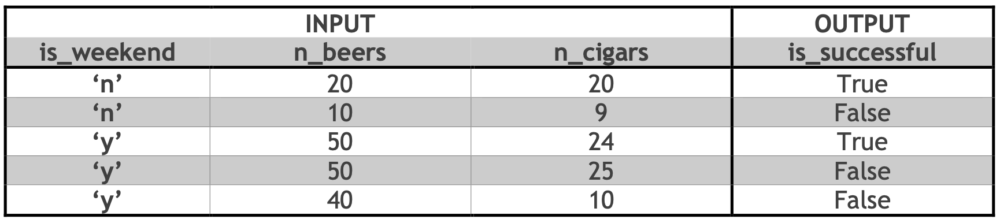
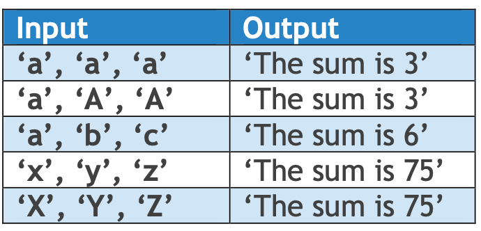

## 234128 – Introduction to Computing with Python

> 234128 - Python 计算入门

**Instructions:**

Required submission files:

**hw1q1.py hw1q2.py hw1q3.py hw1q4.py**

Make a **ZIP** file whose name is `<id>`.zip whereas `<id>` is your id (9 digits exactly). Example: **999666333.zip**

This zip file should contain only the required submission files and **NOTHING ELSE**. No subfolders or any text files should appear in the zip file. Do not use rar file or anything other than zip.

> 翻译：这个压缩文件应该只包含所需的提交文件，除此之外不包含任何其他内容。压缩文件中不应出现任何子文件夹或文本文件。不要使用rar文件或任何其他非zip格式的文件。

Submit the file on Moodle only. 

> 仅在 Moodle 上提交文件。

Submission in singles.

> 单个提交。

## Question 1: hw1q1.py

Write a program that gets two strings as input and prints them in the following format:

> 编写一个程序，获取两个字符串作为输入，并以以下格式打印它们:

```python
short + long + short
```

- **short** – refers to the short string among the two. 「**短** -指两者之间的短字符串。」

- **long** – refers to the long string among the two.「**long** -表示两者之间的长字符串。」

The shorter string should be on the outside and the long string should be on the inside.

> 较短的绳子应该在外面，较长的绳子应该在里面。

Given strings with equal length, the first input string should be on the outside and the second string is on the inside (see last example). The strings may be empty (length 0).

> 如果给定的字符串长度相等，第一个输入字符串应该在外面，第二个字符串在里面（参见最后一个示例）。字符串可能为空（长度为0）。

**Requirement:** Using IF statements is **NOT** allowed. Solutions ignoring this requirement will get 50% of the points.

> 要求：不允许使用IF语句。忽略此要求的解决方案将获得50%的分数。

**Examples:**

| Input Strings  | Output String |
| -------------- | ------------- |
| `'ucat', 'ed'` | `educated`    |
| `'ed', 'ucat'` | `educated`    |
| `'to', 'ma'`   | `tomato`      |
| `'ma', 'to'`   | `matoma`      |
| `'', 'Python'` | `Python`      |

```python
ucat,ed
ed,ucat
to,ma
ma,to
,Python
```

**Notes:**

1. The program doesn’t print anything other than the resulting string (**no input prompts**).

> 程序除了输出结果字符串之外不打印任何内容（**不包括输入提示**）。

2. Use the function `len()` to get length of a string.

> 使用`len()`函数来获取字符串的长度。

### Answer 1

::: code-tabs

@tab 1.0

```python
# 从用户那里获取两个字符串输入
string1 = input()
string2 = input()

# 计算两个字符串的长度
length1 = len(string1)
length2 = len(string2)

# 确定较短的字符串和较长的字符串
# 如果 string1 的长度小于等于 string2 ，那么 shorter 为 string1，否则为 string2
shorter = string1 * (length1 <= length2) + string2 * (length1 > length2)
# 如果 string1 的长度大于 string2，那么 longer 为 string1，否则为 string2
longer = string1 * (length1 > length2) + string2 * (length1 <= length2)

# 将结果按照short + long + short的格式组合
result = shorter + longer + shorter
# 输出结果字符串
print(result)
```

@tab 2.0

```python
# Get two strings as input from the user
string1 = input()
string2 = input()

# Create a list containing both input strings
strings = [string1, string2]

# Sort the list of strings based on their lengths
sorted_strings = sorted(strings, key=len)

# Combine the result in the format: short + long + short
result = sorted_strings[0] + sorted_strings[1] + sorted_strings[0]

# Print the resulting string
print(result)
```

@tab 答案

```python
# 从用户那里获取两个字符串输入
string1, string2 = input().split(",")

# 计算两个字符串的长度
length1 = len(string1)
length2 = len(string2)

# 确定较短的字符串和较长的字符串
# 如果 string1 的长度小于等于 string2 ，那么 shorter 为 string1，否则为 string2
shorter = string1 * (length1 <= length2) + string2 * (length1 > length2)
# 如果 string1 的长度大于 string2，那么 longer 为 string1，否则为 string2
longer = string1 * (length1 > length2) + string2 * (length1 <= length2)

# 将结果按照short + long + short的格式组合
result = shorter + longer + shorter
# 输出结果字符串
print(result)
```

:::

## Question 2: hw1q2.py

Write a program that asks the user to enter their name and age.

> 编写一个程序，要求用户输入他们的姓名和年龄。

Print out a message that tells them the year that they will turn 120 years old. Use year 2023 in your calculation.

> 输出一条消息，告诉他们将在哪一年达到120岁。在计算中使用2023年。

The input prompts are as follows:

> 输入提示如下：

1. `'Type your name:'`
2. `'Type your age:'`

Given the name and age: `'Alice'`, `'19'`  the output should be printed in the following format:

> 给定姓名和年龄：`'Alice'`，`'19'`，输出应以如下格式打印：

- **Alice**, you will be 120 years old in the year **2124**.

> **Alice**，你将在**2124**年满120岁。

Where **Alice** and **2124** are the input name and calculated year accordingly.

> 其中，**Alice** 和 **2124** 分别是输入的姓名和计算出的年份。

### Answe 2

```python
# Get the user's name
name = input("Type your name: ")

# Get the user's age
age = int(input("Type your age: "))

# Calculate the year when the user will be 120 years old
current_year = 2023
years_until_120 = 120 - age
year_turn_120 = current_year + years_until_120

# Print the message
print(f"{name}, you will be 120 years old in the year {year_turn_120}.")
```

## Question 3: hw1q3.py

When squirrels get together for a party, they like to have beers and cigars. A squirrel party is considered successful when the number of beers equals the number of cigars. Unless it is weekend, in which case the number of beers must be at least 50 and over twice the number of cigars.

> 当松鼠们聚在一起开派对时，它们喜欢喝啤酒和抽雪茄。当啤酒的数量等于雪茄的数量时，松鼠派对被认为是成功的。除非是周末，在这种情况下，啤酒的数量必须至少为50，并且是雪茄数量的两倍以上。

Write a program that receives the number of beers, cigars and if it is weekend and prints whether the squirrel party is successful.

> 编写一个程序，接收啤酒数量、雪茄数量和是否为周末，然后输出松鼠派对是否成功。

**Input***:

1. `is_weekend – 'y' / 'n'`

    `'y' – weekend`

    `'n' – weekday`

2. `n_beers`

3. `n_cigars`

**Output**:

- `is_successful:`
- `True – successful`
- `False – not successful`

Examples:



**Notes**:

- The input should be supplied in the order defined above.「输入应按照上述定义的顺序提供。」
- Input prompts are not required. The only output is True/False.「不需要输入提示。唯一的输出是真/假。」
- You can use the `bool()` function to convert an integer to a Boolean value.「您可以使用 `bool()` 函数将整数转换为布尔值。」
- You may use IF statements.「您可以使用 IF 语句。」

### Answer 3

```python
is_weekend = input()
n_beers = int(input())
n_cigars = int(input())

if is_weekend == 'y':
    is_successful = n_beers >= 50 and n_beers > 2 * n_cigars
else:
    is_successful = n_beers == n_cigars

print(is_successful)
```

## Question 4: hw1q4.py

For every letter in the English alphabet, we assign a number as follows:

> 对于英语字母表中的每个字母，我们按照如下方式分配一个数字：

- The letter `'a'` or `'A'` is represented as 1.「字母`'a'`或`'A'`表示为1。」
- The letter `'b'` or `'B'` is represented as 2.「字母'b'或'B'用数字2表示。」
- The letter `'c'` or `'C'` is represented as 3.「字母 'c' 或 'C' 表示为 3。」
- .....

And so on, until the letter `'z'` or `'Z'` which is 26.

> 依此类推，直到字母`'z'`或`'Z'`，它们对应的数字是26。

Write a program in Python which receives 3 strings, one by one, each containing a single English letter character. The program sums the numbers representing the characters and prints it as an output message.

> 编写一个Python程序，依次接收3个字符串，每个字符串包含一个英文字母字符。程序将代表字符的数字求和，并将结果作为输出消息打印出来。

Examples:



**Notes**:

- Your code must be reasonably short. You are not supposed to write 26 IF statements!

> 你的代码应该尽量简短。你不应该编写26个IF语句！

- Pay attention, the letters can be lowercase or uppercase.

> 注意，字母可以是小写或大写。

```python
def letter_to_number(letter):
    return ord(letter.lower()) - ord('a') + 1

input1 = input("Enter the first letter: ")
input2 = input("Enter the second letter: ")
input3 = input("Enter the third letter: ")

total = letter_to_number(input1) + letter_to_number(input2) + letter_to_number(input3)
print("The sum of the numbers representing the characters is:", total)
```

```python
def letter_to_number(letter):
    alphabet = 'abcdefghijklmnopqrstuvwxyz'
    letter = letter.lower()
    return alphabet.index(letter) + 1

input1 = input("输入第一个字母: ")
input2 = input("输入第二个字母: ")
input3 = input("输入第三个字母: ")

total = letter_to_number(input1) + letter_to_number(input2) + letter_to_number(input3)
print("字符对应的数字之和为:", total)
```


::: details 公众号：AI悦创【二维码】


:::

::: info AI悦创·编程一对一

AI悦创·推出辅导班啦，包括「Python 语言辅导班、C++ 辅导班、java 辅导班、算法/数据结构辅导班、少儿编程、pygame 游戏开发、Web、Linux」，全部都是一对一教学：一对一辅导 + 一对一答疑 + 布置作业 + 项目实践等。当然，还有线下线上摄影课程、Photoshop、Premiere 一对一教学、QQ、微信在线，随时响应！微信：Jiabcdefh

C++ 信息奥赛题解，长期更新！长期招收一对一中小学信息奥赛集训，莆田、厦门地区有机会线下上门，其他地区线上。微信：Jiabcdefh

方法一：[QQ](http://wpa.qq.com/msgrd?v=3&uin=1432803776&site=qq&menu=yes)

方法二：微信：Jiabcdefh

:::


