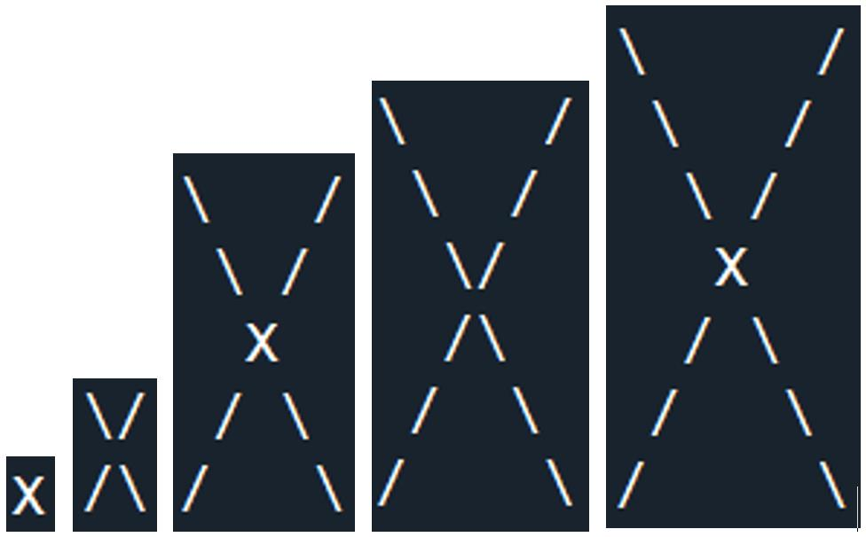

**234128 – Introduction to Computing with Python**

**Spring Semester, 2023**

**Assignment 2**

**Loops | Lists | Strings**

**Instructions:**

Required submission files:

- **hw2q1.py**

- **hw2q2.py**

- **hw2q3.py**

- **hw2q4.py**

## Question 1: hw2q1.py

Write a program that prints the acronym of a sentence.

> 编写一个程序，打印一个句子的缩写词。

The words ‘`with`’, ‘`and`’, ‘`of`’, ‘`to`’ must be ignored.

> 这句话的意思是：必须忽略单词“with”、“and”、“of”和“to”。

Examples:

| Input                                               | Output  |
| --------------------------------------------------- | ------- |
| `Guangdong Technion Israel Institute of Technology` | `GTIIT` |
| `Mathematics with Computer Science`                 | `MCS`   |
| `laughing out loud`                                 | `lol`   |
| `be right back`                                     | `brb`   |
| `yǒng yuǎn de shén`                                 | `yyds`  |

**Note:** The program doesn’t print anything other than the resulting string (**no input prompts**).

> 注意：该程序除了输出结果字符串以外不会打印任何其他内容（没有输入提示）。

### Answer

::: code-tabs

@tab 版本1

```python
def acronym(sentence):
    ignored_words = {'with', 'and', 'of', 'to'}
    words = sentence.split()
    acronym = ''.join([word[0] for word in words if word.lower() not in ignored_words])
    print(acronym)

# Test the function with example sentences
acronym("Guangdong Technion Israel Institute of Technology")
acronym("Mathematics with Computer Science")
acronym("laughing out loud")
acronym("be right back")
acronym("yǒng yuǎn de shén")
```

@tab 版本2

```python
# Step 1: Define the function
def acronym(sentence):
    # Step 2: Define the set of ignored words
    ignored_words = {'with', 'and', 'of', 'to'}

    # Step 3: Split the sentence into words
    words = sentence.split()

    # Step 4: Iterate through the words, taking the first character of each word that is not in the ignored_words set
    acronym_characters = [word[0] for word in words if word.lower() not in ignored_words]

    # Step 5: Join the characters together to form the acronym
    acronym = ''.join(acronym_characters)

    # Step 6: Print the resulting acronym
    print(acronym)

# Test the function with example sentences
acronym("Guangdong Technion Israel Institute of Technology")
acronym("Mathematics with Computer Science")
acronym("laughing out loud")
acronym("be right back")
acronym("yǒng yuǎn de shén")
```

:::

## Question 2: hw2q2.py

Write a program that counts the number of English characters in a string and prints the result as output.

> 编写一个程序，计算一个字符串中英文字符的数量，并将结果打印输出。

Requirement: Using any string methods is **not allowed**!

> 要求：不允许使用任何字符串方法！

Examples:

| Input String           | Output          |
| ---------------------- | --------------- |
| `Hello World`          | `10 characters` |
| `H3110 W0r!d`          | `4 characters`  |
| `$h@nt0u`              | `4 characters`  |
| `Two @pple$, 1 Banana` | `13 characters` |

::: code-tabs

@tab 版本1

```python
def is_english_char(char):
    return ('A' <= char <= 'Z') or ('a' <= char <= 'z')

def count_english_characters(input_string):
    count = 0
    for char in input_string:
        if is_english_char(char):
            count += 1
    return count

# Test cases
test_strings = [
    "Hello World",
    "H3110 W0r!d",
    "$h@nt0u",
    "Two @pple$, 1 Banana",
]

for string in test_strings:
    print(f"'{string}': {count_english_characters(string)} characters")

```

@tab 版本2

```python
def count_english_characters(input_string):
    count = 0
    for char in input_string:
        if ('A' <= char <= 'Z') or ('a' <= char <= 'z'):
            count += 1
    return count

# 测试用例
test_strings = [
    "Hello World",
    "H3110 W0r!d",
    "$h@nt0u",
    "Two @pple$, 1 Banana",
]

for string in test_strings:
    print(f"'{string}': {count_english_characters(string)} characters")
```

@tab 版本3

```python
def count_english_characters(input_string):
    alphabet = 'abcdefghijklmnopqrstuvwxyzABCDEFGHIJKLMNOPQRSTUVWXYZ'
    word_count = 0
    for char in input_string:
        if char in alphabet:
            word_count += 1
```

:::


## Question 3: hw2q3.py

Write a function: `get_pairs(L1, L2)`

The function gets two lists L1, L2 with equal length. The function returns a list of pairs of items from L1 and L2. Each pair is a list.

Requirements: Must use list comprehension. The function body is limited to one line of code.

Examples:

| Function Call                           | Return                              |
| --------------------------------------- | ----------------------------------- |
| `get_pairs([1, 2, 3],['a', 'b', 'c']) ` | `[[1, 'a'], [2, 'b'], [3, 'c']]`    |
| `get_pairs(['x', 'x'], ['o', 'o'])`     | `get_pairs(['x', 'x'], ['o', 'o'])` |

Here's the function definition:

```python
def get_pairs(L1, L2):
    return [[x, y] for x, y in zip(L1, L2)]
```

Examples:

```python
print(get_pairs([1, 2, 3], ['a', 'b', 'c']))  # [[1, 'a'], [2, 'b'], [3, 'c']]
print(get_pairs(['x', 'x'], ['o', 'o']))      # [['x', 'o'], ['x', 'o']]
```


## Question 4: hw2q4.py

Write a function: `cross(n)`

The function prints a picture of an n x n cross. The cross consists of two diagonal lines. The lines should be made of a forward-slash ‘`/`’ and back-slash ‘`\`’. When n is an odd number, use ‘`X`’ at the center of the cross. See attached examples in the zip file.

> 该函数打印出一个$n\times n$的十字形图片。该十字形由两条对角线组成。这两条对角线应该由斜杠‘`/`’和反斜杠‘`\`’组成。当$n$为奇数时，在十字形的中心使用‘`X`’。请参考附带的zip文件中的示例。



**Notes:**

1. For odd values of n, notice the ‘X’ in the center is uppercase.

> 对于奇数n的情况，请注意中心的“X”是大写的。

2. Recall that to print a single back slash in Python you need to use **print(‘\\’)**.

> 记住，在Python中打印一个单独的反斜杠需要使用**print('\\')**。

### Answer

```python
def cross(n):
    # 如果 n 为 1，直接打印 "X" 并返回
    if n == 1:
        print("X")
    else:
        # 计算中点的位置
        mid = n // 2
        
        # 遍历 n 行
        for i in range(n):
            # 如果行号 i 小于中点，打印上半部分的斜线
            if i < mid:
                # " " * i 在行首打印空格
                # "\\" 打印反斜杠
                # " " * (n - 2 * i - 2) 在两个斜线之间打印空格
                # "/" 打印正斜杠
                print(" " * i + "\\" + " " * (n - 2 * i - 2) + "/")
                
            # 如果行号 i 等于中点且 n 为奇数，打印 "X"
            elif i == mid and n % 2 != 0:
                print(" " * i + "X")
                
            # 否则，打印下半部分的斜线
            else:
                # " " * (n - i - 1) 在行首打印空格
                # "/" 打印正斜杠
                # " " * (2 * i - n) 在两个斜线之间打印空格
                # "\\" 打印反斜杠
                print(" " * (n - i - 1) + "/" + " " * (2 * i - n) + "\\")
```

思路概括如下：

1. 首先，检查特殊情况 n 等于 1，直接打印 "X"。
2. 对于其他情况，计算中点位置。
3. 遍历 n 行，根据行号 i 和中点位置决定如何打印每一行。
4. 如果行号小于中点，则打印上半部分的斜线。
5. 如果行号等于中点且 n 为奇数，则打印 "X"。
6. 否则，打印下半部分的斜线。

当然可以。让我们一步步分析这个题目，逐步理解它，并逐步演示如何得出结果。

题目要求编写一个函数 `cross(n)`，它接受一个整数 n 作为输入参数，并打印一个 n x n 的十字图案，十字由两条对角线组成，分别使用正斜杠 '/' 和反斜杠 '\\' 表示。如果 n 为奇数，中心点用大写字母 'X' 表示。

首先，我们需要根据输入的 n 值来确定如何绘制图案。我们可以将问题分解为以下几个部分：

1. 特殊情况：n 等于 1。
2. 对于其他 n 值，我们需要找到中点。
3. 根据行号 i 和中点位置来决定如何打印每一行。

现在，让我们一步步演示如何使用示例 `cross(5)` 来完成这个过程。

示例：`cross(5)`

1. 特殊情况：n 等于 1。在这个示例中，n 等于 5，因此我们不需要处理这个特殊情况。

2. 对于其他 n 值，我们需要找到中点。在这个示例中，n 等于 5，所以中点是 `n // 2`，即 2。

3. 根据行号 i 和中点位置来决定如何打印每一行。我们需要遍历 n 行（在这个示例中是 5 行），并根据行号 i 和中点位置决定如何打印每一行。


这些表达式是根据行号 i 和输入值 n 计算每一行要打印的字符。让我们逐一分析这些表达式以了解它们的来源。

1. `" " * i + "\\" + " " * (n - 2 * i - 2) + "/"`
   
   这个表达式用于打印上半部分的斜线。对于这部分，我们需要根据行号 i 在每行的开头和斜线之间打印适当数量的空格。这可以通过 `" " * i` 实现，其中 i 是行号。
   
   然后，我们需要打印反斜杠 "\\"，表示上半部分斜线的开始。
   
   接下来，我们需要在两条斜线之间添加适当数量的空格。观察上半部分的斜线，我们可以发现，随着 i 的增加，中间的空格数呈现递减的趋势。为了计算中间空格的数量，我们可以使用 `(n - 2 * i - 2)`。这个表达式表示从总长度 n 中减去两倍的行号 i，再减去 2。这样就可以得到中间空格的数量。
   
   最后，我们需要打印正斜杠 "/"，表示上半部分斜线的结束。
   
2. `" " * i + "X"`
   
   这个表达式用于打印奇数 n 值时的中心点 "X"。在这种情况下，我们需要在每行的开头打印适当数量的空格，这可以通过 `" " * i` 实现，其中 i 是行号。
   
   然后，我们需要打印 "X" 作为中心点。
   
3. `" " * (n - i - 1) + "/" + " " * (2 * i - n) + "\\"`
   
   这个表达式用于打印下半部分的斜线。对于这部分，我们需要在每行的开头打印适当数量的空格。观察下半部分的斜线，我们可以发现空格数随着行号 i 的增加而减少。为了计算这些空格的数量，我们可以使用 `(n - i - 1)`。这个表达式表示从总长度 n 中减去行号 i，再减去 1。
   
   然后，我们需要打印正斜杠 "/"，表示下半部分斜线的开始。
   
   接下来，我们需要在两条斜线之间添加适当数量的空格。观察下半部分的斜线，我们可以发现，随着 i 的增加，中间的空格数呈现递增的趋势。为了计算中间空格的数量，我们可以使用 `(2 * i - n)`。这个表达式表示两倍的行号 i 减去总长度 n。


::: details 公众号：AI悦创【二维码】


:::

::: info AI悦创·编程一对一

AI悦创·推出辅导班啦，包括「Python 语言辅导班、C++ 辅导班、java 辅导班、算法/数据结构辅导班、少儿编程、pygame 游戏开发、Web、Linux」，全部都是一对一教学：一对一辅导 + 一对一答疑 + 布置作业 + 项目实践等。当然，还有线下线上摄影课程、Photoshop、Premiere 一对一教学、QQ、微信在线，随时响应！微信：Jiabcdefh

C++ 信息奥赛题解，长期更新！长期招收一对一中小学信息奥赛集训，莆田、厦门地区有机会线下上门，其他地区线上。微信：Jiabcdefh

方法一：[QQ](http://wpa.qq.com/msgrd?v=3&uin=1432803776&site=qq&menu=yes)

方法二：微信：Jiabcdefh

:::


