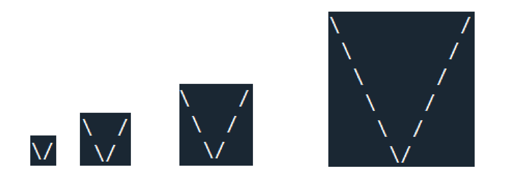

## Section I - Multiple Choice: (choose only one answer) (40pts)

**For questions 1-4, refer to the following code segment:**

```python
bands = ['The Who', 'The Beatles', 'Led Zeppelin', 'The Doors', 'Pink Floyd']
years = [1964, 1960, 1968, 1965, 1970]
```

What will be printed for each of the following cases?

1. `print(''.join([band[0] for band in bands]))`

a. `'01234'`

b. `'TTLTP'`

c. `'00000'`

d. `'The WhoThe BeatlesLed ZeppelinThe DoorsPink Floyd'`

e. `'TheTheLedThePink'`

f. `'The WhoThe WhoThe WhoThe WhoThe Who'`

2. `print([i for i in bands if 'The' not in i])`

a. `[0, 1]`

b. `[0, 1, 2]`

c. `['The', 'The']`

d. `['The', 'The', 'The']`

e. `['The Who', 'The Beatles', 'The Doors']`

f. `['Led Zeppelin', 'Pink Floyd']`

3. `my_list = [name.split(' ') for name in bands]`

    `print([name[1] for name in my_list if len(name[0]) == len(name[1])])`

a. `['The Beatles', 'Led Zeppelin', 'The Doors', 'Pink Floyd']`

b. `['Who', 'Beatles', 'Zeppelin', 'Doors', 'Floyd']`

c. `['The Who']`

d. `['Who']`

e. `[]`

f. `['Beatles', 'Zeppelin', 'Doors', 'Floyd']`

4. `print([bands[i] for i in range(len(bands)) if years[i]>1965])`

a. `[1968, 1970]`

b. `[0, 1]`

c. `['Led Zeppelin', 'Pink Floyd']`

d. `['The Who', 'The Beatles']`

e. `['The Doors']`

f. `['The Who', 'The Beatles', 'Led Zeppelin', 'Pink Floyd']`

5. Given the following code:

```python
result = list(range(0,10,3)) + [333]
print(result)
```

What will be printed?

a. `[0, 3, 6, 9, 333]`

b. `[10, 10, 10, 333]`

c. `[0, 3, 6, 9, 333]`

d. `[333]`

e. `351`

f. `[3, 3, 3, 3, 3, 3, 3, 3, 3, 3, 333]`

6. Given the following code:

```python
my_list = [1, 2, 3, 4, 5, 6]
for num in my_list:
    if num == 3:
        continue
    print(num, end = ' ')
    if num == 4:
        break
```

What will be printed?

a. 1

b. 1 2

c. 1 2 4

d. 1 2 3 4

e. 1 2 4 5

f. 1 2 4 5 6

7. Given the following code:

```python
my_list = [1, 2, 3, 4, 5, 6]
total = 0
for num in my_list:
    if num % 3 != 0:
        continue
    total += num
```

What will be printed?

a. 0

b. 1

c. 3

d. 6

e. 9

f. 12

8. Which of the following expressions evaluates to True?

a. `1 in list(range(ord('0'), ord('9')+1)`

b. `type(5>9) != bool`

c. `int('6') * int('6') in list(range(36,66,6))`

d. `len(list(range(50))) > 100`

e. `5.5 in list(range(5,10))`

f. `All expressions return False`

## Section II - Open Questions: (65pts)

Answer the following questions in the included answer sheet.

Write clear and readable code and pay attention to indentation. You may add notes or comments explaining your solution.

If you write “I don’t know” as an answer, you will get 20% of the points. This is recommended if you know that you don’t know the answer.

### Question 1: (20pts)

Write a function: `alternate(s1,s2)`

The function gets two strings s1, s2 as input and prints a new string. The output string will alternate between the two input strings, repeatedly taking a single character from each. For example:

```python
alternate('abcd', '1234') → 'a1b2c3d4'
alternate('HHH', 'aaa') → 'HaHaHa'
alternate('bnn', 'aaaaaa') → 'bananaaaa'
alternate('BNNaa', 'AAA') → 'BANANAaa'
```

If the input strings are not in the same length, alternate between the strings and then add the remaining characters of the longer string (see last two examples).

::: code-tabs

@tab 1

```python
def alternate(s1, s2):
    # 初始化一个空字符串来存储输出结果
    output = ''
    # 循环次数为两个字符串长度的最大值
    for i in range(max(len(s1), len(s2))):
        # 如果当前索引小于s1的长度，将s1的当前字符加入输出字符串
        if i < len(s1):
            output += s1[i]
        # 如果当前索引小于s2的长度，将s2的当前字符加入输出字符串
        if i < len(s2):
            output += s2[i]
    # 返回输出字符串
    return output
```

@tab 2

```python
# 定义一个空字符串
new_str = ""

# 读入两个字符串
s1 = input()
s2 = input()

# 如果两个字符串长度相等
if len(s1) == len(s2):
    # 将两个字符串交替连接起来，生成一个新的字符串
    for i in range(len(s1)):
        new_str = new_str + s1[i]+s2[i]
    # 输出新的字符串
    print(new_str)

# 如果第一个字符串长度大于第二个字符串
if len(s1) > len(s2):
    # 将两个字符串交替连接起来，生成一个新的字符串
    for i in range(len(s2)):
        new_str = new_str + s1[i] + s2[i]
    # 将第一个字符串剩余的部分连接到新的字符串的末尾
    new_str = new_str + s1[len(s2):]
    # 输出新的字符串
    print(new_str)

# 如果第一个字符串长度小于第二个字符串
if len(s1) < len(s2):
    # 将两个字符串交替连接起来，生成一个新的字符串
    for i in range(len(s1)):
        new_str = new_str + s1[i] + s2[i]
    # 将第二个字符串剩余的部分连接到新的字符串的末尾
    new_str = new_str + s2[len(s1):]
    # 输出新的字符串
    print(new_str)
```


:::

### Question 2: (20pts)

Write a function: `make_v(n)`

The function gets an integer n and prints the following drawing:



These drawings are for n=1, n=2, n=3, n=6 accordingly from left to right.

It is recommended to view the drawing as a square matrix with columns j and rows i when solving this problem.


### Question 3: (25pts)

Write a function: **clean_vowels(strings)**

The function gets a list of strings as input. The function removes any vowels from all the strings and returns the resulting new list.

For example:

The function call: `clean_vowels(["this", "is", "a", "test", "one two three"])`

Will return the new list: `['ths', 's', '', 'tst', 'n tw thr']`

The vowels are a, e, i, o, u. Assume all English characters in the strings are lowercase. You may modify the input list strings.

```python
def clean_vowels(words):
    vowels = "aeiou"
    new_words = []
    for word in words:
        middle_word = []
        for char in list(word):
            if char not in vowels:
                middle_word.append(char)
        # print("".join(middle_word))
        word = ""
        for char in middle_word:
            word = word + char
        new_words.append(word)
    print(new_words)


# clean_vowels(["one two threeeeeo"])
clean_vowels(["this", "is", "a", "test", "one two three"])
# def clean_vowels(words):
#     vowels = "aeiou"
#     new_words = []
#     for word in words:
#         w_l = list(word)
#         new_w_l = []
#         for char in w_l:
#             if char not in vowels:
#                 new_w_l.append(char)
#         new_word = "".join(new_w_l)
#         new_words.append(new_word)
#     return new_words
#
# print(clean_vowels(["one two threeo"]))
# # Output: ['n tw thr']
```


::: details 公众号：AI悦创【二维码】


:::

::: info AI悦创·编程一对一

AI悦创·推出辅导班啦，包括「Python 语言辅导班、C++ 辅导班、java 辅导班、算法/数据结构辅导班、少儿编程、pygame 游戏开发、Web、Linux」，全部都是一对一教学：一对一辅导 + 一对一答疑 + 布置作业 + 项目实践等。当然，还有线下线上摄影课程、Photoshop、Premiere 一对一教学、QQ、微信在线，随时响应！微信：Jiabcdefh

C++ 信息奥赛题解，长期更新！长期招收一对一中小学信息奥赛集训，莆田、厦门地区有机会线下上门，其他地区线上。微信：Jiabcdefh

方法一：[QQ](http://wpa.qq.com/msgrd?v=3&uin=1432803776&site=qq&menu=yes)

方法二：微信：Jiabcdefh

:::


