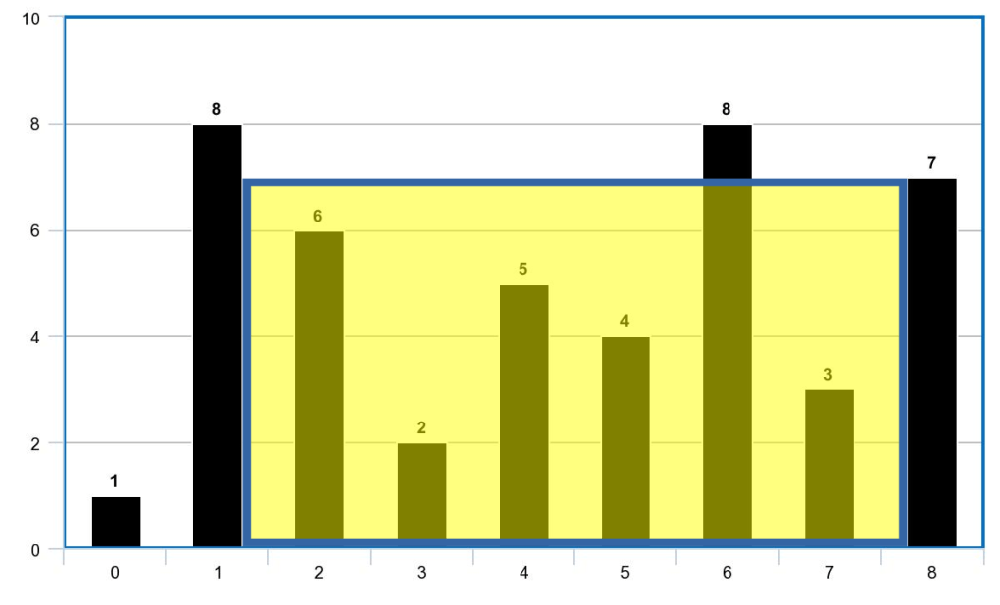

**Sorting | Recursion**

Make a **ZIP** file whose name is `<id>`.zip whereas `<id>` is your id (9 digits exactly).Example: **999666333.zip**

## **Question 1:** hw4q1.py

Write a **function**: `sort_by_nums(L)`

The function gets a list of strings as input argument. The function sorts the strings based on the number of digit characters they contain.

For example, given the list:

```python
['Hotpot at 21:00','9 lives', 'My Password: 123123', 'I have 333 cats', 'Partying 24/7', 'Argentina 2:0 Indonesia']
```

After running the function with the list, it will be modified as follows:

```python
['9 lives', 'Argentina 2:0 Indonesia', 'I have 333 cats', 'Partying 24/7', 'Hotpot at 21:00', 'My Password: 123123']
```

Requirement: **O(nlogn)** time complexity given n=len(L).

**Notes**:

1. Use Python sort() method or sorted() function.
2. The function sort_by_nums does not return any value! It modifies the list L in place.

```python
# 定义函数sort_by_nums，参数是列表L
def sort_by_nums(L):
    # 对列表L进行排序。使用lambda匿名函数作为键函数，该函数接收字符串s作为输入。
    # 键函数的作用是对每个字符串s中的每个字符c进行检查，如果c是数字（即c.isdigit()返回True），则在总和中加1。
    # 这样，键函数的结果就是字符串s中的数字字符数量，我们根据这个数量对列表进行排序。
    L.sort(key=lambda s: sum(c.isdigit() for c in s))

# 测试函数
# 定义一个包含字符串的列表
L = ['Hotpot at 21:00','9 lives', 'My Password: 123123', 'I have 333 cats', 'Partying 24/7', 'Argentina 2:0 Indonesia']
# 调用函数，将列表L作为参数。由于sort()函数就地修改列表，所以无需将结果赋值给新变量。
sort_by_nums(L)
# 打印排序后的列表
print(L)
```

```python
# 定义一个函数，这个函数计算一个字符串中数字字符的数量
def count_digits(s):
    # 初始化计数器为0
    count = 0
    # 对字符串中的每个字符进行迭代
    for c in s:
        # 如果字符是数字，就增加计数器
        if c.isdigit():
            count += 1
    # 返回数字字符的数量
    return count

# 定义函数 sort_by_nums，参数是列表 L
def sort_by_nums(L):
    # 使用定义的键函数对列表进行排序
    L.sort(key=count_digits)

# 测试函数
L = ['Hotpot at 21:00','9 lives', 'My Password: 123123', 'I have 333 cats', 'Partying 24/7', 'Argentina 2:0 Indonesia']
sort_by_nums(L)
print(L)

```


## Question 2: hw4q2.py

You are given a list H that is composed of positive integer numbers.

The list H represents column heights. Each pair of columns can hold water up to the height of the smaller column.

We define the area of water to be the minimum between two heights multiplied by the distance between them.

For example, given the heights: H = [3,5,1,2]

The area of water between columns with height 5 and 2:

`min(5,2) * (5-2) = 2 * 3 = 6`

Another example:

> 给定一个由正整数构成的列表H。
>
> 列表H表示列的高度。每对列可以容纳的水的高度取决于较低的列的高度。
>
> 我们定义水的面积为两个高度中较小的高度乘以它们之间的距离。
>
> 例如，给定高度：H = [3,5,1,2]
>
> 高度为5和2之间的水面积：
>
> `min(5,2) * (5-2) = 2 * 3 = 6`
>
> 另一个例子：



`H = [1,8,6,2,5,4,8,3,7]`

The area of water between H[1] and H[8]:

`min(8,7) * (8-1) = 8 * 7 = 56`

Write a function: **get_largest_container(H)**

The function returns the maximum area of water that can be held given column heights H.

Requirement: **O(n)** time complexity given n=len(H)

> `H = [1,8,6,2,5,4,8,3,7]`
>
> H[1] 和 H[8] 之间的水面积：
>
> `min(8,7) * (8-1) = 8 * 7 = 56`
>
> 编写一个函数：**get_largest_container(H)**
>
> 该函数返回给定列高度 H 所能容纳的最大水面积。
>
> 要求：给定 n=len(H)，时间复杂度为 **O(n)**。
>

## Question 3: hw4q3.py

Write a **recursive** function: **unify(L1,L2)**

The function gets two lists L1,L2 as parameters. The function returns a new list in which we take every time the next element from L1, then the next element from L2. The lists may have different lengths (or empty) and can include numbers or strings.

Examples:

| L1               | L2              | return                |
| ---------------- | --------------- | --------------------- |
| **[1,2,3,4]**    | **[5,6,7,8]**   | **[1,5,2,6,3,7,4,8]** |
| **[]**           | **[]**          | **[]**                |
| **[1, 0, 1, 0]** | **[]**          | **[1, 0, 1, 0]**      |
| **[3,3,3]**      | **[6,6,6,6,6]** | **[3,6,3,6,3,6,6,6]** |

Requirement: The function must be **recursive**. Loops are not allowed.

```python
def unify(L1, L2):
    # 基础情况：如果两个列表都为空，返回一个空列表
    if not L1 and not L2:
        return []
    # 如果L1不为空但L2为空，返回L1
    elif L1 and not L2:
        return [L1[0]] + unify(L1[1:], L2)
    # 如果L2不为空但L1为空，返回L2
    elif L2 and not L1:
        return [L2[0]] + unify(L1, L2[1:])
    # 如果两个列表都不为空，交替使用它们
    else:
        return [L1[0], L2[0]] + unify(L1[1:], L2[1:])

```

首先，递归需要基本的递归终止条件，也就是当列表 L1 和 L2 都为空时，我们返回一个空列表。这是因为如果我们要将两个空列表合并，结果也应该是空的。

接下来，我们需要处理其他三种可能的情况：

1. L1 不为空，但 L2 为空：在这种情况下，我们只需要返回 L1 的内容。因此，我们获取 L1 的第一个元素，并递归地对 L1 的剩余部分和空的 L2 调用 unify 函数。

2. L2 不为空，但 L1 为空：这与上面的情况相反，我们只需要返回 L2 的内容。我们获取 L2 的第一个元素，并递归地对空的 L1 和 L2 的剩余部分调用 unify 函数。

3. L1 和 L2 都不为空：在这种情况下，我们需要交替获取每个列表的元素。所以我们获取 L1 的第一个元素和 L2 的第一个元素，然后递归地对每个列表的剩余部分调用 unify 函数。

以下是对应的 Python 代码：

```python
def unify(L1, L2):
    # 基本情况：如果两个列表都为空，返回一个空列表
    if not L1 and not L2:
        return []
    # 如果 L1 不为空但 L2 为空，返回 L1
    elif L1 and not L2:
        return [L1[0]] + unify(L1[1:], L2)
    # 如果 L2 不为空但 L1 为空，返回 L2
    elif L2 and not L1:
        return [L2[0]] + unify(L1, L2[1:])
    # 如果两个列表都不为空，交替选择它们的元素
    else:
        return [L1[0], L2[0]] + unify(L1[1:], L2[1:])
```

## Question 4: hw4q4.py

We define a number to be “special” if all its digits are also factors of the number.

For example:

- The number 124 is special: 124%4 = 0, 124%2 = 0, 124%1 = 0
- The number 125 is not special: 125%2≠0

Write a **recursive function**: `is_special(num, i)`

The function gets an integer num and checks if the number is special.

Requirement: The function must be **recursive**. Loops are not allowed.

**Notes**:

1. Think how to use the extra parameter i to access digits of num throughout the recursive calls.
2. Assume the digit 0 does not appear in num.

```python
# 递归函数用于检查一个数是否是特殊的
def is_special(num, i):
    if i == 0:   # 如果已经检查完所有的数字，返回True
        return True
    else:
        digit = num % 10  # 计算数字的最后一个数
        if num % digit != 0:  # 如果num不能被其各个位数上的数字整除，返回False
            return False
        else:
            # 如果可以被整除，继续递归调用，去掉最后一个数，继续检查剩下的数
            return is_special(num // 10, i-1)  

# 函数用于计算一个数字的位数
def count_digits(num):
    if num == 0:  # 如果数字为0，位数为0
        return 0
    else:
        # 如果不为0，返回1（自身）加上去掉最后一位数后的数字的位数
        return 1 + count_digits(num // 10)

# 用count_digits函数确定递归调用is_special的次数
num = 124
print(is_special(num, count_digits(num)))  # 输出：True，因为124是特殊的

```


::: details 公众号：AI悦创【二维码】


:::

::: info AI悦创·编程一对一

AI悦创·推出辅导班啦，包括「Python 语言辅导班、C++ 辅导班、java 辅导班、算法/数据结构辅导班、少儿编程、pygame 游戏开发、Web、Linux」，全部都是一对一教学：一对一辅导 + 一对一答疑 + 布置作业 + 项目实践等。当然，还有线下线上摄影课程、Photoshop、Premiere 一对一教学、QQ、微信在线，随时响应！微信：Jiabcdefh

C++ 信息奥赛题解，长期更新！长期招收一对一中小学信息奥赛集训，莆田、厦门地区有机会线下上门，其他地区线上。微信：Jiabcdefh

方法一：[QQ](http://wpa.qq.com/msgrd?v=3&uin=1432803776&site=qq&menu=yes)

方法二：微信：Jiabcdefh

:::


