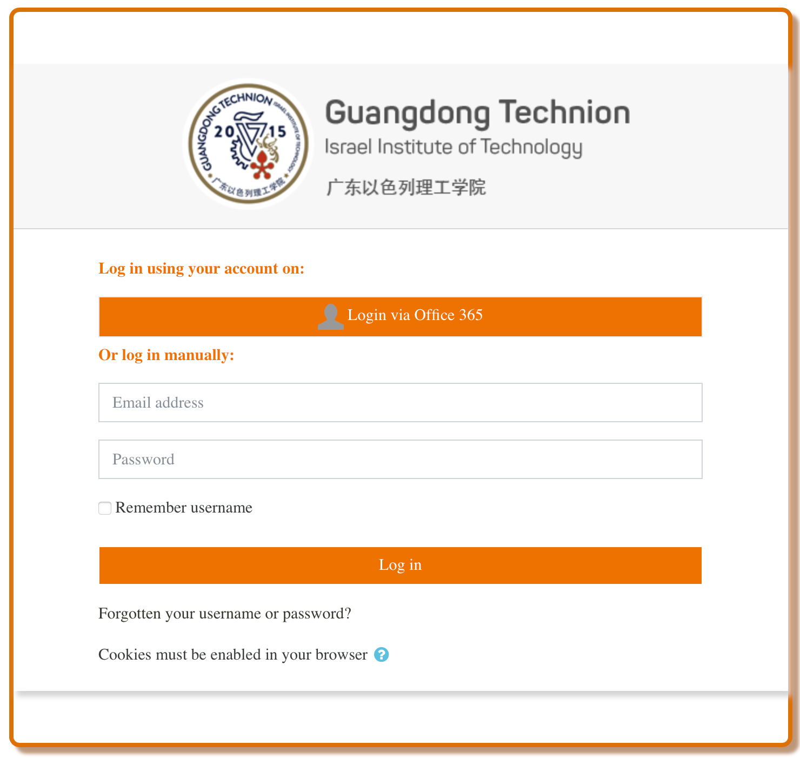

## Is this your first time here?

**Welcome to GTIIT Moodle Learning Management System!**

Please login with GTIIT email address and your password.

Should you have question about course information, please email Undergraduate Studies us@gtiit.edu.cn.

If you encounter login issue, please submit ticket at https://helpdesk.gtiit.edu.cn.

## 234128 - INTRODUCTION TO COMPUTING WITH PYTHON - Winter 2022

    - GTIIT Moodle
    - 广东以色列理工学院
    - Guangdong Technion-Israel Institute of Technology